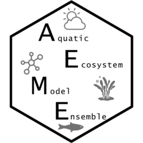

<!-- README.md is generated from README.Rmd. Please edit that file -->

```{r, include = FALSE}
knitr::opts_chunk$set(
  collapse = TRUE,
  comment = "#>",
  fig.path = "man/figures/README-",
  out.width = "100%"
)
```

# AEME <a href="https://expert-guide-29ve1vw.pages.github.io/"></a>

<!-- badges: start -->

[](https://lifecycle.r-lib.org/articles/stages.html#experimental)
[](https://github.com/limnotrack/AEME/actions/workflows/R-CMD-check.yaml)
[](https://github.com/limnotrack/AEME/actions/workflows/pkgdown.yaml)
[](https://app.codecov.io/gh/limnotrack/AEME?branch=main)

<!-- badges: end -->

The Aquatic Ecosystem Model Ensemble (AEME) package allows you to setup
and run an ensemble of aquatic ecosystem models. The models are
[DYRESM-CAEDYM](), [GLM-AED]() and [GOTM-WET]().

## Installation

You can install the development version of AEME from
[GitHub](https://github.com/) with:

``` r
# install.packages("devtools")
devtools::install_github("limnotrack/AEME")
```

## Example

This is a basic example which shows you how to build and run one of the
models in the ensemble:

```{r example}
library(AEME)
## basic example code
tmpdir <- tempdir()
aeme_dir <- system.file("extdata/lake/", package = "AEME")
# Copy files from package into tempdir
file.copy(aeme_dir, tmpdir, recursive = TRUE)
path <- file.path(tmpdir, "lake")
aeme_data <- yaml_to_aeme(path = path, "aeme.yaml")
mod_ctrls <- read.csv(file.path(path, "model_controls.csv"))
inf_factor = c("dy_cd" = 1, "glm_aed" = 1, "gotm_wet" = 1)
outf_factor = c("dy_cd" = 1, "glm_aed" = 1, "gotm_wet" = 1)
model <- c("dy_cd", "glm_aed", "gotm_wet")
aeme_data <- build_ensemble(path = path, aeme_data = aeme_data, model = model, mod_ctrls = mod_ctrls, inf_factor = inf_factor, ext_elev = 5, use_bgc = TRUE, use_lw = TRUE)
aeme_data <- run_aeme(aeme_data = aeme_data, model = model, verbose = FALSE, path = path, parallel = TRUE, mod_ctrls = mod_ctrls)
```

The model input and output (I/O) is handled as it's own S4 object of
class `aeme`. This allows for the standardisation and generalisation of
functions for this class alongside ensuring integrity and validity to
it's structure.

```{r}
class(aeme_data)
```

This allows for easier handling of the model output data within our
structure and allows for condensed output to be printed to the console:

```{r}
aeme_data
```

Summarised easily:

```{r}
summary(aeme_data)
```

Model data can be visualised easily using the `plot_output()` function

```{r, label="plot_output",echo=TRUE,results="hide",fig.keep="all",fig.height=7}
plot_list <- plot_output(aeme_data = aeme_data, model = model, var_sim = "HYD_temp", 
                         level = TRUE, label = TRUE, var_lims = c(9, 30), print_plots = FALSE)

library(ggpubr)

ggarrange(plotlist = plot_list, ncol = 1, common.legend = TRUE, legend = "right")

```
Also, visualising lake level plots.

```{r, label="plot-output-DEPTH",echo=TRUE,results="hide",fig.keep="all",fig.height=5}
plot_list <- plot_output(aeme_data = aeme_data, model = model, 
                         var_sim = "HYD_wlev", level = TRUE, label = TRUE,
                         var_lims = c(9, 30), print_plots = FALSE)
plot_list


```
