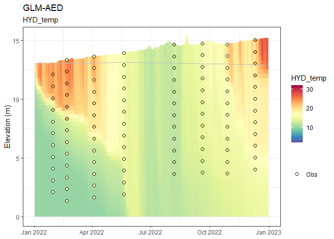

<!-- README.md is generated from README.Rmd. Please edit that file -->

# AEME

<!-- badges: start -->

[](https://lifecycle.r-lib.org/articles/stages.html#experimental)
[](https://github.com/limnotrack/AEME/actions/workflows/R-CMD-check.yaml)
[](https://github.com/limnotrack/AEME/actions/workflows/pkgdown.yaml)
[](https://app.codecov.io/gh/limnotrack/AEME?branch=main)

<!-- badges: end -->

The Aquatic Ecosystem Model Ensemble (AEME) package allows you to setup
and run an ensemble of aquatic ecosystem models. The models are
[DYRESM-CAEDYM](), [GLM-AED]() and [GOTM-WET]().

## Installation

You can install the development version of AEME from
[GitHub](https://github.com/) with:

``` r
# install.packages("devtools")
devtools::install_github("limnotrack/AEME")
```

## Example

This is a basic example which shows you how to build and run one of the
models in the ensemble:

``` r
library(AEME)
#> The legacy packages maptools, rgdal, and rgeos, underpinning the sp package,
#> which was just loaded, will retire in October 2023.
#> Please refer to R-spatial evolution reports for details, especially
#> https://r-spatial.org/r/2023/05/15/evolution4.html.
#> It may be desirable to make the sf package available;
#> package maintainers should consider adding sf to Suggests:.
#> The sp package is now running under evolution status 2
#>      (status 2 uses the sf package in place of rgdal)
#> Warning: replacing previous import 'stats::filter' by 'dplyr::filter' when
#> loading 'gotmtools'
#> Please note that 'maptools' will be retired during October 2023,
#> plan transition at your earliest convenience (see
#> https://r-spatial.org/r/2023/05/15/evolution4.html and earlier blogs
#> for guidance);some functionality will be moved to 'sp'.
#>  Checking rgeos availability: FALSE
#> 
#> Attaching package: 'AEME'
#> The following object is masked from 'package:stats':
#> 
#>     time
## basic example code
tmpdir <- tempdir()
aeme_dir <- system.file("extdata/lake/", package = "AEME")
# Copy files from package into tempdir
file.copy(aeme_dir, tmpdir, recursive = TRUE)
#> [1] TRUE
path <- file.path(tmpdir, "lake")
aeme_data <- yaml_to_aeme(path = path, "aeme.yaml")
#> Linking to GEOS 3.11.2, GDAL 3.6.2, PROJ 9.2.0; sf_use_s2() is FALSE
#> Warning in aeme_constructor(lake = yaml$lake, catchment = yaml$catchment, : Lake area [152343 m2] is different to the area calculated from the lake
#> shape [152433.09 m2].
#> Calculating catchment area from catchment shape:
#>    4989125.27 m2
mod_ctrls <- read.csv(file.path(path, "model_controls.csv"))
inf_factor = c("glm_aed" = 1)
outf_factor = c("glm_aed" = 1)
model <- c("glm_aed")
build_ensemble(path = path, aeme_data = aeme_data, model = model,
               mod_ctrls = mod_ctrls, inf_factor = inf_factor, ext_elev = 5,
               use_bgc = TRUE, use_lw = TRUE)
#> Building simulation for Wainamu [2023-08-25 17:28:54.24887]
#> Spherical geometry (s2) switched off
#> Spherical geometry (s2) switched on
#> Building GLM3-AED2 model for lake wainamu
#> Copied in GLM nml file
#> Copied in AED nml file
#>    oxy_initial   = 625 replaced with 312.5
#>    frp_initial = 0.3229 replaced with 0.3229
#>      dop_initial  = 0.3229 replaced with 0.3229
#>      pop_initial  = 0.3229 replaced with 0.3229
#>    amm_initial = 1.4279 replaced with 1.4279
#>    nit_initial = 1.0709 replaced with 1.0709
#>      don_initial  = 21.4183 replaced with 21.4183
#>      pon_initial  = 7.1394 replaced with 7.1394
#>      doc_initial  = 41.6285 replaced with 41.6285
#>      poc_initial  = 16.6514 replaced with 16.6514
#>    rsi_initial = 1 replaced with 1
#> PHY_cyano 0.24022 replaced with 0.24022
#> PHY_green 0.300275 replaced with 0.300275
#> PHY_diatom 0.300275 replaced with 0.300275
#>     ss_initial   = 3,3 replaced with 3,
run_aeme(aeme_data = aeme_data, model = model, verbose = FALSE, path = path)
#> Running models... (Have you tried parallelizing?) [2023-08-25 17:28:54.827439]
#> GLM-AED run successful! [2023-08-25 17:28:59.933883]
#> Model run complete![2023-08-25 17:28:59.934885]
```

The model input and output (I/O) is handled as it’s own S4 object of
class `aeme`. This allows for the standardisation and generalisation of
functions for this class alongside ensuring integrity and validity to
it’s structure.

``` r
class(aeme_data)
#> [1] "aeme"
#> attr(,"package")
#> [1] "AEME"
```

This allows for easier handling of the model output data within our
structure and allows for loading of the model output into the `aeme`
object.

``` r
aeme_data <- load_output(model = model, aeme_data = aeme_data, path = path,
                          mod_ctrls = mod_ctrls, parallel = FALSE)
#> Retrieving and formatting temp for model glm_aed
#> Retrieving and formatting salt for model glm_aed
#> Retrieving and formatting OXY_oxy for model glm_aed
#> Retrieving and formatting PHS_frp for model glm_aed
#> Retrieving and formatting OGM_dop for model glm_aed
#> Retrieving and formatting OGM_pop for model glm_aed
#> Retrieving and formatting PHS_frp_ads for model glm_aed
#> Retrieving and formatting TOT_tp for model glm_aed
#> Retrieving and formatting NIT_amm for model glm_aed
#> Retrieving and formatting NIT_nit for model glm_aed
#> Retrieving and formatting OGM_don for model glm_aed
#> Retrieving and formatting OGM_pon for model glm_aed
#> Retrieving and formatting TOT_tn for model glm_aed
#> Retrieving and formatting OGM_doc for model glm_aed
#> Retrieving and formatting OGM_poc for model glm_aed
#> Retrieving and formatting SIL_rsi for model glm_aed
#> Retrieving and formatting PHY_cyano for model glm_aed
#> Retrieving and formatting PHY_green for model glm_aed
#> Retrieving and formatting PHY_diatom for model glm_aed
#> Retrieving and formatting PHY_TCHLA for model glm_aed
#> Retrieving and formatting NCS_ss1 for model glm_aed
```

This object can be be printed to the console:

``` r
aeme_data
#>      AEME 
#> -------------------------------------------------------------------
#>   Lake
#> Wainamu (ID: 45819); Lat: -36.89; Lon: 174.47; Elev: 23.64m; Depth: 13.07m;
#> Area: 152343m2; Shape file: Present
#> -------------------------------------------------------------------
#>   Catchment 
#> Name: Wainamu; Area: 4989125
#> -------------------------------------------------------------------
#>   Time
#> Start: 2022-01-01 Stop: 2022-12-31 Time step: 3600
#> -------------------------------------------------------------------
#>   Observations
#> Lake: Present; Level: Present
#> -------------------------------------------------------------------
#>   Input
#> Inital profile: Absent; Hypsograph: Present; Meteo: Present;
#> Use longwave: TRUE; Kw: 0.98
#> -------------------------------------------------------------------
#>   Inflows
#> Data: Present; Scaling factors: DY-CD: 1; GLM-AED: 1; GOTM-WET: 1
#> -------------------------------------------------------------------
#>   Outflows
#> Data: Present; Scaling factors: DY-CD: 1; GLM-AED: 1; GOTM-WET: 1
#> -------------------------------------------------------------------
#>   Output: 
#> DY-CD: Absent
#> GLM-AED: Present
#> GOTM-WET: Absent
```

Summarised easily:

``` r
summary(aeme_data)
#> Lake observations:
#>       LID            lake             id_station      station         
#>  Min.   :45819   Length:5531        Min.   :44616   Length:5531       
#>  1st Qu.:45819   Class :character   1st Qu.:44616   Class :character  
#>  Median :45819   Mode  :character   Median :44616   Mode  :character  
#>  Mean   :45819                      Mean   :44616                     
#>  3rd Qu.:45819                      3rd Qu.:44616                     
#>  Max.   :45819                      Max.   :44648                     
#>       Date              depth_from        depth_to          var           
#>  Min.   :1991-05-25   Min.   : 0.000   Min.   : 0.000   Length:5531       
#>  1st Qu.:2006-03-05   1st Qu.: 2.000   1st Qu.: 2.000   Class :character  
#>  Median :2012-04-14   Median : 5.000   Median : 5.000   Mode  :character  
#>  Mean   :2011-11-26   Mean   : 5.008   Mean   : 5.008                     
#>  3rd Qu.:2019-04-20   3rd Qu.: 8.000   3rd Qu.: 8.000                     
#>  Max.   :2024-06-09   Max.   :15.000   Max.   :15.000                     
#>      value            units           flag_detection
#>  Min.   :  0.000   Length:5531        Mode:logical  
#>  1st Qu.:  0.070   Class :character   NA's:5531     
#>  Median :  5.500   Mode  :character                 
#>  Mean   :  7.047                                    
#>  3rd Qu.: 13.085                                    
#>  Max.   :101.000                                    
#> -------------------------------------------------------------------
#> Lake level:
#>       Date                lvlwtr     
#>  Min.   :2018-12-31   Min.   :23.57  
#>  1st Qu.:2020-03-31   1st Qu.:23.59  
#>  Median :2021-06-30   Median :23.64  
#>  Mean   :2021-06-30   Mean   :23.64  
#>  3rd Qu.:2022-09-29   3rd Qu.:23.69  
#>  Max.   :2023-12-30   Max.   :23.71  
#> -------------------------------------------------------------------
#> Meteorology:
#>       Date              MET_wnduvu          MET_wnduvv         MET_tmpdew    
#>  Min.   :2022-01-01   Min.   :-11.16345   Min.   :-10.2845   Min.   : 1.718  
#>  1st Qu.:2022-04-02   1st Qu.: -2.98211   1st Qu.: -3.0025   1st Qu.:10.036  
#>  Median :2022-07-02   Median : -0.30557   Median : -0.1780   Median :12.635  
#>  Mean   :2022-07-02   Mean   :  0.01658   Mean   : -0.1501   Mean   :12.528  
#>  3rd Qu.:2022-10-01   3rd Qu.:  2.90679   3rd Qu.:  2.7472   3rd Qu.:15.097  
#>  Max.   :2022-12-31   Max.   : 12.76652   Max.   : 10.1251   Max.   :22.409  
#>    MET_tmpair       MET_ppsnow   MET_prsttn       MET_radswd    
#>  Min.   : 8.992   Min.   :0    Min.   : 98829   Min.   : 37.76  
#>  1st Qu.:13.974   1st Qu.:0    1st Qu.:100492   1st Qu.:114.64  
#>  Median :16.234   Median :0    Median :101065   Median :180.01  
#>  Mean   :16.433   Mean   :0    Mean   :100999   Mean   :187.23  
#>  3rd Qu.:19.273   3rd Qu.:0    3rd Qu.:101472   3rd Qu.:255.27  
#>  Max.   :24.478   Max.   :0    Max.   :103178   Max.   :376.33  
#>    MET_radlwd      MET_pprain     
#>  Min.   :280.2   Min.   : 0.0000  
#>  1st Qu.:326.3   1st Qu.: 0.2425  
#>  Median :343.1   Median : 1.4569  
#>  Mean   :343.8   Mean   : 6.3316  
#>  3rd Qu.:360.2   3rd Qu.: 8.1555  
#>  Max.   :426.2   Max.   :61.4505  
#> -------------------------------------------------------------------
#> Inflows:
#>    FWMT 
#>       Date               HYD_flow           HYD_temp        CHM_salt
#>  Min.   :2018-12-31   Min.   :   111.7   Min.   :10.00   Min.   :0  
#>  1st Qu.:2020-03-31   1st Qu.:  1430.2   1st Qu.:11.47   1st Qu.:0  
#>  Median :2021-06-30   Median :  4677.8   Median :15.00   Median :0  
#>  Mean   :2021-06-30   Mean   :  9748.9   Mean   :15.00   Mean   :0  
#>  3rd Qu.:2022-09-29   3rd Qu.: 11403.0   3rd Qu.:18.52   3rd Qu.:0  
#>  Max.   :2023-12-30   Max.   :247783.4   Max.   :20.00   Max.   :0  
#>     CHM_oxy          PHS_frp             PHS_dop             PHS_pop         
#>  Min.   : 9.234   Min.   :3.235e-05   Min.   :1.532e-06   Min.   :6.127e-06  
#>  1st Qu.: 9.513   1st Qu.:4.099e-04   1st Qu.:1.514e-05   1st Qu.:6.056e-05  
#>  Median :10.240   Median :1.024e-03   Median :4.051e-05   Median :1.621e-04  
#>  Mean   :10.292   Mean   :3.732e-03   Mean   :1.441e-04   Mean   :5.766e-04  
#>  3rd Qu.:11.073   3rd Qu.:4.334e-03   3rd Qu.:1.693e-04   3rd Qu.:6.772e-04  
#>  Max.   :11.455   Max.   :4.642e-02   Max.   :1.746e-03   Max.   :6.983e-03  
#>     PHS_pip             NIT_amm             NIT_nit         
#>  Min.   :2.298e-05   Min.   :0.0002219   Min.   :2.014e-05  
#>  1st Qu.:2.271e-04   1st Qu.:0.0019064   1st Qu.:1.774e-04  
#>  Median :6.077e-04   Median :0.0040237   Median :4.139e-04  
#>  Mean   :2.162e-03   Mean   :0.0138761   Mean   :1.184e-03  
#>  3rd Qu.:2.539e-03   3rd Qu.:0.0129178   3rd Qu.:1.312e-03  
#>  Max.   :2.619e-02   Max.   :0.2016053   Max.   :4.289e-02  
#>     NIT_don             NIT_pon             CAR_doc         
#>  Min.   :0.0000785   Min.   :0.0001177   Min.   :0.0004457  
#>  1st Qu.:0.0006400   1st Qu.:0.0009599   1st Qu.:0.0036341  
#>  Median :0.0015013   Median :0.0022520   Median :0.0085254  
#>  Mean   :0.0043520   Mean   :0.0065279   Mean   :0.0247128  
#>  3rd Qu.:0.0052643   3rd Qu.:0.0078964   3rd Qu.:0.0298936  
#>  Max.   :0.0523152   Max.   :0.0784728   Max.   :0.2970757  
#>     CAR_poc             SIL_rsi      NCS_ss1            NCS_ss2    PHY_cyano  
#>  Min.   :0.0006686   Min.   :10   Min.   : 0.01773   Min.   :0   Min.   :0.1  
#>  1st Qu.:0.0054512   1st Qu.:10   1st Qu.: 0.16310   1st Qu.:0   1st Qu.:0.1  
#>  Median :0.0127881   Median :10   Median : 0.43163   Median :0   Median :0.1  
#>  Mean   :0.0370693   Mean   :10   Mean   : 1.38127   Mean   :0   Mean   :0.1  
#>  3rd Qu.:0.0448404   3rd Qu.:10   3rd Qu.: 1.11036   3rd Qu.:0   3rd Qu.:0.1  
#>  Max.   :0.4456136   Max.   :10   Max.   :48.38967   Max.   :0   Max.   :0.1  
#>    PHY_green     PHY_diatom 
#>  Min.   :0.1   Min.   :0.1  
#>  1st Qu.:0.1   1st Qu.:0.1  
#>  Median :0.1   Median :0.1  
#>  Mean   :0.1   Mean   :0.1  
#>  3rd Qu.:0.1   3rd Qu.:0.1  
#>  Max.   :0.1   Max.   :0.1  
#> -------------------------------------------------------------------
#> Outflows:
#>    outflow 
#>       Date               outflow         
#>  Min.   :2018-12-31   Min.   :     0.00  
#>  1st Qu.:2020-03-31   1st Qu.:    74.76  
#>  Median :2021-06-30   Median :  4509.66  
#>  Mean   :2021-06-30   Mean   :  9520.33  
#>  3rd Qu.:2022-09-29   3rd Qu.: 13446.05  
#>  Max.   :2023-12-30   Max.   :106553.81  
#>                       NA's   :4          
#> -------------------------------------------------------------------
#> Outputs:
#>    DY-CD 
#> Length  Class   Mode 
#>      0   NULL   NULL 
#>    GLM-AED 
#>       Date           DEPTH           HYD_V             HYD_A0      
#>  Min.   :18994   Min.   :13.06   Min.   :1102776   Min.   :152207  
#>  1st Qu.:19085   1st Qu.:13.67   1st Qu.:1197753   1st Qu.:158849  
#>  Median :19176   Median :14.39   Median :1316385   Median :166691  
#>  Mean   :19176   Mean   :14.24   Mean   :1293358   Mean   :165040  
#>  3rd Qu.:19266   3rd Qu.:14.81   3rd Qu.:1387598   3rd Qu.:171232  
#>  Max.   :19357   Max.   :15.38   Max.   :1486969   Max.   :177382  
#>     HYD_evap        HYD_evap_flux           HYD_Qe        HYD_evap_vol   
#>  Min.   :0.000000   Min.   :0.000e+00   Min.   :  0.00   Min.   :   0.0  
#>  1st Qu.:0.001185   1st Qu.:1.381e-08   1st Qu.: 33.59   1st Qu.: 193.0  
#>  Median :0.002211   Median :2.557e-08   Median : 62.84   Median : 366.8  
#>  Mean   :0.002610   Mean   :2.914e-08   Mean   : 74.01   Mean   : 428.1  
#>  3rd Qu.:0.003779   3rd Qu.:4.195e-08   3rd Qu.:107.42   3rd Qu.: 609.5  
#>  Max.   :0.008851   Max.   :9.443e-08   Max.   :251.93   Max.   :1471.5  
#>    HYD_precip         HYD_inflow        HYD_outflow           LAYERS       
#>  Min.   :0.000000   Min.   :0.000000   Min.   :0.000000   Min.   : 0.3266  
#>  1st Qu.:0.000240   1st Qu.:0.009021   1st Qu.:0.001728   1st Qu.: 3.7163  
#>  Median :0.001415   Median :0.026401   Median :0.025025   Median : 7.2800  
#>  Mean   :0.006342   Mean   :0.052899   Mean   :0.050734   Mean   : 7.2966  
#>  3rd Qu.:0.008172   3rd Qu.:0.064470   3rd Qu.:0.067903   3rd Qu.:10.8214  
#>  Max.   :0.061450   Max.   :0.683583   Max.   :0.331986   Max.   :15.3753  
#>      DEPTHS          HYD_temp        CHM_salt            CHM_oxy      
#>  Min.   : 0.000   Min.   :10.00   Min.   :0.000e+00   Min.   : 0.000  
#>  1st Qu.: 3.359   1st Qu.:12.08   1st Qu.:2.557e-05   1st Qu.: 5.098  
#>  Median : 6.926   Median :13.96   Median :5.924e-05   Median : 9.019  
#>  Mean   : 6.941   Mean   :14.63   Mean   :4.965e-05   Mean   : 7.255  
#>  3rd Qu.:10.473   3rd Qu.:16.54   3rd Qu.:6.736e-05   3rd Qu.: 9.865  
#>  Max.   :14.991   Max.   :28.00   Max.   :1.273e-04   Max.   :10.972  
#>     PHS_frp             PHS_dop            PHS_pop             PHS_pip         
#>  Min.   :0.0009848   Min.   :0.001112   Min.   :8.311e-06   Min.   :9.882e-05  
#>  1st Qu.:0.0013815   1st Qu.:0.002553   1st Qu.:9.251e-05   1st Qu.:2.580e-04  
#>  Median :0.0017797   Median :0.008237   Median :3.679e-04   Median :4.074e-04  
#>  Mean   :0.0043995   Mean   :0.007482   Mean   :6.702e-04   Mean   :1.096e-03  
#>  3rd Qu.:0.0060061   3rd Qu.:0.011931   3rd Qu.:7.880e-04   3rd Qu.:1.562e-03  
#>  Max.   :0.0501294   Max.   :0.014269   Max.   :9.849e-03   Max.   :1.486e-02  
#>      PHS_tp            NIT_amm            NIT_nit           NIT_don       
#>  Min.   :0.002722   Min.   :0.002226   Min.   :0.00000   Min.   :0.00000  
#>  1st Qu.:0.005722   1st Qu.:0.009472   1st Qu.:0.01026   1st Qu.:0.02405  
#>  Median :0.012347   Median :0.011443   Median :0.01853   Median :0.06958  
#>  Mean   :0.013644   Mean   :0.040024   Mean   :0.01947   Mean   :0.09610  
#>  3rd Qu.:0.016816   3rd Qu.:0.023349   3rd Qu.:0.02571   3rd Qu.:0.14167  
#>  Max.   :0.079939   Max.   :1.081944   Max.   :0.07259   Max.   :0.29977  
#>     NIT_pon              NIT_tn           CAR_doc            CAR_poc        
#>  Min.   :0.0001508   Min.   :0.02463   Min.   :0.004459   Min.   :0.001248  
#>  1st Qu.:0.0016809   1st Qu.:0.06911   1st Qu.:0.215843   1st Qu.:0.012062  
#>  Median :0.0054826   Median :0.12805   Median :0.479070   Median :0.034816  
#>  Mean   :0.0077978   Mean   :0.16350   Mean   :0.472392   Mean   :0.035828  
#>  3rd Qu.:0.0093873   3rd Qu.:0.20027   3rd Qu.:0.690628   3rd Qu.:0.049389  
#>  Max.   :0.0984666   Max.   :1.34540   Max.   :0.933909   Max.   :0.196599  
#>     SIL_rsi         PHY_cyano           PHY_green          PHY_diatom      
#>  Min.   : 1.013   Min.   :  0.06027   Min.   : 0.03000   Min.   : 0.03000  
#>  1st Qu.: 5.865   1st Qu.:  1.65211   1st Qu.: 0.04183   1st Qu.: 0.03000  
#>  Median : 9.770   Median :  5.66111   Median : 0.04881   Median : 0.03012  
#>  Mean   : 9.452   Mean   : 13.69257   Mean   : 1.32462   Mean   : 0.36634  
#>  3rd Qu.:10.959   3rd Qu.: 22.31242   3rd Qu.: 0.09753   3rd Qu.: 0.03243  
#>  Max.   :56.457   Max.   :105.24556   Max.   :61.60633   Max.   :19.57097  
#>    PHY_tchla           NCS_ss1      
#>  Min.   : 0.03249   Min.   :0.9353  
#>  1st Qu.: 0.46961   1st Qu.:1.7326  
#>  Median : 1.84746   Median :2.0732  
#>  Mean   : 3.77928   Mean   :2.2355  
#>  3rd Qu.: 6.01750   3rd Qu.:2.8077  
#>  Max.   :25.07452   Max.   :5.3546  
#>    GOTM-WET 
#> Length  Class   Mode 
#>      0   NULL   NULL 
#> -------------------------------------------------------------------
```

Model data can be visualised easily using the `plot_output()` function

    #> Warning: Using size for a discrete variable is not advised.


