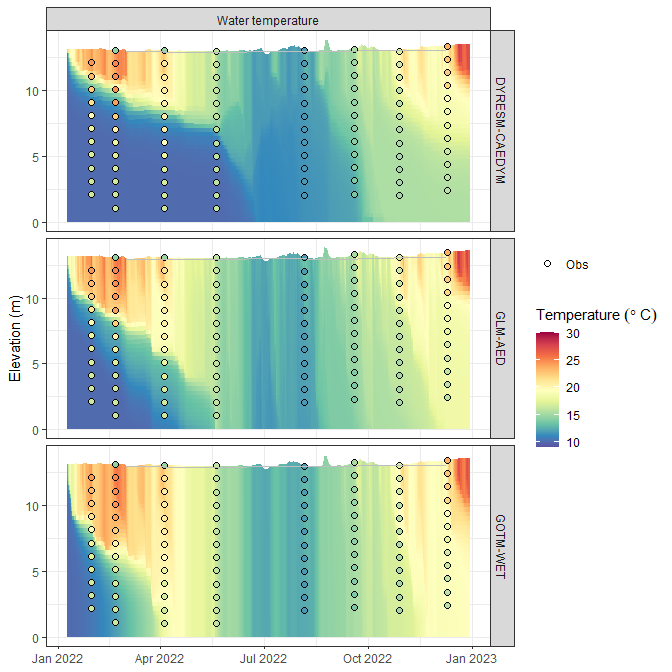
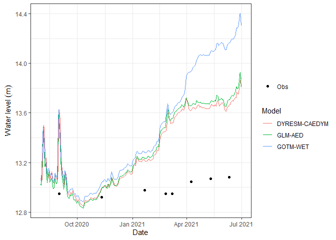

<!-- README.md is generated from README.Rmd. Please edit that file -->

# AEME <a href="https://expert-guide-29ve1vw.pages.github.io/"></a>

<!-- badges: start -->

[](https://lifecycle.r-lib.org/articles/stages.html#experimental)
[](https://github.com/limnotrack/AEME/actions/workflows/R-CMD-check.yaml)
[](https://github.com/limnotrack/AEME/actions/workflows/pkgdown.yaml)
[](https://app.codecov.io/gh/limnotrack/AEME?branch=main)

<!-- badges: end -->

The Aquatic Ecosystem Model Ensemble (AEME) package allows you to setup
and run an ensemble of aquatic ecosystem models. The models are
[DYRESM-CAEDYM](), [GLM-AED]() and [GOTM-WET]().

## Installation

You can install the development version of AEME from
[GitHub](https://github.com/) with:

``` r
# install.packages("devtools")
devtools::install_github("limnotrack/AEME")
```

## Example

This is a basic example which shows you how to build and run one of the
models in the ensemble:

``` r
library(AEME)
#> 
#> Attaching package: 'AEME'
#> The following object is masked from 'package:stats':
#> 
#>     time
## basic example code
tmpdir <- tempdir()
aeme_dir <- system.file("extdata/lake/", package = "AEME")
# Copy files from package into tempdir
file.copy(aeme_dir, tmpdir, recursive = TRUE)
#> [1] TRUE
path <- file.path(tmpdir, "lake")
aeme_data <- yaml_to_aeme(path = path, "aeme.yaml")
#> Linking to GEOS 3.11.2, GDAL 3.6.2, PROJ 9.2.0; sf_use_s2() is FALSE
#> Warning in aeme_constructor(lake = yaml$lake, time = yaml$time, configuration = yaml$configuration, : Lake area [152343 m2] is different to the area calculated from the lake
#> shape [152433.09 m2].
mod_ctrls <- read.csv(file.path(path, "model_controls.csv"))
inf_factor = c("dy_cd" = 1, "glm_aed" = 1, "gotm_wet" = 1)
outf_factor = c("dy_cd" = 1, "glm_aed" = 1, "gotm_wet" = 1)
model <- c("dy_cd", "glm_aed", "gotm_wet")
aeme_data <- build_ensemble(path = path, aeme_data = aeme_data, model = model,
                            mod_ctrls = mod_ctrls, inf_factor = inf_factor, 
                            ext_elev = 5, use_bgc = TRUE)
#> Building simulation for Wainamu [2023-11-15 12:29:07.677313]
#> Using observed water level
#> Missing values in observed water level
#> Using optimisation function
#> Calculating outflow with an estimated water balance using lake level,
#> inflow data (if present) and estimated evaporation rates.
#> Calculating lake level using lake depth and a sinisoidal function.
#> Observed lake level is present. Updating initial lake model depth...
#> Building DYRESM-CAEDYM for lake wainamu
#> Copied in DYRESM par file
#> Writing DYRESM configuration
#> [1] "TEMPTURE SALINITY DO PO4 DOPL POPL PIP TP NH4 NO3 DONL PONL TN DOCL POCL SiO2 CYANO CHLOR FDIAT TCHLA SSOL1"
#> Writing DYRESM control file
#> Downsampling bathymetry
#> Building GLM3-AED2 model for lake wainamu
#> Copied in GLM nml file
#> Copied in AED nml file
#>    oxy_initial   = 625 replaced with 312.5
#>    frp_initial = 0.3229 replaced with 0.3229
#>      dop_initial  = 0.3229 replaced with 0.3229
#>      pop_initial  = 0.3229 replaced with 0.3229
#>    amm_initial = 1.4279 replaced with 1.4279
#>    nit_initial = 1.0709 replaced with 1.0709
#>      don_initial  = 21.4183 replaced with 21.4183
#>      pon_initial  = 7.1394 replaced with 7.1394
#>      doc_initial  = 41.6285 replaced with 41.6285
#>      poc_initial  = 16.6514 replaced with 16.6514
#>    rsi_initial = 1 replaced with 1
#> PHY_cyano 0.24022 replaced with 0.24022
#> PHY_green 0.300275 replaced with 0.300275
#> PHY_diatom 0.300275 replaced with 0.300275
#>     ss_initial   = 3,3 replaced with 3,
#> Building GOTM-WET for lake wainamu
#> Copied all GOTM configuration files
aeme_data <- run_aeme(aeme_data = aeme_data, model = model, verbose = FALSE, 
                      path = path, parallel = TRUE, mod_ctrls = mod_ctrls)
#> Running models in parallel... [2023-11-15 12:29:10.415701]
#> Model run complete![2023-11-15 12:31:25.462804]
#> Reading models in parallel... [2023-11-15 12:31:26.667304]
#> Model reading complete![2023-11-15 12:31:28.732729]
```

The model input and output (I/O) is handled as it’s own S4 object of
class `aeme`. This allows for the standardisation and generalisation of
functions for this class alongside ensuring integrity and validity to
it’s structure.

``` r
class(aeme_data)
#> [1] "aeme"
#> attr(,"package")
#> [1] "AEME"
```

This allows for easier handling of the model output data within our
structure and allows for condensed output to be printed to the console:

``` r
aeme_data
#>             AEME 
#> -------------------------------------------------------------------
#>   Lake
#> Wainamu (ID: 45819); Lat: -36.89; Lon: 174.47; Elev: 23.64m; Depth: 13.07m;
#> Area: 152343 m2; Shape file: Present
#> -------------------------------------------------------------------
#>   Time
#> Start: 2022-01-09 Stop: 2022-12-30 Time step: 3600
#> -------------------------------------------------------------------
#>   Configuration
#>           Physical   |   Biogeochemical
#> DY-CD    : Present    |   Present
#> GLM-AED  : Present    |   Present
#> GOTM-WET : Present    |   Present
#> -------------------------------------------------------------------
#>   Observations
#> Lake: Present; Level: Present
#> -------------------------------------------------------------------
#>   Input
#> Inital profile: Present; Inital depth: 13.14m; Hypsograph: Present (n=132);
#> Meteo: Present; Use longwave: TRUE; Kw: 0.98
#> -------------------------------------------------------------------
#>   Inflows
#> Data: Present; Scaling factors: DY-CD: 1; GLM-AED: 1; GOTM-WET: 1
#> -------------------------------------------------------------------
#>   Outflows
#> Data: Present; Scaling factors: DY-CD: 1; GLM-AED: 1; GOTM-WET: 1
#> -------------------------------------------------------------------
#>   Outflows
#> Data: Present; Scaling factors: DY-CD: 1; GLM-AED: 1; GOTM-WET: 1
#> -------------------------------------------------------------------
#>   Water balance
#> Use: obs; Modelled: Absent; Water balance: Present
#> -------------------------------------------------------------------
#>   Output: 
#> DY-CD: Present
#> GLM-AED: Present
#> GOTM-WET: Present
```

Model data can be visualised easily using the `plot_output()` function

``` r
p1 <- plot_output(aeme_data = aeme_data, model = model, var_sim = "HYD_temp", 
                  level = TRUE, label = TRUE, var_lims = c(9, 30), 
                  print_plots = FALSE)
p1
#> Warning: Using size for a discrete variable is not advised.
#> Warning: Removed 80 rows containing missing values (`geom_col()`).
```


Also, visualising lake level plots.

``` r
p2 <- plot_output(aeme_data = aeme_data, model = model,  
                         var_sim = "LKE_lvlwtr", level = TRUE, label = TRUE,
                         var_lims = c(9, 30), print_plots = FALSE, 
                         facet = FALSE)
p2
```


