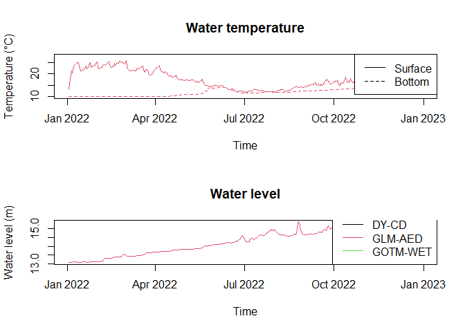

<!-- README.md is generated from README.Rmd. Please edit that file -->

# AEME

<!-- badges: start -->

[](https://lifecycle.r-lib.org/articles/stages.html#experimental)
[](https://github.com/limnotrack/AEME/actions/workflows/R-CMD-check.yaml)
[](https://github.com/limnotrack/AEME/actions/workflows/pkgdown.yaml)
[](https://app.codecov.io/gh/limnotrack/AEME?branch=main)

<!-- badges: end -->

The Aquatic Ecosystem Model Ensemble (AEME) package allows you to setup
and run an ensemble of aquatic ecosystem models. The models are
[DYRESM-CAEDYM](), [GLM-AED]() and [GOTM-WET]().

## Installation

You can install the development version of AEME from
[GitHub](https://github.com/) with:

``` r
# install.packages("devtools")
devtools::install_github("limnotrack/AEME")
```

## Example

This is a basic example which shows you how to build and run one of the
models in the ensemble:

``` r
library(AEME)
#> The legacy packages maptools, rgdal, and rgeos, underpinning the sp package,
#> which was just loaded, will retire in October 2023.
#> Please refer to R-spatial evolution reports for details, especially
#> https://r-spatial.org/r/2023/05/15/evolution4.html.
#> It may be desirable to make the sf package available;
#> package maintainers should consider adding sf to Suggests:.
#> The sp package is now running under evolution status 2
#>      (status 2 uses the sf package in place of rgdal)
#> Warning: replacing previous import 'stats::filter' by 'dplyr::filter' when
#> loading 'gotmtools'
#> Please note that 'maptools' will be retired during October 2023,
#> plan transition at your earliest convenience (see
#> https://r-spatial.org/r/2023/05/15/evolution4.html and earlier blogs
#> for guidance);some functionality will be moved to 'sp'.
#>  Checking rgeos availability: FALSE
#> 
#> Attaching package: 'AEME'
#> The following object is masked from 'package:stats':
#> 
#>     time
## basic example code
tmpdir <- tempdir()
aeme_dir <- system.file("extdata/lake/", package = "AEME")
# Copy files from package into tempdir
file.copy(aeme_dir, tmpdir, recursive = TRUE)
#> [1] TRUE
path <- file.path(tmpdir, "lake")
aeme_data <- yaml_to_aeme(path = path, "aeme.yaml")
mod_ctrls <- read.csv(file.path(path, "model_controls.csv"))
inf_factor = c("glm_aed" = 1)
outf_factor = c("glm_aed" = 1)
model <- c("glm_aed")
build_ensemble(path = path, aeme_data = aeme_data, model = model,
               mod_ctrls = mod_ctrls, inf_factor = inf_factor, ext_elev = 5,
               use_bgc = FALSE, use_lw = TRUE)
#> Building simulation for Wainamu [2023-08-24 16:56:23.817401]
#> Spherical geometry (s2) switched off
#> Spherical geometry (s2) switched on
#> Building GLM3-AED2 model for lake wainamu
#> Copied in GLM nml file
run_aeme(aeme_data = aeme_data, model = model, verbose = TRUE, path = path)
#> Running models... (Have you tried parallelizing?) [2023-08-24 16:56:24.49487]
#> Model run complete![2023-08-24 16:56:25.320878]
```

The model input and output (I/O) is handled as it’s own S4 object of
class `aeme`. This allows for the standardisation and generalisation of
functions for this class alongside ensuring integrity and validity to
it’s structure.

``` r
class(aeme_data)
#> [1] "aeme"
#> attr(,"package")
#> [1] "AEME"
```

This allows for easier handling of the model output data within our
structure and allows for loading of the model output into the `aeme`
object.

``` r
aeme_data <- load_output(model = model, aeme_data = aeme_data, path = path,
                          mod_ctrls = mod_ctrls, parallel = FALSE)
#> Retrieving and formatting temp for model glm_aed
#> Retrieving and formatting salt for model glm_aed
```

This object can be be printed to the console:

``` r
aeme_data
#>      AEME 
#> -------------------------------------------------------------------
#>   Lake
#> Wainamu (ID: 45819); Lat: -36.89; Lon: 174.47; Elev: 23.64m; Depth: 13.07m;
#> Area: 152343m2; Shape file: Present
#> -------------------------------------------------------------------
#>   Catchment 
#> To be determined...
#> -------------------------------------------------------------------
#>   Time
#> Start: 2022-01-01 Stop: 2022-12-31 Time step: 3600
#> -------------------------------------------------------------------
#>   Observations
#> Lake: Absent; Level: Present
#> -------------------------------------------------------------------
#>   Input
#> Inital profile: Absent; Hypsograph: Present; Meteo: Present;
#> Use longwave: TRUE; Kw: 0.98
#> -------------------------------------------------------------------
#>   Inflows
#> Data: Present; Scaling factors: DY-CD: 1; GLM-AED: 1; GOTM-WET: 1
#> -------------------------------------------------------------------
#>   Outflows
#> Data: Present; Scaling factors: DY-CD: 1; GLM-AED: 1; GOTM-WET: 1
#> -------------------------------------------------------------------
#>   Output: 
#> DY-CD: Absent
#> GLM-AED: Present
#> GOTM-WET: Absent
```

Summarised easily:

``` r
summary(aeme_data)
#> Lake observations:
#> Length  Class   Mode 
#>      0   NULL   NULL 
#> -------------------------------------------------------------------
#> Lake level:
#>       Date                lvlwtr     
#>  Min.   :2018-12-31   Min.   :23.57  
#>  1st Qu.:2020-03-31   1st Qu.:23.59  
#>  Median :2021-06-30   Median :23.64  
#>  Mean   :2021-06-30   Mean   :23.64  
#>  3rd Qu.:2022-09-29   3rd Qu.:23.69  
#>  Max.   :2023-12-30   Max.   :23.71  
#> -------------------------------------------------------------------
#> Meteorology:
#>       Date              MET_wnduvu          MET_wnduvv         MET_tmpdew    
#>  Min.   :2022-01-01   Min.   :-11.16345   Min.   :-10.2845   Min.   : 1.718  
#>  1st Qu.:2022-04-02   1st Qu.: -2.98211   1st Qu.: -3.0025   1st Qu.:10.036  
#>  Median :2022-07-02   Median : -0.30557   Median : -0.1780   Median :12.635  
#>  Mean   :2022-07-02   Mean   :  0.01658   Mean   : -0.1501   Mean   :12.528  
#>  3rd Qu.:2022-10-01   3rd Qu.:  2.90679   3rd Qu.:  2.7472   3rd Qu.:15.097  
#>  Max.   :2022-12-31   Max.   : 12.76652   Max.   : 10.1251   Max.   :22.409  
#>    MET_tmpair       MET_ppsnow   MET_prsttn       MET_radswd    
#>  Min.   : 8.992   Min.   :0    Min.   : 98829   Min.   : 37.76  
#>  1st Qu.:13.974   1st Qu.:0    1st Qu.:100492   1st Qu.:114.64  
#>  Median :16.234   Median :0    Median :101065   Median :180.01  
#>  Mean   :16.433   Mean   :0    Mean   :100999   Mean   :187.23  
#>  3rd Qu.:19.273   3rd Qu.:0    3rd Qu.:101472   3rd Qu.:255.27  
#>  Max.   :24.478   Max.   :0    Max.   :103178   Max.   :376.33  
#>    MET_radlwd      MET_pprain     
#>  Min.   :280.2   Min.   : 0.0000  
#>  1st Qu.:326.3   1st Qu.: 0.2425  
#>  Median :343.1   Median : 1.4569  
#>  Mean   :343.8   Mean   : 6.3316  
#>  3rd Qu.:360.2   3rd Qu.: 8.1555  
#>  Max.   :426.2   Max.   :61.4505  
#> -------------------------------------------------------------------
#> Inflows:
#>    FWMT 
#>       Date               HYD_flow           HYD_temp        CHM_salt
#>  Min.   :2018-12-31   Min.   :   111.7   Min.   :10.00   Min.   :0  
#>  1st Qu.:2020-03-31   1st Qu.:  1430.2   1st Qu.:11.47   1st Qu.:0  
#>  Median :2021-06-30   Median :  4677.8   Median :15.00   Median :0  
#>  Mean   :2021-06-30   Mean   :  9748.9   Mean   :15.00   Mean   :0  
#>  3rd Qu.:2022-09-29   3rd Qu.: 11403.0   3rd Qu.:18.52   3rd Qu.:0  
#>  Max.   :2023-12-30   Max.   :247783.4   Max.   :20.00   Max.   :0  
#>     CHM_oxy          PHS_frp             PHS_dop             PHS_pop         
#>  Min.   : 9.234   Min.   :3.235e-05   Min.   :1.532e-06   Min.   :6.127e-06  
#>  1st Qu.: 9.513   1st Qu.:4.099e-04   1st Qu.:1.514e-05   1st Qu.:6.056e-05  
#>  Median :10.240   Median :1.024e-03   Median :4.051e-05   Median :1.621e-04  
#>  Mean   :10.292   Mean   :3.732e-03   Mean   :1.441e-04   Mean   :5.766e-04  
#>  3rd Qu.:11.073   3rd Qu.:4.334e-03   3rd Qu.:1.693e-04   3rd Qu.:6.772e-04  
#>  Max.   :11.455   Max.   :4.642e-02   Max.   :1.746e-03   Max.   :6.983e-03  
#>     PHS_pip             NIT_amm             NIT_nit         
#>  Min.   :2.298e-05   Min.   :0.0002219   Min.   :2.014e-05  
#>  1st Qu.:2.271e-04   1st Qu.:0.0019064   1st Qu.:1.774e-04  
#>  Median :6.077e-04   Median :0.0040237   Median :4.139e-04  
#>  Mean   :2.162e-03   Mean   :0.0138761   Mean   :1.184e-03  
#>  3rd Qu.:2.539e-03   3rd Qu.:0.0129178   3rd Qu.:1.312e-03  
#>  Max.   :2.619e-02   Max.   :0.2016053   Max.   :4.289e-02  
#>     NIT_don             NIT_pon             CAR_doc         
#>  Min.   :0.0000785   Min.   :0.0001177   Min.   :0.0004457  
#>  1st Qu.:0.0006400   1st Qu.:0.0009599   1st Qu.:0.0036341  
#>  Median :0.0015013   Median :0.0022520   Median :0.0085254  
#>  Mean   :0.0043520   Mean   :0.0065279   Mean   :0.0247128  
#>  3rd Qu.:0.0052643   3rd Qu.:0.0078964   3rd Qu.:0.0298936  
#>  Max.   :0.0523152   Max.   :0.0784728   Max.   :0.2970757  
#>     CAR_poc             SIL_rsi      NCS_ss1            NCS_ss2    PHY_cyano  
#>  Min.   :0.0006686   Min.   :10   Min.   : 0.01773   Min.   :0   Min.   :0.1  
#>  1st Qu.:0.0054512   1st Qu.:10   1st Qu.: 0.16310   1st Qu.:0   1st Qu.:0.1  
#>  Median :0.0127881   Median :10   Median : 0.43163   Median :0   Median :0.1  
#>  Mean   :0.0370693   Mean   :10   Mean   : 1.38127   Mean   :0   Mean   :0.1  
#>  3rd Qu.:0.0448404   3rd Qu.:10   3rd Qu.: 1.11036   3rd Qu.:0   3rd Qu.:0.1  
#>  Max.   :0.4456136   Max.   :10   Max.   :48.38967   Max.   :0   Max.   :0.1  
#>    PHY_green     PHY_diatom 
#>  Min.   :0.1   Min.   :0.1  
#>  1st Qu.:0.1   1st Qu.:0.1  
#>  Median :0.1   Median :0.1  
#>  Mean   :0.1   Mean   :0.1  
#>  3rd Qu.:0.1   3rd Qu.:0.1  
#>  Max.   :0.1   Max.   :0.1  
#> -------------------------------------------------------------------
#> Outflows:
#>    outflow 
#>       Date               outflow         
#>  Min.   :2018-12-31   Min.   :     0.00  
#>  1st Qu.:2020-03-31   1st Qu.:    74.76  
#>  Median :2021-06-30   Median :  4509.66  
#>  Mean   :2021-06-30   Mean   :  9520.33  
#>  3rd Qu.:2022-09-29   3rd Qu.: 13446.05  
#>  Max.   :2023-12-30   Max.   :106553.81  
#>                       NA's   :4          
#> -------------------------------------------------------------------
#> Outputs:
#>    DY-CD 
#> Length  Class   Mode 
#>      0   NULL   NULL 
#>    GLM-AED 
#>       Date                depth              temp            lvl       
#>  Min.   :2022-01-02   Min.   : 0.3266   Min.   :10.00   Min.   :13.06  
#>  1st Qu.:2022-04-02   1st Qu.: 3.7169   1st Qu.:12.14   1st Qu.:13.67  
#>  Median :2022-07-02   Median : 7.2813   Median :14.08   Median :14.39  
#>  Mean   :2022-07-02   Mean   : 7.2979   Mean   :14.76   Mean   :14.24  
#>  3rd Qu.:2022-10-01   3rd Qu.:10.8230   3rd Qu.:16.78   3rd Qu.:14.81  
#>  Max.   :2022-12-31   Max.   :15.3773   Max.   :27.79   Max.   :15.38  
#>    GOTM-WET 
#> Length  Class   Mode 
#>      0   NULL   NULL 
#> -------------------------------------------------------------------
```

Alongside some basic inspection plots.

``` r
plot(aeme_data)
```


