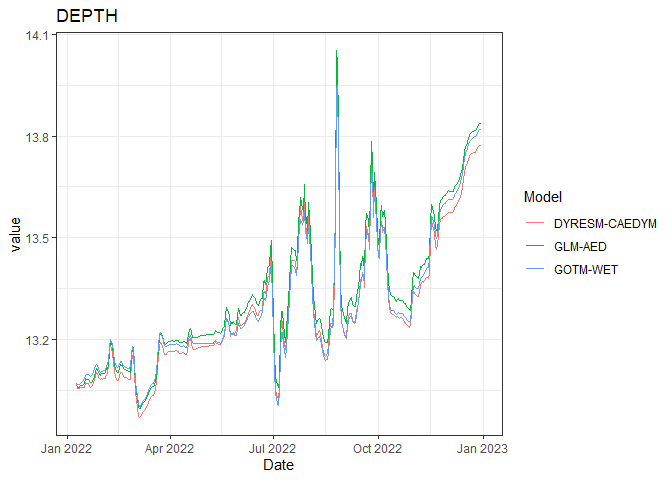

<!-- README.md is generated from README.Rmd. Please edit that file -->

# AEME <a href="https://expert-guide-29ve1vw.pages.github.io/"></a>

<!-- badges: start -->

[](https://lifecycle.r-lib.org/articles/stages.html#experimental)
[](https://github.com/limnotrack/AEME/actions/workflows/R-CMD-check.yaml)
[](https://github.com/limnotrack/AEME/actions/workflows/pkgdown.yaml)
[](https://app.codecov.io/gh/limnotrack/AEME?branch=main)

<!-- badges: end -->

The Aquatic Ecosystem Model Ensemble (AEME) package allows you to setup
and run an ensemble of aquatic ecosystem models. The models are
[DYRESM-CAEDYM](), [GLM-AED]() and [GOTM-WET]().

## Installation

You can install the development version of AEME from
[GitHub](https://github.com/) with:

``` r
# install.packages("devtools")
devtools::install_github("limnotrack/AEME")
```

## Example

This is a basic example which shows you how to build and run one of the
models in the ensemble:

``` r
library(AEME)
#> 
#> Attaching package: 'AEME'
#> The following object is masked from 'package:stats':
#> 
#>     time
## basic example code
tmpdir <- tempdir()
aeme_dir <- system.file("extdata/lake/", package = "AEME")
# Copy files from package into tempdir
file.copy(aeme_dir, tmpdir, recursive = TRUE)
#> [1] TRUE
path <- file.path(tmpdir, "lake")
aeme_data <- yaml_to_aeme(path = path, "aeme.yaml")
#> Linking to GEOS 3.11.2, GDAL 3.6.2, PROJ 9.2.0; sf_use_s2() is FALSE
#> Warning in aeme_constructor(lake = yaml$lake, catchment = yaml$catchment, : Lake area [152343 m2] is different to the area calculated from the lake
#> shape [152433.09 m2].
mod_ctrls <- read.csv(file.path(path, "model_controls.csv"))
inf_factor = c("dy_cd" = 1, "glm_aed" = 1, "gotm_wet" = 1)
outf_factor = c("dy_cd" = 1, "glm_aed" = 1, "gotm_wet" = 1)
model <- c("dy_cd", "glm_aed", "gotm_wet")
aeme_data <- build_ensemble(path = path, aeme_data = aeme_data, model = model, mod_ctrls = mod_ctrls, inf_factor = inf_factor, ext_elev = 5, use_bgc = TRUE, use_lw = TRUE)
#> Building simulation for Wainamu [2023-09-05 12:39:16.413652]
#> Using observed water level
#> Estimating temperature using Stefan & Preud'homme (2007)...
#> Building DYRESM-CAEDYM for lake wainamu
#> Copied in DYRESM par file
#> [1] "TEMPTURE SALINITY DO PO4 DOPL POPL PIP TP NH4 NO3 DONL PONL TN DOCL POCL SiO2 CYANO CHLOR FDIAT TCHLA SSOL1"
#> Downsampling bathymetry
#> Building GLM3-AED2 model for lake wainamu
#> Copied in GLM nml file
#> Copied in AED nml file
#>    oxy_initial   = 625 replaced with 312.5
#>    frp_initial = 0.3229 replaced with 0.3229
#>      dop_initial  = 0.3229 replaced with 0.3229
#>      pop_initial  = 0.3229 replaced with 0.3229
#>    amm_initial = 1.4279 replaced with 1.4279
#>    nit_initial = 1.0709 replaced with 1.0709
#>      don_initial  = 21.4183 replaced with 21.4183
#>      pon_initial  = 7.1394 replaced with 7.1394
#>      doc_initial  = 41.6285 replaced with 41.6285
#>      poc_initial  = 16.6514 replaced with 16.6514
#>    rsi_initial = 1 replaced with 1
#> PHY_cyano 0.24022 replaced with 0.24022
#> PHY_green 0.300275 replaced with 0.300275
#> PHY_diatom 0.300275 replaced with 0.300275
#>     ss_initial   = 3,3 replaced with 3,
#> Building GOTM-WET for lake wainamu
#> Copied all GOTM configuration files
aeme_data <- run_aeme(aeme_data = aeme_data, model = model, verbose = FALSE, path = path, parallel = TRUE, mod_ctrls = mod_ctrls)
#> Running models in parallel... [2023-09-05 12:39:31.100874]
#> Model run complete![2023-09-05 12:43:05.861538]
#> Reading models in parallel... [2023-09-05 12:43:18.606444]
#> Model reading complete![2023-09-05 12:43:24.986415]
```

The model input and output (I/O) is handled as it’s own S4 object of
class `aeme`. This allows for the standardisation and generalisation of
functions for this class alongside ensuring integrity and validity to
it’s structure.

``` r
class(aeme_data)
#> [1] "aeme"
#> attr(,"package")
#> [1] "AEME"
```

This allows for easier handling of the model output data within our
structure and allows for condensed output to be printed to the console:

``` r
aeme_data
#>             AEME 
#> -------------------------------------------------------------------
#>   Lake
#> Wainamu (ID: 45819); Lat: -36.89; Lon: 174.47; Elev: 23.64m; Depth: 13.07m;
#> Area: 152343 m2; Shape file: Present
#> -------------------------------------------------------------------
#>   Catchment 
#> Name: Wainamu; Area: 4989125 m2;
#>       Shape file: Present
#> -------------------------------------------------------------------
#>   Time
#> Start: 2022-01-09 Stop: 2022-12-31 Time step: 3600
#> -------------------------------------------------------------------
#>   Configuration
#>           Physical   |   Biogeochemical
#> DY-CD    : Present    |   Present
#> GLM-AED  : Present    |   Present
#> GOTM-WET : Present    |   Present
#> -------------------------------------------------------------------
#>   Observations
#> Lake: Present; Level: Present
#> -------------------------------------------------------------------
#>   Input
#> Inital profile: Present; Inital depth: 13.07m; Hypsograph: Present (n=132);
#> Meteo: Present; Use longwave: TRUE; Kw: 0.98
#> -------------------------------------------------------------------
#>   Inflows
#> Data: Present; Scaling factors: DY-CD: 1; GLM-AED: 1; GOTM-WET: 1
#> -------------------------------------------------------------------
#>   Outflows
#> Data: Present; Scaling factors: DY-CD: 1; GLM-AED: 1; GOTM-WET: 1
#> -------------------------------------------------------------------
#>   Output: 
#> DY-CD: Present
#> GLM-AED: Present
#> GOTM-WET: Present
```

Summarised easily:

``` r
summary(aeme_data)
#> Lake observations:
#>       LID            lake             id_station      station         
#>  Min.   :45819   Length:5531        Min.   :44616   Length:5531       
#>  1st Qu.:45819   Class :character   1st Qu.:44616   Class :character  
#>  Median :45819   Mode  :character   Median :44616   Mode  :character  
#>  Mean   :45819                      Mean   :44616                     
#>  3rd Qu.:45819                      3rd Qu.:44616                     
#>  Max.   :45819                      Max.   :44648                     
#>       Date              depth_from        depth_to          var           
#>  Min.   :1991-05-25   Min.   : 0.000   Min.   : 0.000   Length:5531       
#>  1st Qu.:2006-03-05   1st Qu.: 2.000   1st Qu.: 2.000   Class :character  
#>  Median :2012-04-14   Median : 5.000   Median : 5.000   Mode  :character  
#>  Mean   :2011-11-26   Mean   : 5.008   Mean   : 5.008                     
#>  3rd Qu.:2019-04-20   3rd Qu.: 8.000   3rd Qu.: 8.000                     
#>  Max.   :2024-06-09   Max.   :15.000   Max.   :15.000                     
#>      value            units           flag_detection
#>  Min.   :  0.000   Length:5531        Mode:logical  
#>  1st Qu.:  0.070   Class :character   NA's:5531     
#>  Median :  5.500   Mode  :character                 
#>  Mean   :  7.047                                    
#>  3rd Qu.: 13.085                                    
#>  Max.   :101.000                                    
#> -------------------------------------------------------------------
#> Lake level:
#>       Date                lvlwtr     
#>  Min.   :2018-12-31   Min.   :23.57  
#>  1st Qu.:2020-03-31   1st Qu.:23.59  
#>  Median :2021-06-30   Median :23.64  
#>  Mean   :2021-06-30   Mean   :23.64  
#>  3rd Qu.:2022-09-29   3rd Qu.:23.69  
#>  Max.   :2023-12-30   Max.   :23.71  
#> -------------------------------------------------------------------
#> Meteorology:
#>       Date              MET_wnduvu          MET_wnduvv         MET_tmpdew    
#>  Min.   :2022-01-01   Min.   :-11.16345   Min.   :-10.2845   Min.   : 1.718  
#>  1st Qu.:2022-04-02   1st Qu.: -2.98211   1st Qu.: -3.0025   1st Qu.:10.036  
#>  Median :2022-07-02   Median : -0.30557   Median : -0.1780   Median :12.635  
#>  Mean   :2022-07-02   Mean   :  0.01658   Mean   : -0.1501   Mean   :12.528  
#>  3rd Qu.:2022-10-01   3rd Qu.:  2.90679   3rd Qu.:  2.7472   3rd Qu.:15.097  
#>  Max.   :2022-12-31   Max.   : 12.76652   Max.   : 10.1251   Max.   :22.409  
#>    MET_tmpair       MET_ppsnow   MET_prsttn       MET_radswd    
#>  Min.   : 8.992   Min.   :0    Min.   : 98829   Min.   : 37.76  
#>  1st Qu.:13.974   1st Qu.:0    1st Qu.:100492   1st Qu.:114.64  
#>  Median :16.234   Median :0    Median :101065   Median :180.01  
#>  Mean   :16.433   Mean   :0    Mean   :100999   Mean   :187.23  
#>  3rd Qu.:19.273   3rd Qu.:0    3rd Qu.:101472   3rd Qu.:255.27  
#>  Max.   :24.478   Max.   :0    Max.   :103178   Max.   :376.33  
#>    MET_radlwd      MET_pprain     
#>  Min.   :280.2   Min.   : 0.0000  
#>  1st Qu.:326.3   1st Qu.: 0.2425  
#>  Median :343.1   Median : 1.4569  
#>  Mean   :343.8   Mean   : 6.3316  
#>  3rd Qu.:360.2   3rd Qu.: 8.1555  
#>  Max.   :426.2   Max.   :61.4505  
#> -------------------------------------------------------------------
#> Inflows:
#>    FWMT 
#>       Date               HYD_flow           HYD_temp        CHM_salt
#>  Min.   :2018-12-31   Min.   :   111.7   Min.   :10.00   Min.   :0  
#>  1st Qu.:2020-03-31   1st Qu.:  1430.2   1st Qu.:11.47   1st Qu.:0  
#>  Median :2021-06-30   Median :  4677.8   Median :15.00   Median :0  
#>  Mean   :2021-06-30   Mean   :  9748.9   Mean   :15.00   Mean   :0  
#>  3rd Qu.:2022-09-29   3rd Qu.: 11403.0   3rd Qu.:18.52   3rd Qu.:0  
#>  Max.   :2023-12-30   Max.   :247783.4   Max.   :20.00   Max.   :0  
#>     CHM_oxy          PHS_frp             PHS_dop             PHS_pop         
#>  Min.   : 9.234   Min.   :3.235e-05   Min.   :1.532e-06   Min.   :6.127e-06  
#>  1st Qu.: 9.513   1st Qu.:4.099e-04   1st Qu.:1.514e-05   1st Qu.:6.056e-05  
#>  Median :10.240   Median :1.024e-03   Median :4.051e-05   Median :1.621e-04  
#>  Mean   :10.292   Mean   :3.732e-03   Mean   :1.441e-04   Mean   :5.766e-04  
#>  3rd Qu.:11.073   3rd Qu.:4.334e-03   3rd Qu.:1.693e-04   3rd Qu.:6.772e-04  
#>  Max.   :11.455   Max.   :4.642e-02   Max.   :1.746e-03   Max.   :6.983e-03  
#>     PHS_pip             NIT_amm             NIT_nit         
#>  Min.   :2.298e-05   Min.   :0.0002219   Min.   :2.014e-05  
#>  1st Qu.:2.271e-04   1st Qu.:0.0019064   1st Qu.:1.774e-04  
#>  Median :6.077e-04   Median :0.0040237   Median :4.139e-04  
#>  Mean   :2.162e-03   Mean   :0.0138761   Mean   :1.184e-03  
#>  3rd Qu.:2.539e-03   3rd Qu.:0.0129178   3rd Qu.:1.312e-03  
#>  Max.   :2.619e-02   Max.   :0.2016053   Max.   :4.289e-02  
#>     NIT_don             NIT_pon             CAR_doc         
#>  Min.   :0.0000785   Min.   :0.0001177   Min.   :0.0004457  
#>  1st Qu.:0.0006400   1st Qu.:0.0009599   1st Qu.:0.0036341  
#>  Median :0.0015013   Median :0.0022520   Median :0.0085254  
#>  Mean   :0.0043520   Mean   :0.0065279   Mean   :0.0247128  
#>  3rd Qu.:0.0052643   3rd Qu.:0.0078964   3rd Qu.:0.0298936  
#>  Max.   :0.0523152   Max.   :0.0784728   Max.   :0.2970757  
#>     CAR_poc             SIL_rsi      NCS_ss1            NCS_ss2    PHY_cyano  
#>  Min.   :0.0006686   Min.   :10   Min.   : 0.01773   Min.   :0   Min.   :0.1  
#>  1st Qu.:0.0054512   1st Qu.:10   1st Qu.: 0.16310   1st Qu.:0   1st Qu.:0.1  
#>  Median :0.0127881   Median :10   Median : 0.43163   Median :0   Median :0.1  
#>  Mean   :0.0370693   Mean   :10   Mean   : 1.38127   Mean   :0   Mean   :0.1  
#>  3rd Qu.:0.0448404   3rd Qu.:10   3rd Qu.: 1.11036   3rd Qu.:0   3rd Qu.:0.1  
#>  Max.   :0.4456136   Max.   :10   Max.   :48.38967   Max.   :0   Max.   :0.1  
#>    PHY_green     PHY_diatom 
#>  Min.   :0.1   Min.   :0.1  
#>  1st Qu.:0.1   1st Qu.:0.1  
#>  Median :0.1   Median :0.1  
#>  Mean   :0.1   Mean   :0.1  
#>  3rd Qu.:0.1   3rd Qu.:0.1  
#>  Max.   :0.1   Max.   :0.1  
#> -------------------------------------------------------------------
#> Outflows:
#>    outflow 
#>       Date               outflow         
#>  Min.   :2018-12-31   Min.   :     0.00  
#>  1st Qu.:2020-03-31   1st Qu.:    74.76  
#>  Median :2021-06-30   Median :  4509.66  
#>  Mean   :2021-06-30   Mean   :  9520.33  
#>  3rd Qu.:2022-09-29   3rd Qu.: 13446.05  
#>  Max.   :2023-12-30   Max.   :106553.81  
#>                       NA's   :4          
#>    wbal 
#>       Date            outflow_dy_cd     outflow_glm_aed   outflow_gotm_wet 
#>  Min.   :2022-01-05   Min.   :    0.0   Min.   :    0.0   Min.   :    0.0  
#>  1st Qu.:2022-04-05   1st Qu.:    0.0   1st Qu.:    0.0   1st Qu.:    0.0  
#>  Median :2022-07-04   Median :    0.0   Median :    0.0   Median :    0.0  
#>  Mean   :2022-07-04   Mean   :  603.1   Mean   :  603.1   Mean   :  648.1  
#>  3rd Qu.:2022-10-02   3rd Qu.:  553.6   3rd Qu.:  553.6   3rd Qu.:  689.3  
#>  Max.   :2022-12-31   Max.   :10396.4   Max.   :10396.4   Max.   :10380.3  
#>                       NA's   :4         NA's   :4         NA's   :4        
#> -------------------------------------------------------------------
#> Outputs:
#>    DY-CD 
#>     HYD_evap        HYD_evap_flux           HYD_Qe        HYD_evap_vol   
#>  Min.   :0.000000   Min.   :0.000e+00   Min.   :-33.59   Min.   :   0.0  
#>  1st Qu.:0.001294   1st Qu.:1.498e-08   1st Qu.: 31.15   1st Qu.: 198.8  
#>  Median :0.002379   Median :2.754e-08   Median : 60.23   Median : 370.6  
#>  Mean   :0.002811   Mean   :3.253e-08   Mean   : 74.04   Mean   : 434.7  
#>  3rd Qu.:0.004028   3rd Qu.:4.662e-08   3rd Qu.:106.53   3rd Qu.: 631.5  
#>  Max.   :0.009202   Max.   :1.065e-07   Max.   :272.45   Max.   :1432.5  
#>    HYD_precip         HYD_inflow        HYD_outflow           LAYERS       
#>  Min.   :0.000000   Min.   :0.002699   Min.   :0.000000   Min.   : 0.3241  
#>  1st Qu.:0.000250   1st Qu.:0.009063   1st Qu.:0.001492   1st Qu.: 3.5499  
#>  Median :0.001600   Median :0.028893   Median :0.028338   Median : 6.8468  
#>  Mean   :0.006457   Mean   :0.058184   Mean   :0.055909   Mean   : 6.8103  
#>  3rd Qu.:0.008320   3rd Qu.:0.070008   3rd Qu.:0.073938   3rd Qu.:10.1455  
#>  Max.   :0.061450   Max.   :0.770166   Max.   :0.357783   Max.   :14.0204  
#>      DEPTHS          HYD_temp        CHM_salt    CHM_oxy      
#>  Min.   : 0.000   Min.   :10.00   Min.   :0   Min.   : 0.000  
#>  1st Qu.: 3.219   1st Qu.:10.79   1st Qu.:0   1st Qu.: 7.270  
#>  Median : 6.516   Median :12.57   Median :0   Median : 8.980  
#>  Mean   : 6.478   Mean   :13.81   Mean   :0   Mean   : 8.193  
#>  3rd Qu.: 9.814   3rd Qu.:15.64   3rd Qu.:0   3rd Qu.: 9.828  
#>  Max.   :13.670   Max.   :27.77   Max.   :0   Max.   :10.952  
#>     PHS_frp             PHS_dop             PHS_pop         
#>  Min.   :7.216e-05   Min.   :7.443e-05   Min.   :5.067e-06  
#>  1st Qu.:4.690e-04   1st Qu.:5.059e-04   1st Qu.:8.878e-05  
#>  Median :1.521e-03   Median :2.832e-03   Median :1.456e-04  
#>  Mean   :6.700e-03   Mean   :4.670e-03   Mean   :4.200e-04  
#>  3rd Qu.:8.284e-03   3rd Qu.:9.196e-03   3rd Qu.:2.444e-04  
#>  Max.   :2.894e-01   Max.   :1.236e-02   Max.   :9.974e-03  
#>     PHS_pip              PHS_tp             NIT_amm         
#>  Min.   :2.877e-06   Min.   :0.0003734   Min.   :0.0002329  
#>  1st Qu.:1.231e-04   1st Qu.:0.0027870   1st Qu.:0.0020143  
#>  Median :2.376e-04   Median :0.0061742   Median :0.0050748  
#>  Mean   :4.528e-04   Mean   :0.0130187   Mean   :0.0134280  
#>  3rd Qu.:7.450e-04   3rd Qu.:0.0205058   3rd Qu.:0.0185083  
#>  Max.   :6.983e-03   Max.   :0.2979069   Max.   :0.5696009  
#>     NIT_nit             NIT_don            NIT_pon              NIT_tn       
#>  Min.   :0.0002215   Min.   :0.005025   Min.   :6.176e-05   Min.   :0.01016  
#>  1st Qu.:0.0064902   1st Qu.:0.014248   1st Qu.:1.041e-03   1st Qu.:0.05666  
#>  Median :0.0202467   Median :0.106875   Median :1.500e-03   Median :0.14154  
#>  Mean   :0.0341153   Mean   :0.142663   Mean   :3.636e-03   Mean   :0.19958  
#>  3rd Qu.:0.0457808   3rd Qu.:0.283238   3rd Qu.:2.463e-03   3rd Qu.:0.36059  
#>  Max.   :0.1607811   Max.   :0.322018   Max.   :9.951e-02   Max.   :0.97677  
#>     CAR_doc          CAR_poc             SIL_rsi         PHY_cyano     
#>  Min.   :0.0127   Min.   :0.0003723   Min.   :0.9991   Min.   :0.1000  
#>  1st Qu.:0.0613   1st Qu.:0.0056565   1st Qu.:1.0000   1st Qu.:0.1000  
#>  Median :0.1713   Median :0.0080941   Median :5.9044   Median :0.1000  
#>  Mean   :0.2692   Mean   :0.0149946   Mean   :5.2742   Mean   :0.5430  
#>  3rd Qu.:0.4454   3rd Qu.:0.0133522   3rd Qu.:9.0529   3rd Qu.:0.3397  
#>  Max.   :5.3598   Max.   :0.1994947   Max.   :9.7407   Max.   :8.2644  
#>    PHY_green        PHY_diatom       PHY_tchla          NCS_ss1       
#>  Min.   :0.1000   Min.   :0.1000   Min.   : 0.3000   Min.   : 0.1785  
#>  1st Qu.:0.1000   1st Qu.:0.1000   1st Qu.: 0.3338   1st Qu.: 0.4654  
#>  Median :0.2552   Median :0.1003   Median : 0.6721   Median : 0.9466  
#>  Mean   :0.4201   Mean   :0.3103   Mean   : 1.2739   Mean   : 1.4816  
#>  3rd Qu.:0.5528   3rd Qu.:0.2083   3rd Qu.: 1.5607   3rd Qu.: 2.3759  
#>  Max.   :4.8098   Max.   :7.5648   Max.   :12.5828   Max.   :15.3231  
#>    GLM-AED 
#>       Date           DEPTH           HYD_V             HYD_A0      
#>  Min.   :19002   Min.   :12.99   Min.   :1092074   Min.   :151274  
#>  1st Qu.:19091   1st Qu.:13.19   1st Qu.:1122307   1st Qu.:153664  
#>  Median :19180   Median :13.28   Median :1136958   Median :154684  
#>  Mean   :19180   Mean   :13.33   Mean   :1143994   Mean   :155142  
#>  3rd Qu.:19268   3rd Qu.:13.45   3rd Qu.:1162789   3rd Qu.:156466  
#>  Max.   :19357   Max.   :14.05   Max.   :1260017   Max.   :163010  
#>     HYD_evap        HYD_evap_flux           HYD_Qe        HYD_evap_vol   
#>  Min.   :0.000000   Min.   :0.000e+00   Min.   :  0.00   Min.   :   0.0  
#>  1st Qu.:0.001198   1st Qu.:1.400e-08   1st Qu.: 33.91   1st Qu.: 185.1  
#>  Median :0.002233   Median :2.570e-08   Median : 63.63   Median : 346.4  
#>  Mean   :0.002625   Mean   :2.942e-08   Mean   : 74.46   Mean   : 407.2  
#>  3rd Qu.:0.003809   3rd Qu.:4.163e-08   3rd Qu.:107.67   3rd Qu.: 584.6  
#>  Max.   :0.009051   Max.   :9.905e-08   Max.   :257.16   Max.   :1420.8  
#>    HYD_precip         HYD_inflow        HYD_outflow          LAYERS       
#>  Min.   :0.000000   Min.   :0.000000   Min.   :0.00000   Min.   : 0.3249  
#>  1st Qu.:0.000250   1st Qu.:0.009072   1st Qu.:0.00565   1st Qu.: 3.5582  
#>  Median :0.001555   Median :0.028837   Median :0.03130   Median : 6.8593  
#>  Mean   :0.006469   Mean   :0.058014   Mean   :0.05983   Mean   : 6.8305  
#>  3rd Qu.:0.008320   3rd Qu.:0.070124   3rd Qu.:0.07691   3rd Qu.:10.1690  
#>  Max.   :0.061450   Max.   :0.743853   Max.   :0.36319   Max.   :14.0492  
#>      DEPTHS          HYD_temp        CHM_salt            CHM_oxy      
#>  Min.   : 0.000   Min.   :10.00   Min.   :0.000e+00   Min.   : 0.000  
#>  1st Qu.: 3.227   1st Qu.:12.36   1st Qu.:4.432e-05   1st Qu.: 7.461  
#>  Median : 6.532   Median :14.65   Median :5.833e-05   Median : 9.129  
#>  Mean   : 6.497   Mean   :15.23   Mean   :5.509e-05   Mean   : 8.010  
#>  3rd Qu.: 9.835   3rd Qu.:17.77   3rd Qu.:7.640e-05   3rd Qu.: 9.899  
#>  Max.   :13.698   Max.   :28.20   Max.   :1.276e-04   Max.   :10.673  
#>     PHS_frp            PHS_dop             PHS_pop             PHS_pip         
#>  Min.   :0.001002   Min.   :0.0007546   Min.   :7.961e-06   Min.   :8.559e-05  
#>  1st Qu.:0.001328   1st Qu.:0.0014283   1st Qu.:6.406e-05   1st Qu.:2.297e-04  
#>  Median :0.001560   Median :0.0074318   Median :2.954e-04   Median :2.964e-04  
#>  Mean   :0.003241   Mean   :0.0069629   Mean   :6.086e-04   Mean   :7.681e-04  
#>  3rd Qu.:0.003093   3rd Qu.:0.0116379   3rd Qu.:6.344e-04   3rd Qu.:5.685e-04  
#>  Max.   :0.038791   Max.   :0.0145613   Max.   :9.849e-03   Max.   :1.086e-02  
#>      PHS_tp            NIT_amm            NIT_nit           NIT_don       
#>  Min.   :0.002188   Min.   :0.002301   Min.   :0.00000   Min.   :0.00000  
#>  1st Qu.:0.004110   1st Qu.:0.009483   1st Qu.:0.01016   1st Qu.:0.01511  
#>  Median :0.009710   Median :0.010790   Median :0.01425   Median :0.06873  
#>  Mean   :0.011577   Mean   :0.022725   Mean   :0.01817   Mean   :0.09002  
#>  3rd Qu.:0.014208   3rd Qu.:0.014289   3rd Qu.:0.02583   3rd Qu.:0.12988  
#>  Max.   :0.064760   Max.   :0.676093   Max.   :0.04796   Max.   :0.29977  
#>     NIT_pon              NIT_tn           CAR_doc           CAR_poc        
#>  Min.   :0.0001641   Min.   :0.02750   Min.   :0.02057   Min.   :0.001279  
#>  1st Qu.:0.0012736   1st Qu.:0.06497   1st Qu.:0.12616   1st Qu.:0.009451  
#>  Median :0.0046951   Median :0.09957   Median :0.47203   Median :0.029289  
#>  Mean   :0.0071144   Mean   :0.13819   Mean   :0.44285   Mean   :0.033926  
#>  3rd Qu.:0.0081164   3rd Qu.:0.17119   3rd Qu.:0.68453   3rd Qu.:0.049275  
#>  Max.   :0.0984655   Max.   :0.89379   Max.   :1.00433   Max.   :0.196597  
#>     SIL_rsi         PHY_cyano          PHY_green          PHY_diatom      
#>  Min.   : 1.012   Min.   :  0.1489   Min.   : 0.03000   Min.   : 0.03000  
#>  1st Qu.: 5.750   1st Qu.:  2.3268   1st Qu.: 0.04408   1st Qu.: 0.03000  
#>  Median : 9.144   Median :  5.5752   Median : 0.04950   Median : 0.03011  
#>  Mean   : 8.294   Mean   : 13.6700   Mean   : 1.72090   Mean   : 0.39090  
#>  3rd Qu.:10.269   3rd Qu.: 22.3358   3rd Qu.: 0.21336   3rd Qu.: 0.03093  
#>  Max.   :42.581   Max.   :106.3398   Max.   :68.16477   Max.   :18.43895  
#>    PHY_tchla           NCS_ss1      
#>  Min.   : 0.05381   Min.   :0.8269  
#>  1st Qu.: 0.65935   1st Qu.:1.5804  
#>  Median : 2.26803   Median :1.8710  
#>  Mean   : 3.90082   Mean   :2.0662  
#>  3rd Qu.: 6.07677   3rd Qu.:2.6326  
#>  Max.   :25.41581   Max.   :5.9020  
#>    GOTM-WET 
#>      HYD_V           HYD_evap         HYD_evap_flux           HYD_Qe      
#>  Min.   :-10101   Min.   :1.242e-05   Min.   :1.438e-10   Min.   :-34.91  
#>  1st Qu.: 16859   1st Qu.:1.135e-03   1st Qu.:1.314e-08   1st Qu.: 34.55  
#>  Median : 26863   Median :2.019e-03   Median :2.337e-08   Median : 60.34  
#>  Mean   : 36019   Mean   :2.383e-03   Mean   :2.758e-08   Mean   : 69.13  
#>  3rd Qu.: 52516   3rd Qu.:3.278e-03   3rd Qu.:3.794e-08   3rd Qu.: 96.18  
#>  Max.   :137818   Max.   :8.742e-03   Max.   :1.012e-07   Max.   :258.72  
#>   HYD_evap_vol        HYD_precip         HYD_outflow           LAYERS       
#>  Min.   :   1.909   Min.   :9.800e-07   Min.   :0.000000   Min.   : 0.3251  
#>  1st Qu.: 174.169   1st Qu.:4.261e-04   1st Qu.:0.001927   1st Qu.: 3.5538  
#>  Median : 313.812   Median :2.569e-03   Median :0.028264   Median : 6.8599  
#>  Mean   : 368.882   Mean   :6.455e-03   Mean   :0.056056   Mean   : 6.8179  
#>  3rd Qu.: 502.877   3rd Qu.:8.860e-03   3rd Qu.:0.075321   3rd Qu.:10.1664  
#>  Max.   :1345.520   Max.   :6.127e-02   Max.   :0.354859   Max.   :13.9490  
#>      DEPTHS          HYD_temp        CHM_salt    CHM_oxy      
#>  Min.   : 0.000   Min.   :10.00   Min.   :0   Min.   : 1.310  
#>  1st Qu.: 3.223   1st Qu.:13.18   1st Qu.:0   1st Qu.: 8.880  
#>  Median : 6.532   Median :16.00   Median :0   Median : 9.669  
#>  Mean   : 6.485   Mean   :16.34   Mean   :0   Mean   : 9.343  
#>  3rd Qu.: 9.835   3rd Qu.:19.22   3rd Qu.:0   3rd Qu.:10.258  
#>  Max.   :13.600   Max.   :27.43   Max.   :0   Max.   :14.650  
#>     PHS_frp             PHS_dop             PHS_pop         
#>  Min.   :0.0001450   Min.   :0.0004013   Min.   :4.893e-05  
#>  1st Qu.:0.0003066   1st Qu.:0.0066156   1st Qu.:5.600e-04  
#>  Median :0.0005590   Median :0.0090545   Median :1.628e-03  
#>  Mean   :0.0141043   Mean   :0.0115162   Mean   :2.750e-03  
#>  3rd Qu.:0.0008304   3rd Qu.:0.0166958   3rd Qu.:5.147e-03  
#>  Max.   :0.1170789   Max.   :0.0243769   Max.   :9.111e-03  
#>     PHS_pip              PHS_tp            NIT_amm            NIT_nit        
#>  Min.   :0.000e+00   Min.   :0.006419   Min.   :0.002079   Min.   :0.001587  
#>  1st Qu.:2.775e-05   1st Qu.:0.012846   1st Qu.:0.003830   1st Qu.:0.007506  
#>  Median :5.538e-05   Median :0.024923   Median :0.007478   Median :0.011595  
#>  Mean   :1.052e-04   Mean   :0.043556   Mean   :0.013903   Mean   :0.097442  
#>  3rd Qu.:1.220e-04   3rd Qu.:0.067469   3rd Qu.:0.010570   3rd Qu.:0.018294  
#>  Max.   :2.459e-03   Max.   :0.145438   Max.   :0.111849   Max.   :0.861838  
#>     NIT_don            NIT_pon             NIT_tn           CAR_doc       
#>  Min.   :0.004152   Min.   :0.001640   Min.   :0.04999   Min.   :0.09899  
#>  1st Qu.:0.055127   1st Qu.:0.004676   1st Qu.:0.12377   1st Qu.:1.05619  
#>  Median :0.074247   Median :0.013074   Median :0.20858   Median :1.82464  
#>  Mean   :0.086478   Mean   :0.018668   Mean   :0.31950   Mean   :1.81158  
#>  3rd Qu.:0.119411   3rd Qu.:0.032778   3rd Qu.:0.44266   3rd Qu.:2.16200  
#>  Max.   :0.170476   Max.   :0.054416   Max.   :1.20272   Max.   :7.51174  
#>     CAR_poc           SIL_rsi         PHY_cyano          PHY_green       
#>  Min.   :0.01338   Min.   : 3.079   Min.   :  0.2714   Min.   :0.001001  
#>  1st Qu.:0.11792   1st Qu.: 6.113   1st Qu.:  7.0923   1st Qu.:0.001997  
#>  Median :0.21599   Median : 7.835   Median : 10.5351   Median :0.002019  
#>  Mean   :0.40934   Mean   : 7.406   Mean   : 17.1220   Mean   :0.231376  
#>  3rd Qu.:0.75500   3rd Qu.: 9.212   3rd Qu.: 18.0694   3rd Qu.:0.020403  
#>  Max.   :1.06514   Max.   :10.005   Max.   :103.2571   Max.   :3.111422  
#>    PHY_diatom         PHY_tchla          NCS_ss1        
#>  Min.   : 0.00040   Min.   :  1.972   Min.   : 0.01069  
#>  1st Qu.: 0.00120   1st Qu.:  7.901   1st Qu.: 0.32394  
#>  Median : 0.00233   Median : 11.645   Median : 0.86382  
#>  Mean   : 3.15508   Mean   : 20.508   Mean   : 1.33901  
#>  3rd Qu.: 0.96366   3rd Qu.: 24.610   3rd Qu.: 1.85697  
#>  Max.   :42.18958   Max.   :111.423   Max.   :10.34756  
#> -------------------------------------------------------------------
```

Model data can be visualised easily using the `plot_output()` function

``` r
plot_list <- plot_output(aeme_data = aeme_data, model = model, var_sim = "HYD_temp", 
            level = TRUE, label = TRUE, var_lims = c(9, 30), print_plots = FALSE)

library(ggpubr)
#> Loading required package: ggplot2

ggarrange(plotlist = plot_list, ncol = 1, common.legend = TRUE, legend = "right")
#> Warning: Using size for a discrete variable is not advised.
#> Using size for a discrete variable is not advised.
#> Using size for a discrete variable is not advised.
#> Using size for a discrete variable is not advised.
```

 Also,
visualising lake level plots.

``` r
plot_list <- plot_output(aeme_data = aeme_data, model = model, var_sim = "DEPTH", 
            level = TRUE, label = TRUE, var_lims = c(9, 30), print_plots = FALSE)
plot_list
```


