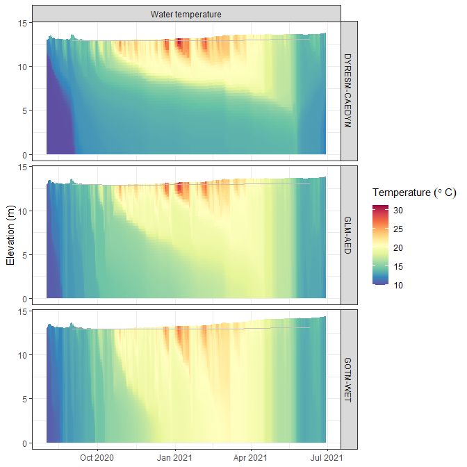

<!-- README.md is generated from README.Rmd. Please edit that file -->

# AEME <a href="https://expert-guide-29ve1vw.pages.github.io/"></a>

<!-- badges: start -->

[](https://lifecycle.r-lib.org/articles/stages.html#experimental)
[](https://github.com/limnotrack/AEME/actions/workflows/R-CMD-check.yaml)
[](https://github.com/limnotrack/AEME/actions/workflows/pkgdown.yaml)
[](https://app.codecov.io/gh/limnotrack/AEME?branch=main)

<!-- badges: end -->

The Aquatic Ecosystem Model Ensemble (AEME) package allows you to setup
and run an ensemble of aquatic ecosystem models. The models are
[DYRESM-CAEDYM](), [GLM-AED]() and [GOTM-WET]().

## Installation

You can install the development version of AEME from
[GitHub](https://github.com/) with:

``` r
# install.packages("devtools")
devtools::install_github("limnotrack/AEME")
```

## Example

This is a basic example which shows you how to build and run one of the
models in the ensemble:

``` r
library(AEME)
#> 
#> Attaching package: 'AEME'
#> The following object is masked from 'package:stats':
#> 
#>     time
## basic example code
tmpdir <- tempdir()
aeme_dir <- system.file("extdata/lake/", package = "AEME")
# Copy files from package into tempdir
file.copy(aeme_dir, tmpdir, recursive = TRUE)
#> [1] TRUE
path <- file.path(tmpdir, "lake")
aeme_data <- yaml_to_aeme(path = path, "aeme.yaml")
#> Linking to GEOS 3.11.2, GDAL 3.6.2, PROJ 9.2.0; sf_use_s2() is FALSE
#> Warning in aeme_constructor(lake = yaml$lake, catchment = yaml$catchment, : Lake area [152343 m2] is different to the area calculated from the lake
#> shape [152433.09 m2].
mod_ctrls <- read.csv(file.path(path, "model_controls.csv"))
inf_factor = c("dy_cd" = 1, "glm_aed" = 1, "gotm_wet" = 1)
outf_factor = c("dy_cd" = 1, "glm_aed" = 1, "gotm_wet" = 1)
model <- c("dy_cd", "glm_aed", "gotm_wet")
aeme_data <- build_ensemble(path = path, aeme_data = aeme_data, model = model, mod_ctrls = mod_ctrls, inf_factor = inf_factor, ext_elev = 5, use_bgc = TRUE, use_lw = TRUE)
#> Building simulation for Wainamu [2023-11-03 11:15:37.474138]
#> Using observed water level
#> Estimating temperature using Stefan & Preud'homme (2007)...
#> Observed lake level is present. Updating initial lake model depth...
#> Building DYRESM-CAEDYM for lake wainamu
#> Copied in DYRESM par file
#> [1] "TEMPTURE SALINITY DO PO4 DOPL POPL PIP TP NH4 NO3 DONL PONL TN DOCL POCL SiO2 CYANO CHLOR FDIAT TCHLA SSOL1"
#> Downsampling bathymetry
#> Building GLM3-AED2 model for lake wainamu
#> Copied in GLM nml file
#> Copied in AED nml file
#>    oxy_initial   = 625 replaced with 312.5
#>    frp_initial = 0.3229 replaced with 0.3229
#>      dop_initial  = 0.3229 replaced with 0.3229
#>      pop_initial  = 0.3229 replaced with 0.3229
#>    amm_initial = 1.4279 replaced with 1.4279
#>    nit_initial = 1.0709 replaced with 1.0709
#>      don_initial  = 21.4183 replaced with 21.4183
#>      pon_initial  = 7.1394 replaced with 7.1394
#>      doc_initial  = 41.6285 replaced with 41.6285
#>      poc_initial  = 16.6514 replaced with 16.6514
#>    rsi_initial = 1 replaced with 1
#> PHY_cyano 0.24022 replaced with 0.24022
#> PHY_green 0.300275 replaced with 0.300275
#> PHY_diatom 0.300275 replaced with 0.300275
#>     ss_initial   = 3,3 replaced with 3,
#> Building GOTM-WET for lake wainamu
#> Copied all GOTM configuration files
aeme_data <- run_aeme(aeme_data = aeme_data, model = model, verbose = FALSE, path = path, parallel = TRUE, mod_ctrls = mod_ctrls)
#> Running models in parallel... [2023-11-03 11:15:39.759251]
#> Model run complete![2023-11-03 11:17:52.037806]
#> Reading models in parallel... [2023-11-03 11:17:53.301781]
#> Model reading complete![2023-11-03 11:17:55.169438]
```

The model input and output (I/O) is handled as it’s own S4 object of
class `aeme`. This allows for the standardisation and generalisation of
functions for this class alongside ensuring integrity and validity to
it’s structure.

``` r
class(aeme_data)
#> [1] "aeme"
#> attr(,"package")
#> [1] "AEME"
```

This allows for easier handling of the model output data within our
structure and allows for condensed output to be printed to the console:

``` r
aeme_data
#>             AEME 
#> -------------------------------------------------------------------
#>   Lake
#> Wainamu (ID: 45819); Lat: -36.89; Lon: 174.47; Elev: 23.64m; Depth: 13.07m;
#> Area: 152343 m2; Shape file: Present
#> -------------------------------------------------------------------
#>   Catchment 
#> Name: Wainamu; Area: 4989125 m2;
#>       Shape file: Present
#> -------------------------------------------------------------------
#>   Time
#> Start: 2022-01-09 Stop: 2022-12-31 Time step: 3600
#> -------------------------------------------------------------------
#>   Configuration
#>           Physical   |   Biogeochemical
#> DY-CD    : Present    |   Present
#> GLM-AED  : Present    |   Present
#> GOTM-WET : Present    |   Present
#> -------------------------------------------------------------------
#>   Observations
#> Lake: Present; Level: Present
#> -------------------------------------------------------------------
#>   Input
#> Inital profile: Present; Inital depth: 13.02m; Hypsograph: Present (n=132);
#> Meteo: Present; Use longwave: TRUE; Kw: 0.98
#> -------------------------------------------------------------------
#>   Inflows
#> Data: Present; Scaling factors: DY-CD: 1; GLM-AED: 1; GOTM-WET: 1
#> -------------------------------------------------------------------
#>   Outflows
#> Data: Present; Scaling factors: DY-CD: 1; GLM-AED: 1; GOTM-WET: 1
#> -------------------------------------------------------------------
#>   Output: 
#> DY-CD: Present
#> GLM-AED: Present
#> GOTM-WET: Present
```

Summarised easily:

``` r
summary(aeme_data)
#> Lake observations:
#>       LID            lake             id_station      station         
#>  Min.   :45819   Length:5531        Min.   :44616   Length:5531       
#>  1st Qu.:45819   Class :character   1st Qu.:44616   Class :character  
#>  Median :45819   Mode  :character   Median :44616   Mode  :character  
#>  Mean   :45819                      Mean   :44616                     
#>  3rd Qu.:45819                      3rd Qu.:44616                     
#>  Max.   :45819                      Max.   :44648                     
#>       Date              depth_from        depth_to          var           
#>  Min.   :1991-05-25   Min.   : 0.000   Min.   : 0.000   Length:5531       
#>  1st Qu.:2006-03-05   1st Qu.: 2.000   1st Qu.: 2.000   Class :character  
#>  Median :2012-04-14   Median : 5.000   Median : 5.000   Mode  :character  
#>  Mean   :2011-11-26   Mean   : 5.008   Mean   : 5.008                     
#>  3rd Qu.:2019-04-20   3rd Qu.: 8.000   3rd Qu.: 8.000                     
#>  Max.   :2024-06-09   Max.   :15.000   Max.   :15.000                     
#>      value            units           flag_detection
#>  Min.   :  0.000   Length:5531        Mode:logical  
#>  1st Qu.:  0.070   Class :character   NA's:5531     
#>  Median :  5.500   Mode  :character                 
#>  Mean   :  7.047                                    
#>  3rd Qu.: 13.085                                    
#>  Max.   :101.000                                    
#> -------------------------------------------------------------------
#> Lake level:
#>       Date                lvlwtr     
#>  Min.   :2018-12-31   Min.   :23.57  
#>  1st Qu.:2020-03-31   1st Qu.:23.59  
#>  Median :2021-06-30   Median :23.64  
#>  Mean   :2021-06-30   Mean   :23.64  
#>  3rd Qu.:2022-09-29   3rd Qu.:23.69  
#>  Max.   :2023-12-30   Max.   :23.71  
#> -------------------------------------------------------------------
#> Meteorology:
#>       Date              MET_radswd       MET_radlwd      MET_cldcvr    
#>  Min.   :2022-01-01   Min.   : 37.76   Min.   :280.2   Min.   :0.1966  
#>  1st Qu.:2022-04-02   1st Qu.:114.64   1st Qu.:326.3   1st Qu.:0.5482  
#>  Median :2022-07-02   Median :180.01   Median :343.1   Median :0.6453  
#>  Mean   :2022-07-02   Mean   :187.23   Mean   :343.8   Mean   :0.6488  
#>  3rd Qu.:2022-10-01   3rd Qu.:255.27   3rd Qu.:360.2   3rd Qu.:0.7558  
#>  Max.   :2022-12-31   Max.   :376.33   Max.   :426.2   Max.   :1.0000  
#>    MET_tmpair       MET_airmax   MET_airmin   MET_dewmax   MET_dewmin
#>  Min.   : 8.992   Min.   :0    Min.   :0    Min.   :0    Min.   :0   
#>  1st Qu.:13.974   1st Qu.:0    1st Qu.:0    1st Qu.:0    1st Qu.:0   
#>  Median :16.234   Median :0    Median :0    Median :0    Median :0   
#>  Mean   :16.433   Mean   :0    Mean   :0    Mean   :0    Mean   :0   
#>  3rd Qu.:19.273   3rd Qu.:0    3rd Qu.:0    3rd Qu.:0    3rd Qu.:0   
#>  Max.   :24.478   Max.   :0    Max.   :0    Max.   :0    Max.   :0   
#>    MET_humrel      MET_tmpdew       MET_prvapr       MET_prsttn    
#>  Min.   :54.57   Min.   : 1.718   Min.   : 6.927   Min.   : 98829  
#>  1st Qu.:71.74   1st Qu.:10.036   1st Qu.:12.317   1st Qu.:100492  
#>  Median :78.10   Median :12.635   Median :14.630   Median :101065  
#>  Mean   :78.10   Mean   :12.528   Mean   :14.873   Mean   :100999  
#>  3rd Qu.:85.07   3rd Qu.:15.097   3rd Qu.:17.166   3rd Qu.:101472  
#>  Max.   :95.24   Max.   :22.409   Max.   :27.112   Max.   :103178  
#>    MET_prmslp       MET_wndspd        MET_wnduvu          MET_wnduvv      
#>  Min.   : 99109   Min.   : 0.6844   Min.   :-11.16345   Min.   :-10.2845  
#>  1st Qu.:100772   1st Qu.: 3.1896   1st Qu.: -2.98211   1st Qu.: -3.0025  
#>  Median :101344   Median : 4.6980   Median : -0.30557   Median : -0.1780  
#>  Mean   :101281   Mean   : 5.1491   Mean   :  0.01658   Mean   : -0.1501  
#>  3rd Qu.:101760   3rd Qu.: 6.6224   3rd Qu.:  2.90679   3rd Qu.:  2.7472  
#>  Max.   :103469   Max.   :12.8150   Max.   : 12.76652   Max.   : 10.1251  
#>    MET_pprain          MET_ppsnow
#>  Min.   :0.0000000   Min.   :0   
#>  1st Qu.:0.0002425   1st Qu.:0   
#>  Median :0.0014569   Median :0   
#>  Mean   :0.0063316   Mean   :0   
#>  3rd Qu.:0.0081555   3rd Qu.:0   
#>  Max.   :0.0614505   Max.   :0   
#> -------------------------------------------------------------------
#> Inflows:
#>    FWMT 
#>       Date               HYD_flow           HYD_temp        CHM_salt
#>  Min.   :2018-12-31   Min.   :   111.7   Min.   :10.00   Min.   :0  
#>  1st Qu.:2020-03-31   1st Qu.:  1430.2   1st Qu.:11.47   1st Qu.:0  
#>  Median :2021-06-30   Median :  4677.8   Median :15.00   Median :0  
#>  Mean   :2021-06-30   Mean   :  9748.9   Mean   :15.00   Mean   :0  
#>  3rd Qu.:2022-09-29   3rd Qu.: 11403.0   3rd Qu.:18.52   3rd Qu.:0  
#>  Max.   :2023-12-30   Max.   :247783.4   Max.   :20.00   Max.   :0  
#>     CHM_oxy          PHS_frp             PHS_dop             PHS_pop         
#>  Min.   : 9.234   Min.   :3.235e-05   Min.   :1.532e-06   Min.   :6.127e-06  
#>  1st Qu.: 9.513   1st Qu.:4.099e-04   1st Qu.:1.514e-05   1st Qu.:6.056e-05  
#>  Median :10.240   Median :1.024e-03   Median :4.051e-05   Median :1.621e-04  
#>  Mean   :10.292   Mean   :3.732e-03   Mean   :1.441e-04   Mean   :5.766e-04  
#>  3rd Qu.:11.073   3rd Qu.:4.334e-03   3rd Qu.:1.693e-04   3rd Qu.:6.772e-04  
#>  Max.   :11.455   Max.   :4.642e-02   Max.   :1.746e-03   Max.   :6.983e-03  
#>     PHS_pip             NIT_amm             NIT_nit         
#>  Min.   :2.298e-05   Min.   :0.0002219   Min.   :2.014e-05  
#>  1st Qu.:2.271e-04   1st Qu.:0.0019064   1st Qu.:1.774e-04  
#>  Median :6.077e-04   Median :0.0040237   Median :4.139e-04  
#>  Mean   :2.162e-03   Mean   :0.0138761   Mean   :1.184e-03  
#>  3rd Qu.:2.539e-03   3rd Qu.:0.0129178   3rd Qu.:1.312e-03  
#>  Max.   :2.619e-02   Max.   :0.2016053   Max.   :4.289e-02  
#>     NIT_don             NIT_pon             CAR_doc         
#>  Min.   :0.0000785   Min.   :0.0001177   Min.   :0.0004457  
#>  1st Qu.:0.0006400   1st Qu.:0.0009599   1st Qu.:0.0036341  
#>  Median :0.0015013   Median :0.0022520   Median :0.0085254  
#>  Mean   :0.0043520   Mean   :0.0065279   Mean   :0.0247128  
#>  3rd Qu.:0.0052643   3rd Qu.:0.0078964   3rd Qu.:0.0298936  
#>  Max.   :0.0523152   Max.   :0.0784728   Max.   :0.2970757  
#>     CAR_poc             SIL_rsi      NCS_ss1            NCS_ss2    PHY_cyano  
#>  Min.   :0.0006686   Min.   :10   Min.   : 0.01773   Min.   :0   Min.   :0.1  
#>  1st Qu.:0.0054512   1st Qu.:10   1st Qu.: 0.16310   1st Qu.:0   1st Qu.:0.1  
#>  Median :0.0127881   Median :10   Median : 0.43163   Median :0   Median :0.1  
#>  Mean   :0.0370693   Mean   :10   Mean   : 1.38127   Mean   :0   Mean   :0.1  
#>  3rd Qu.:0.0448404   3rd Qu.:10   3rd Qu.: 1.11036   3rd Qu.:0   3rd Qu.:0.1  
#>  Max.   :0.4456136   Max.   :10   Max.   :48.38967   Max.   :0   Max.   :0.1  
#>    PHY_green     PHY_diatom 
#>  Min.   :0.1   Min.   :0.1  
#>  1st Qu.:0.1   1st Qu.:0.1  
#>  Median :0.1   Median :0.1  
#>  Mean   :0.1   Mean   :0.1  
#>  3rd Qu.:0.1   3rd Qu.:0.1  
#>  Max.   :0.1   Max.   :0.1  
#> -------------------------------------------------------------------
#> Outflows:
#>    outflow 
#>       Date               outflow         
#>  Min.   :2018-12-31   Min.   :     0.00  
#>  1st Qu.:2020-03-31   1st Qu.:    74.76  
#>  Median :2021-06-30   Median :  4509.66  
#>  Mean   :2021-06-30   Mean   :  9520.33  
#>  3rd Qu.:2022-09-29   3rd Qu.: 13446.05  
#>  Max.   :2023-12-30   Max.   :106553.81  
#>                       NA's   :4          
#>    wbal 
#>       Date            outflow_dy_cd     outflow_glm_aed   outflow_gotm_wet 
#>  Min.   :2022-01-05   Min.   :    0.0   Min.   :    0.0   Min.   :    0.0  
#>  1st Qu.:2022-04-05   1st Qu.:    0.0   1st Qu.:    0.0   1st Qu.:    0.0  
#>  Median :2022-07-04   Median :    0.0   Median :    0.0   Median :    0.0  
#>  Mean   :2022-07-04   Mean   :  603.1   Mean   :  603.1   Mean   :  648.1  
#>  3rd Qu.:2022-10-02   3rd Qu.:  553.6   3rd Qu.:  553.6   3rd Qu.:  689.3  
#>  Max.   :2022-12-31   Max.   :10396.4   Max.   :10396.4   Max.   :10380.3  
#>                       NA's   :4         NA's   :4         NA's   :4        
#> -------------------------------------------------------------------
#> Outputs:
#>    DY-CD 
#>     HYD_evap        HYD_evap_flux           HYD_Qe        HYD_evap_vol   
#>  Min.   :0.000000   Min.   :0.000e+00   Min.   :-33.50   Min.   :   0.0  
#>  1st Qu.:0.001296   1st Qu.:1.500e-08   1st Qu.: 31.18   1st Qu.: 198.2  
#>  Median :0.002367   Median :2.740e-08   Median : 60.20   Median : 368.2  
#>  Mean   :0.002810   Mean   :3.252e-08   Mean   : 74.06   Mean   : 432.9  
#>  3rd Qu.:0.004049   3rd Qu.:4.687e-08   3rd Qu.:106.58   3rd Qu.: 628.0  
#>  Max.   :0.009219   Max.   :1.067e-07   Max.   :273.14   Max.   :1425.9  
#>    HYD_precip         HYD_inflow        HYD_outflow           LAYERS       
#>  Min.   :0.000000   Min.   :0.002708   Min.   :0.000000   Min.   : 0.3228  
#>  1st Qu.:0.000250   1st Qu.:0.009094   1st Qu.:0.001499   1st Qu.: 3.5365  
#>  Median :0.001600   Median :0.028993   Median :0.028437   Median : 6.8208  
#>  Mean   :0.006457   Mean   :0.058393   Mean   :0.056108   Mean   : 6.7844  
#>  3rd Qu.:0.008320   3rd Qu.:0.070249   3rd Qu.:0.074205   3rd Qu.:10.1075  
#>  Max.   :0.061450   Max.   :0.772858   Max.   :0.358995   Max.   :13.9712  
#>      DEPTHS          HYD_temp        CHM_salt    CHM_oxy      
#>  Min.   : 0.000   Min.   :10.00   Min.   :0   Min.   : 0.000  
#>  1st Qu.: 3.207   1st Qu.:10.80   1st Qu.:0   1st Qu.: 7.200  
#>  Median : 6.491   Median :12.57   Median :0   Median : 8.965  
#>  Mean   : 6.453   Mean   :13.82   Mean   :0   Mean   : 8.179  
#>  3rd Qu.: 9.776   3rd Qu.:15.63   3rd Qu.:0   3rd Qu.: 9.813  
#>  Max.   :13.622   Max.   :27.76   Max.   :0   Max.   :10.951  
#>     PHS_frp             PHS_dop             PHS_pop         
#>  Min.   :7.439e-05   Min.   :8.212e-05   Min.   :3.384e-06  
#>  1st Qu.:4.908e-04   1st Qu.:4.876e-04   1st Qu.:8.724e-05  
#>  Median :1.567e-03   Median :2.840e-03   Median :1.434e-04  
#>  Mean   :5.956e-03   Mean   :4.654e-03   Mean   :4.180e-04  
#>  3rd Qu.:8.300e-03   3rd Qu.:9.212e-03   3rd Qu.:2.460e-04  
#>  Max.   :2.096e-01   Max.   :1.235e-02   Max.   :9.974e-03  
#>     PHS_pip              PHS_tp             NIT_amm         
#>  Min.   :3.361e-06   Min.   :0.0004011   Min.   :0.0002178  
#>  1st Qu.:1.234e-04   1st Qu.:0.0027610   1st Qu.:0.0020717  
#>  Median :2.415e-04   Median :0.0062572   Median :0.0051767  
#>  Mean   :4.565e-04   Mean   :0.0123159   Mean   :0.0119785  
#>  3rd Qu.:7.332e-04   3rd Qu.:0.0203953   3rd Qu.:0.0186881  
#>  Max.   :6.211e-03   Max.   :0.2195489   Max.   :0.4055163  
#>     NIT_nit             NIT_don           NIT_pon              NIT_tn        
#>  Min.   :0.0002077   Min.   :0.00492   Min.   :4.351e-05   Min.   :0.009674  
#>  1st Qu.:0.0067628   1st Qu.:0.01319   1st Qu.:1.015e-03   1st Qu.:0.057295  
#>  Median :0.0208872   Median :0.10695   Median :1.471e-03   Median :0.144004  
#>  Mean   :0.0344917   Mean   :0.14203   Mean   :3.604e-03   Mean   :0.197892  
#>  3rd Qu.:0.0469014   3rd Qu.:0.28321   3rd Qu.:2.431e-03   3rd Qu.:0.359934  
#>  Max.   :0.1604743   Max.   :0.32187   Max.   :9.951e-02   Max.   :0.802358  
#>     CAR_doc           CAR_poc             SIL_rsi         PHY_cyano     
#>  Min.   :0.01354   Min.   :0.0002552   Min.   :0.9991   Min.   :0.1000  
#>  1st Qu.:0.06063   1st Qu.:0.0054809   1st Qu.:1.0000   1st Qu.:0.1000  
#>  Median :0.17260   Median :0.0079419   Median :6.0177   Median :0.1000  
#>  Mean   :0.25438   Mean   :0.0148298   Mean   :5.2966   Mean   :0.5542  
#>  3rd Qu.:0.44455   3rd Qu.:0.0132791   3rd Qu.:9.0787   3rd Qu.:0.3525  
#>  Max.   :3.87674   Max.   :0.1994971   Max.   :9.7235   Max.   :8.1637  
#>    PHY_green        PHY_diatom       PHY_tchla          NCS_ss1       
#>  Min.   :0.1000   Min.   :0.1000   Min.   : 0.3000   Min.   : 0.1860  
#>  1st Qu.:0.1000   1st Qu.:0.1000   1st Qu.: 0.3276   1st Qu.: 0.5013  
#>  Median :0.2183   Median :0.1003   Median : 0.6628   Median : 0.9906  
#>  Mean   :0.3916   Mean   :0.3140   Mean   : 1.2601   Mean   : 1.4939  
#>  3rd Qu.:0.5189   3rd Qu.:0.2193   3rd Qu.: 1.5074   3rd Qu.: 2.3073  
#>  Max.   :4.3107   Max.   :7.5654   Max.   :12.5737   Max.   :15.6163  
#>    GLM-AED 
#>       Date          HYD_wlev         HYD_V             HYD_A0      
#>  Min.   :19001   Min.   :12.94   Min.   :1084481   Min.   :150559  
#>  1st Qu.:19090   1st Qu.:13.14   1st Qu.:1114605   1st Qu.:153124  
#>  Median :19179   Median :13.23   Median :1128974   Median :154128  
#>  Mean   :19179   Mean   :13.28   Mean   :1136071   Mean   :154570  
#>  3rd Qu.:19267   3rd Qu.:13.40   3rd Qu.:1154603   3rd Qu.:155904  
#>  Max.   :19356   Max.   :14.00   Max.   :1251970   Max.   :162479  
#>     HYD_evap        HYD_evap_flux           HYD_Qe        HYD_evap_vol   
#>  Min.   :0.000000   Min.   :0.000e+00   Min.   :  0.00   Min.   :   0.0  
#>  1st Qu.:0.001197   1st Qu.:1.400e-08   1st Qu.: 33.97   1st Qu.: 184.8  
#>  Median :0.002228   Median :2.571e-08   Median : 63.60   Median : 344.8  
#>  Mean   :0.002625   Mean   :2.943e-08   Mean   : 74.46   Mean   : 405.7  
#>  3rd Qu.:0.003792   3rd Qu.:4.167e-08   3rd Qu.:107.31   3rd Qu.: 581.7  
#>  Max.   :0.009035   Max.   :9.904e-08   Max.   :257.24   Max.   :1417.0  
#>    HYD_precip         HYD_inflow        HYD_outflow           LAYERS       
#>  Min.   :0.000000   Min.   :0.000000   Min.   :0.000000   Min.   : 0.3236  
#>  1st Qu.:0.000250   1st Qu.:0.009111   1st Qu.:0.005674   1st Qu.: 3.5447  
#>  Median :0.001555   Median :0.028950   Median :0.031413   Median : 6.8329  
#>  Mean   :0.006469   Mean   :0.058220   Mean   :0.060040   Mean   : 6.8046  
#>  3rd Qu.:0.008320   3rd Qu.:0.070370   3rd Qu.:0.077185   3rd Qu.:10.1306  
#>  Max.   :0.061450   Max.   :0.746285   Max.   :0.364465   Max.   :14.0003  
#>      DEPTHS          HYD_temp        CHM_salt            CHM_oxy      
#>  Min.   : 0.000   Min.   :10.00   Min.   :0.000e+00   Min.   : 0.000  
#>  1st Qu.: 3.214   1st Qu.:12.37   1st Qu.:4.438e-05   1st Qu.: 7.470  
#>  Median : 6.507   Median :14.66   Median :5.819e-05   Median : 9.134  
#>  Mean   : 6.473   Mean   :15.25   Mean   :5.513e-05   Mean   : 8.016  
#>  3rd Qu.: 9.798   3rd Qu.:17.86   3rd Qu.:7.627e-05   3rd Qu.: 9.916  
#>  Max.   :13.650   Max.   :28.12   Max.   :1.263e-04   Max.   :10.672  
#>     PHS_frp             PHS_dop             PHS_pop         
#>  Min.   :0.0009908   Min.   :0.0007836   Min.   :7.694e-06  
#>  1st Qu.:0.0013282   1st Qu.:0.0014107   1st Qu.:6.405e-05  
#>  Median :0.0015600   Median :0.0074557   Median :2.955e-04  
#>  Mean   :0.0032111   Mean   :0.0069890   Mean   :6.099e-04  
#>  3rd Qu.:0.0029704   3rd Qu.:0.0117017   3rd Qu.:6.347e-04  
#>  Max.   :0.0380955   Max.   :0.0147418   Max.   :9.849e-03  
#>     PHS_pip              PHS_tp            NIT_amm            NIT_nit       
#>  Min.   :0.0000886   Min.   :0.002196   Min.   :0.002343   Min.   :0.00000  
#>  1st Qu.:0.0002299   1st Qu.:0.004083   1st Qu.:0.009457   1st Qu.:0.01011  
#>  Median :0.0002957   Median :0.009736   Median :0.010758   Median :0.01419  
#>  Mean   :0.0007614   Mean   :0.011568   Mean   :0.022363   Mean   :0.01802  
#>  3rd Qu.:0.0005551   3rd Qu.:0.014312   3rd Qu.:0.014165   3rd Qu.:0.02573  
#>  Max.   :0.0108703   Max.   :0.065108   Max.   :0.675724   Max.   :0.04776  
#>     NIT_don           NIT_pon              NIT_tn           CAR_doc       
#>  Min.   :0.00000   Min.   :0.0001581   Min.   :0.02808   Min.   :0.01837  
#>  1st Qu.:0.01454   1st Qu.:0.0012580   1st Qu.:0.06377   1st Qu.:0.12523  
#>  Median :0.06372   Median :0.0047521   Median :0.09501   Median :0.47008  
#>  Mean   :0.08756   Mean   :0.0071689   Mean   :0.13528   Mean   :0.44483  
#>  3rd Qu.:0.12509   3rd Qu.:0.0081512   3rd Qu.:0.16517   3rd Qu.:0.68868  
#>  Max.   :0.29977   Max.   :0.0984656   Max.   :0.88841   Max.   :1.01801  
#>     CAR_poc            SIL_rsi         PHY_cyano          PHY_green       
#>  Min.   :0.001228   Min.   : 1.012   Min.   :  0.1589   Min.   : 0.03000  
#>  1st Qu.:0.009432   1st Qu.: 5.783   1st Qu.:  2.3442   1st Qu.: 0.04455  
#>  Median :0.029093   Median : 9.159   Median :  5.5915   Median : 0.04951  
#>  Mean   :0.033941   Mean   : 8.284   Mean   : 13.7868   Mean   : 1.71498  
#>  3rd Qu.:0.048924   3rd Qu.:10.271   3rd Qu.: 22.3170   3rd Qu.: 0.21345  
#>  Max.   :0.196597   Max.   :40.155   Max.   :111.3975   Max.   :67.91385  
#>    PHY_diatom         PHY_tchla           NCS_ss1      
#>  Min.   : 0.03000   Min.   : 0.05621   Min.   :0.8279  
#>  1st Qu.: 0.03000   1st Qu.: 0.66407   1st Qu.:1.5762  
#>  Median : 0.03012   Median : 2.27953   Median :1.8712  
#>  Mean   : 0.39282   Mean   : 3.92751   Mean   :2.0655  
#>  3rd Qu.: 0.03093   3rd Qu.: 6.08331   3rd Qu.:2.6320  
#>  Max.   :18.38271   Max.   :26.61421   Max.   :5.9170  
#>    GOTM-WET 
#>      HYD_V           HYD_evap         HYD_evap_flux           HYD_Qe      
#>  Min.   :-10101   Min.   :1.242e-05   Min.   :1.438e-10   Min.   :-34.91  
#>  1st Qu.: 16859   1st Qu.:1.135e-03   1st Qu.:1.314e-08   1st Qu.: 34.55  
#>  Median : 26863   Median :2.019e-03   Median :2.337e-08   Median : 60.34  
#>  Mean   : 36019   Mean   :2.383e-03   Mean   :2.758e-08   Mean   : 69.13  
#>  3rd Qu.: 52516   3rd Qu.:3.278e-03   3rd Qu.:3.794e-08   3rd Qu.: 96.18  
#>  Max.   :137818   Max.   :8.742e-03   Max.   :1.012e-07   Max.   :258.72  
#>   HYD_evap_vol        HYD_precip         HYD_outflow           LAYERS       
#>  Min.   :   1.909   Min.   :9.800e-07   Min.   :0.000000   Min.   : 0.3251  
#>  1st Qu.: 174.169   1st Qu.:4.261e-04   1st Qu.:0.001927   1st Qu.: 3.5538  
#>  Median : 313.812   Median :2.569e-03   Median :0.028264   Median : 6.8599  
#>  Mean   : 368.882   Mean   :6.455e-03   Mean   :0.056056   Mean   : 6.8179  
#>  3rd Qu.: 502.877   3rd Qu.:8.860e-03   3rd Qu.:0.075321   3rd Qu.:10.1664  
#>  Max.   :1345.520   Max.   :6.127e-02   Max.   :0.354859   Max.   :13.9490  
#>      DEPTHS          HYD_temp        CHM_salt    CHM_oxy      
#>  Min.   : 0.000   Min.   :10.00   Min.   :0   Min.   : 1.310  
#>  1st Qu.: 3.223   1st Qu.:13.18   1st Qu.:0   1st Qu.: 8.880  
#>  Median : 6.532   Median :16.00   Median :0   Median : 9.669  
#>  Mean   : 6.485   Mean   :16.34   Mean   :0   Mean   : 9.343  
#>  3rd Qu.: 9.835   3rd Qu.:19.22   3rd Qu.:0   3rd Qu.:10.258  
#>  Max.   :13.600   Max.   :27.43   Max.   :0   Max.   :14.650  
#>     PHS_frp             PHS_dop             PHS_pop         
#>  Min.   :0.0001450   Min.   :0.0004013   Min.   :4.893e-05  
#>  1st Qu.:0.0003066   1st Qu.:0.0066156   1st Qu.:5.600e-04  
#>  Median :0.0005590   Median :0.0090545   Median :1.628e-03  
#>  Mean   :0.0141043   Mean   :0.0115162   Mean   :2.750e-03  
#>  3rd Qu.:0.0008304   3rd Qu.:0.0166958   3rd Qu.:5.147e-03  
#>  Max.   :0.1170789   Max.   :0.0243769   Max.   :9.111e-03  
#>     PHS_pip              PHS_tp            NIT_amm            NIT_nit        
#>  Min.   :0.000e+00   Min.   :0.006419   Min.   :0.002079   Min.   :0.001587  
#>  1st Qu.:2.775e-05   1st Qu.:0.012846   1st Qu.:0.003830   1st Qu.:0.007506  
#>  Median :5.538e-05   Median :0.024923   Median :0.007478   Median :0.011595  
#>  Mean   :1.052e-04   Mean   :0.043556   Mean   :0.013903   Mean   :0.097442  
#>  3rd Qu.:1.220e-04   3rd Qu.:0.067469   3rd Qu.:0.010570   3rd Qu.:0.018294  
#>  Max.   :2.459e-03   Max.   :0.145438   Max.   :0.111849   Max.   :0.861838  
#>     NIT_don            NIT_pon             NIT_tn           CAR_doc       
#>  Min.   :0.004152   Min.   :0.001640   Min.   :0.04999   Min.   :0.09899  
#>  1st Qu.:0.055127   1st Qu.:0.004676   1st Qu.:0.12377   1st Qu.:1.05619  
#>  Median :0.074247   Median :0.013074   Median :0.20858   Median :1.82464  
#>  Mean   :0.086478   Mean   :0.018668   Mean   :0.31950   Mean   :1.81158  
#>  3rd Qu.:0.119411   3rd Qu.:0.032778   3rd Qu.:0.44266   3rd Qu.:2.16200  
#>  Max.   :0.170476   Max.   :0.054416   Max.   :1.20272   Max.   :7.51174  
#>     CAR_poc           SIL_rsi         PHY_cyano          PHY_green       
#>  Min.   :0.01338   Min.   : 3.079   Min.   :  0.2714   Min.   :0.001001  
#>  1st Qu.:0.11792   1st Qu.: 6.113   1st Qu.:  7.0923   1st Qu.:0.001997  
#>  Median :0.21599   Median : 7.835   Median : 10.5351   Median :0.002019  
#>  Mean   :0.40934   Mean   : 7.406   Mean   : 17.1220   Mean   :0.231376  
#>  3rd Qu.:0.75500   3rd Qu.: 9.212   3rd Qu.: 18.0694   3rd Qu.:0.020403  
#>  Max.   :1.06514   Max.   :10.005   Max.   :103.2571   Max.   :3.111422  
#>    PHY_diatom         PHY_tchla          NCS_ss1        
#>  Min.   : 0.00040   Min.   :  1.972   Min.   : 0.01069  
#>  1st Qu.: 0.00120   1st Qu.:  7.901   1st Qu.: 0.32394  
#>  Median : 0.00233   Median : 11.645   Median : 0.86382  
#>  Mean   : 3.15508   Mean   : 20.508   Mean   : 1.33901  
#>  3rd Qu.: 0.96366   3rd Qu.: 24.610   3rd Qu.: 1.85697  
#>  Max.   :42.18958   Max.   :111.423   Max.   :10.34756  
#> -------------------------------------------------------------------
```

Model data can be visualised easily using the `plot_output()` function

``` r
plot_list <- plot_output(aeme_data = aeme_data, model = model, var_sim = "HYD_temp", 
                         level = TRUE, label = TRUE, var_lims = c(9, 30), print_plots = FALSE)

library(ggpubr)
#> Loading required package: ggplot2

ggarrange(plotlist = plot_list, ncol = 1, common.legend = TRUE, legend = "right")
#> Warning: Using size for a discrete variable is not advised.
#> Using size for a discrete variable is not advised.
#> Using size for a discrete variable is not advised.
#> Using size for a discrete variable is not advised.
```


Also, visualising lake level plots.

``` r
plot_list <- plot_output(aeme_data = aeme_data, model = model, 
                         var_sim = "HYD_wlev", level = TRUE, label = TRUE,
                         var_lims = c(9, 30), print_plots = FALSE)
plot_list
```


