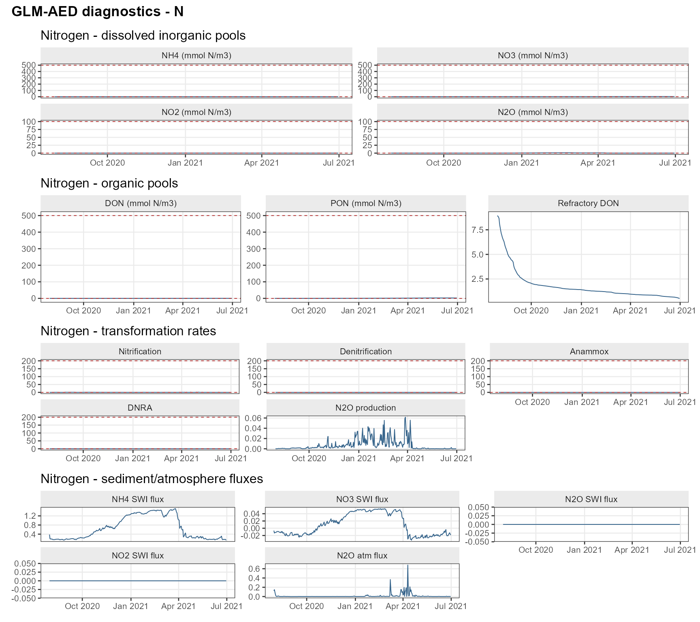
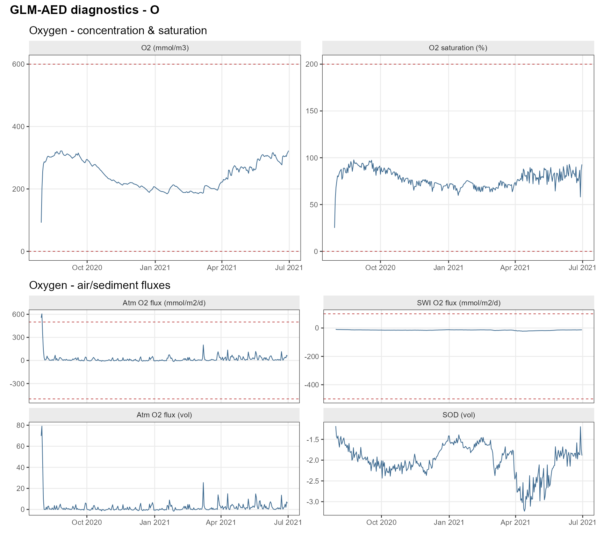
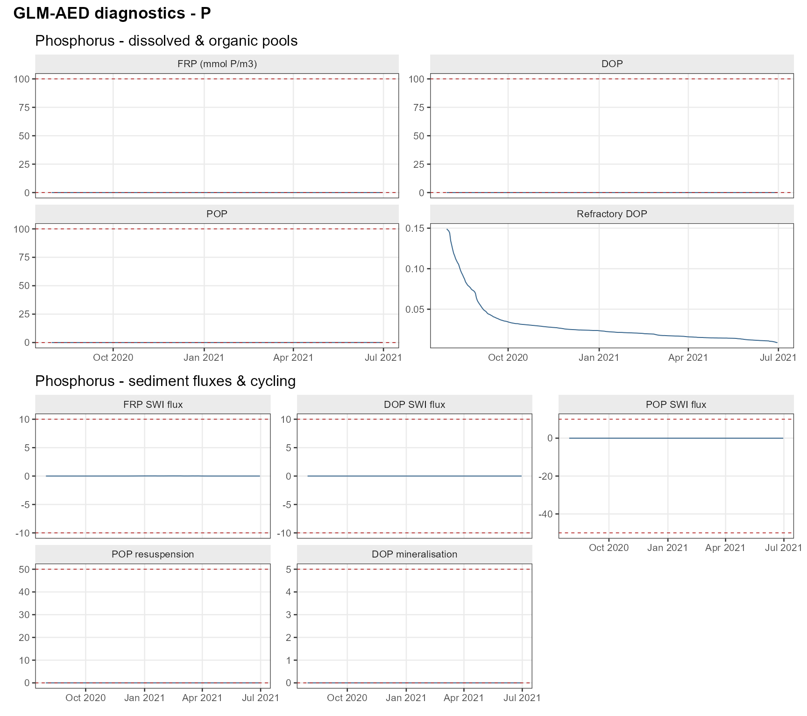
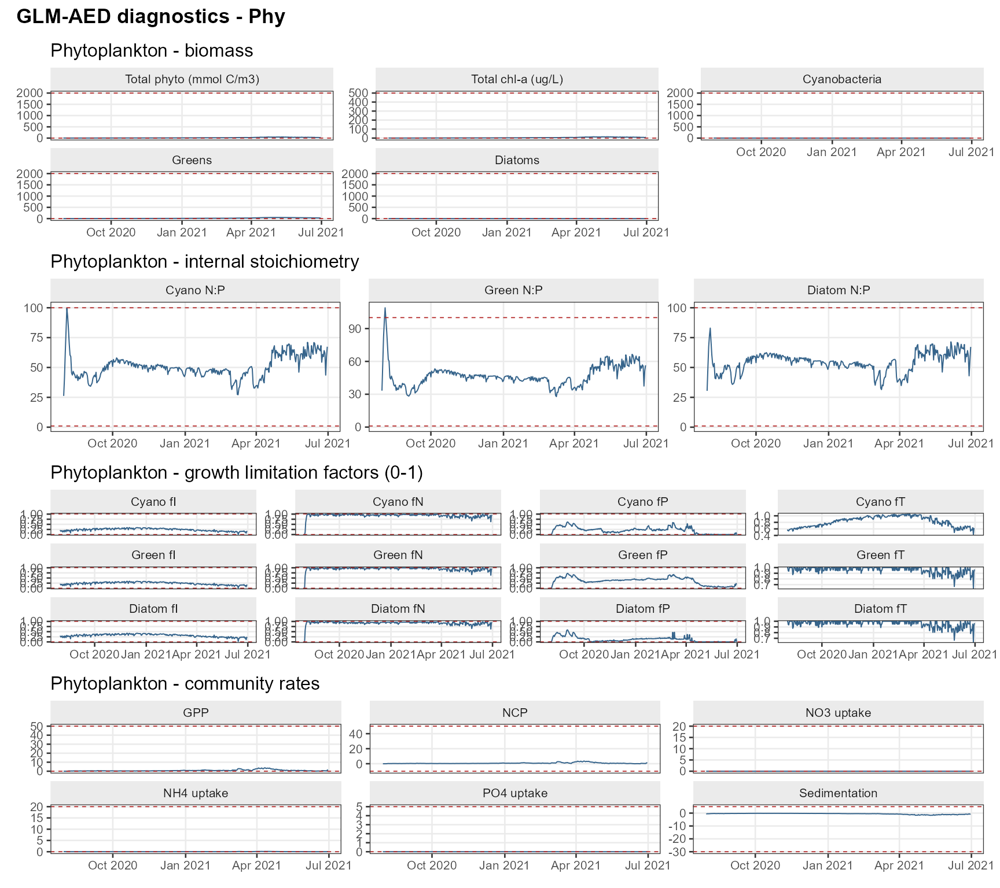
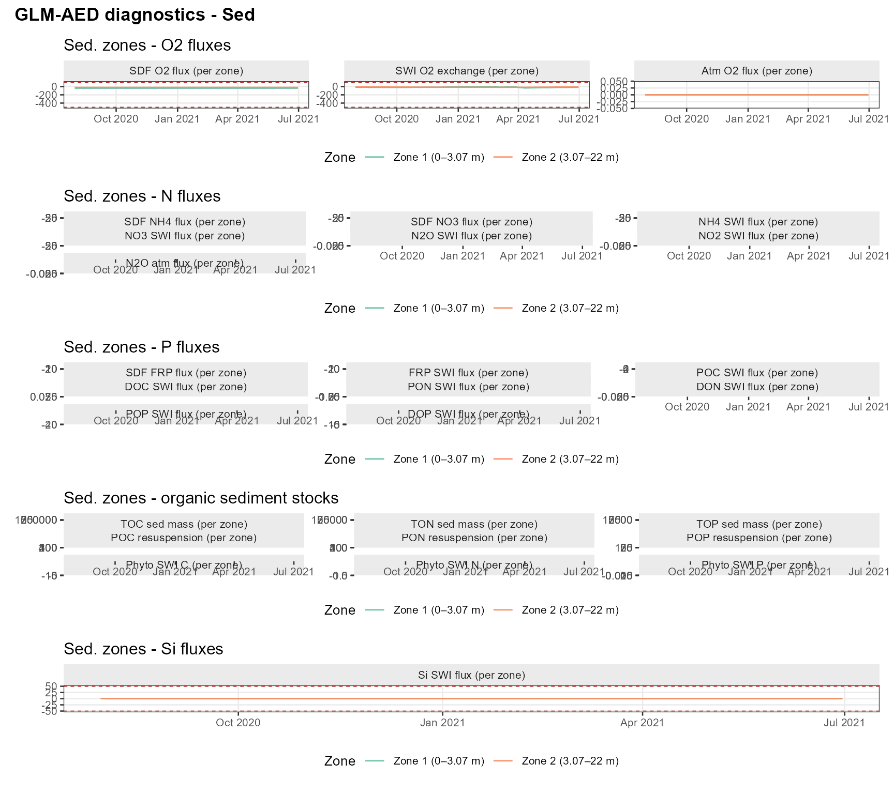
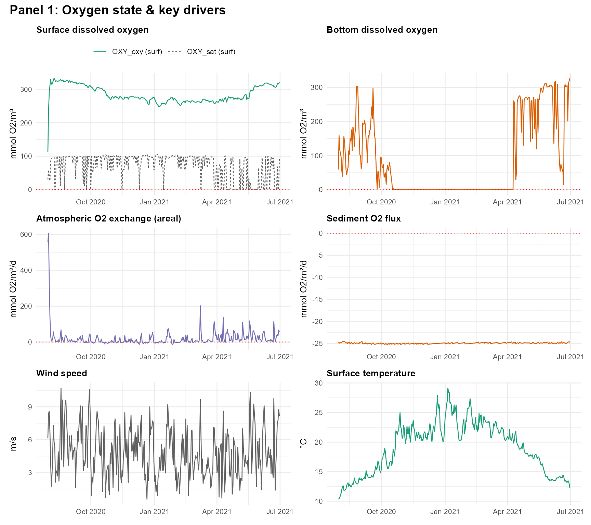
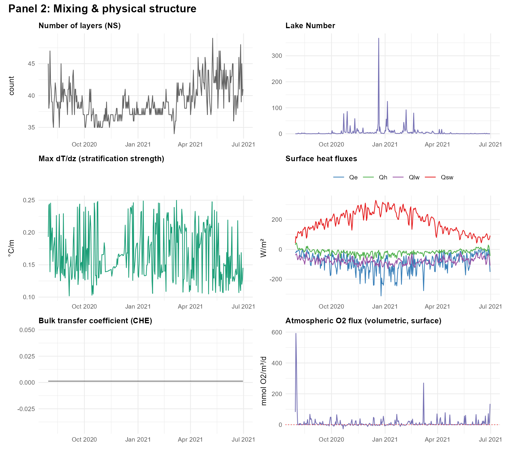
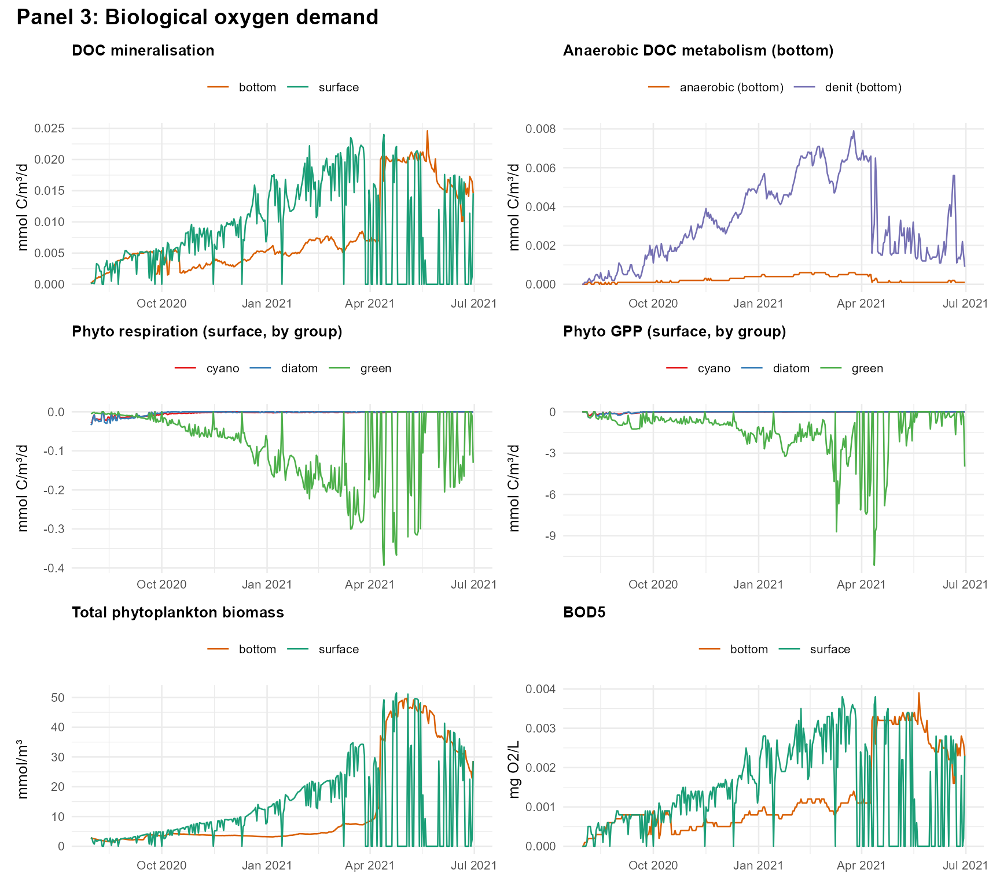
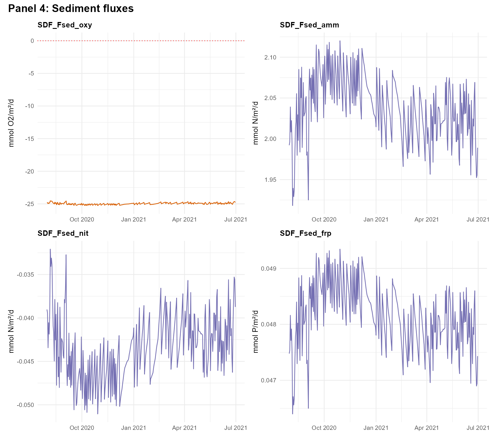

# GLM-AED: The General Lake Model coupled with AED

[⬇ Skip to Parameter Library](#parameter-library)

### Introduction

#### The General Lake Model (GLM)

The **General Lake Model (GLM)** is a one-dimensional (1-D),
variable-layer hydrodynamic model for lakes, reservoirs, and estuaries.
Originally described by Hipsey *et al.* (2019), GLM simulates the
vertical profiles of temperature, salinity, and density driven by
surface heat exchange, shortwave radiation, wind mixing, inflows, and
outflows. Its key architectural features include:

- **Variable-thickness layer scheme** — layers merge and split
  dynamically, giving high resolution where it is needed (near the
  thermocline) and coarser resolution elsewhere.
- **Flexible inflow/outflow** — supports multiple rivers, surface
  spillways, and subsurface outlets at arbitrary elevations.
- **Rich surface heat-flux options** — sensible heat, latent heat,
  longwave, and shortwave radiation computed from standard
  meteorological inputs.
- **Sediment heat exchange** — allows depth-varying bed temperatures to
  drive conductive heat flux into the water column.

There is more detailed GLM documentation available from the [GLM
website](https://aquatic.science.uwa.edu.au/research/models/GLM/),

Source code: :github:
<https://github.com/AquaticEcoDynamics/GLM/tree/master>

Binaries: :github: <https://github.com/AquaticEcoDynamics/Binaries>

##### References

Hipsey, M.R., Bruce, L.C., Boon, C., Busch, B., Carey, C.C., Hamilton,
D.P., Hanson, P.C., Read, J.S., de Sousa, E., Weber, M. & Winslow, L.A.
(2019). A General Lake Model (GLM 3.0) for linking with high-frequency
sensor data from the Global Lake Ecological Observatory Network (GLEON).
*Geoscientific Model Development*, 12, 473–523.
<https://doi.org/10.5194/gmd-12-473-2019>

------------------------------------------------------------------------

#### The Aquatic Ecosystem Dynamics (AED) library

The **Aquatic Ecodynamics (AED)** library (Hipsey *et al.*, 2013) is a
modular biogeochemical modelling framework designed to be coupled with
hydrodynamic models such as GLM. Each biogeochemical process is
implemented as a self-contained *module* that can be switched on or off
independently, making it easy to build simulations that range from
simple oxygen tracking through to full
nutrient–phytoplankton–zooplankton food-web dynamics.

There is a detailed AED manual available from the [AED
website](https://aquaticecodynamics.github.io/aed-science/), but here we
provide a brief overview of the key modules relevant for GLM-AED.

##### AED modules available in AEME

| Module | AED name | Description |
|----|----|----|
| Sediment flux | `aed_sedflux` | Sediment–water interface exchange of O₂, nutrients, and silica. Supports constant, constant-2D (depth-zone-specific), and dynamic flux models. |
| Oxygen | `aed_oxygen` | Dissolved-oxygen dynamics including reaeration, sediment oxygen demand (SOD), and photosynthesis/respiration coupling. |
| Silica | `aed_silica` | Reactive silica cycling — important for diatom growth. |
| Nitrogen | `aed_nitrogen` | Full dissolved inorganic nitrogen cycle: ammonium (NH₄⁺), nitrite (NO₂⁻), nitrate (NO₃⁻), N₂O; nitrification, denitrification, N-fixation. |
| Phosphorus | `aed_phosphorus` | Dissolved reactive phosphorus (DRP / FRP) including redox-sensitive sediment release. |
| Organic matter | `aed_organic_matter` | Particulate and dissolved organic carbon (POC/DOC) and organic nitrogen and phosphorus pools; mineralisation, decomposition. |
| Phytoplankton | `aed_phytoplankton` | Multi-group phytoplankton dynamics: growth, respiration, nutrient uptake, light limitation, settling, mortality. Default groups: cyanobacteria, green algae, diatoms. |
| Zooplankton | `aed_zooplankton` | Zooplankton grazing and dynamics. |
| Macrophytes | `aed_macrophyte` | Submerged and emergent macrophyte dynamics. |
| Totals | `aed_totals` | Diagnostic aggregates: TN, TP, TOC, chlorophyll-*a*. |

AED biogeochemical modules available in AEME. {.table}

#### GLM-AED Parameter Library

The `glm_aed_parameter_library` dataset provides a comprehensive list of
all parameters used in the GLM-AED configuration, including their
default values, units, and typical ranges. This library serves as a
reference for users to understand the parameters governing the model
behaviour and to guide parameterisation for specific applications. It
also includes metadata such as the associated AED module and a brief
description of each parameter’s role in the model and a web source link
for further information.

#### AED Phytoplankton Group Parameters

------------------------------------------------------------------------

### Getting started

``` r

library(AEME)
library(ggplot2)
library(dplyr)
```

We will use the example lake dataset bundled with the AEME package
throughout this vignette.

``` r

aeme_file <- system.file("extdata/aeme.rds", package = "AEME")
aeme     <- readRDS(aeme_file)
aeme
```


    #>                                                                                 
    #> ── AEME ────────────────────────────────────────────────────────────────────────
    #>                                                                                 
    #> ── Lake ──                                                                      
    #>                                                                                 
    #> Wainamu (ID: 45819)                                                             
    #> • Lat: -36.89; Lon: 174.47                                                      
    #> • Elev: 23.64m; Depth: 13.07m; Area: 152343 m2                                  
    #>                                                                                 
    #> ── Time ──                                                                      
    #>                                                                                 
    #> • Start: 2020-08-01; Stop: 2021-06-30; Time step: 3600                          
    #> • Spin up (days): GLM: 2; GOTM: 1; DYRESM: 1; Simstrat: 2                       
    #>                                                                                 
    #> ── Configuration ──                                                             
    #>                                                                                 
    #> • Model:                                                                        
    #> • Path: Not set                                                                 
    #> • Model controls: Absent                                                        
    #> • Use biogeochemical model: No                                                  
    #> ┌ Model Configuration ─────────────────────────────────────────┐                
    #> │       Model              Physical         Biogeochemical     │                
    #> │ ---                                                          │                
    #> │       DY-CD               Absent              Absent         │                
    #> │      GLM-AED              Absent              Absent         │                
    #> │      GOTM-WET             Absent              Absent         │                
    #> │   SIMSTRAT-AED2           Absent              Absent         │                
    #> └──────────────────────────────────────────────────────────────┘                
    #>                                                                                 
    #> ── Observations ──                                                              
    #>                                                                                 
    #> • Lake: Present; Level: Present                                                 
    #>                                                                                 
    #> ── Input ──                                                                     
    #>                                                                                 
    #> • Initial profile: Absent; Initial depth: 13.07m                                
    #> • Hypsograph: Present (n=132)                                                   
    #> • Meteo: Present; Use longwave: TRUE; Kw: 1.31                                  
    #>                                                                                 
    #> ── Inflows ──                                                                   
    #>                                                                                 
    #> • Number of inflows: 1; Names: FWMT                                             
    #> • Scaling factors: DY-CD: 1; GLM-AED: 1; GOTM-WET: 1; Simstrat-AED2: 1          
    #>                                                                                 
    #> ── Outflows ──                                                                  
    #>                                                                                 
    #> • Number of outflows: 1; Names: outflow; Elevations: -1                         
    #> • Scaling factors: DY-CD: 1; GLM-AED: 1; GOTM-WET: 1; Simstrat-AED2: 1          
    #>                                                                                 
    #> ── Water Balance ──                                                             
    #>                                                                                 
    #> • Method: 2; Use: obs                                                           
    #> • Modelled: Absent; Water balance: Absent                                       
    #>                                                                                 
    #> ── Parameters ──                                                                
    #>                                                                                 
    #> • Number of parameters: 0                                                       
    #>                                                                                 
    #> ── Output ──                                                                    
    #>                                                                                 
    #> • DY-CD: 0                                                                      
    #> • GLM-AED: 0                                                                    
    #> • GOTM-WET: 0                                                                   
    #> • SIMSTRAT-AED2: 0                                                              
    #> • Variables: 0                                                                  
    #> None                                                                            

------------------------------------------------------------------------

### Building a GLM-AED simulation

#### Model controls

[`get_model_controls()`](https://limnotrack.com/reference/get_model_controls.md)
returns a data frame that governs which biogeochemical variables are
simulated and how they are initialised. Pass `use_bgc = TRUE` to enable
the full suite of water-quality variables.

``` r

model_controls <- get_model_controls(use_bgc = TRUE)
head(model_controls)
#>    var_aeme simulate inf_default initial_wc initial_sed conversion_aed
#> 1   CAR_doc     TRUE           0        0.5       1e+06       0.012011
#> 2   CAR_poc     TRUE           0        0.2       1e-01       0.012011
#> 3   CHM_oxy     TRUE          10       10.0       1e+01       0.032000
#> 4  CHM_salt     TRUE           0        0.0       0e+00       1.000000
#> 5  HYD_dens     TRUE          NA         NA          NA       1.000000
#> 6 HYD_strat     TRUE          NA         NA          NA       1.000000
```

You can narrow the set of simulated variables using
[`set_vars_sim()`](https://limnotrack.com/reference/set_vars_sim.md):

``` r

vars_sim <- c(
  "HYD_strat",   # stratification flag
  "HYD_temp",    # water temperature
  "HYD_thmcln",  # thermocline depth
  "CHM_oxy",     # dissolved oxygen
  "CHM_oxycln",  # oxycline depth
  "NIT_amm",     # ammonium
  "NIT_nit",     # nitrate
  "NIT_tn",      # total nitrogen
  "PHS_frp",     # filterable reactive phosphorus
  "PHS_tp",      # total phosphorus
  "PHY_tchla"    # total chlorophyll-a
)

model_controls <- set_vars_sim(
  model_controls = model_controls,
  vars_sim       = vars_sim
)
```

#### Build the model

We will build the model in a directory called `aeme`,

``` r

path <- "aeme"
```

[`build_aeme()`](https://limnotrack.com/reference/build_aeme.md)
translates the AEME object into all configuration files required by
GLM-AED. Setting `use_bgc = TRUE` writes the `aed/aed.nml` file and
supporting CSV parameter files for phytoplankton, zooplankton, and
macrophytes.

``` r

model <- "glm_aed"

aeme <- build_aeme(
  aeme           = aeme,
  model          = model,
  path           = path,
  model_controls = model_controls,
  ext_elev       = 3,
  use_bgc        = TRUE
)
```

The configuration files are stored in the `configuration` slot of the
`aeme` object. For GLM-AED the slot contains the parsed `glm3.nml` and
`aed/aed.nml`:

``` r

cfg <- configuration(aeme)
names(cfg[["glm_aed"]])
#> [1] "hydrodynamic" "bgc"
```

------------------------------------------------------------------------

### GLM-AED specific features

#### Selecting AED biogeochemical modules

By default, all AED modules are enabled.
[`set_glm_aed_models()`](https://limnotrack.com/reference/set_glm_aed_models.md)
lets you choose a subset — for example, running hydrodynamics coupled
with oxygen and nutrient cycling *only*, without phytoplankton or
zooplankton:

``` r

# Rebuild first so we have a clean state
aeme <- build_aeme(
  aeme           = aeme,
  model          = model,
  model_controls = model_controls,
  path           = path,
  ext_elev       = 5,
  use_bgc        = TRUE
)

# Switch on all available modules (the default)
aeme <- set_glm_aed_models(
  aeme       = aeme,
  path       = path,
  aed_models = c(
    "aed_sedflux",
    "aed_oxygen",
    "aed_silica",
    "aed_nitrogen",
    "aed_phosphorus",
    "aed_organic_matter",
    "aed_phytoplankton",
    "aed_zooplankton",
    "aed_macrophyte",
    "aed_totals"
  )
)
```

To run a minimal simulation with only oxygen and nutrient cycling:

``` r

aeme <- set_glm_aed_models(
  aeme       = aeme,
  path       = path,
  aed_models = c(
    "aed_sedflux",
    "aed_oxygen",
    "aed_nitrogen",
    "aed_phosphorus"
  )
)
```

------------------------------------------------------------------------

#### Sediment zones

One of the most important GLM-AED features for water-quality simulation
is **depth-varying sediment parameters**. GLM divides the lake bed into
*sediment zones*, each with its own temperature regime and (when using
`aed_sedflux` in `Constant2d` mode) its own sediment–water interface
fluxes of oxygen and nutrients.

Deeper zones typically accumulate more organic matter, experience longer
periods of anoxia, and therefore have higher sediment oxygen demand
(SOD) and nutrient release than shallow littoral zones.

##### Estimating zone boundaries from the hypsograph

[`estimate_sed_zones()`](https://limnotrack.com/reference/estimate_sed_zones.md)
automatically partitions the hypsograph into an appropriate number of
zones by detecting natural breakpoints in the depth–area relationship:

``` r

hypsograph   <- get_hypsograph(aeme)
zone_heights <- estimate_sed_zones(hypsograph)
zone_heights
#> [1]  3.07 22.00
```

The returned vector gives the *upper height* of each zone measured from
the lake bed (metres). The last value equals the maximum lake depth.

##### Generating GLM sediment parameters

[`glm_sed_params()`](https://limnotrack.com/reference/glm_sed_params.md)
builds a parameters data frame (compatible with the AEME `parameters`
slot) for the GLM sediment module:

``` r

sed_params <- glm_sed_params(
  n_zones            = length(zone_heights),
  zone_heights       = zone_heights,
  sed_temp_mean      = c(14, 16, 18)[seq_along(zone_heights)],
  sed_temp_amplitude = c(6, 4, 2)[seq_along(zone_heights)],
  sed_temp_peak_doy  = rep(30, length(zone_heights))
)
sed_params
#>      model     file                        name value    min    max group index
#> 1  glm_aed glm3.nml       sediment/benthic_mode  2.00  2.000  2.000  <NA>    NA
#> 2  glm_aed glm3.nml            sediment/n_zones  2.00  2.000  2.000  <NA>    NA
#> 3  glm_aed glm3.nml     sediment/sed_heat_Ksoil  0.01  0.005  0.015  <NA>     1
#> 4  glm_aed glm3.nml     sediment/sed_heat_Ksoil  0.01  0.005  0.015  <NA>     2
#> 5  glm_aed glm3.nml     sediment/sed_temp_depth  0.20  0.100  0.300  <NA>     1
#> 6  glm_aed glm3.nml     sediment/sed_temp_depth  0.20  0.100  0.300  <NA>     2
#> 7  glm_aed glm3.nml      sediment/sed_temp_mean 14.00  7.000 21.000  <NA>     1
#> 8  glm_aed glm3.nml      sediment/sed_temp_mean 16.00  8.000 24.000  <NA>     2
#> 9  glm_aed glm3.nml sediment/sed_temp_amplitude  6.00  3.000  9.000  <NA>     1
#> 10 glm_aed glm3.nml sediment/sed_temp_amplitude  4.00  2.000  6.000  <NA>     2
#> 11 glm_aed glm3.nml  sediment/sed_temp_peak_doy 30.00 15.000 45.000  <NA>     1
#> 12 glm_aed glm3.nml  sediment/sed_temp_peak_doy 30.00 15.000 45.000  <NA>     2
#> 13 glm_aed glm3.nml       sediment/zone_heights  3.07  1.535  4.605  <NA>     1
#> 14 glm_aed glm3.nml       sediment/zone_heights 22.00 11.000 33.000  <NA>     2
#> 15 glm_aed glm3.nml   sediment/sed_reflectivity  0.01  0.005  0.015  <NA>     1
#> 16 glm_aed glm3.nml   sediment/sed_reflectivity  0.01  0.005  0.015  <NA>     2
#> 17 glm_aed glm3.nml      sediment/sed_roughness  0.01  0.005  0.015  <NA>     1
#> 18 glm_aed glm3.nml      sediment/sed_roughness  0.01  0.005  0.015  <NA>     2
#>      module
#> 1  sediment
#> 2  sediment
#> 3  sediment
#> 4  sediment
#> 5  sediment
#> 6  sediment
#> 7  sediment
#> 8  sediment
#> 9  sediment
#> 10 sediment
#> 11 sediment
#> 12 sediment
#> 13 sediment
#> 14 sediment
#> 15 sediment
#> 16 sediment
#> 17 sediment
#> 18 sediment
```

Add these parameters to the `aeme` object so that they are applied
during the next
[`build_aeme()`](https://limnotrack.com/reference/build_aeme.md) call:

``` r

parameters(aeme) <- sed_params

# Rebuild to apply the new sediment zone parameters
aeme <- build_aeme(
  aeme           = aeme,
  model          = model,
  model_controls = model_controls,
  path           = path,
  ext_elev       = 5,
  use_bgc        = TRUE
)
```

##### Inspecting sediment zones in the built model

After building, you can retrieve the number of zones and their
parameters:

``` r

n_zones   <- get_glm_sed_zones(aeme = aeme, path = path)
sed_pars  <- get_glm_sed_params(aeme = aeme, path = path)
cat("Number of sediment zones:", n_zones, "\n")
#> Number of sediment zones: 2
sed_pars
#>      model     file                        name value   min   max index group
#> 1  glm_aed glm3.nml     sediment/sed_heat_Ksoil  0.01  0.01  0.01     1  <NA>
#> 2  glm_aed glm3.nml     sediment/sed_heat_Ksoil  0.01  0.01  0.01     2  <NA>
#> 3  glm_aed glm3.nml     sediment/sed_temp_depth  0.20  0.20  0.20     1  <NA>
#> 4  glm_aed glm3.nml     sediment/sed_temp_depth  0.20  0.20  0.20     2  <NA>
#> 5  glm_aed glm3.nml      sediment/sed_temp_mean 14.00 14.00 14.00     1  <NA>
#> 6  glm_aed glm3.nml      sediment/sed_temp_mean 16.00 16.00 16.00     2  <NA>
#> 7  glm_aed glm3.nml sediment/sed_temp_amplitude  6.00  6.00  6.00     1  <NA>
#> 8  glm_aed glm3.nml sediment/sed_temp_amplitude  4.00  4.00  4.00     2  <NA>
#> 9  glm_aed glm3.nml  sediment/sed_temp_peak_doy 30.00 30.00 30.00     1  <NA>
#> 10 glm_aed glm3.nml  sediment/sed_temp_peak_doy 30.00 30.00 30.00     2  <NA>
#> 11 glm_aed glm3.nml       sediment/benthic_mode  2.00  2.00  2.00    NA  <NA>
#> 12 glm_aed glm3.nml            sediment/n_zones  2.00  2.00  2.00    NA  <NA>
#> 13 glm_aed glm3.nml       sediment/zone_heights  3.07  3.07  3.07     1  <NA>
#> 14 glm_aed glm3.nml       sediment/zone_heights 22.00 22.00 22.00     2  <NA>
#> 15 glm_aed glm3.nml   sediment/sed_reflectivity  0.01  0.01  0.01     1  <NA>
#> 16 glm_aed glm3.nml   sediment/sed_reflectivity  0.01  0.01  0.01     2  <NA>
#> 17 glm_aed glm3.nml      sediment/sed_roughness  0.01  0.01  0.01     1  <NA>
#> 18 glm_aed glm3.nml      sediment/sed_roughness  0.01  0.01  0.01     2  <NA>
```

##### Estimating depth-varying sediment fluxes

[`estimate_zone_fluxes()`](https://limnotrack.com/reference/estimate_zone_fluxes.md)
scales literature-baseline sediment fluxes to each zone according to its
mean depth and bed-area fraction (Tier 1). When observed near-bed
concentrations are available in the `aeme` object, an optional Tier 2
adjustment refines the inter-zone ratios using summer near-bottom data:

``` r

fluxes <- estimate_zone_fluxes(
  aeme      = aeme,
  path      = path,
  baseline  = c(
    fsed_oxy = -25,   # mmol O2/m2/d  (negative = into sediment)
    fsed_amm =   2,   # mmol N/m2/d
    fsed_nit =   0.2, # mmol N/m2/d
    fsed_frp =   0.05 # mmol P/m2/d
  ),
  verbose   = TRUE
)
```

The zone summary shows each zone’s depth range, bed area, and estimated
fluxes:

``` r

fluxes$zone_summary
#>       zone height_lower_m height_upper_m depth_upper_m depth_lower_m
#> Zone1    1           0.00           3.07            10         13.07
#> Zone2    2           3.07          22.00             0         10.00
#>       mean_depth_m area_m2 area_frac fsed_oxy fsed_amm fsed_nit fsed_frp
#> Zone1        11.54   43957     0.289    -38.8    5.835     -0.4   0.1035
#> Zone2         5.00  108386     0.711    -19.4    0.512      0.1   0.0259
```

##### Applying sediment fluxes to the AED configuration

[`set_aed_sed_const2d()`](https://limnotrack.com/reference/set_aed_sed_const2d.md)
writes the zone-specific fluxes directly into the `aed/aed.nml` file and
updates the `aeme` object:

``` r

aeme <- set_aed_sed_const2d(
  aeme     = aeme,
  path     = path,
  baseline = c(
    fsed_oxy = -25,
    fsed_amm =  2,
    fsed_nit =  0.2,
    fsed_frp =  0.05
  )
)
```

After calling
[`set_aed_sed_const2d()`](https://limnotrack.com/reference/set_aed_sed_const2d.md),
you can confirm the written parameters:

``` r

get_aed_sed_const2d_param(aeme = aeme, path = path) |>
  dplyr::select(name, value, index) |>
  head(20)
#> # A tibble: 11 × 3
#>    name                          value index
#>    <chr>                         <dbl> <dbl>
#>  1 aed_sed_const2d/active_zones   1        1
#>  2 aed_sed_const2d/active_zones   2        2
#>  3 aed_sed_const2d/fsed_amm       2        1
#>  4 aed_sed_const2d/fsed_amm       2        2
#>  5 aed_sed_const2d/fsed_frp       0.05     1
#>  6 aed_sed_const2d/fsed_frp       0.05     2
#>  7 aed_sed_const2d/fsed_nit      -0.2      1
#>  8 aed_sed_const2d/fsed_nit      -0.2      2
#>  9 aed_sed_const2d/fsed_oxy     -25        1
#> 10 aed_sed_const2d/fsed_oxy     -25        2
#> 11 aed_sed_const2d/n_zones        2       NA
```

------------------------------------------------------------------------

#### Visualising the model configuration

[`plot_glm_config()`](https://limnotrack.com/reference/plot_glm_config.md)
generates an interactive HTML visualisation of the complete GLM-AED
setup, including the hypsograph, sediment zones, inflow/outflow
positions, active AED modules, and key parameter values. If called
inside an RStudio session, the output opens in the Viewer pane;
otherwise it is saved to a temporary HTML file.

``` r

config_html <- plot_glm_config(aeme = aeme)
```

This html widget provides a comprehensive overview of the model
configuration, making it easy to verify that the setup matches your
intentions and to identify any potential issues before running the
model.

You can view the HTML widget directly in RStudio’s Viewer pane or open
it in your web browser.

Show parameter labels

## 

### Hypsograph & sediment zones

### AED biogeochemical modules

------------------------------------------------------------------------

### Running GLM-AED

``` r

aeme <- run_aeme(aeme = aeme)
```

------------------------------------------------------------------------

### Visualising model output

#### Temperature and stratification

[`plot_output()`](https://limnotrack.com/reference/plot_output.md)
produces a filled contour plot for depth-varying variables
(e.g. temperature) and a time-series line plot for scalar variables:

``` r

plot_output(aeme = aeme, var_sim = "HYD_temp")
```


Simulated water temperature (°C) at each model layer over time.

#### Water quality variables

Any variable that was listed in `vars_sim` and is present in the output
can be plotted the same way:

``` r

plot_output(aeme = aeme, var_sim = "CHM_oxy")
```


Simulated dissolved oxygen (mmol O2 m⁻³) profiles.

``` r

plot_output(aeme = aeme, var_sim = "PHY_tchla")
```


Simulated total chlorophyll-a (µg L⁻¹) time series.

------------------------------------------------------------------------

### Assessing model performance

When observations are stored in the `aeme` object,
[`assess_model()`](https://limnotrack.com/reference/assess_model.md)
computes a suite of skill metrics (RMSE, NSE, bias, Pearson *r*, etc.)
for each simulated variable:

``` r

skill <- assess_model(aeme = aeme, model = model)
skill
#>      Model    var_sim   bias   mae  rmse    nmae         nse    d2      r
#> 1  GLM-AED    CAR_doc -2.706 2.706 2.747   0.995     -33.064 0.764 -0.539
#> 2  GLM-AED  HYD_strat  0.100 0.100 0.316   0.143       0.524 0.033  0.764
#> 3  GLM-AED HYD_thmcln -2.669 2.987 4.361   0.311      -1.181 0.310  0.517
#> 4  GLM-AED  PHY_cyano -0.021 0.037 0.065   0.982      -0.401 0.261 -0.190
#> 5  GLM-AED  PHY_tchla -1.438 4.813 5.695   0.666      -1.997 1.131  0.082
#> 6  GLM-AED    NIT_amm -0.002 0.013 0.027   1.098      -1.006 0.389  0.800
#> 7  GLM-AED    NIT_nit  1.449 1.449 1.590 905.647 -658389.379 0.999  0.073
#> 8  GLM-AED     NIT_tn  1.299 1.299 1.470   6.856   -2951.882 0.969 -0.293
#> 9  GLM-AED    PHS_frp  0.000 0.003 0.005   1.394     -28.179 4.407  0.662
#> 10 GLM-AED     PHS_tp -0.007 0.008 0.009   0.710      -2.253 0.456  0.374
#> 11 GLM-AED CHM_oxycln  1.350 2.056 2.741   0.237      -0.133 0.292  0.496
#> 12 GLM-AED    CHM_oxy  0.643 0.976 1.410   0.142       0.805 0.070  0.922
#> 13 GLM-AED   CHM_salt -0.117 0.117 0.117   0.999    -328.602 0.914  0.592
#> 14 GLM-AED   HYD_temp -0.507 0.809 1.066   0.045       0.883 0.051  0.954
#>        rs    r2     B   n obs_na sim_na                name_text
#> 1  -0.350 0.291 0.008  10      0      0 Dissolved organic carbon
#> 2   0.764 0.583 0.395  10      0      0               Stratified
#> 3   0.437 0.267 0.084  10      0      0        Thermocline depth
#> 4  -0.124 0.036 0.015  10      0      0            Cyanobacteria
#> 5  -0.139 0.007 0.002  10      0      0      Total chlorophyll a
#> 6   0.817 0.641 0.213  20      0      0      Ammoniacal nitrogen
#> 7   0.015 0.005 0.000  20      0      0                  Nitrate
#> 8  -0.390 0.086 0.000  20      0      0           Total nitrogen
#> 9   0.453 0.438 0.015  20      0      0                Phosphate
#> 10 -0.199 0.140 0.033  20      0      0         Total phosphorus
#> 11  0.607 0.246 0.115  30      0      0           Oxycline depth
#> 12  0.938 0.850 0.712 125      0      0         Dissolved oxygen
#> 13  0.670 0.351 0.001 125      0      0                 Salinity
#> 14  0.946 0.909 0.814 125      0      0        Water temperature
#>                           name_parse
#> 1  Dissolved~organic~carbon~(g~m^-3)
#> 2                     Stratified~(1)
#> 3              Thermocline~depth~(m)
#> 4         Cyanophytes~(mg~chla~m^-3)
#> 5      Total~chlorophyll~a~(mg~m^-3)
#> 6       Ammoniacal~nitrogen~(g~m^-3)
#> 7                 Nitrate-N~(g~m^-3)
#> 8            Total~nitrogen~(g~m^-3)
#> 9               Phosphate-P~(g~m^-3)
#> 10         Total~phosphorus~(g~m^-3)
#> 11                Oxycline~depth~(m)
#> 12        Dissolved~oxygen~(mg~L^-1)
#> 13                    Salinity~(PSU)
#> 14            Temperature~(degree~C)
```

------------------------------------------------------------------------

### GLM-AED diagnostics

#### Comprehensive diagnostic report

[`run_glm_aed_diagnostics()`](https://limnotrack.com/reference/run_glm_aed_diagnostics.md)
reads the model output and produces a structured diagnostic report — a
summary table and a set of grouped plots — that helps you quickly
identify unrealistic values or mass-balance issues:

``` r

diag <- run_glm_aed_diagnostics(
  aeme        = aeme,
  plot        = TRUE,
  print_table = TRUE
)
```



The function returns a list with three components:

- `$summary` — a data frame with min, median, mean, max, and a `flag`
  column (`"ok"` or a warning string) for each variable.
- `$plots` — a named list of `patchwork` plot objects grouped by
  biogeochemical element (`O`, `N`, `P`, `Phy`, `Sed`).
- `$data` — the tidy data frame used to produce the plots.

You can filter the diagnostics to a specific element or type:

``` r

# Nitrogen state variables only
diag_N <- run_glm_aed_diagnostics(
  aeme        = aeme,
  groups      = "N",
  plot        = TRUE,
  print_table = FALSE
)

# Process-rate variables only
diag_proc <- run_glm_aed_diagnostics(
  aeme        = aeme,
  groups      = "process",
  plot        = FALSE,
  print_table = TRUE
)
```

#### Oxygen diagnostic page

[`plot_glm_diagnostics()`](https://limnotrack.com/reference/plot_glm_diagnostics.md)
provides a focused four-page diagnostic panel specifically designed to
debug anomalous dissolved oxygen behaviour — a common challenge when
coupling hydrodynamics with biogeochemistry:

``` r

pages <- plot_glm_diagnostics(aeme = aeme)

# Page 1: oxygen state and key physical drivers
print(pages$oxy)
```



``` r

# Page 2: mixing and physical structure
print(pages$physical)
```



``` r

# Page 3: biological oxygen demand
print(pages$bod)
```



``` r

# Page 4: sediment–water interface fluxes
print(pages$sediment)
```



------------------------------------------------------------------------

### Working with the GLM configuration directly

The raw `glm3.nml` file and `aed/aed.nml` file can be read, modified,
and written using the NML helpers bundled with AEME:

``` r

# Retrieve the parsed configuration
cfg <- read_model_config(model = "glm_aed",
                         lake_dir = get_lake_dir(aeme))

# Access GLM hydrodynamic section
glm_nml <- cfg$hydrodynamic
glm_nml$morphometry$lake_name

# Access AED biogeochemistry section
aed_nml <- cfg$bgc$aed
aed_nml$aed_nitrogen$rnitrif   # nitrification rate
```

#### Retrieving parameters by module

[`get_aeme_parameters()`](https://limnotrack.com/reference/get_aeme_parameters.md)
provides a convenient way to query the AEME parameter library for all
GLM-AED parameters belonging to a particular module:

``` r

# All GLM-AED light parameters
light_params <- get_aeme_parameters(model = "glm_aed",
                                    module = "light")
light_params[, c("name", "value", "min", "max")]
#> # A tibble: 6 × 4
#>   name               value   min    max
#>   <chr>              <dbl> <dbl>  <dbl>
#> 1 light/light_mode    0    0      0    
#> 2 light/n_bands       4    2      6    
#> 3 light/light_extc    1    0.5    1.5  
#> 4 light/energy_frac   0.51 0.255  0.765
#> 5 light/Benthic_Imin 10    5     15    
#> 6 light/Kw            0.2  0.1    0.3
```

``` r

# AED nitrogen module parameters
n_params <- get_aeme_parameters(model = "glm_aed",
                                module = "nitrogen")
n_params[, c("name", "value", "min", "max")]
#> # A tibble: 62 × 4
#>    name                          value     min      max
#>    <chr>                         <dbl>   <dbl>    <dbl>
#>  1 aed2_nitrogen/theta_sed_amm   1.08   0.54     1.62  
#>  2 aed2_nitrogen/Fsed_amm       30     15       45     
#>  3 aed2_nitrogen/Ksed_amm       31.2   15.6     46.9   
#>  4 aed2_nitrogen/Fsed_n2o        0      0        0     
#>  5 aed2_nitrogen/Ksed_n2o      100     50      150     
#>  6 aed2_nitrogen/theta_sed_nit   1.08   0.54     1.62  
#>  7 aed2_nitrogen/Fsed_nit        5.2    2.6      7.8   
#>  8 aed2_nitrogen/Ksed_nit      100     50      150     
#>  9 aed2_nitrogen/Kpart_ammox     1      0.5      1.5   
#> 10 aed2_nitrogen/Ranammox        0.001  0.0005   0.0015
#> # ℹ 52 more rows
```

------------------------------------------------------------------------

### Summary

This vignette demonstrated the key GLM-AED-specific features available
in AEME:

1.  **Model description** — GLM provides variable-layer 1-D
    hydrodynamics; AED supplies modular biogeochemistry ranging from
    simple oxygen dynamics through to full nutrient–phytoplankton
    food-web simulation.

2.  **Module selection** —
    [`set_glm_aed_models()`](https://limnotrack.com/reference/set_glm_aed_models.md)
    lets you enable or disable individual AED modules to match the
    complexity and data requirements of your application.

3.  **Sediment zones** — The
    [`estimate_sed_zones()`](https://limnotrack.com/reference/estimate_sed_zones.md)
    →
    [`glm_sed_params()`](https://limnotrack.com/reference/glm_sed_params.md)
    →
    [`set_aed_sed_const2d()`](https://limnotrack.com/reference/set_aed_sed_const2d.md)
    workflow automatically derives depth-varying sediment parameters
    from the lake hypsograph and optional near-bed observations.

4.  **Configuration visualisation** —
    [`plot_glm_config()`](https://limnotrack.com/reference/plot_glm_config.md)
    provides an interactive overview of the model setup.

5.  **Diagnostics** —
    [`run_glm_aed_diagnostics()`](https://limnotrack.com/reference/run_glm_aed_diagnostics.md)
    and
    [`plot_glm_diagnostics()`](https://limnotrack.com/reference/plot_glm_diagnostics.md)
    offer structured, automated checks for common biogeochemical issues
    (unrealistic concentrations, oxygen anomalies, excessive or
    negligible fluxes).

6.  **Parameter access** —
    [`get_aeme_parameters()`](https://limnotrack.com/reference/get_aeme_parameters.md)
    makes it easy to explore and modify individual model parameters for
    manual tuning or automated calibration (see the
    [aemetools](https://github.com/limnotrack/aemetools) package).
