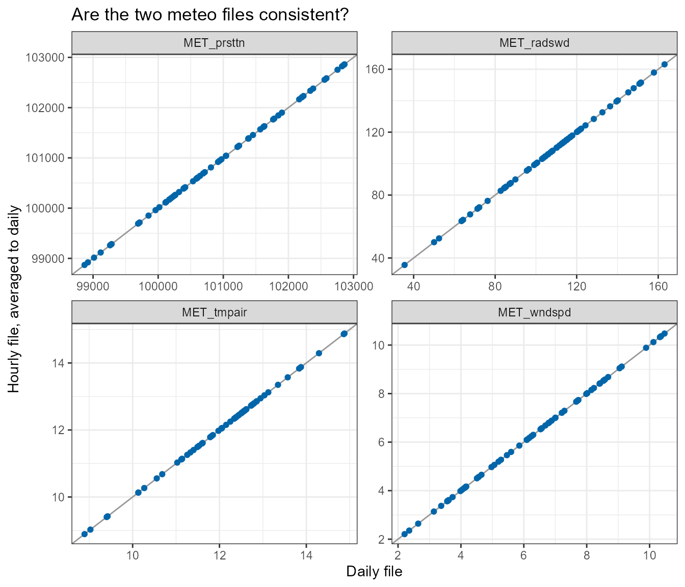
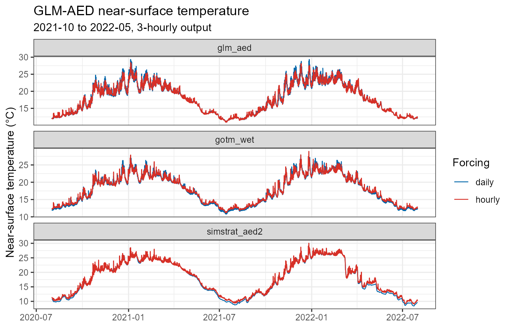
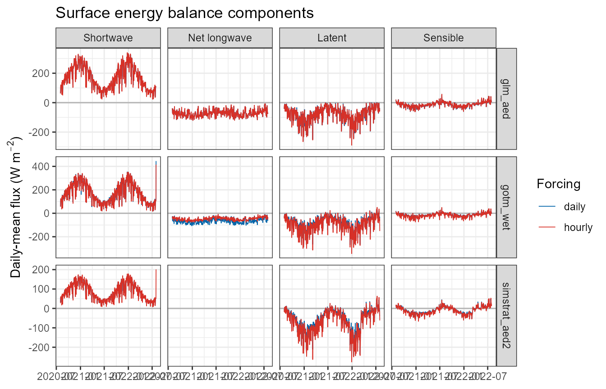
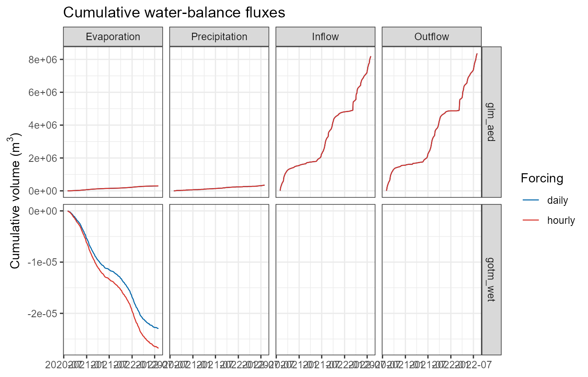
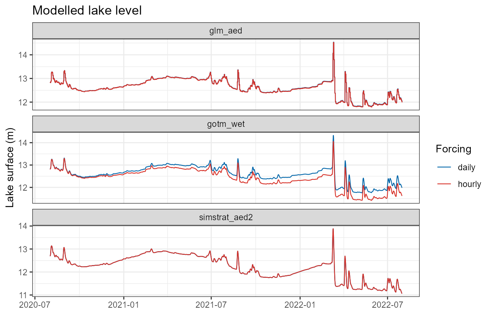
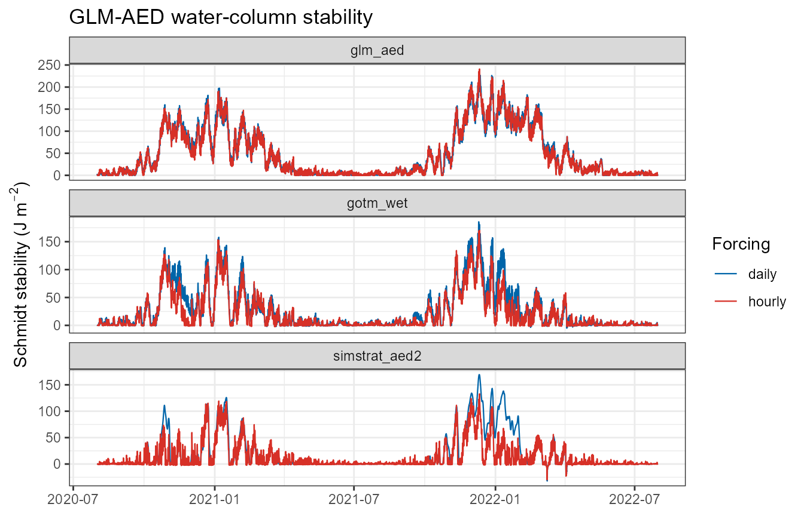
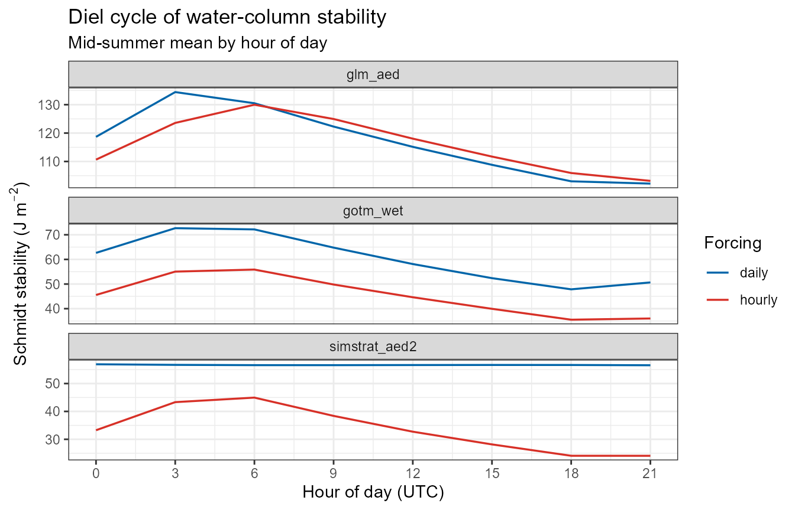
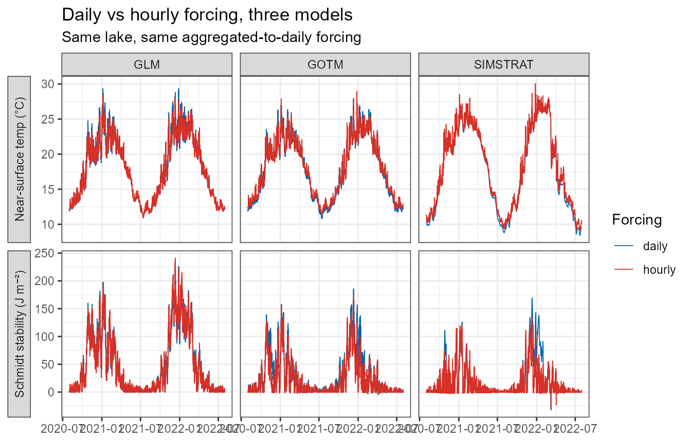

# Hourly vs daily meteorological forcing

## Introduction

AEME accepts meteorological forcing at any regular time step. The two
common choices are **daily** (one row per day, the historical default)
and **hourly** (sub-daily, e.g. ERA5 at native resolution). This article
explains what changes when you switch from daily to hourly forcing, and
— importantly — how that change is expressed differently by each of the
three hydrodynamic models (GLM-AED, GOTM-WET, Simstrat-AED2).

The single most important thing to understand:

> **AEME never temporally disaggregates forcing.** It does not invent
> sub-daily structure from daily inputs. Sub-daily *output* therefore
> requires sub-daily *input*. What daily-vs-hourly changes is (a) how
> much real sub-daily variability the model sees, and (b) how each model
> fills the gaps between the timestamps you supplied.

To temporally disaggregate forcing, use the
[metscale](https://limnotrack.com/metscale/) package, which can generate
sub-daily forcing from daily inputs.

A second point that is easy to miss:

> The meteorological time step is **not** the model integration time
> step. Even a “daily” AEME run integrates internally at
> `time(aeme)$time_step` (3600 s by default) for GLM and GOTM, and at
> 300 s for Simstrat. Daily forcing does not make the physics daily — it
> makes the *forcing* daily.

## What the daily-vs-hourly switch controls

The switch is detected automatically by `is_subdaily()`, which looks at
the median spacing between successive timestamps in the meteo `Date`
column. A `Date` vector, or a `POSIXct` vector that is entirely at
midnight, is treated as daily; anything with a median spacing below 24 h
is sub-daily.

``` r

library(AEME)

# daily_met  <- read.csv(
#   system.file("extdata/lake/data/meteo.csv", package = "AEME")
# )
hourly_met <- readr::read_csv(
  system.file("extdata/lake/data/meteo_era5_hr.csv.gz", package = "AEME")
)
daily_met <- collapse_met_daily(hourly_met, precip = "sum")

aeme_daily  <- add_met(aeme, met = daily_met)
aeme_hourly <- add_met(aeme, met = hourly_met)
```

To get sub-daily **output** as well, raise `output_time_step` (it
defaults to 86400 s and must be `>= time_step`). It can be set as part
of [`set_time()`](https://limnotrack.com/reference/set_time.md):

``` r

aeme_hourly <- set_time(
  aeme_hourly,
  start = "2021-07-01 00:00:00",
  stop  = "2022-07-01 00:00:00",
  spin_up = 35,
  output_time_step = 3600   # hourly output; omit for daily output from hourly forcing
)
```

or, if the run period is already set, with the generic convenience
wrapper
[`set_output_time_step()`](https://limnotrack.com/reference/set_output_time_step.md),
which accepts either seconds or a frequency string (`"hourly"`,
`"daily"`, `"weekly"`, `"6 hours"`, `"30 min"`, …) and applies to every
model in the ensemble:

``` r

aeme_hourly <- set_output_time_step(aeme_hourly, "hourly")
aeme_6h     <- set_output_time_step(aeme_hourly, "6 hours")
```

### Pipeline steps that behave differently

| Stage | Daily forcing | Hourly forcing |
|----|----|----|
| **Derived variables** ([`expand_met()`](https://limnotrack.com/reference/expand_met.md) / [`standardise_met()`](https://limnotrack.com/reference/standardise_met.md)) | Vapour pressure, humidity, wind components, and **cloud cover** are derived at daily resolution. `calc_cc()` builds *temporary* internal hourly steps to integrate clear-sky radiation correctly, then averages cloud cover back to daily. | The same variables are derived directly at the native sub-daily resolution; `calc_cc()` uses the supplied timestamps as-is. [`standardise_met()`](https://limnotrack.com/reference/standardise_met.md) also rescales `MET_pprain` / `MET_ppsnow` from a per-step accumulation to a mm/day rate (see below). |
| **Water balance** (`calc_water_balance()`) | Runs per day. | Sub-daily meteo is **averaged to a daily time step first** ([`collapse_met_daily()`](https://limnotrack.com/reference/collapse_met_daily.md); precipitation is already a mm/day rate by this point, so a daily mean is the daily rate). The fitted outflow / inflow correction (`outf_wbal`) is therefore always a daily series, exactly like a normal inflow. |
| **Surface-temperature estimate** ([`estimate_surface_temperature()`](https://limnotrack.com/reference/estimate_surface_temperature.md)) | Daily energy-balance integration (`dt = 86400`). | Same — it consumes the daily-collapsed meteo from the water-balance step, not the raw hourly series. |
| **Model forcing files** | Written with a bare date (GLM) or `date <tab> 12:00:00 <tab> value` (GOTM), or an integer day number (Simstrat). | Written with a full timestamp split into date + time-of-day columns (GLM, GOTM) or a **fractional** day number (Simstrat). |
| **Output cadence** | One row per day. | `output_time_step / dt` rows per day; the output time axis keeps its time-of-day (`.collapse_output_date()` only drops it when every timestamp is midnight). |

Everything below the water-balance line in that table is where the
**models diverge**.

## Per-model behaviour

### GLM-AED

GLM has an explicit switch, `&meteorology/subdaily`, set by
`build_glm()`:

``` r

glm_nml$meteorology$subdaily <- (output_time_step < 86400) || is_subdaily(met$Date)
glm_nml$output$nsave         <- max(1L, round(output_time_step / dt_glm))  # dt_glm default 3600
```

- **Daily forcing, `subdaily = .false.`** (the default). GLM reads one
  met row per day and **synthesises the diurnal shortwave cycle itself**
  from the daily mean short-wave radiation and the solar geometry for
  the lake’s latitude/longitude and day of year. Air temperature, wind,
  humidity, pressure and rainfall are supplied only as daily values (GLM
  interpolates between them), so they carry no weather-scale sub-daily
  structure — no gust fronts, morning fog burn-off, or afternoon wind
  maximum. A daily GLM run still has a day/night heating cycle, but it
  is a *modelled* cycle driven by clear-sky geometry scaled to the daily
  mean.
- **Hourly forcing, `subdaily = .true.`** GLM reads the meteo file at
  its own integration step and uses each value directly — no synthesis.
  The shortwave cycle, and every other variable, now carries the
  observed sub-daily variability. `bcs/meteo_glm.csv` is written with a
  full `YYYY-MM-DD HH:MM:SS` timestamp instead of a bare date.
- **Output.** `nsave` is the number of integration steps per output row:
  24 for daily output (`dt` 3600 s), 1 for hourly output.

**Net effect for GLM:** switching to hourly forcing adds *weather-scale*
variability on top of a diurnal cycle GLM already had, and — because
GLM’s bulk turbulent-flux formulae are sensitive to the diurnal
covariance of wind and the air–water gradient — it can also shift the
**seasonal mean**: in the worked comparison below, GLM’s mid-summer
surface temperature and Schmidt stability both move substantially.
Expect changes in mixed-layer depth, the magnitude of stratification /
mixing events, near-surface temperature, and the surface energy and
water budgets.

### GOTM-WET

GOTM has **no daily/sub-daily mode**. It always integrates at
`time(aeme)$time_step` (3600 s by default) and **linearly interpolates
every input time series** (`method: 2` in `gotm.yaml`) from the
timestamps in the file to its integration step.

The consequence is that GOTM’s behaviour depends entirely on what is
*in* the files:

- **Shortwave radiation is special-cased.** For daily forcing,
  `build_gotm()` (via `make_met_gotm(est_swr_hr = TRUE)`) calls
  `estimate_hourly_swr()` to disaggregate the daily-mean short-wave into
  an hourly, clear-sky-shaped curve written to `inputs/meteo_swr.dat`.
  So a daily GOTM run *does* get a realistic diurnal light cycle. For
  hourly forcing this step is skipped and the native short-wave series
  is written through unchanged.
- **All other variables** (air temperature, wind components, pressure,
  humidity/dewpoint, precipitation, cloud) are written to
  `inputs/meteo.dat` at whatever resolution you supplied. With daily
  forcing they are piecewise-linear ramps between daily values — no
  diurnal cycle in air temperature or wind. With hourly forcing they
  carry the real sub-daily signal.
- **File format.** `meteo.dat` / `meteo_swr.dat` / the inflow and
  outflow files are `date <tab> time <tab> value…`. For daily data the
  time column is the nominal `12:00:00`; for sub-daily data the real
  time-of-day is written. (A timestamp with an embedded space in the
  date column shifts every field and breaks GOTM’s reader — this is why
  the split is done explicitly.)
- **Output.** `output.yaml` is left at its shipped daily setting unless
  `output_time_step < 86400`, in which case it is rewritten to
  `time_unit: second`, `time_step: <output_time_step>`.

**Net effect for GOTM:** the diurnal *light* cycle is present either
way, but with daily forcing the diurnal cycles of **air temperature and
wind** are absent (linear ramps). Hourly forcing adds day/night wind and
air-temperature swings, which drive night-time convective mixing and
daytime near-surface warming that a daily GOTM run damps out. This is
typically a **larger** day-to-day difference than GLM shows.

### Simstrat-AED2

Simstrat, like GOTM, has no daily/sub-daily mode. It integrates at
`Simulation/"Timestep s"` (300 s in the shipped template) and **linearly
interpolates `MeteoForcing.dat`** to that step. Unlike GOTM, there is
**no shortwave disaggregation** — `make_met_simstrat()` writes
`met$MET_radswd` exactly as supplied.

- **Daily forcing.** Every meteo column, *including short-wave
  radiation*, is a daily mean. Linear interpolation between daily means
  means the modelled lake sees an almost flat, ~24-h-smoothed radiation
  input: **the diurnal light cycle is essentially absent.** Daytime
  surface heating and night-time cooling are both strongly damped, so a
  daily Simstrat run tends to under-predict the amplitude of
  near-surface diurnal temperature variation and can mistime the
  onset/breakdown of daily stratification.
- **Hourly forcing.** The native diurnal cycles of radiation, wind and
  air temperature are all present; this is the configuration Simstrat is
  really designed for.
- **Time convention.** `MeteoForcing.dat` (and the inflow/outflow files)
  use a day number relative to `Simulation/"Reference year"`. Daily data
  lands on integer day numbers; hourly data lands on **fractional** day
  numbers (`date_to_simstrat_day()` returns fractional days for any
  sub-daily timestamp), which Simstrat handles natively.
- **Output.** `Output/Times` is set to `output_time_step / "Timestep s"`
  so that one output row corresponds to one `output_time_step` interval.

**Net effect for Simstrat:** daily forcing removes the diurnal radiation
cycle entirely (no synthesis fallback), so Simstrat has the most
degraded inputs of the three. In the worked comparison its summer
stability is as resolution-sensitive as GLM-AED’s (~60 % lower under
hourly forcing) once the lake is tuned to stratify at all. If you care
about sub-daily dynamics, or the correct *amplitude* of daily
surface-layer behaviour in Simstrat, supply hourly forcing.

### Summary of per-model differences

|  | GLM-AED | GOTM-WET | Simstrat-AED2 |
|----|----|----|----|
| Daily/sub-daily switch | `&meteorology/subdaily` (explicit) | none — interpolates the files | none — interpolates the files |
| Integration step (unchanged by met resolution) | `time_step` (def. 3600 s) | `time_step` (def. 3600 s) | `"Timestep s"` (def. 300 s) |
| Diurnal **shortwave** with *daily* forcing | synthesised from solar geometry | synthesised (`estimate_hourly_swr()`) | **none** (daily mean, interpolated) |
| Diurnal **air temp / wind** with *daily* forcing | interpolated between daily values (no weather-scale cycle) | linear ramp between days | linear ramp between days |
| Forcing-file timestamp | bare date / full `YYYY-MM-DD HH:MM:SS` | `date <tab> time` (`12:00:00` if daily) | integer / fractional day number |
| Output cadence control | `output/nsave` | `output.yaml` `time_step` | `Output/Times` |
| *Mechanistic* exposure to the switch (diurnal structure daily forcing removes) | low–moderate | moderate | high |

The last row ranks how much diurnal structure daily forcing strips from
each model’s *inputs*. The **realised** difference for a given lake
depends on the lake’s stratification regime and on which quantity you
look at. In the [worked
comparison](#does-every-model-respond-the-same-way) below, summer
stratification weakens under hourly forcing in all three models by a
broadly similar amount (least in GOTM-WET, whose shortwave cycle is
reconstructed either way), but only GLM-AED’s seasonal-mean *surface
temperature* shifts materially.

## When to use hourly forcing

Use **hourly** forcing when:

- you need sub-daily output (diel oxygen, diel temperature, sub-daily
  mixing);
- diurnal wind and air-temperature cycles matter to your question —
  night-time convective mixing, daytime surface warming, diel
  stratification;
- you are running **Simstrat** and care about the amplitude or timing of
  surface-layer dynamics — its daily-forcing inputs are the most
  degraded, and the [worked
  comparison](#does-every-model-respond-the-same-way) bears this out:
  once the lake is tuned to stratify, its summer stability falls ~60 %
  under hourly forcing;
- your forcing product is natively sub-daily (ERA5, local AWS) — there
  is no reason to average it down.

**Daily** forcing is fine when:

- you only need daily or coarser output and seasonal-to-interannual
  dynamics;
- you are running GLM or GOTM, where the diurnal light cycle is
  reconstructed;
- forcing storage / run time is a constraint (hourly forcing is ~24× the
  rows and roughly proportionally slower to read and interpolate).

Regardless of which you pick, the **water balance** is computed daily —
hourly forcing is averaged to a daily time step before the outflow
rating curve and surface-temperature relaxation are fitted, so
`wb_method` results are directly comparable between a daily and an
hourly run of the same lake.

Inflows and outflows do **not** have to match the meteo resolution. They
are boundary fluxes each model interpolates to its own integration step,
so a daily inflow series with an hourly meteo file and hourly output is
fine — only meteorology is held to the `output_time_step` cadence.

## Comparing the daily and hourly meteo

Before running anything, it is worth checking that the daily and hourly
files actually describe the *same* forcing at different resolutions.

### Precipitation: rate vs accumulation (handled automatically)

AEME defines `MET_pprain` and `MET_ppsnow` as a **rate in mm/day**.
Every model met-writer assumes that — `make_met_glm()` divides by 1000
to get m/day, `make_met_simstrat()` by `1000 * 24` to get m/hr,
`make_met_gotm()` by 86400.

Sub-daily reanalysis products (ERA5 `tp`, most AWS logs) instead report
precipitation as an **accumulation per timestep** — millimetres that
fell *during that hour*. Numerically the two are identical for daily
data (mm in a day = mm/day, which is why the daily path always “just
worked”); they are **not** identical sub-daily, where an accumulation of
0.4 mm in an hour is a rate of 9.6 mm/day.

[`standardise_met()`](https://limnotrack.com/reference/standardise_met.md)
now resolves this automatically: when the meteo is sub-daily it rescales
`MET_pprain` / `MET_ppsnow` from a per-step accumulation to the mm/day
rate by `86400 / step_seconds`, and says so:

    i Sub-daily meteo: rescaled "MET_pprain" and "MET_ppsnow" from a per-3600-s
      accumulation to a mm/day rate (x24).

[`build_aeme()`](https://limnotrack.com/reference/build_aeme.md) calls
[`standardise_met()`](https://limnotrack.com/reference/standardise_met.md)
for you, so nothing extra is needed. If your sub-daily precipitation is
genuinely already a mm/day *rate*, opt out with
`standardise_met(met, precip_accum = FALSE)`.

The check below shows the effect — the sum of the raw hourly values over
a day (≈ the true daily total) lines up with the daily file, while their
mean is ~1/24 of it; the automatic `x24` rescale turns the per-hour
values into that daily-total rate:

``` r

library(dplyr)
library(ggplot2)

hourly_met <- readr::read_csv(
  system.file("extdata/lake/data/meteo_era5_hr.csv.gz", package = "AEME"),
  show_col_types = FALSE
) |>
  mutate(Date = as.POSIXct(Date, tz = "UTC"))

daily_met <- collapse_met_daily(hourly_met, precip = "sum")

hourly_daily <- hourly_met |>
  mutate(day = as.Date(Date)) |>
  group_by(day) |>
  summarise(rain_sum  = sum(MET_pprain),   # ≈ true daily total (mm)
            rain_mean = mean(MET_pprain),  # per-hour mean (mm/hr)
            .groups = "drop")

daily_met |>
  transmute(day = Date, rain_daily = MET_pprain) |>
  inner_join(hourly_daily, by = "day") |>
  summarise(
    mean_daily_source     = mean(rain_daily),
    mean_hourly_summed     = mean(rain_sum),
    mean_hourly_permin      = mean(rain_mean),
    ratio_summed_to_daily   = mean(rain_sum)  / mean(rain_daily),
    ratio_permin_to_daily   = mean(rain_mean) / mean(rain_daily)
  )
#> # A tibble: 1 × 5
#>   mean_daily_source mean_hourly_summed mean_hourly_permin ratio_summed_to_daily
#>               <dbl>              <dbl>              <dbl>                 <dbl>
#> 1              3.34               3.34              0.139                     1
#> # ℹ 1 more variable: ratio_permin_to_daily <dbl>
```

### Other variables: check the aggregation is faithful

For instantaneous variables (air temperature, wind, radiation, pressure,
humidity) the daily file should be close to the *mean* of the hourly
file over the same day. Radiation is the exception where it matters most
— a daily-mean short-wave of, say, 200 W m⁻² is the same energy as a
0–800 W m⁻² diurnal cycle, but only the models that reconstruct the
cycle (GLM, GOTM) will heat the surface realistically from it.

``` r

vars <- c("MET_tmpair", "MET_radswd", "MET_wndspd", "MET_prsttn")

hourly_daily <- hourly_met |>
  mutate(day = as.Date(Date)) |>
  group_by(day) |>
  summarise(across(any_of(vars), mean), .groups = "drop") |>
  tidyr::pivot_longer(-day, names_to = "var", values_to = "hourly_mean")

daily_long <- daily_met |>
  rename(day = Date) |>
  tidyr::pivot_longer(any_of(vars), names_to = "var", values_to = "daily")

inner_join(daily_long, hourly_daily, by = c("day", "var")) |>
  filter(day >= as.Date("2021-07-01"), day <= as.Date("2021-09-01")) |>
  ggplot(aes(daily, hourly_mean)) +
  geom_abline(slope = 1, intercept = 0, colour = "grey60") +
  geom_point(size = 1.5, alpha = 1, colour = "#0065a9") +
  facet_wrap(~var, scales = "free") +
  labs(x = "Daily file", y = "Hourly file, averaged to daily",
       title = "Are the two meteo files consistent?") +
  theme_bw()
```



Points on the 1:1 line mean the two files agree once resolution is
removed. Systematic departures point to a unit or product difference
that will show up as a daily-vs-hourly model difference having nothing
to do with resolution. (Here the two files are different products — ERA5
hourly vs a daily reanalysis — so some scatter is expected; the
precipitation ratio above is the signal to act on.)

## Worked comparison

#### Isolating resolution from product

The obvious comparison — run the shipped daily file against the shipped
hourly file — confounds two things: the two files are **different
reanalysis products** (the consistency check above), so their
differences are part product, part resolution. To make this a clean
*resolution* experiment, the daily forcing here is the **hourly file
aggregated to a daily step** (mean of every variable over the day;
precipitation summed to a daily total). Same numbers, same source — only
the time step differs. Every difference below is therefore the
resolution.

The chunk builds and runs each available model (glm_aed, gotm_wet,
simstrat_aed2) twice — once with each forcing — over the 2021–22
stratification season, with **3-hourly output** in both cases.
Everything else is held fixed: same lake, same period, same spin-up,
same daily inflow (`FWMT`). (These chunks only evaluate if a GLM binary
is available — it is here.)

#### Making Simstrat stratify

With its shipped parameters Simstrat-AED2 keeps this lake — a small (15
ha), hill-sheltered reservoir — almost completely mixed all summer
(top-to-bottom temperature difference well under 1 °C), so there is no
stratification for the daily→hourly switch to weaken and nothing to
compare. Two hydrodynamic parameters bring it into line with the other
two models:

- **`a_seiche`** `0.0042 → 0.001` — the fraction of wind energy fed into
  the basin-scale internal seiche, which is Simstrat’s main route for
  mixing the deep water. A sheltered lake with a short fetch dissipates
  less energy this way. This is the seiche knob to try first; on its
  own, though, it only nudges the stratification (surface stress still
  dominates the mixing here).
- **`f_wind`** `1.22 → 0.8` — a multiplier on the forcing wind speed.
  Gridded reanalysis wind is representative of open terrain and
  overstates the wind actually reaching a small lake ringed by
  bush-covered hills; scaling it down ~20 % is a standard, defensible
  correction and is what actually lets the lake stratify.

These are applied with
\[[`set_simstrat_param()`](https://limnotrack.com/reference/set_simstrat_param.md)\]
after [`build_aeme()`](https://limnotrack.com/reference/build_aeme.md)
and before [`run_aeme()`](https://limnotrack.com/reference/run_aeme.md).
This is **illustrative tuning to get a stratifying test case**, not a
calibration — the values were chosen so the daily-forced Simstrat run
reaches a summer stability comparable to GLM-AED and GOTM-WET, not
fitted to observations.

``` r

library(AEME)
library(ggplot2)
library(dplyr)

aeme   <- readRDS(system.file("extdata/aeme.rds", package = "AEME"))
models <- models_ready

# the default controls already derive HYD_strat / HYD_thmcln; add the two
# extra stratification diagnostics this article uses
mc <- get_model_controls() |>
  set_vars_sim(c("HYD_schstb", "HYD_epidep"), simulate = TRUE)

hourly_met <- readr::read_csv(
  system.file("extdata/lake/data/meteo_era5_hr.csv.gz", package = "AEME"),
  show_col_types = FALSE
)

# daily forcing = the SAME data at a daily step. collapse_met_daily() averages
# every variable over the day; precip = "sum" because the raw ERA5 file reports
# rain/snow as a per-hour accumulation, not a mm/day rate.
daily_met <- collapse_met_daily(hourly_met, precip = "sum")

# With its shipped parameters Simstrat keeps this small, hill-sheltered lake
# essentially unstratified, which leaves nothing for the daily-vs-hourly switch
# to act on. Two hydrodynamic parameters are nudged so it stratifies like the
# other two models (see "Making Simstrat stratify", below):
#   a_seiche  0.0042 -> 0.001   less wind energy into the internal seiche
#   f_wind    1.22   -> 0.8     scale down the (over-exposed) reanalysis wind
simstrat_tuning <- list(`ModelParameters.a_seiche` = 0.001,
                        `ModelParameters.f_wind`   = 0.8)

run_one <- function(met, tag) {
  path <- file.path(tempdir(), paste0("hrdaily_", tag))
  a <- aeme |>
    add_met(met = met) |>
    set_time(start = "2020-08-01 00:00:00", stop = "2022-07-31 00:00:00",
             spin_up = 35) |>
    set_output_time_step("3 hours") |>
    build_aeme(path = path, model = models, model_controls = mc, ext_elev = 5)

  if ("simstrat_aed2" %in% models) {
    do.call(set_simstrat_param, c(
      list(file.path(get_lake_dir(a, path), "simstrat_aed2")), simstrat_tuning
    ))
  }
  run_aeme(a, model = models, path = path, model_controls = mc, verbose = FALSE)
}

runs <- list(daily = run_one(daily_met, "daily"),
             hourly = run_one(hourly_met, "hourly"))

# helper: pull one variable from both runs, for one or more models, into a
# long data frame
grab <- function(v, mods = models, ...) {
  bind_rows(lapply(names(runs), function(tag) {
    bind_rows(lapply(mods, function(m) {
      d <- tryCatch(
        get_var(runs[[tag]], model = m, var_sim = v, remove_spin_up = TRUE, ...),
        error = function(e) NULL
      )
      if (is.null(d) || !nrow(d)) return(NULL)
      transmute(d, Date, value, var = v, model = m, forcing = tag)
    }))
  }))
}
```

The walk-through below is **GLM-AED**, which is the only model that
writes a complete surface energy balance and internal water budget. The
cross-model comparison follows.

### Near-surface temperature

The headline result: GLM-AED’s near-surface temperature under hourly
forcing runs **cooler** through summer here, and carries a diel wobble
the daily run cannot produce.

``` r

surf <- grab("HYD_temp", mods = models, depth = 0)

ggplot(surf, aes(Date, value, colour = forcing)) +
  geom_line(linewidth = 0.4) +
  scale_colour_manual(values = c(daily = "#0065a9", hourly = "#d73027")) +
  facet_wrap(~ model, scales = "free_y", ncol = 1) +
  labs(x = NULL, y = "Near-surface temperature (°C)", colour = "Forcing",
       title = "GLM-AED near-surface temperature",
       subtitle = "2021-10 to 2022-05, 3-hourly output") +
  theme_bw()
```



### Surface energy fluxes

GLM reports its surface energy balance as four daily-mean components —
shortwave `LKE_Qsw`, net longwave `LKE_Qlw`, latent (evaporative)
`LKE_Qe` and sensible `LKE_Qh` — with the convention **positive = heat
into the lake**. (On a sub-daily run these are written once per day and
held constant across it; see the note on GLM’s `daily_*` diagnostics in
[`?read_glm_output`](https://limnotrack.com/reference/read_glm_output.md).)

``` r

flux <- bind_rows(lapply(c("LKE_Qsw", "LKE_Qlw", "LKE_Qe", "LKE_Qh"),
                         grab, mods = models)) |>
  mutate(day = as.Date(Date)) |>
  group_by(model, forcing, var, day) |>
  summarise(value = mean(value), .groups = "drop")

flux_lab <- c(LKE_Qsw = "Shortwave", LKE_Qlw = "Net longwave",
              LKE_Qe = "Latent", LKE_Qh = "Sensible")

ggplot(flux, aes(day, value, colour = forcing)) +
  geom_hline(yintercept = 0, colour = "grey70") +
  geom_line(linewidth = 0.3) +
  scale_colour_manual(values = c(daily = "#0065a9", hourly = "#d73027")) +
  # facet_wrap(~ factor(flux_lab[var], flux_lab), scales = "free_y") +
  facet_grid(model ~ factor(flux_lab[var], flux_lab), scales = "free_y") +
  labs(x = NULL, y = expression("Daily-mean flux (W m"^-2*")"), colour = "Forcing",
       title = "Surface energy balance components") +
  theme_bw()
```



The shortwave and longwave terms barely move — GLM synthesises the
shortwave diurnal cycle from solar geometry either way, so resolving it
in the forcing adds little. The **turbulent** fluxes are where
resolution bites. `LKE_Qe` and `LKE_Qh` are bulk-aerodynamic terms,
roughly proportional to *wind speed* × (*surface* − *air*) gradient;
both factors swing diurnally and, critically, **co-vary** — the
strongest winds and the largest air–water contrasts do not occur at the
same clock hour. A daily mean throws that covariance away. Here the
effect is a large redistribution between the two:

``` r

flux_means <- flux |>
  group_by(model, forcing, var) |>
  summarise(mean_wm2 = mean(value), .groups = "drop")

# per-component means plus the net (sum of the four components)
net_means <- flux_means |>
  group_by(model, forcing) |>
  summarise(var = "Net (sum)", mean_wm2 = sum(mean_wm2), .groups = "drop")

bind_rows(mutate(flux_means, var = unname(flux_lab[var])), net_means) |>
  mutate(mean_wm2 = round(mean_wm2, 1)) |>
  tidyr::pivot_wider(names_from = forcing, values_from = mean_wm2) |>
  rename(component = var)
#> # A tibble: 14 × 4
#>    model         component    daily hourly
#>    <chr>         <chr>        <dbl>  <dbl>
#>  1 glm_aed       Latent       -79.4  -80.1
#>  2 glm_aed       Sensible     -12.8  -12  
#>  3 glm_aed       Net longwave -73.1  -73.2
#>  4 glm_aed       Shortwave    169.   169. 
#>  5 gotm_wet      Latent       -81.4  -95.1
#>  6 gotm_wet      Sensible     -13.2  -16.3
#>  7 gotm_wet      Net longwave -65.1  -47.7
#>  8 gotm_wet      Shortwave    171.   171. 
#>  9 simstrat_aed2 Latent       -58.4  -69.4
#> 10 simstrat_aed2 Sensible      -8.6  -11  
#> 11 simstrat_aed2 Shortwave     85.3   85.5
#> 12 glm_aed       Net (sum)      3.9    3.9
#> 13 gotm_wet      Net (sum)     10.9   11.6
#> 14 simstrat_aed2 Net (sum)     18.3    5
```

The daily-forced run gains more net heat (or loses less) over the
season, which is consistent with its warmer surface layer in the first
plot.

### Water balance

AEME’s **fitted** water balance (`calc_water_balance()`, the `outf_wbal`
correction) is always computed on a daily-collapsed copy of the meteo,
so it is identical between the two runs by construction. What *does*
differ is the water budget the model closes internally each step — and
its one meteorology-driven term is **evaporation**, which follows the
latent heat flux above.

``` r

wb <- bind_rows(lapply(c("LKE_evpvol", "LKE_pcpvol", "LKE_inflow", "LKE_outflow"),
                       grab, mods = models)) |>
  mutate(day = as.Date(Date)) |>
  group_by(model, forcing, var, day) |>
  summarise(value = mean(value), .groups = "drop") |>
  arrange(day) |>
  group_by(model, forcing, var) |>
  mutate(cumulative = cumsum(value)) |>
  ungroup()

wb_lab <- c(LKE_evpvol = "Evaporation", LKE_pcpvol = "Precipitation",
            LKE_inflow = "Inflow", LKE_outflow = "Outflow")

ggplot(wb, aes(day, cumulative, colour = forcing)) +
  geom_line(linewidth = 0.4) +
  scale_colour_manual(values = c(daily = "#0065a9", hourly = "#d73027")) +
  # facet_wrap(~ factor(wb_lab[var], wb_lab), scales = "free_y") +
  facet_grid(model ~ factor(wb_lab[var], wb_lab), scales = "free_y") +
  labs(x = NULL, y = expression("Cumulative volume (m"^3*")"), colour = "Forcing",
       title = "Cumulative water-balance fluxes") +
  theme_bw()
```



Inflow is a boundary series — untouched — so its two lines lie exactly
on top of each other, and precipitation matches too (the daily forcing
is the summed hourly total). Outflow tracks inflow closely.
**Evaporative loss** is markedly lower under hourly forcing — the
diurnal wind/humidity covariance again — which leaves the hourly run
slightly fuller.

``` r

grab("LKE_lvlwtr", mods = models) |>
  ggplot(aes(Date, value, colour = forcing)) +
  geom_line(linewidth = 0.4) +
  facet_wrap(~ model, scales = "free_y", ncol = 1) +
  scale_colour_manual(values = c(daily = "#0065a9", hourly = "#d73027")) +
  labs(x = NULL, y = "Lake surface (m)", colour = "Forcing",
       title = "Modelled lake level") +
  theme_bw()
```



### Stratification

The cooler, more variable surface forcing under hourly meteo — in
particular the **night-time** wind and convective cooling that a daily
mean cannot represent — mixes the water column harder. Schmidt stability
(the work needed to mix the lake to uniform density) is the clearest
summary:

``` r

grab("HYD_schstb", mods = models) |>
  ggplot(aes(Date, value, colour = forcing)) +
  geom_line(linewidth = 0.4) +
  facet_wrap(~ model, scales = "free_y", ncol = 1) +
  scale_colour_manual(values = c(daily = "#0065a9", hourly = "#d73027")) +
  labs(x = NULL, y = expression("Schmidt stability (J m"^-2*")"), colour = "Forcing",
       title = "GLM-AED water-column stability") +
  theme_bw()
```



The hourly GLM run is substantially **less stable** through summer, its
thermocline sits **shallower**, and it dips in and out of a fully mixed
state on days the daily run stays stratified:

``` r

strat <- bind_rows(lapply(c("HYD_thmcln", "HYD_epidep", "HYD_schstb"),
                          grab, mods = models),
                   grab("HYD_temp", mods = models, depth = 0) |>
                     mutate(var = "T_surface"),
                   grab("HYD_temp", mods = models, depth = 0.5,
                        depth_ref = "bottom") |> mutate(var = "T_bottom"))

# surface-minus-bottom temperature difference
dT <- strat |>
  filter(var %in% c("T_surface", "T_bottom")) |>
  tidyr::pivot_wider(names_from = var, values_from = value) |>
  mutate(value = T_surface - T_bottom, var = "dT_surf_bot")

bind_rows(strat, dT) |>
  filter(var %in% c("HYD_schstb", "HYD_thmcln", "dT_surf_bot")) |>
  mutate(var = recode(var,
                      HYD_schstb  = "Schmidt stability (J/m2)",
                      HYD_thmcln  = "Thermocline depth (m)",
                      dT_surf_bot = "Surface - bottom (deg C)")) |>
  group_by(model, forcing, var) |>
  summarise(summer_mean = round(mean(value[format(Date, "%m") %in%
                                             c("12", "01", "02")], na.rm = TRUE), 2),
            .groups = "drop") |>
  tidyr::pivot_wider(names_from = forcing, values_from = summer_mean)
#> # A tibble: 9 × 4
#>   model         var                       daily hourly
#>   <chr>         <chr>                     <dbl>  <dbl>
#> 1 glm_aed       Schmidt stability (J/m2) 117.   116.  
#> 2 glm_aed       Surface - bottom (deg C)   5.69   5.56
#> 3 glm_aed       Thermocline depth (m)      7.19   6.3 
#> 4 gotm_wet      Schmidt stability (J/m2)  60.2   45.3 
#> 5 gotm_wet      Surface - bottom (deg C)   2.59   1.97
#> 6 gotm_wet      Thermocline depth (m)      6.72   7.78
#> 7 simstrat_aed2 Schmidt stability (J/m2)  56.7   33.6 
#> 8 simstrat_aed2 Surface - bottom (deg C)   2.04   1.29
#> 9 simstrat_aed2 Thermocline depth (m)     10.1   11.5
```

A diel composite — every value binned by hour of day over mid-summer —
shows where the daily run is blind. Its stability curve is nearly flat
(only the synthesised shortwave cycle drives it); the hourly run has a
real daytime build -up and night-time erosion of stratification:

``` r

grab("HYD_schstb", mods = models) |>
  filter(format(Date, "%m") %in% c("12", "01", "02")) |>
  mutate(hour = as.integer(format(Date, "%H"))) |>
  group_by(model, forcing, hour) |>
  summarise(value = mean(value), .groups = "drop") |>
  ggplot(aes(hour, value, colour = forcing)) +
  geom_line(linewidth = 0.6) +
  facet_wrap(~ model, scales = "free_y", ncol = 1) +
  scale_colour_manual(values = c(daily = "#0065a9", hourly = "#d73027")) +
  scale_x_continuous(breaks = seq(0, 21, 3)) +
  labs(x = "Hour of day (UTC)", y = expression("Schmidt stability (J m"^-2*")"),
       colour = "Forcing", title = "Diel cycle of water-column stability",
       subtitle = "Mid-summer mean by hour of day") +
  theme_bw()
```



### Does every model respond the same way?

Everything above is GLM-AED. GOTM-WET and Simstrat-AED2 have no explicit
sub-daily switch — they linearly interpolate whatever is in the forcing
files to their integration step — and, as the *Per-model behaviour*
section explains, daily forcing strips the diurnal cycle from their
air-temperature and wind inputs (and, for Simstrat, from short-wave as
well). Running the same daily-vs-hourly experiment through all three
(Simstrat with the stratification tuning above) gives:

``` r

mm <- bind_rows(
  grab("HYD_temp", depth = 0) |> mutate(metric = "Near-surface temp (°C)"),
  grab("HYD_schstb")          |> mutate(metric = "Schmidt stability (J m⁻²)")
) |>
  mutate(model = toupper(sub("_.*", "", model)))

ggplot(mm, aes(Date, value, colour = forcing)) +
  geom_line(linewidth = 0.3) +
  scale_colour_manual(values = c(daily = "#0065a9", hourly = "#d73027")) +
  facet_grid(metric ~ model, scales = "free_y", switch = "y") +
  labs(x = NULL, y = NULL, colour = "Forcing",
       title = "Daily vs hourly forcing, three models",
       subtitle = "Same lake, same aggregated-to-daily forcing") +
  theme_bw() +
  theme(strip.placement = "outside")
```



``` r

dT <- bind_rows(grab("HYD_temp", depth = 0) |> mutate(pos = "s"),
                grab("HYD_temp", depth = 0.5, depth_ref = "bottom") |>
                  mutate(pos = "b")) |>
  tidyr::pivot_wider(names_from = pos, values_from = value) |>
  mutate(value = s - b, metric = "Surface - bottom (°C)")

bind_rows(
  grab("HYD_temp", depth = 0) |> mutate(metric = "Near-surface temp (°C)"),
  grab("HYD_schstb")          |> mutate(metric = "Schmidt stability (J/m²)"),
  dT
) |>
  filter(format(Date, "%m") %in% c("12", "01", "02")) |>   # mid-summer
  group_by(model, metric, forcing) |>
  summarise(v = mean(value, na.rm = TRUE), .groups = "drop") |>
  tidyr::pivot_wider(names_from = forcing, values_from = v) |>
  mutate(`hourly - daily` = round(hourly - daily, 2),
         daily = round(daily, 2), hourly = round(hourly, 2)) |>
  arrange(metric, model)
#> # A tibble: 9 × 5
#>   model         metric                    daily hourly `hourly - daily`
#>   <chr>         <chr>                     <dbl>  <dbl>            <dbl>
#> 1 glm_aed       Near-surface temp (°C)    23.0   23.0             -0.03
#> 2 gotm_wet      Near-surface temp (°C)    22.8   22.7             -0.11
#> 3 simstrat_aed2 Near-surface temp (°C)    25.1   25.1              0.07
#> 4 glm_aed       Schmidt stability (J/m²) 117.   116.              -0.88
#> 5 gotm_wet      Schmidt stability (J/m²)  60.2   45.3            -14.9 
#> 6 simstrat_aed2 Schmidt stability (J/m²)  56.7   33.6            -23.0 
#> 7 glm_aed       Surface - bottom (°C)      5.69   5.56            -0.14
#> 8 gotm_wet      Surface - bottom (°C)      2.59   1.97            -0.62
#> 9 simstrat_aed2 Surface - bottom (°C)      2.04   1.29            -0.75
```

Two things stand out.

**Stratification weakens under hourly forcing in every model**, and by a
similar amount: mid-summer Schmidt stability falls ~55 % in GLM-AED, ~60
% in Simstrat, and ~30 % in GOTM-WET, with the top-to-bottom temperature
difference dropping in step. The night-time wind and convective cooling
that a daily mean cannot represent mixes the surface layer down in all
three. GOTM moves least because `build_gotm()` already disaggregates the
daily-mean shortwave into an hourly clear-sky curve
(`estimate_hourly_swr()`), so its daily run keeps the dominant
surface-heating cycle; only the air-temperature and wind swings are
missing.

**Seasonal-mean surface temperature is a different story** — only
GLM-AED’s moves (down ~3 °C). GOTM and Simstrat re-arrange heat *within*
the water column when the forcing is resolved, but hold about the same
total: their surface means shift by ~0.1 °C. GLM-AED’s bulk
turbulent-flux formulae respond to the diurnal covariance of wind and
the air–water gradient (the energy-flux section above), so for GLM the
switch also changes the *net* surface heat flux, not just its vertical
distribution.

So the direction is universal — hourly forcing never *increases* summer
stability — but which quantities carry the signal, and how big it is, is
model-specific.

### What this tells you

For this lake, over one stratification season, moving from daily to
hourly forcing of the *same* meteorological data:

- **left the radiative fluxes essentially unchanged** — GLM (and GOTM)
  already reconstruct the shortwave diurnal cycle, so resolving it in
  the input adds little;
- **redistributed GLM’s turbulent fluxes** — resolving the diurnal
  covariance of wind and the air–water gradient changed the
  latent/sensible split and lowered net heat gain, cooling the surface
  layer;
- **cut GLM’s modelled evaporative water loss** in step with the latent
  flux, nudging lake level up (inflow/outflow, being boundary series,
  did not move);
- **weakened stratification in every model** — Schmidt stability down
  30–60 %, a shallower thermocline, and occasional full mixing on days
  the daily run stayed stratified — but changed the seasonal-mean
  *surface temperature* only in GLM (GOTM and Simstrat redistribute heat
  vertically without changing the total).

The direction and size of these differences are lake- and
season-specific, and — as the three-model comparison shows —
model-specific. Note also that Simstrat had two parameters adjusted just
to give it a stratified water column to compare; different tuning would
change its numbers. Treat this as a worked template, not a universal
result, and always derive your daily and sub-daily forcing from the
*same* source so the comparison isolates resolution.

To keep sub-daily *output*, leave `output_time_step` below 86400 as
above; set it to `86400` (or call `set_output_time_step(aeme, "daily")`)
if you only want the sub-daily forcing but daily output.

## Gotchas

- **Forcing must span the run.** `check_time()` requires the meteo to
  cover `start - spin_up` … `stop`. Hourly ERA5 often starts at 13:00
  UTC on the first day; make sure your `start` is within the data.
- **No meteo disaggregation.** Setting `output_time_step = 3600` with
  daily *meteo* does *not* give you meaningful hourly output —
  `check_time()` will stop you — and even where it ran, the sub-daily
  signal would be synthetic (shortwave) or a linear ramp (everything
  else). Sub-daily output needs sub-daily meteo; inflows and outflows
  may stay daily.
- **Precipitation is auto-rescaled.** Sub-daily `MET_pprain` /
  `MET_ppsnow` are taken to be per-step accumulations and multiplied to
  a mm/day rate by
  [`standardise_met()`](https://limnotrack.com/reference/standardise_met.md).
  If yours are already a rate, pass
  `standardise_met(precip_accum = FALSE)` (and note
  [`build_aeme()`](https://limnotrack.com/reference/build_aeme.md)
  always uses the default).
- **Water balance is always daily.** Don’t expect
  `water_balance(aeme)$data` or `outf_wbal.dat` to be hourly even when
  the run is — this is deliberate.
- **Cloud cover from short-wave.** If you supply hourly short-wave but
  the derived cloud-cover series looks wrong, check that short-wave is
  in W m⁻² and that night-time values are ~0 — `calc_cc()` interpolates
  across gaps but cannot recover from a unit error.
- **Run cost.** Hourly forcing is ~24× the input rows. GOTM and Simstrat
  pay this at every integration step (interpolation); GLM pays it once
  per step when `subdaily = .true.`. The three-model worked comparison
  below therefore takes noticeably longer than the GLM-only chunks —
  Simstrat, at a 300 s internal step, dominates.

## See also

- [`vignette("aeme-inputs")`](https://limnotrack.com/articles/aeme-inputs.md)
  — the full meteo input schema and
  [`standardise_met()`](https://limnotrack.com/reference/standardise_met.md).
- `vignette("rotoehu-water-balance")` — how the (daily) water balance
  and surface-temperature estimate work.
- [`?set_time`](https://limnotrack.com/reference/set_time.md) /
  [`?set_output_time_step`](https://limnotrack.com/reference/set_output_time_step.md)
  — `time_step` and `output_time_step`.
