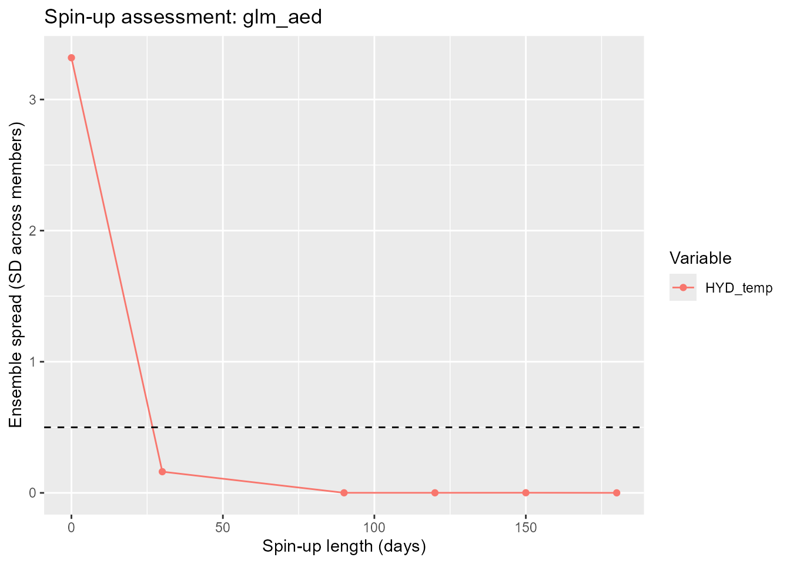
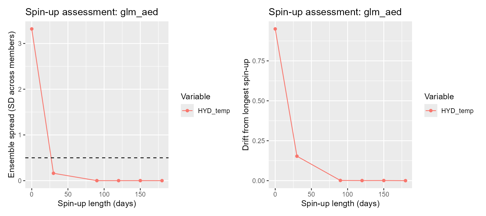
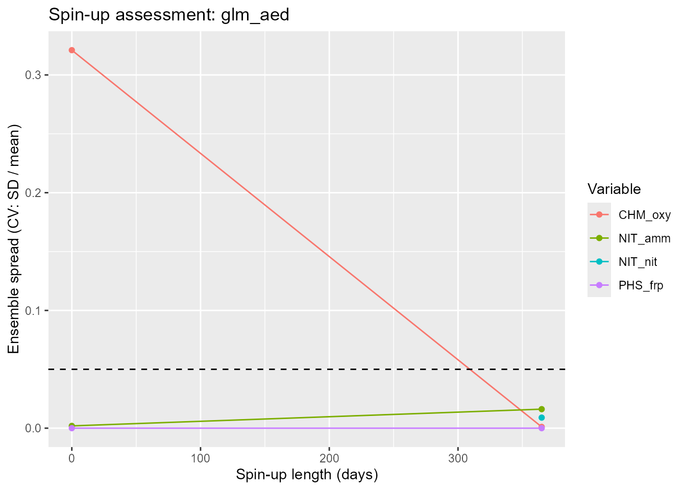

# Initial conditions, uncertainty and spin-up

## Why the initial state matters

Every lake simulation has to start somewhere. Before the first timestep,
each model needs a complete initial state: a water level, a temperature
and salinity profile, and – with biogeochemistry switched on – a
starting value for every water-column pool (oxygen, nutrients,
phytoplankton, …). That state is almost always a guess. It might come
from a single CTD cast, a climatological profile, or nothing better than
“10 °C, top to bottom”.

**Spin-up** is the standard fix: run the model for a lead-in period
*before* the window you actually care about, and discard that lead-in
from the output. Given enough lead-in, the physics forgets the initial
guess – surface heat exchange, mixing and inflow/outflow replace the
guessed state with one that is consistent with the forcing.

How much lead-in is “enough” depends on the variable:

- the **surface mixed layer** re-equilibrates with the atmosphere in
  days;
- the **hypolimnion** is only ventilated when the lake mixes, so a wrong
  deep temperature can survive most of a stratified season;
- **biogeochemical pools** turn over on the timescale of their sources
  and sinks – weeks to years.

Too short a spin-up leaves an initial-condition bias in the results that
is easy to mistake for model error. Too long a spin-up wastes forcing
data and compute, and AEME will not run it: `check_time()` requires
meteorological (and inflow) forcing to span `start - spin_up` through
`stop`.

This article shows how to set the initial state with the AEME 0.4.0
functions, how to treat the initial guess as one axis of ensemble
uncertainty, and how to use
[`assess_spin_up()`](https://limnotrack.com/reference/assess_spin_up.md)
to choose a spin-up length that is long enough and no longer.

``` r

library(AEME)
library(ggplot2)
library(patchwork)

options(AEME.inform = FALSE)
```

We use the example lake shipped with the package. Copy its configuration
directory somewhere writable and load it:

``` r

tmpdir <- tempdir()
aeme_dir <- system.file("extdata/lake/", package = "AEME")
file.copy(aeme_dir, tmpdir, recursive = TRUE)
path <- file.path(tmpdir, "lake")

aeme <- yaml_to_aeme(path = path, "aeme.yaml")
#> Warning: `yaml_to_aeme()` was deprecated in AEME 0.4.0.
#> ℹ Use `aeme_constructor()` to build an Aeme object from your own lake data, or
#>   `new_aeme()` for a quick placeholder object to populate incrementally,
#>   instead of a yaml file.
#> This warning is displayed once per session.
#> Call `lifecycle::last_lifecycle_warnings()` to see where this warning was
#> generated.
```

This lake runs from 2020-08-01 to 2021-06-30 and ships daily meteorology
back to 2019-01-01, so there is roughly a year and a half of forcing
lead available for spin-up, plus a lake observation file we can seed the
initial profile from.

## Setting the initial state

[`set_initial_conditions()`](https://limnotrack.com/reference/set_initial_conditions.md)
is the single entry point for the initial state. The generic arguments –
`depth`, `profile`, `wq` – apply to every model; `model_init` overrides
them for one model.

``` r

prof <- data.frame(
  depth       = c(0, 5, 10, 13),
  temperature = c(12, 11, 9, 8),
  salt        = 0
)
aeme <- set_initial_conditions(aeme, depth = 13, profile = prof)
```

`profile` is a data.frame with a `depth` column (positive-down, 0 =
surface) and a `temperature` column in °C; `salt` (ppt) is optional and
defaults to 0. `depth` is the initial water level, i.e. the height of
the surface above the lowest point of the hypsograph.

`wq` sets water-column biogeochemical initials, keyed by AEME variable
name – either a single value (constant with depth) or a `depth`/`value`
data.frame:

``` r

aeme <- set_initial_conditions(aeme, wq = list(CHM_oxy = 300))
```

`model_init` takes per-model overrides that are merged over the generic
specification when that model is built – for example a GLM-AED-specific
temperature profile:

``` r

aeme <- set_initial_conditions(
  aeme,
  model_init = list(
    glm_aed = list(profile = data.frame(depth = c(0, 13),
                                        temperature = c(12, 8)))
  )
)
```

The whole specification is stored in
`configuration(aeme)$initial_conditions` as a list with a `default`
entry plus one entry per model. It survives a
[`load_configuration()`](https://limnotrack.com/reference/load_configuration.md)
(and therefore the reload that happens at the end of
[`build_aeme()`](https://limnotrack.com/reference/build_aeme.md)).
[`get_initial_conditions()`](https://limnotrack.com/reference/get_initial_conditions.md)
reads it back – the full spec, or one model’s *resolved* conditions with
its overrides merged in:

``` r

get_initial_conditions(aeme)                       # full specification
#> $default
#> $default$depth
#> [1] 13
#> 
#> $default$profile
#>   depth temperature salt
#> 1     0          12    0
#> 2     5          11    0
#> 3    10           9    0
#> 4    13           8    0
#> 
#> $default$wq
#> $default$wq$CHM_oxy
#> [1] 300
#> 
#> 
#> 
#> $glm_aed
#> $glm_aed$profile
#>   depth temperature salt
#> 1     0          12    0
#> 2    13           8    0
get_initial_conditions(aeme, model = "glm_aed")    # resolved for GLM-AED
#> $depth
#> [1] 13
#> 
#> $profile
#>   depth temperature salt
#> 1     0          12    0
#> 2    13           8    0
#> 
#> $wq
#> $wq$CHM_oxy
#> [1] 300
```

### Seeding from observations

If the lake has observations, `from_obs = TRUE` seeds the generic
profile and the water-quality initials from them (via
[`update_init()`](https://limnotrack.com/reference/update_init.md))
before any explicit arguments are applied – so explicit arguments still
win. [`update_init()`](https://limnotrack.com/reference/update_init.md)
takes a three-month window centred on the start month, fits temperature
and salinity against depth, and uses the window median for each
water-quality pool.

``` r

aeme <- set_initial_conditions(aeme, from_obs = TRUE)
#> Warning: ! The following variables are set to simulate but are missing an initial water
#>   column or sediment value:
#> ℹ HYD_dens, HYD_strat, HYD_temp, HYD_thmcln, RAD_extc, RAD_par
get_initial_conditions(aeme, model = "glm_aed")$profile
#>   depth temperature salt
#> 1     0          12    0
#> 2    13           8    0
```

Two things happen automatically regardless of what you set here. For
backwards compatibility the generic `depth`/`profile` are also written
to `input(aeme)$init_depth` / `input(aeme)$init_profile`. And when the
lake has an observed water level at `time$start`,
[`build_aeme()`](https://limnotrack.com/reference/build_aeme.md)
overrides the initial water level with that observation.

## Initial conditions as a source of uncertainty

It helps to think of the initial guess as one axis of an ensemble,
alongside the forcing and the parameters. If you perturbed only the
initial state – ran the same model, same forcing, same parameters, but
from a range of plausible starting profiles – the runs would disagree at
first and then converge as spin-up dissipates the differences.

“How long a spin-up do I need?” is then a concrete question:

> How long until the spread that initial-condition uncertainty injects
> into the reported variables has collapsed below the accuracy I care
> about?

[`assess_spin_up()`](https://limnotrack.com/reference/assess_spin_up.md)
answers it by building exactly that ensemble.

## `assess_spin_up()` end to end

[`assess_spin_up()`](https://limnotrack.com/reference/assess_spin_up.md)
builds and runs one simulation per *(spin-up length, ensemble member)*
combination, each in its own subdirectory of `path`, with written output
restricted to `vars`. It then extracts the modelled state at the first
timestep of the analysis period (the first timestep after spin-up) and
summarises how the members agree.

``` r

res_temp <- assess_spin_up(
  aeme,
  model     = "glm_aed",
  spin_up   = c(0, 30, 90, 120, 150, 180),
  perturb   = list(temperature = c(-4, 0, 4)),
  vars      = "HYD_temp",
  metric    = "spread",
  tolerance = 0.5,
  build_args = list(ext_elev = 3),
  path      = file.path(tmpdir, "spinup_temp")
)
#> Warning: ! `SIL_rsi`: SIL_rsi is constant across all rows -- this may be a placeholder
#>   value.
#> ℹ Check raw data or unit conversion for this variable.
#> Warning: GLM ignores the AirPres met column in daily mode and uses the default 1013.25 hPa instead.
#> This warning is displayed once per session.
#> Warning: ! `SIL_rsi`: SIL_rsi is constant across all rows -- this may be a placeholder
#>   value.
#> ℹ Check raw data or unit conversion for this variable.
#> ! `SIL_rsi`: SIL_rsi is constant across all rows -- this may be a placeholder
#>   value.
#> ℹ Check raw data or unit conversion for this variable.
#> ! `SIL_rsi`: SIL_rsi is constant across all rows -- this may be a placeholder
#>   value.
#> ℹ Check raw data or unit conversion for this variable.
#> ! `SIL_rsi`: SIL_rsi is constant across all rows -- this may be a placeholder
#>   value.
#> ℹ Check raw data or unit conversion for this variable.
#> ! `SIL_rsi`: SIL_rsi is constant across all rows -- this may be a placeholder
#>   value.
#> ℹ Check raw data or unit conversion for this variable.
#> ! `SIL_rsi`: SIL_rsi is constant across all rows -- this may be a placeholder
#>   value.
#> ℹ Check raw data or unit conversion for this variable.
#> ! `SIL_rsi`: SIL_rsi is constant across all rows -- this may be a placeholder
#>   value.
#> ℹ Check raw data or unit conversion for this variable.
#> ! `SIL_rsi`: SIL_rsi is constant across all rows -- this may be a placeholder
#>   value.
#> ℹ Check raw data or unit conversion for this variable.
#> ! `SIL_rsi`: SIL_rsi is constant across all rows -- this may be a placeholder
#>   value.
#> ℹ Check raw data or unit conversion for this variable.
#> ! `SIL_rsi`: SIL_rsi is constant across all rows -- this may be a placeholder
#>   value.
#> ℹ Check raw data or unit conversion for this variable.
#> ! `SIL_rsi`: SIL_rsi is constant across all rows -- this may be a placeholder
#>   value.
#> ℹ Check raw data or unit conversion for this variable.
#> ! `SIL_rsi`: SIL_rsi is constant across all rows -- this may be a placeholder
#>   value.
#> ℹ Check raw data or unit conversion for this variable.
#> ! `SIL_rsi`: SIL_rsi is constant across all rows -- this may be a placeholder
#>   value.
#> ℹ Check raw data or unit conversion for this variable.
#> ! `SIL_rsi`: SIL_rsi is constant across all rows -- this may be a placeholder
#>   value.
#> ℹ Check raw data or unit conversion for this variable.
#> ! `SIL_rsi`: SIL_rsi is constant across all rows -- this may be a placeholder
#>   value.
#> ℹ Check raw data or unit conversion for this variable.
#> ! `SIL_rsi`: SIL_rsi is constant across all rows -- this may be a placeholder
#>   value.
#> ℹ Check raw data or unit conversion for this variable.
#> ! `SIL_rsi`: SIL_rsi is constant across all rows -- this may be a placeholder
#>   value.
#> ℹ Check raw data or unit conversion for this variable.
res_temp
#>  spin_up      var       spread        drift    spread_cv     drift_cv
#>        0 HYD_temp 3.3184012386 0.9501000000 2.988457e-01 7.881660e-02
#>       30 HYD_temp 0.1615845790 0.1531871212 1.355791e-02 1.276128e-02
#>       90 HYD_temp 0.0006126592 0.0012815789 5.091756e-05 1.065402e-04
#>      120 HYD_temp 0.0005833996 0.0006037500 4.857639e-05 5.038226e-05
#>      150 HYD_temp 0.0009563539 0.0007857143 7.960137e-05 6.541174e-05
#>      180 HYD_temp 0.0002557307 0.0000000000 2.132555e-05 0.000000e+00
#> HYD_temp  overall 
#>       30       30
```

`perturb` is a named list that defines the ensemble:

- `"temperature"` / `"salt"` – **additive** offsets applied to that
  column of the baseline initial profile (here: baseline −4 °C,
  baseline, and baseline +4 °C);
- any `model_controls$var_aeme` name (e.g. `CHM_oxy`) – a
  **multiplicative** factor on that water-quality initial value.

The vectors are recycled to a common length, which becomes the ensemble
size; member *i* takes element *i* of every vector. Here that is 4
spin-up lengths × 3 members = 12 builds and runs. The baseline is
`get_initial_conditions(aeme, model = "glm_aed")`, falling back to
`input(aeme)$init_profile` / `model_controls$initial_wc`, so run
[`set_initial_conditions()`](https://limnotrack.com/reference/set_initial_conditions.md)
(or [`update_init()`](https://limnotrack.com/reference/update_init.md))
first.

## Reading the result

The return value is a list of class `aeme_spin_up`:

- **`$data`** – long data.frame (`spin_up`, `member`, `var`, `depth`,
  `value`) of the state at the start of the analysis period.
- **`$summary`** – one row per `spin_up` × `var`, each column a mean
  over depth of a per-depth quantity:
  - `spread` – standard deviation across members, in the variable’s
    units;
  - `spread_cv` – that SD divided by the ensemble mean (dimensionless);
  - `drift` – distance of this spin-up’s ensemble mean from the
    *longest* spin-up’s ensemble mean, in the variable’s units;
  - `drift_cv` – that distance divided by the longest spin-up’s mean.
- **`$recommended`** – the shortest spin-up whose `metric` meets
  `tolerance`, per variable, plus `overall` (the largest of those).
  `NULL` when `tolerance` is `NULL`.
- **`$failures`** – any *(spin-up, member)* runs that errored.

``` r

res_temp$summary
#>   spin_up      var       spread        drift    spread_cv     drift_cv
#> 1       0 HYD_temp 3.3184012386 0.9501000000 2.988457e-01 7.881660e-02
#> 2      30 HYD_temp 0.1615845790 0.1531871212 1.355791e-02 1.276128e-02
#> 3      90 HYD_temp 0.0006126592 0.0012815789 5.091756e-05 1.065402e-04
#> 4     120 HYD_temp 0.0005833996 0.0006037500 4.857639e-05 5.038226e-05
#> 5     150 HYD_temp 0.0009563539 0.0007857143 7.960137e-05 6.541174e-05
#> 6     180 HYD_temp 0.0002557307 0.0000000000 2.132555e-05 0.000000e+00
res_temp$recommended
#> HYD_temp  overall 
#>       30       30
```

[`plot_spin_up()`](https://limnotrack.com/reference/plot_spin_up.md)
draws the chosen metric against spin-up length, with a dashed line at
the tolerance:

``` r

plot_spin_up(res_temp)
```



### Spread versus drift

`spread` and `drift` answer different questions:

- **`spread`** – have the members converged *to each other*? A small
  spread means the choice of initial profile no longer matters.
- **`drift`** – has the ensemble converged to the *long-spin-up* answer?
  A small drift means the spin-up is long enough that extending it
  further would not move the result.

You want both small. A shallow temperature perturbation can collapse in
spread within 30 days while the ensemble mean still carries a deep cold
bias – visible as drift – out to 180 days. Plot them side by side:

``` r

wrap_plots(
  plot_spin_up(res_temp, metric = "spread"),
  plot_spin_up(res_temp, metric = "drift"),
  nrow = 1
)
```



## A biogeochemical variable needs longer

Repeat the assessment for dissolved oxygen, with biogeochemistry
switched on. Oxygen is perturbed multiplicatively (half, baseline,
double), and because concentrations are strictly positive and on a
completely different scale from temperature we compare against
`spread_cv` – the coefficient of variation – with a 5 % tolerance.

``` r

mc <- get_model_controls(use_bgc = TRUE)


res_bgc <- assess_spin_up(
  aeme,
  model          = "glm_aed",
  spin_up        = c(0, 30, 90, 120, 150, 180, 365),
  perturb        = list(CHM_oxy = c(0.5, 1, 2),
                        PHS_frp = c(0.5, 1, 2),
                        NIT_nit = c(0.5, 1, 2),
                        NIT_amm = c(0.5, 1, 2)
                        ),
  vars           = c("CHM_oxy", "PHS_frp", "NIT_nit", "NIT_amm"),
  metric         = "spread_cv",
  tolerance      = 0.05,
  model_controls = mc,
  build_args     = list(use_bgc = TRUE, ext_elev = 5),
  path           = file.path(tmpdir, "spinup_oxy")
)
#> Warning: ! `SIL_rsi`: SIL_rsi is constant across all rows -- this may be a placeholder
#>   value.
#> ℹ Check raw data or unit conversion for this variable.
#> ! `SIL_rsi`: SIL_rsi is constant across all rows -- this may be a placeholder
#>   value.
#> ℹ Check raw data or unit conversion for this variable.
#> ! `SIL_rsi`: SIL_rsi is constant across all rows -- this may be a placeholder
#>   value.
#> ℹ Check raw data or unit conversion for this variable.
#> ! `SIL_rsi`: SIL_rsi is constant across all rows -- this may be a placeholder
#>   value.
#> ℹ Check raw data or unit conversion for this variable.
#> ! `SIL_rsi`: SIL_rsi is constant across all rows -- this may be a placeholder
#>   value.
#> ℹ Check raw data or unit conversion for this variable.
#> ! `SIL_rsi`: SIL_rsi is constant across all rows -- this may be a placeholder
#>   value.
#> ℹ Check raw data or unit conversion for this variable.
#> ! `SIL_rsi`: SIL_rsi is constant across all rows -- this may be a placeholder
#>   value.
#> ℹ Check raw data or unit conversion for this variable.
#> ! `SIL_rsi`: SIL_rsi is constant across all rows -- this may be a placeholder
#>   value.
#> ℹ Check raw data or unit conversion for this variable.
#> ! `SIL_rsi`: SIL_rsi is constant across all rows -- this may be a placeholder
#>   value.
#> ℹ Check raw data or unit conversion for this variable.
#> ! `SIL_rsi`: SIL_rsi is constant across all rows -- this may be a placeholder
#>   value.
#> ℹ Check raw data or unit conversion for this variable.
#> ! `SIL_rsi`: SIL_rsi is constant across all rows -- this may be a placeholder
#>   value.
#> ℹ Check raw data or unit conversion for this variable.
#> ! `SIL_rsi`: SIL_rsi is constant across all rows -- this may be a placeholder
#>   value.
#> ℹ Check raw data or unit conversion for this variable.
#> ! `SIL_rsi`: SIL_rsi is constant across all rows -- this may be a placeholder
#>   value.
#> ℹ Check raw data or unit conversion for this variable.
#> ! `SIL_rsi`: SIL_rsi is constant across all rows -- this may be a placeholder
#>   value.
#> ℹ Check raw data or unit conversion for this variable.
#> ! `SIL_rsi`: SIL_rsi is constant across all rows -- this may be a placeholder
#>   value.
#> ℹ Check raw data or unit conversion for this variable.
#> ! `SIL_rsi`: SIL_rsi is constant across all rows -- this may be a placeholder
#>   value.
#> ℹ Check raw data or unit conversion for this variable.
#> ! `SIL_rsi`: SIL_rsi is constant across all rows -- this may be a placeholder
#>   value.
#> ℹ Check raw data or unit conversion for this variable.
#> ! `SIL_rsi`: SIL_rsi is constant across all rows -- this may be a placeholder
#>   value.
#> ℹ Check raw data or unit conversion for this variable.
#> ! `SIL_rsi`: SIL_rsi is constant across all rows -- this may be a placeholder
#>   value.
#> ℹ Check raw data or unit conversion for this variable.
#> ! `SIL_rsi`: SIL_rsi is constant across all rows -- this may be a placeholder
#>   value.
#> ℹ Check raw data or unit conversion for this variable.
#> ! `SIL_rsi`: SIL_rsi is constant across all rows -- this may be a placeholder
#>   value.
#> ℹ Check raw data or unit conversion for this variable.
res_bgc$summary
#>   spin_up     var       spread       drift   spread_cv  drift_cv
#> 1       0 CHM_oxy 4.170362e-03 6.866600000 0.321057263 0.6384863
#> 2     365 CHM_oxy 1.140863e-02 0.000000000 0.001097791 0.0000000
#> 3       0 NIT_amm 1.924501e-05 0.003455556 0.001950508 2.1654098
#> 4     365 NIT_amm 4.811252e-05 0.000000000 0.016154334 0.0000000
#> 5       0 NIT_nit 0.000000e+00 0.002111111          NA 1.0000000
#> 6     365 NIT_nit 1.099715e-05 0.000000000 0.008974044 0.0000000
#> 7       0 PHS_frp 0.000000e+00 0.000200000 0.000000000 1.0000000
#> 8     365 PHS_frp 0.000000e+00 0.000000000 0.000000000 0.0000000
res_bgc$recommended
#> CHM_oxy PHS_frp NIT_nit NIT_amm overall 
#>     365       0     365       0     365
```

``` r

plot_spin_up(res_bgc)
#> Warning: Removed 1 row containing missing values or values outside the scale range
#> (`geom_line()`).
#> Warning: Removed 1 row containing missing values or values outside the scale range
#> (`geom_point()`).
```



Compare `res_bgc$recommended` with `res_temp$recommended`. For this lake
the oxygen pool takes longer to lose the memory of its starting value
than the temperature profile does, because it is set by the balance of
primary production, respiration and sediment demand rather than by
mixing alone. The spin-up that is adequate for a physics-only study is
not necessarily adequate once biogeochemistry is reported.

A note on the `*_cv` metrics: they are dimensionless and therefore
comparable across variables of different magnitude, which is what makes
them the right choice for water-quality concentrations. They are
undefined where the ensemble mean crosses zero, and those depths are
dropped from the depth-average, so keep `spread` / `drift` (in physical
units) for variables that can be near zero.

## Choosing the assessment parameters

| Argument | Guidance |
|----|----|
| `vars` | The variables your study actually reports. The slowest-relaxing one – usually a deep or biogeochemical variable – sets the spin-up requirement, not surface temperature. |
| `perturb` | Size the offsets/factors to your *real* initial-condition uncertainty: roughly ±3–4 °C for a profile from a single cast or climatology; a factor of 0.5–2 for a nutrient or oxygen pool. |
| `spin_up` | Start coarse (`c(0, 30, 90, 180, 365)`), then add points around the knee of the curve if you need a sharper estimate. |
| `metric` + `tolerance` | Use `spread` / `drift` with a tolerance in physical units (e.g. `0.5` °C) when you have a target accuracy; use `spread_cv` / `drift_cv` with a fractional tolerance (e.g. `0.05`) to compare across variables. |
| `model` | One model per call. Different engines mix at different rates, so assess each model you intend to run. |

Every *(spin-up, member)* cell is a full
[`build_aeme()`](https://limnotrack.com/reference/build_aeme.md) +
[`run_aeme()`](https://limnotrack.com/reference/run_aeme.md), so cost is
`length(spin_up) * n_members` runs and one subdirectory of `path` per
cell. Restricting `vars` keeps the written output small; drop `spin_up`
points or ensemble members if a run is too slow.

## Applying the result

Set the spin-up you chose on the object with
[`set_time()`](https://limnotrack.com/reference/set_time.md). `spin_up`
is in **days** – a single number for all models, or a named list per
model – and is stored at `time(aeme)$spin_up`:

``` r

tm <- time(aeme)
aeme <- set_time(aeme,
                 start   = format(tm$start, "%Y-%m-%d"),
                 stop    = format(tm$stop, "%Y-%m-%d"),
                 spin_up = res_temp$recommended[["overall"]])
```

From then on the spin-up window is simulated but stripped from
everything you read back:
[`get_var()`](https://limnotrack.com/reference/get_var.md),
[`plot_ts()`](https://limnotrack.com/reference/plot_ts.md),
[`plot_output()`](https://limnotrack.com/reference/plot_output.md) and
the rest default to `remove_spin_up = TRUE`. Just make sure the forcing
still covers `start - spin_up` through `stop`, or
[`build_aeme()`](https://limnotrack.com/reference/build_aeme.md) will
stop at `check_time()`.

## Scope

[`assess_spin_up()`](https://limnotrack.com/reference/assess_spin_up.md)
perturbs only the initial state. It is not a full uncertainty or
sensitivity analysis – for forcing and parameter sensitivity see
`vignette("testing-parameters")` and the `aemetools` package
(`run_aeme_param()`, `sa_aeme()`, `calib_aeme()`).
