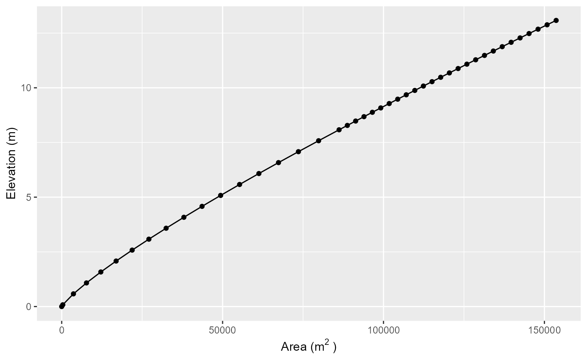

# Introduction to AEME

## Summary

The AEME package hosts three one-dimensional hydrodynamic models: the
DYnamic REservoir Simulation Model (DYRESM), the General Lake Model
(GLM), and the General Ocean Turbulence Model (GOTM, which has been
adapted for closed basins for application to lakes and reservoirs). The
models can be coupled to their corresponding water quality models, the
DYRESM-CAEDYM (Computational Aquatic Ecosystem Dynamics Model), GLM-AED
(Aquatic Ecosystem Dynamics Model), and GOTM-WET (Water Ecosystem Tool).

Key aspects of the AEME package include:

- Defined S4 class for `aeme` objects

- Configuration of models from common and standardised inputs

- Standardised calibration, manipulation and visualisation

This vignette provides an overview of the AEME framework, the three
models, and the ensemble approach. For detailed information on data
inputs and the S4 structure, see the [AEME
Inputs](https://limnotrack.com/articles/aeme-inputs.md) vignette. For a
practical tutorial, see [Setting up AEME for a new
lake](https://limnotrack.com/articles/setup-new-lake.md).

## The Three Models

AEME integrates three well-established one-dimensional (1D) lake models,
each with distinct computational approaches and strengths. Understanding
the differences helps in selecting appropriate models and interpreting
ensemble results.

### DYRESM-CAEDYM

**DYnamic REservoir Simulation Model - Computational Aquatic Ecosystem
DYnamics Model**

**History and Development**

DYRESM was developed in the 1980s at the University of Western Australia
and Centre for Water Research. It pioneered the Lagrangian layer
approach for lake modeling. CAEDYM was later developed to add
comprehensive biogeochemical capabilities.

**Physics and Computational Approach**

- **Lagrangian layers**: Water parcels move vertically through the water
  column
- **Variable layer thickness**: Layers can split or merge based on
  stratification
- **Layer-following approach**: Particularly effective for tracking
  water masses in reservoirs
- **Time-step**: Adaptive, typically 30-60 minutes

**Key Features**

- Excellent representation of selective withdrawals in reservoirs
- Detailed tracking of water quality through inflows and withdrawals
- Comprehensive biogeochemical modules (nutrients, phytoplankton,
  zooplankton, sediments)
- Established in reservoir management applications

**Typical Applications**

- Drinking water reservoirs with complex withdrawal strategies
- Multi-level outlet management
- Water quality forecasting in stratified systems
- Long-term climate change impact studies

**References**

- Imberger, J., & Patterson, J. C. (1981). A dynamic reservoir
  simulation model
  - DYRESM: 5. *Transport Models for Inland and Coastal Waters*,
    310-361.
- Hamilton, D. P., & Schladow, S. G. (1997). Prediction of water quality
  in lakes and reservoirs. Part I - Model description. *Ecological
  Modelling*, 96(1-3), 91-110.
- Burger, D. F., Hamilton, D. P., & Pilditch, C. A. (2008). Modelling
  the relative importance of internal and external nutrient loads on
  water column nutrient concentrations and phytoplankton biomass in a
  shallow polymictic lake. *Ecological Modelling*, 211(3-4), 411-423.

### GLM-AED

**General Lake Model - Aquatic EcoDynamics model**

**History and Development**

GLM was developed in the 2010s through an international collaboration
led by the University of Western Australia. It modernizes 1D lake
modeling with a flexible framework compatible with contemporary
ecosystem models. AED is the latest generation of water quality models,
building on AED+ and earlier frameworks.

**Physics and Computational Approach**

- **Dynamic Eulerian layers**: Fixed spatial grid with variable layer
  thickness
- **Flexible vertical resolution**: Automatically adjusts layers based
  on stratification
- **Efficient computations**: Optimized for ensemble applications and
  uncertainty analysis
- **Time-step**: Hourly to daily, depending on application

**Key Features**

- Modular biogeochemical framework (AED2)
- Easy configuration through namelists (NML files)
- Extensive validation across diverse lake types
- Active development community and regular updates
- Integration with lake ensemble frameworks

**Typical Applications**

- Natural lakes of varying trophic status
- Multi-lake regional studies
- Climate change scenarios
- Coupled catchment-lake modeling
- Real-time forecasting systems

**References**

- Hipsey, M. R., Bruce, L. C., Boon, C., Busch, B., Carey, C. C.,
  Hamilton, D. P., … & Winslow, L. A. (2019). A General Lake Model (GLM
  3.0) for linking with high-frequency sensor data from the Global Lake
  Ecological Observatory Network (GLEON). *Geoscientific Model
  Development*, 12(1), 473-523.
- Bruce, L. C., Frassl, M. A., Arhonditsis, G. B., Gal, G., Hamilton, D.
  P., Hanson, P. C., … & Trolle, D. (2018). A multi-lake comparative
  analysis of the General Lake Model (GLM): Stress-testing across a
  global observatory network. *Environmental Modelling & Software*, 102,
  274-291.
- Hipsey, M. R., Bruce, L. C., & Hamilton, D. P. (2014). *GLM - General
  Lake Model: Model overview and user information*. AED Report \#26, The
  University of Western Australia, Perth, Australia.

### GOTM-WET

**General Ocean Turbulence Model - Water Ecosystem Tool**

**History and Development**

GOTM was originally developed for ocean modeling in the 1990s and later
adapted for lakes and estuaries. WET (Water Ecosystem Tool) is a
comprehensive biogeochemical model developed by WaterITech specifically
for integration with GOTM and application to lakes and reservoirs.

**Physics and Computational Approach**

- **Fixed Eulerian grid**: Regular vertical spacing throughout
  simulation
- **Advanced turbulence closure**: Multiple turbulence schemes (k-ε,
  k-ω, etc.)
- **High vertical resolution**: Typically 0.5-1 m spacing
- **YAML configuration**: Modern configuration approach
- **Time-step**: Sub-hourly for stability

**Key Features**

- Sophisticated turbulence modeling
- High-resolution vertical mixing representation
- Framework for Aquatic Biogeochemical Models (FABM) integration
- Detailed surface and bottom boundary layers
- Coupling with atmospheric models

**Typical Applications**

- Deep stratified lakes
- Systems with complex mixing dynamics
- Research applications requiring detailed turbulence
- Lakes with significant benthic-pelagic coupling
- Process studies and model development

**References**

- Burchard, H., Bolding, K., & Villarreal, M. R. (1999). *GOTM, a
  general ocean turbulence model. Theory, implementation and test
  cases*. Tech. Rep.  EUR-18745-EN, European Commission.
- Bruggeman, J., & Bolding, K. (2014). A general framework for aquatic
  biogeochemical models. *Environmental Modelling & Software*, 61,
  249-265.
- Bolding, K., Bruggeman, J., Brüchert, V., Grimm, H., Holtermann, P.,
  Hu, T., … & Umlauf, L. (2020). *GETM and GOTM - a general estuarine
  and lake model. Status and perspectives.* Report, 2020.

### Model Comparison

The following table summarizes key differences between the three models:

| Feature | DYRESM-CAEDYM | GLM-AED | GOTM-WET |
|----|----|----|----|
| **Approach** | Lagrangian layers | Lagrangian layers | Fixed Eulerian |
| **Layer structure** | Variable (moves with water) | Variable thickness | Fixed grid |
| **Vertical resolution** | 5-50 layers | 2-500 layers (user defined) | 2-500 layers (user defined) |
| **Timestep** | Fixed (1 hr typical) | Fixed (1 hr typical) | Fixed (1 hr typical) |
| **Turbulence** | Mixed-layer model | k-ε or Henderson-Sellers | Multiple schemes (k-ε typical) |
| **Configuration** | Text files | Namelists (NML) | YAML files |
| **Best for** | Reservoirs, withdrawals | Natural lakes, ensembles | Deep lakes, research |
| **Computational speed** | Slow | Fast | Fast |
| **BGC complexity** | High (CAEDYM) | High (AED2) | High (FABM/WET) |

**When to use each model:**

- **DYRESM-CAEDYM**: Reservoirs with selective withdrawals, water
  quality management, operational forecasting
- **GLM-AED**: Natural lakes, multi-lake studies, ensemble uncertainty
  analysis, real-time applications
- **GOTM-WET**: Stratified lakes, detailed turbulence studies, research
  applications, process investigations

## The Ensemble Approach

AEME’s primary innovation is the standardization of inputs and outputs
across three fundamentally different lake models, enabling true ensemble
modeling of aquatic ecosystems.

### Why Use Multiple Models?

**1. Structural Uncertainty**

Each model makes different assumptions about physics and
biogeochemistry. No single model is universally “best” - performance
varies by: - Lake type (reservoir vs. natural) - Stratification
dynamics - Available calibration data - Spatial and temporal scales -
Management questions

Using multiple models quantifies structural uncertainty - differences
arising from model formulation rather than parameter uncertainty.

**2. Ensemble Predictions**

Ensemble means and medians often outperform individual models by: -
Averaging out model-specific biases - Providing probabilistic
forecasts - Identifying robust predictions (model agreement) -
Highlighting uncertain predictions (model divergence)

**3. Model Complementarity**

Different models excel at different aspects: - DYRESM-CAEDYM: tracking
water parcels in reservoirs - GLM-AED: computational efficiency for
ensembles - GOTM-WET: detailed vertical mixing processes

### How AEME Standardizes Inputs and Outputs

**Input Standardization**

AEME translates common inputs into model-specific formats:

1.  **Meteorology**: Same data → model-specific forcing files
2.  **Hypsography**: Single hypsograph → adjusted for each model’s grid
3.  **Inflows/Outflows**: Unified format → model-specific boundary
    conditions
4.  **Parameters**: Common parameter table → model configuration files

This ensures models simulate the *same lake* with *comparable forcings*.

**Output Standardization**

All models output to a common format: - Variable names mapped to AEME
conventions (`key_naming`) - Consistent spatial interpolation to
comparable depths - Synchronized temporal resolution - Standard quality
control and gap filling

### Ensemble Evaluation

**Model Agreement**

When models agree, confidence is high. When models diverge, structural
uncertainty is significant.

``` r

# Compare model predictions
plot_output(aeme = aeme, var_sim = "HYD_temp", model = c("dy_cd", "glm_aed", "gotm_wet"))
```

**Performance Metrics**

Use [`assess_model()`](https://limnotrack.com/reference/assess_model.md)
to compare model performance against observations:

``` r

performance <- assess_model(aeme = aeme)
print(performance)
# Shows RMSE, NSE, R² for each model
```

**Weighted Ensembles**

Models can be weighted by past performance:

``` r

# Weight by NSE scores
weights <- performance$NSE / sum(performance$NSE)
weighted_mean <- calculate_weighted_ensemble(aeme, weights = weights)
```

### Interpretation Guidelines

1.  **When models agree**: High confidence in predictions
2.  **When models disagree systematically**: Check inputs and
    observations
3.  **When one model consistently outperforms**: Consider lake-specific
    physics
4.  **When all models fail**: Likely data quality or missing processes

## Model Applications and Case Studies

AEME has been applied to diverse aquatic systems across New Zealand and
internationally.

### Example Applications

**1. Drinking Water Reservoirs**

See `vignette("reservoir-aeme")` for a detailed example of applying AEME
to a reservoir with multiple outlets and water quality management.

**2. Natural Lakes**

The LERNZmp (Lake Ecosystem Research New Zealand Modelling Platform)
uses AEME for 100+ New Zealand lakes. See `vignette("lernzmp-aeme")` for
details.

**3. Water Balance Studies**

AEME can estimate unknown inflows/outflows from water level
observations. See `vignette("rotoehu-water-balance")` for a worked
example.

**4. Single Model Applications**

While AEME is designed for ensembles, individual models can be run for
specific applications. See `vignette("glm-aed")` for GLM-AED specific
examples.

### Key References for AEME

- Moore, T. N., Mesman, J. P., Ladwig, R., Feldbauer, J., Olsson, F.,
  Pilla, R. M., … & Hipsey, M. R. (2021). LakeEnsemblR: An R package
  that facilitates ensemble modelling of lakes. *Environmental Modelling
  & Software*, 143, 105101.

Future AEME-specific publications will be listed here as they become
available.

## AEME object

### Description

The `aeme` object is the main object in the AEME package. It is an S4
class that contains all the information required to run a model. The
`aeme` object contains the following slots:

- [**lake**](#sec-lake) - Lake metadata (location, dimensions) (name,
  id, latitude, longitude, elevation, depth, area)
- [**time**](#sec-time) - Simulation period and temporal settings
  (start, stop, spin_up, time_step)
- [**configuration**](#sec-configuration) - Model configurations and
  controls (model_controls, dy_cd, glm_aed, gotm_wet)
- [**observations**](#sec-observations) - Observational data for
  validation (lake, level)
- [**inputs**](#sec-inputs) - Core physical inputs (meteorology,
  hypsograph) (init_profile, init_depth, hypsograph, meteo, use_lw, Kw)
- [**inflows**](#sec-inflows) - Stream inflow data (data, factor)
- [**outflows**](#sec-outflows) - Outlet data and configurations (data,
  outflow_lvl, factor)
- [**water_balance**](#sec-water_balance) - Water balance settings and
  calculations (use, method, data)
- [**parameters**](#sec-parameters) - Model parameter values for
  calibration (model, file, name, value, min, max, module, group)
- [**output**](#sec-output) - Model output (populated after simulation)
  (n_members)

For comprehensive details on each slot including structure, required
fields, and usage examples, see the [AEME Inputs
vignette](https://limnotrack.com/articles/aeme-inputs.md).

#### Lake

The `lake` slot contains metadata about the waterbody including name,
location, dimensions, and optional spatial information.

**Required fields**: name, id, latitude, longitude, elevation, depth,
area

See [Lake
Slot](https://limnotrack.com/articles/aeme-inputs.html#lake-slot) in the
AEME Inputs vignette for complete details.

#### Time

The `time` slot defines the simulation period, temporal resolution, and
spin-up periods for model initialization.

**Required fields**: start, stop

**Optional fields**: timestep, spin_up

See [Time
Slot](https://limnotrack.com/articles/aeme-inputs.html#time-slot) in the
AEME Inputs vignette for complete details.

#### Configuration

The `configuration` slot stores model-specific configuration files and
the `model_controls` data frame. This slot is populated by
[`build_aeme()`](https://limnotrack.com/reference/build_aeme.md).

See [Configuration
Slot](https://limnotrack.com/articles/aeme-inputs.html#configuration-slot)
in the AEME Inputs vignette for complete details.

#### Observations

The `observations` slot contains observational data for model
validation, calibration, and initialization. It includes in-lake
profiles (`lake`) and water level time series (`level`).

See [Observations
Slot](https://limnotrack.com/articles/aeme-inputs.html#observations-slot)
in the AEME Inputs vignette for complete details.

#### Input

The `input` slot contains core physical inputs required by all models:
meteorological forcing, lake bathymetry (hypsograph), light extinction,
and initial conditions.

**Required fields**: hypsograph, meteo, Kw

**Optional fields**: init_profile, init_depth, use_lw

See [Input
Slot](https://limnotrack.com/articles/aeme-inputs.html#input-slot) in
the AEME Inputs vignette for complete details.

#### Inflows

The `inflows` slot contains stream inflow data as named lists of data
frames, plus optional scaling factors for each model.

See [Inflows
Slot](https://limnotrack.com/articles/aeme-inputs.html#inflows-slot) in
the AEME Inputs vignette for complete details.

#### Outflows

The `outflows` slot contains outlet data, outlet elevations, and
optional scaling factors.

See [Outflows
Slot](https://limnotrack.com/articles/aeme-inputs.html#outflows-slot) in
the AEME Inputs vignette for complete details.

#### Water balance

The `water_balance` slot is generated internally by
[`build_aeme()`](https://limnotrack.com/reference/build_aeme.md) when
inflows or outflows need to be estimated from water level changes.

**Fields**: method (1, 2, or 3), use (“obs” or “mod”), data

See [Water Balance
Slot](https://limnotrack.com/articles/aeme-inputs.html#water-balance-slot)
in the AEME Inputs vignette for complete details.

#### Parameters

The `parameters` slot contains a data frame of model parameter values
for calibration, sensitivity analysis, and model configuration.

See [Parameters
Slot](https://limnotrack.com/articles/aeme-inputs.html#parameters-slot)
in the AEME Inputs vignette for complete details.

#### Output

The `output` slot stores model results after running
[`run_aeme()`](https://limnotrack.com/reference/run_aeme.md). Initially
empty, it is populated with time-series data for each model and
variable.

See [Output
Slot](https://limnotrack.com/articles/aeme-inputs.html#output-slot) in
the AEME Inputs vignette for complete details.

### Model controls

The `model_controls` is a data.frame generated by the
[`get_model_controls()`](https://limnotrack.com/reference/get_model_controls.md).
The data.frame has the columns:

- var_aeme - character; the AEME variable name

- simulate - logical; add the variable to the `Aeme` object

- inf_default - numeric; default value to use in the inflows if none
  present in the inflows. This is particularly important for configuring
  water chemistry for the inflows if `use_bgc = TRUE`.

- initial_wc - numeric; value to use in initialising the model. This
  will be automatically updated if the variable is present in the
  `observations` slot.

- initial_sed - numeric; value to use in initialising the sediment
  module for the DYRESM-CAEDYM model.

- conversion_aed - numeric; factor to multiply by to convert to GLM-AED
  units.

When the model is built, the `model_controls` data.frame is stored in
the `configuration` slot of the `aeme` object. It can be retrieved with
`get_model_controls(aeme = aeme)`.

### Creation

The `aeme` object can be created using the
[`aeme_constructor()`](https://limnotrack.com/reference/aeme_constructor.md)
function. It requires at minimum the `lake`, `time`, and `input` list
objects. The object can also be created from a YAML file using the
[`yaml_to_aeme()`](https://limnotrack.com/reference/yaml_to_aeme.md)
function. The YAML file contains all the information required to run the
model.

``` r

# Define lake list
lat <- -36.88921
lon <- 174.4669
depth <- 13.08
area <- 153648

lake <- list(
    latitude = lat,
    longitude = lon,
    name = "lake",
    id = "123",
    depth = depth,
    area = area
  )
time <- list(
  start = as.POSIXct("2020-07-01"),
  stop = as.POSIXct("2022-06-30")
)

hypsograph <- generate_hypsograph(max_depth = depth, surface_area = area,
                                  volume_development = 1.2)

met <- aemetools::get_era5_land_point_nz(lat = lat, lon = lon,
                                         years = 2020:2022)

#' Define input list
input = list(
  hypsograph = hypsograph,
  meteo = met,
  Kw = 1.21
)

aeme <- aeme_constructor(lake = lake, time = time, input = input)
```

``` r

slotNames(aeme)
#>  [1] "lake"          "time"          "configuration" "observations" 
#>  [5] "input"         "inflows"       "outflows"      "water_balance"
#>  [9] "output"        "parameters"
```

## Manipulation

The `aeme` object can be manipulated using the `AEME` package functions.
The functions are defined by the slot names of the `aeme` object. For
example, the `lake` slot can be manipulated using the `lake` function.

``` r

# Load lake data
lke <- lake(aeme)
# Print lake data to console
print(lke)
#> $latitude
#> [1] -36.88921
#> 
#> $longitude
#> [1] 174.4669
#> 
#> $name
#> [1] "lake"
#> 
#> $id
#> [1] "123"
#> 
#> $depth
#> [1] 13.08
#> 
#> $area
#> [1] 153648
#> 
#> $elevation
#> [1] 0

# Change lake name
lke[["name"]] <- "AEME"

# reassign lake data to aeme object
lake(aeme) <- lke

aeme
#> 
#> ── AEME ────────────────────────────────────────────────────────────────────────
#> 
#> ── Lake ──
#> 
#> AEME (ID: 123)
#> • Lat: -36.89; Lon: 174.47
#> • Elev: 0m; Depth: 13.08m; Area: 153648 m2
#> 
#> ── Time ──
#> 
#> • Start: 2020-07-01; Stop: 2022-06-30; Time step: 3600
#> • Spin up (days): GLM: 2; GOTM: 2; DYRESM: 2
#> 
#> ── Configuration ──
#> 
#> • Model:
#> • Path: D:/a/AEME/AEME/vignettes
#> • Model controls: Present
#> • Use biogeochemical model: No
#> ┌ Model Configuration ─────────────────────────────────────────┐
#> │       Model              Physical         Biogeochemical     │
#> │ ---                                                          │
#> │       DY-CD               Absent              Absent         │
#> │      GLM-AED              Absent              Absent         │
#> │      GOTM-WET             Absent              Absent         │
#> └──────────────────────────────────────────────────────────────┘
#> 
#> ── Observations ──
#> 
#> • Lake: Absent; Level: Absent
#> 
#> ── Input ──
#> 
#> • Initial profile: Absent; Initial depth: 13.08m
#> • Hypsograph: Present (n=43)
#> • Meteo: Present; Use longwave: TRUE; Kw: 1.21
#> 
#> ── Inflows ──
#> 
#> • Number of inflows: 0; Names: None
#> • Scaling factors: DY-CD: 1; GLM-AED: 1; GOTM-WET: 1
#> 
#> ── Outflows ──
#> 
#> • Number of outflows: 0; Names: None; Elevations: N/A
#> • Scaling factors: DY-CD: 1; GLM-AED: 1; GOTM-WET: 1
#> 
#> ── Water Balance ──
#> 
#> • Method: 2; Use: obs
#> • Modelled: Absent; Water balance: Absent
#> 
#> ── Parameters ──
#> 
#> • Number of parameters: 0
#> 
#> ── Output ──
#> 
#> • DY-CD: 0
#> • GLM-AED: 0
#> • GOTM-WET: 0
#> • Variables: 0
#> None
```

### Visualisation

The `aeme` object can be visualised simply using the `plot` function.
The `plot` function can be applied to the different slots of the `aeme`
object. For example, the `lake` slot can be visualised using the `plot`
function.

``` r

plot(aeme, "lake")
```


``` r

plot_met_tile(aeme, var_aeme = "MET_tmpair")
```


``` r

plot_hyps(aeme)
```



## Next Steps

Now that you understand the basics of AEME, you can explore more
advanced topics and practical applications in our other vignettes:

### Getting Started with AEME

- **[Set up AEME for a new
  lake](https://limnotrack.com/articles/setup-new-lake.md)** - A
  practical tutorial that walks you through setting up the model for a
  new lake, including how to obtain and prepare input data.

- **[AEME Inputs](https://limnotrack.com/articles/aeme-inputs.md)** -
  Comprehensive reference documentation on the input requirements and S4
  structure of the AEME object.

### Advanced Applications

- **[Using LERNZmp with
  AEME](https://limnotrack.com/articles/lernzmp-aeme.md)** - Learn how
  to use the Lake Ecosystem Research New Zealand Model Platform
  (LERNZmp) web interface with AEME.

- **[Reservoir Simulation with Multiple
  Outlets](https://limnotrack.com/articles/reservoir-aeme.md)** -
  Demonstrates how to model reservoirs with regulated water levels and
  multiple outlets at different depths.

- **[GLM-AED: The General Lake Model coupled with
  AED](https://limnotrack.com/articles/glm-aed.md)** - Detailed guide on
  using the GLM-AED model within the AEME framework, including parameter
  libraries and configuration.

- **[Lake Rotoehu Water Balance and
  Evaporation](https://limnotrack.com/articles/rotoehu-water-balance.md)** -
  A case study demonstrating water balance approaches and evaporation
  estimation for a shallow lake with ungauged inflows.
