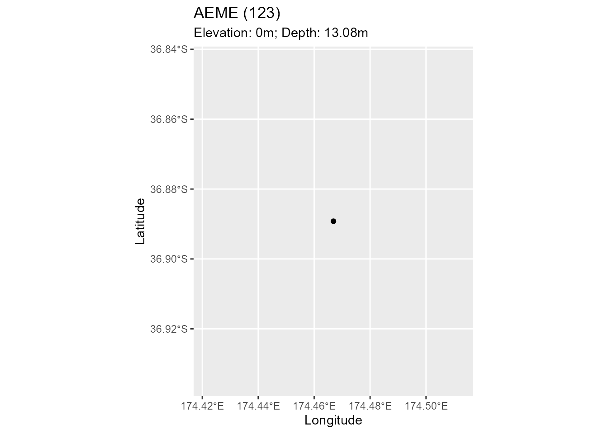
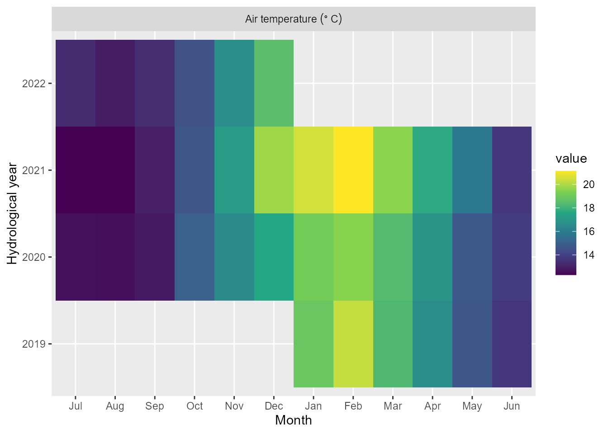

# Introduction to AEME

## Summary

The AEME package hosts three one-dimensional hydrodynamic models: the
DYnamic REservoir Simulation Model (DYRESM), the General Lake Model
(GLM), and the General Ocean Turbulence Model (GOTM, which has been
adapted for closed basins for application to lakes and reservoirs). The
models can be coupled to their corresponding water quality models, the
DYRESM-CAEDYM (Computational Aquatic Ecosystem Dynamics Model), GLM-AED2
(Aquatic Ecosystem Dynamics Model 2), and GOTM-WET (Water Ecosystem
Tool).

Key aspects of the AEME package include:

- Defined S4 class for `aeme` objects

- Configuration of models from common and standardised inputs

- Standardised calibration, manipulation and visualisation

## AEME object

### Description

The `aeme` object is the main object in the AEME package. It is an S4
class that contains all the information required to run a model. The
`aeme` object contains the following slots:

- [**lake**](#sec-lake) - a list object containing information about the
  lake (name, id, latitude, longitude, elevation, depth, area)
- [**time**](#sec-time) - a list object containing information about the
  time (start, stop, spin_up, time_step)
- [**configuration**](#sec-configuration) - a list object containing
  information about the configuration (model_controls, dy_cd, glm_aed,
  gotm_wet)
- [**observations**](#sec-observations) - a list object containing
  information about the observations (lake, level)
- [**inputs**](#sec-inputs) - a list object containing information about
  the inputs (init_profile, init_depth, hypsograph, meteo, use_lw, Kw)
- [**inflows**](#sec-inflows) - a list object containing information
  about the inflows (data, factor)
- [**outflows**](#sec-outflows) - a list object containing information
  about the outflows (data, outflow_lvl, factor)
- [**water_balance**](#sec-water_balance) - a list object containing
  information about the water balance configuration (use, method, data)
- [**parameters**](#sec-parameters) - a data.frame describing the
  parameters to be input with column names (model, file, name, value,
  min, max, module, group)
- [**output**](#sec-output) - a list object containing information about
  the outputs (n_members)

#### Lake

The `lake` slot contains information about the lake. It is a list object
that contains the following objects:

- name - Name of the lake (character).

- id - Lake ID (character or numeric).

- **latitude** - Latitude of the lake (numeric). If not provided, the
  latitude will be calculated from the centroid of the shape.

- **longitude** - Longitude of the lake (numeric). If not provided, the
  longitude will be calculated from the centroid of the shape.

- **elevation** - Elevation of the lake (numeric).

- shape - Shape of the lake (sf object). The shape of the lake can be
  represented as a polygon. The centroid of the polygon will be used to
  calculate the latitude and longitude of the lake.

- **depth** - Max depth of the lake (m) (numeric). Depth and area are
  used to generate a simple hypsographic curve if none is provided in
  the `inputs` slot.

- **area** - Surface area of the lake (m2) (numeric)

Objects in **bold** are required for building and running the model.

#### Time

The `time` slot contains information about the time. It is a list object
that contains the following objects:

- **start** - Start date of the simulation (character). The start date
  must be in the format `YYYY-MM-DD HH:MM:SS`.

- **end** - End date of the simulation (character). The end date must be
  in the format `YYYY-MM-DD HH:MM:SS`.

- **timestep** - Timestep of the simulation (numeric). The timestep must
  be in seconds.

- **spin_up** - List of spin up periods of the simulation for each model
  (numeric). The spin up period must be in days. The spin up period is
  the period of time that the model is run before the simulation period.
  The spin up period is used to initialise the model which is then
  discarded when examining the simulation period.

#### Configuration

The `configuration` slot is a list that contains each of the model
configurations. This includes the configurations files for the
hydrodynamic components as well as the aquatic ecosystem model
components:

| Model         | Hyrodynamic                         | Ecosystem                                                        |
|---------------|-------------------------------------|------------------------------------------------------------------|
| DYRESM-CAEDYM | *.cfg* file and *.par* file         | *.con*, *caedym3p1.bio, caedym3p1.chm* and *caedym3p1.sed* files |
| GLM-AED       | *glm3.nml* file                     | *aed2.nml*, *phytos.nml*, *zoops.nml* files                      |
| GOTM-WET      | *gotm.yaml* and *output.yaml* files | *fabm.yaml* file                                                 |

Files for hydrodynamic and ecosystem models.

When [`build_aeme()`](../reference/build_aeme.md) is ran, the
`model_controls` data.frame that is passed to the function as an
argument is added to the `configuration` slot.

For more details on the `model_controls`, see it’s section
[below](#sec-model_controls).

#### Observations

The `observations` slot is a list that contains observations of in-lake
(`lake`) variables (e.g. water temperature, chlorophyll-a, dissolved
oxygen etc.) and water level (`level`). The observations are used to
assess model performance using the function and also to calibrate the
model using the [aemetools](https://github.com/limnotrack/aemetools)
package.

The `lake` observations are stored in a data frame with the following
columns:

- **Date** - Date of the observation (character). The date must be in
  the format `YYYY-MM-DD HH:MM:SS`.

- **depth** - Depth of the observation (m) (numeric). The depth must be
  in metres.

- **var** - Variable name of the observation (character). The variable
  names an input preparation are designed in the [AEME inputs
  article](aeme-inputs.md).

- **value** - Value of the observation (numeric).

The `level` observations are stored in a data frame with the following
columns:

- **Date** - Date of the observation (character). The date must be in
  the format `YYYY-MM-DD HH:MM:SS`.

- **value** - Value of the observation (numeric).

#### Input

The `input` slot is a list that contains the following objects:

- init_profile - profile to initialise the lake simulation (data.frame).
  It has the columns: “depth”, “temperature” and “salt”. If this is not
  provided, it is automatically generated using the values in the
  [`model_controls`](#sec-model_controls).

- init_depth - depth of the lake when initialising the model (vector),
  If not provided, will assume the depth from the `hypsograph`.

- **hypsograph** - the lake hypsograph. This is a data.frame with the
  columns “elev”, “depth” and “area”. If you do not have this data, you
  can generate one using the
  [`generate_hypsograph()`](../reference/generate_hypsograph.md)
  function.

- **meteo** - the meteorological data. A data.frame which at a minimum
  must contain the columns date (“Date”), air temperature (“MET_tmpair),
  wind speed (”MET_wndspd”) and shortwave radiation (“MET_radswd”). See
  [AEME
  Inputs](https://limnotrack.github.io/AEME/articles/aeme-inputs.html#meteorological-data)

- use_lw - Logical switch to use longwave radiation. Defaults to TRUE.

- **Kw** - the light extinction coefficient ($m^{- 1}$).

#### Inflows

The inflows slot is a list that contains the following objects:

- data - named list of data.frames which contain the columns date
  (“Date”), flow (“HYD_flow”; $m^{3}day^{- 1}$). Temperature can also be
  provided (“HYD_temp”), however if not provided then it will be
  estimated using air temperature. The name for the list will be used as
  the stream identifier in each model. If `method` in the water_balance
  section is set to`3`, then “wbal” will be added to the data, this
  contains a separate inflow for each model, estimated using the
  different evaporation functions inside each model.

- factor - list of scaling factors to be applied to the inflows. Named
  according to each model.

If no inflows are present then this slot will be empty.

#### Outflows

The outflows slot is a list that contains the following objects:

- data - named list of data.frames which contain the columns date
  (“Date”), flow (“HYD_flow”; $m^{3}day^{- 1}$). If `method` in the
  water_balance section is set to `2` or `3`, then “wbal” will be added
  to the data, this contains a separate outflow for each model,
  estimated using the different evaporation functions inside each model.

- factor - list of scaling factors to be applied to the outflows. Named
  according to each model. However, this can also be passed as a
  parameter in the model_parameters section and calibrated there. This
  is the preferred method for applying scaling factors.

If no outflows are present then this slot will be empty.

#### Water balance

The water balance slot is generated internally when the
[`build_aeme()`](../reference/build_aeme.md) function is called and the
`wb_method` is set to `2` or `3`. The slot contains:

- use: define which lake level to use. Can either be observed (“obs”) or
  modelled (“mod”) lake level. Default = “obs”.

- method: This can be `1` (no inflows or outflows) or `2` (outflows
  calculated) or `3` (inflows and outflows calculated). The default is
  `2` .

- data: list of two data.frames. “wbal” which contains the diagnostics
  for estimating evaporation and water balance for each model and
  “model” which contains the modelled lake water level if `use` is
  “mod”.

#### Parameters

The parameters slot contains a data.frame of parameters which are used
when building the model. These will update the default model parameters
or scale the meteorological or scale the inflows and outflows for each
model.

The columns for the parameters data.frame are:

- model - Either “dy_cd”, “glm_aed” and “gotm_wet”.

- file - Either the name of the file e.g. “glm3.nml” for model specific
  files or “met” for meteorological variables or “inf” for inflow or
  “wdr” for outflows. (Outflows were initiallly referred to as
  withdrawals, hence the “wdr” notation, this will probably be updated
  to reflect the current outflows slot soon…).

- name - Name of the parameter. If the name of the parameter is nested
  in a nml/yaml file, then the whole hierarchy needs to be provide with
  each level separated by a “/” e.g. “light/Kw” for Kw in GLM-AED.

- value - Value of the parameter.

- min - Minimum range of the parameter. This is used in the
  [`aemetools::calib_aeme()`](https://limnotrack.github.io/aemetools/reference/calib_aeme.html)
  and
  [`aemetools::sa_aeme()`](https://limnotrack.github.io/aemetools/reference/sa_aeme.html)
  function.

- max - Maximum range of the parameter. This is used in the
  [`aemetools::calib_aeme()`](https://limnotrack.github.io/aemetools/reference/calib_aeme.html)
  and
  [`aemetools::sa_aeme()`](https://limnotrack.github.io/aemetools/reference/sa_aeme.html)
  function.

- group - Phytoplankton group. This is only used for GOTM-WET
  phytoplankton parameters.

- index - Index of the parameter. This is only used for GLM-AED
  parameters that are vectors e.g. sediment parameters
  (“sed_temp_mean”).

- module - Module that the parameter is in. Not necessary, but is
  helpful for identifying which parameters are in which module for
  GLM-AED and GOTM-WET.

There is a function
[`get_aeme_parameters()`](../reference/get_aeme_parameters.md) which
allows you to select parameters based on model and module. See
`?get_aeme_parameters()` for more details.

#### Output

The output slot is a list that is updated when
[`run_aeme()`](../reference/run_aeme.md) is executed. Each time it is
executed, variable outputs designated in the `model_controls` will be
added to the `Aeme` object.

### Model controls

The `model_controls` is a data.frame generated by the
[`get_model_controls()`](../reference/get_model_controls.md). The
data.frame has the columns:

- var_aeme - character; the AEME variable name

- simulate - logical; add the variable to the `Aeme` object

- inf_default - numeric; default value to use in the inflows if none
  present in the inflows. This is particularly important for configuring
  water chemistry for the inflows if `use_bgc = TRUE`.

- initial_wc - numeric; value to use in initialising the model. This
  will be automatically updated if the variable is present in the
  `observations` slot.

- initial_sed - numeric; value to use in intialising the sediment module
  for the DYRESM-CAEDYM model.

- conversion_aed - numeric; factor to multiply by to convert to GLM-AED
  units.

When the model is built the mode

### Creation

The `aeme` object can be created using the
[`aeme_constructor()`](../reference/aeme_constructor.md) function. It
requires the basic inputs to from a YAML file using the `yaml_to_aeme`
function. The YAML file contains all the information required to run the
model.

``` r
# Define lake list
lat <- -36.88921
lon <- 174.4669
depth <- 13.08
area <- 153648

lake <- list(
    latitude = lat,
    longitude = lon,
    # elevation = elevation,
    depth = depth,
    area = area
  )
time <- list(
  start = as.POSIXct("2020-07-01"),
  stop = as.POSIXct("2022-06-30")
)

hypsograph <- generate_hypsograph(max_depth = depth, surface_area = area,
                                  volume_development = 1.2)

met <- aemetools::get_era5_land_point_nz(lat = lat, lon = lon,
                                         years = 2020:2022)

#' Define input list
input = list(
  hypsograph = hypsograph,
  meteo = met,
  Kw = 1.21
)

aeme <- aeme_constructor(lake = lake, time = time, input = input)
```

``` r
slotNames(aeme)
#>  [1] "lake"          "time"          "configuration" "observations" 
#>  [5] "input"         "inflows"       "outflows"      "water_balance"
#>  [9] "output"        "parameters"
```

## Manipulation

The `aeme` object can be manipulated using the `AEME` package functions.
The functions are defined by the slot names of the `aeme` object. For
example, the `lake` slot can be manipulated using the `lake` function.

``` r
# Load lake data
lke <- lake(aeme)
# Print lake data to console
print(lke)
#> $name
#> [1] "Wainamu"
#> 
#> $id
#> [1] "LID45819"
#> 
#> $latitude
#> [1] -36.88921
#> 
#> $longitude
#> [1] 174.4669
#> 
#> $elevation
#> [1] 23.2
#> 
#> $depth
#> [1] 13.48
#> 
#> $area
#> [1] 153648

# Change lake name
lke[["name"]] <- "AEME"

# reassign lake data to aeme object
lake(aeme) <- lke

aeme
#>             AEME 
#> -------------------------------------------------------------------
#>   Lake
#> AEME (ID: LID45819); Lat: -36.89; Lon: 174.47; Elev: 23.2m; Depth: 13.48m;
#> Area: 153648 m2
#> -------------------------------------------------------------------
#>   Time
#> Start: 2013-07-01; Stop: 2023-06-30; Time step: 3600
#>  Spin up (days): GLM: 1095; GOTM: 1095; DYRESM: 1095
#> -------------------------------------------------------------------
#>   Configuration
#>     Model controls: Present
#>     Use biogeochemical model: 
#>           Physical   |   Biogeochemical
#> DY-CD    : Absent     |   Absent 
#> GLM-AED  : Present    |   Present
#> GOTM-WET : Present    |   Present
#> -------------------------------------------------------------------
#>   Observations
#> Lake: Present; Level: Absent
#> -------------------------------------------------------------------
#>   Input
#> Inital profile: Present; Inital depth: 13.48m; Hypsograph: Present (n=53);
#> Meteo: Present; Use longwave: TRUE; Kw: 1.214286
#> -------------------------------------------------------------------
#>   Inflows
#> Data: Present; Scaling factors: DY-CD: 1; GLM-AED: 1; GOTM-WET: 1
#> -------------------------------------------------------------------
#>   Outflows
#> Data: Present; Scaling factors: DY-CD: 1; GLM-AED: 1; GOTM-WET: 1
#> -------------------------------------------------------------------
#>   Water balance
#> Method: 2; Use: obs; Modelled: Absent; Water balance: Present
#> -------------------------------------------------------------------
#>   Parameters: 
#> Number of parameters: 18
#> -------------------------------------------------------------------
#>   Output: 
#> 
#> DY-CD:    
#> GLM-AED:  
#> GOTM-WET:
```

### Visualisation

The `aeme` object can be visualised simply using the `plot` function.
The `plot` function can be applied to the different slots of the `aeme`
object. For example, the `lake` slot can be visualised using the `plot`
function.

``` r
plot(aeme, "lake")
```



``` r
plot(aeme, "input")
```



## Build Model Ensemble

``` r
model_controls <- get_model_controls()
model <- c("dy_cd", "glm_aed", "gotm_wet")
path <- "aeme"
aeme <- build_aeme(path = path, aeme = aeme, model = model,
                            model_controls = model_controls,
                            ext_elev = 5, use_bgc = TRUE)
#> Created missing directory aeme.
#> ! Missing state variables in inflows:
#> ! CHM_oxy
#> ℹ Added default values for missing variables.
#> ! Missing state variables in inflows:
#> ! CHM_oxy
#> ℹ Added default values for missing variables.
#> ! Missing state variables in inflows:
#> ! CHM_oxy
#> ℹ Added default values for missing variables.
#> ! Missing state variables in inflows:
#> ! CHM_oxy
#> ℹ Added default values for missing variables.
#> ! Missing state variables in inflows:
#> ! CHM_oxy
#> ℹ Added default values for missing variables.
#> ! Missing state variables in inflows:
#> ! CHM_oxy
#> ℹ Added default values for missing variables.
#> ℹ No water level present. Using constant water level.
#> ℹ Correcting water balance using estimated outflows (method = 2).
#> ℹ Calculating lake level using lake depth and a sinisoidal function.
#> Building AEME object ■■■■■■■■■■■■■                     40% | Writing DYRESM-CAE…
#> 
#> ℹ Building DYRESM-CAEDYM for lake aeme
#> ℹ Copied in DYRESM .par file
#> ℹ Writing DYRESM configuration file
#> ℹ Writing DYRESM-CAEDYM control file
#> Building AEME object ■■■■■■■■■■■■■■■■■■■               60% | Writing GLM-AED2 c…
#> 
#> ℹ Building GLM-AED2 for lake aeme
#> ℹ Copied in GLM nml file
#> ℹ Copied in AED nml file
#> ℹ  oxy_initial = 625 replaced with 312.5
#> ℹ Building GOTM-WET model for lake aeme
#> ℹ Copied in GOTM configuration files
#> ℹ instances/abiotic_water/initialization/sO2W 13 replaced with 10
#> Warning: No parameters in 'param' for dy_cd.
#> ✔ GLM nml validation completed - no issues detected.
#> ✔ GOTM YAML validation completed - no issues detected.
#> ✔ GLM nml validation completed - no issues detected.
#> Building AEME object ■■■■■■■■■■■■■■■■■■■■■■■■■         80% | Writing GOTM-WET c…
aeme
#>             AEME 
#> -------------------------------------------------------------------
#>   Lake
#> AEME (ID: LID45819); Lat: -36.89; Lon: 174.47; Elev: 23.2m; Depth: 13.48m;
#> Area: 153648 m2
#> -------------------------------------------------------------------
#>   Time
#> Start: 2013-07-01; Stop: 2023-06-30; Time step: 3600
#>  Spin up (days): GLM: 1095; GOTM: 1095; DYRESM: 1095
#> -------------------------------------------------------------------
#>   Configuration
#>     Model controls: Present
#>     Use biogeochemical model: Yes 
#>           Physical   |   Biogeochemical
#> DY-CD    : Present    |   Present
#> GLM-AED  : Present    |   Present
#> GOTM-WET : Present    |   Present
#> -------------------------------------------------------------------
#>   Observations
#> Lake: Present; Level: Absent
#> -------------------------------------------------------------------
#>   Input
#> Inital profile: Present; Inital depth: 13.48m; Hypsograph: Present (n=53);
#> Meteo: Present; Use longwave: TRUE; Kw: 1.214286
#> -------------------------------------------------------------------
#>   Inflows
#> Data: Present; Scaling factors: DY-CD: 1; GLM-AED: 1; GOTM-WET: 1
#> -------------------------------------------------------------------
#>   Outflows
#> Data: Present; Scaling factors: DY-CD: 1; GLM-AED: 1; GOTM-WET: 1
#> -------------------------------------------------------------------
#>   Water balance
#> Method: 2; Use: obs; Modelled: Absent; Water balance: Present
#> -------------------------------------------------------------------
#>   Parameters: 
#> Number of parameters: 18
#> -------------------------------------------------------------------
#>   Output: 
#> 
#> DY-CD:    
#> GLM-AED:  
#> GOTM-WET:
```

``` r
cfg <- configuration(aeme)
```
