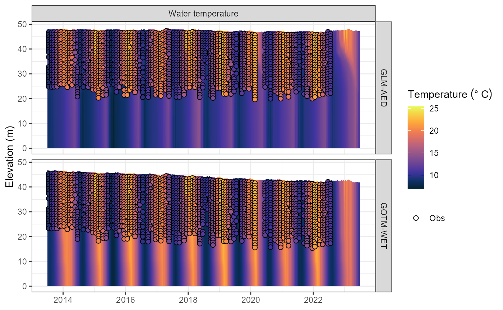
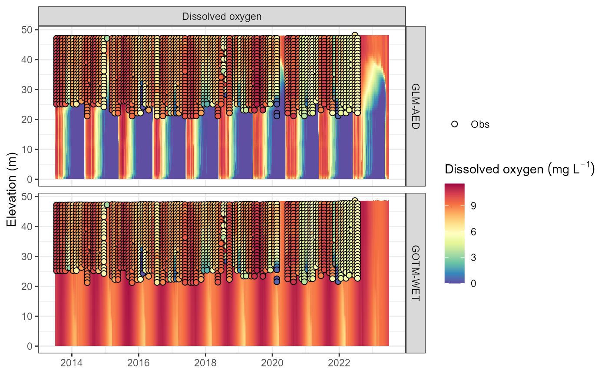
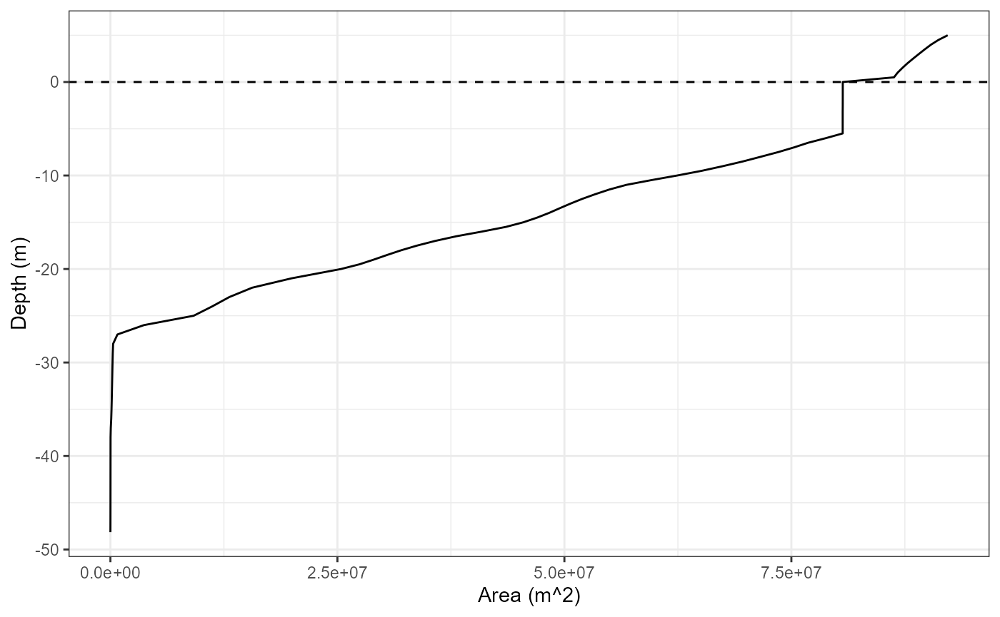

# Using LERNZmp with AEME

## Introduction

The [Lake Ecosystem Research New Zealand Model Platform
(LERNZmp)](https://limnotrack.shinyapps.io/LERNZmp/) is a web platform
that provides a user-friendly interface to the lake ecosystem model
output for New Zealand lakes. The platform is designed to provide a
simple way to explore the model output across multiple lakes and also to
compare the model results with observed data.

The platform is located here:
[LERNZmp](https://limnotrack.shinyapps.io/LERNZmp/). Select and load a
lake model output on the “Overview” tab. The model output can be
downloaded in the “Download Models” tab. This downloads a “.zip” folder
containing the model output for the selected lake(s) as “.rds” files and
a lake metadata file “LERNZmp_lake_metadata.csv”.

## Using LERNZmp output with AEME

Once you have downloaded the LERNZmp model output and unzipped the
folder, you should a similar file structure to the following:

``` r
list.files("lernzmp")
#> [1] "LERNZmp_lake_metadata.csv" "LID11133.rds"             
#> [3] "LID40102.rds"              "LID45819.rds"
```

### LERNZmp metadata

The metadata file contains information about the all the lakes in the
LERNZmp platform. This includes the lake ID, name surface area (ha),
region, geomorphic type, depth, depth measurement (measured or
predicted), data (no data/minimal data/limited and irregular/periodic
but sparse/seasonal but detailed) and lernzmp file name.

``` r
metadata <- read.csv("lernzmp/LERNZmp_lake_metadata.csv")
head(metadata)
#>        ID            Name   Area     Region Geomorphic.type Depth
#> 1   LID 1           Onoke 622.34 Wellington       Shoreline  8.72
#> 2   LID 3 Kohangapiripiri  10.82 Wellington       Shoreline 14.43
#> 3   LID 4     Kohangatera  21.31 Wellington       Shoreline 14.80
#> 4 LID 119         LID 119  41.87 Wellington        Riverine  3.55
#> 5 LID 195         Nganoke   3.10 Wellington        Riverine  3.74
#> 6 LID 229          Pounui  45.95 Wellington        Tectonic    NA
#>   Depth.measurement         Data aeme_file
#> 1          Measured Minimal Data      LID1
#> 2         Predicted      No data      LID3
#> 3         Predicted      No data      LID4
#> 4         Predicted      No data    LID119
#> 5         Predicted      No data    LID195
#> 6         Predicted      No data    LID229
```

### RDS files

RDS files are binary files that store R objects, such as data sets, and
are a native format for R. RDS files preserve data types and classes and
are generally smaller than their text file counterparts. The AEME
objects are an S4 object of the class `Aeme`. This object class an store
model configuration, inputs and outputs and allows for the easy transfer
of a lake model setup.

The lakes included in this example have ID’s LID11133 and LID40102. We
will filter the metadata to examine these two lakes.

``` r
metadata <- metadata |> 
  dplyr::filter(aeme_file %in% c("LID11133", "LID40102"))
metadata
#>          ID    Name    Area        Region Geomorphic.type Depth
#> 1 LID 11133 Rotorua 8060.23 Bay of Plenty        Volcanic 45.27
#> 2 LID 40102  Rotoma 1113.68 Bay of Plenty        Volcanic 89.13
#>   Depth.measurement                  Data aeme_file
#> 1          Measured Seasonal but Detailed  LID11133
#> 2          Measured Seasonal but Detailed  LID40102
```

These are lakes Rotorua (LID11133) and Rotoma (LID40102), respectively.

## Build AEME models

We will now build AEME models for these two lakes using the LERNZmp
model output. We will first load the AEME object from the “.rds” files.

The `Aeme` object contains the lake metadata, model output, and model
controls. More details can be found
[`vignette("intro-aeme")`](../articles/intro-aeme.md). It is an S4
object of the class `Aeme`.

First, make sure to install the `AEME` package.

``` r
# install.packages("remotes")
remotes::install_github("limnotrack/AEME")
```

Once installed, load the `AEME` package.

``` r
library(AEME)
#> 
#> Attaching package: 'AEME'
#> The following object is masked from 'package:stats':
#> 
#>     time
```

Now, we will load the AEME object for Lake Rotorua (LID11133).

``` r
aeme <- readRDS("lernzmp/LID11133.rds")
class(aeme)
#> [1] "Aeme"
#> attr(,"package")
#> [1] "AEME"
```

It can be printed to the console to see the contents of the object.

``` r
aeme
#>             AEME 
#> -------------------------------------------------------------------
#>   Lake
#> Rotorua (ID: LID11133); Lat: -38.09; Lon: 176.27; Elev: 284.88m; Depth: 48.15m;
#> Area: 80659960 m2
#> -------------------------------------------------------------------
#>   Time
#> Start: 2013-07-01; Stop: 2023-06-30; Time step: 3600
#>  Spin up (days): GLM: 1095; GOTM: 1095; DYRESM: 1095
#> -------------------------------------------------------------------
#>   Configuration
#>     Model controls: Present
#>     Use biogeochemical model: 
#>           Physical   |   Biogeochemical
#> DY-CD    : Absent     |   Absent 
#> GLM-AED  : Present    |   Present
#> GOTM-WET : Present    |   Present
#> -------------------------------------------------------------------
#>   Observations
#> Lake: Present; Level: Absent
#> -------------------------------------------------------------------
#>   Input
#> Inital profile: Present; Inital depth: 48.148m; Hypsograph: Present (n=95);
#> Meteo: Present; Use longwave: TRUE; Kw: 0.5666667
#> -------------------------------------------------------------------
#>   Inflows
#> Data: Present; Scaling factors: DY-CD: 1; GLM-AED: 1; GOTM-WET: 1
#> -------------------------------------------------------------------
#>   Outflows
#> Data: Present; Scaling factors: DY-CD: 1; GLM-AED: 1; GOTM-WET: 1
#> -------------------------------------------------------------------
#>   Water balance
#> Method: 2; Use: obs; Modelled: Absent; Water balance: Present
#> -------------------------------------------------------------------
#>   Parameters: 
#> Number of parameters: 18
#> -------------------------------------------------------------------
#>   Output: 
#> 
#> DY-CD:    1
#> GLM-AED:  1
#> GOTM-WET: 1
```

This allows for quick inspection of all the different slots within the
`Aeme` object. The lake section has the lake metadata, the time section
has the start, stop and spin-up dates, the configuration section has the
model configuration which allows for the building of the AEME models
locally.

``` r
model <- c("glm_aed", "gotm_wet") # models to build
path <- "aeme" # directory in which the model configuration will be built

aeme <- build_aeme(aeme = aeme, model = model, path = path,
                    use_aeme = TRUE, use_bgc = TRUE)
```

## Run AEME models

We will now run the AEME models for the two lakes. This will run the
models with the configurations built in the `path` directory. The
`parallel` argument is set to `TRUE` to run the models in parallel which
can speed up the process.

``` r
aeme <- run_aeme(aeme = aeme, model = model, path = path, parallel = TRUE)
#> Running models in parallel... [2025-11-11 01:19:35]
#> Model run complete![2025-11-11 01:21:11]
#> Reading models in parallel... [2025-11-11 01:21:11]
#> Model reading complete![2025-11-11 01:21:41]
aeme
#>             AEME 
#> -------------------------------------------------------------------
#>   Lake
#> Rotorua (ID: LID11133); Lat: -38.09; Lon: 176.27; Elev: 284.88m; Depth: 48.15m;
#> Area: 80659960 m2
#> -------------------------------------------------------------------
#>   Time
#> Start: 2013-07-01; Stop: 2023-06-30; Time step: 3600
#>  Spin up (days): GLM: 1095; GOTM: 1095; DYRESM: 1095
#> -------------------------------------------------------------------
#>   Configuration
#>     Model controls: Present
#>     Use biogeochemical model: Yes 
#>           Physical   |   Biogeochemical
#> DY-CD    : Absent     |   Absent 
#> GLM-AED  : Present    |   Present
#> GOTM-WET : Present    |   Present
#> -------------------------------------------------------------------
#>   Observations
#> Lake: Present; Level: Absent
#> -------------------------------------------------------------------
#>   Input
#> Inital profile: Present; Inital depth: 48.148m; Hypsograph: Present (n=95);
#> Meteo: Present; Use longwave: TRUE; Kw: 0.5666667
#> -------------------------------------------------------------------
#>   Inflows
#> Data: Present; Scaling factors: DY-CD: 1; GLM-AED: 1; GOTM-WET: 1
#> -------------------------------------------------------------------
#>   Outflows
#> Data: Present; Scaling factors: DY-CD: 1; GLM-AED: 1; GOTM-WET: 1
#> -------------------------------------------------------------------
#>   Water balance
#> Method: 2; Use: obs; Modelled: Absent; Water balance: Present
#> -------------------------------------------------------------------
#>   Parameters: 
#> Number of parameters: 18
#> -------------------------------------------------------------------
#>   Output: 
#> 
#> DY-CD:    0
#> GLM-AED:  1
#> GOTM-WET: 1
```

In the “Output” section of the `Aeme` object, the “Number of ensembles”
is set to 1 indicating that there is now output for each model in the
`Aeme` object.

``` r
plot_output(aeme = aeme, model = model, var_sim = "HYD_temp")
#> Warning: Using size for a discrete variable is not advised.
#> Warning: Removed 332 rows containing missing values or values outside the scale range
#> (`geom_col()`).
```



``` r
plot_output(aeme = aeme, model = model, var_sim = "CHM_oxy")
#> Warning: Using size for a discrete variable is not advised.
#> Warning: Removed 332 rows containing missing values or values outside the scale range
#> (`geom_col()`).
```



## Access AEME input data

The `Aeme` object contains the input data for the models. This includes
the lake metadata, model controls, and model configuration. The `input`
slot contains the initial profile (“init_profile”), initial depth
(“init_depth”), hypograph (“hypograph”), meteorological data (“meteo”),
switch for using longwave radiation (“use_lw”) and light extinction
coefficient (“Kw”) for the models.

``` r
inp <- input(aeme)
names(inp)
#> [1] "init_profile" "init_depth"   "hypsograph"   "meteo"        "use_lw"      
#> [6] "Kw"
```

### Hypsograph data

``` r
hyps <- inp$hypsograph
head(hyps)
#>     elev     area depth
#> 1 289.88 92216772   5.0
#> 2 289.38 91198888   4.5
#> 3 288.88 90383984   4.0
#> 4 288.38 89698688   3.5
#> 5 287.88 89045360   3.0
#> 6 287.38 88405268   2.5
```

``` r
library(ggplot2)
ggplot(hyps, aes(x = area, y = depth)) +
  geom_hline(yintercept = 0, linetype = "dashed") +
  geom_line() +
  labs(y = "Depth (m)", x = "Area (m^2)") +
  theme_bw()
```


