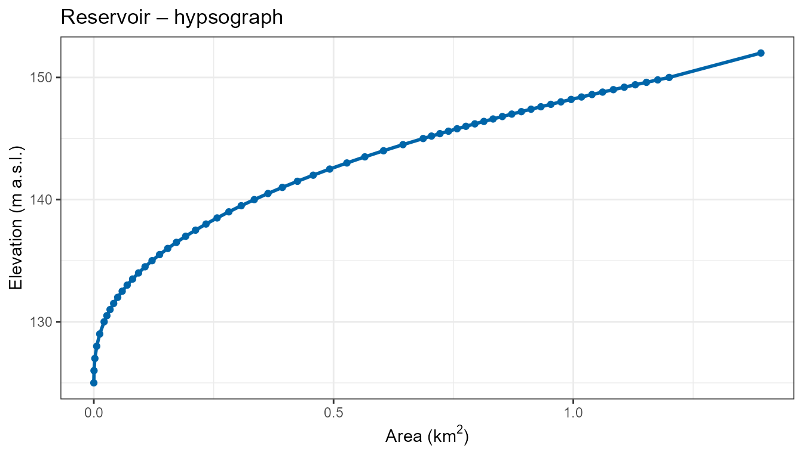
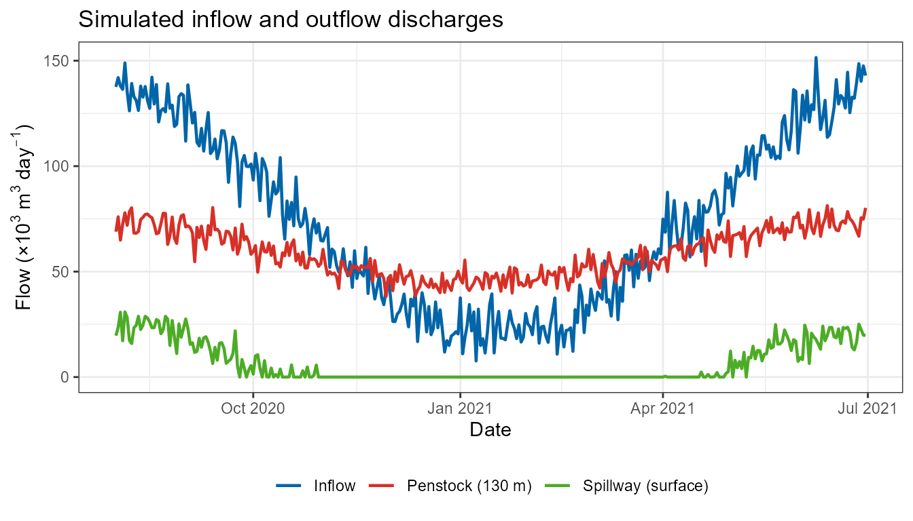
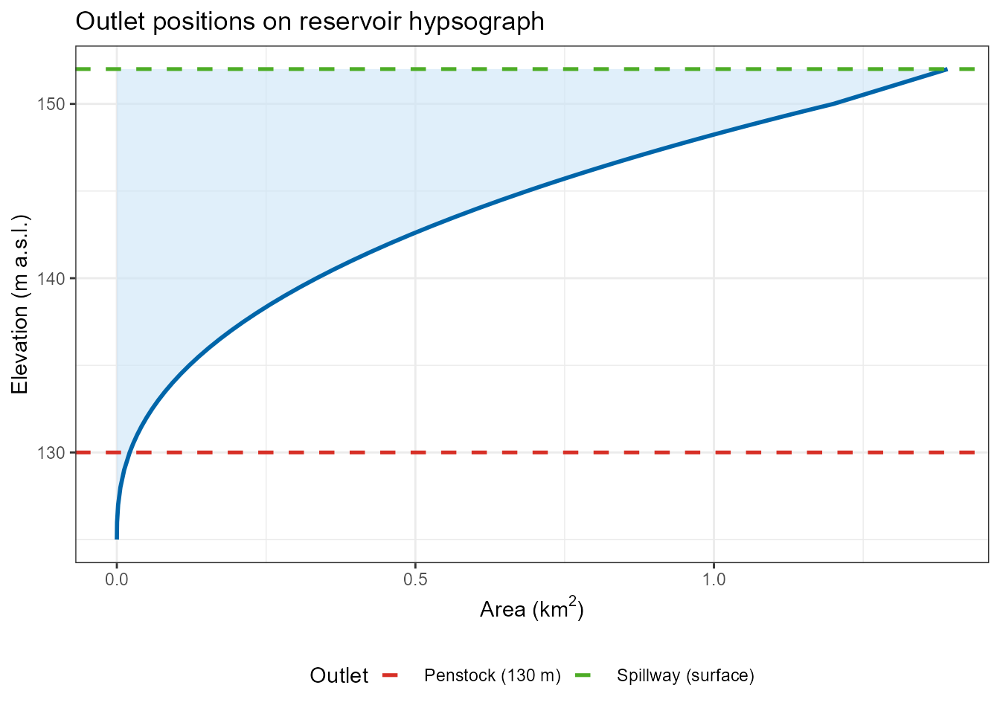
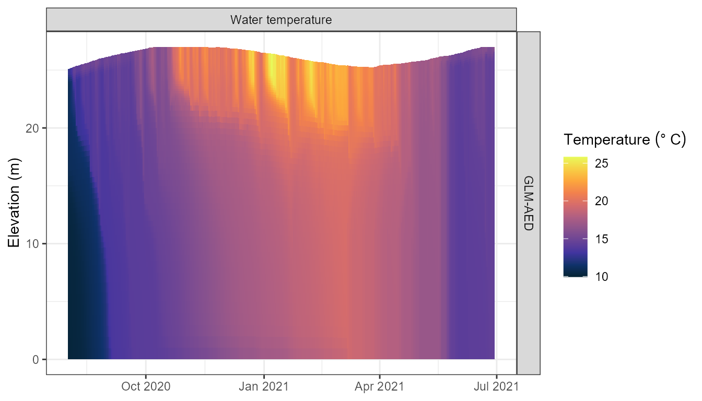

# Reservoir Simulation with Multiple Outlets

## Introduction

Reservoirs differ from natural lakes in several ways that are important
for hydrodynamic modelling:

1.  **Regulated water levels** – reservoir levels are managed through
    controlled releases rather than a natural outlet or seepage.
2.  **Multiple outlets at different depths** – a single reservoir can
    have:
    - A **surface spillway** that only activates when the reservoir is
      near full capacity.
    - A **penstock or bottom outlet** for daily operational releases.
    - A **mid-level selective withdrawal outlet** for water quality
      management (e.g. to avoid releasing cold, anoxic hypolimnetic
      water).
3.  **Thermal stratification management** – withdrawals from different
    depth layers affect the downstream temperature and water quality.

AEME supports all three major 1-D hydrodynamic models (DYRESM-CAEDYM,
GLM-AED, GOTM-WET) with multiple outlets at arbitrary elevations. This
vignette walks through setting up a reservoir ensemble model with two
outlets at different levels: a regulated **penstock** at depth and a
**surface spillway**.

## Setup

``` r

library(AEME)
library(ggplot2)
library(dplyr)
```

## Reservoir data

We will use a fictional reservoir, Reservoir, located in the North
Island of New Zealand. The reservoir has a full supply level of 150 m
above sea level and a maximum depth of 25 m.

``` r

lat   <- -37.80
lon   <- 176.00
elev  <- 150   # full supply level (m a.s.l.)
depth <- 25    # maximum depth (m)
area  <- 1.2e6 # surface area at full supply level (m²)

reservoir <- list(
  name      = "Reservoir",
  id        = "res001",
  latitude  = lat,
  longitude = lon,
  elevation = elev,
  depth     = depth,
  area      = area
)
```

## Simulation period

``` r

time <- list(
  start = "2020-08-01 00:00:00",
  stop  = "2021-06-30 00:00:00"
)
```

## Meteorological data

Meteorological data bundled with the AEME package (originally from Lake
Wainamu, North Island) is reused here to drive the reservoir simulation.

``` r

meteo_file <- system.file("extdata/lake/data/meteo.csv", package = "AEME")
met <- read.csv(meteo_file) |>
  mutate(Date = as.Date(Date))

head(met[, 1:5])
#>         Date MET_tmpair MET_tmpdew MET_wnduvu MET_wnduvv
#> 1 2019-01-01    19.5260    16.9129    3.19505    4.21590
#> 2 2019-01-02    19.5024    15.7136    4.59457    2.62703
#> 3 2019-01-03    20.1359    18.0478    6.17768    3.99858
#> 4 2019-01-04    19.1298    15.2155    2.56012    5.66473
#> 5 2019-01-05    19.1868    15.3679    3.77683    2.75966
#> 6 2019-01-06    20.2102    16.6466    4.83125    3.06035
```

## Hypsograph

The hypsograph describes the relationship between elevation and surface
area (and thus volume). Constructed reservoirs typically have a more
prismatic (box-like) shape compared to natural lakes. This is reflected
by a higher `volume_development` parameter (values \> 1.5 give a convex,
cylindrical shape; a value of 3 corresponds to a perfect cylinder).

``` r

hypsograph <- generate_hypsograph(
  max_depth          = depth,
  surface_area       = area,
  volume_development = 2.5,   # more prismatic than a natural lake
  elev               = elev,
  ext_elev           = 2      # extend 2 m above full supply level
)

head(hypsograph)
#>    elev depth    area
#> 1 152.0   2.0 1391324
#> 2 150.0   0.0 1200000
#> 3 149.8  -0.2 1176144
#> 4 149.6  -0.4 1152574
#> 5 149.4  -0.6 1129291
#> 6 149.2  -0.8 1106292
```

``` r

ggplot(hypsograph, aes(x = area / 1e6, y = elev)) +
  geom_line(linewidth = 1, colour = "#0065a9") +
  geom_point(size = 1.5, colour = "#0065a9") +
  labs(
    x     = expression("Area (km"^2 * ")"),
    y     = "Elevation (m a.s.l.)",
    title = "Reservoir – hypsograph"
  ) +
  theme_bw()
```



## Inflow data

We create a synthetic seasonal inflow time series typical of a New
Zealand catchment, with higher flows in winter (June–August) and lower
flows in summer. The inflow data frame must contain at minimum `Date`
and `HYD_flow` (m³ day⁻¹). Temperature (`HYD_temp`, °C) and salinity
(`CHM_salt`, PSU) columns are recommended.

``` r

set.seed(42)
sim_dates <- seq(as.Date("2020-01-01"), as.Date("2021-12-31"), by = "day")
doy       <- as.integer(format(sim_dates, "%j"))

# Seasonal signal: peak winter flow ~day 200 (NZ Southern Hemisphere winter)
inflow_flow <- pmax(5000,
  80000 + 60000 * cos(2 * pi * (doy - 200) / 365) +
    rnorm(length(sim_dates), mean = 0, sd = 8000))

# River temperature: coolest in winter, warmest in summer
inflow_temp <- pmax(4, 15 - 8 * cos(2 * pi * (doy - 15) / 365))

inflow_data <- data.frame(
  Date     = sim_dates,
  HYD_flow = inflow_flow,
  HYD_temp = inflow_temp,
  CHM_salt = 0
)

head(inflow_data[, 1:3])
#>         Date HYD_flow HYD_temp
#> 1 2020-01-01 33371.71 7.231200
#> 2 2020-01-02 17605.56 7.199484
#> 3 2020-01-03 24764.44 7.170079
#> 4 2020-01-04 26675.80 7.142995
#> 5 2020-01-05 24617.84 7.118239
#> 6 2020-01-06 20322.85 7.095819
```

## Multiple outlet data

The key feature demonstrated in this vignette is the configuration of
**two outlets at different elevations**:

| Outlet | Elevation | Description |
|----|----|----|
| **Penstock** | 130 m | Regulated bottom release; 20 m below full supply level |
| **Spillway** | -1 (surface) | Uncontrolled overflow at the water surface |

``` r

# Penstock: regulated base flow with small seasonal variation
penstock_flow <- pmax(0,
  60000 + 15000 * sin(2 * pi * (doy - 100) / 365) +
    rnorm(length(sim_dates), mean = 0, sd = 4000))

# Spillway: only active during the high-inflow winter period
spillway_flow <- pmax(0,
  25000 * cos(2 * pi * (doy - 200) / 365) +
    rnorm(length(sim_dates), mean = 0, sd = 5000))

penstock_data <- data.frame(
  Date     = sim_dates,
  HYD_flow = penstock_flow
)

spillway_data <- data.frame(
  Date     = sim_dates,
  HYD_flow = spillway_flow
)
```

Visualise the inflow and both outflows over the simulation period:

``` r

flows <- bind_rows(
  mutate(inflow_data[, c("Date", "HYD_flow")], stream = "Inflow"),
  mutate(penstock_data, stream = "Penstock (130 m)"),
  mutate(spillway_data, stream = "Spillway (surface)")
) |>
  filter(Date >= as.Date("2020-08-01"),
         Date <= as.Date("2021-06-30"))

ggplot(flows, aes(x = Date, y = HYD_flow / 1e3, colour = stream)) +
  geom_line(linewidth = 0.8) +
  scale_colour_manual(
    values = c("Inflow"             = "#0065a9",
               "Penstock (130 m)"   = "#d73027",
               "Spillway (surface)" = "#4dac26"),
    name = NULL
  ) +
  labs(
    x     = "Date",
    y     = expression("Flow (×10"^3 * " m"^3 * " day"^{-1} * ")"),
    title = "Simulated inflow and outflow discharges"
  ) +
  theme_bw() +
  theme(legend.position = "bottom")
```



The penstock provides a near-constant regulated release throughout the
year, while the spillway flows only during the high-flow winter months.

### Outlet positions on the hypsograph

It is important that each subsurface outlet elevation falls within the
elevation range of the hypsograph. Below we illustrate where the two
outlets sit relative to the reservoir hypsograph.

``` r

outlet_lines <- data.frame(
  elev  = c(130, max(hypsograph$elev)),
  label = c("Penstock (130 m)", "Spillway (surface)")
)

ggplot(hypsograph, aes(x = area / 1e6, y = elev)) +
  geom_ribbon(aes(xmin = 0, xmax = area / 1e6), fill = "#cce5f7", alpha = 0.6) +
  geom_line(linewidth = 1, colour = "#0065a9") +
  geom_hline(data = outlet_lines,
             aes(yintercept = elev, colour = label),
             linetype = "dashed", linewidth = 0.9) +
  scale_colour_manual(
    values = c("Penstock (130 m)"   = "#d73027",
               "Spillway (surface)" = "#4dac26"),
    name = "Outlet"
  ) +
  labs(
    x     = expression("Area (km"^2 * ")"),
    y     = "Elevation (m a.s.l.)",
    title = "Outlet positions on reservoir hypsograph"
  ) +
  theme_bw() +
  theme(legend.position = "bottom")
```



## Build the AEME object

We assemble the AEME object with
[`aeme_constructor()`](https://limnotrack.com/reference/aeme_constructor.md).
The `input` list must include at minimum the hypsograph, meteorological
data, and light extinction coefficient (`Kw`).

``` r

input <- list(
  init_depth = depth,
  hypsograph = hypsograph,
  meteo      = met,
  use_lw     = TRUE,
  Kw         = 0.5   # light extinction coefficient (m⁻¹)
)
```

``` r

aeme <- aeme_constructor(
  lake  = reservoir,
  time  = time,
  input = input
)
#> ℹ `time$start` is a <character>; converting to <POSIXct> (UTC).
#> ℹ `time$stop` is a <character>; converting to <POSIXct> (UTC).
#> ! `time$time_step` is missing.
#> ℹ Defaulting to 3600 seconds (1 hour).
#> ! `time$spin_up` is missing.
#> ℹ Defaulting to 2 days spin-up for all models.
aeme
#> 
#> ── AEME ────────────────────────────────────────────────────────────────────────
#> 
#> ── Lake ──
#> 
#> Reservoir (ID: res001)
#> • Lat: -37.8; Lon: 176
#> • Elev: 150m; Depth: 25m; Area: 1200000 m2
#> 
#> ── Time ──
#> 
#> • Start: 2020-08-01; Stop: 2021-06-30; Time step: 3600
#> • Spin up (days): GLM: 2; GOTM: 2; DYRESM: 2
#> 
#> ── Configuration ──
#> 
#> • Model:
#> • Path: D:/a/AEME/AEME/vignettes/articles
#> • Model controls: Present
#> • Use biogeochemical model: No
#> ┌ Model Configuration ─────────────────────────────────────────┐
#> │       Model              Physical         Biogeochemical     │
#> │ ---                                                          │
#> │       DY-CD               Absent              Absent         │
#> │      GLM-AED              Absent              Absent         │
#> │      GOTM-WET             Absent              Absent         │
#> └──────────────────────────────────────────────────────────────┘
#> 
#> ── Observations ──
#> 
#> • Lake: Absent; Level: Absent
#> 
#> ── Input ──
#> 
#> • Initial profile: Absent; Initial depth: 25m
#> • Hypsograph: Present (n=62)
#> • Meteo: Present; Use longwave: TRUE; Kw: 0.5
#> 
#> ── Inflows ──
#> 
#> • Number of inflows: 0; Names: None
#> • Scaling factors: DY-CD: 1; GLM-AED: 1; GOTM-WET: 1
#> 
#> ── Outflows ──
#> 
#> • Number of outflows: 0; Names: None; Elevations: N/A
#> • Scaling factors: DY-CD: 1; GLM-AED: 1; GOTM-WET: 1
#> 
#> ── Water Balance ──
#> 
#> • Method: 2; Use: obs
#> • Modelled: Absent; Water balance: Absent
#> 
#> ── Parameters ──
#> 
#> • Number of parameters: 0
#> 
#> ── Output ──
#> 
#> • DY-CD: 0
#> • GLM-AED: 0
#> • GOTM-WET: 0
#> • Variables: 0
#> None
```

## Add inflows

Inflows are added as a named list of data frames. The name (here
`"river"`) is used as the stream identifier in each model.

``` r

aeme <- add_inflows(aeme, data = list(river = inflow_data))
```

## Add multiple outflows

The [`add_outflows()`](https://limnotrack.com/reference/add_outflows.md)
function accepts:

- `data` – a named list of outflow data frames (each with at least
  `Date` and `HYD_flow` columns).
- `elevation` – a named list matching the names in `data`.  
  Use `elevation = -1` for a surface outlet; supply the elevation in
  metres above sea level (within the hypsograph range) for a subsurface
  outlet.

``` r

aeme <- add_outflows(
  aeme,
  data = list(
    penstock = penstock_data,
    spillway = spillway_data
  ),
  elevation = list(
    penstock = 130,   # 20 m below the full supply level
    spillway = -1     # surface outlet (overflow)
  )
)

# Inspect the outflows slot
outf <- outflows(aeme)
cat("Outflow names :", paste(names(outf$data),      collapse = ", "), "\n")
#> Outflow names : penstock, spillway
cat("Elevations    :",
    paste(names(outf$elevation),
          unlist(outf$elevation), sep = " = ", collapse = "; "), "\n")
#> Elevations    : penstock = 130; spillway = -1
```

Printing the `aeme` object now shows both outlets registered in the
outflows slot:

``` r

aeme
#> 
#> ── AEME ────────────────────────────────────────────────────────────────────────
#> 
#> ── Lake ──
#> 
#> Reservoir (ID: res001)
#> • Lat: -37.8; Lon: 176
#> • Elev: 150m; Depth: 25m; Area: 1200000 m2
#> 
#> ── Time ──
#> 
#> • Start: 2020-08-01; Stop: 2021-06-30; Time step: 3600
#> • Spin up (days): GLM: 2; GOTM: 2; DYRESM: 2
#> 
#> ── Configuration ──
#> 
#> • Model:
#> • Path: D:/a/AEME/AEME/vignettes/articles
#> • Model controls: Present
#> • Use biogeochemical model: No
#> ┌ Model Configuration ─────────────────────────────────────────┐
#> │       Model              Physical         Biogeochemical     │
#> │ ---                                                          │
#> │       DY-CD               Absent              Absent         │
#> │      GLM-AED              Absent              Absent         │
#> │      GOTM-WET             Absent              Absent         │
#> └──────────────────────────────────────────────────────────────┘
#> 
#> ── Observations ──
#> 
#> • Lake: Absent; Level: Absent
#> 
#> ── Input ──
#> 
#> • Initial profile: Absent; Initial depth: 25m
#> • Hypsograph: Present (n=62)
#> • Meteo: Present; Use longwave: TRUE; Kw: 0.5
#> 
#> ── Inflows ──
#> 
#> • Number of inflows: 1; Names: river
#> • Scaling factors: DY-CD: 1; GLM-AED: 1; GOTM-WET: 1
#> 
#> ── Outflows ──
#> 
#> • Number of outflows: 2; Names: penstock, spillway; Elevations: 130, -1
#> • Scaling factors: DY-CD: 1; GLM-AED: 1; GOTM-WET: 1
#> 
#> ── Water Balance ──
#> 
#> • Method: 2; Use: obs
#> • Modelled: Absent; Water balance: Absent
#> 
#> ── Parameters ──
#> 
#> • Number of parameters: 0
#> 
#> ── Output ──
#> 
#> • DY-CD: 0
#> • GLM-AED: 0
#> • GOTM-WET: 0
#> • Variables: 0
#> None
```

## Build model configurations

[`build_aeme()`](https://limnotrack.com/reference/build_aeme.md)
translates the AEME object into the configuration files required by each
model. Each model handles multiple outlets in its own way:

- **GLM-AED**: creates individual CSV boundary condition files
  (`bcs/outflow_<name>.csv`) and sets `num_outlet`, `outl_elvs`, and
  `outlet_type` in `glm3.nml`.
- **GOTM-WET**: creates individual data files (`inputs/outf_<name>.dat`)
  and updates `gotm.yaml`.
- **DYRESM-CAEDYM**: writes all outlets into a single `.wdr` file with a
  column per outlet and the number of outlets in the header.

``` r

model_controls <- get_model_controls()
model          <- c("glm_aed")
path           <- file.path(tempdir(), "reservoir")
```

``` r

aeme <- build_aeme(
  aeme           = aeme,
  model          = model,
  model_controls = model_controls,
  path           = path,
  ext_elev       = 2,
  use_bgc        = FALSE,
  wb_method = 1
)
#> ✔ Created missing directory:
#>   C:\Users\RUNNER~1\AppData\Local\Temp\RtmpGWxbBX\reservoir
#> 
#> 
#> ── Calculating water balance ──
#> 
#> 
#> 
#> Resolving water level
#> 
#>   ℹ No water level present. Using constant water level.
#> ℹ Estimating surface water temperature
#> 
#> ✔ Estimating surface water temperature [14ms]
#> 
#> 
#> 
#> ℹ Insufficient lake temperature observations (<10).
#> ℹ Using Stefan & Preud'homme (2007) method to estimate surface temperature.
#> ℹ No water balance correction applied (method = 1).
#> 
#> 
#> ── Building GLM-AED for lake reservoir ──
#> 
#> 
#> 
#> ℹ Copied in GLM nml file
#> ℹ Copied in AED nml file and supporting files
#> ℹ Copied in GLM plots nml file
#> ✔ GLM nml validation completed - no issues detected.
```

## Run the models

``` r

aeme <- run_aeme(aeme = aeme, model = model, path = path)
#> ℹ Running models... (Have you tried parallelizing?) [2026-06-07 22:35:06]
#> → GLM-AED running... [2026-06-07 22:35:06]
#> ✔ GLM-AED run successful! [2026-06-07 22:35:07]
#> ✔ Model run complete! [2026-06-07 22:35:07]
```

## View the output

``` r

plot_output(aeme = aeme)
#> Warning: Removed 124 rows containing missing values or values outside the scale range
#> (`geom_col()`).
```



## Summary

This vignette has shown how to configure AEME for a reservoir with
multiple outlets at different elevations. The key steps are:

1.  **Define the reservoir geometry** using a more prismatic hypsograph
    (`volume_development` \> 1.5) appropriate for a constructed
    reservoir.
2.  **Create time series** for each inflow and each outlet
    independently.
3.  **Register multiple outlets** with
    [`add_outflows()`](https://limnotrack.com/reference/add_outflows.md),
    providing a named `data` list and a matching named `elevation` list.
    Use `elevation = -1` for a surface outlet; provide the actual
    elevation (m a.s.l.) for subsurface outlets, ensuring values fall
    within the hypsograph elevation range.
4.  **Build and run** the model ensemble with
    [`build_aeme()`](https://limnotrack.com/reference/build_aeme.md) and
    [`run_aeme()`](https://limnotrack.com/reference/run_aeme.md).

Currently only one of the three hydrodynamic models, GLM-AED, supported
by AEME (DYRESM-CAEDYM, GLM-AED, and GOTM-WET) can handle multiple
outlets and produce separate outlet files during the build step,
allowing each outlet’s contribution to be tracked independently.
