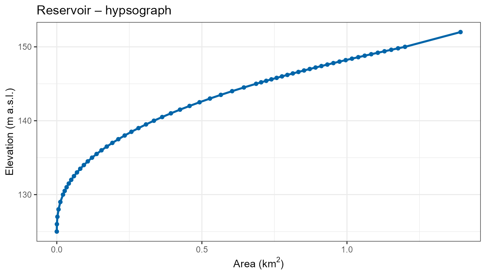
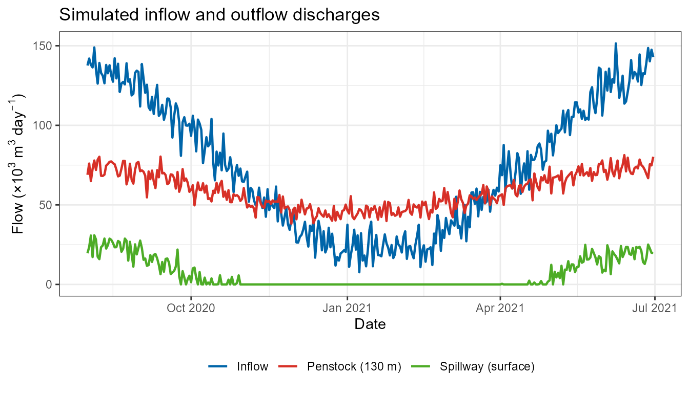
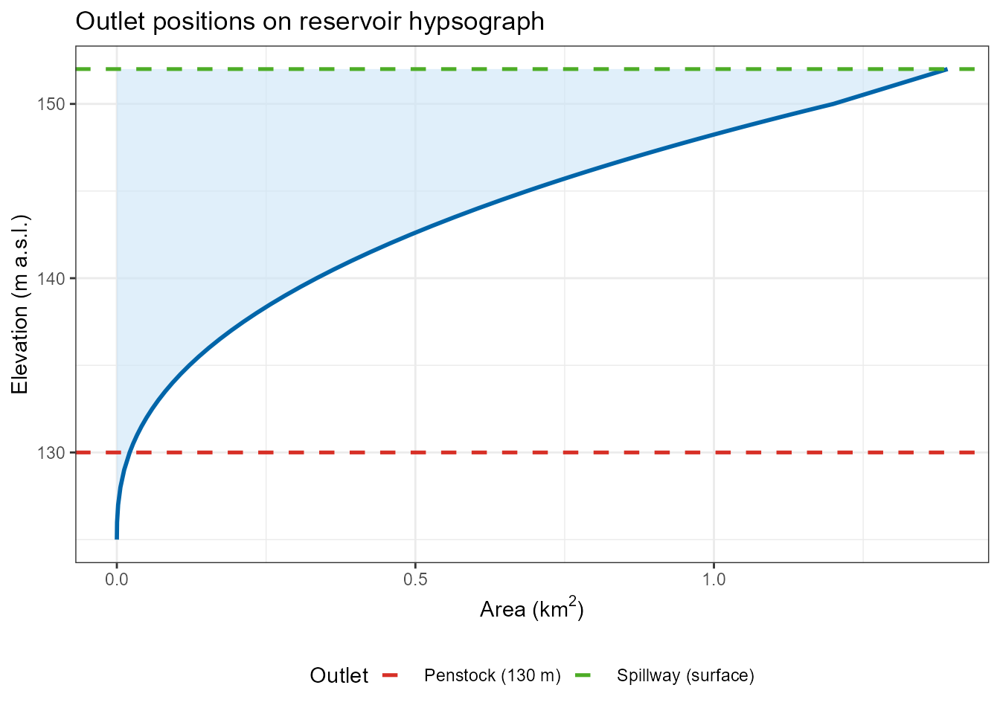
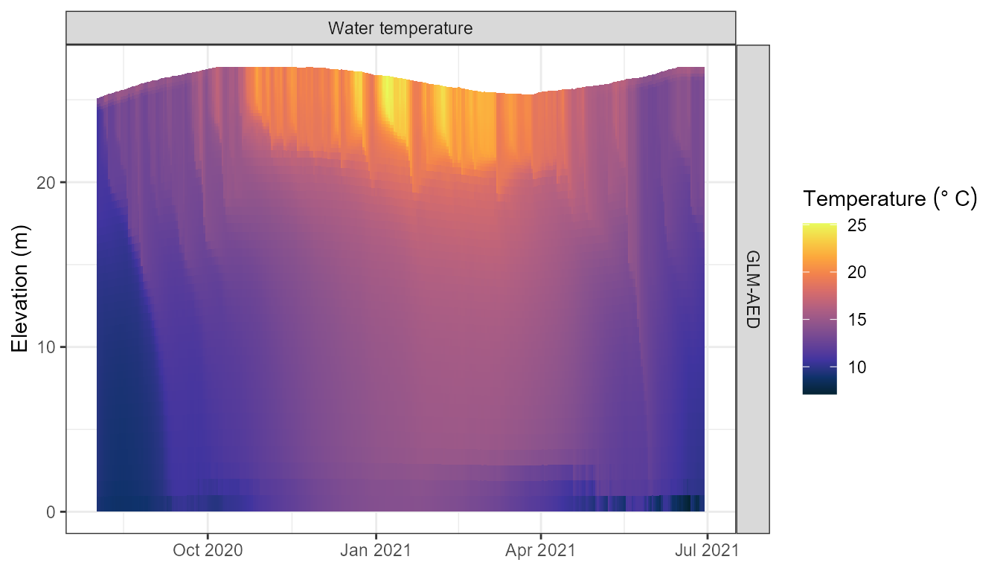

# Reservoir Simulation with Multiple Outlets

## Introduction

Reservoirs differ from natural lakes in several ways that are important
for hydrodynamic modelling:

1.  **Regulated water levels** – reservoir levels are managed through
    controlled releases rather than a natural outlet or seepage.
2.  **Multiple outlets at different depths** – a single reservoir can
    have:
    - A **surface spillway** that only activates when the reservoir is
      near full capacity.
    - A **penstock or bottom outlet** for daily operational releases.
    - A **mid-level selective withdrawal outlet** for water quality
      management (e.g. to avoid releasing cold, anoxic hypolimnetic
      water).
3.  **Thermal stratification management** – withdrawals from different
    depth layers affect the downstream temperature and water quality.

AEME supports all three major 1-D hydrodynamic models (DYRESM-CAEDYM,
GLM-AED, GOTM-WET) with multiple outlets at arbitrary elevations. This
vignette walks through setting up a reservoir ensemble model with two
outlets at different levels: a regulated **penstock** at depth and a
**surface spillway**.

## Setup

``` r

library(AEME)
library(ggplot2)
library(dplyr)
```

## Reservoir data

We will use a fictional reservoir, Reservoir, located in the North
Island of New Zealand. The reservoir has a full supply level of 150 m
above sea level and a maximum depth of 25 m.

``` r

lat   <- -37.80
lon   <- 176.00
elev  <- 150   # full supply level (m a.s.l.)
depth <- 25    # maximum depth (m)
area  <- 1.2e6 # surface area at full supply level (m²)

reservoir <- list(
  name      = "Reservoir",
  id        = "res001",
  latitude  = lat,
  longitude = lon,
  elevation = elev,
  depth     = depth,
  area      = area
)
```

## Simulation period

``` r

time <- list(
  start = "2020-08-01 00:00:00",
  stop  = "2021-06-30 00:00:00"
)
```

## Meteorological data

Meteorological data bundled with the AEME package (originally from Lake
Wainamu, North Island) is reused here to drive the reservoir simulation.

``` r

meteo_file <- system.file("extdata/lake/data/meteo.csv", package = "AEME")
met <- read.csv(meteo_file) |>
  mutate(Date = as.Date(Date))

head(met[, 1:5])
#>         Date MET_tmpair MET_tmpdew MET_wnduvu MET_wnduvv
#> 1 2019-01-01    19.5260    16.9129    3.19505    4.21590
#> 2 2019-01-02    19.5024    15.7136    4.59457    2.62703
#> 3 2019-01-03    20.1359    18.0478    6.17768    3.99858
#> 4 2019-01-04    19.1298    15.2155    2.56012    5.66473
#> 5 2019-01-05    19.1868    15.3679    3.77683    2.75966
#> 6 2019-01-06    20.2102    16.6466    4.83125    3.06035
```

## Hypsograph

The hypsograph describes the relationship between elevation and surface
area (and thus volume). Constructed reservoirs typically have a more
prismatic (box-like) shape compared to natural lakes. This is reflected
by a higher `volume_development` parameter (values \> 1.5 give a convex,
cylindrical shape; a value of 3 corresponds to a perfect cylinder).

``` r

hypsograph <- generate_hypsograph(
  max_depth          = depth,
  surface_area       = area,
  volume_development = 2.5,   # more prismatic than a natural lake
  elev               = elev,
  ext_elev           = 2      # extend 2 m above full supply level
)

head(hypsograph)
#>    elev depth    area
#> 1 152.0   2.0 1391324
#> 2 150.0   0.0 1200000
#> 3 149.8  -0.2 1176144
#> 4 149.6  -0.4 1152574
#> 5 149.4  -0.6 1129291
#> 6 149.2  -0.8 1106292
```

``` r

ggplot(hypsograph, aes(x = area / 1e6, y = elev)) +
  geom_line(linewidth = 1, colour = "#0065a9") +
  geom_point(size = 1.5, colour = "#0065a9") +
  labs(
    x     = expression("Area (km"^2 * ")"),
    y     = "Elevation (m a.s.l.)",
    title = "Reservoir – hypsograph"
  ) +
  theme_bw()
```



## Inflow data

We create a synthetic seasonal inflow time series typical of a New
Zealand catchment, with higher flows in winter (June–August) and lower
flows in summer. The inflow data frame must contain at minimum `Date`
and `HYD_flow` (m³ day⁻¹). Temperature (`HYD_temp`, °C) and salinity
(`CHM_salt`, PSU) columns are recommended.

``` r

set.seed(42)
sim_dates <- seq(as.Date("2020-01-01"), as.Date("2021-12-31"), by = "day")
doy       <- as.integer(format(sim_dates, "%j"))

# Seasonal signal: peak winter flow ~day 200 (NZ Southern Hemisphere winter)
inflow_flow <- pmax(5000,
  80000 + 60000 * cos(2 * pi * (doy - 200) / 365) +
    rnorm(length(sim_dates), mean = 0, sd = 8000))

# River temperature: coolest in winter, warmest in summer
inflow_temp <- pmax(4, 15 - 8 * cos(2 * pi * (doy - 15) / 365))

inflow_data <- data.frame(
  Date     = sim_dates,
  HYD_flow = inflow_flow,
  HYD_temp = inflow_temp,
  CHM_salt = 0
)

head(inflow_data[, 1:3])
#>         Date HYD_flow HYD_temp
#> 1 2020-01-01 33371.71 7.231200
#> 2 2020-01-02 17605.56 7.199484
#> 3 2020-01-03 24764.44 7.170079
#> 4 2020-01-04 26675.80 7.142995
#> 5 2020-01-05 24617.84 7.118239
#> 6 2020-01-06 20322.85 7.095819
```

## Multiple outlet data

The key feature demonstrated in this vignette is the configuration of
**two outlets at different elevations**:

| Outlet | Elevation | Description |
|----|----|----|
| **Penstock** | 130 m | Regulated bottom release; 20 m below full supply level |
| **Spillway** | -1 (surface) | Uncontrolled overflow at the water surface |

``` r

# Penstock: regulated base flow with small seasonal variation
penstock_flow <- pmax(0,
  60000 + 15000 * sin(2 * pi * (doy - 100) / 365) +
    rnorm(length(sim_dates), mean = 0, sd = 4000))

# Spillway: only active during the high-inflow winter period
spillway_flow <- pmax(0,
  25000 * cos(2 * pi * (doy - 200) / 365) +
    rnorm(length(sim_dates), mean = 0, sd = 5000))

penstock_data <- data.frame(
  Date     = sim_dates,
  HYD_flow = penstock_flow
)

spillway_data <- data.frame(
  Date     = sim_dates,
  HYD_flow = spillway_flow
)
```

Visualise the inflow and both outflows over the simulation period:

``` r

flows <- bind_rows(
  mutate(inflow_data[, c("Date", "HYD_flow")], stream = "Inflow"),
  mutate(penstock_data, stream = "Penstock (130 m)"),
  mutate(spillway_data, stream = "Spillway (surface)")
) |>
  filter(Date >= as.Date("2020-08-01"),
         Date <= as.Date("2021-06-30"))

ggplot(flows, aes(x = Date, y = HYD_flow / 1e3, colour = stream)) +
  geom_line(linewidth = 0.8) +
  scale_colour_manual(
    values = c("Inflow"             = "#0065a9",
               "Penstock (130 m)"   = "#d73027",
               "Spillway (surface)" = "#4dac26"),
    name = NULL
  ) +
  labs(
    x     = "Date",
    y     = expression("Flow (×10"^3 * " m"^3 * " day"^{-1} * ")"),
    title = "Simulated inflow and outflow discharges"
  ) +
  theme_bw() +
  theme(legend.position = "bottom")
```



The penstock provides a near-constant regulated release throughout the
year, while the spillway flows only during the high-flow winter months.

### Outlet positions on the hypsograph

It is important that each subsurface outlet elevation falls within the
elevation range of the hypsograph. Below we illustrate where the two
outlets sit relative to the reservoir hypsograph.

``` r

outlet_lines <- data.frame(
  elev  = c(130, max(hypsograph$elev)),
  label = c("Penstock (130 m)", "Spillway (surface)")
)

ggplot(hypsograph, aes(x = area / 1e6, y = elev)) +
  geom_ribbon(aes(xmin = 0, xmax = area / 1e6), fill = "#cce5f7", alpha = 0.6) +
  geom_line(linewidth = 1, colour = "#0065a9") +
  geom_hline(data = outlet_lines,
             aes(yintercept = elev, colour = label),
             linetype = "dashed", linewidth = 0.9) +
  scale_colour_manual(
    values = c("Penstock (130 m)"   = "#d73027",
               "Spillway (surface)" = "#4dac26"),
    name = "Outlet"
  ) +
  labs(
    x     = expression("Area (km"^2 * ")"),
    y     = "Elevation (m a.s.l.)",
    title = "Outlet positions on reservoir hypsograph"
  ) +
  theme_bw() +
  theme(legend.position = "bottom")
```



## Build the AEME object

We assemble the AEME object with
[`aeme_constructor()`](https://limnotrack.com/reference/aeme_constructor.md).
The `input` list must include at minimum the hypsograph, meteorological
data, and light extinction coefficient (`Kw`).

``` r

input <- list(
  init_depth = depth,
  hypsograph = hypsograph,
  meteo      = met,
  use_lw     = TRUE,
  Kw         = 0.5   # light extinction coefficient (m⁻¹)
)
```

``` r

aeme <- aeme_constructor(
  lake  = reservoir,
  time  = time,
  input = input
)
#> ! `time$time_step` is missing.
#> ℹ Defaulting to 3600 seconds (1 hour).
#> ! `time$spin_up` is missing.
#> ℹ Defaulting to 2 days spin-up for all models.
aeme
#> Warning: ! This <Aeme> object has no recorded AEME package version.
#> ℹ It was likely built with an older version of AEME (<0.4.0), or has never been
#>   built with `build_aeme()`. Consider rebuilding with `build_aeme()` to keep it
#>   in sync with the installed package (0.4.0).
#> This warning is displayed once per session.
#> 
#> ── AEME not yet built ──────────────────────────────────────────────────────────
#> 
#> ── Lake ──
#> 
#> Reservoir (ID: res001)
#> • Lat: -37.8; Lon: 176
#> • Elev: 150m; Depth: 25m; Area: 1200000 m2
#> 
#> ── Time ──
#> 
#> • Start: 2020-08-01 00:00:00; Stop: 2021-06-30 00:00:00; Time step: 3600 s;
#>   Output step: 86400 s
#> • Timezone: UTC (timestamps stored UTC)
#> • Spin up (days): GLM: 2; GOTM: 2; DYRESM: 2; Simstrat: 2
#> 
#> ── Configuration ──
#> 
#> • Model: glm_aed
#> • Path: D:/a/AEME/AEME/vignettes/articles
#> • Model controls: Present
#> • Use biogeochemical model: No
#> ┌ Model Configuration ─────────────────────────────────────────┐
#> │       Model              Physical         Biogeochemical     │
#> │ ---                                                          │
#> │       DY-CD               Absent              Absent         │
#> │      GLM-AED              Absent              Absent         │
#> │      GOTM-WET             Absent              Absent         │
#> │   SIMSTRAT-AED2           Absent              Absent         │
#> │    SIMSTRAT-AED           Absent              Absent         │
#> └──────────────────────────────────────────────────────────────┘
#> 
#> ── Observations ──
#> 
#> • Lake: Absent; Level: Absent
#> 
#> ── Input ──
#> 
#> • Initial profile: Absent; Initial depth: 25m
#> • Hypsograph: Present (n=62)
#> • Meteo: Present; Use longwave: TRUE; Kw: 0.5
#> 
#> ── Inflows ──
#> 
#> • Number of inflows: 0; Names: None
#> • Scaling factors: DY-CD: 1; GLM-AED: 1; GOTM-WET: 1; Simstrat-AED2: 1
#> 
#> ── Outflows ──
#> 
#> • Number of outflows: 0; Names: None; Elevations: N/A
#> • Scaling factors: DY-CD: 1; GLM-AED: 1; GOTM-WET: 1; Simstrat-AED2: 1
#> 
#> ── Water Balance ──
#> 
#> • Method: 2; Use: obs
#> • Modelled: Absent; Water balance: Absent
#> 
#> ── Parameters ──
#> 
#> • Number of parameters: 0
#> 
#> ── Output ──
#> 
#> • DY-CD: 0
#> • GLM-AED: 0
#> • GOTM-WET: 0
#> • SIMSTRAT-AED2: 0
#> • SIMSTRAT-AED: 0
#> • Variables: 0
#> None
```

## Add inflows

Inflows are added as a named list of data frames. The name (here
`"river"`) is used as the stream identifier in each model.

``` r

aeme <- add_inflows(aeme, data = list(river = inflow_data))
```

## Add multiple outflows

The [`add_outflows()`](https://limnotrack.com/reference/add_outflows.md)
function accepts:

- `data` – a named list of outflow data frames (each with at least
  `Date` and `HYD_flow` columns).
- `elevation` – a named list matching the names in `data`.  
  Use `elevation = -1` for a surface outlet; supply the elevation in
  metres above sea level (within the hypsograph range) for a subsurface
  outlet.

``` r

aeme <- add_outflows(
  aeme,
  data = list(
    penstock = penstock_data,
    spillway = spillway_data
  ),
  elevation = list(
    penstock = 130,   # 20 m below the full supply level
    spillway = -1     # surface outlet (overflow)
  )
)

# Inspect the outflows slot
outf <- outflows(aeme)
cat("Outflow names :", paste(names(outf$data),      collapse = ", "), "\n")
#> Outflow names : penstock, spillway
cat("Elevations    :",
    paste(names(outf$elevation),
          unlist(outf$elevation), sep = " = ", collapse = "; "), "\n")
#> Elevations    : penstock = 130; spillway = -1
```

Printing the `aeme` object now shows both outlets registered in the
outflows slot:

``` r

aeme
#> 
#> ── AEME not yet built ──────────────────────────────────────────────────────────
#> 
#> ── Lake ──
#> 
#> Reservoir (ID: res001)
#> • Lat: -37.8; Lon: 176
#> • Elev: 150m; Depth: 25m; Area: 1200000 m2
#> 
#> ── Time ──
#> 
#> • Start: 2020-08-01 00:00:00; Stop: 2021-06-30 00:00:00; Time step: 3600 s;
#>   Output step: 86400 s
#> • Timezone: UTC (timestamps stored UTC)
#> • Spin up (days): GLM: 2; GOTM: 2; DYRESM: 2; Simstrat: 2
#> 
#> ── Configuration ──
#> 
#> • Model: glm_aed
#> • Path: D:/a/AEME/AEME/vignettes/articles
#> • Model controls: Present
#> • Use biogeochemical model: No
#> ┌ Model Configuration ─────────────────────────────────────────┐
#> │       Model              Physical         Biogeochemical     │
#> │ ---                                                          │
#> │       DY-CD               Absent              Absent         │
#> │      GLM-AED              Absent              Absent         │
#> │      GOTM-WET             Absent              Absent         │
#> │   SIMSTRAT-AED2           Absent              Absent         │
#> │    SIMSTRAT-AED           Absent              Absent         │
#> └──────────────────────────────────────────────────────────────┘
#> 
#> ── Observations ──
#> 
#> • Lake: Absent; Level: Absent
#> 
#> ── Input ──
#> 
#> • Initial profile: Absent; Initial depth: 25m
#> • Hypsograph: Present (n=62)
#> • Meteo: Present; Use longwave: TRUE; Kw: 0.5
#> 
#> ── Inflows ──
#> 
#> • Number of inflows: 1; Names: river
#> • Scaling factors: DY-CD: 1; GLM-AED: 1; GOTM-WET: 1; Simstrat-AED2: 1
#> 
#> ── Outflows ──
#> 
#> • Number of outflows: 2; Names: penstock, spillway; Elevations: 130, -1
#> • Scaling factors: DY-CD: 1; GLM-AED: 1; GOTM-WET: 1; Simstrat-AED2: 1
#> 
#> ── Water Balance ──
#> 
#> • Method: 2; Use: obs
#> • Modelled: Absent; Water balance: Absent
#> 
#> ── Parameters ──
#> 
#> • Number of parameters: 0
#> 
#> ── Output ──
#> 
#> • DY-CD: 0
#> • GLM-AED: 0
#> • GOTM-WET: 0
#> • SIMSTRAT-AED2: 0
#> • SIMSTRAT-AED: 0
#> • Variables: 0
#> None
```

## Build model configurations

[`build_aeme()`](https://limnotrack.com/reference/build_aeme.md)
translates the AEME object into the configuration files required by each
model. Each model handles multiple outlets in its own way:

- **GLM-AED**: creates individual CSV boundary condition files
  (`bcs/outflow_<name>.csv`) and sets `num_outlet`, `outl_elvs`, and
  `outlet_type` in the GLM hydrodynamic nml (`glm3.nml` or `glm4.nml`).
  For finer control than
  [`add_outflows()`](https://limnotrack.com/reference/add_outflows.md)/[`build_aeme()`](https://limnotrack.com/reference/build_aeme.md)
  offer – adaptive or target-temperature outlets, submerged draws, weir
  geometry – edit the `&outflow` block directly with
  [`set_glm_outflow_config()`](https://limnotrack.com/reference/set_glm_outflow_config.md)
  after building.
- **GOTM-WET**: creates individual data files (`inputs/outf_<name>.dat`)
  and updates `gotm.yaml`.
- **DYRESM-CAEDYM**: writes all outlets into a single `.wdr` file with a
  column per outlet and the number of outlets in the header.

``` r

model_controls <- get_model_controls()
model          <- c("glm_aed")
path           <- file.path(tempdir(), "reservoir")
```

``` r

aeme <- build_aeme(
  aeme           = aeme,
  model          = model,
  model_controls = model_controls,
  path           = path,
  ext_elev       = 2,
  use_bgc        = FALSE,
  wb_method = 1
)
#> ✔ Created missing directory:
#>   C:\Users\RUNNER~1\AppData\Local\Temp\RtmpS2G2Tk\reservoir
#> 
#> 
#> ── Calculating water balance ──
#> 
#> 
#> 
#> Resolving water level
#> 
#>   ℹ No water level present. Using constant water level.
#> ℹ Estimating surface water temperature
#> 
#> ℹ Insufficient lake temperature observations (<10).
#> ℹ Using Stefan & Preud'homme (2007) method to estimate surface temperature.
#> ✔ Estimating surface water temperature [38ms]
#> 
#> 
#> 
#> ℹ No water balance correction applied (method = 1).
#> Warning in get_obs(aeme, var_sim = "HYD_temp"): No observations found for the
#> selected variable.
#> 
#> ── Building GLM-AED for lake reservoir ──
#> 
#> ℹ Copied in GLM nml file (glm4.nml)ℹ Copied in AED nml file and supporting filesℹ Copied in GLM plots nml file! Forcing sed_heat_model from 2 to 1: sed_heat_model = 2 needs an active WQ
#>   module and `use_bgc` is FALSE.
#> Warning: GLM ignores the AirPres met column in daily mode and uses the default 1013.25 hPa instead.
#> This warning is displayed once per session.
#> ✔ GLM nml validation completed - no issues detected.
```

## Run the models

``` r

aeme <- run_aeme(aeme = aeme, model = model, path = path)
#> ℹ Running models... (Have you tried parallelizing?) [2026-10-09 01:20:40]
#> ℹ GLM-AED running... [2026-10-09 01:20:40]
#> 
#>      Reading configuration from C:\Users\runneradmin\AppData\Local\Temp\RtmpS2G2Tk\reservoir/res001_reservoir/glm_aed/glm4.nml
#> No 'particles' config, assuming no particles
#>      NOTE: value for base_elev is no longer used; H[1] is assumed.
#>      VolAtCrest= 11165328.49350; MaxVol= 11165328.49350 (m3)
#>      No 'snowice' section, setting defaults & assuming no snowfall
#>      'sediment' section present, simulating sediment heating
#>      WARNING last zone height is less than maximum depth
#>         ... adding an extra zone to compensate
#>      DBG calling initialise_lake
#>      DBG entered initialise_lake
#>      DBG init_profiles: num_heights=0 num_depths=2 the_heights=0000000000000000 the_depths=00000235BDD9D890 lake_depth=25.000000
#>      WARNING: Initial profiles problem - expected 0 wd_init_vals entries but got 1
#>      DBG initialise_lake returned
#> 
#>     -------------------------------------------------------
#>     |  General Lake Model (GLM)   Version 4.0.0           |
#>     -------------------------------------------------------
#> 
#>      glm built using gcc version 16.1.0
#> 
#>      nDays= 200; timestep= 3600.000000 (s)
#>      Maximum lake depth is 27.000000
#>      Depth where flow will occur over the crest is 27.000000
#>        *sed_temp_mean[0] =   10.00000
#> Heat pump disabled (heat_pump_switch = 0)
#> Oxygenation disabled
#> 
#>      Wall clock start time :  Fri Oct  9 01:20:41 2026
#> 
#>      Simulation begins...
#>      Running day  2459061, 0.30% of days complete     Running day  2459062, 0.60% of days complete     Running day  2459063, 0.89% of days complete     Running day  2459064, 1.19% of days complete     Running day  2459065, 1.49% of days complete     Running day  2459066, 1.79% of days complete     Running day  2459067, 2.08% of days complete     Running day  2459068, 2.38% of days complete     Running day  2459069, 2.68% of days complete     Running day  2459070, 2.98% of days complete     Running day  2459071, 3.27% of days complete     Running day  2459072, 3.57% of days complete     Running day  2459073, 3.87% of days complete     Running day  2459074, 4.17% of days complete     Running day  2459075, 4.46% of days complete     Running day  2459076, 4.76% of days complete     Running day  2459077, 5.06% of days complete     Running day  2459078, 5.36% of days complete     Running day  2459079, 5.65% of days complete     Running day  2459080, 5.95% of days complete     Running day  2459081, 6.25% of days complete     Running day  2459082, 6.55% of days complete     Running day  2459083, 6.85% of days complete     Running day  2459084, 7.14% of days complete     Running day  2459085, 7.44% of days complete     Running day  2459086, 7.74% of days complete     Running day  2459087, 8.04% of days complete     Running day  2459088, 8.33% of days complete     Running day  2459089, 8.63% of days complete     Running day  2459090, 8.93% of days complete     Running day  2459091, 9.23% of days complete     Running day  2459092, 9.52% of days complete     Running day  2459093, 9.82% of days complete     Running day  2459094, 10.12% of days complete     Running day  2459095, 10.42% of days complete     Running day  2459096, 10.71% of days complete     Running day  2459097, 11.01% of days complete     Running day  2459098, 11.31% of days complete     Running day  2459099, 11.61% of days complete     Running day  2459100, 11.90% of days complete     Running day  2459101, 12.20% of days complete     Running day  2459102, 12.50% of days complete     Running day  2459103, 12.80% of days complete     Running day  2459104, 13.10% of days complete     Running day  2459105, 13.39% of days complete     Running day  2459106, 13.69% of days complete     Running day  2459107, 13.99% of days complete     Running day  2459108, 14.29% of days complete     Running day  2459109, 14.58% of days complete     Running day  2459110, 14.88% of days complete     Running day  2459111, 15.18% of days complete     Running day  2459112, 15.48% of days complete     Running day  2459113, 15.77% of days complete     Running day  2459114, 16.07% of days complete     Running day  2459115, 16.37% of days complete     Running day  2459116, 16.67% of days complete     Running day  2459117, 16.96% of days complete     Running day  2459118, 17.26% of days complete     Running day  2459119, 17.56% of days complete     Running day  2459120, 17.86% of days complete     Running day  2459121, 18.15% of days complete     Running day  2459122, 18.45% of days complete     Running day  2459123, 18.75% of days complete     Running day  2459124, 19.05% of days complete     Running day  2459125, 19.35% of days complete     Running day  2459126, 19.64% of days complete     Running day  2459127, 19.94% of days complete     Running day  2459128, 20.24% of days complete     Running day  2459129, 20.54% of days complete     Running day  2459130, 20.83% of days complete     Running day  2459131, 21.13% of days complete     Running day  2459132, 21.43% of days complete     Running day  2459133, 21.73% of days complete     Running day  2459134, 22.02% of days complete     Running day  2459135, 22.32% of days complete     Running day  2459136, 22.62% of days complete     Running day  2459137, 22.92% of days complete     Running day  2459138, 23.21% of days complete     Running day  2459139, 23.51% of days complete     Running day  2459140, 23.81% of days complete     Running day  2459141, 24.11% of days complete     Running day  2459142, 24.40% of days complete     Running day  2459143, 24.70% of days complete     Running day  2459144, 25.00% of days complete     Running day  2459145, 25.30% of days complete     Running day  2459146, 25.60% of days complete     Running day  2459147, 25.89% of days complete     Running day  2459148, 26.19% of days complete     Running day  2459149, 26.49% of days complete     Running day  2459150, 26.79% of days complete     Running day  2459151, 27.08% of days complete     Running day  2459152, 27.38% of days complete     Running day  2459153, 27.68% of days complete     Running day  2459154, 27.98% of days complete     Running day  2459155, 28.27% of days complete     Running day  2459156, 28.57% of days complete     Running day  2459157, 28.87% of days complete     Running day  2459158, 29.17% of days complete     Running day  2459159, 29.46% of days complete     Running day  2459160, 29.76% of days complete     Running day  2459161, 30.06% of days complete     Running day  2459162, 30.36% of days complete     Running day  2459163, 30.65% of days complete     Running day  2459164, 30.95% of days complete     Running day  2459165, 31.25% of days complete     Running day  2459166, 31.55% of days complete     Running day  2459167, 31.85% of days complete     Running day  2459168, 32.14% of days complete     Running day  2459169, 32.44% of days complete     Running day  2459170, 32.74% of days complete     Running day  2459171, 33.04% of days complete     Running day  2459172, 33.33% of days complete     Running day  2459173, 33.63% of days complete     Running day  2459174, 33.93% of days complete     Running day  2459175, 34.23% of days complete     Running day  2459176, 34.52% of days complete     Running day  2459177, 34.82% of days complete     Running day  2459178, 35.12% of days complete     Running day  2459179, 35.42% of days complete     Running day  2459180, 35.71% of days complete     Running day  2459181, 36.01% of days complete     Running day  2459182, 36.31% of days complete     Running day  2459183, 36.61% of days complete     Running day  2459184, 36.90% of days complete     Running day  2459185, 37.20% of days complete     Running day  2459186, 37.50% of days complete     Running day  2459187, 37.80% of days complete     Running day  2459188, 38.10% of days complete     Running day  2459189, 38.39% of days complete     Running day  2459190, 38.69% of days complete     Running day  2459191, 38.99% of days complete     Running day  2459192, 39.29% of days complete     Running day  2459193, 39.58% of days complete     Running day  2459194, 39.88% of days complete     Running day  2459195, 40.18% of days complete     Running day  2459196, 40.48% of days complete     Running day  2459197, 40.77% of days complete     Running day  2459198, 41.07% of days complete     Running day  2459199, 41.37% of days complete     Running day  2459200, 41.67% of days complete     Running day  2459201, 41.96% of days complete     Running day  2459202, 42.26% of days complete     Running day  2459203, 42.56% of days complete     Running day  2459204, 42.86% of days complete     Running day  2459205, 43.15% of days complete     Running day  2459206, 43.45% of days complete     Running day  2459207, 43.75% of days complete     Running day  2459208, 44.05% of days complete     Running day  2459209, 44.35% of days complete     Running day  2459210, 44.64% of days complete     Running day  2459211, 44.94% of days complete     Running day  2459212, 45.24% of days complete     Running day  2459213, 45.54% of days complete     Running day  2459214, 45.83% of days complete     Running day  2459215, 46.13% of days complete     Running day  2459216, 46.43% of days complete     Running day  2459217, 46.73% of days complete     Running day  2459218, 47.02% of days complete     Running day  2459219, 47.32% of days complete     Running day  2459220, 47.62% of days complete     Running day  2459221, 47.92% of days complete     Running day  2459222, 48.21% of days complete     Running day  2459223, 48.51% of days complete     Running day  2459224, 48.81% of days complete     Running day  2459225, 49.11% of days complete     Running day  2459226, 49.40% of days complete     Running day  2459227, 49.70% of days complete     Running day  2459228, 50.00% of days complete     Running day  2459229, 50.30% of days complete     Running day  2459230, 50.60% of days complete     Running day  2459231, 50.89% of days complete     Running day  2459232, 51.19% of days complete     Running day  2459233, 51.49% of days complete     Running day  2459234, 51.79% of days complete     Running day  2459235, 52.08% of days complete     Running day  2459236, 52.38% of days complete     Running day  2459237, 52.68% of days complete     Running day  2459238, 52.98% of days complete     Running day  2459239, 53.27% of days complete     Running day  2459240, 53.57% of days complete     Running day  2459241, 53.87% of days complete     Running day  2459242, 54.17% of days complete     Running day  2459243, 54.46% of days complete     Running day  2459244, 54.76% of days complete     Running day  2459245, 55.06% of days complete     Running day  2459246, 55.36% of days complete     Running day  2459247, 55.65% of days complete     Running day  2459248, 55.95% of days complete     Running day  2459249, 56.25% of days complete     Running day  2459250, 56.55% of days complete     Running day  2459251, 56.85% of days complete     Running day  2459252, 57.14% of days complete     Running day  2459253, 57.44% of days complete     Running day  2459254, 57.74% of days complete     Running day  2459255, 58.04% of days complete     Running day  2459256, 58.33% of days complete     Running day  2459257, 58.63% of days complete     Running day  2459258, 58.93% of days complete     Running day  2459259, 59.23% of days complete     Running day  2459260, 59.52% of days complete     Running day  2459261, 59.82% of days complete     Running day  2459262, 60.12% of days complete     Running day  2459263, 60.42% of days complete     Running day  2459264, 60.71% of days complete     Running day  2459265, 61.01% of days complete     Running day  2459266, 61.31% of days complete     Running day  2459267, 61.61% of days complete     Running day  2459268, 61.90% of days complete     Running day  2459269, 62.20% of days complete     Running day  2459270, 62.50% of days complete     Running day  2459271, 62.80% of days complete     Running day  2459272, 63.10% of days complete     Running day  2459273, 63.39% of days complete     Running day  2459274, 63.69% of days complete     Running day  2459275, 63.99% of days complete     Running day  2459276, 64.29% of days complete     Running day  2459277, 64.58% of days complete     Running day  2459278, 64.88% of days complete     Running day  2459279, 65.18% of days complete     Running day  2459280, 65.48% of days complete     Running day  2459281, 65.77% of days complete     Running day  2459282, 66.07% of days complete     Running day  2459283, 66.37% of days complete     Running day  2459284, 66.67% of days complete     Running day  2459285, 66.96% of days complete     Running day  2459286, 67.26% of days complete     Running day  2459287, 67.56% of days complete     Running day  2459288, 67.86% of days complete     Running day  2459289, 68.15% of days complete     Running day  2459290, 68.45% of days complete     Running day  2459291, 68.75% of days complete     Running day  2459292, 69.05% of days complete     Running day  2459293, 69.35% of days complete     Running day  2459294, 69.64% of days complete     Running day  2459295, 69.94% of days complete     Running day  2459296, 70.24% of days complete     Running day  2459297, 70.54% of days complete     Running day  2459298, 70.83% of days complete     Running day  2459299, 71.13% of days complete     Running day  2459300, 71.43% of days complete     Running day  2459301, 71.73% of days complete     Running day  2459302, 72.02% of days complete     Running day  2459303, 72.32% of days complete     Running day  2459304, 72.62% of days complete     Running day  2459305, 72.92% of days complete     Running day  2459306, 73.21% of days complete     Running day  2459307, 73.51% of days complete     Running day  2459308, 73.81% of days complete     Running day  2459309, 74.11% of days complete     Running day  2459310, 74.40% of days complete     Running day  2459311, 74.70% of days complete     Running day  2459312, 75.00% of days complete     Running day  2459313, 75.30% of days complete     Running day  2459314, 75.60% of days complete     Running day  2459315, 75.89% of days complete     Running day  2459316, 76.19% of days complete     Running day  2459317, 76.49% of days complete     Running day  2459318, 76.79% of days complete     Running day  2459319, 77.08% of days complete     Running day  2459320, 77.38% of days complete     Running day  2459321, 77.68% of days complete     Running day  2459322, 77.98% of days complete     Running day  2459323, 78.27% of days complete     Running day  2459324, 78.57% of days complete     Running day  2459325, 78.87% of days complete     Running day  2459326, 79.17% of days complete     Running day  2459327, 79.46% of days complete     Running day  2459328, 79.76% of days complete     Running day  2459329, 80.06% of days complete     Running day  2459330, 80.36% of days complete     Running day  2459331, 80.65% of days complete     Running day  2459332, 80.95% of days complete     Running day  2459333, 81.25% of days complete     Running day  2459334, 81.55% of days complete     Running day  2459335, 81.85% of days complete     Running day  2459336, 82.14% of days complete     Running day  2459337, 82.44% of days complete     Running day  2459338, 82.74% of days complete     Running day  2459339, 83.04% of days complete     Running day  2459340, 83.33% of days complete     Running day  2459341, 83.63% of days complete     Running day  2459342, 83.93% of days complete     Running day  2459343, 84.23% of days complete     Running day  2459344, 84.52% of days complete     Running day  2459345, 84.82% of days complete     Running day  2459346, 85.12% of days complete     Running day  2459347, 85.42% of days complete     Running day  2459348, 85.71% of days complete     Running day  2459349, 86.01% of days complete     Running day  2459350, 86.31% of days complete     Running day  2459351, 86.61% of days complete     Running day  2459352, 86.90% of days complete     Running day  2459353, 87.20% of days complete     Running day  2459354, 87.50% of days complete     Running day  2459355, 87.80% of days complete     Running day  2459356, 88.10% of days complete     Running day  2459357, 88.39% of days complete     Running day  2459358, 88.69% of days complete     Running day  2459359, 88.99% of days complete     Running day  2459360, 89.29% of days complete     Running day  2459361, 89.58% of days complete     Running day  2459362, 89.88% of days complete     Running day  2459363, 90.18% of days complete     Running day  2459364, 90.48% of days complete     Running day  2459365, 90.77% of days complete     Running day  2459366, 91.07% of days complete     Running day  2459367, 91.37% of days complete     Running day  2459368, 91.67% of days complete     Running day  2459369, 91.96% of days complete     Running day  2459370, 92.26% of days complete     Running day  2459371, 92.56% of days complete     Running day  2459372, 92.86% of days complete     Running day  2459373, 93.15% of days complete     Running day  2459374, 93.45% of days complete     Running day  2459375, 93.75% of days complete     Running day  2459376, 94.05% of days complete     Running day  2459377, 94.35% of days complete     Running day  2459378, 94.64% of days complete     Running day  2459379, 94.94% of days complete     Running day  2459380, 95.24% of days complete     Running day  2459381, 95.54% of days complete     Running day  2459382, 95.83% of days complete     Running day  2459383, 96.13% of days complete     Running day  2459384, 96.43% of days complete     Running day  2459385, 96.73% of days complete     Running day  2459386, 97.02% of days complete     Running day  2459387, 97.32% of days complete     Running day  2459388, 97.62% of days complete     Running day  2459389, 97.92% of days complete     Running day  2459390, 98.21% of days complete     Running day  2459391, 98.51% of days complete     Running day  2459392, 98.81% of days complete     Running day  2459393, 99.11% of days complete     Running day  2459394, 99.40% of days complete     Running day  2459395, 99.70% of days complete
#> 
#>      Wall clock finish time : Fri Oct  9 01:20:41 2026
#>      Wall clock runtime was 0 seconds : 00:00:00 [hh:mm:ss]
#> 
#>     Model Run Complete
#>     -------------------------------------------------------
#> ✔ GLM-AED running... [2026-10-09 01:20:41] [954ms]
#> 
#> ✔ Model run complete! [2026-10-09 01:20:41]
```

## View the output

``` r

plot_output(aeme = aeme)
#> Warning: Removed 124 rows containing missing values or values outside the scale range
#> (`geom_col()`).
```



## Summary

This vignette has shown how to configure AEME for a reservoir with
multiple outlets at different elevations. The key steps are:

1.  **Define the reservoir geometry** using a more prismatic hypsograph
    (`volume_development` \> 1.5) appropriate for a constructed
    reservoir.
2.  **Create time series** for each inflow and each outlet
    independently.
3.  **Register multiple outlets** with
    [`add_outflows()`](https://limnotrack.com/reference/add_outflows.md),
    providing a named `data` list and a matching named `elevation` list.
    Use `elevation = -1` for a surface outlet; provide the actual
    elevation (m a.s.l.) for subsurface outlets, ensuring values fall
    within the hypsograph elevation range.
4.  **Build and run** the model ensemble with
    [`build_aeme()`](https://limnotrack.com/reference/build_aeme.md) and
    [`run_aeme()`](https://limnotrack.com/reference/run_aeme.md).

Currently only one of the three hydrodynamic models, GLM-AED, supported
by AEME (DYRESM-CAEDYM, GLM-AED, and GOTM-WET) can handle multiple
outlets and produce separate outlet files during the build step,
allowing each outlet’s contribution to be tracked independently.
