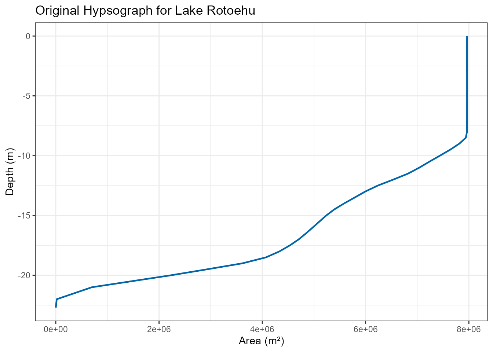
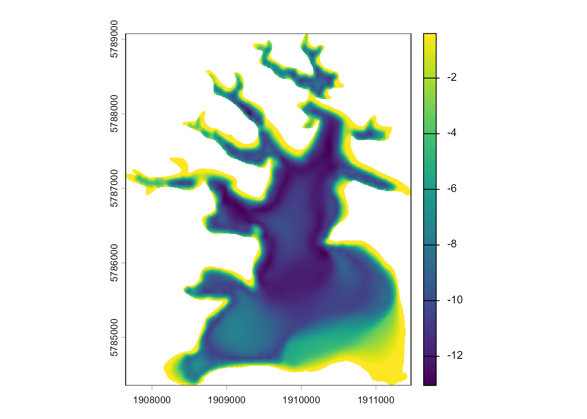
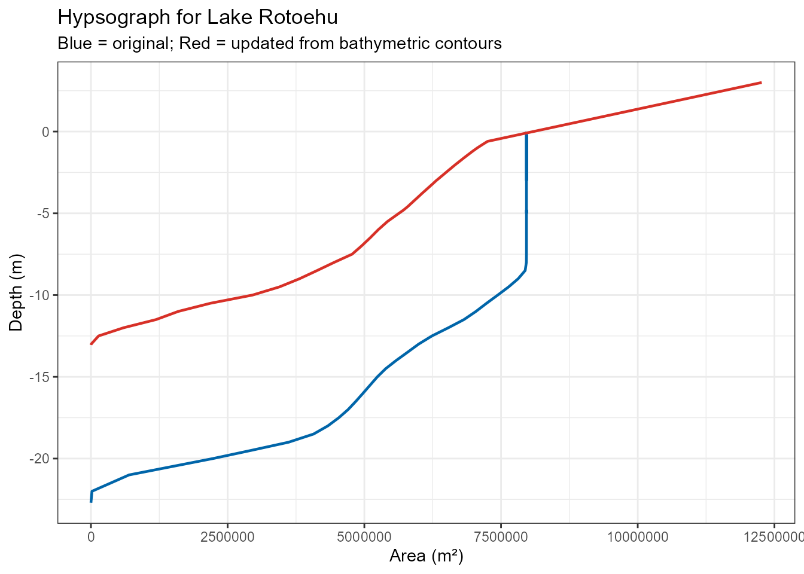
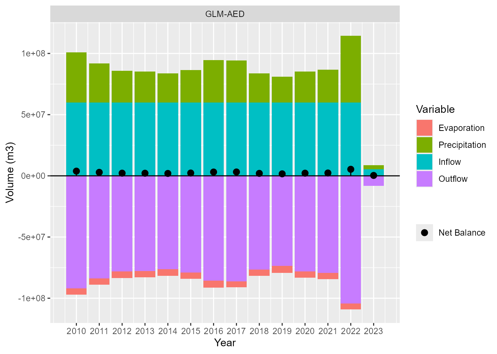
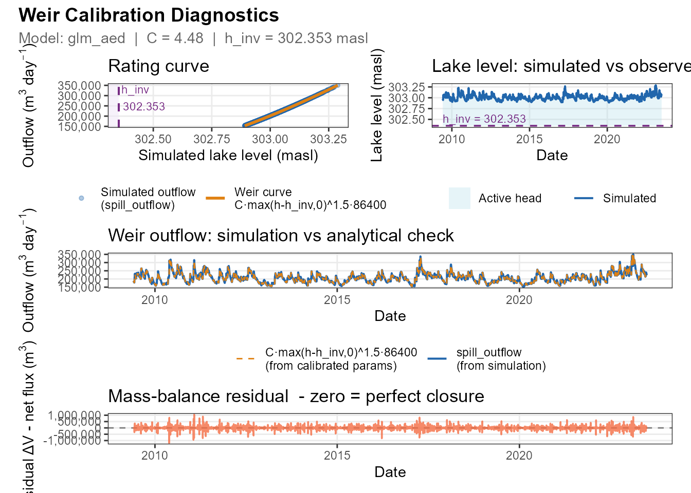
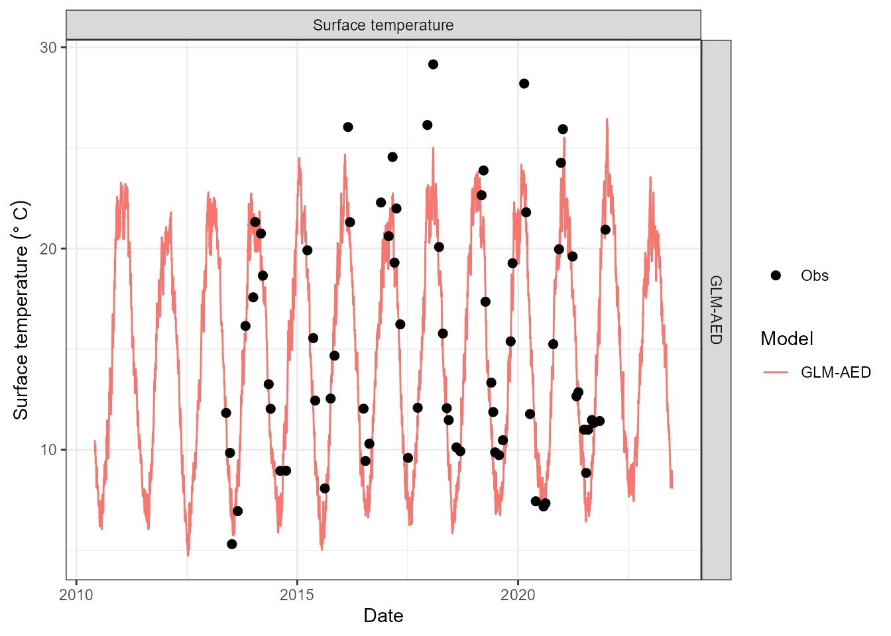
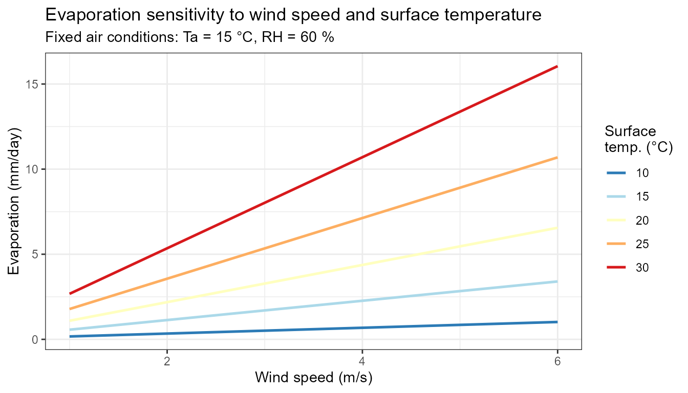
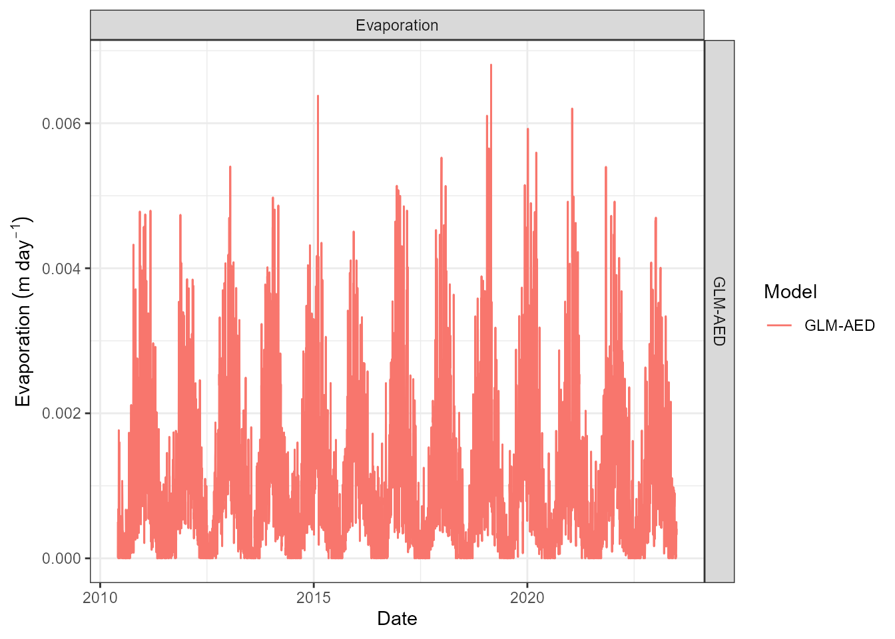
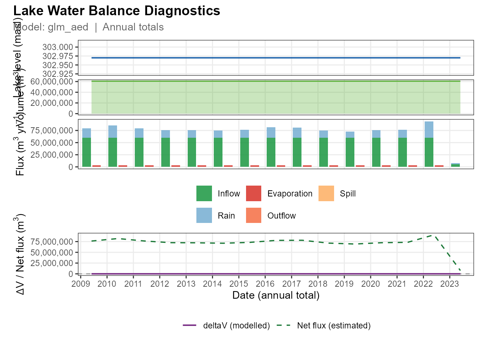
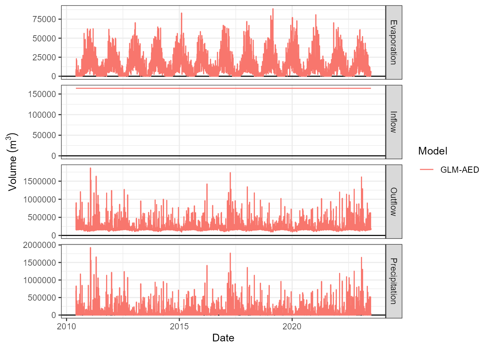

# Lake Rotoehu Water Balance and Evaporation

## Introduction

This article demonstrates how to work with Lake Rotoehu (ID: 40188) to:

1.  Set up an AEME model using data from the `aemetools` package
2.  Understand the three water balance approaches and when to use each
3.  Understand how lake surface temperature is estimated (and the role
    of observations)
4.  Learn how evaporation is estimated from bulk aerodynamic theory
5.  Extract and visualise evaporation output

Lake Rotoehu is a small, shallow lake in the Rotorua region of New
Zealand’s North Island (~8 km² surface area, ~13 m maximum depth). It is
eutrophic, thermally stratifies in summer, and has no permanent gauged
inflow — making a water-balance approach particularly useful for
constraining its hydrology.

## Setup

``` r

library(AEME)
library(aemetools)
library(bathytools)
library(ggplot2)
library(dplyr)
library(tmap)

tmap_mode("view")
```

## Load Lake Rotoehu data

The `aemetools` package provides access to pre-configured AEME objects
for New Zealand lakes via the Limnotrack API. Use the lake’s numeric ID
to retrieve it:

``` r

aeme <- aemetools::get_aeme(id = 40188)
```

View Aeme object:

``` r

aeme
#> 
#> ── AEME ────────────────────────────────────────────────────────────────────────
#> 
#> ── Lake ──
#> 
#> Rotoehu (ID: LID40188)
#> • Lat: -38.01; Lon: 176.53
#> • Elev: 302.97m; Depth: 22.7m; Area: 7965248 m2
#> 
#> ── Time ──
#> 
#> • Start: 2010-06-01; Stop: 2023-06-30; Time step: 3600
#> • Spin up (days): GLM: 365; GOTM: 365; DYRESM: 365
#> 
#> ── Configuration ──
#> 
#> • Model: glm_aed and gotm_wet
#> • Path: Not set
#> • Model controls: Present
#> • Use biogeochemical model:
#> ┌ Model Configuration ─────────────────────────────────────────┐
#> │       Model              Physical         Biogeochemical     │
#> │ ---                                                          │
#> │       DY-CD               Absent              Absent         │
#> │      GLM-AED             Present              Absent         │
#> │      GOTM-WET            Present              Absent         │
#> └──────────────────────────────────────────────────────────────┘
#> 
#> ── Observations ──
#> 
#> • Lake: Present; Level: Absent
#> 
#> ── Input ──
#> 
#> • Initial profile: Present; Initial depth: 22.698m
#> • Hypsograph: Present (n=64)
#> • Meteo: Present; Use longwave: TRUE; Kw: 0.586206896551724
#> 
#> ── Inflows ──
#> 
#> • Number of inflows: 3; Names: NZS4079511, NZS4081174, lumped
#> • Scaling factors: DY-CD: 1; GLM-AED: 1; GOTM-WET: 1
#> 
#> ── Outflows ──
#> 
#> • Number of outflows: 1; Names: wbal; Elevations:
#> • Scaling factors: DY-CD: 1; GLM-AED: 1; GOTM-WET: 1
#> 
#> ── Water Balance ──
#> 
#> • Method: 2; Use: obs
#> • Modelled: Absent; Water balance: Present
#> 
#> ── Parameters ──
#> 
#> • Number of parameters: 0
#> 
#> ── Output ──
#> 
#> • DY-CD: 1
#> • GLM-AED: 1
#> • GOTM-WET: 1
#> • Variables: 63
#> Water temperature, Thermocline depth, Dissolved oxygen, Total chlorophyll a,
#> Total nitrogen, Total phosphorus, Water level, Volume, Change in volume,
#> Surface area, ... and 53 more
```

## View and update the hypsograph

The hypsograph encodes the depth–area relationship and is central to all
volume and evaporation calculations. Let’s inspect what was loaded:

``` r

hyps <- get_hypsograph(aeme)

orig_hyps <- hyps |>
dplyr::filter(depth <= 0)

ggplot(orig_hyps, aes(x = area, y = depth)) +
  geom_line(colour = "#0065a9", linewidth = 0.8) +
  labs(x = "Area (m²)", y = "Depth (m)",
       title = "Original Hypsograph for Lake Rotoehu") +
  theme_bw()
```



This does not look right — the max depth is too deep and there is about
8m from the surface to the first contour. We can improve this by
building a new hypsograph from bathymetric contours available on the
Limnotrack API:

``` r

# Lake Rotoehy lake id is 40188
shoreline <- aemetools::get_lake_shape(id = 40188) # lake shoreline shapefile

# Get lake depth contours
contours  <- aemetools::lt_fetch(
  "lake_contours",
  filter = aemetools::lt_filter(lernzmp_id == "LID40188")
) |>
  dplyr::mutate(depth = depth_m)
```

``` r

tm_shape(contours) +
  tm_lines(col = "depth", scale = tm_scale("-brewer.blues")) +
  tm_shape(shoreline) +
  tm_borders(col = "black") +
  tm_title("Lake Rotoehu Depth Contours")
```

Use the `bathytools` package to rasterise the contours and compute the
updated hypsograph:

``` r

bathy_raster <- rasterise_bathy(shoreline = shoreline,
                                contours  = contours,
                                res = 8, crs = 2193)
#> ℹ Generating depth points for interpolation
#> Generating depth points... [2026-06-18 03:29:58]
#> Warning: large number of points for interpolation (76516)
#> Finished! [2026-06-18 03:30:04]
#> ✔ Generating depth points for interpolation [5.7s]
#> 
#> ℹ Interpolating depth points to raster
#> Adjusting depths >= 0 to  -0.4 m
#> Finished! [2026-06-18 03:30:15]
```



    #> ✔ Interpolating depth points to raster [11.6s]
    #> 

``` r

lake_elev <- max(contours$elevation_m)
upd_hyps  <- bathy_to_hypso(bathy_raster) |>
  dplyr::mutate(elev = lake_elev + depth) |> 
  extrap_hyps(z_range = 0.05, ext_elev = 3)

ggplot(orig_hyps, aes(x = area, y = depth)) +
  geom_line(colour = "#0065a9", linewidth = 0.8) +
  geom_line(data = upd_hyps, aes(x = area, y = depth),
            colour = "#d73027", linewidth = 0.8) +
  labs(x = "Area (m²)", y = "Depth (m)",
       title = "Hypsograph for Lake Rotoehu",
       subtitle = "Blue = original; Red = updated from bathymetric contours") +
  theme_bw()
```



``` r

aeme <- add_hypsograph(aeme, hypsograph = upd_hyps)
```

## Water balance approaches

[`build_aeme()`](https://limnotrack.com/reference/build_aeme.md)
supports three water balance methods, selected via `wb_method`. The
right choice depends on what forcing data and observations you have
available. The table below summarises when to use each:

| Method | `wb_method` | Requires | When to use |
|----|----|----|----|
| Closed lake | 1 | Meteorology only | No inflow/outflow data; short-term simulations; sensitivity testing |
| Outflow fitted | 2 | Met + inflow data | Fit a realistic outflow rating curve using inflow data; use observed lake level if available; |
| Inflow + outflow residual | 3 | Met + obs. levels + some inflow data | Gauged or estimated inflows; want to account for unexplained storage changes e.g. groundwater |

### Method 1 — Closed lake (no inflows or outflows)

The simplest assumption is that the lake is hydrologically isolated:
volume changes are driven only by direct precipitation on the lake
surface and evaporation from it.

``` math
\Delta V_t = P_t \cdot A_t - E_t \cdot A_t
```

where $`\Delta V_t`$ is the change in lake volume (m³/day), $`P_t`$ is
precipitation depth (m/day), $`E_t`$ is evaporation depth (m/day), and
$`A_t`$ is the lake surface area (m²) at time $`t`$.

**When to use:** Good for initial exploration, for lakes without inflow
gauges, or when you only want to estimate the evaporation component. It
will under-represent evaporation if significant inflows keep the lake
warmer than it would otherwise be, or over-predict it if the lake gains
volume from groundwater.

``` r

model <- "glm_aed"
path1 <- file.path(tempdir(), "rotoehu_wb1")

# Build and run model with Method 1 (closed lake)
aeme_wb1 <- aeme |>
  build_aeme(model = model, path = path1, wb_method = 1) |>
  run_aeme(model = model, path = path1)

# Plot water level
aeme_wb1 |> 
  plot_wbal_annual()
```



When using the GLM-AED model, there is a default “spillway” if the lake
level exceeds the maximum elevation in the hypsograph. To improve the
closed-lake assumption, it would be useful to merge the bathymetry with
the surrounding DEM to get an extended hypsograph. See this [bathytools
article for a
example](https://limnotrack.com/bathytools/articles/merge-bathy-dem.html).

### Method 2 — Outflow fitted from observed water levels

When lake-level observations are available, AEME can optimise a simple
weir-type outflow rating curve so that the simulated water level matches
observations. The outflow equation is:

``` math
O_t = C \cdot \max\!\left(h_t - h_{inv},\ 0\right)^{1.5} \times 86400
```

where $`O_t`$ is outflow (m³/day), $`h_t`$ is the simulated water level
(m above sea level), $`h_{inv}`$ is the *inversion height* (m) — the
level below which outflow is zero — and $`C`$ is an outflow coefficient.
Both $`C`$ and $`h_{inv}`$ are fitted by minimising the RMSE between
simulated and observed water levels using
[`estimate_lake_wlev()`](https://limnotrack.com/reference/estimate_lake_wlev.md).

If lake-level observations are not available, the same method can be
used to fit the outflow parameters against a constant lake level at the
initial lake depth.

Once calibrated, the fitted parameters can be retrieved with
[`get_wbal_param()`](https://limnotrack.com/reference/get_wbal_param.md)
and transferred to a different (e.g. ungauged) period with
[`set_wbal_param()`](https://limnotrack.com/reference/set_wbal_param.md).

**When to use:** The preferred method when a water-level gauge record
exists. It simultaneously constrains the water balance *and* provides a
physically meaningful outflow estimate. If the lake has a well-defined
spillway or outlet, the fitted $`h_{inv}`$ often corresponds closely to
the known sill elevation.

``` r

path2 <- file.path(tempdir(), "rotoehu_wb2")

aeme_wb2 <- aeme |>
  build_aeme(model = model, path = path2, wb_method = 2) |>
  run_aeme()

# Plot weir calibration results
aeme_wb2 |> 
  plot_weir_calibration()
```



### Method 3 — Inflow and outflow as residuals

When both inflow and water-level observations are available (or when
inflows have been estimated), Method 3 closes the water balance by
partitioning the daily residual into an effective inflow or a spill
outflow:

``` math
\text{residual}_t = \Delta V_t - \left(Q_{in,t} + P_t A_t - E_t A_t - O_t - S_t\right)
```

A positive residual (the lake gains more volume than the known fluxes
explain) is attributed to an unexplained inflow; a negative residual is
attributed to additional spill outflow.

**When to use:** When gauged inflows are available but the water balance
still does not close — for example when significant groundwater exchange
or ungauged catchment runoff is suspected. Comparing the residual time
series across seasons or flow events can help identify the likely source
of the discrepancy.

``` r

path3 <- file.path(tempdir(), "rotoehu_wb3")

aeme_wb3 <- aeme |>
  build_aeme(model = model, path = path3, wb_method = 3) |>
  run_aeme()
#> Warning: ! No model output loaded as all model runs failed.
```

## Lake surface temperature

Evaporation depends strongly on the vapour pressure deficit between the
water surface and the overlying air, which in turn depends on the lake
surface temperature ($`T_s`$). AEME therefore estimates $`T_s`$ before
computing evaporation.

### Energy-balance model (`estimate_surface_temperature`)

The exported function
[`estimate_surface_temperature()`](https://limnotrack.com/reference/estimate_surface_temperature.md)
integrates an energy-balance model forward in daily time steps:

``` math
\frac{dT_s}{dt} = \frac{Q_{sw} + Q_{lw} + Q_h + Q_e}{\rho_w\, c_p\, h_{mix}}
```

| Term | Formula | Description |
|----|----|----|
| $`Q_{sw}`$ | $`(1 - \alpha)\,SW_\downarrow`$ | Net shortwave radiation (W/m²) |
| $`Q_{lw}`$ | $`LW_\downarrow - \sigma\,(T_s + 273.15)^4`$ | Net longwave radiation (W/m²) |
| $`Q_h`$ | $`\rho_a\, c_{p,a}\, C_h\, U\,(T_a - T_s)`$ | Sensible heat flux (W/m²) |
| $`Q_e`$ | $`\rho_a\, L_v\, C_e\, U\,(e_a - e_s) / P`$ | Latent heat flux (W/m²) |
| $`h_{mix}`$ | $`\max(2,\ f_{mix} \times d)`$ | Active mixing depth (m) |

Default parameters: shortwave albedo $`\alpha = 0.07`$; bulk
sensible/latent heat coefficients $`C_h = C_e = 1.3 \times 10^{-3}`$;
mixing fraction $`f_{mix} = 0.2`$; relaxation timescale
$`\tau_{relax} = 3\,\text{days}`$.

### Role of observed surface temperatures

When measured surface temperatures (`HYD_temp`) are present in the lake
observations, the predicted temperature at each observed timestep is
nudged toward the observation using a relaxation scheme:

``` math
T_s(t+1) = T_s^{pred} + \frac{\Delta t}{\tau_{relax}}\left(T_s^{obs} - T_s^{pred}\right)
```

The behaviour depends on observation frequency:

- **Frequent observations (weekly or better):** the simulated surface
  temperature closely tracks the lake. Evaporation is
  observation-constrained and reflects the actual thermal state.
- **Sparse observations (monthly or seasonal):** the model fills gaps
  using the energy balance, relaxing toward each observation as it
  becomes available. Evaporation estimates between observations carry
  more uncertainty.
- **No observations:** the energy balance runs freely from an
  air-temperature seed. A fall-back linear regression
  $`T_s = 5 + 0.75\,\overline{T}_{air,5\text{d}}`$ (Stefan &
  Preud’homme, 1993) provides the initial condition.

You can inspect the estimated surface temperature as a model output
variable:

``` r

plot_output(aeme_wb1, model = model, var_sim = "HYD_surft")
```



## How AEME estimates evaporation

AEME uses a **bulk aerodynamic latent heat** approach. Three
now-exported functions implement the physics step by step, making it
easy to inspect or reproduce each calculation independently.

### Step 1 — Saturation vapour pressure

The saturation vapour pressure at the water surface is computed from the
Magnus formula:

``` math
e_s(T_s) = \exp\!\left(2.3026 \times \left(\frac{7.5\,T_s}{T_s + 237.3} + 0.7858\right)\right) \quad \text{[hPa]}
```

``` r

Ts_vals <- seq(0, 30, by = 5)
es_vals <- sat_vapour_pressure(Ts_vals)
data.frame(Ts_degC = Ts_vals, es_hPa = round(es_vals, 2))
#>   Ts_degC es_hPa
#> 1       0   6.11
#> 2       5   8.72
#> 3      10  12.28
#> 4      15  17.05
#> 5      20  23.38
#> 6      25  31.67
#> 7      30  42.42
```

The exponential increase with temperature is why warm lakes evaporate
substantially more than cold ones even at the same wind speed.

### Step 2 — Latent heat flux

The latent heat flux (W/m²) is computed using the bulk aerodynamic
formula. Only evaporative heat loss is retained (the result is capped at
zero so that condensation does not add water to the lake):

``` math
Q_{lh} = \min\!\left(\frac{0.622}{P}\,C_e\,\rho_{air}\,L_v\,U\,(e_a - e_s),\ 0\right)
```

| Symbol | Default | Description |
|----|----|----|
| $`P`$ | 981.9 hPa | Atmospheric pressure |
| $`C_e`$ | $`1.3 \times 10^{-3}`$ | Bulk transfer coefficient (Dalton number) |
| $`\rho_{air}`$ | 1.168 kg/m³ | Air density |
| $`L_v`$ | 2,453,000 J/kg | Latent heat of vaporisation |
| $`U`$ | — | Wind speed (m/s) |
| $`e_a`$ | — | Air vapour pressure (hPa) |
| $`e_s`$ | — | Saturation vapour pressure at the surface (hPa) |

The vapour pressure deficit $`(e_a - e_s)`$ drives evaporation. A warm
surface raises $`e_s`$, increasing the deficit and the evaporative flux.
High winds increase turbulent moisture transport.

``` r

# Example: 20 °C lake, 15 °C air, ~60 % relative humidity, 3 m/s wind
Ts <- 20;  Ta <- 15;  U <- 3
ea <- 0.60 * sat_vapour_pressure(Ta)   # ~60 % RH
Qlh <- latent_heat_flux(Ts = Ts, wndspd = U, prvapr = ea)
cat(sprintf("Latent heat flux: %.1f W/m²\n", Qlh))
#> Latent heat flux: -93.1 W/m²
```

### Step 3 — Convert to evaporation depth

The heat flux is converted to an evaporation *rate* in metres per day:

``` math
E = \frac{Q_{lh}}{L_v\,\rho_w} \times 86400 \quad \text{[m/day]}
```

``` r

E_m_day <- flux_to_evap(Qlh)
cat(sprintf("Evaporation rate: %.4f m/day  (%.1f mm/day)\n",
            E_m_day, E_m_day * 1000))
#> Evaporation rate: -0.0033 m/day  (-3.3 mm/day)
```

### Sensitivity to wind speed and surface temperature

The combined influence of wind speed and lake surface temperature
illustrates why both variables must be well constrained:

``` r

grid <- expand.grid(
  Ts = seq(10, 30, by = 5),
  U  = seq(1, 6,  by = 1)
) |>
  dplyr::mutate(
    ea   = 0.60 * sat_vapour_pressure(15),   # fixed air conditions
    Qlh  = latent_heat_flux(Ts = Ts, wndspd = U, prvapr = ea),
    E_mm = abs(flux_to_evap(Qlh)) * 1000
  )

ggplot(grid, aes(x = U, y = E_mm, colour = factor(Ts))) +
  geom_line(linewidth = 0.9) +
  scale_colour_brewer(palette = "RdYlBu", direction = -1) +
  labs(x = "Wind speed (m/s)",
       y = "Evaporation (mm/day)",
       colour = "Surface\ntemp. (°C)",
       title = "Evaporation sensitivity to wind speed and surface temperature",
       subtitle = "Fixed air conditions: Ta = 15 °C, RH = 60 %") +
  theme_bw()
```



## Extract and visualise model evaporation output

After running the model, evaporation is accessible as a standard output
variable. The correct variable names are:

| Variable     | Description                             |
|--------------|-----------------------------------------|
| `LKE_evprte` | Evaporation rate (m/day)                |
| `LKE_evpvol` | Evaporation volume (m³/day)             |
| `LKE_evpflx` | Evaporation flux (kg/m²/s)              |
| `HYD_surft`  | Simulated lake surface temperature (°C) |

``` r

plot_output(aeme_wb1, model = model, var_sim = "LKE_evprte")
```



The
[`plot_est_wbal()`](https://limnotrack.com/reference/plot_est_wbal.md)
function produces a four-panel diagnostic showing lake level, volume,
all daily flux components (inputs on the left bar, losses on the right),
and the residual between modelled $`\Delta V`$ and the estimated net
flux:

``` r

plot_est_wbal(aeme_wb1, model = model)
```



### Annual evaporation summary

``` r

ann_evap <- aeme_wb1 |>
  get_var(model = model, var_sim = "LKE_evprte") |>
  dplyr::mutate(year = lubridate::year(Date)) |>
  dplyr::group_by(year) |>
  dplyr::summarise(ann_evap_mm = sum(value, na.rm = TRUE) * 1000,
                   .groups = "drop")
ann_evap
#> # A tibble: 14 × 2
#>     year ann_evap_mm
#>    <dbl>       <dbl>
#>  1  2010        188.
#>  2  2011        398.
#>  3  2012        398.
#>  4  2013        412.
#>  5  2014        423.
#>  6  2015        414.
#>  7  2016        403.
#>  8  2017        398.
#>  9  2018        373.
#> 10  2019        427.
#> 11  2020        417.
#> 12  2021        374.
#> 13  2022        383.
#> 14  2023        198.
```

### All water balance components

The [`plot_wbal()`](https://limnotrack.com/reference/plot_wbal.md)
function overlays all four modelled flux components (evaporation,
precipitation, inflow, outflow) in a single panel:

``` r

plot_wbal(aeme_wb1, model = model)
```



## Summary

This article demonstrated how to:

1.  **Load and refine lake data** for Lake Rotoehu using `aemetools` and
    `bathytools`.
2.  **Choose a water balance method**:

- Method 1 (closed lake): meteorology only; estimates evaporation as the
  residual between precipitation and volume change.
- Method 2 (fitted outflow): optimises a weir-type rating curve
  ($`O_t = C \cdot (h_t - h_{inv})^{1.5}`$) against observed water
  levels; the preferred method when a gauge record is available.
- Method 3 (inflow + outflow residual): partitions unexplained storage
  changes into effective inflows or spill outflows; useful when gauged
  inflows are known but the budget still does not close.

3.  **Understand surface temperature estimation**: an energy-balance
    model integrates forward in time and is nudged toward observations
    via a relaxation scheme (default $`\tau = 3\,\text{days}`$). Without
    observations a linear air-temperature regression seeds the initial
    condition.
4.  **Trace the evaporation calculation** through three exported
    functions —
    [`sat_vapour_pressure()`](https://limnotrack.com/reference/sat_vapour_pressure.md),
    [`latent_heat_flux()`](https://limnotrack.com/reference/latent_heat_flux.md),
    and
    [`flux_to_evap()`](https://limnotrack.com/reference/flux_to_evap.md)
    — each corresponding to a step in the bulk aerodynamic method.
5.  **Visualise and summarise evaporation** using
    [`plot_output()`](https://limnotrack.com/reference/plot_output.md)
    (variable `"LKE_evprte"`),
    [`plot_est_wbal()`](https://limnotrack.com/reference/plot_est_wbal.md),
    [`plot_wbal()`](https://limnotrack.com/reference/plot_wbal.md), and
    [`get_var()`](https://limnotrack.com/reference/get_var.md).

## References

- Stefan, H. G., & Preud’homme, E. B. (1993). Stream temperature
  estimation from air temperature. *JAWRA Journal of the American Water
  Resources Association*, 29(1), 27–45.
  <https://doi.org/10.1111/j.1752-1688.1993.tb01502.x>
