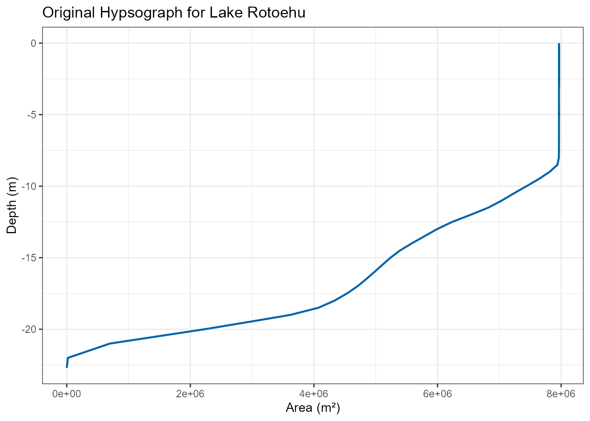
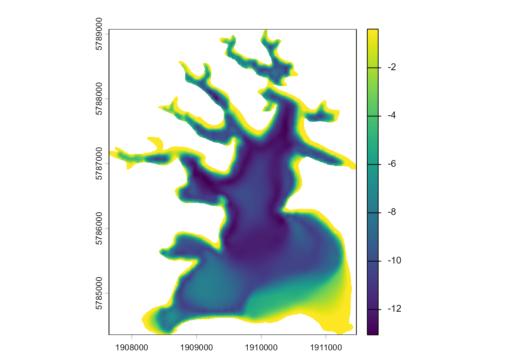
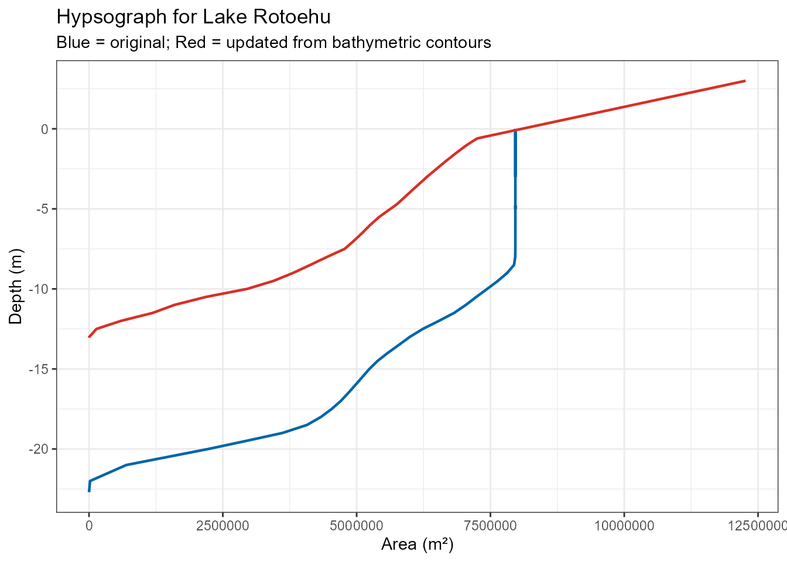
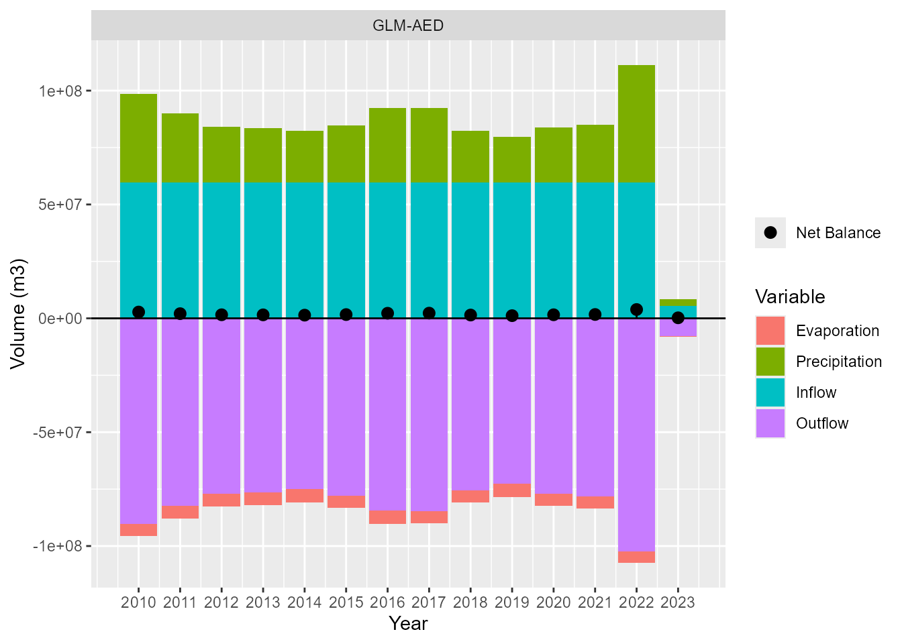
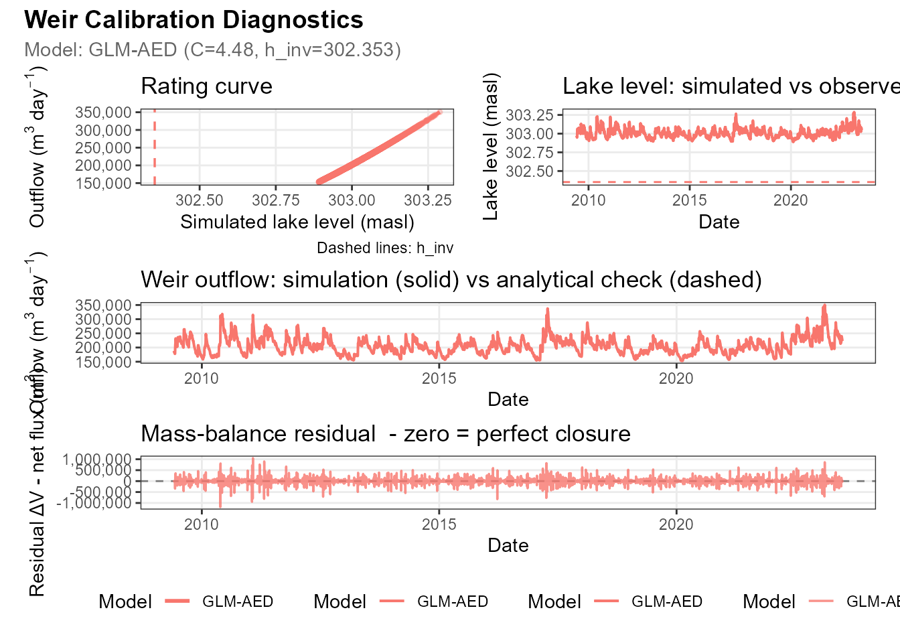
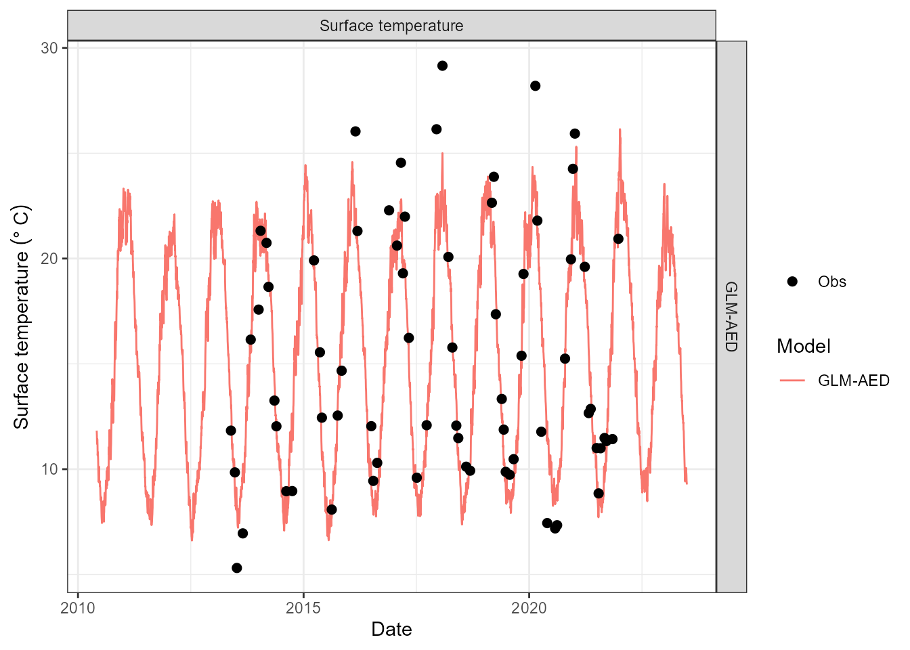
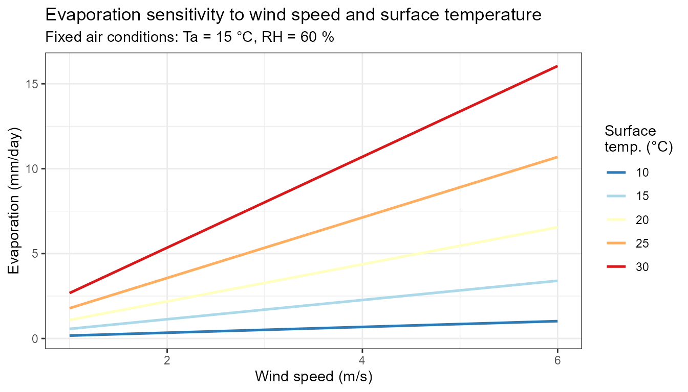
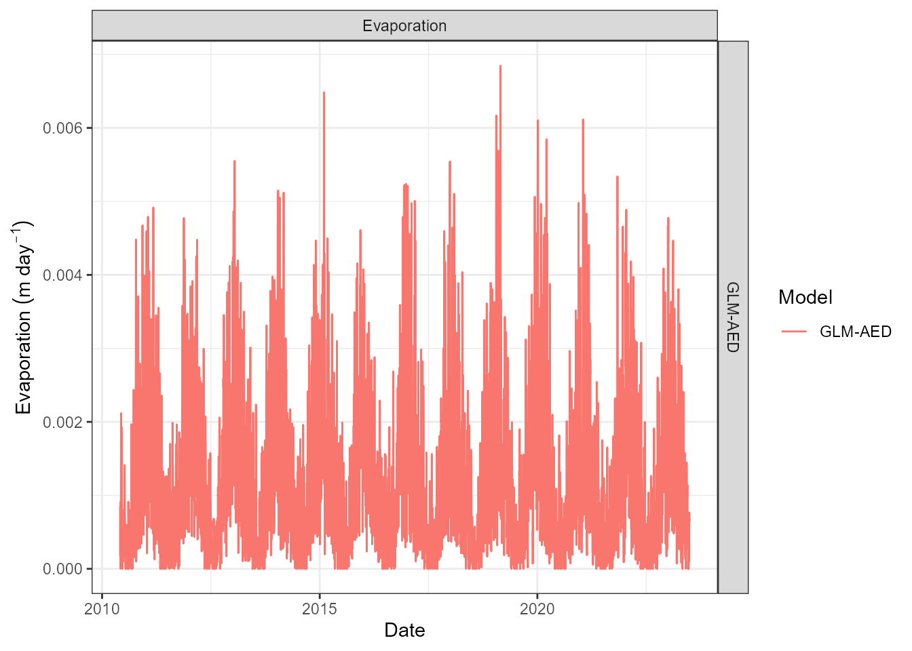
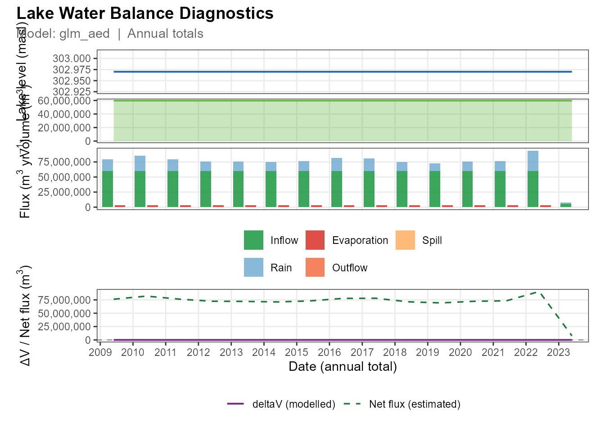
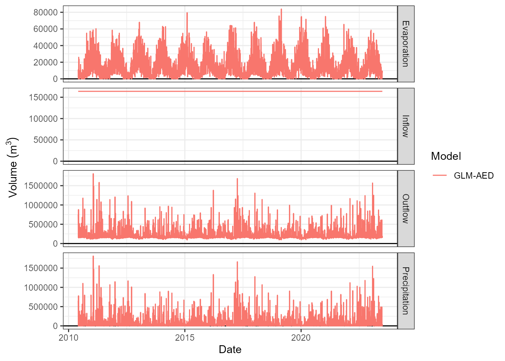

# Lake Rotoehu Water Balance and Evaporation

## Introduction

This article demonstrates how to work with Lake Rotoehu (ID: 40188) to:

1.  Set up an AEME model using data from the `aemetools` package
2.  Understand the three water balance approaches and when to use each
3.  Understand how lake surface temperature is estimated (and the role
    of observations)
4.  Learn how evaporation is estimated from bulk aerodynamic theory
5.  Extract and visualise evaporation output

Lake Rotoehu is a small, shallow lake in the Rotorua region of New
Zealand’s North Island (~8 km² surface area, ~13 m maximum depth). It is
eutrophic, thermally stratifies in summer, and has no permanent gauged
inflow — making a water-balance approach particularly useful for
constraining its hydrology.

## Setup

``` r

library(AEME)
library(aemetools)
library(bathytools)
library(ggplot2)
library(dplyr)
library(tmap)

tmap_mode("view")
```

## Load Lake Rotoehu data

The `aemetools` package provides access to pre-configured AEME objects
for New Zealand lakes via the Limnotrack API. Use the lake’s numeric ID
to retrieve it:

``` r

aeme <- aemetools::get_aeme(id = 40188)
```

View Aeme object:

``` r

aeme
#> 
#> ── AEME not yet built ──────────────────────────────────────────────────────────
#> 
#> ── Lake ──
#> 
#> Rotoehu (ID: LID40188)
#> • Lat: -38.01; Lon: 176.53
#> • Elev: 302.97m; Depth: 22.7m; Area: 7965248 m2
#> 
#> ── Time ──
#> 
#> • Start: 2010-06-01 00:00:00; Stop: 2023-06-30 00:00:00; Time step: 3600 s;
#>   Output step: 86400 s
#> • Timezone: UTC (timestamps stored UTC)
#> • Spin up (days): GLM: 365; GOTM: 365; DYRESM: 365; Simstrat: 365
#> 
#> ── Configuration ──
#> 
#> • Model: glm_aed and gotm_wet
#> • Path: Not set
#> • Model controls: Present
#> • Use biogeochemical model:
#> ┌ Model Configuration ─────────────────────────────────────────┐
#> │       Model              Physical         Biogeochemical     │
#> │ ---                                                          │
#> │       DY-CD               Absent              Absent         │
#> │      GLM-AED             Present              Absent         │
#> │      GOTM-WET            Present              Absent         │
#> │   SIMSTRAT-AED2           Absent              Absent         │
#> │    SIMSTRAT-AED           Absent              Absent         │
#> └──────────────────────────────────────────────────────────────┘
#> 
#> ── Observations ──
#> 
#> • Lake: Present; Level: Absent
#> 
#> ── Input ──
#> 
#> • Initial profile: Present; Initial depth: 22.698m
#> • Hypsograph: Present (n=64)
#> • Meteo: Present; Use longwave: TRUE; Kw: 0.586206896551724
#> 
#> ── Inflows ──
#> 
#> • Number of inflows: 3; Names: NZS4079511, NZS4081174, lumped
#> • Scaling factors: DY-CD: 1; GLM-AED: 1; GOTM-WET: 1; Simstrat-AED2: 1
#> 
#> ── Outflows ──
#> 
#> • Number of outflows: 1; Names: wbal; Elevations: -1
#> • Scaling factors: DY-CD: 1; GLM-AED: 1; GOTM-WET: 1; Simstrat-AED2: 1
#> 
#> ── Water Balance ──
#> 
#> • Method: 2; Use: obs
#> • Modelled: Absent; Water balance: Present
#> 
#> ── Parameters ──
#> 
#> • Number of parameters: 0
#> 
#> ── Output ──
#> 
#> • DY-CD: 1
#> • GLM-AED: 1
#> • GOTM-WET: 1
#> • SIMSTRAT-AED2: 0
#> • SIMSTRAT-AED: 0
#> • Variables: 64
#> Water temperature, Thermocline depth, Dissolved oxygen, Total chlorophyll a,
#> Total nitrogen, Total phosphorus, Water level, LKE_V, Change in volume, Surface
#> area, ... and 54 more
```

## View and update the hypsograph

The hypsograph encodes the depth–area relationship and is central to all
volume and evaporation calculations. Let’s inspect what was loaded:

``` r

hyps <- get_hypsograph(aeme)

orig_hyps <- hyps |>
dplyr::filter(depth <= 0)

ggplot(orig_hyps, aes(x = area, y = depth)) +
  geom_line(colour = "#0065a9", linewidth = 0.8) +
  labs(x = "Area (m²)", y = "Depth (m)",
       title = "Original Hypsograph for Lake Rotoehu") +
  theme_bw()
```



This does not look right — the max depth is too deep and there is about
8m from the surface to the first contour. We can improve this by
building a new hypsograph from bathymetric contours available on the
Limnotrack API:

``` r

# Lake Rotoehy lake id is 40188
shoreline <- aemetools::get_lake_shape(id = 40188) # lake shoreline shapefile

# Get lake depth contours
contours  <- ltapi::lt_fetch(
  "lake_contours",
  filter = ltapi::lt_filter(lernzmp_id == "LID40188")
) |>
  dplyr::mutate(depth = depth_m)
```

``` r

tm_shape(contours) +
  tm_lines(col = "depth", scale = tm_scale("-brewer.blues")) +
  tm_shape(shoreline) +
  tm_borders(col = "black") +
  tm_title("Lake Rotoehu Depth Contours")
```

Use the `bathytools` package to rasterise the contours and compute the
updated hypsograph:

``` r

bathy_raster <- rasterise_bathy(shoreline = shoreline,
                                contours  = contours,
                                res = 8, crs = 2193)
#> No islands found.
#> ℹ Generating depth points for interpolation
#> Warning: large number of points for interpolation (95645)
#> ✔ Generating depth points for interpolation [5.6s]
#> 
#> ℹ Interpolating depth points to raster
#> ℹ Adjusting depths >= 0 to -0.4m
#> ℹ Interpolating depth points to raster
```



    #> ✔ Interpolating depth points to raster [1.1s]

``` r

lake_elev <- max(contours$elevation_m)
upd_hyps  <- bathy_to_hypso(bathy_raster) |>
  dplyr::mutate(elev = lake_elev + depth) |> 
  extrap_hyps(z_range = 0.05, ext_elev = 3)

ggplot(orig_hyps, aes(x = area, y = depth)) +
  geom_line(colour = "#0065a9", linewidth = 0.8) +
  geom_line(data = upd_hyps, aes(x = area, y = depth),
            colour = "#d73027", linewidth = 0.8) +
  labs(x = "Area (m²)", y = "Depth (m)",
       title = "Hypsograph for Lake Rotoehu",
       subtitle = "Blue = original; Red = updated from bathymetric contours") +
  theme_bw()
```



``` r

aeme <- add_hypsograph(aeme, hypsograph = upd_hyps)
```

## Water balance approaches

[`build_aeme()`](https://limnotrack.com/reference/build_aeme.md)
supports three water balance methods, selected via `wb_method`. The
right choice depends on what forcing data and observations you have
available. The table below summarises when to use each:

| Method | `wb_method` | Requires | When to use |
|----|----|----|----|
| Closed lake | 1 | Meteorology only | No inflow/outflow data; short-term simulations; sensitivity testing |
| Outflow fitted | 2 | Met + inflow data | Fit a realistic outflow rating curve using inflow data; use observed lake level if available; |
| Inflow + outflow residual | 3 | Met + obs. levels + some inflow data | Gauged or estimated inflows; want to account for unexplained storage changes e.g. groundwater |

### Method 1 — Closed lake (no inflows or outflows)

The simplest assumption is that the lake is hydrologically isolated:
volume changes are driven only by direct precipitation on the lake
surface and evaporation from it.

``` math
\Delta V_t = P_t \cdot A_t - E_t \cdot A_t
```

where $`\Delta V_t`$ is the change in lake volume (m³/day), $`P_t`$ is
precipitation depth (m/day), $`E_t`$ is evaporation depth (m/day), and
$`A_t`$ is the lake surface area (m²) at time $`t`$.

**When to use:** Good for initial exploration, for lakes without inflow
gauges, or when you only want to estimate the evaporation component. It
will under-represent evaporation if significant inflows keep the lake
warmer than it would otherwise be, or over-predict it if the lake gains
volume from groundwater.

``` r

model <- "glm_aed"
path1 <- file.path(tempdir(), "rotoehu_wb1")

# Build and run model with Method 1 (closed lake)
aeme_wb1 <- aeme |>
  build_aeme(model = model, path = path1, wb_method = 1) |>
  run_aeme(model = model, path = path1)
#> Warning: GLM ignores the AirPres met column in daily mode and uses the default 1013.25 hPa instead.
#> This warning is displayed once per session.
#> 
#>      Reading configuration from C:\Users\runneradmin\AppData\Local\Temp\RtmpQTyuQx\rotoehu_wb1/LID40188_rotoehu/glm_aed/glm4.nml
#> No 'particles' config, assuming no particles
#>      NOTE: value for base_elev is no longer used; H[1] is assumed.
#>      VolAtCrest= 89749090.19418; MaxVol= 89749090.19418 (m3)
#>      No 'snowice' section, setting defaults & assuming no snowfall
#>      'sediment' section present, simulating sediment heating
#>      No 'outflow' config, assuming no outflows
#>      DBG calling initialise_lake
#>      DBG entered initialise_lake
#>      DBG init_profiles: num_heights=0 num_depths=2 the_heights=0000000000000000 the_depths=000002694F65F350 lake_depth=13.050000
#>      WARNING: Initial profiles problem - expected 0 wd_init_vals entries but got 28
#>      DBG initialise_lake returned
#> 
#>     -------------------------------------------------------
#>     |  General Lake Model (GLM)   Version 4.0.0           |
#>     -------------------------------------------------------
#> 
#>      glm built using gcc version 16.1.0
#> 
#>      nDays= 200; timestep= 3600.000000 (s)
#>      Maximum lake depth is 16.050000
#>      Depth where flow will occur over the crest is 16.050000
#>        *sed_temp_mean[0] =   15.68100
#> Heat pump disabled (heat_pump_switch = 0)
#> Oxygenation disabled
#> 
#>      Wall clock start time :  Fri Oct  9 01:21:25 2026
#> 
#>      Simulation begins...
#>      Running day  2454984, 0.02% of days complete     Running day  2454985, 0.04% of days complete     Running day  2454986, 0.06% of days complete     Running day  2454987, 0.08% of days complete     Running day  2454988, 0.10% of days complete     Running day  2454989, 0.12% of days complete     Running day  2454990, 0.14% of days complete     Running day  2454991, 0.16% of days complete     Running day  2454992, 0.17% of days complete     Running day  2454993, 0.19% of days complete     Running day  2454994, 0.21% of days complete     Running day  2454995, 0.23% of days complete     Running day  2454996, 0.25% of days complete     Running day  2454997, 0.27% of days complete     Running day  2454998, 0.29% of days complete     Running day  2454999, 0.31% of days complete     Running day  2455000, 0.33% of days complete     Running day  2455001, 0.35% of days complete     Running day  2455002, 0.37% of days complete     Running day  2455003, 0.39% of days complete     Running day  2455004, 0.41% of days complete     Running day  2455005, 0.43% of days complete     Running day  2455006, 0.45% of days complete     Running day  2455007, 0.47% of days complete     Running day  2455008, 0.49% of days complete     Running day  2455009, 0.51% of days complete     Running day  2455010, 0.52% of days complete     Running day  2455011, 0.54% of days complete     Running day  2455012, 0.56% of days complete     Running day  2455013, 0.58% of days complete     Running day  2455014, 0.60% of days complete     Running day  2455015, 0.62% of days complete     Running day  2455016, 0.64% of days complete     Running day  2455017, 0.66% of days complete     Running day  2455018, 0.68% of days complete     Running day  2455019, 0.70% of days complete     Running day  2455020, 0.72% of days complete     Running day  2455021, 0.74% of days complete     Running day  2455022, 0.76% of days complete     Running day  2455023, 0.78% of days complete     Running day  2455024, 0.80% of days complete     Running day  2455025, 0.82% of days complete     Running day  2455026, 0.84% of days complete     Running day  2455027, 0.86% of days complete     Running day  2455028, 0.87% of days complete     Running day  2455029, 0.89% of days complete     Running day  2455030, 0.91% of days complete     Running day  2455031, 0.93% of days complete     Running day  2455032, 0.95% of days complete     Running day  2455033, 0.97% of days complete     Running day  2455034, 0.99% of days complete     Running day  2455035, 1.01% of days complete     Running day  2455036, 1.03% of days complete     Running day  2455037, 1.05% of days complete     Running day  2455038, 1.07% of days complete     Running day  2455039, 1.09% of days complete     Running day  2455040, 1.11% of days complete     Running day  2455041, 1.13% of days complete     Running day  2455042, 1.15% of days complete     Running day  2455043, 1.17% of days complete     Running day  2455044, 1.19% of days complete     Running day  2455045, 1.21% of days complete     Running day  2455046, 1.22% of days complete     Running day  2455047, 1.24% of days complete     Running day  2455048, 1.26% of days complete     Running day  2455049, 1.28% of days complete     Running day  2455050, 1.30% of days complete     Running day  2455051, 1.32% of days complete     Running day  2455052, 1.34% of days complete     Running day  2455053, 1.36% of days complete     Running day  2455054, 1.38% of days complete     Running day  2455055, 1.40% of days complete     Running day  2455056, 1.42% of days complete     Running day  2455057, 1.44% of days complete     Running day  2455058, 1.46% of days complete     Running day  2455059, 1.48% of days complete     Running day  2455060, 1.50% of days complete     Running day  2455061, 1.52% of days complete     Running day  2455062, 1.54% of days complete     Running day  2455063, 1.56% of days complete     Running day  2455064, 1.57% of days complete     Running day  2455065, 1.59% of days complete     Running day  2455066, 1.61% of days complete     Running day  2455067, 1.63% of days complete     Running day  2455068, 1.65% of days complete     Running day  2455069, 1.67% of days complete     Running day  2455070, 1.69% of days complete     Running day  2455071, 1.71% of days complete     Running day  2455072, 1.73% of days complete     Running day  2455073, 1.75% of days complete     Running day  2455074, 1.77% of days complete     Running day  2455075, 1.79% of days complete     Running day  2455076, 1.81% of days complete     Running day  2455077, 1.83% of days complete     Running day  2455078, 1.85% of days complete     Running day  2455079, 1.87% of days complete     Running day  2455080, 1.89% of days complete     Running day  2455081, 1.91% of days complete     Running day  2455082, 1.92% of days complete     Running day  2455083, 1.94% of days complete     Running day  2455084, 1.96% of days complete     Running day  2455085, 1.98% of days complete     Running day  2455086, 2.00% of days complete     Running day  2455087, 2.02% of days complete     Running day  2455088, 2.04% of days complete     Running day  2455089, 2.06% of days complete     Running day  2455090, 2.08% of days complete     Running day  2455091, 2.10% of days complete     Running day  2455092, 2.12% of days complete     Running day  2455093, 2.14% of days complete     Running day  2455094, 2.16% of days complete     Running day  2455095, 2.18% of days complete     Running day  2455096, 2.20% of days complete     Running day  2455097, 2.22% of days complete     Running day  2455098, 2.24% of days complete     Running day  2455099, 2.26% of days complete     Running day  2455100, 2.27% of days complete     Running day  2455101, 2.29% of days complete     Running day  2455102, 2.31% of days complete     Running day  2455103, 2.33% of days complete     Running day  2455104, 2.35% of days complete     Running day  2455105, 2.37% of days complete     Running day  2455106, 2.39% of days complete     Running day  2455107, 2.41% of days complete     Running day  2455108, 2.43% of days complete     Running day  2455109, 2.45% of days complete     Running day  2455110, 2.47% of days complete     Running day  2455111, 2.49% of days complete     Running day  2455112, 2.51% of days complete     Running day  2455113, 2.53% of days complete     Running day  2455114, 2.55% of days complete     Running day  2455115, 2.57% of days complete     Running day  2455116, 2.59% of days complete     Running day  2455117, 2.61% of days complete     Running day  2455118, 2.62% of days complete     Running day  2455119, 2.64% of days complete     Running day  2455120, 2.66% of days complete     Running day  2455121, 2.68% of days complete     Running day  2455122, 2.70% of days complete     Running day  2455123, 2.72% of days complete     Running day  2455124, 2.74% of days complete     Running day  2455125, 2.76% of days complete     Running day  2455126, 2.78% of days complete     Running day  2455127, 2.80% of days complete     Running day  2455128, 2.82% of days complete     Running day  2455129, 2.84% of days complete     Running day  2455130, 2.86% of days complete     Running day  2455131, 2.88% of days complete     Running day  2455132, 2.90% of days complete     Running day  2455133, 2.92% of days complete     Running day  2455134, 2.94% of days complete     Running day  2455135, 2.96% of days complete     Running day  2455136, 2.97% of days complete     Running day  2455137, 2.99% of days complete     Running day  2455138, 3.01% of days complete     Running day  2455139, 3.03% of days complete     Running day  2455140, 3.05% of days complete     Running day  2455141, 3.07% of days complete     Running day  2455142, 3.09% of days complete     Running day  2455143, 3.11% of days complete     Running day  2455144, 3.13% of days complete     Running day  2455145, 3.15% of days complete     Running day  2455146, 3.17% of days complete     Running day  2455147, 3.19% of days complete     Running day  2455148, 3.21% of days complete     Running day  2455149, 3.23% of days complete     Running day  2455150, 3.25% of days complete     Running day  2455151, 3.27% of days complete     Running day  2455152, 3.29% of days complete     Running day  2455153, 3.31% of days complete     Running day  2455154, 3.32% of days complete     Running day  2455155, 3.34% of days complete     Running day  2455156, 3.36% of days complete     Running day  2455157, 3.38% of days complete     Running day  2455158, 3.40% of days complete     Running day  2455159, 3.42% of days complete     Running day  2455160, 3.44% of days complete     Running day  2455161, 3.46% of days complete     Running day  2455162, 3.48% of days complete     Running day  2455163, 3.50% of days complete     Running day  2455164, 3.52% of days complete     Running day  2455165, 3.54% of days complete     Running day  2455166, 3.56% of days complete     Running day  2455167, 3.58% of days complete     Running day  2455168, 3.60% of days complete     Running day  2455169, 3.62% of days complete     Running day  2455170, 3.64% of days complete     Running day  2455171, 3.66% of days complete     Running day  2455172, 3.67% of days complete     Running day  2455173, 3.69% of days complete     Running day  2455174, 3.71% of days complete     Running day  2455175, 3.73% of days complete     Running day  2455176, 3.75% of days complete     Running day  2455177, 3.77% of days complete     Running day  2455178, 3.79% of days complete     Running day  2455179, 3.81% of days complete     Running day  2455180, 3.83% of days complete     Running day  2455181, 3.85% of days complete     Running day  2455182, 3.87% of days complete     Running day  2455183, 3.89% of days complete     Running day  2455184, 3.91% of days complete     Running day  2455185, 3.93% of days complete     Running day  2455186, 3.95% of days complete     Running day  2455187, 3.97% of days complete     Running day  2455188, 3.99% of days complete     Running day  2455189, 4.01% of days complete     Running day  2455190, 4.02% of days complete     Running day  2455191, 4.04% of days complete     Running day  2455192, 4.06% of days complete     Running day  2455193, 4.08% of days complete     Running day  2455194, 4.10% of days complete     Running day  2455195, 4.12% of days complete     Running day  2455196, 4.14% of days complete     Running day  2455197, 4.16% of days complete     Running day  2455198, 4.18% of days complete     Running day  2455199, 4.20% of days complete     Running day  2455200, 4.22% of days complete     Running day  2455201, 4.24% of days complete     Running day  2455202, 4.26% of days complete     Running day  2455203, 4.28% of days complete     Running day  2455204, 4.30% of days complete     Running day  2455205, 4.32% of days complete     Running day  2455206, 4.34% of days complete     Running day  2455207, 4.36% of days complete     Running day  2455208, 4.37% of days complete     Running day  2455209, 4.39% of days complete     Running day  2455210, 4.41% of days complete     Running day  2455211, 4.43% of days complete     Running day  2455212, 4.45% of days complete     Running day  2455213, 4.47% of days complete     Running day  2455214, 4.49% of days complete     Running day  2455215, 4.51% of days complete     Running day  2455216, 4.53% of days complete     Running day  2455217, 4.55% of days complete     Running day  2455218, 4.57% of days complete     Running day  2455219, 4.59% of days complete     Running day  2455220, 4.61% of days complete     Running day  2455221, 4.63% of days complete     Running day  2455222, 4.65% of days complete     Running day  2455223, 4.67% of days complete     Running day  2455224, 4.69% of days complete     Running day  2455225, 4.71% of days complete     Running day  2455226, 4.72% of days complete     Running day  2455227, 4.74% of days complete     Running day  2455228, 4.76% of days complete     Running day  2455229, 4.78% of days complete     Running day  2455230, 4.80% of days complete     Running day  2455231, 4.82% of days complete     Running day  2455232, 4.84% of days complete     Running day  2455233, 4.86% of days complete     Running day  2455234, 4.88% of days complete     Running day  2455235, 4.90% of days complete     Running day  2455236, 4.92% of days complete     Running day  2455237, 4.94% of days complete     Running day  2455238, 4.96% of days complete     Running day  2455239, 4.98% of days complete     Running day  2455240, 5.00% of days complete     Running day  2455241, 5.02% of days complete     Running day  2455242, 5.04% of days complete     Running day  2455243, 5.06% of days complete     Running day  2455244, 5.07% of days complete     Running day  2455245, 5.09% of days complete     Running day  2455246, 5.11% of days complete     Running day  2455247, 5.13% of days complete     Running day  2455248, 5.15% of days complete     Running day  2455249, 5.17% of days complete     Running day  2455250, 5.19% of days complete     Running day  2455251, 5.21% of days complete     Running day  2455252, 5.23% of days complete     Running day  2455253, 5.25% of days complete     Running day  2455254, 5.27% of days complete     Running day  2455255, 5.29% of days complete     Running day  2455256, 5.31% of days complete     Running day  2455257, 5.33% of days complete     Running day  2455258, 5.35% of days complete     Running day  2455259, 5.37% of days complete     Running day  2455260, 5.39% of days complete     Running day  2455261, 5.41% of days complete     Running day  2455262, 5.42% of days complete     Running day  2455263, 5.44% of days complete     Running day  2455264, 5.46% of days complete     Running day  2455265, 5.48% of days complete     Running day  2455266, 5.50% of days complete     Running day  2455267, 5.52% of days complete     Running day  2455268, 5.54% of days complete     Running day  2455269, 5.56% of days complete     Running day  2455270, 5.58% of days complete     Running day  2455271, 5.60% of days complete     Running day  2455272, 5.62% of days complete     Running day  2455273, 5.64% of days complete     Running day  2455274, 5.66% of days complete     Running day  2455275, 5.68% of days complete     Running day  2455276, 5.70% of days complete     Running day  2455277, 5.72% of days complete     Running day  2455278, 5.74% of days complete     Running day  2455279, 5.76% of days complete     Running day  2455280, 5.77% of days complete     Running day  2455281, 5.79% of days complete     Running day  2455282, 5.81% of days complete     Running day  2455283, 5.83% of days complete     Running day  2455284, 5.85% of days complete     Running day  2455285, 5.87% of days complete     Running day  2455286, 5.89% of days complete     Running day  2455287, 5.91% of days complete     Running day  2455288, 5.93% of days complete     Running day  2455289, 5.95% of days complete     Running day  2455290, 5.97% of days complete     Running day  2455291, 5.99% of days complete     Running day  2455292, 6.01% of days complete     Running day  2455293, 6.03% of days complete     Running day  2455294, 6.05% of days complete     Running day  2455295, 6.07% of days complete     Running day  2455296, 6.09% of days complete     Running day  2455297, 6.11% of days complete     Running day  2455298, 6.12% of days complete     Running day  2455299, 6.14% of days complete     Running day  2455300, 6.16% of days complete     Running day  2455301, 6.18% of days complete     Running day  2455302, 6.20% of days complete     Running day  2455303, 6.22% of days complete     Running day  2455304, 6.24% of days complete     Running day  2455305, 6.26% of days complete     Running day  2455306, 6.28% of days complete     Running day  2455307, 6.30% of days complete     Running day  2455308, 6.32% of days complete     Running day  2455309, 6.34% of days complete     Running day  2455310, 6.36% of days complete     Running day  2455311, 6.38% of days complete     Running day  2455312, 6.40% of days complete     Running day  2455313, 6.42% of days complete     Running day  2455314, 6.44% of days complete     Running day  2455315, 6.46% of days complete     Running day  2455316, 6.47% of days complete     Running day  2455317, 6.49% of days complete     Running day  2455318, 6.51% of days complete     Running day  2455319, 6.53% of days complete     Running day  2455320, 6.55% of days complete     Running day  2455321, 6.57% of days complete     Running day  2455322, 6.59% of days complete     Running day  2455323, 6.61% of days complete     Running day  2455324, 6.63% of days complete     Running day  2455325, 6.65% of days complete     Running day  2455326, 6.67% of days complete     Running day  2455327, 6.69% of days complete     Running day  2455328, 6.71% of days complete     Running day  2455329, 6.73% of days complete     Running day  2455330, 6.75% of days complete     Running day  2455331, 6.77% of days complete     Running day  2455332, 6.79% of days complete     Running day  2455333, 6.81% of days complete     Running day  2455334, 6.82% of days complete     Running day  2455335, 6.84% of days complete     Running day  2455336, 6.86% of days complete     Running day  2455337, 6.88% of days complete     Running day  2455338, 6.90% of days complete     Running day  2455339, 6.92% of days complete     Running day  2455340, 6.94% of days complete     Running day  2455341, 6.96% of days complete     Running day  2455342, 6.98% of days complete     Running day  2455343, 7.00% of days complete     Running day  2455344, 7.02% of days complete     Running day  2455345, 7.04% of days complete     Running day  2455346, 7.06% of days complete     Running day  2455347, 7.08% of days complete     Running day  2455348, 7.10% of days complete     Running day  2455349, 7.12% of days complete     Running day  2455350, 7.14% of days complete     Running day  2455351, 7.16% of days complete     Running day  2455352, 7.17% of days complete     Running day  2455353, 7.19% of days complete     Running day  2455354, 7.21% of days complete     Running day  2455355, 7.23% of days complete     Running day  2455356, 7.25% of days complete     Running day  2455357, 7.27% of days complete     Running day  2455358, 7.29% of days complete     Running day  2455359, 7.31% of days complete     Running day  2455360, 7.33% of days complete     Running day  2455361, 7.35% of days complete     Running day  2455362, 7.37% of days complete     Running day  2455363, 7.39% of days complete     Running day  2455364, 7.41% of days complete     Running day  2455365, 7.43% of days complete     Running day  2455366, 7.45% of days complete     Running day  2455367, 7.47% of days complete     Running day  2455368, 7.49% of days complete     Running day  2455369, 7.51% of days complete     Running day  2455370, 7.52% of days complete     Running day  2455371, 7.54% of days complete     Running day  2455372, 7.56% of days complete     Running day  2455373, 7.58% of days complete     Running day  2455374, 7.60% of days complete     Running day  2455375, 7.62% of days complete     Running day  2455376, 7.64% of days complete     Running day  2455377, 7.66% of days complete     Running day  2455378, 7.68% of days complete     Running day  2455379, 7.70% of days complete     Running day  2455380, 7.72% of days complete     Running day  2455381, 7.74% of days complete     Running day  2455382, 7.76% of days complete     Running day  2455383, 7.78% of days complete     Running day  2455384, 7.80% of days complete     Running day  2455385, 7.82% of days complete     Running day  2455386, 7.84% of days complete     Running day  2455387, 7.86% of days complete     Running day  2455388, 7.87% of days complete     Running day  2455389, 7.89% of days complete     Running day  2455390, 7.91% of days complete     Running day  2455391, 7.93% of days complete     Running day  2455392, 7.95% of days complete     Running day  2455393, 7.97% of days complete     Running day  2455394, 7.99% of days complete     Running day  2455395, 8.01% of days complete     Running day  2455396, 8.03% of days complete     Running day  2455397, 8.05% of days complete     Running day  2455398, 8.07% of days complete     Running day  2455399, 8.09% of days complete     Running day  2455400, 8.11% of days complete     Running day  2455401, 8.13% of days complete     Running day  2455402, 8.15% of days complete     Running day  2455403, 8.17% of days complete     Running day  2455404, 8.19% of days complete     Running day  2455405, 8.21% of days complete     Running day  2455406, 8.22% of days complete     Running day  2455407, 8.24% of days complete     Running day  2455408, 8.26% of days complete     Running day  2455409, 8.28% of days complete     Running day  2455410, 8.30% of days complete     Running day  2455411, 8.32% of days complete     Running day  2455412, 8.34% of days complete     Running day  2455413, 8.36% of days complete     Running day  2455414, 8.38% of days complete     Running day  2455415, 8.40% of days complete     Running day  2455416, 8.42% of days complete     Running day  2455417, 8.44% of days complete     Running day  2455418, 8.46% of days complete     Running day  2455419, 8.48% of days complete     Running day  2455420, 8.50% of days complete     Running day  2455421, 8.52% of days complete     Running day  2455422, 8.54% of days complete     Running day  2455423, 8.56% of days complete     Running day  2455424, 8.57% of days complete     Running day  2455425, 8.59% of days complete     Running day  2455426, 8.61% of days complete     Running day  2455427, 8.63% of days complete     Running day  2455428, 8.65% of days complete     Running day  2455429, 8.67% of days complete     Running day  2455430, 8.69% of days complete     Running day  2455431, 8.71% of days complete     Running day  2455432, 8.73% of days complete     Running day  2455433, 8.75% of days complete     Running day  2455434, 8.77% of days complete     Running day  2455435, 8.79% of days complete     Running day  2455436, 8.81% of days complete     Running day  2455437, 8.83% of days complete     Running day  2455438, 8.85% of days complete     Running day  2455439, 8.87% of days complete     Running day  2455440, 8.89% of days complete     Running day  2455441, 8.91% of days complete     Running day  2455442, 8.92% of days complete     Running day  2455443, 8.94% of days complete     Running day  2455444, 8.96% of days complete     Running day  2455445, 8.98% of days complete     Running day  2455446, 9.00% of days complete     Running day  2455447, 9.02% of days complete     Running day  2455448, 9.04% of days complete     Running day  2455449, 9.06% of days complete     Running day  2455450, 9.08% of days complete     Running day  2455451, 9.10% of days complete     Running day  2455452, 9.12% of days complete     Running day  2455453, 9.14% of days complete     Running day  2455454, 9.16% of days complete     Running day  2455455, 9.18% of days complete     Running day  2455456, 9.20% of days complete     Running day  2455457, 9.22% of days complete     Running day  2455458, 9.24% of days complete     Running day  2455459, 9.26% of days complete     Running day  2455460, 9.27% of days complete     Running day  2455461, 9.29% of days complete     Running day  2455462, 9.31% of days complete     Running day  2455463, 9.33% of days complete     Running day  2455464, 9.35% of days complete     Running day  2455465, 9.37% of days complete     Running day  2455466, 9.39% of days complete     Running day  2455467, 9.41% of days complete     Running day  2455468, 9.43% of days complete     Running day  2455469, 9.45% of days complete     Running day  2455470, 9.47% of days complete     Running day  2455471, 9.49% of days complete     Running day  2455472, 9.51% of days complete     Running day  2455473, 9.53% of days complete     Running day  2455474, 9.55% of days complete     Running day  2455475, 9.57% of days complete     Running day  2455476, 9.59% of days complete     Running day  2455477, 9.61% of days complete     Running day  2455478, 9.62% of days complete     Running day  2455479, 9.64% of days complete     Running day  2455480, 9.66% of days complete     Running day  2455481, 9.68% of days complete     Running day  2455482, 9.70% of days complete     Running day  2455483, 9.72% of days complete     Running day  2455484, 9.74% of days complete     Running day  2455485, 9.76% of days complete     Running day  2455486, 9.78% of days complete     Running day  2455487, 9.80% of days complete     Running day  2455488, 9.82% of days complete     Running day  2455489, 9.84% of days complete     Running day  2455490, 9.86% of days complete     Running day  2455491, 9.88% of days complete     Running day  2455492, 9.90% of days complete     Running day  2455493, 9.92% of days complete     Running day  2455494, 9.94% of days complete     Running day  2455495, 9.96% of days complete     Running day  2455496, 9.97% of days complete     Running day  2455497, 9.99% of days complete     Running day  2455498, 10.01% of days complete     Running day  2455499, 10.03% of days complete     Running day  2455500, 10.05% of days complete     Running day  2455501, 10.07% of days complete     Running day  2455502, 10.09% of days complete     Running day  2455503, 10.11% of days complete     Running day  2455504, 10.13% of days complete     Running day  2455505, 10.15% of days complete     Running day  2455506, 10.17% of days complete     Running day  2455507, 10.19% of days complete     Running day  2455508, 10.21% of days complete     Running day  2455509, 10.23% of days complete     Running day  2455510, 10.25% of days complete     Running day  2455511, 10.27% of days complete     Running day  2455512, 10.29% of days complete     Running day  2455513, 10.31% of days complete     Running day  2455514, 10.32% of days complete     Running day  2455515, 10.34% of days complete     Running day  2455516, 10.36% of days complete     Running day  2455517, 10.38% of days complete     Running day  2455518, 10.40% of days complete     Running day  2455519, 10.42% of days complete     Running day  2455520, 10.44% of days complete     Running day  2455521, 10.46% of days complete     Running day  2455522, 10.48% of days complete     Running day  2455523, 10.50% of days complete     Running day  2455524, 10.52% of days complete     Running day  2455525, 10.54% of days complete     Running day  2455526, 10.56% of days complete     Running day  2455527, 10.58% of days complete     Running day  2455528, 10.60% of days complete     Running day  2455529, 10.62% of days complete     Running day  2455530, 10.64% of days complete     Running day  2455531, 10.66% of days complete     Running day  2455532, 10.67% of days complete     Running day  2455533, 10.69% of days complete     Running day  2455534, 10.71% of days complete     Running day  2455535, 10.73% of days complete     Running day  2455536, 10.75% of days complete     Running day  2455537, 10.77% of days complete     Running day  2455538, 10.79% of days complete     Running day  2455539, 10.81% of days complete     Running day  2455540, 10.83% of days complete     Running day  2455541, 10.85% of days complete     Running day  2455542, 10.87% of days complete     Running day  2455543, 10.89% of days complete     Running day  2455544, 10.91% of days complete     Running day  2455545, 10.93% of days complete     Running day  2455546, 10.95% of days complete     Running day  2455547, 10.97% of days complete     Running day  2455548, 10.99% of days complete     Running day  2455549, 11.01% of days complete     Running day  2455550, 11.02% of days complete     Running day  2455551, 11.04% of days complete     Running day  2455552, 11.06% of days complete     Running day  2455553, 11.08% of days complete     Running day  2455554, 11.10% of days complete     Running day  2455555, 11.12% of days complete     Running day  2455556, 11.14% of days complete     Running day  2455557, 11.16% of days complete     Running day  2455558, 11.18% of days complete     Running day  2455559, 11.20% of days complete     Running day  2455560, 11.22% of days complete     Running day  2455561, 11.24% of days complete     Running day  2455562, 11.26% of days complete     Running day  2455563, 11.28% of days complete     Running day  2455564, 11.30% of days complete     Running day  2455565, 11.32% of days complete     Running day  2455566, 11.34% of days complete     Running day  2455567, 11.36% of days complete     Running day  2455568, 11.37% of days complete     Running day  2455569, 11.39% of days complete     Running day  2455570, 11.41% of days complete     Running day  2455571, 11.43% of days complete     Running day  2455572, 11.45% of days complete     Running day  2455573, 11.47% of days complete     Running day  2455574, 11.49% of days complete     Running day  2455575, 11.51% of days complete     Running day  2455576, 11.53% of days complete     Running day  2455577, 11.55% of days complete     Running day  2455578, 11.57% of days complete     Running day  2455579, 11.59% of days complete     Running day  2455580, 11.61% of days complete     Running day  2455581, 11.63% of days complete     Running day  2455582, 11.65% of days complete     Running day  2455583, 11.67% of days complete     Running day  2455584, 11.69% of days complete     Running day  2455585, 11.71% of days complete     Running day  2455586, 11.72% of days complete     Running day  2455587, 11.74% of days complete     Running day  2455588, 11.76% of days complete     Running day  2455589, 11.78% of days complete     Running day  2455590, 11.80% of days complete     Running day  2455591, 11.82% of days complete     Running day  2455592, 11.84% of days complete     Running day  2455593, 11.86% of days complete     Running day  2455594, 11.88% of days complete     Running day  2455595, 11.90% of days complete     Running day  2455596, 11.92% of days complete     Running day  2455597, 11.94% of days complete     Running day  2455598, 11.96% of days complete     Running day  2455599, 11.98% of days complete     Running day  2455600, 12.00% of days complete     Running day  2455601, 12.02% of days complete     Running day  2455602, 12.04% of days complete     Running day  2455603, 12.06% of days complete     Running day  2455604, 12.07% of days complete     Running day  2455605, 12.09% of days complete     Running day  2455606, 12.11% of days complete     Running day  2455607, 12.13% of days complete     Running day  2455608, 12.15% of days complete     Running day  2455609, 12.17% of days complete     Running day  2455610, 12.19% of days complete     Running day  2455611, 12.21% of days complete     Running day  2455612, 12.23% of days complete     Running day  2455613, 12.25% of days complete     Running day  2455614, 12.27% of days complete     Running day  2455615, 12.29% of days complete     Running day  2455616, 12.31% of days complete     Running day  2455617, 12.33% of days complete     Running day  2455618, 12.35% of days complete     Running day  2455619, 12.37% of days complete     Running day  2455620, 12.39% of days complete     Running day  2455621, 12.41% of days complete     Running day  2455622, 12.42% of days complete     Running day  2455623, 12.44% of days complete     Running day  2455624, 12.46% of days complete     Running day  2455625, 12.48% of days complete     Running day  2455626, 12.50% of days complete     Running day  2455627, 12.52% of days complete     Running day  2455628, 12.54% of days complete     Running day  2455629, 12.56% of days complete     Running day  2455630, 12.58% of days complete     Running day  2455631, 12.60% of days complete     Running day  2455632, 12.62% of days complete     Running day  2455633, 12.64% of days complete     Running day  2455634, 12.66% of days complete     Running day  2455635, 12.68% of days complete     Running day  2455636, 12.70% of days complete     Running day  2455637, 12.72% of days complete     Running day  2455638, 12.74% of days complete     Running day  2455639, 12.76% of days complete     Running day  2455640, 12.77% of days complete     Running day  2455641, 12.79% of days complete     Running day  2455642, 12.81% of days complete     Running day  2455643, 12.83% of days complete     Running day  2455644, 12.85% of days complete     Running day  2455645, 12.87% of days complete     Running day  2455646, 12.89% of days complete     Running day  2455647, 12.91% of days complete     Running day  2455648, 12.93% of days complete     Running day  2455649, 12.95% of days complete     Running day  2455650, 12.97% of days complete     Running day  2455651, 12.99% of days complete     Running day  2455652, 13.01% of days complete     Running day  2455653, 13.03% of days complete     Running day  2455654, 13.05% of days complete     Running day  2455655, 13.07% of days complete     Running day  2455656, 13.09% of days complete     Running day  2455657, 13.11% of days complete     Running day  2455658, 13.12% of days complete     Running day  2455659, 13.14% of days complete     Running day  2455660, 13.16% of days complete     Running day  2455661, 13.18% of days complete     Running day  2455662, 13.20% of days complete     Running day  2455663, 13.22% of days complete     Running day  2455664, 13.24% of days complete     Running day  2455665, 13.26% of days complete     Running day  2455666, 13.28% of days complete     Running day  2455667, 13.30% of days complete     Running day  2455668, 13.32% of days complete     Running day  2455669, 13.34% of days complete     Running day  2455670, 13.36% of days complete     Running day  2455671, 13.38% of days complete     Running day  2455672, 13.40% of days complete     Running day  2455673, 13.42% of days complete     Running day  2455674, 13.44% of days complete     Running day  2455675, 13.46% of days complete     Running day  2455676, 13.47% of days complete     Running day  2455677, 13.49% of days complete     Running day  2455678, 13.51% of days complete     Running day  2455679, 13.53% of days complete     Running day  2455680, 13.55% of days complete     Running day  2455681, 13.57% of days complete     Running day  2455682, 13.59% of days complete     Running day  2455683, 13.61% of days complete     Running day  2455684, 13.63% of days complete     Running day  2455685, 13.65% of days complete     Running day  2455686, 13.67% of days complete     Running day  2455687, 13.69% of days complete     Running day  2455688, 13.71% of days complete     Running day  2455689, 13.73% of days complete     Running day  2455690, 13.75% of days complete     Running day  2455691, 13.77% of days complete     Running day  2455692, 13.79% of days complete     Running day  2455693, 13.81% of days complete     Running day  2455694, 13.82% of days complete     Running day  2455695, 13.84% of days complete     Running day  2455696, 13.86% of days complete     Running day  2455697, 13.88% of days complete     Running day  2455698, 13.90% of days complete     Running day  2455699, 13.92% of days complete     Running day  2455700, 13.94% of days complete     Running day  2455701, 13.96% of days complete     Running day  2455702, 13.98% of days complete     Running day  2455703, 14.00% of days complete     Running day  2455704, 14.02% of days complete     Running day  2455705, 14.04% of days complete     Running day  2455706, 14.06% of days complete     Running day  2455707, 14.08% of days complete     Running day  2455708, 14.10% of days complete     Running day  2455709, 14.12% of days complete     Running day  2455710, 14.14% of days complete     Running day  2455711, 14.16% of days complete     Running day  2455712, 14.17% of days complete     Running day  2455713, 14.19% of days complete     Running day  2455714, 14.21% of days complete     Running day  2455715, 14.23% of days complete     Running day  2455716, 14.25% of days complete     Running day  2455717, 14.27% of days complete     Running day  2455718, 14.29% of days complete     Running day  2455719, 14.31% of days complete     Running day  2455720, 14.33% of days complete     Running day  2455721, 14.35% of days complete     Running day  2455722, 14.37% of days complete     Running day  2455723, 14.39% of days complete     Running day  2455724, 14.41% of days complete     Running day  2455725, 14.43% of days complete     Running day  2455726, 14.45% of days complete     Running day  2455727, 14.47% of days complete     Running day  2455728, 14.49% of days complete     Running day  2455729, 14.51% of days complete     Running day  2455730, 14.52% of days complete     Running day  2455731, 14.54% of days complete     Running day  2455732, 14.56% of days complete     Running day  2455733, 14.58% of days complete     Running day  2455734, 14.60% of days complete     Running day  2455735, 14.62% of days complete     Running day  2455736, 14.64% of days complete     Running day  2455737, 14.66% of days complete     Running day  2455738, 14.68% of days complete     Running day  2455739, 14.70% of days complete     Running day  2455740, 14.72% of days complete     Running day  2455741, 14.74% of days complete     Running day  2455742, 14.76% of days complete     Running day  2455743, 14.78% of days complete     Running day  2455744, 14.80% of days complete     Running day  2455745, 14.82% of days complete     Running day  2455746, 14.84% of days complete     Running day  2455747, 14.86% of days complete     Running day  2455748, 14.87% of days complete     Running day  2455749, 14.89% of days complete     Running day  2455750, 14.91% of days complete     Running day  2455751, 14.93% of days complete     Running day  2455752, 14.95% of days complete     Running day  2455753, 14.97% of days complete     Running day  2455754, 14.99% of days complete     Running day  2455755, 15.01% of days complete     Running day  2455756, 15.03% of days complete     Running day  2455757, 15.05% of days complete     Running day  2455758, 15.07% of days complete     Running day  2455759, 15.09% of days complete     Running day  2455760, 15.11% of days complete     Running day  2455761, 15.13% of days complete     Running day  2455762, 15.15% of days complete     Running day  2455763, 15.17% of days complete     Running day  2455764, 15.19% of days complete     Running day  2455765, 15.21% of days complete     Running day  2455766, 15.22% of days complete     Running day  2455767, 15.24% of days complete     Running day  2455768, 15.26% of days complete     Running day  2455769, 15.28% of days complete     Running day  2455770, 15.30% of days complete     Running day  2455771, 15.32% of days complete     Running day  2455772, 15.34% of days complete     Running day  2455773, 15.36% of days complete     Running day  2455774, 15.38% of days complete     Running day  2455775, 15.40% of days complete     Running day  2455776, 15.42% of days complete     Running day  2455777, 15.44% of days complete     Running day  2455778, 15.46% of days complete     Running day  2455779, 15.48% of days complete     Running day  2455780, 15.50% of days complete     Running day  2455781, 15.52% of days complete     Running day  2455782, 15.54% of days complete     Running day  2455783, 15.56% of days complete     Running day  2455784, 15.57% of days complete     Running day  2455785, 15.59% of days complete     Running day  2455786, 15.61% of days complete     Running day  2455787, 15.63% of days complete     Running day  2455788, 15.65% of days complete     Running day  2455789, 15.67% of days complete     Running day  2455790, 15.69% of days complete     Running day  2455791, 15.71% of days complete     Running day  2455792, 15.73% of days complete     Running day  2455793, 15.75% of days complete     Running day  2455794, 15.77% of days complete     Running day  2455795, 15.79% of days complete     Running day  2455796, 15.81% of days complete     Running day  2455797, 15.83% of days complete     Running day  2455798, 15.85% of days complete     Running day  2455799, 15.87% of days complete     Running day  2455800, 15.89% of days complete     Running day  2455801, 15.91% of days complete     Running day  2455802, 15.92% of days complete     Running day  2455803, 15.94% of days complete     Running day  2455804, 15.96% of days complete     Running day  2455805, 15.98% of days complete     Running day  2455806, 16.00% of days complete     Running day  2455807, 16.02% of days complete     Running day  2455808, 16.04% of days complete     Running day  2455809, 16.06% of days complete     Running day  2455810, 16.08% of days complete     Running day  2455811, 16.10% of days complete     Running day  2455812, 16.12% of days complete     Running day  2455813, 16.14% of days complete     Running day  2455814, 16.16% of days complete     Running day  2455815, 16.18% of days complete     Running day  2455816, 16.20% of days complete     Running day  2455817, 16.22% of days complete     Running day  2455818, 16.24% of days complete     Running day  2455819, 16.26% of days complete     Running day  2455820, 16.27% of days complete     Running day  2455821, 16.29% of days complete     Running day  2455822, 16.31% of days complete     Running day  2455823, 16.33% of days complete     Running day  2455824, 16.35% of days complete     Running day  2455825, 16.37% of days complete     Running day  2455826, 16.39% of days complete     Running day  2455827, 16.41% of days complete     Running day  2455828, 16.43% of days complete     Running day  2455829, 16.45% of days complete     Running day  2455830, 16.47% of days complete     Running day  2455831, 16.49% of days complete     Running day  2455832, 16.51% of days complete     Running day  2455833, 16.53% of days complete     Running day  2455834, 16.55% of days complete     Running day  2455835, 16.57% of days complete     Running day  2455836, 16.59% of days complete     Running day  2455837, 16.61% of days complete     Running day  2455838, 16.62% of days complete     Running day  2455839, 16.64% of days complete     Running day  2455840, 16.66% of days complete     Running day  2455841, 16.68% of days complete     Running day  2455842, 16.70% of days complete     Running day  2455843, 16.72% of days complete     Running day  2455844, 16.74% of days complete     Running day  2455845, 16.76% of days complete     Running day  2455846, 16.78% of days complete     Running day  2455847, 16.80% of days complete     Running day  2455848, 16.82% of days complete     Running day  2455849, 16.84% of days complete     Running day  2455850, 16.86% of days complete     Running day  2455851, 16.88% of days complete     Running day  2455852, 16.90% of days complete     Running day  2455853, 16.92% of days complete     Running day  2455854, 16.94% of days complete     Running day  2455855, 16.96% of days complete     Running day  2455856, 16.97% of days complete     Running day  2455857, 16.99% of days complete     Running day  2455858, 17.01% of days complete     Running day  2455859, 17.03% of days complete     Running day  2455860, 17.05% of days complete     Running day  2455861, 17.07% of days complete     Running day  2455862, 17.09% of days complete     Running day  2455863, 17.11% of days complete     Running day  2455864, 17.13% of days complete     Running day  2455865, 17.15% of days complete     Running day  2455866, 17.17% of days complete     Running day  2455867, 17.19% of days complete     Running day  2455868, 17.21% of days complete     Running day  2455869, 17.23% of days complete     Running day  2455870, 17.25% of days complete     Running day  2455871, 17.27% of days complete     Running day  2455872, 17.29% of days complete     Running day  2455873, 17.31% of days complete     Running day  2455874, 17.32% of days complete     Running day  2455875, 17.34% of days complete     Running day  2455876, 17.36% of days complete     Running day  2455877, 17.38% of days complete     Running day  2455878, 17.40% of days complete     Running day  2455879, 17.42% of days complete     Running day  2455880, 17.44% of days complete     Running day  2455881, 17.46% of days complete     Running day  2455882, 17.48% of days complete     Running day  2455883, 17.50% of days complete     Running day  2455884, 17.52% of days complete     Running day  2455885, 17.54% of days complete     Running day  2455886, 17.56% of days complete     Running day  2455887, 17.58% of days complete     Running day  2455888, 17.60% of days complete     Running day  2455889, 17.62% of days complete     Running day  2455890, 17.64% of days complete     Running day  2455891, 17.66% of days complete     Running day  2455892, 17.67% of days complete     Running day  2455893, 17.69% of days complete     Running day  2455894, 17.71% of days complete     Running day  2455895, 17.73% of days complete     Running day  2455896, 17.75% of days complete     Running day  2455897, 17.77% of days complete     Running day  2455898, 17.79% of days complete     Running day  2455899, 17.81% of days complete     Running day  2455900, 17.83% of days complete     Running day  2455901, 17.85% of days complete     Running day  2455902, 17.87% of days complete     Running day  2455903, 17.89% of days complete     Running day  2455904, 17.91% of days complete     Running day  2455905, 17.93% of days complete     Running day  2455906, 17.95% of days complete     Running day  2455907, 17.97% of days complete     Running day  2455908, 17.99% of days complete     Running day  2455909, 18.01% of days complete     Running day  2455910, 18.02% of days complete     Running day  2455911, 18.04% of days complete     Running day  2455912, 18.06% of days complete     Running day  2455913, 18.08% of days complete     Running day  2455914, 18.10% of days complete     Running day  2455915, 18.12% of days complete     Running day  2455916, 18.14% of days complete     Running day  2455917, 18.16% of days complete     Running day  2455918, 18.18% of days complete     Running day  2455919, 18.20% of days complete     Running day  2455920, 18.22% of days complete     Running day  2455921, 18.24% of days complete     Running day  2455922, 18.26% of days complete     Running day  2455923, 18.28% of days complete     Running day  2455924, 18.30% of days complete     Running day  2455925, 18.32% of days complete     Running day  2455926, 18.34% of days complete     Running day  2455927, 18.36% of days complete     Running day  2455928, 18.37% of days complete     Running day  2455929, 18.39% of days complete     Running day  2455930, 18.41% of days complete     Running day  2455931, 18.43% of days complete     Running day  2455932, 18.45% of days complete     Running day  2455933, 18.47% of days complete     Running day  2455934, 18.49% of days complete     Running day  2455935, 18.51% of days complete     Running day  2455936, 18.53% of days complete     Running day  2455937, 18.55% of days complete     Running day  2455938, 18.57% of days complete     Running day  2455939, 18.59% of days complete     Running day  2455940, 18.61% of days complete     Running day  2455941, 18.63% of days complete     Running day  2455942, 18.65% of days complete     Running day  2455943, 18.67% of days complete     Running day  2455944, 18.69% of days complete     Running day  2455945, 18.71% of days complete     Running day  2455946, 18.72% of days complete     Running day  2455947, 18.74% of days complete     Running day  2455948, 18.76% of days complete     Running day  2455949, 18.78% of days complete     Running day  2455950, 18.80% of days complete     Running day  2455951, 18.82% of days complete     Running day  2455952, 18.84% of days complete     Running day  2455953, 18.86% of days complete     Running day  2455954, 18.88% of days complete     Running day  2455955, 18.90% of days complete     Running day  2455956, 18.92% of days complete     Running day  2455957, 18.94% of days complete     Running day  2455958, 18.96% of days complete     Running day  2455959, 18.98% of days complete     Running day  2455960, 19.00% of days complete     Running day  2455961, 19.02% of days complete     Running day  2455962, 19.04% of days complete     Running day  2455963, 19.06% of days complete     Running day  2455964, 19.07% of days complete     Running day  2455965, 19.09% of days complete     Running day  2455966, 19.11% of days complete     Running day  2455967, 19.13% of days complete     Running day  2455968, 19.15% of days complete     Running day  2455969, 19.17% of days complete     Running day  2455970, 19.19% of days complete     Running day  2455971, 19.21% of days complete     Running day  2455972, 19.23% of days complete     Running day  2455973, 19.25% of days complete     Running day  2455974, 19.27% of days complete     Running day  2455975, 19.29% of days complete     Running day  2455976, 19.31% of days complete     Running day  2455977, 19.33% of days complete     Running day  2455978, 19.35% of days complete     Running day  2455979, 19.37% of days complete     Running day  2455980, 19.39% of days complete     Running day  2455981, 19.41% of days complete     Running day  2455982, 19.42% of days complete     Running day  2455983, 19.44% of days complete     Running day  2455984, 19.46% of days complete     Running day  2455985, 19.48% of days complete     Running day  2455986, 19.50% of days complete     Running day  2455987, 19.52% of days complete     Running day  2455988, 19.54% of days complete     Running day  2455989, 19.56% of days complete     Running day  2455990, 19.58% of days complete     Running day  2455991, 19.60% of days complete     Running day  2455992, 19.62% of days complete     Running day  2455993, 19.64% of days complete     Running day  2455994, 19.66% of days complete     Running day  2455995, 19.68% of days complete     Running day  2455996, 19.70% of days complete     Running day  2455997, 19.72% of days complete     Running day  2455998, 19.74% of days complete     Running day  2455999, 19.76% of days complete     Running day  2456000, 19.77% of days complete     Running day  2456001, 19.79% of days complete     Running day  2456002, 19.81% of days complete     Running day  2456003, 19.83% of days complete     Running day  2456004, 19.85% of days complete     Running day  2456005, 19.87% of days complete     Running day  2456006, 19.89% of days complete     Running day  2456007, 19.91% of days complete     Running day  2456008, 19.93% of days complete     Running day  2456009, 19.95% of days complete     Running day  2456010, 19.97% of days complete     Running day  2456011, 19.99% of days complete     Running day  2456012, 20.01% of days complete     Running day  2456013, 20.03% of days complete     Running day  2456014, 20.05% of days complete     Running day  2456015, 20.07% of days complete     Running day  2456016, 20.09% of days complete     Running day  2456017, 20.10% of days complete     Running day  2456018, 20.12% of days complete     Running day  2456019, 20.14% of days complete     Running day  2456020, 20.16% of days complete     Running day  2456021, 20.18% of days complete     Running day  2456022, 20.20% of days complete     Running day  2456023, 20.22% of days complete     Running day  2456024, 20.24% of days complete     Running day  2456025, 20.26% of days complete     Running day  2456026, 20.28% of days complete     Running day  2456027, 20.30% of days complete     Running day  2456028, 20.32% of days complete     Running day  2456029, 20.34% of days complete     Running day  2456030, 20.36% of days complete     Running day  2456031, 20.38% of days complete     Running day  2456032, 20.40% of days complete     Running day  2456033, 20.42% of days complete     Running day  2456034, 20.44% of days complete     Running day  2456035, 20.45% of days complete     Running day  2456036, 20.47% of days complete     Running day  2456037, 20.49% of days complete     Running day  2456038, 20.51% of days complete     Running day  2456039, 20.53% of days complete     Running day  2456040, 20.55% of days complete     Running day  2456041, 20.57% of days complete     Running day  2456042, 20.59% of days complete     Running day  2456043, 20.61% of days complete     Running day  2456044, 20.63% of days complete     Running day  2456045, 20.65% of days complete     Running day  2456046, 20.67% of days complete     Running day  2456047, 20.69% of days complete     Running day  2456048, 20.71% of days complete     Running day  2456049, 20.73% of days complete     Running day  2456050, 20.75% of days complete     Running day  2456051, 20.77% of days complete     Running day  2456052, 20.79% of days complete     Running day  2456053, 20.80% of days complete     Running day  2456054, 20.82% of days complete     Running day  2456055, 20.84% of days complete     Running day  2456056, 20.86% of days complete     Running day  2456057, 20.88% of days complete     Running day  2456058, 20.90% of days complete     Running day  2456059, 20.92% of days complete     Running day  2456060, 20.94% of days complete     Running day  2456061, 20.96% of days complete     Running day  2456062, 20.98% of days complete     Running day  2456063, 21.00% of days complete     Running day  2456064, 21.02% of days complete     Running day  2456065, 21.04% of days complete     Running day  2456066, 21.06% of days complete     Running day  2456067, 21.08% of days complete     Running day  2456068, 21.10% of days complete     Running day  2456069, 21.12% of days complete     Running day  2456070, 21.14% of days complete     Running day  2456071, 21.15% of days complete     Running day  2456072, 21.17% of days complete     Running day  2456073, 21.19% of days complete     Running day  2456074, 21.21% of days complete     Running day  2456075, 21.23% of days complete     Running day  2456076, 21.25% of days complete     Running day  2456077, 21.27% of days complete     Running day  2456078, 21.29% of days complete     Running day  2456079, 21.31% of days complete     Running day  2456080, 21.33% of days complete     Running day  2456081, 21.35% of days complete     Running day  2456082, 21.37% of days complete     Running day  2456083, 21.39% of days complete     Running day  2456084, 21.41% of days complete     Running day  2456085, 21.43% of days complete     Running day  2456086, 21.45% of days complete     Running day  2456087, 21.47% of days complete     Running day  2456088, 21.49% of days complete     Running day  2456089, 21.50% of days complete     Running day  2456090, 21.52% of days complete     Running day  2456091, 21.54% of days complete     Running day  2456092, 21.56% of days complete     Running day  2456093, 21.58% of days complete     Running day  2456094, 21.60% of days complete     Running day  2456095, 21.62% of days complete     Running day  2456096, 21.64% of days complete     Running day  2456097, 21.66% of days complete     Running day  2456098, 21.68% of days complete     Running day  2456099, 21.70% of days complete     Running day  2456100, 21.72% of days complete     Running day  2456101, 21.74% of days complete     Running day  2456102, 21.76% of days complete     Running day  2456103, 21.78% of days complete     Running day  2456104, 21.80% of days complete     Running day  2456105, 21.82% of days complete     Running day  2456106, 21.84% of days complete     Running day  2456107, 21.85% of days complete     Running day  2456108, 21.87% of days complete     Running day  2456109, 21.89% of days complete     Running day  2456110, 21.91% of days complete     Running day  2456111, 21.93% of days complete     Running day  2456112, 21.95% of days complete     Running day  2456113, 21.97% of days complete     Running day  2456114, 21.99% of days complete     Running day  2456115, 22.01% of days complete     Running day  2456116, 22.03% of days complete     Running day  2456117, 22.05% of days complete     Running day  2456118, 22.07% of days complete     Running day  2456119, 22.09% of days complete     Running day  2456120, 22.11% of days complete     Running day  2456121, 22.13% of days complete     Running day  2456122, 22.15% of days complete     Running day  2456123, 22.17% of days complete     Running day  2456124, 22.19% of days complete     Running day  2456125, 22.20% of days complete     Running day  2456126, 22.22% of days complete     Running day  2456127, 22.24% of days complete     Running day  2456128, 22.26% of days complete     Running day  2456129, 22.28% of days complete     Running day  2456130, 22.30% of days complete     Running day  2456131, 22.32% of days complete     Running day  2456132, 22.34% of days complete     Running day  2456133, 22.36% of days complete     Running day  2456134, 22.38% of days complete     Running day  2456135, 22.40% of days complete     Running day  2456136, 22.42% of days complete     Running day  2456137, 22.44% of days complete     Running day  2456138, 22.46% of days complete     Running day  2456139, 22.48% of days complete     Running day  2456140, 22.50% of days complete     Running day  2456141, 22.52% of days complete     Running day  2456142, 22.54% of days complete     Running day  2456143, 22.55% of days complete     Running day  2456144, 22.57% of days complete     Running day  2456145, 22.59% of days complete     Running day  2456146, 22.61% of days complete     Running day  2456147, 22.63% of days complete     Running day  2456148, 22.65% of days complete     Running day  2456149, 22.67% of days complete     Running day  2456150, 22.69% of days complete     Running day  2456151, 22.71% of days complete     Running day  2456152, 22.73% of days complete     Running day  2456153, 22.75% of days complete     Running day  2456154, 22.77% of days complete     Running day  2456155, 22.79% of days complete     Running day  2456156, 22.81% of days complete     Running day  2456157, 22.83% of days complete     Running day  2456158, 22.85% of days complete     Running day  2456159, 22.87% of days complete     Running day  2456160, 22.89% of days complete     Running day  2456161, 22.90% of days complete     Running day  2456162, 22.92% of days complete     Running day  2456163, 22.94% of days complete     Running day  2456164, 22.96% of days complete     Running day  2456165, 22.98% of days complete     Running day  2456166, 23.00% of days complete     Running day  2456167, 23.02% of days complete     Running day  2456168, 23.04% of days complete     Running day  2456169, 23.06% of days complete     Running day  2456170, 23.08% of days complete     Running day  2456171, 23.10% of days complete     Running day  2456172, 23.12% of days complete     Running day  2456173, 23.14% of days complete     Running day  2456174, 23.16% of days complete     Running day  2456175, 23.18% of days complete     Running day  2456176, 23.20% of days complete     Running day  2456177, 23.22% of days complete     Running day  2456178, 23.24% of days complete     Running day  2456179, 23.25% of days complete     Running day  2456180, 23.27% of days complete     Running day  2456181, 23.29% of days complete     Running day  2456182, 23.31% of days complete     Running day  2456183, 23.33% of days complete     Running day  2456184, 23.35% of days complete     Running day  2456185, 23.37% of days complete     Running day  2456186, 23.39% of days complete     Running day  2456187, 23.41% of days complete     Running day  2456188, 23.43% of days complete     Running day  2456189, 23.45% of days complete     Running day  2456190, 23.47% of days complete     Running day  2456191, 23.49% of days complete     Running day  2456192, 23.51% of days complete     Running day  2456193, 23.53% of days complete     Running day  2456194, 23.55% of days complete     Running day  2456195, 23.57% of days complete     Running day  2456196, 23.59% of days complete     Running day  2456197, 23.60% of days complete     Running day  2456198, 23.62% of days complete     Running day  2456199, 23.64% of days complete     Running day  2456200, 23.66% of days complete     Running day  2456201, 23.68% of days complete     Running day  2456202, 23.70% of days complete     Running day  2456203, 23.72% of days complete     Running day  2456204, 23.74% of days complete     Running day  2456205, 23.76% of days complete     Running day  2456206, 23.78% of days complete     Running day  2456207, 23.80% of days complete     Running day  2456208, 23.82% of days complete     Running day  2456209, 23.84% of days complete     Running day  2456210, 23.86% of days complete     Running day  2456211, 23.88% of days complete     Running day  2456212, 23.90% of days complete     Running day  2456213, 23.92% of days complete     Running day  2456214, 23.94% of days complete     Running day  2456215, 23.95% of days complete     Running day  2456216, 23.97% of days complete     Running day  2456217, 23.99% of days complete     Running day  2456218, 24.01% of days complete     Running day  2456219, 24.03% of days complete     Running day  2456220, 24.05% of days complete     Running day  2456221, 24.07% of days complete     Running day  2456222, 24.09% of days complete     Running day  2456223, 24.11% of days complete     Running day  2456224, 24.13% of days complete     Running day  2456225, 24.15% of days complete     Running day  2456226, 24.17% of days complete     Running day  2456227, 24.19% of days complete     Running day  2456228, 24.21% of days complete     Running day  2456229, 24.23% of days complete     Running day  2456230, 24.25% of days complete     Running day  2456231, 24.27% of days complete     Running day  2456232, 24.29% of days complete     Running day  2456233, 24.30% of days complete     Running day  2456234, 24.32% of days complete     Running day  2456235, 24.34% of days complete     Running day  2456236, 24.36% of days complete     Running day  2456237, 24.38% of days complete     Running day  2456238, 24.40% of days complete     Running day  2456239, 24.42% of days complete     Running day  2456240, 24.44% of days complete     Running day  2456241, 24.46% of days complete     Running day  2456242, 24.48% of days complete     Running day  2456243, 24.50% of days complete     Running day  2456244, 24.52% of days complete     Running day  2456245, 24.54% of days complete     Running day  2456246, 24.56% of days complete     Running day  2456247, 24.58% of days complete     Running day  2456248, 24.60% of days complete     Running day  2456249, 24.62% of days complete     Running day  2456250, 24.64% of days complete     Running day  2456251, 24.65% of days complete     Running day  2456252, 24.67% of days complete     Running day  2456253, 24.69% of days complete     Running day  2456254, 24.71% of days complete     Running day  2456255, 24.73% of days complete     Running day  2456256, 24.75% of days complete     Running day  2456257, 24.77% of days complete     Running day  2456258, 24.79% of days complete     Running day  2456259, 24.81% of days complete     Running day  2456260, 24.83% of days complete     Running day  2456261, 24.85% of days complete     Running day  2456262, 24.87% of days complete     Running day  2456263, 24.89% of days complete     Running day  2456264, 24.91% of days complete     Running day  2456265, 24.93% of days complete     Running day  2456266, 24.95% of days complete     Running day  2456267, 24.97% of days complete     Running day  2456268, 24.99% of days complete     Running day  2456269, 25.00% of days complete     Running day  2456270, 25.02% of days complete     Running day  2456271, 25.04% of days complete     Running day  2456272, 25.06% of days complete     Running day  2456273, 25.08% of days complete     Running day  2456274, 25.10% of days complete     Running day  2456275, 25.12% of days complete     Running day  2456276, 25.14% of days complete     Running day  2456277, 25.16% of days complete     Running day  2456278, 25.18% of days complete     Running day  2456279, 25.20% of days complete     Running day  2456280, 25.22% of days complete     Running day  2456281, 25.24% of days complete     Running day  2456282, 25.26% of days complete     Running day  2456283, 25.28% of days complete     Running day  2456284, 25.30% of days complete     Running day  2456285, 25.32% of days complete     Running day  2456286, 25.34% of days complete     Running day  2456287, 25.35% of days complete     Running day  2456288, 25.37% of days complete     Running day  2456289, 25.39% of days complete     Running day  2456290, 25.41% of days complete     Running day  2456291, 25.43% of days complete     Running day  2456292, 25.45% of days complete     Running day  2456293, 25.47% of days complete     Running day  2456294, 25.49% of days complete     Running day  2456295, 25.51% of days complete     Running day  2456296, 25.53% of days complete     Running day  2456297, 25.55% of days complete     Running day  2456298, 25.57% of days complete     Running day  2456299, 25.59% of days complete     Running day  2456300, 25.61% of days complete     Running day  2456301, 25.63% of days complete     Running day  2456302, 25.65% of days complete     Running day  2456303, 25.67% of days complete     Running day  2456304, 25.69% of days complete     Running day  2456305, 25.70% of days complete     Running day  2456306, 25.72% of days complete     Running day  2456307, 25.74% of days complete     Running day  2456308, 25.76% of days complete     Running day  2456309, 25.78% of days complete     Running day  2456310, 25.80% of days complete     Running day  2456311, 25.82% of days complete     Running day  2456312, 25.84% of days complete     Running day  2456313, 25.86% of days complete     Running day  2456314, 25.88% of days complete     Running day  2456315, 25.90% of days complete     Running day  2456316, 25.92% of days complete     Running day  2456317, 25.94% of days complete     Running day  2456318, 25.96% of days complete     Running day  2456319, 25.98% of days complete     Running day  2456320, 26.00% of days complete     Running day  2456321, 26.02% of days complete     Running day  2456322, 26.04% of days complete     Running day  2456323, 26.05% of days complete     Running day  2456324, 26.07% of days complete     Running day  2456325, 26.09% of days complete     Running day  2456326, 26.11% of days complete     Running day  2456327, 26.13% of days complete     Running day  2456328, 26.15% of days complete     Running day  2456329, 26.17% of days complete     Running day  2456330, 26.19% of days complete     Running day  2456331, 26.21% of days complete     Running day  2456332, 26.23% of days complete     Running day  2456333, 26.25% of days complete     Running day  2456334, 26.27% of days complete     Running day  2456335, 26.29% of days complete     Running day  2456336, 26.31% of days complete     Running day  2456337, 26.33% of days complete     Running day  2456338, 26.35% of days complete     Running day  2456339, 26.37% of days complete     Running day  2456340, 26.39% of days complete     Running day  2456341, 26.40% of days complete     Running day  2456342, 26.42% of days complete     Running day  2456343, 26.44% of days complete     Running day  2456344, 26.46% of days complete     Running day  2456345, 26.48% of days complete     Running day  2456346, 26.50% of days complete     Running day  2456347, 26.52% of days complete     Running day  2456348, 26.54% of days complete     Running day  2456349, 26.56% of days complete     Running day  2456350, 26.58% of days complete     Running day  2456351, 26.60% of days complete     Running day  2456352, 26.62% of days complete     Running day  2456353, 26.64% of days complete     Running day  2456354, 26.66% of days complete     Running day  2456355, 26.68% of days complete     Running day  2456356, 26.70% of days complete     Running day  2456357, 26.72% of days complete     Running day  2456358, 26.74% of days complete     Running day  2456359, 26.75% of days complete     Running day  2456360, 26.77% of days complete     Running day  2456361, 26.79% of days complete     Running day  2456362, 26.81% of days complete     Running day  2456363, 26.83% of days complete     Running day  2456364, 26.85% of days complete     Running day  2456365, 26.87% of days complete     Running day  2456366, 26.89% of days complete     Running day  2456367, 26.91% of days complete     Running day  2456368, 26.93% of days complete     Running day  2456369, 26.95% of days complete     Running day  2456370, 26.97% of days complete     Running day  2456371, 26.99% of days complete     Running day  2456372, 27.01% of days complete     Running day  2456373, 27.03% of days complete     Running day  2456374, 27.05% of days complete     Running day  2456375, 27.07% of days complete     Running day  2456376, 27.09% of days complete     Running day  2456377, 27.10% of days complete     Running day  2456378, 27.12% of days complete     Running day  2456379, 27.14% of days complete     Running day  2456380, 27.16% of days complete     Running day  2456381, 27.18% of days complete     Running day  2456382, 27.20% of days complete     Running day  2456383, 27.22% of days complete     Running day  2456384, 27.24% of days complete     Running day  2456385, 27.26% of days complete     Running day  2456386, 27.28% of days complete     Running day  2456387, 27.30% of days complete     Running day  2456388, 27.32% of days complete     Running day  2456389, 27.34% of days complete     Running day  2456390, 27.36% of days complete     Running day  2456391, 27.38% of days complete     Running day  2456392, 27.40% of days complete     Running day  2456393, 27.42% of days complete     Running day  2456394, 27.44% of days complete     Running day  2456395, 27.45% of days complete     Running day  2456396, 27.47% of days complete     Running day  2456397, 27.49% of days complete     Running day  2456398, 27.51% of days complete     Running day  2456399, 27.53% of days complete     Running day  2456400, 27.55% of days complete     Running day  2456401, 27.57% of days complete     Running day  2456402, 27.59% of days complete     Running day  2456403, 27.61% of days complete     Running day  2456404, 27.63% of days complete     Running day  2456405, 27.65% of days complete     Running day  2456406, 27.67% of days complete     Running day  2456407, 27.69% of days complete     Running day  2456408, 27.71% of days complete     Running day  2456409, 27.73% of days complete     Running day  2456410, 27.75% of days complete     Running day  2456411, 27.77% of days complete     Running day  2456412, 27.79% of days complete     Running day  2456413, 27.80% of days complete     Running day  2456414, 27.82% of days complete     Running day  2456415, 27.84% of days complete     Running day  2456416, 27.86% of days complete     Running day  2456417, 27.88% of days complete     Running day  2456418, 27.90% of days complete     Running day  2456419, 27.92% of days complete     Running day  2456420, 27.94% of days complete     Running day  2456421, 27.96% of days complete     Running day  2456422, 27.98% of days complete     Running day  2456423, 28.00% of days complete     Running day  2456424, 28.02% of days complete     Running day  2456425, 28.04% of days complete     Running day  2456426, 28.06% of days complete     Running day  2456427, 28.08% of days complete     Running day  2456428, 28.10% of days complete     Running day  2456429, 28.12% of days complete     Running day  2456430, 28.14% of days complete     Running day  2456431, 28.15% of days complete     Running day  2456432, 28.17% of days complete     Running day  2456433, 28.19% of days complete     Running day  2456434, 28.21% of days complete     Running day  2456435, 28.23% of days complete     Running day  2456436, 28.25% of days complete     Running day  2456437, 28.27% of days complete     Running day  2456438, 28.29% of days complete     Running day  2456439, 28.31% of days complete     Running day  2456440, 28.33% of days complete     Running day  2456441, 28.35% of days complete     Running day  2456442, 28.37% of days complete     Running day  2456443, 28.39% of days complete     Running day  2456444, 28.41% of days complete     Running day  2456445, 28.43% of days complete     Running day  2456446, 28.45% of days complete     Running day  2456447, 28.47% of days complete     Running day  2456448, 28.49% of days complete     Running day  2456449, 28.50% of days complete     Running day  2456450, 28.52% of days complete     Running day  2456451, 28.54% of days complete     Running day  2456452, 28.56% of days complete     Running day  2456453, 28.58% of days complete     Running day  2456454, 28.60% of days complete     Running day  2456455, 28.62% of days complete     Running day  2456456, 28.64% of days complete     Running day  2456457, 28.66% of days complete     Running day  2456458, 28.68% of days complete     Running day  2456459, 28.70% of days complete     Running day  2456460, 28.72% of days complete     Running day  2456461, 28.74% of days complete     Running day  2456462, 28.76% of days complete     Running day  2456463, 28.78% of days complete     Running day  2456464, 28.80% of days complete     Running day  2456465, 28.82% of days complete     Running day  2456466, 28.84% of days complete     Running day  2456467, 28.85% of days complete     Running day  2456468, 28.87% of days complete     Running day  2456469, 28.89% of days complete     Running day  2456470, 28.91% of days complete     Running day  2456471, 28.93% of days complete     Running day  2456472, 28.95% of days complete     Running day  2456473, 28.97% of days complete     Running day  2456474, 28.99% of days complete     Running day  2456475, 29.01% of days complete     Running day  2456476, 29.03% of days complete     Running day  2456477, 29.05% of days complete     Running day  2456478, 29.07% of days complete     Running day  2456479, 29.09% of days complete     Running day  2456480, 29.11% of days complete     Running day  2456481, 29.13% of days complete     Running day  2456482, 29.15% of days complete     Running day  2456483, 29.17% of days complete     Running day  2456484, 29.19% of days complete     Running day  2456485, 29.20% of days complete     Running day  2456486, 29.22% of days complete     Running day  2456487, 29.24% of days complete     Running day  2456488, 29.26% of days complete     Running day  2456489, 29.28% of days complete     Running day  2456490, 29.30% of days complete     Running day  2456491, 29.32% of days complete     Running day  2456492, 29.34% of days complete     Running day  2456493, 29.36% of days complete     Running day  2456494, 29.38% of days complete     Running day  2456495, 29.40% of days complete     Running day  2456496, 29.42% of days complete     Running day  2456497, 29.44% of days complete     Running day  2456498, 29.46% of days complete     Running day  2456499, 29.48% of days complete     Running day  2456500, 29.50% of days complete     Running day  2456501, 29.52% of days complete     Running day  2456502, 29.54% of days complete     Running day  2456503, 29.55% of days complete     Running day  2456504, 29.57% of days complete     Running day  2456505, 29.59% of days complete     Running day  2456506, 29.61% of days complete     Running day  2456507, 29.63% of days complete     Running day  2456508, 29.65% of days complete     Running day  2456509, 29.67% of days complete     Running day  2456510, 29.69% of days complete     Running day  2456511, 29.71% of days complete     Running day  2456512, 29.73% of days complete     Running day  2456513, 29.75% of days complete     Running day  2456514, 29.77% of days complete     Running day  2456515, 29.79% of days complete     Running day  2456516, 29.81% of days complete     Running day  2456517, 29.83% of days complete     Running day  2456518, 29.85% of days complete     Running day  2456519, 29.87% of days complete     Running day  2456520, 29.89% of days complete     Running day  2456521, 29.90% of days complete     Running day  2456522, 29.92% of days complete     Running day  2456523, 29.94% of days complete     Running day  2456524, 29.96% of days complete     Running day  2456525, 29.98% of days complete     Running day  2456526, 30.00% of days complete     Running day  2456527, 30.02% of days complete     Running day  2456528, 30.04% of days complete     Running day  2456529, 30.06% of days complete     Running day  2456530, 30.08% of days complete     Running day  2456531, 30.10% of days complete     Running day  2456532, 30.12% of days complete     Running day  2456533, 30.14% of days complete     Running day  2456534, 30.16% of days complete     Running day  2456535, 30.18% of days complete     Running day  2456536, 30.20% of days complete     Running day  2456537, 30.22% of days complete     Running day  2456538, 30.24% of days complete     Running day  2456539, 30.25% of days complete     Running day  2456540, 30.27% of days complete     Running day  2456541, 30.29% of days complete     Running day  2456542, 30.31% of days complete     Running day  2456543, 30.33% of days complete     Running day  2456544, 30.35% of days complete     Running day  2456545, 30.37% of days complete     Running day  2456546, 30.39% of days complete     Running day  2456547, 30.41% of days complete     Running day  2456548, 30.43% of days complete     Running day  2456549, 30.45% of days complete     Running day  2456550, 30.47% of days complete     Running day  2456551, 30.49% of days complete     Running day  2456552, 30.51% of days complete     Running day  2456553, 30.53% of days complete     Running day  2456554, 30.55% of days complete     Running day  2456555, 30.57% of days complete     Running day  2456556, 30.59% of days complete     Running day  2456557, 30.60% of days complete     Running day  2456558, 30.62% of days complete     Running day  2456559, 30.64% of days complete     Running day  2456560, 30.66% of days complete     Running day  2456561, 30.68% of days complete     Running day  2456562, 30.70% of days complete     Running day  2456563, 30.72% of days complete     Running day  2456564, 30.74% of days complete     Running day  2456565, 30.76% of days complete     Running day  2456566, 30.78% of days complete     Running day  2456567, 30.80% of days complete     Running day  2456568, 30.82% of days complete     Running day  2456569, 30.84% of days complete     Running day  2456570, 30.86% of days complete     Running day  2456571, 30.88% of days complete     Running day  2456572, 30.90% of days complete     Running day  2456573, 30.92% of days complete     Running day  2456574, 30.94% of days complete     Running day  2456575, 30.95% of days complete     Running day  2456576, 30.97% of days complete     Running day  2456577, 30.99% of days complete     Running day  2456578, 31.01% of days complete     Running day  2456579, 31.03% of days complete     Running day  2456580, 31.05% of days complete     Running day  2456581, 31.07% of days complete     Running day  2456582, 31.09% of days complete     Running day  2456583, 31.11% of days complete     Running day  2456584, 31.13% of days complete     Running day  2456585, 31.15% of days complete     Running day  2456586, 31.17% of days complete     Running day  2456587, 31.19% of days complete     Running day  2456588, 31.21% of days complete     Running day  2456589, 31.23% of days complete     Running day  2456590, 31.25% of days complete     Running day  2456591, 31.27% of days complete     Running day  2456592, 31.29% of days complete     Running day  2456593, 31.30% of days complete     Running day  2456594, 31.32% of days complete     Running day  2456595, 31.34% of days complete     Running day  2456596, 31.36% of days complete     Running day  2456597, 31.38% of days complete     Running day  2456598, 31.40% of days complete     Running day  2456599, 31.42% of days complete     Running day  2456600, 31.44% of days complete     Running day  2456601, 31.46% of days complete     Running day  2456602, 31.48% of days complete     Running day  2456603, 31.50% of days complete     Running day  2456604, 31.52% of days complete     Running day  2456605, 31.54% of days complete     Running day  2456606, 31.56% of days complete     Running day  2456607, 31.58% of days complete     Running day  2456608, 31.60% of days complete     Running day  2456609, 31.62% of days complete     Running day  2456610, 31.64% of days complete     Running day  2456611, 31.65% of days complete     Running day  2456612, 31.67% of days complete     Running day  2456613, 31.69% of days complete     Running day  2456614, 31.71% of days complete     Running day  2456615, 31.73% of days complete     Running day  2456616, 31.75% of days complete     Running day  2456617, 31.77% of days complete     Running day  2456618, 31.79% of days complete     Running day  2456619, 31.81% of days complete     Running day  2456620, 31.83% of days complete     Running day  2456621, 31.85% of days complete     Running day  2456622, 31.87% of days complete     Running day  2456623, 31.89% of days complete     Running day  2456624, 31.91% of days complete     Running day  2456625, 31.93% of days complete     Running day  2456626, 31.95% of days complete     Running day  2456627, 31.97% of days complete     Running day  2456628, 31.99% of days complete     Running day  2456629, 32.00% of days complete     Running day  2456630, 32.02% of days complete     Running day  2456631, 32.04% of days complete     Running day  2456632, 32.06% of days complete     Running day  2456633, 32.08% of days complete     Running day  2456634, 32.10% of days complete     Running day  2456635, 32.12% of days complete     Running day  2456636, 32.14% of days complete     Running day  2456637, 32.16% of days complete     Running day  2456638, 32.18% of days complete     Running day  2456639, 32.20% of days complete     Running day  2456640, 32.22% of days complete     Running day  2456641, 32.24% of days complete     Running day  2456642, 32.26% of days complete     Running day  2456643, 32.28% of days complete     Running day  2456644, 32.30% of days complete     Running day  2456645, 32.32% of days complete     Running day  2456646, 32.34% of days complete     Running day  2456647, 32.35% of days complete     Running day  2456648, 32.37% of days complete     Running day  2456649, 32.39% of days complete     Running day  2456650, 32.41% of days complete     Running day  2456651, 32.43% of days complete     Running day  2456652, 32.45% of days complete     Running day  2456653, 32.47% of days complete     Running day  2456654, 32.49% of days complete     Running day  2456655, 32.51% of days complete     Running day  2456656, 32.53% of days complete     Running day  2456657, 32.55% of days complete     Running day  2456658, 32.57% of days complete     Running day  2456659, 32.59% of days complete     Running day  2456660, 32.61% of days complete     Running day  2456661, 32.63% of days complete     Running day  2456662, 32.65% of days complete     Running day  2456663, 32.67% of days complete     Running day  2456664, 32.69% of days complete     Running day  2456665, 32.70% of days complete     Running day  2456666, 32.72% of days complete     Running day  2456667, 32.74% of days complete     Running day  2456668, 32.76% of days complete     Running day  2456669, 32.78% of days complete     Running day  2456670, 32.80% of days complete     Running day  2456671, 32.82% of days complete     Running day  2456672, 32.84% of days complete     Running day  2456673, 32.86% of days complete     Running day  2456674, 32.88% of days complete     Running day  2456675, 32.90% of days complete     Running day  2456676, 32.92% of days complete     Running day  2456677, 32.94% of days complete     Running day  2456678, 32.96% of days complete     Running day  2456679, 32.98% of days complete     Running day  2456680, 33.00% of days complete     Running day  2456681, 33.02% of days complete     Running day  2456682, 33.04% of days complete     Running day  2456683, 33.05% of days complete     Running day  2456684, 33.07% of days complete     Running day  2456685, 33.09% of days complete     Running day  2456686, 33.11% of days complete     Running day  2456687, 33.13% of days complete     Running day  2456688, 33.15% of days complete     Running day  2456689, 33.17% of days complete     Running day  2456690, 33.19% of days complete     Running day  2456691, 33.21% of days complete     Running day  2456692, 33.23% of days complete     Running day  2456693, 33.25% of days complete     Running day  2456694, 33.27% of days complete     Running day  2456695, 33.29% of days complete     Running day  2456696, 33.31% of days complete     Running day  2456697, 33.33% of days complete     Running day  2456698, 33.35% of days complete     Running day  2456699, 33.37% of days complete     Running day  2456700, 33.39% of days complete     Running day  2456701, 33.40% of days complete     Running day  2456702, 33.42% of days complete     Running day  2456703, 33.44% of days complete     Running day  2456704, 33.46% of days complete     Running day  2456705, 33.48% of days complete     Running day  2456706, 33.50% of days complete     Running day  2456707, 33.52% of days complete     Running day  2456708, 33.54% of days complete     Running day  2456709, 33.56% of days complete     Running day  2456710, 33.58% of days complete     Running day  2456711, 33.60% of days complete     Running day  2456712, 33.62% of days complete     Running day  2456713, 33.64% of days complete     Running day  2456714, 33.66% of days complete     Running day  2456715, 33.68% of days complete     Running day  2456716, 33.70% of days complete     Running day  2456717, 33.72% of days complete     Running day  2456718, 33.74% of days complete     Running day  2456719, 33.75% of days complete     Running day  2456720, 33.77% of days complete     Running day  2456721, 33.79% of days complete     Running day  2456722, 33.81% of days complete     Running day  2456723, 33.83% of days complete     Running day  2456724, 33.85% of days complete     Running day  2456725, 33.87% of days complete     Running day  2456726, 33.89% of days complete     Running day  2456727, 33.91% of days complete     Running day  2456728, 33.93% of days complete     Running day  2456729, 33.95% of days complete     Running day  2456730, 33.97% of days complete     Running day  2456731, 33.99% of days complete     Running day  2456732, 34.01% of days complete     Running day  2456733, 34.03% of days complete     Running day  2456734, 34.05% of days complete     Running day  2456735, 34.07% of days complete     Running day  2456736, 34.09% of days complete     Running day  2456737, 34.10% of days complete     Running day  2456738, 34.12% of days complete     Running day  2456739, 34.14% of days complete     Running day  2456740, 34.16% of days complete     Running day  2456741, 34.18% of days complete     Running day  2456742, 34.20% of days complete     Running day  2456743, 34.22% of days complete     Running day  2456744, 34.24% of days complete     Running day  2456745, 34.26% of days complete     Running day  2456746, 34.28% of days complete     Running day  2456747, 34.30% of days complete     Running day  2456748, 34.32% of days complete     Running day  2456749, 34.34% of days complete     Running day  2456750, 34.36% of days complete     Running day  2456751, 34.38% of days complete     Running day  2456752, 34.40% of days complete     Running day  2456753, 34.42% of days complete     Running day  2456754, 34.44% of days complete     Running day  2456755, 34.45% of days complete     Running day  2456756, 34.47% of days complete     Running day  2456757, 34.49% of days complete     Running day  2456758, 34.51% of days complete     Running day  2456759, 34.53% of days complete     Running day  2456760, 34.55% of days complete     Running day  2456761, 34.57% of days complete     Running day  2456762, 34.59% of days complete     Running day  2456763, 34.61% of days complete     Running day  2456764, 34.63% of days complete     Running day  2456765, 34.65% of days complete     Running day  2456766, 34.67% of days complete     Running day  2456767, 34.69% of days complete     Running day  2456768, 34.71% of days complete     Running day  2456769, 34.73% of days complete     Running day  2456770, 34.75% of days complete     Running day  2456771, 34.77% of days complete     Running day  2456772, 34.79% of days complete     Running day  2456773, 34.80% of days complete     Running day  2456774, 34.82% of days complete     Running day  2456775, 34.84% of days complete     Running day  2456776, 34.86% of days complete     Running day  2456777, 34.88% of days complete     Running day  2456778, 34.90% of days complete     Running day  2456779, 34.92% of days complete     Running day  2456780, 34.94% of days complete     Running day  2456781, 34.96% of days complete     Running day  2456782, 34.98% of days complete     Running day  2456783, 35.00% of days complete     Running day  2456784, 35.02% of days complete     Running day  2456785, 35.04% of days complete     Running day  2456786, 35.06% of days complete     Running day  2456787, 35.08% of days complete     Running day  2456788, 35.10% of days complete     Running day  2456789, 35.12% of days complete     Running day  2456790, 35.14% of days complete     Running day  2456791, 35.15% of days complete     Running day  2456792, 35.17% of days complete     Running day  2456793, 35.19% of days complete     Running day  2456794, 35.21% of days complete     Running day  2456795, 35.23% of days complete     Running day  2456796, 35.25% of days complete     Running day  2456797, 35.27% of days complete     Running day  2456798, 35.29% of days complete     Running day  2456799, 35.31% of days complete     Running day  2456800, 35.33% of days complete     Running day  2456801, 35.35% of days complete     Running day  2456802, 35.37% of days complete     Running day  2456803, 35.39% of days complete     Running day  2456804, 35.41% of days complete     Running day  2456805, 35.43% of days complete     Running day  2456806, 35.45% of days complete     Running day  2456807, 35.47% of days complete     Running day  2456808, 35.49% of days complete     Running day  2456809, 35.50% of days complete     Running day  2456810, 35.52% of days complete     Running day  2456811, 35.54% of days complete     Running day  2456812, 35.56% of days complete     Running day  2456813, 35.58% of days complete     Running day  2456814, 35.60% of days complete     Running day  2456815, 35.62% of days complete     Running day  2456816, 35.64% of days complete     Running day  2456817, 35.66% of days complete     Running day  2456818, 35.68% of days complete     Running day  2456819, 35.70% of days complete     Running day  2456820, 35.72% of days complete     Running day  2456821, 35.74% of days complete     Running day  2456822, 35.76% of days complete     Running day  2456823, 35.78% of days complete     Running day  2456824, 35.80% of days complete     Running day  2456825, 35.82% of days complete     Running day  2456826, 35.84% of days complete     Running day  2456827, 35.85% of days complete     Running day  2456828, 35.87% of days complete     Running day  2456829, 35.89% of days complete     Running day  2456830, 35.91% of days complete     Running day  2456831, 35.93% of days complete     Running day  2456832, 35.95% of days complete     Running day  2456833, 35.97% of days complete     Running day  2456834, 35.99% of days complete     Running day  2456835, 36.01% of days complete     Running day  2456836, 36.03% of days complete     Running day  2456837, 36.05% of days complete     Running day  2456838, 36.07% of days complete     Running day  2456839, 36.09% of days complete     Running day  2456840, 36.11% of days complete     Running day  2456841, 36.13% of days complete     Running day  2456842, 36.15% of days complete     Running day  2456843, 36.17% of days complete     Running day  2456844, 36.19% of days complete     Running day  2456845, 36.20% of days complete     Running day  2456846, 36.22% of days complete     Running day  2456847, 36.24% of days complete     Running day  2456848, 36.26% of days complete     Running day  2456849, 36.28% of days complete     Running day  2456850, 36.30% of days complete     Running day  2456851, 36.32% of days complete     Running day  2456852, 36.34% of days complete     Running day  2456853, 36.36% of days complete     Running day  2456854, 36.38% of days complete     Running day  2456855, 36.40% of days complete     Running day  2456856, 36.42% of days complete     Running day  2456857, 36.44% of days complete     Running day  2456858, 36.46% of days complete     Running day  2456859, 36.48% of days complete     Running day  2456860, 36.50% of days complete     Running day  2456861, 36.52% of days complete     Running day  2456862, 36.54% of days complete     Running day  2456863, 36.55% of days complete     Running day  2456864, 36.57% of days complete     Running day  2456865, 36.59% of days complete     Running day  2456866, 36.61% of days complete     Running day  2456867, 36.63% of days complete     Running day  2456868, 36.65% of days complete     Running day  2456869, 36.67% of days complete     Running day  2456870, 36.69% of days complete     Running day  2456871, 36.71% of days complete     Running day  2456872, 36.73% of days complete     Running day  2456873, 36.75% of days complete     Running day  2456874, 36.77% of days complete     Running day  2456875, 36.79% of days complete     Running day  2456876, 36.81% of days complete     Running day  2456877, 36.83% of days complete     Running day  2456878, 36.85% of days complete     Running day  2456879, 36.87% of days complete     Running day  2456880, 36.89% of days complete     Running day  2456881, 36.90% of days complete     Running day  2456882, 36.92% of days complete     Running day  2456883, 36.94% of days complete     Running day  2456884, 36.96% of days complete     Running day  2456885, 36.98% of days complete     Running day  2456886, 37.00% of days complete     Running day  2456887, 37.02% of days complete     Running day  2456888, 37.04% of days complete     Running day  2456889, 37.06% of days complete     Running day  2456890, 37.08% of days complete     Running day  2456891, 37.10% of days complete     Running day  2456892, 37.12% of days complete     Running day  2456893, 37.14% of days complete     Running day  2456894, 37.16% of days complete     Running day  2456895, 37.18% of days complete     Running day  2456896, 37.20% of days complete     Running day  2456897, 37.22% of days complete     Running day  2456898, 37.24% of days complete     Running day  2456899, 37.25% of days complete     Running day  2456900, 37.27% of days complete     Running day  2456901, 37.29% of days complete     Running day  2456902, 37.31% of days complete     Running day  2456903, 37.33% of days complete     Running day  2456904, 37.35% of days complete     Running day  2456905, 37.37% of days complete     Running day  2456906, 37.39% of days complete     Running day  2456907, 37.41% of days complete     Running day  2456908, 37.43% of days complete     Running day  2456909, 37.45% of days complete     Running day  2456910, 37.47% of days complete     Running day  2456911, 37.49% of days complete     Running day  2456912, 37.51% of days complete     Running day  2456913, 37.53% of days complete     Running day  2456914, 37.55% of days complete     Running day  2456915, 37.57% of days complete     Running day  2456916, 37.59% of days complete     Running day  2456917, 37.60% of days complete     Running day  2456918, 37.62% of days complete     Running day  2456919, 37.64% of days complete     Running day  2456920, 37.66% of days complete     Running day  2456921, 37.68% of days complete     Running day  2456922, 37.70% of days complete     Running day  2456923, 37.72% of days complete     Running day  2456924, 37.74% of days complete     Running day  2456925, 37.76% of days complete     Running day  2456926, 37.78% of days complete     Running day  2456927, 37.80% of days complete     Running day  2456928, 37.82% of days complete     Running day  2456929, 37.84% of days complete     Running day  2456930, 37.86% of days complete     Running day  2456931, 37.88% of days complete     Running day  2456932, 37.90% of days complete     Running day  2456933, 37.92% of days complete     Running day  2456934, 37.94% of days complete     Running day  2456935, 37.95% of days complete     Running day  2456936, 37.97% of days complete     Running day  2456937, 37.99% of days complete     Running day  2456938, 38.01% of days complete     Running day  2456939, 38.03% of days complete     Running day  2456940, 38.05% of days complete     Running day  2456941, 38.07% of days complete     Running day  2456942, 38.09% of days complete     Running day  2456943, 38.11% of days complete     Running day  2456944, 38.13% of days complete     Running day  2456945, 38.15% of days complete     Running day  2456946, 38.17% of days complete     Running day  2456947, 38.19% of days complete     Running day  2456948, 38.21% of days complete     Running day  2456949, 38.23% of days complete     Running day  2456950, 38.25% of days complete     Running day  2456951, 38.27% of days complete     Running day  2456952, 38.29% of days complete     Running day  2456953, 38.30% of days complete     Running day  2456954, 38.32% of days complete     Running day  2456955, 38.34% of days complete     Running day  2456956, 38.36% of days complete     Running day  2456957, 38.38% of days complete     Running day  2456958, 38.40% of days complete     Running day  2456959, 38.42% of days complete     Running day  2456960, 38.44% of days complete     Running day  2456961, 38.46% of days complete     Running day  2456962, 38.48% of days complete     Running day  2456963, 38.50% of days complete     Running day  2456964, 38.52% of days complete     Running day  2456965, 38.54% of days complete     Running day  2456966, 38.56% of days complete     Running day  2456967, 38.58% of days complete     Running day  2456968, 38.60% of days complete     Running day  2456969, 38.62% of days complete     Running day  2456970, 38.64% of days complete     Running day  2456971, 38.65% of days complete     Running day  2456972, 38.67% of days complete     Running day  2456973, 38.69% of days complete     Running day  2456974, 38.71% of days complete     Running day  2456975, 38.73% of days complete     Running day  2456976, 38.75% of days complete     Running day  2456977, 38.77% of days complete     Running day  2456978, 38.79% of days complete     Running day  2456979, 38.81% of days complete     Running day  2456980, 38.83% of days complete     Running day  2456981, 38.85% of days complete     Running day  2456982, 38.87% of days complete     Running day  2456983, 38.89% of days complete     Running day  2456984, 38.91% of days complete     Running day  2456985, 38.93% of days complete     Running day  2456986, 38.95% of days complete     Running day  2456987, 38.97% of days complete     Running day  2456988, 38.99% of days complete     Running day  2456989, 39.00% of days complete     Running day  2456990, 39.02% of days complete     Running day  2456991, 39.04% of days complete     Running day  2456992, 39.06% of days complete     Running day  2456993, 39.08% of days complete     Running day  2456994, 39.10% of days complete     Running day  2456995, 39.12% of days complete     Running day  2456996, 39.14% of days complete     Running day  2456997, 39.16% of days complete     Running day  2456998, 39.18% of days complete     Running day  2456999, 39.20% of days complete     Running day  2457000, 39.22% of days complete     Running day  2457001, 39.24% of days complete     Running day  2457002, 39.26% of days complete     Running day  2457003, 39.28% of days complete     Running day  2457004, 39.30% of days complete     Running day  2457005, 39.32% of days complete     Running day  2457006, 39.34% of days complete     Running day  2457007, 39.35% of days complete     Running day  2457008, 39.37% of days complete     Running day  2457009, 39.39% of days complete     Running day  2457010, 39.41% of days complete     Running day  2457011, 39.43% of days complete     Running day  2457012, 39.45% of days complete     Running day  2457013, 39.47% of days complete     Running day  2457014, 39.49% of days complete     Running day  2457015, 39.51% of days complete     Running day  2457016, 39.53% of days complete     Running day  2457017, 39.55% of days complete     Running day  2457018, 39.57% of days complete     Running day  2457019, 39.59% of days complete     Running day  2457020, 39.61% of days complete     Running day  2457021, 39.63% of days complete     Running day  2457022, 39.65% of days complete     Running day  2457023, 39.67% of days complete     Running day  2457024, 39.69% of days complete     Running day  2457025, 39.70% of days complete     Running day  2457026, 39.72% of days complete     Running day  2457027, 39.74% of days complete     Running day  2457028, 39.76% of days complete     Running day  2457029, 39.78% of days complete     Running day  2457030, 39.80% of days complete     Running day  2457031, 39.82% of days complete     Running day  2457032, 39.84% of days complete     Running day  2457033, 39.86% of days complete     Running day  2457034, 39.88% of days complete     Running day  2457035, 39.90% of days complete     Running day  2457036, 39.92% of days complete     Running day  2457037, 39.94% of days complete     Running day  2457038, 39.96% of days complete     Running day  2457039, 39.98% of days complete     Running day  2457040, 40.00% of days complete     Running day  2457041, 40.02% of days complete     Running day  2457042, 40.03% of days complete     Running day  2457043, 40.05% of days complete     Running day  2457044, 40.07% of days complete     Running day  2457045, 40.09% of days complete     Running day  2457046, 40.11% of days complete     Running day  2457047, 40.13% of days complete     Running day  2457048, 40.15% of days complete     Running day  2457049, 40.17% of days complete     Running day  2457050, 40.19% of days complete     Running day  2457051, 40.21% of days complete     Running day  2457052, 40.23% of days complete     Running day  2457053, 40.25% of days complete     Running day  2457054, 40.27% of days complete     Running day  2457055, 40.29% of days complete     Running day  2457056, 40.31% of days complete     Running day  2457057, 40.33% of days complete     Running day  2457058, 40.35% of days complete     Running day  2457059, 40.37% of days complete     Running day  2457060, 40.38% of days complete     Running day  2457061, 40.40% of days complete     Running day  2457062, 40.42% of days complete     Running day  2457063, 40.44% of days complete     Running day  2457064, 40.46% of days complete     Running day  2457065, 40.48% of days complete     Running day  2457066, 40.50% of days complete     Running day  2457067, 40.52% of days complete     Running day  2457068, 40.54% of days complete     Running day  2457069, 40.56% of days complete     Running day  2457070, 40.58% of days complete     Running day  2457071, 40.60% of days complete     Running day  2457072, 40.62% of days complete     Running day  2457073, 40.64% of days complete     Running day  2457074, 40.66% of days complete     Running day  2457075, 40.68% of days complete     Running day  2457076, 40.70% of days complete     Running day  2457077, 40.72% of days complete     Running day  2457078, 40.73% of days complete     Running day  2457079, 40.75% of days complete     Running day  2457080, 40.77% of days complete     Running day  2457081, 40.79% of days complete     Running day  2457082, 40.81% of days complete     Running day  2457083, 40.83% of days complete     Running day  2457084, 40.85% of days complete     Running day  2457085, 40.87% of days complete     Running day  2457086, 40.89% of days complete     Running day  2457087, 40.91% of days complete     Running day  2457088, 40.93% of days complete     Running day  2457089, 40.95% of days complete     Running day  2457090, 40.97% of days complete     Running day  2457091, 40.99% of days complete     Running day  2457092, 41.01% of days complete     Running day  2457093, 41.03% of days complete     Running day  2457094, 41.05% of days complete     Running day  2457095, 41.07% of days complete     Running day  2457096, 41.08% of days complete     Running day  2457097, 41.10% of days complete     Running day  2457098, 41.12% of days complete     Running day  2457099, 41.14% of days complete     Running day  2457100, 41.16% of days complete     Running day  2457101, 41.18% of days complete     Running day  2457102, 41.20% of days complete     Running day  2457103, 41.22% of days complete     Running day  2457104, 41.24% of days complete     Running day  2457105, 41.26% of days complete     Running day  2457106, 41.28% of days complete     Running day  2457107, 41.30% of days complete     Running day  2457108, 41.32% of days complete     Running day  2457109, 41.34% of days complete     Running day  2457110, 41.36% of days complete     Running day  2457111, 41.38% of days complete     Running day  2457112, 41.40% of days complete     Running day  2457113, 41.42% of days complete     Running day  2457114, 41.43% of days complete     Running day  2457115, 41.45% of days complete     Running day  2457116, 41.47% of days complete     Running day  2457117, 41.49% of days complete     Running day  2457118, 41.51% of days complete     Running day  2457119, 41.53% of days complete     Running day  2457120, 41.55% of days complete     Running day  2457121, 41.57% of days complete     Running day  2457122, 41.59% of days complete     Running day  2457123, 41.61% of days complete     Running day  2457124, 41.63% of days complete     Running day  2457125, 41.65% of days complete     Running day  2457126, 41.67% of days complete     Running day  2457127, 41.69% of days complete     Running day  2457128, 41.71% of days complete     Running day  2457129, 41.73% of days complete     Running day  2457130, 41.75% of days complete     Running day  2457131, 41.77% of days complete     Running day  2457132, 41.78% of days complete     Running day  2457133, 41.80% of days complete     Running day  2457134, 41.82% of days complete     Running day  2457135, 41.84% of days complete     Running day  2457136, 41.86% of days complete     Running day  2457137, 41.88% of days complete     Running day  2457138, 41.90% of days complete     Running day  2457139, 41.92% of days complete     Running day  2457140, 41.94% of days complete     Running day  2457141, 41.96% of days complete     Running day  2457142, 41.98% of days complete     Running day  2457143, 42.00% of days complete     Running day  2457144, 42.02% of days complete     Running day  2457145, 42.04% of days complete     Running day  2457146, 42.06% of days complete     Running day  2457147, 42.08% of days complete     Running day  2457148, 42.10% of days complete     Running day  2457149, 42.12% of days complete     Running day  2457150, 42.13% of days complete     Running day  2457151, 42.15% of days complete     Running day  2457152, 42.17% of days complete     Running day  2457153, 42.19% of days complete     Running day  2457154, 42.21% of days complete     Running day  2457155, 42.23% of days complete     Running day  2457156, 42.25% of days complete     Running day  2457157, 42.27% of days complete     Running day  2457158, 42.29% of days complete     Running day  2457159, 42.31% of days complete     Running day  2457160, 42.33% of days complete     Running day  2457161, 42.35% of days complete     Running day  2457162, 42.37% of days complete     Running day  2457163, 42.39% of days complete     Running day  2457164, 42.41% of days complete     Running day  2457165, 42.43% of days complete     Running day  2457166, 42.45% of days complete     Running day  2457167, 42.47% of days complete     Running day  2457168, 42.48% of days complete     Running day  2457169, 42.50% of days complete     Running day  2457170, 42.52% of days complete     Running day  2457171, 42.54% of days complete     Running day  2457172, 42.56% of days complete     Running day  2457173, 42.58% of days complete     Running day  2457174, 42.60% of days complete     Running day  2457175, 42.62% of days complete     Running day  2457176, 42.64% of days complete     Running day  2457177, 42.66% of days complete     Running day  2457178, 42.68% of days complete     Running day  2457179, 42.70% of days complete     Running day  2457180, 42.72% of days complete     Running day  2457181, 42.74% of days complete     Running day  2457182, 42.76% of days complete     Running day  2457183, 42.78% of days complete     Running day  2457184, 42.80% of days complete     Running day  2457185, 42.82% of days complete     Running day  2457186, 42.83% of days complete     Running day  2457187, 42.85% of days complete     Running day  2457188, 42.87% of days complete     Running day  2457189, 42.89% of days complete     Running day  2457190, 42.91% of days complete     Running day  2457191, 42.93% of days complete     Running day  2457192, 42.95% of days complete     Running day  2457193, 42.97% of days complete     Running day  2457194, 42.99% of days complete     Running day  2457195, 43.01% of days complete     Running day  2457196, 43.03% of days complete     Running day  2457197, 43.05% of days complete     Running day  2457198, 43.07% of days complete     Running day  2457199, 43.09% of days complete     Running day  2457200, 43.11% of days complete     Running day  2457201, 43.13% of days complete     Running day  2457202, 43.15% of days complete     Running day  2457203, 43.17% of days complete     Running day  2457204, 43.18% of days complete     Running day  2457205, 43.20% of days complete     Running day  2457206, 43.22% of days complete     Running day  2457207, 43.24% of days complete     Running day  2457208, 43.26% of days complete     Running day  2457209, 43.28% of days complete     Running day  2457210, 43.30% of days complete     Running day  2457211, 43.32% of days complete     Running day  2457212, 43.34% of days complete     Running day  2457213, 43.36% of days complete     Running day  2457214, 43.38% of days complete     Running day  2457215, 43.40% of days complete     Running day  2457216, 43.42% of days complete     Running day  2457217, 43.44% of days complete     Running day  2457218, 43.46% of days complete     Running day  2457219, 43.48% of days complete     Running day  2457220, 43.50% of days complete     Running day  2457221, 43.52% of days complete     Running day  2457222, 43.53% of days complete     Running day  2457223, 43.55% of days complete     Running day  2457224, 43.57% of days complete     Running day  2457225, 43.59% of days complete     Running day  2457226, 43.61% of days complete     Running day  2457227, 43.63% of days complete     Running day  2457228, 43.65% of days complete     Running day  2457229, 43.67% of days complete     Running day  2457230, 43.69% of days complete     Running day  2457231, 43.71% of days complete     Running day  2457232, 43.73% of days complete     Running day  2457233, 43.75% of days complete     Running day  2457234, 43.77% of days complete     Running day  2457235, 43.79% of days complete     Running day  2457236, 43.81% of days complete     Running day  2457237, 43.83% of days complete     Running day  2457238, 43.85% of days complete     Running day  2457239, 43.87% of days complete     Running day  2457240, 43.88% of days complete     Running day  2457241, 43.90% of days complete     Running day  2457242, 43.92% of days complete     Running day  2457243, 43.94% of days complete     Running day  2457244, 43.96% of days complete     Running day  2457245, 43.98% of days complete     Running day  2457246, 44.00% of days complete     Running day  2457247, 44.02% of days complete     Running day  2457248, 44.04% of days complete     Running day  2457249, 44.06% of days complete     Running day  2457250, 44.08% of days complete     Running day  2457251, 44.10% of days complete     Running day  2457252, 44.12% of days complete     Running day  2457253, 44.14% of days complete     Running day  2457254, 44.16% of days complete     Running day  2457255, 44.18% of days complete     Running day  2457256, 44.20% of days complete     Running day  2457257, 44.22% of days complete     Running day  2457258, 44.23% of days complete     Running day  2457259, 44.25% of days complete     Running day  2457260, 44.27% of days complete     Running day  2457261, 44.29% of days complete     Running day  2457262, 44.31% of days complete     Running day  2457263, 44.33% of days complete     Running day  2457264, 44.35% of days complete     Running day  2457265, 44.37% of days complete     Running day  2457266, 44.39% of days complete     Running day  2457267, 44.41% of days complete     Running day  2457268, 44.43% of days complete     Running day  2457269, 44.45% of days complete     Running day  2457270, 44.47% of days complete     Running day  2457271, 44.49% of days complete     Running day  2457272, 44.51% of days complete     Running day  2457273, 44.53% of days complete     Running day  2457274, 44.55% of days complete     Running day  2457275, 44.57% of days complete     Running day  2457276, 44.58% of days complete     Running day  2457277, 44.60% of days complete     Running day  2457278, 44.62% of days complete     Running day  2457279, 44.64% of days complete     Running day  2457280, 44.66% of days complete     Running day  2457281, 44.68% of days complete     Running day  2457282, 44.70% of days complete     Running day  2457283, 44.72% of days complete     Running day  2457284, 44.74% of days complete     Running day  2457285, 44.76% of days complete     Running day  2457286, 44.78% of days complete     Running day  2457287, 44.80% of days complete     Running day  2457288, 44.82% of days complete     Running day  2457289, 44.84% of days complete     Running day  2457290, 44.86% of days complete     Running day  2457291, 44.88% of days complete     Running day  2457292, 44.90% of days complete     Running day  2457293, 44.92% of days complete     Running day  2457294, 44.93% of days complete     Running day  2457295, 44.95% of days complete     Running day  2457296, 44.97% of days complete     Running day  2457297, 44.99% of days complete     Running day  2457298, 45.01% of days complete     Running day  2457299, 45.03% of days complete     Running day  2457300, 45.05% of days complete     Running day  2457301, 45.07% of days complete     Running day  2457302, 45.09% of days complete     Running day  2457303, 45.11% of days complete     Running day  2457304, 45.13% of days complete     Running day  2457305, 45.15% of days complete     Running day  2457306, 45.17% of days complete     Running day  2457307, 45.19% of days complete     Running day  2457308, 45.21% of days complete     Running day  2457309, 45.23% of days complete     Running day  2457310, 45.25% of days complete     Running day  2457311, 45.27% of days complete     Running day  2457312, 45.28% of days complete     Running day  2457313, 45.30% of days complete     Running day  2457314, 45.32% of days complete     Running day  2457315, 45.34% of days complete     Running day  2457316, 45.36% of days complete     Running day  2457317, 45.38% of days complete     Running day  2457318, 45.40% of days complete     Running day  2457319, 45.42% of days complete     Running day  2457320, 45.44% of days complete     Running day  2457321, 45.46% of days complete     Running day  2457322, 45.48% of days complete     Running day  2457323, 45.50% of days complete     Running day  2457324, 45.52% of days complete     Running day  2457325, 45.54% of days complete     Running day  2457326, 45.56% of days complete     Running day  2457327, 45.58% of days complete     Running day  2457328, 45.60% of days complete     Running day  2457329, 45.62% of days complete     Running day  2457330, 45.63% of days complete     Running day  2457331, 45.65% of days complete     Running day  2457332, 45.67% of days complete     Running day  2457333, 45.69% of days complete     Running day  2457334, 45.71% of days complete     Running day  2457335, 45.73% of days complete     Running day  2457336, 45.75% of days complete     Running day  2457337, 45.77% of days complete     Running day  2457338, 45.79% of days complete     Running day  2457339, 45.81% of days complete     Running day  2457340, 45.83% of days complete     Running day  2457341, 45.85% of days complete     Running day  2457342, 45.87% of days complete     Running day  2457343, 45.89% of days complete     Running day  2457344, 45.91% of days complete     Running day  2457345, 45.93% of days complete     Running day  2457346, 45.95% of days complete     Running day  2457347, 45.97% of days complete     Running day  2457348, 45.98% of days complete     Running day  2457349, 46.00% of days complete     Running day  2457350, 46.02% of days complete     Running day  2457351, 46.04% of days complete     Running day  2457352, 46.06% of days complete     Running day  2457353, 46.08% of days complete     Running day  2457354, 46.10% of days complete     Running day  2457355, 46.12% of days complete     Running day  2457356, 46.14% of days complete     Running day  2457357, 46.16% of days complete     Running day  2457358, 46.18% of days complete     Running day  2457359, 46.20% of days complete     Running day  2457360, 46.22% of days complete     Running day  2457361, 46.24% of days complete     Running day  2457362, 46.26% of days complete     Running day  2457363, 46.28% of days complete     Running day  2457364, 46.30% of days complete     Running day  2457365, 46.32% of days complete     Running day  2457366, 46.33% of days complete     Running day  2457367, 46.35% of days complete     Running day  2457368, 46.37% of days complete     Running day  2457369, 46.39% of days complete     Running day  2457370, 46.41% of days complete     Running day  2457371, 46.43% of days complete     Running day  2457372, 46.45% of days complete     Running day  2457373, 46.47% of days complete     Running day  2457374, 46.49% of days complete     Running day  2457375, 46.51% of days complete     Running day  2457376, 46.53% of days complete     Running day  2457377, 46.55% of days complete     Running day  2457378, 46.57% of days complete     Running day  2457379, 46.59% of days complete     Running day  2457380, 46.61% of days complete     Running day  2457381, 46.63% of days complete     Running day  2457382, 46.65% of days complete     Running day  2457383, 46.67% of days complete     Running day  2457384, 46.68% of days complete     Running day  2457385, 46.70% of days complete     Running day  2457386, 46.72% of days complete     Running day  2457387, 46.74% of days complete     Running day  2457388, 46.76% of days complete     Running day  2457389, 46.78% of days complete     Running day  2457390, 46.80% of days complete     Running day  2457391, 46.82% of days complete     Running day  2457392, 46.84% of days complete     Running day  2457393, 46.86% of days complete     Running day  2457394, 46.88% of days complete     Running day  2457395, 46.90% of days complete     Running day  2457396, 46.92% of days complete     Running day  2457397, 46.94% of days complete     Running day  2457398, 46.96% of days complete     Running day  2457399, 46.98% of days complete     Running day  2457400, 47.00% of days complete     Running day  2457401, 47.02% of days complete     Running day  2457402, 47.03% of days complete     Running day  2457403, 47.05% of days complete     Running day  2457404, 47.07% of days complete     Running day  2457405, 47.09% of days complete     Running day  2457406, 47.11% of days complete     Running day  2457407, 47.13% of days complete     Running day  2457408, 47.15% of days complete     Running day  2457409, 47.17% of days complete     Running day  2457410, 47.19% of days complete     Running day  2457411, 47.21% of days complete     Running day  2457412, 47.23% of days complete     Running day  2457413, 47.25% of days complete     Running day  2457414, 47.27% of days complete     Running day  2457415, 47.29% of days complete     Running day  2457416, 47.31% of days complete     Running day  2457417, 47.33% of days complete     Running day  2457418, 47.35% of days complete     Running day  2457419, 47.37% of days complete     Running day  2457420, 47.38% of days complete     Running day  2457421, 47.40% of days complete     Running day  2457422, 47.42% of days complete     Running day  2457423, 47.44% of days complete     Running day  2457424, 47.46% of days complete     Running day  2457425, 47.48% of days complete     Running day  2457426, 47.50% of days complete     Running day  2457427, 47.52% of days complete     Running day  2457428, 47.54% of days complete     Running day  2457429, 47.56% of days complete     Running day  2457430, 47.58% of days complete     Running day  2457431, 47.60% of days complete     Running day  2457432, 47.62% of days complete     Running day  2457433, 47.64% of days complete     Running day  2457434, 47.66% of days complete     Running day  2457435, 47.68% of days complete     Running day  2457436, 47.70% of days complete     Running day  2457437, 47.72% of days complete     Running day  2457438, 47.73% of days complete     Running day  2457439, 47.75% of days complete     Running day  2457440, 47.77% of days complete     Running day  2457441, 47.79% of days complete     Running day  2457442, 47.81% of days complete     Running day  2457443, 47.83% of days complete     Running day  2457444, 47.85% of days complete     Running day  2457445, 47.87% of days complete     Running day  2457446, 47.89% of days complete     Running day  2457447, 47.91% of days complete     Running day  2457448, 47.93% of days complete     Running day  2457449, 47.95% of days complete     Running day  2457450, 47.97% of days complete     Running day  2457451, 47.99% of days complete     Running day  2457452, 48.01% of days complete     Running day  2457453, 48.03% of days complete     Running day  2457454, 48.05% of days complete     Running day  2457455, 48.07% of days complete     Running day  2457456, 48.08% of days complete     Running day  2457457, 48.10% of days complete     Running day  2457458, 48.12% of days complete     Running day  2457459, 48.14% of days complete     Running day  2457460, 48.16% of days complete     Running day  2457461, 48.18% of days complete     Running day  2457462, 48.20% of days complete     Running day  2457463, 48.22% of days complete     Running day  2457464, 48.24% of days complete     Running day  2457465, 48.26% of days complete     Running day  2457466, 48.28% of days complete     Running day  2457467, 48.30% of days complete     Running day  2457468, 48.32% of days complete     Running day  2457469, 48.34% of days complete     Running day  2457470, 48.36% of days complete     Running day  2457471, 48.38% of days complete     Running day  2457472, 48.40% of days complete     Running day  2457473, 48.42% of days complete     Running day  2457474, 48.43% of days complete     Running day  2457475, 48.45% of days complete     Running day  2457476, 48.47% of days complete     Running day  2457477, 48.49% of days complete     Running day  2457478, 48.51% of days complete     Running day  2457479, 48.53% of days complete     Running day  2457480, 48.55% of days complete     Running day  2457481, 48.57% of days complete     Running day  2457482, 48.59% of days complete     Running day  2457483, 48.61% of days complete     Running day  2457484, 48.63% of days complete     Running day  2457485, 48.65% of days complete     Running day  2457486, 48.67% of days complete     Running day  2457487, 48.69% of days complete     Running day  2457488, 48.71% of days complete     Running day  2457489, 48.73% of days complete     Running day  2457490, 48.75% of days complete     Running day  2457491, 48.77% of days complete     Running day  2457492, 48.78% of days complete     Running day  2457493, 48.80% of days complete     Running day  2457494, 48.82% of days complete     Running day  2457495, 48.84% of days complete     Running day  2457496, 48.86% of days complete     Running day  2457497, 48.88% of days complete     Running day  2457498, 48.90% of days complete     Running day  2457499, 48.92% of days complete     Running day  2457500, 48.94% of days complete     Running day  2457501, 48.96% of days complete     Running day  2457502, 48.98% of days complete     Running day  2457503, 49.00% of days complete     Running day  2457504, 49.02% of days complete     Running day  2457505, 49.04% of days complete     Running day  2457506, 49.06% of days complete     Running day  2457507, 49.08% of days complete     Running day  2457508, 49.10% of days complete     Running day  2457509, 49.12% of days complete     Running day  2457510, 49.13% of days complete     Running day  2457511, 49.15% of days complete     Running day  2457512, 49.17% of days complete     Running day  2457513, 49.19% of days complete     Running day  2457514, 49.21% of days complete     Running day  2457515, 49.23% of days complete     Running day  2457516, 49.25% of days complete     Running day  2457517, 49.27% of days complete     Running day  2457518, 49.29% of days complete     Running day  2457519, 49.31% of days complete     Running day  2457520, 49.33% of days complete     Running day  2457521, 49.35% of days complete     Running day  2457522, 49.37% of days complete     Running day  2457523, 49.39% of days complete     Running day  2457524, 49.41% of days complete     Running day  2457525, 49.43% of days complete     Running day  2457526, 49.45% of days complete     Running day  2457527, 49.47% of days complete     Running day  2457528, 49.48% of days complete     Running day  2457529, 49.50% of days complete     Running day  2457530, 49.52% of days complete     Running day  2457531, 49.54% of days complete     Running day  2457532, 49.56% of days complete     Running day  2457533, 49.58% of days complete     Running day  2457534, 49.60% of days complete     Running day  2457535, 49.62% of days complete     Running day  2457536, 49.64% of days complete     Running day  2457537, 49.66% of days complete     Running day  2457538, 49.68% of days complete     Running day  2457539, 49.70% of days complete     Running day  2457540, 49.72% of days complete     Running day  2457541, 49.74% of days complete     Running day  2457542, 49.76% of days complete     Running day  2457543, 49.78% of days complete     Running day  2457544, 49.80% of days complete     Running day  2457545, 49.82% of days complete     Running day  2457546, 49.83% of days complete     Running day  2457547, 49.85% of days complete     Running day  2457548, 49.87% of days complete     Running day  2457549, 49.89% of days complete     Running day  2457550, 49.91% of days complete     Running day  2457551, 49.93% of days complete     Running day  2457552, 49.95% of days complete     Running day  2457553, 49.97% of days complete     Running day  2457554, 49.99% of days complete     Running day  2457555, 50.01% of days complete     Running day  2457556, 50.03% of days complete     Running day  2457557, 50.05% of days complete     Running day  2457558, 50.07% of days complete     Running day  2457559, 50.09% of days complete     Running day  2457560, 50.11% of days complete     Running day  2457561, 50.13% of days complete     Running day  2457562, 50.15% of days complete     Running day  2457563, 50.17% of days complete     Running day  2457564, 50.18% of days complete     Running day  2457565, 50.20% of days complete     Running day  2457566, 50.22% of days complete     Running day  2457567, 50.24% of days complete     Running day  2457568, 50.26% of days complete     Running day  2457569, 50.28% of days complete     Running day  2457570, 50.30% of days complete     Running day  2457571, 50.32% of days complete     Running day  2457572, 50.34% of days complete     Running day  2457573, 50.36% of days complete     Running day  2457574, 50.38% of days complete     Running day  2457575, 50.40% of days complete     Running day  2457576, 50.42% of days complete     Running day  2457577, 50.44% of days complete     Running day  2457578, 50.46% of days complete     Running day  2457579, 50.48% of days complete     Running day  2457580, 50.50% of days complete     Running day  2457581, 50.52% of days complete     Running day  2457582, 50.53% of days complete     Running day  2457583, 50.55% of days complete     Running day  2457584, 50.57% of days complete     Running day  2457585, 50.59% of days complete     Running day  2457586, 50.61% of days complete     Running day  2457587, 50.63% of days complete     Running day  2457588, 50.65% of days complete     Running day  2457589, 50.67% of days complete     Running day  2457590, 50.69% of days complete     Running day  2457591, 50.71% of days complete     Running day  2457592, 50.73% of days complete     Running day  2457593, 50.75% of days complete     Running day  2457594, 50.77% of days complete     Running day  2457595, 50.79% of days complete     Running day  2457596, 50.81% of days complete     Running day  2457597, 50.83% of days complete     Running day  2457598, 50.85% of days complete     Running day  2457599, 50.87% of days complete     Running day  2457600, 50.88% of days complete     Running day  2457601, 50.90% of days complete     Running day  2457602, 50.92% of days complete     Running day  2457603, 50.94% of days complete     Running day  2457604, 50.96% of days complete     Running day  2457605, 50.98% of days complete     Running day  2457606, 51.00% of days complete     Running day  2457607, 51.02% of days complete     Running day  2457608, 51.04% of days complete     Running day  2457609, 51.06% of days complete     Running day  2457610, 51.08% of days complete     Running day  2457611, 51.10% of days complete     Running day  2457612, 51.12% of days complete     Running day  2457613, 51.14% of days complete     Running day  2457614, 51.16% of days complete     Running day  2457615, 51.18% of days complete     Running day  2457616, 51.20% of days complete     Running day  2457617, 51.22% of days complete     Running day  2457618, 51.23% of days complete     Running day  2457619, 51.25% of days complete     Running day  2457620, 51.27% of days complete     Running day  2457621, 51.29% of days complete     Running day  2457622, 51.31% of days complete     Running day  2457623, 51.33% of days complete     Running day  2457624, 51.35% of days complete     Running day  2457625, 51.37% of days complete     Running day  2457626, 51.39% of days complete     Running day  2457627, 51.41% of days complete     Running day  2457628, 51.43% of days complete     Running day  2457629, 51.45% of days complete     Running day  2457630, 51.47% of days complete     Running day  2457631, 51.49% of days complete     Running day  2457632, 51.51% of days complete     Running day  2457633, 51.53% of days complete     Running day  2457634, 51.55% of days complete     Running day  2457635, 51.57% of days complete     Running day  2457636, 51.58% of days complete     Running day  2457637, 51.60% of days complete     Running day  2457638, 51.62% of days complete     Running day  2457639, 51.64% of days complete     Running day  2457640, 51.66% of days complete     Running day  2457641, 51.68% of days complete     Running day  2457642, 51.70% of days complete     Running day  2457643, 51.72% of days complete     Running day  2457644, 51.74% of days complete     Running day  2457645, 51.76% of days complete     Running day  2457646, 51.78% of days complete     Running day  2457647, 51.80% of days complete     Running day  2457648, 51.82% of days complete     Running day  2457649, 51.84% of days complete     Running day  2457650, 51.86% of days complete     Running day  2457651, 51.88% of days complete     Running day  2457652, 51.90% of days complete     Running day  2457653, 51.92% of days complete     Running day  2457654, 51.93% of days complete     Running day  2457655, 51.95% of days complete     Running day  2457656, 51.97% of days complete     Running day  2457657, 51.99% of days complete     Running day  2457658, 52.01% of days complete     Running day  2457659, 52.03% of days complete     Running day  2457660, 52.05% of days complete     Running day  2457661, 52.07% of days complete     Running day  2457662, 52.09% of days complete     Running day  2457663, 52.11% of days complete     Running day  2457664, 52.13% of days complete     Running day  2457665, 52.15% of days complete     Running day  2457666, 52.17% of days complete     Running day  2457667, 52.19% of days complete     Running day  2457668, 52.21% of days complete     Running day  2457669, 52.23% of days complete     Running day  2457670, 52.25% of days complete     Running day  2457671, 52.27% of days complete     Running day  2457672, 52.28% of days complete     Running day  2457673, 52.30% of days complete     Running day  2457674, 52.32% of days complete     Running day  2457675, 52.34% of days complete     Running day  2457676, 52.36% of days complete     Running day  2457677, 52.38% of days complete     Running day  2457678, 52.40% of days complete     Running day  2457679, 52.42% of days complete     Running day  2457680, 52.44% of days complete     Running day  2457681, 52.46% of days complete     Running day  2457682, 52.48% of days complete     Running day  2457683, 52.50% of days complete     Running day  2457684, 52.52% of days complete     Running day  2457685, 52.54% of days complete     Running day  2457686, 52.56% of days complete     Running day  2457687, 52.58% of days complete     Running day  2457688, 52.60% of days complete     Running day  2457689, 52.62% of days complete     Running day  2457690, 52.63% of days complete     Running day  2457691, 52.65% of days complete     Running day  2457692, 52.67% of days complete     Running day  2457693, 52.69% of days complete     Running day  2457694, 52.71% of days complete     Running day  2457695, 52.73% of days complete     Running day  2457696, 52.75% of days complete     Running day  2457697, 52.77% of days complete     Running day  2457698, 52.79% of days complete     Running day  2457699, 52.81% of days complete     Running day  2457700, 52.83% of days complete     Running day  2457701, 52.85% of days complete     Running day  2457702, 52.87% of days complete     Running day  2457703, 52.89% of days complete     Running day  2457704, 52.91% of days complete     Running day  2457705, 52.93% of days complete     Running day  2457706, 52.95% of days complete     Running day  2457707, 52.97% of days complete     Running day  2457708, 52.98% of days complete     Running day  2457709, 53.00% of days complete     Running day  2457710, 53.02% of days complete     Running day  2457711, 53.04% of days complete     Running day  2457712, 53.06% of days complete     Running day  2457713, 53.08% of days complete     Running day  2457714, 53.10% of days complete     Running day  2457715, 53.12% of days complete     Running day  2457716, 53.14% of days complete     Running day  2457717, 53.16% of days complete     Running day  2457718, 53.18% of days complete     Running day  2457719, 53.20% of days complete     Running day  2457720, 53.22% of days complete     Running day  2457721, 53.24% of days complete     Running day  2457722, 53.26% of days complete     Running day  2457723, 53.28% of days complete     Running day  2457724, 53.30% of days complete     Running day  2457725, 53.32% of days complete     Running day  2457726, 53.33% of days complete     Running day  2457727, 53.35% of days complete     Running day  2457728, 53.37% of days complete     Running day  2457729, 53.39% of days complete     Running day  2457730, 53.41% of days complete     Running day  2457731, 53.43% of days complete     Running day  2457732, 53.45% of days complete     Running day  2457733, 53.47% of days complete     Running day  2457734, 53.49% of days complete     Running day  2457735, 53.51% of days complete     Running day  2457736, 53.53% of days complete     Running day  2457737, 53.55% of days complete     Running day  2457738, 53.57% of days complete     Running day  2457739, 53.59% of days complete     Running day  2457740, 53.61% of days complete     Running day  2457741, 53.63% of days complete     Running day  2457742, 53.65% of days complete     Running day  2457743, 53.67% of days complete     Running day  2457744, 53.68% of days complete     Running day  2457745, 53.70% of days complete     Running day  2457746, 53.72% of days complete     Running day  2457747, 53.74% of days complete     Running day  2457748, 53.76% of days complete     Running day  2457749, 53.78% of days complete     Running day  2457750, 53.80% of days complete     Running day  2457751, 53.82% of days complete     Running day  2457752, 53.84% of days complete     Running day  2457753, 53.86% of days complete     Running day  2457754, 53.88% of days complete     Running day  2457755, 53.90% of days complete     Running day  2457756, 53.92% of days complete     Running day  2457757, 53.94% of days complete     Running day  2457758, 53.96% of days complete     Running day  2457759, 53.98% of days complete     Running day  2457760, 54.00% of days complete     Running day  2457761, 54.02% of days complete     Running day  2457762, 54.03% of days complete     Running day  2457763, 54.05% of days complete     Running day  2457764, 54.07% of days complete     Running day  2457765, 54.09% of days complete     Running day  2457766, 54.11% of days complete     Running day  2457767, 54.13% of days complete     Running day  2457768, 54.15% of days complete     Running day  2457769, 54.17% of days complete     Running day  2457770, 54.19% of days complete     Running day  2457771, 54.21% of days complete     Running day  2457772, 54.23% of days complete     Running day  2457773, 54.25% of days complete     Running day  2457774, 54.27% of days complete     Running day  2457775, 54.29% of days complete     Running day  2457776, 54.31% of days complete     Running day  2457777, 54.33% of days complete     Running day  2457778, 54.35% of days complete     Running day  2457779, 54.37% of days complete     Running day  2457780, 54.38% of days complete     Running day  2457781, 54.40% of days complete     Running day  2457782, 54.42% of days complete     Running day  2457783, 54.44% of days complete     Running day  2457784, 54.46% of days complete     Running day  2457785, 54.48% of days complete     Running day  2457786, 54.50% of days complete     Running day  2457787, 54.52% of days complete     Running day  2457788, 54.54% of days complete     Running day  2457789, 54.56% of days complete     Running day  2457790, 54.58% of days complete     Running day  2457791, 54.60% of days complete     Running day  2457792, 54.62% of days complete     Running day  2457793, 54.64% of days complete     Running day  2457794, 54.66% of days complete     Running day  2457795, 54.68% of days complete     Running day  2457796, 54.70% of days complete     Running day  2457797, 54.72% of days complete     Running day  2457798, 54.73% of days complete     Running day  2457799, 54.75% of days complete     Running day  2457800, 54.77% of days complete     Running day  2457801, 54.79% of days complete     Running day  2457802, 54.81% of days complete     Running day  2457803, 54.83% of days complete     Running day  2457804, 54.85% of days complete     Running day  2457805, 54.87% of days complete     Running day  2457806, 54.89% of days complete     Running day  2457807, 54.91% of days complete     Running day  2457808, 54.93% of days complete     Running day  2457809, 54.95% of days complete     Running day  2457810, 54.97% of days complete     Running day  2457811, 54.99% of days complete     Running day  2457812, 55.01% of days complete     Running day  2457813, 55.03% of days complete     Running day  2457814, 55.05% of days complete     Running day  2457815, 55.07% of days complete     Running day  2457816, 55.08% of days complete     Running day  2457817, 55.10% of days complete     Running day  2457818, 55.12% of days complete     Running day  2457819, 55.14% of days complete     Running day  2457820, 55.16% of days complete     Running day  2457821, 55.18% of days complete     Running day  2457822, 55.20% of days complete     Running day  2457823, 55.22% of days complete     Running day  2457824, 55.24% of days complete     Running day  2457825, 55.26% of days complete     Running day  2457826, 55.28% of days complete     Running day  2457827, 55.30% of days complete     Running day  2457828, 55.32% of days complete     Running day  2457829, 55.34% of days complete     Running day  2457830, 55.36% of days complete     Running day  2457831, 55.38% of days complete     Running day  2457832, 55.40% of days complete     Running day  2457833, 55.42% of days complete     Running day  2457834, 55.43% of days complete     Running day  2457835, 55.45% of days complete     Running day  2457836, 55.47% of days complete     Running day  2457837, 55.49% of days complete     Running day  2457838, 55.51% of days complete     Running day  2457839, 55.53% of days complete     Running day  2457840, 55.55% of days complete     Running day  2457841, 55.57% of days complete     Running day  2457842, 55.59% of days complete     Running day  2457843, 55.61% of days complete     Running day  2457844, 55.63% of days complete     Running day  2457845, 55.65% of days complete     Running day  2457846, 55.67% of days complete     Running day  2457847, 55.69% of days complete     Running day  2457848, 55.71% of days complete     Running day  2457849, 55.73% of days complete     Running day  2457850, 55.75% of days complete     Running day  2457851, 55.77% of days complete     Running day  2457852, 55.78% of days complete     Running day  2457853, 55.80% of days complete     Running day  2457854, 55.82% of days complete     Running day  2457855, 55.84% of days complete     Running day  2457856, 55.86% of days complete     Running day  2457857, 55.88% of days complete     Running day  2457858, 55.90% of days complete     Running day  2457859, 55.92% of days complete     Running day  2457860, 55.94% of days complete     Running day  2457861, 55.96% of days complete     Running day  2457862, 55.98% of days complete     Running day  2457863, 56.00% of days complete     Running day  2457864, 56.02% of days complete     Running day  2457865, 56.04% of days complete     Running day  2457866, 56.06% of days complete     Running day  2457867, 56.08% of days complete     Running day  2457868, 56.10% of days complete     Running day  2457869, 56.12% of days complete     Running day  2457870, 56.13% of days complete     Running day  2457871, 56.15% of days complete     Running day  2457872, 56.17% of days complete     Running day  2457873, 56.19% of days complete     Running day  2457874, 56.21% of days complete     Running day  2457875, 56.23% of days complete     Running day  2457876, 56.25% of days complete     Running day  2457877, 56.27% of days complete     Running day  2457878, 56.29% of days complete     Running day  2457879, 56.31% of days complete     Running day  2457880, 56.33% of days complete     Running day  2457881, 56.35% of days complete     Running day  2457882, 56.37% of days complete     Running day  2457883, 56.39% of days complete     Running day  2457884, 56.41% of days complete     Running day  2457885, 56.43% of days complete     Running day  2457886, 56.45% of days complete     Running day  2457887, 56.47% of days complete     Running day  2457888, 56.48% of days complete     Running day  2457889, 56.50% of days complete     Running day  2457890, 56.52% of days complete     Running day  2457891, 56.54% of days complete     Running day  2457892, 56.56% of days complete     Running day  2457893, 56.58% of days complete     Running day  2457894, 56.60% of days complete     Running day  2457895, 56.62% of days complete     Running day  2457896, 56.64% of days complete     Running day  2457897, 56.66% of days complete     Running day  2457898, 56.68% of days complete     Running day  2457899, 56.70% of days complete     Running day  2457900, 56.72% of days complete     Running day  2457901, 56.74% of days complete     Running day  2457902, 56.76% of days complete     Running day  2457903, 56.78% of days complete     Running day  2457904, 56.80% of days complete     Running day  2457905, 56.82% of days complete     Running day  2457906, 56.83% of days complete     Running day  2457907, 56.85% of days complete     Running day  2457908, 56.87% of days complete     Running day  2457909, 56.89% of days complete     Running day  2457910, 56.91% of days complete     Running day  2457911, 56.93% of days complete     Running day  2457912, 56.95% of days complete     Running day  2457913, 56.97% of days complete     Running day  2457914, 56.99% of days complete     Running day  2457915, 57.01% of days complete     Running day  2457916, 57.03% of days complete     Running day  2457917, 57.05% of days complete     Running day  2457918, 57.07% of days complete     Running day  2457919, 57.09% of days complete     Running day  2457920, 57.11% of days complete     Running day  2457921, 57.13% of days complete     Running day  2457922, 57.15% of days complete     Running day  2457923, 57.17% of days complete     Running day  2457924, 57.18% of days complete     Running day  2457925, 57.20% of days complete     Running day  2457926, 57.22% of days complete     Running day  2457927, 57.24% of days complete     Running day  2457928, 57.26% of days complete     Running day  2457929, 57.28% of days complete     Running day  2457930, 57.30% of days complete     Running day  2457931, 57.32% of days complete     Running day  2457932, 57.34% of days complete     Running day  2457933, 57.36% of days complete     Running day  2457934, 57.38% of days complete     Running day  2457935, 57.40% of days complete     Running day  2457936, 57.42% of days complete     Running day  2457937, 57.44% of days complete     Running day  2457938, 57.46% of days complete     Running day  2457939, 57.48% of days complete     Running day  2457940, 57.50% of days complete     Running day  2457941, 57.52% of days complete     Running day  2457942, 57.53% of days complete     Running day  2457943, 57.55% of days complete     Running day  2457944, 57.57% of days complete     Running day  2457945, 57.59% of days complete     Running day  2457946, 57.61% of days complete     Running day  2457947, 57.63% of days complete     Running day  2457948, 57.65% of days complete     Running day  2457949, 57.67% of days complete     Running day  2457950, 57.69% of days complete     Running day  2457951, 57.71% of days complete     Running day  2457952, 57.73% of days complete     Running day  2457953, 57.75% of days complete     Running day  2457954, 57.77% of days complete     Running day  2457955, 57.79% of days complete     Running day  2457956, 57.81% of days complete     Running day  2457957, 57.83% of days complete     Running day  2457958, 57.85% of days complete     Running day  2457959, 57.87% of days complete     Running day  2457960, 57.88% of days complete     Running day  2457961, 57.90% of days complete     Running day  2457962, 57.92% of days complete     Running day  2457963, 57.94% of days complete     Running day  2457964, 57.96% of days complete     Running day  2457965, 57.98% of days complete     Running day  2457966, 58.00% of days complete     Running day  2457967, 58.02% of days complete     Running day  2457968, 58.04% of days complete     Running day  2457969, 58.06% of days complete     Running day  2457970, 58.08% of days complete     Running day  2457971, 58.10% of days complete     Running day  2457972, 58.12% of days complete     Running day  2457973, 58.14% of days complete     Running day  2457974, 58.16% of days complete     Running day  2457975, 58.18% of days complete     Running day  2457976, 58.20% of days complete     Running day  2457977, 58.22% of days complete     Running day  2457978, 58.23% of days complete     Running day  2457979, 58.25% of days complete     Running day  2457980, 58.27% of days complete     Running day  2457981, 58.29% of days complete     Running day  2457982, 58.31% of days complete     Running day  2457983, 58.33% of days complete     Running day  2457984, 58.35% of days complete     Running day  2457985, 58.37% of days complete     Running day  2457986, 58.39% of days complete     Running day  2457987, 58.41% of days complete     Running day  2457988, 58.43% of days complete     Running day  2457989, 58.45% of days complete     Running day  2457990, 58.47% of days complete     Running day  2457991, 58.49% of days complete     Running day  2457992, 58.51% of days complete     Running day  2457993, 58.53% of days complete     Running day  2457994, 58.55% of days complete     Running day  2457995, 58.57% of days complete     Running day  2457996, 58.58% of days complete     Running day  2457997, 58.60% of days complete     Running day  2457998, 58.62% of days complete     Running day  2457999, 58.64% of days complete     Running day  2458000, 58.66% of days complete     Running day  2458001, 58.68% of days complete     Running day  2458002, 58.70% of days complete     Running day  2458003, 58.72% of days complete     Running day  2458004, 58.74% of days complete     Running day  2458005, 58.76% of days complete     Running day  2458006, 58.78% of days complete     Running day  2458007, 58.80% of days complete     Running day  2458008, 58.82% of days complete     Running day  2458009, 58.84% of days complete     Running day  2458010, 58.86% of days complete     Running day  2458011, 58.88% of days complete     Running day  2458012, 58.90% of days complete     Running day  2458013, 58.92% of days complete     Running day  2458014, 58.93% of days complete     Running day  2458015, 58.95% of days complete     Running day  2458016, 58.97% of days complete     Running day  2458017, 58.99% of days complete     Running day  2458018, 59.01% of days complete     Running day  2458019, 59.03% of days complete     Running day  2458020, 59.05% of days complete     Running day  2458021, 59.07% of days complete     Running day  2458022, 59.09% of days complete     Running day  2458023, 59.11% of days complete     Running day  2458024, 59.13% of days complete     Running day  2458025, 59.15% of days complete     Running day  2458026, 59.17% of days complete     Running day  2458027, 59.19% of days complete     Running day  2458028, 59.21% of days complete     Running day  2458029, 59.23% of days complete     Running day  2458030, 59.25% of days complete     Running day  2458031, 59.27% of days complete     Running day  2458032, 59.28% of days complete     Running day  2458033, 59.30% of days complete     Running day  2458034, 59.32% of days complete     Running day  2458035, 59.34% of days complete     Running day  2458036, 59.36% of days complete     Running day  2458037, 59.38% of days complete     Running day  2458038, 59.40% of days complete     Running day  2458039, 59.42% of days complete     Running day  2458040, 59.44% of days complete     Running day  2458041, 59.46% of days complete     Running day  2458042, 59.48% of days complete     Running day  2458043, 59.50% of days complete     Running day  2458044, 59.52% of days complete     Running day  2458045, 59.54% of days complete     Running day  2458046, 59.56% of days complete     Running day  2458047, 59.58% of days complete     Running day  2458048, 59.60% of days complete     Running day  2458049, 59.62% of days complete     Running day  2458050, 59.63% of days complete     Running day  2458051, 59.65% of days complete     Running day  2458052, 59.67% of days complete     Running day  2458053, 59.69% of days complete     Running day  2458054, 59.71% of days complete     Running day  2458055, 59.73% of days complete     Running day  2458056, 59.75% of days complete     Running day  2458057, 59.77% of days complete     Running day  2458058, 59.79% of days complete     Running day  2458059, 59.81% of days complete     Running day  2458060, 59.83% of days complete     Running day  2458061, 59.85% of days complete     Running day  2458062, 59.87% of days complete     Running day  2458063, 59.89% of days complete     Running day  2458064, 59.91% of days complete     Running day  2458065, 59.93% of days complete     Running day  2458066, 59.95% of days complete     Running day  2458067, 59.97% of days complete     Running day  2458068, 59.98% of days complete     Running day  2458069, 60.00% of days complete     Running day  2458070, 60.02% of days complete     Running day  2458071, 60.04% of days complete     Running day  2458072, 60.06% of days complete     Running day  2458073, 60.08% of days complete     Running day  2458074, 60.10% of days complete     Running day  2458075, 60.12% of days complete     Running day  2458076, 60.14% of days complete     Running day  2458077, 60.16% of days complete     Running day  2458078, 60.18% of days complete     Running day  2458079, 60.20% of days complete     Running day  2458080, 60.22% of days complete     Running day  2458081, 60.24% of days complete     Running day  2458082, 60.26% of days complete     Running day  2458083, 60.28% of days complete     Running day  2458084, 60.30% of days complete     Running day  2458085, 60.31% of days complete     Running day  2458086, 60.33% of days complete     Running day  2458087, 60.35% of days complete     Running day  2458088, 60.37% of days complete     Running day  2458089, 60.39% of days complete     Running day  2458090, 60.41% of days complete     Running day  2458091, 60.43% of days complete     Running day  2458092, 60.45% of days complete     Running day  2458093, 60.47% of days complete     Running day  2458094, 60.49% of days complete     Running day  2458095, 60.51% of days complete     Running day  2458096, 60.53% of days complete     Running day  2458097, 60.55% of days complete     Running day  2458098, 60.57% of days complete     Running day  2458099, 60.59% of days complete     Running day  2458100, 60.61% of days complete     Running day  2458101, 60.63% of days complete     Running day  2458102, 60.65% of days complete     Running day  2458103, 60.66% of days complete     Running day  2458104, 60.68% of days complete     Running day  2458105, 60.70% of days complete     Running day  2458106, 60.72% of days complete     Running day  2458107, 60.74% of days complete     Running day  2458108, 60.76% of days complete     Running day  2458109, 60.78% of days complete     Running day  2458110, 60.80% of days complete     Running day  2458111, 60.82% of days complete     Running day  2458112, 60.84% of days complete     Running day  2458113, 60.86% of days complete     Running day  2458114, 60.88% of days complete     Running day  2458115, 60.90% of days complete     Running day  2458116, 60.92% of days complete     Running day  2458117, 60.94% of days complete     Running day  2458118, 60.96% of days complete     Running day  2458119, 60.98% of days complete     Running day  2458120, 61.00% of days complete     Running day  2458121, 61.01% of days complete     Running day  2458122, 61.03% of days complete     Running day  2458123, 61.05% of days complete     Running day  2458124, 61.07% of days complete     Running day  2458125, 61.09% of days complete     Running day  2458126, 61.11% of days complete     Running day  2458127, 61.13% of days complete     Running day  2458128, 61.15% of days complete     Running day  2458129, 61.17% of days complete     Running day  2458130, 61.19% of days complete     Running day  2458131, 61.21% of days complete     Running day  2458132, 61.23% of days complete     Running day  2458133, 61.25% of days complete     Running day  2458134, 61.27% of days complete     Running day  2458135, 61.29% of days complete     Running day  2458136, 61.31% of days complete     Running day  2458137, 61.33% of days complete     Running day  2458138, 61.35% of days complete     Running day  2458139, 61.36% of days complete     Running day  2458140, 61.38% of days complete     Running day  2458141, 61.40% of days complete     Running day  2458142, 61.42% of days complete     Running day  2458143, 61.44% of days complete     Running day  2458144, 61.46% of days complete     Running day  2458145, 61.48% of days complete     Running day  2458146, 61.50% of days complete     Running day  2458147, 61.52% of days complete     Running day  2458148, 61.54% of days complete     Running day  2458149, 61.56% of days complete     Running day  2458150, 61.58% of days complete     Running day  2458151, 61.60% of days complete     Running day  2458152, 61.62% of days complete     Running day  2458153, 61.64% of days complete     Running day  2458154, 61.66% of days complete     Running day  2458155, 61.68% of days complete     Running day  2458156, 61.70% of days complete     Running day  2458157, 61.71% of days complete     Running day  2458158, 61.73% of days complete     Running day  2458159, 61.75% of days complete     Running day  2458160, 61.77% of days complete     Running day  2458161, 61.79% of days complete     Running day  2458162, 61.81% of days complete     Running day  2458163, 61.83% of days complete     Running day  2458164, 61.85% of days complete     Running day  2458165, 61.87% of days complete     Running day  2458166, 61.89% of days complete     Running day  2458167, 61.91% of days complete     Running day  2458168, 61.93% of days complete     Running day  2458169, 61.95% of days complete     Running day  2458170, 61.97% of days complete     Running day  2458171, 61.99% of days complete     Running day  2458172, 62.01% of days complete     Running day  2458173, 62.03% of days complete     Running day  2458174, 62.05% of days complete     Running day  2458175, 62.06% of days complete     Running day  2458176, 62.08% of days complete     Running day  2458177, 62.10% of days complete     Running day  2458178, 62.12% of days complete     Running day  2458179, 62.14% of days complete     Running day  2458180, 62.16% of days complete     Running day  2458181, 62.18% of days complete     Running day  2458182, 62.20% of days complete     Running day  2458183, 62.22% of days complete     Running day  2458184, 62.24% of days complete     Running day  2458185, 62.26% of days complete     Running day  2458186, 62.28% of days complete     Running day  2458187, 62.30% of days complete     Running day  2458188, 62.32% of days complete     Running day  2458189, 62.34% of days complete     Running day  2458190, 62.36% of days complete     Running day  2458191, 62.38% of days complete     Running day  2458192, 62.40% of days complete     Running day  2458193, 62.41% of days complete     Running day  2458194, 62.43% of days complete     Running day  2458195, 62.45% of days complete     Running day  2458196, 62.47% of days complete     Running day  2458197, 62.49% of days complete     Running day  2458198, 62.51% of days complete     Running day  2458199, 62.53% of days complete     Running day  2458200, 62.55% of days complete     Running day  2458201, 62.57% of days complete     Running day  2458202, 62.59% of days complete     Running day  2458203, 62.61% of days complete     Running day  2458204, 62.63% of days complete     Running day  2458205, 62.65% of days complete     Running day  2458206, 62.67% of days complete     Running day  2458207, 62.69% of days complete     Running day  2458208, 62.71% of days complete     Running day  2458209, 62.73% of days complete     Running day  2458210, 62.75% of days complete     Running day  2458211, 62.76% of days complete     Running day  2458212, 62.78% of days complete     Running day  2458213, 62.80% of days complete     Running day  2458214, 62.82% of days complete     Running day  2458215, 62.84% of days complete     Running day  2458216, 62.86% of days complete     Running day  2458217, 62.88% of days complete     Running day  2458218, 62.90% of days complete     Running day  2458219, 62.92% of days complete     Running day  2458220, 62.94% of days complete     Running day  2458221, 62.96% of days complete     Running day  2458222, 62.98% of days complete     Running day  2458223, 63.00% of days complete     Running day  2458224, 63.02% of days complete     Running day  2458225, 63.04% of days complete     Running day  2458226, 63.06% of days complete     Running day  2458227, 63.08% of days complete     Running day  2458228, 63.10% of days complete     Running day  2458229, 63.11% of days complete     Running day  2458230, 63.13% of days complete     Running day  2458231, 63.15% of days complete     Running day  2458232, 63.17% of days complete     Running day  2458233, 63.19% of days complete     Running day  2458234, 63.21% of days complete     Running day  2458235, 63.23% of days complete     Running day  2458236, 63.25% of days complete     Running day  2458237, 63.27% of days complete     Running day  2458238, 63.29% of days complete     Running day  2458239, 63.31% of days complete     Running day  2458240, 63.33% of days complete     Running day  2458241, 63.35% of days complete     Running day  2458242, 63.37% of days complete     Running day  2458243, 63.39% of days complete     Running day  2458244, 63.41% of days complete     Running day  2458245, 63.43% of days complete     Running day  2458246, 63.45% of days complete     Running day  2458247, 63.46% of days complete     Running day  2458248, 63.48% of days complete     Running day  2458249, 63.50% of days complete     Running day  2458250, 63.52% of days complete     Running day  2458251, 63.54% of days complete     Running day  2458252, 63.56% of days complete     Running day  2458253, 63.58% of days complete     Running day  2458254, 63.60% of days complete     Running day  2458255, 63.62% of days complete     Running day  2458256, 63.64% of days complete     Running day  2458257, 63.66% of days complete     Running day  2458258, 63.68% of days complete     Running day  2458259, 63.70% of days complete     Running day  2458260, 63.72% of days complete     Running day  2458261, 63.74% of days complete     Running day  2458262, 63.76% of days complete     Running day  2458263, 63.78% of days complete     Running day  2458264, 63.80% of days complete     Running day  2458265, 63.81% of days complete     Running day  2458266, 63.83% of days complete     Running day  2458267, 63.85% of days complete     Running day  2458268, 63.87% of days complete     Running day  2458269, 63.89% of days complete     Running day  2458270, 63.91% of days complete     Running day  2458271, 63.93% of days complete     Running day  2458272, 63.95% of days complete     Running day  2458273, 63.97% of days complete     Running day  2458274, 63.99% of days complete     Running day  2458275, 64.01% of days complete     Running day  2458276, 64.03% of days complete     Running day  2458277, 64.05% of days complete     Running day  2458278, 64.07% of days complete     Running day  2458279, 64.09% of days complete     Running day  2458280, 64.11% of days complete     Running day  2458281, 64.13% of days complete     Running day  2458282, 64.15% of days complete     Running day  2458283, 64.16% of days complete     Running day  2458284, 64.18% of days complete     Running day  2458285, 64.20% of days complete     Running day  2458286, 64.22% of days complete     Running day  2458287, 64.24% of days complete     Running day  2458288, 64.26% of days complete     Running day  2458289, 64.28% of days complete     Running day  2458290, 64.30% of days complete     Running day  2458291, 64.32% of days complete     Running day  2458292, 64.34% of days complete     Running day  2458293, 64.36% of days complete     Running day  2458294, 64.38% of days complete     Running day  2458295, 64.40% of days complete     Running day  2458296, 64.42% of days complete     Running day  2458297, 64.44% of days complete     Running day  2458298, 64.46% of days complete     Running day  2458299, 64.48% of days complete     Running day  2458300, 64.50% of days complete     Running day  2458301, 64.51% of days complete     Running day  2458302, 64.53% of days complete     Running day  2458303, 64.55% of days complete     Running day  2458304, 64.57% of days complete     Running day  2458305, 64.59% of days complete     Running day  2458306, 64.61% of days complete     Running day  2458307, 64.63% of days complete     Running day  2458308, 64.65% of days complete     Running day  2458309, 64.67% of days complete     Running day  2458310, 64.69% of days complete     Running day  2458311, 64.71% of days complete     Running day  2458312, 64.73% of days complete     Running day  2458313, 64.75% of days complete     Running day  2458314, 64.77% of days complete     Running day  2458315, 64.79% of days complete     Running day  2458316, 64.81% of days complete     Running day  2458317, 64.83% of days complete     Running day  2458318, 64.85% of days complete     Running day  2458319, 64.86% of days complete     Running day  2458320, 64.88% of days complete     Running day  2458321, 64.90% of days complete     Running day  2458322, 64.92% of days complete     Running day  2458323, 64.94% of days complete     Running day  2458324, 64.96% of days complete     Running day  2458325, 64.98% of days complete     Running day  2458326, 65.00% of days complete     Running day  2458327, 65.02% of days complete     Running day  2458328, 65.04% of days complete     Running day  2458329, 65.06% of days complete     Running day  2458330, 65.08% of days complete     Running day  2458331, 65.10% of days complete     Running day  2458332, 65.12% of days complete     Running day  2458333, 65.14% of days complete     Running day  2458334, 65.16% of days complete     Running day  2458335, 65.18% of days complete     Running day  2458336, 65.20% of days complete     Running day  2458337, 65.21% of days complete     Running day  2458338, 65.23% of days complete     Running day  2458339, 65.25% of days complete     Running day  2458340, 65.27% of days complete     Running day  2458341, 65.29% of days complete     Running day  2458342, 65.31% of days complete     Running day  2458343, 65.33% of days complete     Running day  2458344, 65.35% of days complete     Running day  2458345, 65.37% of days complete     Running day  2458346, 65.39% of days complete     Running day  2458347, 65.41% of days complete     Running day  2458348, 65.43% of days complete     Running day  2458349, 65.45% of days complete     Running day  2458350, 65.47% of days complete     Running day  2458351, 65.49% of days complete     Running day  2458352, 65.51% of days complete     Running day  2458353, 65.53% of days complete     Running day  2458354, 65.55% of days complete     Running day  2458355, 65.56% of days complete     Running day  2458356, 65.58% of days complete     Running day  2458357, 65.60% of days complete     Running day  2458358, 65.62% of days complete     Running day  2458359, 65.64% of days complete     Running day  2458360, 65.66% of days complete     Running day  2458361, 65.68% of days complete     Running day  2458362, 65.70% of days complete     Running day  2458363, 65.72% of days complete     Running day  2458364, 65.74% of days complete     Running day  2458365, 65.76% of days complete     Running day  2458366, 65.78% of days complete     Running day  2458367, 65.80% of days complete     Running day  2458368, 65.82% of days complete     Running day  2458369, 65.84% of days complete     Running day  2458370, 65.86% of days complete     Running day  2458371, 65.88% of days complete     Running day  2458372, 65.90% of days complete     Running day  2458373, 65.91% of days complete     Running day  2458374, 65.93% of days complete     Running day  2458375, 65.95% of days complete     Running day  2458376, 65.97% of days complete     Running day  2458377, 65.99% of days complete     Running day  2458378, 66.01% of days complete     Running day  2458379, 66.03% of days complete     Running day  2458380, 66.05% of days complete     Running day  2458381, 66.07% of days complete     Running day  2458382, 66.09% of days complete     Running day  2458383, 66.11% of days complete     Running day  2458384, 66.13% of days complete     Running day  2458385, 66.15% of days complete     Running day  2458386, 66.17% of days complete     Running day  2458387, 66.19% of days complete     Running day  2458388, 66.21% of days complete     Running day  2458389, 66.23% of days complete     Running day  2458390, 66.25% of days complete     Running day  2458391, 66.26% of days complete     Running day  2458392, 66.28% of days complete     Running day  2458393, 66.30% of days complete     Running day  2458394, 66.32% of days complete     Running day  2458395, 66.34% of days complete     Running day  2458396, 66.36% of days complete     Running day  2458397, 66.38% of days complete     Running day  2458398, 66.40% of days complete     Running day  2458399, 66.42% of days complete     Running day  2458400, 66.44% of days complete     Running day  2458401, 66.46% of days complete     Running day  2458402, 66.48% of days complete     Running day  2458403, 66.50% of days complete     Running day  2458404, 66.52% of days complete     Running day  2458405, 66.54% of days complete     Running day  2458406, 66.56% of days complete     Running day  2458407, 66.58% of days complete     Running day  2458408, 66.60% of days complete     Running day  2458409, 66.61% of days complete     Running day  2458410, 66.63% of days complete     Running day  2458411, 66.65% of days complete     Running day  2458412, 66.67% of days complete     Running day  2458413, 66.69% of days complete     Running day  2458414, 66.71% of days complete     Running day  2458415, 66.73% of days complete     Running day  2458416, 66.75% of days complete     Running day  2458417, 66.77% of days complete     Running day  2458418, 66.79% of days complete     Running day  2458419, 66.81% of days complete     Running day  2458420, 66.83% of days complete     Running day  2458421, 66.85% of days complete     Running day  2458422, 66.87% of days complete     Running day  2458423, 66.89% of days complete     Running day  2458424, 66.91% of days complete     Running day  2458425, 66.93% of days complete     Running day  2458426, 66.95% of days complete     Running day  2458427, 66.96% of days complete     Running day  2458428, 66.98% of days complete     Running day  2458429, 67.00% of days complete     Running day  2458430, 67.02% of days complete     Running day  2458431, 67.04% of days complete     Running day  2458432, 67.06% of days complete     Running day  2458433, 67.08% of days complete     Running day  2458434, 67.10% of days complete     Running day  2458435, 67.12% of days complete     Running day  2458436, 67.14% of days complete     Running day  2458437, 67.16% of days complete     Running day  2458438, 67.18% of days complete     Running day  2458439, 67.20% of days complete     Running day  2458440, 67.22% of days complete     Running day  2458441, 67.24% of days complete     Running day  2458442, 67.26% of days complete     Running day  2458443, 67.28% of days complete     Running day  2458444, 67.30% of days complete     Running day  2458445, 67.31% of days complete     Running day  2458446, 67.33% of days complete     Running day  2458447, 67.35% of days complete     Running day  2458448, 67.37% of days complete     Running day  2458449, 67.39% of days complete     Running day  2458450, 67.41% of days complete     Running day  2458451, 67.43% of days complete     Running day  2458452, 67.45% of days complete     Running day  2458453, 67.47% of days complete     Running day  2458454, 67.49% of days complete     Running day  2458455, 67.51% of days complete     Running day  2458456, 67.53% of days complete     Running day  2458457, 67.55% of days complete     Running day  2458458, 67.57% of days complete     Running day  2458459, 67.59% of days complete     Running day  2458460, 67.61% of days complete     Running day  2458461, 67.63% of days complete     Running day  2458462, 67.65% of days complete     Running day  2458463, 67.66% of days complete     Running day  2458464, 67.68% of days complete     Running day  2458465, 67.70% of days complete     Running day  2458466, 67.72% of days complete     Running day  2458467, 67.74% of days complete     Running day  2458468, 67.76% of days complete     Running day  2458469, 67.78% of days complete     Running day  2458470, 67.80% of days complete     Running day  2458471, 67.82% of days complete     Running day  2458472, 67.84% of days complete     Running day  2458473, 67.86% of days complete     Running day  2458474, 67.88% of days complete     Running day  2458475, 67.90% of days complete     Running day  2458476, 67.92% of days complete     Running day  2458477, 67.94% of days complete     Running day  2458478, 67.96% of days complete     Running day  2458479, 67.98% of days complete     Running day  2458480, 68.00% of days complete     Running day  2458481, 68.01% of days complete     Running day  2458482, 68.03% of days complete     Running day  2458483, 68.05% of days complete     Running day  2458484, 68.07% of days complete     Running day  2458485, 68.09% of days complete     Running day  2458486, 68.11% of days complete     Running day  2458487, 68.13% of days complete     Running day  2458488, 68.15% of days complete     Running day  2458489, 68.17% of days complete     Running day  2458490, 68.19% of days complete     Running day  2458491, 68.21% of days complete     Running day  2458492, 68.23% of days complete     Running day  2458493, 68.25% of days complete     Running day  2458494, 68.27% of days complete     Running day  2458495, 68.29% of days complete     Running day  2458496, 68.31% of days complete     Running day  2458497, 68.33% of days complete     Running day  2458498, 68.35% of days complete     Running day  2458499, 68.36% of days complete     Running day  2458500, 68.38% of days complete     Running day  2458501, 68.40% of days complete     Running day  2458502, 68.42% of days complete     Running day  2458503, 68.44% of days complete     Running day  2458504, 68.46% of days complete     Running day  2458505, 68.48% of days complete     Running day  2458506, 68.50% of days complete     Running day  2458507, 68.52% of days complete     Running day  2458508, 68.54% of days complete     Running day  2458509, 68.56% of days complete     Running day  2458510, 68.58% of days complete     Running day  2458511, 68.60% of days complete     Running day  2458512, 68.62% of days complete     Running day  2458513, 68.64% of days complete     Running day  2458514, 68.66% of days complete     Running day  2458515, 68.68% of days complete     Running day  2458516, 68.70% of days complete     Running day  2458517, 68.71% of days complete     Running day  2458518, 68.73% of days complete     Running day  2458519, 68.75% of days complete     Running day  2458520, 68.77% of days complete     Running day  2458521, 68.79% of days complete     Running day  2458522, 68.81% of days complete     Running day  2458523, 68.83% of days complete     Running day  2458524, 68.85% of days complete     Running day  2458525, 68.87% of days complete     Running day  2458526, 68.89% of days complete     Running day  2458527, 68.91% of days complete     Running day  2458528, 68.93% of days complete     Running day  2458529, 68.95% of days complete     Running day  2458530, 68.97% of days complete     Running day  2458531, 68.99% of days complete     Running day  2458532, 69.01% of days complete     Running day  2458533, 69.03% of days complete     Running day  2458534, 69.05% of days complete     Running day  2458535, 69.06% of days complete     Running day  2458536, 69.08% of days complete     Running day  2458537, 69.10% of days complete     Running day  2458538, 69.12% of days complete     Running day  2458539, 69.14% of days complete     Running day  2458540, 69.16% of days complete     Running day  2458541, 69.18% of days complete     Running day  2458542, 69.20% of days complete     Running day  2458543, 69.22% of days complete     Running day  2458544, 69.24% of days complete     Running day  2458545, 69.26% of days complete     Running day  2458546, 69.28% of days complete     Running day  2458547, 69.30% of days complete     Running day  2458548, 69.32% of days complete     Running day  2458549, 69.34% of days complete     Running day  2458550, 69.36% of days complete     Running day  2458551, 69.38% of days complete     Running day  2458552, 69.40% of days complete     Running day  2458553, 69.41% of days complete     Running day  2458554, 69.43% of days complete     Running day  2458555, 69.45% of days complete     Running day  2458556, 69.47% of days complete     Running day  2458557, 69.49% of days complete     Running day  2458558, 69.51% of days complete     Running day  2458559, 69.53% of days complete     Running day  2458560, 69.55% of days complete     Running day  2458561, 69.57% of days complete     Running day  2458562, 69.59% of days complete     Running day  2458563, 69.61% of days complete     Running day  2458564, 69.63% of days complete     Running day  2458565, 69.65% of days complete     Running day  2458566, 69.67% of days complete     Running day  2458567, 69.69% of days complete     Running day  2458568, 69.71% of days complete     Running day  2458569, 69.73% of days complete     Running day  2458570, 69.75% of days complete     Running day  2458571, 69.76% of days complete     Running day  2458572, 69.78% of days complete     Running day  2458573, 69.80% of days complete     Running day  2458574, 69.82% of days complete     Running day  2458575, 69.84% of days complete     Running day  2458576, 69.86% of days complete     Running day  2458577, 69.88% of days complete     Running day  2458578, 69.90% of days complete     Running day  2458579, 69.92% of days complete     Running day  2458580, 69.94% of days complete     Running day  2458581, 69.96% of days complete     Running day  2458582, 69.98% of days complete     Running day  2458583, 70.00% of days complete     Running day  2458584, 70.02% of days complete     Running day  2458585, 70.04% of days complete     Running day  2458586, 70.06% of days complete     Running day  2458587, 70.08% of days complete     Running day  2458588, 70.10% of days complete     Running day  2458589, 70.11% of days complete     Running day  2458590, 70.13% of days complete     Running day  2458591, 70.15% of days complete     Running day  2458592, 70.17% of days complete     Running day  2458593, 70.19% of days complete     Running day  2458594, 70.21% of days complete     Running day  2458595, 70.23% of days complete     Running day  2458596, 70.25% of days complete     Running day  2458597, 70.27% of days complete     Running day  2458598, 70.29% of days complete     Running day  2458599, 70.31% of days complete     Running day  2458600, 70.33% of days complete     Running day  2458601, 70.35% of days complete     Running day  2458602, 70.37% of days complete     Running day  2458603, 70.39% of days complete     Running day  2458604, 70.41% of days complete     Running day  2458605, 70.43% of days complete     Running day  2458606, 70.45% of days complete     Running day  2458607, 70.46% of days complete     Running day  2458608, 70.48% of days complete     Running day  2458609, 70.50% of days complete     Running day  2458610, 70.52% of days complete     Running day  2458611, 70.54% of days complete     Running day  2458612, 70.56% of days complete     Running day  2458613, 70.58% of days complete     Running day  2458614, 70.60% of days complete     Running day  2458615, 70.62% of days complete     Running day  2458616, 70.64% of days complete     Running day  2458617, 70.66% of days complete     Running day  2458618, 70.68% of days complete     Running day  2458619, 70.70% of days complete     Running day  2458620, 70.72% of days complete     Running day  2458621, 70.74% of days complete     Running day  2458622, 70.76% of days complete     Running day  2458623, 70.78% of days complete     Running day  2458624, 70.80% of days complete     Running day  2458625, 70.81% of days complete     Running day  2458626, 70.83% of days complete     Running day  2458627, 70.85% of days complete     Running day  2458628, 70.87% of days complete     Running day  2458629, 70.89% of days complete     Running day  2458630, 70.91% of days complete     Running day  2458631, 70.93% of days complete     Running day  2458632, 70.95% of days complete     Running day  2458633, 70.97% of days complete     Running day  2458634, 70.99% of days complete     Running day  2458635, 71.01% of days complete     Running day  2458636, 71.03% of days complete     Running day  2458637, 71.05% of days complete     Running day  2458638, 71.07% of days complete     Running day  2458639, 71.09% of days complete     Running day  2458640, 71.11% of days complete     Running day  2458641, 71.13% of days complete     Running day  2458642, 71.15% of days complete     Running day  2458643, 71.16% of days complete     Running day  2458644, 71.18% of days complete     Running day  2458645, 71.20% of days complete     Running day  2458646, 71.22% of days complete     Running day  2458647, 71.24% of days complete     Running day  2458648, 71.26% of days complete     Running day  2458649, 71.28% of days complete     Running day  2458650, 71.30% of days complete     Running day  2458651, 71.32% of days complete     Running day  2458652, 71.34% of days complete     Running day  2458653, 71.36% of days complete     Running day  2458654, 71.38% of days complete     Running day  2458655, 71.40% of days complete     Running day  2458656, 71.42% of days complete     Running day  2458657, 71.44% of days complete     Running day  2458658, 71.46% of days complete     Running day  2458659, 71.48% of days complete     Running day  2458660, 71.50% of days complete     Running day  2458661, 71.51% of days complete     Running day  2458662, 71.53% of days complete     Running day  2458663, 71.55% of days complete     Running day  2458664, 71.57% of days complete     Running day  2458665, 71.59% of days complete     Running day  2458666, 71.61% of days complete     Running day  2458667, 71.63% of days complete     Running day  2458668, 71.65% of days complete     Running day  2458669, 71.67% of days complete     Running day  2458670, 71.69% of days complete     Running day  2458671, 71.71% of days complete     Running day  2458672, 71.73% of days complete     Running day  2458673, 71.75% of days complete     Running day  2458674, 71.77% of days complete     Running day  2458675, 71.79% of days complete     Running day  2458676, 71.81% of days complete     Running day  2458677, 71.83% of days complete     Running day  2458678, 71.85% of days complete     Running day  2458679, 71.86% of days complete     Running day  2458680, 71.88% of days complete     Running day  2458681, 71.90% of days complete     Running day  2458682, 71.92% of days complete     Running day  2458683, 71.94% of days complete     Running day  2458684, 71.96% of days complete     Running day  2458685, 71.98% of days complete     Running day  2458686, 72.00% of days complete     Running day  2458687, 72.02% of days complete     Running day  2458688, 72.04% of days complete     Running day  2458689, 72.06% of days complete     Running day  2458690, 72.08% of days complete     Running day  2458691, 72.10% of days complete     Running day  2458692, 72.12% of days complete     Running day  2458693, 72.14% of days complete     Running day  2458694, 72.16% of days complete     Running day  2458695, 72.18% of days complete     Running day  2458696, 72.20% of days complete     Running day  2458697, 72.21% of days complete     Running day  2458698, 72.23% of days complete     Running day  2458699, 72.25% of days complete     Running day  2458700, 72.27% of days complete     Running day  2458701, 72.29% of days complete     Running day  2458702, 72.31% of days complete     Running day  2458703, 72.33% of days complete     Running day  2458704, 72.35% of days complete     Running day  2458705, 72.37% of days complete     Running day  2458706, 72.39% of days complete     Running day  2458707, 72.41% of days complete     Running day  2458708, 72.43% of days complete     Running day  2458709, 72.45% of days complete     Running day  2458710, 72.47% of days complete     Running day  2458711, 72.49% of days complete     Running day  2458712, 72.51% of days complete     Running day  2458713, 72.53% of days complete     Running day  2458714, 72.55% of days complete     Running day  2458715, 72.56% of days complete     Running day  2458716, 72.58% of days complete     Running day  2458717, 72.60% of days complete     Running day  2458718, 72.62% of days complete     Running day  2458719, 72.64% of days complete     Running day  2458720, 72.66% of days complete     Running day  2458721, 72.68% of days complete     Running day  2458722, 72.70% of days complete     Running day  2458723, 72.72% of days complete     Running day  2458724, 72.74% of days complete     Running day  2458725, 72.76% of days complete     Running day  2458726, 72.78% of days complete     Running day  2458727, 72.80% of days complete     Running day  2458728, 72.82% of days complete     Running day  2458729, 72.84% of days complete     Running day  2458730, 72.86% of days complete     Running day  2458731, 72.88% of days complete     Running day  2458732, 72.90% of days complete     Running day  2458733, 72.91% of days complete     Running day  2458734, 72.93% of days complete     Running day  2458735, 72.95% of days complete     Running day  2458736, 72.97% of days complete     Running day  2458737, 72.99% of days complete     Running day  2458738, 73.01% of days complete     Running day  2458739, 73.03% of days complete     Running day  2458740, 73.05% of days complete     Running day  2458741, 73.07% of days complete     Running day  2458742, 73.09% of days complete     Running day  2458743, 73.11% of days complete     Running day  2458744, 73.13% of days complete     Running day  2458745, 73.15% of days complete     Running day  2458746, 73.17% of days complete     Running day  2458747, 73.19% of days complete     Running day  2458748, 73.21% of days complete     Running day  2458749, 73.23% of days complete     Running day  2458750, 73.25% of days complete     Running day  2458751, 73.26% of days complete     Running day  2458752, 73.28% of days complete     Running day  2458753, 73.30% of days complete     Running day  2458754, 73.32% of days complete     Running day  2458755, 73.34% of days complete     Running day  2458756, 73.36% of days complete     Running day  2458757, 73.38% of days complete     Running day  2458758, 73.40% of days complete     Running day  2458759, 73.42% of days complete     Running day  2458760, 73.44% of days complete     Running day  2458761, 73.46% of days complete     Running day  2458762, 73.48% of days complete     Running day  2458763, 73.50% of days complete     Running day  2458764, 73.52% of days complete     Running day  2458765, 73.54% of days complete     Running day  2458766, 73.56% of days complete     Running day  2458767, 73.58% of days complete     Running day  2458768, 73.60% of days complete     Running day  2458769, 73.61% of days complete     Running day  2458770, 73.63% of days complete     Running day  2458771, 73.65% of days complete     Running day  2458772, 73.67% of days complete     Running day  2458773, 73.69% of days complete     Running day  2458774, 73.71% of days complete     Running day  2458775, 73.73% of days complete     Running day  2458776, 73.75% of days complete     Running day  2458777, 73.77% of days complete     Running day  2458778, 73.79% of days complete     Running day  2458779, 73.81% of days complete     Running day  2458780, 73.83% of days complete     Running day  2458781, 73.85% of days complete     Running day  2458782, 73.87% of days complete     Running day  2458783, 73.89% of days complete     Running day  2458784, 73.91% of days complete     Running day  2458785, 73.93% of days complete     Running day  2458786, 73.95% of days complete     Running day  2458787, 73.96% of days complete     Running day  2458788, 73.98% of days complete     Running day  2458789, 74.00% of days complete     Running day  2458790, 74.02% of days complete     Running day  2458791, 74.04% of days complete     Running day  2458792, 74.06% of days complete     Running day  2458793, 74.08% of days complete     Running day  2458794, 74.10% of days complete     Running day  2458795, 74.12% of days complete     Running day  2458796, 74.14% of days complete     Running day  2458797, 74.16% of days complete     Running day  2458798, 74.18% of days complete     Running day  2458799, 74.20% of days complete     Running day  2458800, 74.22% of days complete     Running day  2458801, 74.24% of days complete     Running day  2458802, 74.26% of days complete     Running day  2458803, 74.28% of days complete     Running day  2458804, 74.30% of days complete     Running day  2458805, 74.31% of days complete     Running day  2458806, 74.33% of days complete     Running day  2458807, 74.35% of days complete     Running day  2458808, 74.37% of days complete     Running day  2458809, 74.39% of days complete     Running day  2458810, 74.41% of days complete     Running day  2458811, 74.43% of days complete     Running day  2458812, 74.45% of days complete     Running day  2458813, 74.47% of days complete     Running day  2458814, 74.49% of days complete     Running day  2458815, 74.51% of days complete     Running day  2458816, 74.53% of days complete     Running day  2458817, 74.55% of days complete     Running day  2458818, 74.57% of days complete     Running day  2458819, 74.59% of days complete     Running day  2458820, 74.61% of days complete     Running day  2458821, 74.63% of days complete     Running day  2458822, 74.65% of days complete     Running day  2458823, 74.66% of days complete     Running day  2458824, 74.68% of days complete     Running day  2458825, 74.70% of days complete     Running day  2458826, 74.72% of days complete     Running day  2458827, 74.74% of days complete     Running day  2458828, 74.76% of days complete     Running day  2458829, 74.78% of days complete     Running day  2458830, 74.80% of days complete     Running day  2458831, 74.82% of days complete     Running day  2458832, 74.84% of days complete     Running day  2458833, 74.86% of days complete     Running day  2458834, 74.88% of days complete     Running day  2458835, 74.90% of days complete     Running day  2458836, 74.92% of days complete     Running day  2458837, 74.94% of days complete     Running day  2458838, 74.96% of days complete     Running day  2458839, 74.98% of days complete     Running day  2458840, 75.00% of days complete     Running day  2458841, 75.01% of days complete     Running day  2458842, 75.03% of days complete     Running day  2458843, 75.05% of days complete     Running day  2458844, 75.07% of days complete     Running day  2458845, 75.09% of days complete     Running day  2458846, 75.11% of days complete     Running day  2458847, 75.13% of days complete     Running day  2458848, 75.15% of days complete     Running day  2458849, 75.17% of days complete     Running day  2458850, 75.19% of days complete     Running day  2458851, 75.21% of days complete     Running day  2458852, 75.23% of days complete     Running day  2458853, 75.25% of days complete     Running day  2458854, 75.27% of days complete     Running day  2458855, 75.29% of days complete     Running day  2458856, 75.31% of days complete     Running day  2458857, 75.33% of days complete     Running day  2458858, 75.35% of days complete     Running day  2458859, 75.36% of days complete     Running day  2458860, 75.38% of days complete     Running day  2458861, 75.40% of days complete     Running day  2458862, 75.42% of days complete     Running day  2458863, 75.44% of days complete     Running day  2458864, 75.46% of days complete     Running day  2458865, 75.48% of days complete     Running day  2458866, 75.50% of days complete     Running day  2458867, 75.52% of days complete     Running day  2458868, 75.54% of days complete     Running day  2458869, 75.56% of days complete     Running day  2458870, 75.58% of days complete     Running day  2458871, 75.60% of days complete     Running day  2458872, 75.62% of days complete     Running day  2458873, 75.64% of days complete     Running day  2458874, 75.66% of days complete     Running day  2458875, 75.68% of days complete     Running day  2458876, 75.70% of days complete     Running day  2458877, 75.71% of days complete     Running day  2458878, 75.73% of days complete     Running day  2458879, 75.75% of days complete     Running day  2458880, 75.77% of days complete     Running day  2458881, 75.79% of days complete     Running day  2458882, 75.81% of days complete     Running day  2458883, 75.83% of days complete     Running day  2458884, 75.85% of days complete     Running day  2458885, 75.87% of days complete     Running day  2458886, 75.89% of days complete     Running day  2458887, 75.91% of days complete     Running day  2458888, 75.93% of days complete     Running day  2458889, 75.95% of days complete     Running day  2458890, 75.97% of days complete     Running day  2458891, 75.99% of days complete     Running day  2458892, 76.01% of days complete     Running day  2458893, 76.03% of days complete     Running day  2458894, 76.05% of days complete     Running day  2458895, 76.06% of days complete     Running day  2458896, 76.08% of days complete     Running day  2458897, 76.10% of days complete     Running day  2458898, 76.12% of days complete     Running day  2458899, 76.14% of days complete     Running day  2458900, 76.16% of days complete     Running day  2458901, 76.18% of days complete     Running day  2458902, 76.20% of days complete     Running day  2458903, 76.22% of days complete     Running day  2458904, 76.24% of days complete     Running day  2458905, 76.26% of days complete     Running day  2458906, 76.28% of days complete     Running day  2458907, 76.30% of days complete     Running day  2458908, 76.32% of days complete     Running day  2458909, 76.34% of days complete     Running day  2458910, 76.36% of days complete     Running day  2458911, 76.38% of days complete     Running day  2458912, 76.40% of days complete     Running day  2458913, 76.41% of days complete     Running day  2458914, 76.43% of days complete     Running day  2458915, 76.45% of days complete     Running day  2458916, 76.47% of days complete     Running day  2458917, 76.49% of days complete     Running day  2458918, 76.51% of days complete     Running day  2458919, 76.53% of days complete     Running day  2458920, 76.55% of days complete     Running day  2458921, 76.57% of days complete     Running day  2458922, 76.59% of days complete     Running day  2458923, 76.61% of days complete     Running day  2458924, 76.63% of days complete     Running day  2458925, 76.65% of days complete     Running day  2458926, 76.67% of days complete     Running day  2458927, 76.69% of days complete     Running day  2458928, 76.71% of days complete     Running day  2458929, 76.73% of days complete     Running day  2458930, 76.75% of days complete     Running day  2458931, 76.76% of days complete     Running day  2458932, 76.78% of days complete     Running day  2458933, 76.80% of days complete     Running day  2458934, 76.82% of days complete     Running day  2458935, 76.84% of days complete     Running day  2458936, 76.86% of days complete     Running day  2458937, 76.88% of days complete     Running day  2458938, 76.90% of days complete     Running day  2458939, 76.92% of days complete     Running day  2458940, 76.94% of days complete     Running day  2458941, 76.96% of days complete     Running day  2458942, 76.98% of days complete     Running day  2458943, 77.00% of days complete     Running day  2458944, 77.02% of days complete     Running day  2458945, 77.04% of days complete     Running day  2458946, 77.06% of days complete     Running day  2458947, 77.08% of days complete     Running day  2458948, 77.10% of days complete     Running day  2458949, 77.11% of days complete     Running day  2458950, 77.13% of days complete     Running day  2458951, 77.15% of days complete     Running day  2458952, 77.17% of days complete     Running day  2458953, 77.19% of days complete     Running day  2458954, 77.21% of days complete     Running day  2458955, 77.23% of days complete     Running day  2458956, 77.25% of days complete     Running day  2458957, 77.27% of days complete     Running day  2458958, 77.29% of days complete     Running day  2458959, 77.31% of days complete     Running day  2458960, 77.33% of days complete     Running day  2458961, 77.35% of days complete     Running day  2458962, 77.37% of days complete     Running day  2458963, 77.39% of days complete     Running day  2458964, 77.41% of days complete     Running day  2458965, 77.43% of days complete     Running day  2458966, 77.45% of days complete     Running day  2458967, 77.46% of days complete     Running day  2458968, 77.48% of days complete     Running day  2458969, 77.50% of days complete     Running day  2458970, 77.52% of days complete     Running day  2458971, 77.54% of days complete     Running day  2458972, 77.56% of days complete     Running day  2458973, 77.58% of days complete     Running day  2458974, 77.60% of days complete     Running day  2458975, 77.62% of days complete     Running day  2458976, 77.64% of days complete     Running day  2458977, 77.66% of days complete     Running day  2458978, 77.68% of days complete     Running day  2458979, 77.70% of days complete     Running day  2458980, 77.72% of days complete     Running day  2458981, 77.74% of days complete     Running day  2458982, 77.76% of days complete     Running day  2458983, 77.78% of days complete     Running day  2458984, 77.80% of days complete     Running day  2458985, 77.81% of days complete     Running day  2458986, 77.83% of days complete     Running day  2458987, 77.85% of days complete     Running day  2458988, 77.87% of days complete     Running day  2458989, 77.89% of days complete     Running day  2458990, 77.91% of days complete     Running day  2458991, 77.93% of days complete     Running day  2458992, 77.95% of days complete     Running day  2458993, 77.97% of days complete     Running day  2458994, 77.99% of days complete     Running day  2458995, 78.01% of days complete     Running day  2458996, 78.03% of days complete     Running day  2458997, 78.05% of days complete     Running day  2458998, 78.07% of days complete     Running day  2458999, 78.09% of days complete     Running day  2459000, 78.11% of days complete     Running day  2459001, 78.13% of days complete     Running day  2459002, 78.15% of days complete     Running day  2459003, 78.16% of days complete     Running day  2459004, 78.18% of days complete     Running day  2459005, 78.20% of days complete     Running day  2459006, 78.22% of days complete     Running day  2459007, 78.24% of days complete     Running day  2459008, 78.26% of days complete     Running day  2459009, 78.28% of days complete     Running day  2459010, 78.30% of days complete     Running day  2459011, 78.32% of days complete     Running day  2459012, 78.34% of days complete     Running day  2459013, 78.36% of days complete     Running day  2459014, 78.38% of days complete     Running day  2459015, 78.40% of days complete     Running day  2459016, 78.42% of days complete     Running day  2459017, 78.44% of days complete     Running day  2459018, 78.46% of days complete     Running day  2459019, 78.48% of days complete     Running day  2459020, 78.50% of days complete     Running day  2459021, 78.51% of days complete     Running day  2459022, 78.53% of days complete     Running day  2459023, 78.55% of days complete     Running day  2459024, 78.57% of days complete     Running day  2459025, 78.59% of days complete     Running day  2459026, 78.61% of days complete     Running day  2459027, 78.63% of days complete     Running day  2459028, 78.65% of days complete     Running day  2459029, 78.67% of days complete     Running day  2459030, 78.69% of days complete     Running day  2459031, 78.71% of days complete     Running day  2459032, 78.73% of days complete     Running day  2459033, 78.75% of days complete     Running day  2459034, 78.77% of days complete     Running day  2459035, 78.79% of days complete     Running day  2459036, 78.81% of days complete     Running day  2459037, 78.83% of days complete     Running day  2459038, 78.85% of days complete     Running day  2459039, 78.86% of days complete     Running day  2459040, 78.88% of days complete     Running day  2459041, 78.90% of days complete     Running day  2459042, 78.92% of days complete     Running day  2459043, 78.94% of days complete     Running day  2459044, 78.96% of days complete     Running day  2459045, 78.98% of days complete     Running day  2459046, 79.00% of days complete     Running day  2459047, 79.02% of days complete     Running day  2459048, 79.04% of days complete     Running day  2459049, 79.06% of days complete     Running day  2459050, 79.08% of days complete     Running day  2459051, 79.10% of days complete     Running day  2459052, 79.12% of days complete     Running day  2459053, 79.14% of days complete     Running day  2459054, 79.16% of days complete     Running day  2459055, 79.18% of days complete     Running day  2459056, 79.20% of days complete     Running day  2459057, 79.21% of days complete     Running day  2459058, 79.23% of days complete     Running day  2459059, 79.25% of days complete     Running day  2459060, 79.27% of days complete     Running day  2459061, 79.29% of days complete     Running day  2459062, 79.31% of days complete     Running day  2459063, 79.33% of days complete     Running day  2459064, 79.35% of days complete     Running day  2459065, 79.37% of days complete     Running day  2459066, 79.39% of days complete     Running day  2459067, 79.41% of days complete     Running day  2459068, 79.43% of days complete     Running day  2459069, 79.45% of days complete     Running day  2459070, 79.47% of days complete     Running day  2459071, 79.49% of days complete     Running day  2459072, 79.51% of days complete     Running day  2459073, 79.53% of days complete     Running day  2459074, 79.55% of days complete     Running day  2459075, 79.56% of days complete     Running day  2459076, 79.58% of days complete     Running day  2459077, 79.60% of days complete     Running day  2459078, 79.62% of days complete     Running day  2459079, 79.64% of days complete     Running day  2459080, 79.66% of days complete     Running day  2459081, 79.68% of days complete     Running day  2459082, 79.70% of days complete     Running day  2459083, 79.72% of days complete     Running day  2459084, 79.74% of days complete     Running day  2459085, 79.76% of days complete     Running day  2459086, 79.78% of days complete     Running day  2459087, 79.80% of days complete     Running day  2459088, 79.82% of days complete     Running day  2459089, 79.84% of days complete     Running day  2459090, 79.86% of days complete     Running day  2459091, 79.88% of days complete     Running day  2459092, 79.90% of days complete     Running day  2459093, 79.91% of days complete     Running day  2459094, 79.93% of days complete     Running day  2459095, 79.95% of days complete     Running day  2459096, 79.97% of days complete     Running day  2459097, 79.99% of days complete     Running day  2459098, 80.01% of days complete     Running day  2459099, 80.03% of days complete     Running day  2459100, 80.05% of days complete     Running day  2459101, 80.07% of days complete     Running day  2459102, 80.09% of days complete     Running day  2459103, 80.11% of days complete     Running day  2459104, 80.13% of days complete     Running day  2459105, 80.15% of days complete     Running day  2459106, 80.17% of days complete     Running day  2459107, 80.19% of days complete     Running day  2459108, 80.21% of days complete     Running day  2459109, 80.23% of days complete     Running day  2459110, 80.24% of days complete     Running day  2459111, 80.26% of days complete     Running day  2459112, 80.28% of days complete     Running day  2459113, 80.30% of days complete     Running day  2459114, 80.32% of days complete     Running day  2459115, 80.34% of days complete     Running day  2459116, 80.36% of days complete     Running day  2459117, 80.38% of days complete     Running day  2459118, 80.40% of days complete     Running day  2459119, 80.42% of days complete     Running day  2459120, 80.44% of days complete     Running day  2459121, 80.46% of days complete     Running day  2459122, 80.48% of days complete     Running day  2459123, 80.50% of days complete     Running day  2459124, 80.52% of days complete     Running day  2459125, 80.54% of days complete     Running day  2459126, 80.56% of days complete     Running day  2459127, 80.58% of days complete     Running day  2459128, 80.59% of days complete     Running day  2459129, 80.61% of days complete     Running day  2459130, 80.63% of days complete     Running day  2459131, 80.65% of days complete     Running day  2459132, 80.67% of days complete     Running day  2459133, 80.69% of days complete     Running day  2459134, 80.71% of days complete     Running day  2459135, 80.73% of days complete     Running day  2459136, 80.75% of days complete     Running day  2459137, 80.77% of days complete     Running day  2459138, 80.79% of days complete     Running day  2459139, 80.81% of days complete     Running day  2459140, 80.83% of days complete     Running day  2459141, 80.85% of days complete     Running day  2459142, 80.87% of days complete     Running day  2459143, 80.89% of days complete     Running day  2459144, 80.91% of days complete     Running day  2459145, 80.93% of days complete     Running day  2459146, 80.94% of days complete     Running day  2459147, 80.96% of days complete     Running day  2459148, 80.98% of days complete     Running day  2459149, 81.00% of days complete     Running day  2459150, 81.02% of days complete     Running day  2459151, 81.04% of days complete     Running day  2459152, 81.06% of days complete     Running day  2459153, 81.08% of days complete     Running day  2459154, 81.10% of days complete     Running day  2459155, 81.12% of days complete     Running day  2459156, 81.14% of days complete     Running day  2459157, 81.16% of days complete     Running day  2459158, 81.18% of days complete     Running day  2459159, 81.20% of days complete     Running day  2459160, 81.22% of days complete     Running day  2459161, 81.24% of days complete     Running day  2459162, 81.26% of days complete     Running day  2459163, 81.28% of days complete     Running day  2459164, 81.29% of days complete     Running day  2459165, 81.31% of days complete     Running day  2459166, 81.33% of days complete     Running day  2459167, 81.35% of days complete     Running day  2459168, 81.37% of days complete     Running day  2459169, 81.39% of days complete     Running day  2459170, 81.41% of days complete     Running day  2459171, 81.43% of days complete     Running day  2459172, 81.45% of days complete     Running day  2459173, 81.47% of days complete     Running day  2459174, 81.49% of days complete     Running day  2459175, 81.51% of days complete     Running day  2459176, 81.53% of days complete     Running day  2459177, 81.55% of days complete     Running day  2459178, 81.57% of days complete     Running day  2459179, 81.59% of days complete     Running day  2459180, 81.61% of days complete     Running day  2459181, 81.63% of days complete     Running day  2459182, 81.64% of days complete     Running day  2459183, 81.66% of days complete     Running day  2459184, 81.68% of days complete     Running day  2459185, 81.70% of days complete     Running day  2459186, 81.72% of days complete     Running day  2459187, 81.74% of days complete     Running day  2459188, 81.76% of days complete     Running day  2459189, 81.78% of days complete     Running day  2459190, 81.80% of days complete     Running day  2459191, 81.82% of days complete     Running day  2459192, 81.84% of days complete     Running day  2459193, 81.86% of days complete     Running day  2459194, 81.88% of days complete     Running day  2459195, 81.90% of days complete     Running day  2459196, 81.92% of days complete     Running day  2459197, 81.94% of days complete     Running day  2459198, 81.96% of days complete     Running day  2459199, 81.98% of days complete     Running day  2459200, 81.99% of days complete     Running day  2459201, 82.01% of days complete     Running day  2459202, 82.03% of days complete     Running day  2459203, 82.05% of days complete     Running day  2459204, 82.07% of days complete     Running day  2459205, 82.09% of days complete     Running day  2459206, 82.11% of days complete     Running day  2459207, 82.13% of days complete     Running day  2459208, 82.15% of days complete     Running day  2459209, 82.17% of days complete     Running day  2459210, 82.19% of days complete     Running day  2459211, 82.21% of days complete     Running day  2459212, 82.23% of days complete     Running day  2459213, 82.25% of days complete     Running day  2459214, 82.27% of days complete     Running day  2459215, 82.29% of days complete     Running day  2459216, 82.31% of days complete     Running day  2459217, 82.33% of days complete     Running day  2459218, 82.34% of days complete     Running day  2459219, 82.36% of days complete     Running day  2459220, 82.38% of days complete     Running day  2459221, 82.40% of days complete     Running day  2459222, 82.42% of days complete     Running day  2459223, 82.44% of days complete     Running day  2459224, 82.46% of days complete     Running day  2459225, 82.48% of days complete     Running day  2459226, 82.50% of days complete     Running day  2459227, 82.52% of days complete     Running day  2459228, 82.54% of days complete     Running day  2459229, 82.56% of days complete     Running day  2459230, 82.58% of days complete     Running day  2459231, 82.60% of days complete     Running day  2459232, 82.62% of days complete     Running day  2459233, 82.64% of days complete     Running day  2459234, 82.66% of days complete     Running day  2459235, 82.68% of days complete     Running day  2459236, 82.69% of days complete     Running day  2459237, 82.71% of days complete     Running day  2459238, 82.73% of days complete     Running day  2459239, 82.75% of days complete     Running day  2459240, 82.77% of days complete     Running day  2459241, 82.79% of days complete     Running day  2459242, 82.81% of days complete     Running day  2459243, 82.83% of days complete     Running day  2459244, 82.85% of days complete     Running day  2459245, 82.87% of days complete     Running day  2459246, 82.89% of days complete     Running day  2459247, 82.91% of days complete     Running day  2459248, 82.93% of days complete     Running day  2459249, 82.95% of days complete     Running day  2459250, 82.97% of days complete     Running day  2459251, 82.99% of days complete     Running day  2459252, 83.01% of days complete     Running day  2459253, 83.03% of days complete     Running day  2459254, 83.04% of days complete     Running day  2459255, 83.06% of days complete     Running day  2459256, 83.08% of days complete     Running day  2459257, 83.10% of days complete     Running day  2459258, 83.12% of days complete     Running day  2459259, 83.14% of days complete     Running day  2459260, 83.16% of days complete     Running day  2459261, 83.18% of days complete     Running day  2459262, 83.20% of days complete     Running day  2459263, 83.22% of days complete     Running day  2459264, 83.24% of days complete     Running day  2459265, 83.26% of days complete     Running day  2459266, 83.28% of days complete     Running day  2459267, 83.30% of days complete     Running day  2459268, 83.32% of days complete     Running day  2459269, 83.34% of days complete     Running day  2459270, 83.36% of days complete     Running day  2459271, 83.38% of days complete     Running day  2459272, 83.39% of days complete     Running day  2459273, 83.41% of days complete     Running day  2459274, 83.43% of days complete     Running day  2459275, 83.45% of days complete     Running day  2459276, 83.47% of days complete     Running day  2459277, 83.49% of days complete     Running day  2459278, 83.51% of days complete     Running day  2459279, 83.53% of days complete     Running day  2459280, 83.55% of days complete     Running day  2459281, 83.57% of days complete     Running day  2459282, 83.59% of days complete     Running day  2459283, 83.61% of days complete     Running day  2459284, 83.63% of days complete     Running day  2459285, 83.65% of days complete     Running day  2459286, 83.67% of days complete     Running day  2459287, 83.69% of days complete     Running day  2459288, 83.71% of days complete     Running day  2459289, 83.73% of days complete     Running day  2459290, 83.74% of days complete     Running day  2459291, 83.76% of days complete     Running day  2459292, 83.78% of days complete     Running day  2459293, 83.80% of days complete     Running day  2459294, 83.82% of days complete     Running day  2459295, 83.84% of days complete     Running day  2459296, 83.86% of days complete     Running day  2459297, 83.88% of days complete     Running day  2459298, 83.90% of days complete     Running day  2459299, 83.92% of days complete     Running day  2459300, 83.94% of days complete     Running day  2459301, 83.96% of days complete     Running day  2459302, 83.98% of days complete     Running day  2459303, 84.00% of days complete     Running day  2459304, 84.02% of days complete     Running day  2459305, 84.04% of days complete     Running day  2459306, 84.06% of days complete     Running day  2459307, 84.08% of days complete     Running day  2459308, 84.09% of days complete     Running day  2459309, 84.11% of days complete     Running day  2459310, 84.13% of days complete     Running day  2459311, 84.15% of days complete     Running day  2459312, 84.17% of days complete     Running day  2459313, 84.19% of days complete     Running day  2459314, 84.21% of days complete     Running day  2459315, 84.23% of days complete     Running day  2459316, 84.25% of days complete     Running day  2459317, 84.27% of days complete     Running day  2459318, 84.29% of days complete     Running day  2459319, 84.31% of days complete     Running day  2459320, 84.33% of days complete     Running day  2459321, 84.35% of days complete     Running day  2459322, 84.37% of days complete     Running day  2459323, 84.39% of days complete     Running day  2459324, 84.41% of days complete     Running day  2459325, 84.43% of days complete     Running day  2459326, 84.44% of days complete     Running day  2459327, 84.46% of days complete     Running day  2459328, 84.48% of days complete     Running day  2459329, 84.50% of days complete     Running day  2459330, 84.52% of days complete     Running day  2459331, 84.54% of days complete     Running day  2459332, 84.56% of days complete     Running day  2459333, 84.58% of days complete     Running day  2459334, 84.60% of days complete     Running day  2459335, 84.62% of days complete     Running day  2459336, 84.64% of days complete     Running day  2459337, 84.66% of days complete     Running day  2459338, 84.68% of days complete     Running day  2459339, 84.70% of days complete     Running day  2459340, 84.72% of days complete     Running day  2459341, 84.74% of days complete     Running day  2459342, 84.76% of days complete     Running day  2459343, 84.78% of days complete     Running day  2459344, 84.79% of days complete     Running day  2459345, 84.81% of days complete     Running day  2459346, 84.83% of days complete     Running day  2459347, 84.85% of days complete     Running day  2459348, 84.87% of days complete     Running day  2459349, 84.89% of days complete     Running day  2459350, 84.91% of days complete     Running day  2459351, 84.93% of days complete     Running day  2459352, 84.95% of days complete     Running day  2459353, 84.97% of days complete     Running day  2459354, 84.99% of days complete     Running day  2459355, 85.01% of days complete     Running day  2459356, 85.03% of days complete     Running day  2459357, 85.05% of days complete     Running day  2459358, 85.07% of days complete     Running day  2459359, 85.09% of days complete     Running day  2459360, 85.11% of days complete     Running day  2459361, 85.13% of days complete     Running day  2459362, 85.14% of days complete     Running day  2459363, 85.16% of days complete     Running day  2459364, 85.18% of days complete     Running day  2459365, 85.20% of days complete     Running day  2459366, 85.22% of days complete     Running day  2459367, 85.24% of days complete     Running day  2459368, 85.26% of days complete     Running day  2459369, 85.28% of days complete     Running day  2459370, 85.30% of days complete     Running day  2459371, 85.32% of days complete     Running day  2459372, 85.34% of days complete     Running day  2459373, 85.36% of days complete     Running day  2459374, 85.38% of days complete     Running day  2459375, 85.40% of days complete     Running day  2459376, 85.42% of days complete     Running day  2459377, 85.44% of days complete     Running day  2459378, 85.46% of days complete     Running day  2459379, 85.48% of days complete     Running day  2459380, 85.49% of days complete     Running day  2459381, 85.51% of days complete     Running day  2459382, 85.53% of days complete     Running day  2459383, 85.55% of days complete     Running day  2459384, 85.57% of days complete     Running day  2459385, 85.59% of days complete     Running day  2459386, 85.61% of days complete     Running day  2459387, 85.63% of days complete     Running day  2459388, 85.65% of days complete     Running day  2459389, 85.67% of days complete     Running day  2459390, 85.69% of days complete     Running day  2459391, 85.71% of days complete     Running day  2459392, 85.73% of days complete     Running day  2459393, 85.75% of days complete     Running day  2459394, 85.77% of days complete     Running day  2459395, 85.79% of days complete     Running day  2459396, 85.81% of days complete     Running day  2459397, 85.83% of days complete     Running day  2459398, 85.84% of days complete     Running day  2459399, 85.86% of days complete     Running day  2459400, 85.88% of days complete     Running day  2459401, 85.90% of days complete     Running day  2459402, 85.92% of days complete     Running day  2459403, 85.94% of days complete     Running day  2459404, 85.96% of days complete     Running day  2459405, 85.98% of days complete     Running day  2459406, 86.00% of days complete     Running day  2459407, 86.02% of days complete     Running day  2459408, 86.04% of days complete     Running day  2459409, 86.06% of days complete     Running day  2459410, 86.08% of days complete     Running day  2459411, 86.10% of days complete     Running day  2459412, 86.12% of days complete     Running day  2459413, 86.14% of days complete     Running day  2459414, 86.16% of days complete     Running day  2459415, 86.18% of days complete     Running day  2459416, 86.19% of days complete     Running day  2459417, 86.21% of days complete     Running day  2459418, 86.23% of days complete     Running day  2459419, 86.25% of days complete     Running day  2459420, 86.27% of days complete     Running day  2459421, 86.29% of days complete     Running day  2459422, 86.31% of days complete     Running day  2459423, 86.33% of days complete     Running day  2459424, 86.35% of days complete     Running day  2459425, 86.37% of days complete     Running day  2459426, 86.39% of days complete     Running day  2459427, 86.41% of days complete     Running day  2459428, 86.43% of days complete     Running day  2459429, 86.45% of days complete     Running day  2459430, 86.47% of days complete     Running day  2459431, 86.49% of days complete     Running day  2459432, 86.51% of days complete     Running day  2459433, 86.53% of days complete     Running day  2459434, 86.54% of days complete     Running day  2459435, 86.56% of days complete     Running day  2459436, 86.58% of days complete     Running day  2459437, 86.60% of days complete     Running day  2459438, 86.62% of days complete     Running day  2459439, 86.64% of days complete     Running day  2459440, 86.66% of days complete     Running day  2459441, 86.68% of days complete     Running day  2459442, 86.70% of days complete     Running day  2459443, 86.72% of days complete     Running day  2459444, 86.74% of days complete     Running day  2459445, 86.76% of days complete     Running day  2459446, 86.78% of days complete     Running day  2459447, 86.80% of days complete     Running day  2459448, 86.82% of days complete     Running day  2459449, 86.84% of days complete     Running day  2459450, 86.86% of days complete     Running day  2459451, 86.88% of days complete     Running day  2459452, 86.89% of days complete     Running day  2459453, 86.91% of days complete     Running day  2459454, 86.93% of days complete     Running day  2459455, 86.95% of days complete     Running day  2459456, 86.97% of days complete     Running day  2459457, 86.99% of days complete     Running day  2459458, 87.01% of days complete     Running day  2459459, 87.03% of days complete     Running day  2459460, 87.05% of days complete     Running day  2459461, 87.07% of days complete     Running day  2459462, 87.09% of days complete     Running day  2459463, 87.11% of days complete     Running day  2459464, 87.13% of days complete     Running day  2459465, 87.15% of days complete     Running day  2459466, 87.17% of days complete     Running day  2459467, 87.19% of days complete     Running day  2459468, 87.21% of days complete     Running day  2459469, 87.23% of days complete     Running day  2459470, 87.24% of days complete     Running day  2459471, 87.26% of days complete     Running day  2459472, 87.28% of days complete     Running day  2459473, 87.30% of days complete     Running day  2459474, 87.32% of days complete     Running day  2459475, 87.34% of days complete     Running day  2459476, 87.36% of days complete     Running day  2459477, 87.38% of days complete     Running day  2459478, 87.40% of days complete     Running day  2459479, 87.42% of days complete     Running day  2459480, 87.44% of days complete     Running day  2459481, 87.46% of days complete     Running day  2459482, 87.48% of days complete     Running day  2459483, 87.50% of days complete     Running day  2459484, 87.52% of days complete     Running day  2459485, 87.54% of days complete     Running day  2459486, 87.56% of days complete     Running day  2459487, 87.58% of days complete     Running day  2459488, 87.59% of days complete     Running day  2459489, 87.61% of days complete     Running day  2459490, 87.63% of days complete     Running day  2459491, 87.65% of days complete     Running day  2459492, 87.67% of days complete     Running day  2459493, 87.69% of days complete     Running day  2459494, 87.71% of days complete     Running day  2459495, 87.73% of days complete     Running day  2459496, 87.75% of days complete     Running day  2459497, 87.77% of days complete     Running day  2459498, 87.79% of days complete     Running day  2459499, 87.81% of days complete     Running day  2459500, 87.83% of days complete     Running day  2459501, 87.85% of days complete     Running day  2459502, 87.87% of days complete     Running day  2459503, 87.89% of days complete     Running day  2459504, 87.91% of days complete     Running day  2459505, 87.93% of days complete     Running day  2459506, 87.94% of days complete     Running day  2459507, 87.96% of days complete     Running day  2459508, 87.98% of days complete     Running day  2459509, 88.00% of days complete     Running day  2459510, 88.02% of days complete     Running day  2459511, 88.04% of days complete     Running day  2459512, 88.06% of days complete     Running day  2459513, 88.08% of days complete     Running day  2459514, 88.10% of days complete     Running day  2459515, 88.12% of days complete     Running day  2459516, 88.14% of days complete     Running day  2459517, 88.16% of days complete     Running day  2459518, 88.18% of days complete     Running day  2459519, 88.20% of days complete     Running day  2459520, 88.22% of days complete     Running day  2459521, 88.24% of days complete     Running day  2459522, 88.26% of days complete     Running day  2459523, 88.28% of days complete     Running day  2459524, 88.29% of days complete     Running day  2459525, 88.31% of days complete     Running day  2459526, 88.33% of days complete     Running day  2459527, 88.35% of days complete     Running day  2459528, 88.37% of days complete     Running day  2459529, 88.39% of days complete     Running day  2459530, 88.41% of days complete     Running day  2459531, 88.43% of days complete     Running day  2459532, 88.45% of days complete     Running day  2459533, 88.47% of days complete     Running day  2459534, 88.49% of days complete     Running day  2459535, 88.51% of days complete     Running day  2459536, 88.53% of days complete     Running day  2459537, 88.55% of days complete     Running day  2459538, 88.57% of days complete     Running day  2459539, 88.59% of days complete     Running day  2459540, 88.61% of days complete     Running day  2459541, 88.63% of days complete     Running day  2459542, 88.64% of days complete     Running day  2459543, 88.66% of days complete     Running day  2459544, 88.68% of days complete     Running day  2459545, 88.70% of days complete     Running day  2459546, 88.72% of days complete     Running day  2459547, 88.74% of days complete     Running day  2459548, 88.76% of days complete     Running day  2459549, 88.78% of days complete     Running day  2459550, 88.80% of days complete     Running day  2459551, 88.82% of days complete     Running day  2459552, 88.84% of days complete     Running day  2459553, 88.86% of days complete     Running day  2459554, 88.88% of days complete     Running day  2459555, 88.90% of days complete     Running day  2459556, 88.92% of days complete     Running day  2459557, 88.94% of days complete     Running day  2459558, 88.96% of days complete     Running day  2459559, 88.98% of days complete     Running day  2459560, 88.99% of days complete     Running day  2459561, 89.01% of days complete     Running day  2459562, 89.03% of days complete     Running day  2459563, 89.05% of days complete     Running day  2459564, 89.07% of days complete     Running day  2459565, 89.09% of days complete     Running day  2459566, 89.11% of days complete     Running day  2459567, 89.13% of days complete     Running day  2459568, 89.15% of days complete     Running day  2459569, 89.17% of days complete     Running day  2459570, 89.19% of days complete     Running day  2459571, 89.21% of days complete     Running day  2459572, 89.23% of days complete     Running day  2459573, 89.25% of days complete     Running day  2459574, 89.27% of days complete     Running day  2459575, 89.29% of days complete     Running day  2459576, 89.31% of days complete     Running day  2459577, 89.33% of days complete     Running day  2459578, 89.34% of days complete     Running day  2459579, 89.36% of days complete     Running day  2459580, 89.38% of days complete     Running day  2459581, 89.40% of days complete     Running day  2459582, 89.42% of days complete     Running day  2459583, 89.44% of days complete     Running day  2459584, 89.46% of days complete     Running day  2459585, 89.48% of days complete     Running day  2459586, 89.50% of days complete     Running day  2459587, 89.52% of days complete     Running day  2459588, 89.54% of days complete     Running day  2459589, 89.56% of days complete     Running day  2459590, 89.58% of days complete     Running day  2459591, 89.60% of days complete     Running day  2459592, 89.62% of days complete     Running day  2459593, 89.64% of days complete     Running day  2459594, 89.66% of days complete     Running day  2459595, 89.68% of days complete     Running day  2459596, 89.69% of days complete     Running day  2459597, 89.71% of days complete     Running day  2459598, 89.73% of days complete     Running day  2459599, 89.75% of days complete     Running day  2459600, 89.77% of days complete     Running day  2459601, 89.79% of days complete     Running day  2459602, 89.81% of days complete     Running day  2459603, 89.83% of days complete     Running day  2459604, 89.85% of days complete     Running day  2459605, 89.87% of days complete     Running day  2459606, 89.89% of days complete     Running day  2459607, 89.91% of days complete     Running day  2459608, 89.93% of days complete     Running day  2459609, 89.95% of days complete     Running day  2459610, 89.97% of days complete     Running day  2459611, 89.99% of days complete     Running day  2459612, 90.01% of days complete     Running day  2459613, 90.03% of days complete     Running day  2459614, 90.04% of days complete     Running day  2459615, 90.06% of days complete     Running day  2459616, 90.08% of days complete     Running day  2459617, 90.10% of days complete     Running day  2459618, 90.12% of days complete     Running day  2459619, 90.14% of days complete     Running day  2459620, 90.16% of days complete     Running day  2459621, 90.18% of days complete     Running day  2459622, 90.20% of days complete     Running day  2459623, 90.22% of days complete     Running day  2459624, 90.24% of days complete     Running day  2459625, 90.26% of days complete     Running day  2459626, 90.28% of days complete     Running day  2459627, 90.30% of days complete     Running day  2459628, 90.32% of days complete     Running day  2459629, 90.34% of days complete     Running day  2459630, 90.36% of days complete     Running day  2459631, 90.38% of days complete     Running day  2459632, 90.39% of days complete     Running day  2459633, 90.41% of days complete     Running day  2459634, 90.43% of days complete     Running day  2459635, 90.45% of days complete     Running day  2459636, 90.47% of days complete     Running day  2459637, 90.49% of days complete     Running day  2459638, 90.51% of days complete     Running day  2459639, 90.53% of days complete     Running day  2459640, 90.55% of days complete     Running day  2459641, 90.57% of days complete     Running day  2459642, 90.59% of days complete     Running day  2459643, 90.61% of days complete     Running day  2459644, 90.63% of days complete     Running day  2459645, 90.65% of days complete     Running day  2459646, 90.67% of days complete     Running day  2459647, 90.69% of days complete     Running day  2459648, 90.71% of days complete     Running day  2459649, 90.73% of days complete     Running day  2459650, 90.74% of days complete     Running day  2459651, 90.76% of days complete     Running day  2459652, 90.78% of days complete     Running day  2459653, 90.80% of days complete     Running day  2459654, 90.82% of days complete     Running day  2459655, 90.84% of days complete     Running day  2459656, 90.86% of days complete     Running day  2459657, 90.88% of days complete     Running day  2459658, 90.90% of days complete     Running day  2459659, 90.92% of days complete     Running day  2459660, 90.94% of days complete     Running day  2459661, 90.96% of days complete     Running day  2459662, 90.98% of days complete     Running day  2459663, 91.00% of days complete     Running day  2459664, 91.02% of days complete     Running day  2459665, 91.04% of days complete     Running day  2459666, 91.06% of days complete     Running day  2459667, 91.08% of days complete     Running day  2459668, 91.09% of days complete     Running day  2459669, 91.11% of days complete     Running day  2459670, 91.13% of days complete     Running day  2459671, 91.15% of days complete     Running day  2459672, 91.17% of days complete     Running day  2459673, 91.19% of days complete     Running day  2459674, 91.21% of days complete     Running day  2459675, 91.23% of days complete     Running day  2459676, 91.25% of days complete     Running day  2459677, 91.27% of days complete     Running day  2459678, 91.29% of days complete     Running day  2459679, 91.31% of days complete     Running day  2459680, 91.33% of days complete     Running day  2459681, 91.35% of days complete     Running day  2459682, 91.37% of days complete     Running day  2459683, 91.39% of days complete     Running day  2459684, 91.41% of days complete     Running day  2459685, 91.43% of days complete     Running day  2459686, 91.44% of days complete     Running day  2459687, 91.46% of days complete     Running day  2459688, 91.48% of days complete     Running day  2459689, 91.50% of days complete     Running day  2459690, 91.52% of days complete     Running day  2459691, 91.54% of days complete     Running day  2459692, 91.56% of days complete     Running day  2459693, 91.58% of days complete     Running day  2459694, 91.60% of days complete     Running day  2459695, 91.62% of days complete     Running day  2459696, 91.64% of days complete     Running day  2459697, 91.66% of days complete     Running day  2459698, 91.68% of days complete     Running day  2459699, 91.70% of days complete     Running day  2459700, 91.72% of days complete     Running day  2459701, 91.74% of days complete     Running day  2459702, 91.76% of days complete     Running day  2459703, 91.78% of days complete     Running day  2459704, 91.79% of days complete     Running day  2459705, 91.81% of days complete     Running day  2459706, 91.83% of days complete     Running day  2459707, 91.85% of days complete     Running day  2459708, 91.87% of days complete     Running day  2459709, 91.89% of days complete     Running day  2459710, 91.91% of days complete     Running day  2459711, 91.93% of days complete     Running day  2459712, 91.95% of days complete     Running day  2459713, 91.97% of days complete     Running day  2459714, 91.99% of days complete     Running day  2459715, 92.01% of days complete     Running day  2459716, 92.03% of days complete     Running day  2459717, 92.05% of days complete     Running day  2459718, 92.07% of days complete     Running day  2459719, 92.09% of days complete     Running day  2459720, 92.11% of days complete     Running day  2459721, 92.13% of days complete     Running day  2459722, 92.14% of days complete     Running day  2459723, 92.16% of days complete     Running day  2459724, 92.18% of days complete     Running day  2459725, 92.20% of days complete     Running day  2459726, 92.22% of days complete     Running day  2459727, 92.24% of days complete     Running day  2459728, 92.26% of days complete     Running day  2459729, 92.28% of days complete     Running day  2459730, 92.30% of days complete     Running day  2459731, 92.32% of days complete     Running day  2459732, 92.34% of days complete     Running day  2459733, 92.36% of days complete     Running day  2459734, 92.38% of days complete     Running day  2459735, 92.40% of days complete     Running day  2459736, 92.42% of days complete     Running day  2459737, 92.44% of days complete     Running day  2459738, 92.46% of days complete     Running day  2459739, 92.48% of days complete     Running day  2459740, 92.49% of days complete     Running day  2459741, 92.51% of days complete     Running day  2459742, 92.53% of days complete     Running day  2459743, 92.55% of days complete     Running day  2459744, 92.57% of days complete     Running day  2459745, 92.59% of days complete     Running day  2459746, 92.61% of days complete     Running day  2459747, 92.63% of days complete     Running day  2459748, 92.65% of days complete     Running day  2459749, 92.67% of days complete     Running day  2459750, 92.69% of days complete     Running day  2459751, 92.71% of days complete     Running day  2459752, 92.73% of days complete     Running day  2459753, 92.75% of days complete     Running day  2459754, 92.77% of days complete     Running day  2459755, 92.79% of days complete     Running day  2459756, 92.81% of days complete     Running day  2459757, 92.83% of days complete     Running day  2459758, 92.84% of days complete     Running day  2459759, 92.86% of days complete     Running day  2459760, 92.88% of days complete     Running day  2459761, 92.90% of days complete     Running day  2459762, 92.92% of days complete     Running day  2459763, 92.94% of days complete     Running day  2459764, 92.96% of days complete     Running day  2459765, 92.98% of days complete     Running day  2459766, 93.00% of days complete     Running day  2459767, 93.02% of days complete     Running day  2459768, 93.04% of days complete     Running day  2459769, 93.06% of days complete     Running day  2459770, 93.08% of days complete     Running day  2459771, 93.10% of days complete     Running day  2459772, 93.12% of days complete     Running day  2459773, 93.14% of days complete     Running day  2459774, 93.16% of days complete     Running day  2459775, 93.18% of days complete     Running day  2459776, 93.19% of days complete     Running day  2459777, 93.21% of days complete     Running day  2459778, 93.23% of days complete     Running day  2459779, 93.25% of days complete     Running day  2459780, 93.27% of days complete     Running day  2459781, 93.29% of days complete     Running day  2459782, 93.31% of days complete     Running day  2459783, 93.33% of days complete     Running day  2459784, 93.35% of days complete     Running day  2459785, 93.37% of days complete     Running day  2459786, 93.39% of days complete     Running day  2459787, 93.41% of days complete     Running day  2459788, 93.43% of days complete     Running day  2459789, 93.45% of days complete     Running day  2459790, 93.47% of days complete     Running day  2459791, 93.49% of days complete     Running day  2459792, 93.51% of days complete     Running day  2459793, 93.53% of days complete     Running day  2459794, 93.54% of days complete     Running day  2459795, 93.56% of days complete     Running day  2459796, 93.58% of days complete     Running day  2459797, 93.60% of days complete     Running day  2459798, 93.62% of days complete     Running day  2459799, 93.64% of days complete     Running day  2459800, 93.66% of days complete     Running day  2459801, 93.68% of days complete     Running day  2459802, 93.70% of days complete     Running day  2459803, 93.72% of days complete     Running day  2459804, 93.74% of days complete     Running day  2459805, 93.76% of days complete     Running day  2459806, 93.78% of days complete     Running day  2459807, 93.80% of days complete     Running day  2459808, 93.82% of days complete     Running day  2459809, 93.84% of days complete     Running day  2459810, 93.86% of days complete     Running day  2459811, 93.88% of days complete     Running day  2459812, 93.89% of days complete     Running day  2459813, 93.91% of days complete     Running day  2459814, 93.93% of days complete     Running day  2459815, 93.95% of days complete     Running day  2459816, 93.97% of days complete     Running day  2459817, 93.99% of days complete     Running day  2459818, 94.01% of days complete     Running day  2459819, 94.03% of days complete     Running day  2459820, 94.05% of days complete     Running day  2459821, 94.07% of days complete     Running day  2459822, 94.09% of days complete     Running day  2459823, 94.11% of days complete     Running day  2459824, 94.13% of days complete     Running day  2459825, 94.15% of days complete     Running day  2459826, 94.17% of days complete     Running day  2459827, 94.19% of days complete     Running day  2459828, 94.21% of days complete     Running day  2459829, 94.23% of days complete     Running day  2459830, 94.24% of days complete     Running day  2459831, 94.26% of days complete     Running day  2459832, 94.28% of days complete     Running day  2459833, 94.30% of days complete     Running day  2459834, 94.32% of days complete     Running day  2459835, 94.34% of days complete     Running day  2459836, 94.36% of days complete     Running day  2459837, 94.38% of days complete     Running day  2459838, 94.40% of days complete     Running day  2459839, 94.42% of days complete     Running day  2459840, 94.44% of days complete     Running day  2459841, 94.46% of days complete     Running day  2459842, 94.48% of days complete     Running day  2459843, 94.50% of days complete     Running day  2459844, 94.52% of days complete     Running day  2459845, 94.54% of days complete     Running day  2459846, 94.56% of days complete     Running day  2459847, 94.58% of days complete     Running day  2459848, 94.59% of days complete     Running day  2459849, 94.61% of days complete     Running day  2459850, 94.63% of days complete     Running day  2459851, 94.65% of days complete     Running day  2459852, 94.67% of days complete     Running day  2459853, 94.69% of days complete     Running day  2459854, 94.71% of days complete     Running day  2459855, 94.73% of days complete     Running day  2459856, 94.75% of days complete     Running day  2459857, 94.77% of days complete     Running day  2459858, 94.79% of days complete     Running day  2459859, 94.81% of days complete     Running day  2459860, 94.83% of days complete     Running day  2459861, 94.85% of days complete     Running day  2459862, 94.87% of days complete     Running day  2459863, 94.89% of days complete     Running day  2459864, 94.91% of days complete     Running day  2459865, 94.93% of days complete     Running day  2459866, 94.94% of days complete     Running day  2459867, 94.96% of days complete     Running day  2459868, 94.98% of days complete     Running day  2459869, 95.00% of days complete     Running day  2459870, 95.02% of days complete     Running day  2459871, 95.04% of days complete     Running day  2459872, 95.06% of days complete     Running day  2459873, 95.08% of days complete     Running day  2459874, 95.10% of days complete     Running day  2459875, 95.12% of days complete     Running day  2459876, 95.14% of days complete     Running day  2459877, 95.16% of days complete     Running day  2459878, 95.18% of days complete     Running day  2459879, 95.20% of days complete     Running day  2459880, 95.22% of days complete     Running day  2459881, 95.24% of days complete     Running day  2459882, 95.26% of days complete     Running day  2459883, 95.28% of days complete     Running day  2459884, 95.29% of days complete     Running day  2459885, 95.31% of days complete     Running day  2459886, 95.33% of days complete     Running day  2459887, 95.35% of days complete     Running day  2459888, 95.37% of days complete     Running day  2459889, 95.39% of days complete     Running day  2459890, 95.41% of days complete     Running day  2459891, 95.43% of days complete     Running day  2459892, 95.45% of days complete     Running day  2459893, 95.47% of days complete     Running day  2459894, 95.49% of days complete     Running day  2459895, 95.51% of days complete     Running day  2459896, 95.53% of days complete     Running day  2459897, 95.55% of days complete     Running day  2459898, 95.57% of days complete     Running day  2459899, 95.59% of days complete     Running day  2459900, 95.61% of days complete     Running day  2459901, 95.63% of days complete     Running day  2459902, 95.64% of days complete     Running day  2459903, 95.66% of days complete     Running day  2459904, 95.68% of days complete     Running day  2459905, 95.70% of days complete     Running day  2459906, 95.72% of days complete     Running day  2459907, 95.74% of days complete     Running day  2459908, 95.76% of days complete     Running day  2459909, 95.78% of days complete     Running day  2459910, 95.80% of days complete     Running day  2459911, 95.82% of days complete     Running day  2459912, 95.84% of days complete     Running day  2459913, 95.86% of days complete     Running day  2459914, 95.88% of days complete     Running day  2459915, 95.90% of days complete     Running day  2459916, 95.92% of days complete     Running day  2459917, 95.94% of days complete     Running day  2459918, 95.96% of days complete     Running day  2459919, 95.98% of days complete     Running day  2459920, 95.99% of days complete     Running day  2459921, 96.01% of days complete     Running day  2459922, 96.03% of days complete     Running day  2459923, 96.05% of days complete     Running day  2459924, 96.07% of days complete     Running day  2459925, 96.09% of days complete     Running day  2459926, 96.11% of days complete     Running day  2459927, 96.13% of days complete     Running day  2459928, 96.15% of days complete     Running day  2459929, 96.17% of days complete     Running day  2459930, 96.19% of days complete     Running day  2459931, 96.21% of days complete     Running day  2459932, 96.23% of days complete     Running day  2459933, 96.25% of days complete     Running day  2459934, 96.27% of days complete     Running day  2459935, 96.29% of days complete     Running day  2459936, 96.31% of days complete     Running day  2459937, 96.33% of days complete     Running day  2459938, 96.34% of days complete     Running day  2459939, 96.36% of days complete     Running day  2459940, 96.38% of days complete     Running day  2459941, 96.40% of days complete     Running day  2459942, 96.42% of days complete     Running day  2459943, 96.44% of days complete     Running day  2459944, 96.46% of days complete     Running day  2459945, 96.48% of days complete     Running day  2459946, 96.50% of days complete     Running day  2459947, 96.52% of days complete     Running day  2459948, 96.54% of days complete     Running day  2459949, 96.56% of days complete     Running day  2459950, 96.58% of days complete     Running day  2459951, 96.60% of days complete     Running day  2459952, 96.62% of days complete     Running day  2459953, 96.64% of days complete     Running day  2459954, 96.66% of days complete     Running day  2459955, 96.68% of days complete     Running day  2459956, 96.69% of days complete     Running day  2459957, 96.71% of days complete     Running day  2459958, 96.73% of days complete     Running day  2459959, 96.75% of days complete     Running day  2459960, 96.77% of days complete     Running day  2459961, 96.79% of days complete     Running day  2459962, 96.81% of days complete     Running day  2459963, 96.83% of days complete     Running day  2459964, 96.85% of days complete     Running day  2459965, 96.87% of days complete     Running day  2459966, 96.89% of days complete     Running day  2459967, 96.91% of days complete     Running day  2459968, 96.93% of days complete     Running day  2459969, 96.95% of days complete     Running day  2459970, 96.97% of days complete     Running day  2459971, 96.99% of days complete     Running day  2459972, 97.01% of days complete     Running day  2459973, 97.03% of days complete     Running day  2459974, 97.04% of days complete     Running day  2459975, 97.06% of days complete     Running day  2459976, 97.08% of days complete     Running day  2459977, 97.10% of days complete     Running day  2459978, 97.12% of days complete     Running day  2459979, 97.14% of days complete     Running day  2459980, 97.16% of days complete     Running day  2459981, 97.18% of days complete     Running day  2459982, 97.20% of days complete     Running day  2459983, 97.22% of days complete     Running day  2459984, 97.24% of days complete     Running day  2459985, 97.26% of days complete     Running day  2459986, 97.28% of days complete     Running day  2459987, 97.30% of days complete     Running day  2459988, 97.32% of days complete     Running day  2459989, 97.34% of days complete     Running day  2459990, 97.36% of days complete     Running day  2459991, 97.38% of days complete     Running day  2459992, 97.39% of days complete     Running day  2459993, 97.41% of days complete     Running day  2459994, 97.43% of days complete     Running day  2459995, 97.45% of days complete     Running day  2459996, 97.47% of days complete     Running day  2459997, 97.49% of days complete     Running day  2459998, 97.51% of days complete     Running day  2459999, 97.53% of days complete     Running day  2460000, 97.55% of days complete     Running day  2460001, 97.57% of days complete     Running day  2460002, 97.59% of days complete     Running day  2460003, 97.61% of days complete     Running day  2460004, 97.63% of days complete     Running day  2460005, 97.65% of days complete     Running day  2460006, 97.67% of days complete     Running day  2460007, 97.69% of days complete     Running day  2460008, 97.71% of days complete     Running day  2460009, 97.73% of days complete     Running day  2460010, 97.74% of days complete     Running day  2460011, 97.76% of days complete     Running day  2460012, 97.78% of days complete     Running day  2460013, 97.80% of days complete     Running day  2460014, 97.82% of days complete     Running day  2460015, 97.84% of days complete     Running day  2460016, 97.86% of days complete     Running day  2460017, 97.88% of days complete     Running day  2460018, 97.90% of days complete     Running day  2460019, 97.92% of days complete     Running day  2460020, 97.94% of days complete     Running day  2460021, 97.96% of days complete     Running day  2460022, 97.98% of days complete     Running day  2460023, 98.00% of days complete     Running day  2460024, 98.02% of days complete     Running day  2460025, 98.04% of days complete     Running day  2460026, 98.06% of days complete     Running day  2460027, 98.08% of days complete     Running day  2460028, 98.09% of days complete     Running day  2460029, 98.11% of days complete     Running day  2460030, 98.13% of days complete     Running day  2460031, 98.15% of days complete     Running day  2460032, 98.17% of days complete     Running day  2460033, 98.19% of days complete     Running day  2460034, 98.21% of days complete     Running day  2460035, 98.23% of days complete     Running day  2460036, 98.25% of days complete     Running day  2460037, 98.27% of days complete     Running day  2460038, 98.29% of days complete     Running day  2460039, 98.31% of days complete     Running day  2460040, 98.33% of days complete     Running day  2460041, 98.35% of days complete     Running day  2460042, 98.37% of days complete     Running day  2460043, 98.39% of days complete     Running day  2460044, 98.41% of days complete     Running day  2460045, 98.43% of days complete     Running day  2460046, 98.44% of days complete     Running day  2460047, 98.46% of days complete     Running day  2460048, 98.48% of days complete     Running day  2460049, 98.50% of days complete     Running day  2460050, 98.52% of days complete     Running day  2460051, 98.54% of days complete     Running day  2460052, 98.56% of days complete     Running day  2460053, 98.58% of days complete     Running day  2460054, 98.60% of days complete     Running day  2460055, 98.62% of days complete     Running day  2460056, 98.64% of days complete     Running day  2460057, 98.66% of days complete     Running day  2460058, 98.68% of days complete     Running day  2460059, 98.70% of days complete     Running day  2460060, 98.72% of days complete     Running day  2460061, 98.74% of days complete     Running day  2460062, 98.76% of days complete     Running day  2460063, 98.78% of days complete     Running day  2460064, 98.79% of days complete     Running day  2460065, 98.81% of days complete     Running day  2460066, 98.83% of days complete     Running day  2460067, 98.85% of days complete     Running day  2460068, 98.87% of days complete     Running day  2460069, 98.89% of days complete     Running day  2460070, 98.91% of days complete     Running day  2460071, 98.93% of days complete     Running day  2460072, 98.95% of days complete     Running day  2460073, 98.97% of days complete     Running day  2460074, 98.99% of days complete     Running day  2460075, 99.01% of days complete     Running day  2460076, 99.03% of days complete     Running day  2460077, 99.05% of days complete     Running day  2460078, 99.07% of days complete     Running day  2460079, 99.09% of days complete     Running day  2460080, 99.11% of days complete     Running day  2460081, 99.13% of days complete     Running day  2460082, 99.14% of days complete     Running day  2460083, 99.16% of days complete     Running day  2460084, 99.18% of days complete     Running day  2460085, 99.20% of days complete     Running day  2460086, 99.22% of days complete     Running day  2460087, 99.24% of days complete     Running day  2460088, 99.26% of days complete     Running day  2460089, 99.28% of days complete     Running day  2460090, 99.30% of days complete     Running day  2460091, 99.32% of days complete     Running day  2460092, 99.34% of days complete     Running day  2460093, 99.36% of days complete     Running day  2460094, 99.38% of days complete     Running day  2460095, 99.40% of days complete     Running day  2460096, 99.42% of days complete     Running day  2460097, 99.44% of days complete     Running day  2460098, 99.46% of days complete     Running day  2460099, 99.48% of days complete     Running day  2460100, 99.49% of days complete     Running day  2460101, 99.51% of days complete     Running day  2460102, 99.53% of days complete     Running day  2460103, 99.55% of days complete     Running day  2460104, 99.57% of days complete     Running day  2460105, 99.59% of days complete     Running day  2460106, 99.61% of days complete     Running day  2460107, 99.63% of days complete     Running day  2460108, 99.65% of days complete     Running day  2460109, 99.67% of days complete     Running day  2460110, 99.69% of days complete     Running day  2460111, 99.71% of days complete     Running day  2460112, 99.73% of days complete     Running day  2460113, 99.75% of days complete     Running day  2460114, 99.77% of days complete     Running day  2460115, 99.79% of days complete     Running day  2460116, 99.81% of days complete     Running day  2460117, 99.83% of days complete     Running day  2460118, 99.84% of days complete     Running day  2460119, 99.86% of days complete     Running day  2460120, 99.88% of days complete     Running day  2460121, 99.90% of days complete     Running day  2460122, 99.92% of days complete     Running day  2460123, 99.94% of days complete     Running day  2460124, 99.96% of days complete     Running day  2460125, 99.98% of days complete
#> 
#>      Wall clock finish time : Fri Oct  9 01:21:30 2026
#>      Wall clock runtime was 5 seconds : 00:00:05 [hh:mm:ss]
#> 
#>     Model Run Complete
#>     -------------------------------------------------------

# Plot water level
aeme_wb1 |> 
  plot_wbal_annual()
```



When using the GLM-AED model, there is a default “spillway” if the lake
level exceeds the maximum elevation in the hypsograph. To improve the
closed-lake assumption, it would be useful to merge the bathymetry with
the surrounding DEM to get an extended hypsograph. See this [bathytools
article for a
example](https://limnotrack.com/bathytools/articles/merge-bathy-dem.html).

### Method 2 — Outflow fitted from observed water levels

When lake-level observations are available, AEME can optimise a simple
weir-type outflow rating curve so that the simulated water level matches
observations. The outflow equation is:

``` math
O_t = C \cdot \max\!\left(h_t - h_{inv},\ 0\right)^{1.5} \times 86400
```

where $`O_t`$ is outflow (m³/day), $`h_t`$ is the simulated water level
(m above sea level), $`h_{inv}`$ is the *inversion height* (m) — the
level below which outflow is zero — and $`C`$ is an outflow coefficient.
Both $`C`$ and $`h_{inv}`$ are fitted by minimising the RMSE between
simulated and observed water levels using
[`estimate_lake_wlev()`](https://limnotrack.com/reference/estimate_lake_wlev.md).

If lake-level observations are not available, the same method can be
used to fit the outflow parameters against a constant lake level at the
initial lake depth.

Once calibrated, the fitted parameters can be retrieved with
[`get_wbal_param()`](https://limnotrack.com/reference/get_wbal_param.md)
and transferred to a different (e.g. ungauged) period with
[`set_wbal_param()`](https://limnotrack.com/reference/set_wbal_param.md).

**When to use:** The preferred method when a water-level gauge record
exists. It simultaneously constrains the water balance *and* provides a
physically meaningful outflow estimate. If the lake has a well-defined
spillway or outlet, the fitted $`h_{inv}`$ often corresponds closely to
the known sill elevation.

``` r

path2 <- file.path(tempdir(), "rotoehu_wb2")

aeme_wb2 <- aeme |>
  build_aeme(model = model, path = path2, wb_method = 2) |>
  run_aeme()
#> 
#>      Reading configuration from C:\Users\runneradmin\AppData\Local\Temp\RtmpQTyuQx\rotoehu_wb2/LID40188_rotoehu/glm_aed/glm4.nml
#> No 'particles' config, assuming no particles
#>      NOTE: value for base_elev is no longer used; H[1] is assumed.
#>      VolAtCrest= 89749090.19418; MaxVol= 89749090.19418 (m3)
#>      No 'snowice' section, setting defaults & assuming no snowfall
#>      'sediment' section present, simulating sediment heating
#>      DBG calling initialise_lake
#>      DBG entered initialise_lake
#>      DBG init_profiles: num_heights=0 num_depths=2 the_heights=0000000000000000 the_depths=0000020285743840 lake_depth=13.050000
#>      WARNING: Initial profiles problem - expected 0 wd_init_vals entries but got 28
#>      DBG initialise_lake returned
#> 
#>     -------------------------------------------------------
#>     |  General Lake Model (GLM)   Version 4.0.0           |
#>     -------------------------------------------------------
#> 
#>      glm built using gcc version 16.1.0
#> 
#>      nDays= 200; timestep= 3600.000000 (s)
#>      Maximum lake depth is 16.050000
#>      Depth where flow will occur over the crest is 16.050000
#>        *sed_temp_mean[0] =   15.68100
#> Heat pump disabled (heat_pump_switch = 0)
#> Oxygenation disabled
#> 
#>      Wall clock start time :  Fri Oct  9 01:22:04 2026
#> 
#>      Simulation begins...
#>      Running day  2454984, 0.02% of days complete     Running day  2454985, 0.04% of days complete     Running day  2454986, 0.06% of days complete     Running day  2454987, 0.08% of days complete     Running day  2454988, 0.10% of days complete     Running day  2454989, 0.12% of days complete     Running day  2454990, 0.14% of days complete     Running day  2454991, 0.16% of days complete     Running day  2454992, 0.17% of days complete     Running day  2454993, 0.19% of days complete     Running day  2454994, 0.21% of days complete     Running day  2454995, 0.23% of days complete     Running day  2454996, 0.25% of days complete     Running day  2454997, 0.27% of days complete     Running day  2454998, 0.29% of days complete     Running day  2454999, 0.31% of days complete     Running day  2455000, 0.33% of days complete     Running day  2455001, 0.35% of days complete     Running day  2455002, 0.37% of days complete     Running day  2455003, 0.39% of days complete     Running day  2455004, 0.41% of days complete     Running day  2455005, 0.43% of days complete     Running day  2455006, 0.45% of days complete     Running day  2455007, 0.47% of days complete     Running day  2455008, 0.49% of days complete     Running day  2455009, 0.51% of days complete     Running day  2455010, 0.52% of days complete     Running day  2455011, 0.54% of days complete     Running day  2455012, 0.56% of days complete     Running day  2455013, 0.58% of days complete     Running day  2455014, 0.60% of days complete     Running day  2455015, 0.62% of days complete     Running day  2455016, 0.64% of days complete     Running day  2455017, 0.66% of days complete     Running day  2455018, 0.68% of days complete     Running day  2455019, 0.70% of days complete     Running day  2455020, 0.72% of days complete     Running day  2455021, 0.74% of days complete     Running day  2455022, 0.76% of days complete     Running day  2455023, 0.78% of days complete     Running day  2455024, 0.80% of days complete     Running day  2455025, 0.82% of days complete     Running day  2455026, 0.84% of days complete     Running day  2455027, 0.86% of days complete     Running day  2455028, 0.87% of days complete     Running day  2455029, 0.89% of days complete     Running day  2455030, 0.91% of days complete     Running day  2455031, 0.93% of days complete     Running day  2455032, 0.95% of days complete     Running day  2455033, 0.97% of days complete     Running day  2455034, 0.99% of days complete     Running day  2455035, 1.01% of days complete     Running day  2455036, 1.03% of days complete     Running day  2455037, 1.05% of days complete     Running day  2455038, 1.07% of days complete     Running day  2455039, 1.09% of days complete     Running day  2455040, 1.11% of days complete     Running day  2455041, 1.13% of days complete     Running day  2455042, 1.15% of days complete     Running day  2455043, 1.17% of days complete     Running day  2455044, 1.19% of days complete     Running day  2455045, 1.21% of days complete     Running day  2455046, 1.22% of days complete     Running day  2455047, 1.24% of days complete     Running day  2455048, 1.26% of days complete     Running day  2455049, 1.28% of days complete     Running day  2455050, 1.30% of days complete     Running day  2455051, 1.32% of days complete     Running day  2455052, 1.34% of days complete     Running day  2455053, 1.36% of days complete     Running day  2455054, 1.38% of days complete     Running day  2455055, 1.40% of days complete     Running day  2455056, 1.42% of days complete     Running day  2455057, 1.44% of days complete     Running day  2455058, 1.46% of days complete     Running day  2455059, 1.48% of days complete     Running day  2455060, 1.50% of days complete     Running day  2455061, 1.52% of days complete     Running day  2455062, 1.54% of days complete     Running day  2455063, 1.56% of days complete     Running day  2455064, 1.57% of days complete     Running day  2455065, 1.59% of days complete     Running day  2455066, 1.61% of days complete     Running day  2455067, 1.63% of days complete     Running day  2455068, 1.65% of days complete     Running day  2455069, 1.67% of days complete     Running day  2455070, 1.69% of days complete     Running day  2455071, 1.71% of days complete     Running day  2455072, 1.73% of days complete     Running day  2455073, 1.75% of days complete     Running day  2455074, 1.77% of days complete     Running day  2455075, 1.79% of days complete     Running day  2455076, 1.81% of days complete     Running day  2455077, 1.83% of days complete     Running day  2455078, 1.85% of days complete     Running day  2455079, 1.87% of days complete     Running day  2455080, 1.89% of days complete     Running day  2455081, 1.91% of days complete     Running day  2455082, 1.92% of days complete     Running day  2455083, 1.94% of days complete     Running day  2455084, 1.96% of days complete     Running day  2455085, 1.98% of days complete     Running day  2455086, 2.00% of days complete     Running day  2455087, 2.02% of days complete     Running day  2455088, 2.04% of days complete     Running day  2455089, 2.06% of days complete     Running day  2455090, 2.08% of days complete     Running day  2455091, 2.10% of days complete     Running day  2455092, 2.12% of days complete     Running day  2455093, 2.14% of days complete     Running day  2455094, 2.16% of days complete     Running day  2455095, 2.18% of days complete     Running day  2455096, 2.20% of days complete     Running day  2455097, 2.22% of days complete     Running day  2455098, 2.24% of days complete     Running day  2455099, 2.26% of days complete     Running day  2455100, 2.27% of days complete     Running day  2455101, 2.29% of days complete     Running day  2455102, 2.31% of days complete     Running day  2455103, 2.33% of days complete     Running day  2455104, 2.35% of days complete     Running day  2455105, 2.37% of days complete     Running day  2455106, 2.39% of days complete     Running day  2455107, 2.41% of days complete     Running day  2455108, 2.43% of days complete     Running day  2455109, 2.45% of days complete     Running day  2455110, 2.47% of days complete     Running day  2455111, 2.49% of days complete     Running day  2455112, 2.51% of days complete     Running day  2455113, 2.53% of days complete     Running day  2455114, 2.55% of days complete     Running day  2455115, 2.57% of days complete     Running day  2455116, 2.59% of days complete     Running day  2455117, 2.61% of days complete     Running day  2455118, 2.62% of days complete     Running day  2455119, 2.64% of days complete     Running day  2455120, 2.66% of days complete     Running day  2455121, 2.68% of days complete     Running day  2455122, 2.70% of days complete     Running day  2455123, 2.72% of days complete     Running day  2455124, 2.74% of days complete     Running day  2455125, 2.76% of days complete     Running day  2455126, 2.78% of days complete     Running day  2455127, 2.80% of days complete     Running day  2455128, 2.82% of days complete     Running day  2455129, 2.84% of days complete     Running day  2455130, 2.86% of days complete     Running day  2455131, 2.88% of days complete     Running day  2455132, 2.90% of days complete     Running day  2455133, 2.92% of days complete     Running day  2455134, 2.94% of days complete     Running day  2455135, 2.96% of days complete     Running day  2455136, 2.97% of days complete     Running day  2455137, 2.99% of days complete     Running day  2455138, 3.01% of days complete     Running day  2455139, 3.03% of days complete     Running day  2455140, 3.05% of days complete     Running day  2455141, 3.07% of days complete     Running day  2455142, 3.09% of days complete     Running day  2455143, 3.11% of days complete     Running day  2455144, 3.13% of days complete     Running day  2455145, 3.15% of days complete     Running day  2455146, 3.17% of days complete     Running day  2455147, 3.19% of days complete     Running day  2455148, 3.21% of days complete     Running day  2455149, 3.23% of days complete     Running day  2455150, 3.25% of days complete     Running day  2455151, 3.27% of days complete     Running day  2455152, 3.29% of days complete     Running day  2455153, 3.31% of days complete     Running day  2455154, 3.32% of days complete     Running day  2455155, 3.34% of days complete     Running day  2455156, 3.36% of days complete     Running day  2455157, 3.38% of days complete     Running day  2455158, 3.40% of days complete     Running day  2455159, 3.42% of days complete     Running day  2455160, 3.44% of days complete     Running day  2455161, 3.46% of days complete     Running day  2455162, 3.48% of days complete     Running day  2455163, 3.50% of days complete     Running day  2455164, 3.52% of days complete     Running day  2455165, 3.54% of days complete     Running day  2455166, 3.56% of days complete     Running day  2455167, 3.58% of days complete     Running day  2455168, 3.60% of days complete     Running day  2455169, 3.62% of days complete     Running day  2455170, 3.64% of days complete     Running day  2455171, 3.66% of days complete     Running day  2455172, 3.67% of days complete     Running day  2455173, 3.69% of days complete     Running day  2455174, 3.71% of days complete     Running day  2455175, 3.73% of days complete     Running day  2455176, 3.75% of days complete     Running day  2455177, 3.77% of days complete     Running day  2455178, 3.79% of days complete     Running day  2455179, 3.81% of days complete     Running day  2455180, 3.83% of days complete     Running day  2455181, 3.85% of days complete     Running day  2455182, 3.87% of days complete     Running day  2455183, 3.89% of days complete     Running day  2455184, 3.91% of days complete     Running day  2455185, 3.93% of days complete     Running day  2455186, 3.95% of days complete     Running day  2455187, 3.97% of days complete     Running day  2455188, 3.99% of days complete     Running day  2455189, 4.01% of days complete     Running day  2455190, 4.02% of days complete     Running day  2455191, 4.04% of days complete     Running day  2455192, 4.06% of days complete     Running day  2455193, 4.08% of days complete     Running day  2455194, 4.10% of days complete     Running day  2455195, 4.12% of days complete     Running day  2455196, 4.14% of days complete     Running day  2455197, 4.16% of days complete     Running day  2455198, 4.18% of days complete     Running day  2455199, 4.20% of days complete     Running day  2455200, 4.22% of days complete     Running day  2455201, 4.24% of days complete     Running day  2455202, 4.26% of days complete     Running day  2455203, 4.28% of days complete     Running day  2455204, 4.30% of days complete     Running day  2455205, 4.32% of days complete     Running day  2455206, 4.34% of days complete     Running day  2455207, 4.36% of days complete     Running day  2455208, 4.37% of days complete     Running day  2455209, 4.39% of days complete     Running day  2455210, 4.41% of days complete     Running day  2455211, 4.43% of days complete     Running day  2455212, 4.45% of days complete     Running day  2455213, 4.47% of days complete     Running day  2455214, 4.49% of days complete     Running day  2455215, 4.51% of days complete     Running day  2455216, 4.53% of days complete     Running day  2455217, 4.55% of days complete     Running day  2455218, 4.57% of days complete     Running day  2455219, 4.59% of days complete     Running day  2455220, 4.61% of days complete     Running day  2455221, 4.63% of days complete     Running day  2455222, 4.65% of days complete     Running day  2455223, 4.67% of days complete     Running day  2455224, 4.69% of days complete     Running day  2455225, 4.71% of days complete     Running day  2455226, 4.72% of days complete     Running day  2455227, 4.74% of days complete     Running day  2455228, 4.76% of days complete     Running day  2455229, 4.78% of days complete     Running day  2455230, 4.80% of days complete     Running day  2455231, 4.82% of days complete     Running day  2455232, 4.84% of days complete     Running day  2455233, 4.86% of days complete     Running day  2455234, 4.88% of days complete     Running day  2455235, 4.90% of days complete     Running day  2455236, 4.92% of days complete     Running day  2455237, 4.94% of days complete     Running day  2455238, 4.96% of days complete     Running day  2455239, 4.98% of days complete     Running day  2455240, 5.00% of days complete     Running day  2455241, 5.02% of days complete     Running day  2455242, 5.04% of days complete     Running day  2455243, 5.06% of days complete     Running day  2455244, 5.07% of days complete     Running day  2455245, 5.09% of days complete     Running day  2455246, 5.11% of days complete     Running day  2455247, 5.13% of days complete     Running day  2455248, 5.15% of days complete     Running day  2455249, 5.17% of days complete     Running day  2455250, 5.19% of days complete     Running day  2455251, 5.21% of days complete     Running day  2455252, 5.23% of days complete     Running day  2455253, 5.25% of days complete     Running day  2455254, 5.27% of days complete     Running day  2455255, 5.29% of days complete     Running day  2455256, 5.31% of days complete     Running day  2455257, 5.33% of days complete     Running day  2455258, 5.35% of days complete     Running day  2455259, 5.37% of days complete     Running day  2455260, 5.39% of days complete     Running day  2455261, 5.41% of days complete     Running day  2455262, 5.42% of days complete     Running day  2455263, 5.44% of days complete     Running day  2455264, 5.46% of days complete     Running day  2455265, 5.48% of days complete     Running day  2455266, 5.50% of days complete     Running day  2455267, 5.52% of days complete     Running day  2455268, 5.54% of days complete     Running day  2455269, 5.56% of days complete     Running day  2455270, 5.58% of days complete     Running day  2455271, 5.60% of days complete     Running day  2455272, 5.62% of days complete     Running day  2455273, 5.64% of days complete     Running day  2455274, 5.66% of days complete     Running day  2455275, 5.68% of days complete     Running day  2455276, 5.70% of days complete     Running day  2455277, 5.72% of days complete     Running day  2455278, 5.74% of days complete     Running day  2455279, 5.76% of days complete     Running day  2455280, 5.77% of days complete     Running day  2455281, 5.79% of days complete     Running day  2455282, 5.81% of days complete     Running day  2455283, 5.83% of days complete     Running day  2455284, 5.85% of days complete     Running day  2455285, 5.87% of days complete     Running day  2455286, 5.89% of days complete     Running day  2455287, 5.91% of days complete     Running day  2455288, 5.93% of days complete     Running day  2455289, 5.95% of days complete     Running day  2455290, 5.97% of days complete     Running day  2455291, 5.99% of days complete     Running day  2455292, 6.01% of days complete     Running day  2455293, 6.03% of days complete     Running day  2455294, 6.05% of days complete     Running day  2455295, 6.07% of days complete     Running day  2455296, 6.09% of days complete     Running day  2455297, 6.11% of days complete     Running day  2455298, 6.12% of days complete     Running day  2455299, 6.14% of days complete     Running day  2455300, 6.16% of days complete     Running day  2455301, 6.18% of days complete     Running day  2455302, 6.20% of days complete     Running day  2455303, 6.22% of days complete     Running day  2455304, 6.24% of days complete     Running day  2455305, 6.26% of days complete     Running day  2455306, 6.28% of days complete     Running day  2455307, 6.30% of days complete     Running day  2455308, 6.32% of days complete     Running day  2455309, 6.34% of days complete     Running day  2455310, 6.36% of days complete     Running day  2455311, 6.38% of days complete     Running day  2455312, 6.40% of days complete     Running day  2455313, 6.42% of days complete     Running day  2455314, 6.44% of days complete     Running day  2455315, 6.46% of days complete     Running day  2455316, 6.47% of days complete     Running day  2455317, 6.49% of days complete     Running day  2455318, 6.51% of days complete     Running day  2455319, 6.53% of days complete     Running day  2455320, 6.55% of days complete     Running day  2455321, 6.57% of days complete     Running day  2455322, 6.59% of days complete     Running day  2455323, 6.61% of days complete     Running day  2455324, 6.63% of days complete     Running day  2455325, 6.65% of days complete     Running day  2455326, 6.67% of days complete     Running day  2455327, 6.69% of days complete     Running day  2455328, 6.71% of days complete     Running day  2455329, 6.73% of days complete     Running day  2455330, 6.75% of days complete     Running day  2455331, 6.77% of days complete     Running day  2455332, 6.79% of days complete     Running day  2455333, 6.81% of days complete     Running day  2455334, 6.82% of days complete     Running day  2455335, 6.84% of days complete     Running day  2455336, 6.86% of days complete     Running day  2455337, 6.88% of days complete     Running day  2455338, 6.90% of days complete     Running day  2455339, 6.92% of days complete     Running day  2455340, 6.94% of days complete     Running day  2455341, 6.96% of days complete     Running day  2455342, 6.98% of days complete     Running day  2455343, 7.00% of days complete     Running day  2455344, 7.02% of days complete     Running day  2455345, 7.04% of days complete     Running day  2455346, 7.06% of days complete     Running day  2455347, 7.08% of days complete     Running day  2455348, 7.10% of days complete     Running day  2455349, 7.12% of days complete     Running day  2455350, 7.14% of days complete     Running day  2455351, 7.16% of days complete     Running day  2455352, 7.17% of days complete     Running day  2455353, 7.19% of days complete     Running day  2455354, 7.21% of days complete     Running day  2455355, 7.23% of days complete     Running day  2455356, 7.25% of days complete     Running day  2455357, 7.27% of days complete     Running day  2455358, 7.29% of days complete     Running day  2455359, 7.31% of days complete     Running day  2455360, 7.33% of days complete     Running day  2455361, 7.35% of days complete     Running day  2455362, 7.37% of days complete     Running day  2455363, 7.39% of days complete     Running day  2455364, 7.41% of days complete     Running day  2455365, 7.43% of days complete     Running day  2455366, 7.45% of days complete     Running day  2455367, 7.47% of days complete     Running day  2455368, 7.49% of days complete     Running day  2455369, 7.51% of days complete     Running day  2455370, 7.52% of days complete     Running day  2455371, 7.54% of days complete     Running day  2455372, 7.56% of days complete     Running day  2455373, 7.58% of days complete     Running day  2455374, 7.60% of days complete     Running day  2455375, 7.62% of days complete     Running day  2455376, 7.64% of days complete     Running day  2455377, 7.66% of days complete     Running day  2455378, 7.68% of days complete     Running day  2455379, 7.70% of days complete     Running day  2455380, 7.72% of days complete     Running day  2455381, 7.74% of days complete     Running day  2455382, 7.76% of days complete     Running day  2455383, 7.78% of days complete     Running day  2455384, 7.80% of days complete     Running day  2455385, 7.82% of days complete     Running day  2455386, 7.84% of days complete     Running day  2455387, 7.86% of days complete     Running day  2455388, 7.87% of days complete     Running day  2455389, 7.89% of days complete     Running day  2455390, 7.91% of days complete     Running day  2455391, 7.93% of days complete     Running day  2455392, 7.95% of days complete     Running day  2455393, 7.97% of days complete     Running day  2455394, 7.99% of days complete     Running day  2455395, 8.01% of days complete     Running day  2455396, 8.03% of days complete     Running day  2455397, 8.05% of days complete     Running day  2455398, 8.07% of days complete     Running day  2455399, 8.09% of days complete     Running day  2455400, 8.11% of days complete     Running day  2455401, 8.13% of days complete     Running day  2455402, 8.15% of days complete     Running day  2455403, 8.17% of days complete     Running day  2455404, 8.19% of days complete     Running day  2455405, 8.21% of days complete     Running day  2455406, 8.22% of days complete     Running day  2455407, 8.24% of days complete     Running day  2455408, 8.26% of days complete     Running day  2455409, 8.28% of days complete     Running day  2455410, 8.30% of days complete     Running day  2455411, 8.32% of days complete     Running day  2455412, 8.34% of days complete     Running day  2455413, 8.36% of days complete     Running day  2455414, 8.38% of days complete     Running day  2455415, 8.40% of days complete     Running day  2455416, 8.42% of days complete     Running day  2455417, 8.44% of days complete     Running day  2455418, 8.46% of days complete     Running day  2455419, 8.48% of days complete     Running day  2455420, 8.50% of days complete     Running day  2455421, 8.52% of days complete     Running day  2455422, 8.54% of days complete     Running day  2455423, 8.56% of days complete     Running day  2455424, 8.57% of days complete     Running day  2455425, 8.59% of days complete     Running day  2455426, 8.61% of days complete     Running day  2455427, 8.63% of days complete     Running day  2455428, 8.65% of days complete     Running day  2455429, 8.67% of days complete     Running day  2455430, 8.69% of days complete     Running day  2455431, 8.71% of days complete     Running day  2455432, 8.73% of days complete     Running day  2455433, 8.75% of days complete     Running day  2455434, 8.77% of days complete     Running day  2455435, 8.79% of days complete     Running day  2455436, 8.81% of days complete     Running day  2455437, 8.83% of days complete     Running day  2455438, 8.85% of days complete     Running day  2455439, 8.87% of days complete     Running day  2455440, 8.89% of days complete     Running day  2455441, 8.91% of days complete     Running day  2455442, 8.92% of days complete     Running day  2455443, 8.94% of days complete     Running day  2455444, 8.96% of days complete     Running day  2455445, 8.98% of days complete     Running day  2455446, 9.00% of days complete     Running day  2455447, 9.02% of days complete     Running day  2455448, 9.04% of days complete     Running day  2455449, 9.06% of days complete     Running day  2455450, 9.08% of days complete     Running day  2455451, 9.10% of days complete     Running day  2455452, 9.12% of days complete     Running day  2455453, 9.14% of days complete     Running day  2455454, 9.16% of days complete     Running day  2455455, 9.18% of days complete     Running day  2455456, 9.20% of days complete     Running day  2455457, 9.22% of days complete     Running day  2455458, 9.24% of days complete     Running day  2455459, 9.26% of days complete     Running day  2455460, 9.27% of days complete     Running day  2455461, 9.29% of days complete     Running day  2455462, 9.31% of days complete     Running day  2455463, 9.33% of days complete     Running day  2455464, 9.35% of days complete     Running day  2455465, 9.37% of days complete     Running day  2455466, 9.39% of days complete     Running day  2455467, 9.41% of days complete     Running day  2455468, 9.43% of days complete     Running day  2455469, 9.45% of days complete     Running day  2455470, 9.47% of days complete     Running day  2455471, 9.49% of days complete     Running day  2455472, 9.51% of days complete     Running day  2455473, 9.53% of days complete     Running day  2455474, 9.55% of days complete     Running day  2455475, 9.57% of days complete     Running day  2455476, 9.59% of days complete     Running day  2455477, 9.61% of days complete     Running day  2455478, 9.62% of days complete     Running day  2455479, 9.64% of days complete     Running day  2455480, 9.66% of days complete     Running day  2455481, 9.68% of days complete     Running day  2455482, 9.70% of days complete     Running day  2455483, 9.72% of days complete     Running day  2455484, 9.74% of days complete     Running day  2455485, 9.76% of days complete     Running day  2455486, 9.78% of days complete     Running day  2455487, 9.80% of days complete     Running day  2455488, 9.82% of days complete     Running day  2455489, 9.84% of days complete     Running day  2455490, 9.86% of days complete     Running day  2455491, 9.88% of days complete     Running day  2455492, 9.90% of days complete     Running day  2455493, 9.92% of days complete     Running day  2455494, 9.94% of days complete     Running day  2455495, 9.96% of days complete     Running day  2455496, 9.97% of days complete     Running day  2455497, 9.99% of days complete     Running day  2455498, 10.01% of days complete     Running day  2455499, 10.03% of days complete     Running day  2455500, 10.05% of days complete     Running day  2455501, 10.07% of days complete     Running day  2455502, 10.09% of days complete     Running day  2455503, 10.11% of days complete     Running day  2455504, 10.13% of days complete     Running day  2455505, 10.15% of days complete     Running day  2455506, 10.17% of days complete     Running day  2455507, 10.19% of days complete     Running day  2455508, 10.21% of days complete     Running day  2455509, 10.23% of days complete     Running day  2455510, 10.25% of days complete     Running day  2455511, 10.27% of days complete     Running day  2455512, 10.29% of days complete     Running day  2455513, 10.31% of days complete     Running day  2455514, 10.32% of days complete     Running day  2455515, 10.34% of days complete     Running day  2455516, 10.36% of days complete     Running day  2455517, 10.38% of days complete     Running day  2455518, 10.40% of days complete     Running day  2455519, 10.42% of days complete     Running day  2455520, 10.44% of days complete     Running day  2455521, 10.46% of days complete     Running day  2455522, 10.48% of days complete     Running day  2455523, 10.50% of days complete     Running day  2455524, 10.52% of days complete     Running day  2455525, 10.54% of days complete     Running day  2455526, 10.56% of days complete     Running day  2455527, 10.58% of days complete     Running day  2455528, 10.60% of days complete     Running day  2455529, 10.62% of days complete     Running day  2455530, 10.64% of days complete     Running day  2455531, 10.66% of days complete     Running day  2455532, 10.67% of days complete     Running day  2455533, 10.69% of days complete     Running day  2455534, 10.71% of days complete     Running day  2455535, 10.73% of days complete     Running day  2455536, 10.75% of days complete     Running day  2455537, 10.77% of days complete     Running day  2455538, 10.79% of days complete     Running day  2455539, 10.81% of days complete     Running day  2455540, 10.83% of days complete     Running day  2455541, 10.85% of days complete     Running day  2455542, 10.87% of days complete     Running day  2455543, 10.89% of days complete     Running day  2455544, 10.91% of days complete     Running day  2455545, 10.93% of days complete     Running day  2455546, 10.95% of days complete     Running day  2455547, 10.97% of days complete     Running day  2455548, 10.99% of days complete     Running day  2455549, 11.01% of days complete     Running day  2455550, 11.02% of days complete     Running day  2455551, 11.04% of days complete     Running day  2455552, 11.06% of days complete     Running day  2455553, 11.08% of days complete     Running day  2455554, 11.10% of days complete     Running day  2455555, 11.12% of days complete     Running day  2455556, 11.14% of days complete     Running day  2455557, 11.16% of days complete     Running day  2455558, 11.18% of days complete     Running day  2455559, 11.20% of days complete     Running day  2455560, 11.22% of days complete     Running day  2455561, 11.24% of days complete     Running day  2455562, 11.26% of days complete     Running day  2455563, 11.28% of days complete     Running day  2455564, 11.30% of days complete     Running day  2455565, 11.32% of days complete     Running day  2455566, 11.34% of days complete     Running day  2455567, 11.36% of days complete     Running day  2455568, 11.37% of days complete     Running day  2455569, 11.39% of days complete     Running day  2455570, 11.41% of days complete     Running day  2455571, 11.43% of days complete     Running day  2455572, 11.45% of days complete     Running day  2455573, 11.47% of days complete     Running day  2455574, 11.49% of days complete     Running day  2455575, 11.51% of days complete     Running day  2455576, 11.53% of days complete     Running day  2455577, 11.55% of days complete     Running day  2455578, 11.57% of days complete     Running day  2455579, 11.59% of days complete     Running day  2455580, 11.61% of days complete     Running day  2455581, 11.63% of days complete     Running day  2455582, 11.65% of days complete     Running day  2455583, 11.67% of days complete     Running day  2455584, 11.69% of days complete     Running day  2455585, 11.71% of days complete     Running day  2455586, 11.72% of days complete     Running day  2455587, 11.74% of days complete     Running day  2455588, 11.76% of days complete     Running day  2455589, 11.78% of days complete     Running day  2455590, 11.80% of days complete     Running day  2455591, 11.82% of days complete     Running day  2455592, 11.84% of days complete     Running day  2455593, 11.86% of days complete     Running day  2455594, 11.88% of days complete     Running day  2455595, 11.90% of days complete     Running day  2455596, 11.92% of days complete     Running day  2455597, 11.94% of days complete     Running day  2455598, 11.96% of days complete     Running day  2455599, 11.98% of days complete     Running day  2455600, 12.00% of days complete     Running day  2455601, 12.02% of days complete     Running day  2455602, 12.04% of days complete     Running day  2455603, 12.06% of days complete     Running day  2455604, 12.07% of days complete     Running day  2455605, 12.09% of days complete     Running day  2455606, 12.11% of days complete     Running day  2455607, 12.13% of days complete     Running day  2455608, 12.15% of days complete     Running day  2455609, 12.17% of days complete     Running day  2455610, 12.19% of days complete     Running day  2455611, 12.21% of days complete     Running day  2455612, 12.23% of days complete     Running day  2455613, 12.25% of days complete     Running day  2455614, 12.27% of days complete     Running day  2455615, 12.29% of days complete     Running day  2455616, 12.31% of days complete     Running day  2455617, 12.33% of days complete     Running day  2455618, 12.35% of days complete     Running day  2455619, 12.37% of days complete     Running day  2455620, 12.39% of days complete     Running day  2455621, 12.41% of days complete     Running day  2455622, 12.42% of days complete     Running day  2455623, 12.44% of days complete     Running day  2455624, 12.46% of days complete     Running day  2455625, 12.48% of days complete     Running day  2455626, 12.50% of days complete     Running day  2455627, 12.52% of days complete     Running day  2455628, 12.54% of days complete     Running day  2455629, 12.56% of days complete     Running day  2455630, 12.58% of days complete     Running day  2455631, 12.60% of days complete     Running day  2455632, 12.62% of days complete     Running day  2455633, 12.64% of days complete     Running day  2455634, 12.66% of days complete     Running day  2455635, 12.68% of days complete     Running day  2455636, 12.70% of days complete     Running day  2455637, 12.72% of days complete     Running day  2455638, 12.74% of days complete     Running day  2455639, 12.76% of days complete     Running day  2455640, 12.77% of days complete     Running day  2455641, 12.79% of days complete     Running day  2455642, 12.81% of days complete     Running day  2455643, 12.83% of days complete     Running day  2455644, 12.85% of days complete     Running day  2455645, 12.87% of days complete     Running day  2455646, 12.89% of days complete     Running day  2455647, 12.91% of days complete     Running day  2455648, 12.93% of days complete     Running day  2455649, 12.95% of days complete     Running day  2455650, 12.97% of days complete     Running day  2455651, 12.99% of days complete     Running day  2455652, 13.01% of days complete     Running day  2455653, 13.03% of days complete     Running day  2455654, 13.05% of days complete     Running day  2455655, 13.07% of days complete     Running day  2455656, 13.09% of days complete     Running day  2455657, 13.11% of days complete     Running day  2455658, 13.12% of days complete     Running day  2455659, 13.14% of days complete     Running day  2455660, 13.16% of days complete     Running day  2455661, 13.18% of days complete     Running day  2455662, 13.20% of days complete     Running day  2455663, 13.22% of days complete     Running day  2455664, 13.24% of days complete     Running day  2455665, 13.26% of days complete     Running day  2455666, 13.28% of days complete     Running day  2455667, 13.30% of days complete     Running day  2455668, 13.32% of days complete     Running day  2455669, 13.34% of days complete     Running day  2455670, 13.36% of days complete     Running day  2455671, 13.38% of days complete     Running day  2455672, 13.40% of days complete     Running day  2455673, 13.42% of days complete     Running day  2455674, 13.44% of days complete     Running day  2455675, 13.46% of days complete     Running day  2455676, 13.47% of days complete     Running day  2455677, 13.49% of days complete     Running day  2455678, 13.51% of days complete     Running day  2455679, 13.53% of days complete     Running day  2455680, 13.55% of days complete     Running day  2455681, 13.57% of days complete     Running day  2455682, 13.59% of days complete     Running day  2455683, 13.61% of days complete     Running day  2455684, 13.63% of days complete     Running day  2455685, 13.65% of days complete     Running day  2455686, 13.67% of days complete     Running day  2455687, 13.69% of days complete     Running day  2455688, 13.71% of days complete     Running day  2455689, 13.73% of days complete     Running day  2455690, 13.75% of days complete     Running day  2455691, 13.77% of days complete     Running day  2455692, 13.79% of days complete     Running day  2455693, 13.81% of days complete     Running day  2455694, 13.82% of days complete     Running day  2455695, 13.84% of days complete     Running day  2455696, 13.86% of days complete     Running day  2455697, 13.88% of days complete     Running day  2455698, 13.90% of days complete     Running day  2455699, 13.92% of days complete     Running day  2455700, 13.94% of days complete     Running day  2455701, 13.96% of days complete     Running day  2455702, 13.98% of days complete     Running day  2455703, 14.00% of days complete     Running day  2455704, 14.02% of days complete     Running day  2455705, 14.04% of days complete     Running day  2455706, 14.06% of days complete     Running day  2455707, 14.08% of days complete     Running day  2455708, 14.10% of days complete     Running day  2455709, 14.12% of days complete     Running day  2455710, 14.14% of days complete     Running day  2455711, 14.16% of days complete     Running day  2455712, 14.17% of days complete     Running day  2455713, 14.19% of days complete     Running day  2455714, 14.21% of days complete     Running day  2455715, 14.23% of days complete     Running day  2455716, 14.25% of days complete     Running day  2455717, 14.27% of days complete     Running day  2455718, 14.29% of days complete     Running day  2455719, 14.31% of days complete     Running day  2455720, 14.33% of days complete     Running day  2455721, 14.35% of days complete     Running day  2455722, 14.37% of days complete     Running day  2455723, 14.39% of days complete     Running day  2455724, 14.41% of days complete     Running day  2455725, 14.43% of days complete     Running day  2455726, 14.45% of days complete     Running day  2455727, 14.47% of days complete     Running day  2455728, 14.49% of days complete     Running day  2455729, 14.51% of days complete     Running day  2455730, 14.52% of days complete     Running day  2455731, 14.54% of days complete     Running day  2455732, 14.56% of days complete     Running day  2455733, 14.58% of days complete     Running day  2455734, 14.60% of days complete     Running day  2455735, 14.62% of days complete     Running day  2455736, 14.64% of days complete     Running day  2455737, 14.66% of days complete     Running day  2455738, 14.68% of days complete     Running day  2455739, 14.70% of days complete     Running day  2455740, 14.72% of days complete     Running day  2455741, 14.74% of days complete     Running day  2455742, 14.76% of days complete     Running day  2455743, 14.78% of days complete     Running day  2455744, 14.80% of days complete     Running day  2455745, 14.82% of days complete     Running day  2455746, 14.84% of days complete     Running day  2455747, 14.86% of days complete     Running day  2455748, 14.87% of days complete     Running day  2455749, 14.89% of days complete     Running day  2455750, 14.91% of days complete     Running day  2455751, 14.93% of days complete     Running day  2455752, 14.95% of days complete     Running day  2455753, 14.97% of days complete     Running day  2455754, 14.99% of days complete     Running day  2455755, 15.01% of days complete     Running day  2455756, 15.03% of days complete     Running day  2455757, 15.05% of days complete     Running day  2455758, 15.07% of days complete     Running day  2455759, 15.09% of days complete     Running day  2455760, 15.11% of days complete     Running day  2455761, 15.13% of days complete     Running day  2455762, 15.15% of days complete     Running day  2455763, 15.17% of days complete     Running day  2455764, 15.19% of days complete     Running day  2455765, 15.21% of days complete     Running day  2455766, 15.22% of days complete     Running day  2455767, 15.24% of days complete     Running day  2455768, 15.26% of days complete     Running day  2455769, 15.28% of days complete     Running day  2455770, 15.30% of days complete     Running day  2455771, 15.32% of days complete     Running day  2455772, 15.34% of days complete     Running day  2455773, 15.36% of days complete     Running day  2455774, 15.38% of days complete     Running day  2455775, 15.40% of days complete     Running day  2455776, 15.42% of days complete     Running day  2455777, 15.44% of days complete     Running day  2455778, 15.46% of days complete     Running day  2455779, 15.48% of days complete     Running day  2455780, 15.50% of days complete     Running day  2455781, 15.52% of days complete     Running day  2455782, 15.54% of days complete     Running day  2455783, 15.56% of days complete     Running day  2455784, 15.57% of days complete     Running day  2455785, 15.59% of days complete     Running day  2455786, 15.61% of days complete     Running day  2455787, 15.63% of days complete     Running day  2455788, 15.65% of days complete     Running day  2455789, 15.67% of days complete     Running day  2455790, 15.69% of days complete     Running day  2455791, 15.71% of days complete     Running day  2455792, 15.73% of days complete     Running day  2455793, 15.75% of days complete     Running day  2455794, 15.77% of days complete     Running day  2455795, 15.79% of days complete     Running day  2455796, 15.81% of days complete     Running day  2455797, 15.83% of days complete     Running day  2455798, 15.85% of days complete     Running day  2455799, 15.87% of days complete     Running day  2455800, 15.89% of days complete     Running day  2455801, 15.91% of days complete     Running day  2455802, 15.92% of days complete     Running day  2455803, 15.94% of days complete     Running day  2455804, 15.96% of days complete     Running day  2455805, 15.98% of days complete     Running day  2455806, 16.00% of days complete     Running day  2455807, 16.02% of days complete     Running day  2455808, 16.04% of days complete     Running day  2455809, 16.06% of days complete     Running day  2455810, 16.08% of days complete     Running day  2455811, 16.10% of days complete     Running day  2455812, 16.12% of days complete     Running day  2455813, 16.14% of days complete     Running day  2455814, 16.16% of days complete     Running day  2455815, 16.18% of days complete     Running day  2455816, 16.20% of days complete     Running day  2455817, 16.22% of days complete     Running day  2455818, 16.24% of days complete     Running day  2455819, 16.26% of days complete     Running day  2455820, 16.27% of days complete     Running day  2455821, 16.29% of days complete     Running day  2455822, 16.31% of days complete     Running day  2455823, 16.33% of days complete     Running day  2455824, 16.35% of days complete     Running day  2455825, 16.37% of days complete     Running day  2455826, 16.39% of days complete     Running day  2455827, 16.41% of days complete     Running day  2455828, 16.43% of days complete     Running day  2455829, 16.45% of days complete     Running day  2455830, 16.47% of days complete     Running day  2455831, 16.49% of days complete     Running day  2455832, 16.51% of days complete     Running day  2455833, 16.53% of days complete     Running day  2455834, 16.55% of days complete     Running day  2455835, 16.57% of days complete     Running day  2455836, 16.59% of days complete     Running day  2455837, 16.61% of days complete     Running day  2455838, 16.62% of days complete     Running day  2455839, 16.64% of days complete     Running day  2455840, 16.66% of days complete     Running day  2455841, 16.68% of days complete     Running day  2455842, 16.70% of days complete     Running day  2455843, 16.72% of days complete     Running day  2455844, 16.74% of days complete     Running day  2455845, 16.76% of days complete     Running day  2455846, 16.78% of days complete     Running day  2455847, 16.80% of days complete     Running day  2455848, 16.82% of days complete     Running day  2455849, 16.84% of days complete     Running day  2455850, 16.86% of days complete     Running day  2455851, 16.88% of days complete     Running day  2455852, 16.90% of days complete     Running day  2455853, 16.92% of days complete     Running day  2455854, 16.94% of days complete     Running day  2455855, 16.96% of days complete     Running day  2455856, 16.97% of days complete     Running day  2455857, 16.99% of days complete     Running day  2455858, 17.01% of days complete     Running day  2455859, 17.03% of days complete     Running day  2455860, 17.05% of days complete     Running day  2455861, 17.07% of days complete     Running day  2455862, 17.09% of days complete     Running day  2455863, 17.11% of days complete     Running day  2455864, 17.13% of days complete     Running day  2455865, 17.15% of days complete     Running day  2455866, 17.17% of days complete     Running day  2455867, 17.19% of days complete     Running day  2455868, 17.21% of days complete     Running day  2455869, 17.23% of days complete     Running day  2455870, 17.25% of days complete     Running day  2455871, 17.27% of days complete     Running day  2455872, 17.29% of days complete     Running day  2455873, 17.31% of days complete     Running day  2455874, 17.32% of days complete     Running day  2455875, 17.34% of days complete     Running day  2455876, 17.36% of days complete     Running day  2455877, 17.38% of days complete     Running day  2455878, 17.40% of days complete     Running day  2455879, 17.42% of days complete     Running day  2455880, 17.44% of days complete     Running day  2455881, 17.46% of days complete     Running day  2455882, 17.48% of days complete     Running day  2455883, 17.50% of days complete     Running day  2455884, 17.52% of days complete     Running day  2455885, 17.54% of days complete     Running day  2455886, 17.56% of days complete     Running day  2455887, 17.58% of days complete     Running day  2455888, 17.60% of days complete     Running day  2455889, 17.62% of days complete     Running day  2455890, 17.64% of days complete     Running day  2455891, 17.66% of days complete     Running day  2455892, 17.67% of days complete     Running day  2455893, 17.69% of days complete     Running day  2455894, 17.71% of days complete     Running day  2455895, 17.73% of days complete     Running day  2455896, 17.75% of days complete     Running day  2455897, 17.77% of days complete     Running day  2455898, 17.79% of days complete     Running day  2455899, 17.81% of days complete     Running day  2455900, 17.83% of days complete     Running day  2455901, 17.85% of days complete     Running day  2455902, 17.87% of days complete     Running day  2455903, 17.89% of days complete     Running day  2455904, 17.91% of days complete     Running day  2455905, 17.93% of days complete     Running day  2455906, 17.95% of days complete     Running day  2455907, 17.97% of days complete     Running day  2455908, 17.99% of days complete     Running day  2455909, 18.01% of days complete     Running day  2455910, 18.02% of days complete     Running day  2455911, 18.04% of days complete     Running day  2455912, 18.06% of days complete     Running day  2455913, 18.08% of days complete     Running day  2455914, 18.10% of days complete     Running day  2455915, 18.12% of days complete     Running day  2455916, 18.14% of days complete     Running day  2455917, 18.16% of days complete     Running day  2455918, 18.18% of days complete     Running day  2455919, 18.20% of days complete     Running day  2455920, 18.22% of days complete     Running day  2455921, 18.24% of days complete     Running day  2455922, 18.26% of days complete     Running day  2455923, 18.28% of days complete     Running day  2455924, 18.30% of days complete     Running day  2455925, 18.32% of days complete     Running day  2455926, 18.34% of days complete     Running day  2455927, 18.36% of days complete     Running day  2455928, 18.37% of days complete     Running day  2455929, 18.39% of days complete     Running day  2455930, 18.41% of days complete     Running day  2455931, 18.43% of days complete     Running day  2455932, 18.45% of days complete     Running day  2455933, 18.47% of days complete     Running day  2455934, 18.49% of days complete     Running day  2455935, 18.51% of days complete     Running day  2455936, 18.53% of days complete     Running day  2455937, 18.55% of days complete     Running day  2455938, 18.57% of days complete     Running day  2455939, 18.59% of days complete     Running day  2455940, 18.61% of days complete     Running day  2455941, 18.63% of days complete     Running day  2455942, 18.65% of days complete     Running day  2455943, 18.67% of days complete     Running day  2455944, 18.69% of days complete     Running day  2455945, 18.71% of days complete     Running day  2455946, 18.72% of days complete     Running day  2455947, 18.74% of days complete     Running day  2455948, 18.76% of days complete     Running day  2455949, 18.78% of days complete     Running day  2455950, 18.80% of days complete     Running day  2455951, 18.82% of days complete     Running day  2455952, 18.84% of days complete     Running day  2455953, 18.86% of days complete     Running day  2455954, 18.88% of days complete     Running day  2455955, 18.90% of days complete     Running day  2455956, 18.92% of days complete     Running day  2455957, 18.94% of days complete     Running day  2455958, 18.96% of days complete     Running day  2455959, 18.98% of days complete     Running day  2455960, 19.00% of days complete     Running day  2455961, 19.02% of days complete     Running day  2455962, 19.04% of days complete     Running day  2455963, 19.06% of days complete     Running day  2455964, 19.07% of days complete     Running day  2455965, 19.09% of days complete     Running day  2455966, 19.11% of days complete     Running day  2455967, 19.13% of days complete     Running day  2455968, 19.15% of days complete     Running day  2455969, 19.17% of days complete     Running day  2455970, 19.19% of days complete     Running day  2455971, 19.21% of days complete     Running day  2455972, 19.23% of days complete     Running day  2455973, 19.25% of days complete     Running day  2455974, 19.27% of days complete     Running day  2455975, 19.29% of days complete     Running day  2455976, 19.31% of days complete     Running day  2455977, 19.33% of days complete     Running day  2455978, 19.35% of days complete     Running day  2455979, 19.37% of days complete     Running day  2455980, 19.39% of days complete     Running day  2455981, 19.41% of days complete     Running day  2455982, 19.42% of days complete     Running day  2455983, 19.44% of days complete     Running day  2455984, 19.46% of days complete     Running day  2455985, 19.48% of days complete     Running day  2455986, 19.50% of days complete     Running day  2455987, 19.52% of days complete     Running day  2455988, 19.54% of days complete     Running day  2455989, 19.56% of days complete     Running day  2455990, 19.58% of days complete     Running day  2455991, 19.60% of days complete     Running day  2455992, 19.62% of days complete     Running day  2455993, 19.64% of days complete     Running day  2455994, 19.66% of days complete     Running day  2455995, 19.68% of days complete     Running day  2455996, 19.70% of days complete     Running day  2455997, 19.72% of days complete     Running day  2455998, 19.74% of days complete     Running day  2455999, 19.76% of days complete     Running day  2456000, 19.77% of days complete     Running day  2456001, 19.79% of days complete     Running day  2456002, 19.81% of days complete     Running day  2456003, 19.83% of days complete     Running day  2456004, 19.85% of days complete     Running day  2456005, 19.87% of days complete     Running day  2456006, 19.89% of days complete     Running day  2456007, 19.91% of days complete     Running day  2456008, 19.93% of days complete     Running day  2456009, 19.95% of days complete     Running day  2456010, 19.97% of days complete     Running day  2456011, 19.99% of days complete     Running day  2456012, 20.01% of days complete     Running day  2456013, 20.03% of days complete     Running day  2456014, 20.05% of days complete     Running day  2456015, 20.07% of days complete     Running day  2456016, 20.09% of days complete     Running day  2456017, 20.10% of days complete     Running day  2456018, 20.12% of days complete     Running day  2456019, 20.14% of days complete     Running day  2456020, 20.16% of days complete     Running day  2456021, 20.18% of days complete     Running day  2456022, 20.20% of days complete     Running day  2456023, 20.22% of days complete     Running day  2456024, 20.24% of days complete     Running day  2456025, 20.26% of days complete     Running day  2456026, 20.28% of days complete     Running day  2456027, 20.30% of days complete     Running day  2456028, 20.32% of days complete     Running day  2456029, 20.34% of days complete     Running day  2456030, 20.36% of days complete     Running day  2456031, 20.38% of days complete     Running day  2456032, 20.40% of days complete     Running day  2456033, 20.42% of days complete     Running day  2456034, 20.44% of days complete     Running day  2456035, 20.45% of days complete     Running day  2456036, 20.47% of days complete     Running day  2456037, 20.49% of days complete     Running day  2456038, 20.51% of days complete     Running day  2456039, 20.53% of days complete     Running day  2456040, 20.55% of days complete     Running day  2456041, 20.57% of days complete     Running day  2456042, 20.59% of days complete     Running day  2456043, 20.61% of days complete     Running day  2456044, 20.63% of days complete     Running day  2456045, 20.65% of days complete     Running day  2456046, 20.67% of days complete     Running day  2456047, 20.69% of days complete     Running day  2456048, 20.71% of days complete     Running day  2456049, 20.73% of days complete     Running day  2456050, 20.75% of days complete     Running day  2456051, 20.77% of days complete     Running day  2456052, 20.79% of days complete     Running day  2456053, 20.80% of days complete     Running day  2456054, 20.82% of days complete     Running day  2456055, 20.84% of days complete     Running day  2456056, 20.86% of days complete     Running day  2456057, 20.88% of days complete     Running day  2456058, 20.90% of days complete     Running day  2456059, 20.92% of days complete     Running day  2456060, 20.94% of days complete     Running day  2456061, 20.96% of days complete     Running day  2456062, 20.98% of days complete     Running day  2456063, 21.00% of days complete     Running day  2456064, 21.02% of days complete     Running day  2456065, 21.04% of days complete     Running day  2456066, 21.06% of days complete     Running day  2456067, 21.08% of days complete     Running day  2456068, 21.10% of days complete     Running day  2456069, 21.12% of days complete     Running day  2456070, 21.14% of days complete     Running day  2456071, 21.15% of days complete     Running day  2456072, 21.17% of days complete     Running day  2456073, 21.19% of days complete     Running day  2456074, 21.21% of days complete     Running day  2456075, 21.23% of days complete     Running day  2456076, 21.25% of days complete     Running day  2456077, 21.27% of days complete     Running day  2456078, 21.29% of days complete     Running day  2456079, 21.31% of days complete     Running day  2456080, 21.33% of days complete     Running day  2456081, 21.35% of days complete     Running day  2456082, 21.37% of days complete     Running day  2456083, 21.39% of days complete     Running day  2456084, 21.41% of days complete     Running day  2456085, 21.43% of days complete     Running day  2456086, 21.45% of days complete     Running day  2456087, 21.47% of days complete     Running day  2456088, 21.49% of days complete     Running day  2456089, 21.50% of days complete     Running day  2456090, 21.52% of days complete     Running day  2456091, 21.54% of days complete     Running day  2456092, 21.56% of days complete     Running day  2456093, 21.58% of days complete     Running day  2456094, 21.60% of days complete     Running day  2456095, 21.62% of days complete     Running day  2456096, 21.64% of days complete     Running day  2456097, 21.66% of days complete     Running day  2456098, 21.68% of days complete     Running day  2456099, 21.70% of days complete     Running day  2456100, 21.72% of days complete     Running day  2456101, 21.74% of days complete     Running day  2456102, 21.76% of days complete     Running day  2456103, 21.78% of days complete     Running day  2456104, 21.80% of days complete     Running day  2456105, 21.82% of days complete     Running day  2456106, 21.84% of days complete     Running day  2456107, 21.85% of days complete     Running day  2456108, 21.87% of days complete     Running day  2456109, 21.89% of days complete     Running day  2456110, 21.91% of days complete     Running day  2456111, 21.93% of days complete     Running day  2456112, 21.95% of days complete     Running day  2456113, 21.97% of days complete     Running day  2456114, 21.99% of days complete     Running day  2456115, 22.01% of days complete     Running day  2456116, 22.03% of days complete     Running day  2456117, 22.05% of days complete     Running day  2456118, 22.07% of days complete     Running day  2456119, 22.09% of days complete     Running day  2456120, 22.11% of days complete     Running day  2456121, 22.13% of days complete     Running day  2456122, 22.15% of days complete     Running day  2456123, 22.17% of days complete     Running day  2456124, 22.19% of days complete     Running day  2456125, 22.20% of days complete     Running day  2456126, 22.22% of days complete     Running day  2456127, 22.24% of days complete     Running day  2456128, 22.26% of days complete     Running day  2456129, 22.28% of days complete     Running day  2456130, 22.30% of days complete     Running day  2456131, 22.32% of days complete     Running day  2456132, 22.34% of days complete     Running day  2456133, 22.36% of days complete     Running day  2456134, 22.38% of days complete     Running day  2456135, 22.40% of days complete     Running day  2456136, 22.42% of days complete     Running day  2456137, 22.44% of days complete     Running day  2456138, 22.46% of days complete     Running day  2456139, 22.48% of days complete     Running day  2456140, 22.50% of days complete     Running day  2456141, 22.52% of days complete     Running day  2456142, 22.54% of days complete     Running day  2456143, 22.55% of days complete     Running day  2456144, 22.57% of days complete     Running day  2456145, 22.59% of days complete     Running day  2456146, 22.61% of days complete     Running day  2456147, 22.63% of days complete     Running day  2456148, 22.65% of days complete     Running day  2456149, 22.67% of days complete     Running day  2456150, 22.69% of days complete     Running day  2456151, 22.71% of days complete     Running day  2456152, 22.73% of days complete     Running day  2456153, 22.75% of days complete     Running day  2456154, 22.77% of days complete     Running day  2456155, 22.79% of days complete     Running day  2456156, 22.81% of days complete     Running day  2456157, 22.83% of days complete     Running day  2456158, 22.85% of days complete     Running day  2456159, 22.87% of days complete     Running day  2456160, 22.89% of days complete     Running day  2456161, 22.90% of days complete     Running day  2456162, 22.92% of days complete     Running day  2456163, 22.94% of days complete     Running day  2456164, 22.96% of days complete     Running day  2456165, 22.98% of days complete     Running day  2456166, 23.00% of days complete     Running day  2456167, 23.02% of days complete     Running day  2456168, 23.04% of days complete     Running day  2456169, 23.06% of days complete     Running day  2456170, 23.08% of days complete     Running day  2456171, 23.10% of days complete     Running day  2456172, 23.12% of days complete     Running day  2456173, 23.14% of days complete     Running day  2456174, 23.16% of days complete     Running day  2456175, 23.18% of days complete     Running day  2456176, 23.20% of days complete     Running day  2456177, 23.22% of days complete     Running day  2456178, 23.24% of days complete     Running day  2456179, 23.25% of days complete     Running day  2456180, 23.27% of days complete     Running day  2456181, 23.29% of days complete     Running day  2456182, 23.31% of days complete     Running day  2456183, 23.33% of days complete     Running day  2456184, 23.35% of days complete     Running day  2456185, 23.37% of days complete     Running day  2456186, 23.39% of days complete     Running day  2456187, 23.41% of days complete     Running day  2456188, 23.43% of days complete     Running day  2456189, 23.45% of days complete     Running day  2456190, 23.47% of days complete     Running day  2456191, 23.49% of days complete     Running day  2456192, 23.51% of days complete     Running day  2456193, 23.53% of days complete     Running day  2456194, 23.55% of days complete     Running day  2456195, 23.57% of days complete     Running day  2456196, 23.59% of days complete     Running day  2456197, 23.60% of days complete     Running day  2456198, 23.62% of days complete     Running day  2456199, 23.64% of days complete     Running day  2456200, 23.66% of days complete     Running day  2456201, 23.68% of days complete     Running day  2456202, 23.70% of days complete     Running day  2456203, 23.72% of days complete     Running day  2456204, 23.74% of days complete     Running day  2456205, 23.76% of days complete     Running day  2456206, 23.78% of days complete     Running day  2456207, 23.80% of days complete     Running day  2456208, 23.82% of days complete     Running day  2456209, 23.84% of days complete     Running day  2456210, 23.86% of days complete     Running day  2456211, 23.88% of days complete     Running day  2456212, 23.90% of days complete     Running day  2456213, 23.92% of days complete     Running day  2456214, 23.94% of days complete     Running day  2456215, 23.95% of days complete     Running day  2456216, 23.97% of days complete     Running day  2456217, 23.99% of days complete     Running day  2456218, 24.01% of days complete     Running day  2456219, 24.03% of days complete     Running day  2456220, 24.05% of days complete     Running day  2456221, 24.07% of days complete     Running day  2456222, 24.09% of days complete     Running day  2456223, 24.11% of days complete     Running day  2456224, 24.13% of days complete     Running day  2456225, 24.15% of days complete     Running day  2456226, 24.17% of days complete     Running day  2456227, 24.19% of days complete     Running day  2456228, 24.21% of days complete     Running day  2456229, 24.23% of days complete     Running day  2456230, 24.25% of days complete     Running day  2456231, 24.27% of days complete     Running day  2456232, 24.29% of days complete     Running day  2456233, 24.30% of days complete     Running day  2456234, 24.32% of days complete     Running day  2456235, 24.34% of days complete     Running day  2456236, 24.36% of days complete     Running day  2456237, 24.38% of days complete     Running day  2456238, 24.40% of days complete     Running day  2456239, 24.42% of days complete     Running day  2456240, 24.44% of days complete     Running day  2456241, 24.46% of days complete     Running day  2456242, 24.48% of days complete     Running day  2456243, 24.50% of days complete     Running day  2456244, 24.52% of days complete     Running day  2456245, 24.54% of days complete     Running day  2456246, 24.56% of days complete     Running day  2456247, 24.58% of days complete     Running day  2456248, 24.60% of days complete     Running day  2456249, 24.62% of days complete     Running day  2456250, 24.64% of days complete     Running day  2456251, 24.65% of days complete     Running day  2456252, 24.67% of days complete     Running day  2456253, 24.69% of days complete     Running day  2456254, 24.71% of days complete     Running day  2456255, 24.73% of days complete     Running day  2456256, 24.75% of days complete     Running day  2456257, 24.77% of days complete     Running day  2456258, 24.79% of days complete     Running day  2456259, 24.81% of days complete     Running day  2456260, 24.83% of days complete     Running day  2456261, 24.85% of days complete     Running day  2456262, 24.87% of days complete     Running day  2456263, 24.89% of days complete     Running day  2456264, 24.91% of days complete     Running day  2456265, 24.93% of days complete     Running day  2456266, 24.95% of days complete     Running day  2456267, 24.97% of days complete     Running day  2456268, 24.99% of days complete     Running day  2456269, 25.00% of days complete     Running day  2456270, 25.02% of days complete     Running day  2456271, 25.04% of days complete     Running day  2456272, 25.06% of days complete     Running day  2456273, 25.08% of days complete     Running day  2456274, 25.10% of days complete     Running day  2456275, 25.12% of days complete     Running day  2456276, 25.14% of days complete     Running day  2456277, 25.16% of days complete     Running day  2456278, 25.18% of days complete     Running day  2456279, 25.20% of days complete     Running day  2456280, 25.22% of days complete     Running day  2456281, 25.24% of days complete     Running day  2456282, 25.26% of days complete     Running day  2456283, 25.28% of days complete     Running day  2456284, 25.30% of days complete     Running day  2456285, 25.32% of days complete     Running day  2456286, 25.34% of days complete     Running day  2456287, 25.35% of days complete     Running day  2456288, 25.37% of days complete     Running day  2456289, 25.39% of days complete     Running day  2456290, 25.41% of days complete     Running day  2456291, 25.43% of days complete     Running day  2456292, 25.45% of days complete     Running day  2456293, 25.47% of days complete     Running day  2456294, 25.49% of days complete     Running day  2456295, 25.51% of days complete     Running day  2456296, 25.53% of days complete     Running day  2456297, 25.55% of days complete     Running day  2456298, 25.57% of days complete     Running day  2456299, 25.59% of days complete     Running day  2456300, 25.61% of days complete     Running day  2456301, 25.63% of days complete     Running day  2456302, 25.65% of days complete     Running day  2456303, 25.67% of days complete     Running day  2456304, 25.69% of days complete     Running day  2456305, 25.70% of days complete     Running day  2456306, 25.72% of days complete     Running day  2456307, 25.74% of days complete     Running day  2456308, 25.76% of days complete     Running day  2456309, 25.78% of days complete     Running day  2456310, 25.80% of days complete     Running day  2456311, 25.82% of days complete     Running day  2456312, 25.84% of days complete     Running day  2456313, 25.86% of days complete     Running day  2456314, 25.88% of days complete     Running day  2456315, 25.90% of days complete     Running day  2456316, 25.92% of days complete     Running day  2456317, 25.94% of days complete     Running day  2456318, 25.96% of days complete     Running day  2456319, 25.98% of days complete     Running day  2456320, 26.00% of days complete     Running day  2456321, 26.02% of days complete     Running day  2456322, 26.04% of days complete     Running day  2456323, 26.05% of days complete     Running day  2456324, 26.07% of days complete     Running day  2456325, 26.09% of days complete     Running day  2456326, 26.11% of days complete     Running day  2456327, 26.13% of days complete     Running day  2456328, 26.15% of days complete     Running day  2456329, 26.17% of days complete     Running day  2456330, 26.19% of days complete     Running day  2456331, 26.21% of days complete     Running day  2456332, 26.23% of days complete     Running day  2456333, 26.25% of days complete     Running day  2456334, 26.27% of days complete     Running day  2456335, 26.29% of days complete     Running day  2456336, 26.31% of days complete     Running day  2456337, 26.33% of days complete     Running day  2456338, 26.35% of days complete     Running day  2456339, 26.37% of days complete     Running day  2456340, 26.39% of days complete     Running day  2456341, 26.40% of days complete     Running day  2456342, 26.42% of days complete     Running day  2456343, 26.44% of days complete     Running day  2456344, 26.46% of days complete     Running day  2456345, 26.48% of days complete     Running day  2456346, 26.50% of days complete     Running day  2456347, 26.52% of days complete     Running day  2456348, 26.54% of days complete     Running day  2456349, 26.56% of days complete     Running day  2456350, 26.58% of days complete     Running day  2456351, 26.60% of days complete     Running day  2456352, 26.62% of days complete     Running day  2456353, 26.64% of days complete     Running day  2456354, 26.66% of days complete     Running day  2456355, 26.68% of days complete     Running day  2456356, 26.70% of days complete     Running day  2456357, 26.72% of days complete     Running day  2456358, 26.74% of days complete     Running day  2456359, 26.75% of days complete     Running day  2456360, 26.77% of days complete     Running day  2456361, 26.79% of days complete     Running day  2456362, 26.81% of days complete     Running day  2456363, 26.83% of days complete     Running day  2456364, 26.85% of days complete     Running day  2456365, 26.87% of days complete     Running day  2456366, 26.89% of days complete     Running day  2456367, 26.91% of days complete     Running day  2456368, 26.93% of days complete     Running day  2456369, 26.95% of days complete     Running day  2456370, 26.97% of days complete     Running day  2456371, 26.99% of days complete     Running day  2456372, 27.01% of days complete     Running day  2456373, 27.03% of days complete     Running day  2456374, 27.05% of days complete     Running day  2456375, 27.07% of days complete     Running day  2456376, 27.09% of days complete     Running day  2456377, 27.10% of days complete     Running day  2456378, 27.12% of days complete     Running day  2456379, 27.14% of days complete     Running day  2456380, 27.16% of days complete     Running day  2456381, 27.18% of days complete     Running day  2456382, 27.20% of days complete     Running day  2456383, 27.22% of days complete     Running day  2456384, 27.24% of days complete     Running day  2456385, 27.26% of days complete     Running day  2456386, 27.28% of days complete     Running day  2456387, 27.30% of days complete     Running day  2456388, 27.32% of days complete     Running day  2456389, 27.34% of days complete     Running day  2456390, 27.36% of days complete     Running day  2456391, 27.38% of days complete     Running day  2456392, 27.40% of days complete     Running day  2456393, 27.42% of days complete     Running day  2456394, 27.44% of days complete     Running day  2456395, 27.45% of days complete     Running day  2456396, 27.47% of days complete     Running day  2456397, 27.49% of days complete     Running day  2456398, 27.51% of days complete     Running day  2456399, 27.53% of days complete     Running day  2456400, 27.55% of days complete     Running day  2456401, 27.57% of days complete     Running day  2456402, 27.59% of days complete     Running day  2456403, 27.61% of days complete     Running day  2456404, 27.63% of days complete     Running day  2456405, 27.65% of days complete     Running day  2456406, 27.67% of days complete     Running day  2456407, 27.69% of days complete     Running day  2456408, 27.71% of days complete     Running day  2456409, 27.73% of days complete     Running day  2456410, 27.75% of days complete     Running day  2456411, 27.77% of days complete     Running day  2456412, 27.79% of days complete     Running day  2456413, 27.80% of days complete     Running day  2456414, 27.82% of days complete     Running day  2456415, 27.84% of days complete     Running day  2456416, 27.86% of days complete     Running day  2456417, 27.88% of days complete     Running day  2456418, 27.90% of days complete     Running day  2456419, 27.92% of days complete     Running day  2456420, 27.94% of days complete     Running day  2456421, 27.96% of days complete     Running day  2456422, 27.98% of days complete     Running day  2456423, 28.00% of days complete     Running day  2456424, 28.02% of days complete     Running day  2456425, 28.04% of days complete     Running day  2456426, 28.06% of days complete     Running day  2456427, 28.08% of days complete     Running day  2456428, 28.10% of days complete     Running day  2456429, 28.12% of days complete     Running day  2456430, 28.14% of days complete     Running day  2456431, 28.15% of days complete     Running day  2456432, 28.17% of days complete     Running day  2456433, 28.19% of days complete     Running day  2456434, 28.21% of days complete     Running day  2456435, 28.23% of days complete     Running day  2456436, 28.25% of days complete     Running day  2456437, 28.27% of days complete     Running day  2456438, 28.29% of days complete     Running day  2456439, 28.31% of days complete     Running day  2456440, 28.33% of days complete     Running day  2456441, 28.35% of days complete     Running day  2456442, 28.37% of days complete     Running day  2456443, 28.39% of days complete     Running day  2456444, 28.41% of days complete     Running day  2456445, 28.43% of days complete     Running day  2456446, 28.45% of days complete     Running day  2456447, 28.47% of days complete     Running day  2456448, 28.49% of days complete     Running day  2456449, 28.50% of days complete     Running day  2456450, 28.52% of days complete     Running day  2456451, 28.54% of days complete     Running day  2456452, 28.56% of days complete     Running day  2456453, 28.58% of days complete     Running day  2456454, 28.60% of days complete     Running day  2456455, 28.62% of days complete     Running day  2456456, 28.64% of days complete     Running day  2456457, 28.66% of days complete     Running day  2456458, 28.68% of days complete     Running day  2456459, 28.70% of days complete     Running day  2456460, 28.72% of days complete     Running day  2456461, 28.74% of days complete     Running day  2456462, 28.76% of days complete     Running day  2456463, 28.78% of days complete     Running day  2456464, 28.80% of days complete     Running day  2456465, 28.82% of days complete     Running day  2456466, 28.84% of days complete     Running day  2456467, 28.85% of days complete     Running day  2456468, 28.87% of days complete     Running day  2456469, 28.89% of days complete     Running day  2456470, 28.91% of days complete     Running day  2456471, 28.93% of days complete     Running day  2456472, 28.95% of days complete     Running day  2456473, 28.97% of days complete     Running day  2456474, 28.99% of days complete     Running day  2456475, 29.01% of days complete     Running day  2456476, 29.03% of days complete     Running day  2456477, 29.05% of days complete     Running day  2456478, 29.07% of days complete     Running day  2456479, 29.09% of days complete     Running day  2456480, 29.11% of days complete     Running day  2456481, 29.13% of days complete     Running day  2456482, 29.15% of days complete     Running day  2456483, 29.17% of days complete     Running day  2456484, 29.19% of days complete     Running day  2456485, 29.20% of days complete     Running day  2456486, 29.22% of days complete     Running day  2456487, 29.24% of days complete     Running day  2456488, 29.26% of days complete     Running day  2456489, 29.28% of days complete     Running day  2456490, 29.30% of days complete     Running day  2456491, 29.32% of days complete     Running day  2456492, 29.34% of days complete     Running day  2456493, 29.36% of days complete     Running day  2456494, 29.38% of days complete     Running day  2456495, 29.40% of days complete     Running day  2456496, 29.42% of days complete     Running day  2456497, 29.44% of days complete     Running day  2456498, 29.46% of days complete     Running day  2456499, 29.48% of days complete     Running day  2456500, 29.50% of days complete     Running day  2456501, 29.52% of days complete     Running day  2456502, 29.54% of days complete     Running day  2456503, 29.55% of days complete     Running day  2456504, 29.57% of days complete     Running day  2456505, 29.59% of days complete     Running day  2456506, 29.61% of days complete     Running day  2456507, 29.63% of days complete     Running day  2456508, 29.65% of days complete     Running day  2456509, 29.67% of days complete     Running day  2456510, 29.69% of days complete     Running day  2456511, 29.71% of days complete     Running day  2456512, 29.73% of days complete     Running day  2456513, 29.75% of days complete     Running day  2456514, 29.77% of days complete     Running day  2456515, 29.79% of days complete     Running day  2456516, 29.81% of days complete     Running day  2456517, 29.83% of days complete     Running day  2456518, 29.85% of days complete     Running day  2456519, 29.87% of days complete     Running day  2456520, 29.89% of days complete     Running day  2456521, 29.90% of days complete     Running day  2456522, 29.92% of days complete     Running day  2456523, 29.94% of days complete     Running day  2456524, 29.96% of days complete     Running day  2456525, 29.98% of days complete     Running day  2456526, 30.00% of days complete     Running day  2456527, 30.02% of days complete     Running day  2456528, 30.04% of days complete     Running day  2456529, 30.06% of days complete     Running day  2456530, 30.08% of days complete     Running day  2456531, 30.10% of days complete     Running day  2456532, 30.12% of days complete     Running day  2456533, 30.14% of days complete     Running day  2456534, 30.16% of days complete     Running day  2456535, 30.18% of days complete     Running day  2456536, 30.20% of days complete     Running day  2456537, 30.22% of days complete     Running day  2456538, 30.24% of days complete     Running day  2456539, 30.25% of days complete     Running day  2456540, 30.27% of days complete     Running day  2456541, 30.29% of days complete     Running day  2456542, 30.31% of days complete     Running day  2456543, 30.33% of days complete     Running day  2456544, 30.35% of days complete     Running day  2456545, 30.37% of days complete     Running day  2456546, 30.39% of days complete     Running day  2456547, 30.41% of days complete     Running day  2456548, 30.43% of days complete     Running day  2456549, 30.45% of days complete     Running day  2456550, 30.47% of days complete     Running day  2456551, 30.49% of days complete     Running day  2456552, 30.51% of days complete     Running day  2456553, 30.53% of days complete     Running day  2456554, 30.55% of days complete     Running day  2456555, 30.57% of days complete     Running day  2456556, 30.59% of days complete     Running day  2456557, 30.60% of days complete     Running day  2456558, 30.62% of days complete     Running day  2456559, 30.64% of days complete     Running day  2456560, 30.66% of days complete     Running day  2456561, 30.68% of days complete     Running day  2456562, 30.70% of days complete     Running day  2456563, 30.72% of days complete     Running day  2456564, 30.74% of days complete     Running day  2456565, 30.76% of days complete     Running day  2456566, 30.78% of days complete     Running day  2456567, 30.80% of days complete     Running day  2456568, 30.82% of days complete     Running day  2456569, 30.84% of days complete     Running day  2456570, 30.86% of days complete     Running day  2456571, 30.88% of days complete     Running day  2456572, 30.90% of days complete     Running day  2456573, 30.92% of days complete     Running day  2456574, 30.94% of days complete     Running day  2456575, 30.95% of days complete     Running day  2456576, 30.97% of days complete     Running day  2456577, 30.99% of days complete     Running day  2456578, 31.01% of days complete     Running day  2456579, 31.03% of days complete     Running day  2456580, 31.05% of days complete     Running day  2456581, 31.07% of days complete     Running day  2456582, 31.09% of days complete     Running day  2456583, 31.11% of days complete     Running day  2456584, 31.13% of days complete     Running day  2456585, 31.15% of days complete     Running day  2456586, 31.17% of days complete     Running day  2456587, 31.19% of days complete     Running day  2456588, 31.21% of days complete     Running day  2456589, 31.23% of days complete     Running day  2456590, 31.25% of days complete     Running day  2456591, 31.27% of days complete     Running day  2456592, 31.29% of days complete     Running day  2456593, 31.30% of days complete     Running day  2456594, 31.32% of days complete     Running day  2456595, 31.34% of days complete     Running day  2456596, 31.36% of days complete     Running day  2456597, 31.38% of days complete     Running day  2456598, 31.40% of days complete     Running day  2456599, 31.42% of days complete     Running day  2456600, 31.44% of days complete     Running day  2456601, 31.46% of days complete     Running day  2456602, 31.48% of days complete     Running day  2456603, 31.50% of days complete     Running day  2456604, 31.52% of days complete     Running day  2456605, 31.54% of days complete     Running day  2456606, 31.56% of days complete     Running day  2456607, 31.58% of days complete     Running day  2456608, 31.60% of days complete     Running day  2456609, 31.62% of days complete     Running day  2456610, 31.64% of days complete     Running day  2456611, 31.65% of days complete     Running day  2456612, 31.67% of days complete     Running day  2456613, 31.69% of days complete     Running day  2456614, 31.71% of days complete     Running day  2456615, 31.73% of days complete     Running day  2456616, 31.75% of days complete     Running day  2456617, 31.77% of days complete     Running day  2456618, 31.79% of days complete     Running day  2456619, 31.81% of days complete     Running day  2456620, 31.83% of days complete     Running day  2456621, 31.85% of days complete     Running day  2456622, 31.87% of days complete     Running day  2456623, 31.89% of days complete     Running day  2456624, 31.91% of days complete     Running day  2456625, 31.93% of days complete     Running day  2456626, 31.95% of days complete     Running day  2456627, 31.97% of days complete     Running day  2456628, 31.99% of days complete     Running day  2456629, 32.00% of days complete     Running day  2456630, 32.02% of days complete     Running day  2456631, 32.04% of days complete     Running day  2456632, 32.06% of days complete     Running day  2456633, 32.08% of days complete     Running day  2456634, 32.10% of days complete     Running day  2456635, 32.12% of days complete     Running day  2456636, 32.14% of days complete     Running day  2456637, 32.16% of days complete     Running day  2456638, 32.18% of days complete     Running day  2456639, 32.20% of days complete     Running day  2456640, 32.22% of days complete     Running day  2456641, 32.24% of days complete     Running day  2456642, 32.26% of days complete     Running day  2456643, 32.28% of days complete     Running day  2456644, 32.30% of days complete     Running day  2456645, 32.32% of days complete     Running day  2456646, 32.34% of days complete     Running day  2456647, 32.35% of days complete     Running day  2456648, 32.37% of days complete     Running day  2456649, 32.39% of days complete     Running day  2456650, 32.41% of days complete     Running day  2456651, 32.43% of days complete     Running day  2456652, 32.45% of days complete     Running day  2456653, 32.47% of days complete     Running day  2456654, 32.49% of days complete     Running day  2456655, 32.51% of days complete     Running day  2456656, 32.53% of days complete     Running day  2456657, 32.55% of days complete     Running day  2456658, 32.57% of days complete     Running day  2456659, 32.59% of days complete     Running day  2456660, 32.61% of days complete     Running day  2456661, 32.63% of days complete     Running day  2456662, 32.65% of days complete     Running day  2456663, 32.67% of days complete     Running day  2456664, 32.69% of days complete     Running day  2456665, 32.70% of days complete     Running day  2456666, 32.72% of days complete     Running day  2456667, 32.74% of days complete     Running day  2456668, 32.76% of days complete     Running day  2456669, 32.78% of days complete     Running day  2456670, 32.80% of days complete     Running day  2456671, 32.82% of days complete     Running day  2456672, 32.84% of days complete     Running day  2456673, 32.86% of days complete     Running day  2456674, 32.88% of days complete     Running day  2456675, 32.90% of days complete     Running day  2456676, 32.92% of days complete     Running day  2456677, 32.94% of days complete     Running day  2456678, 32.96% of days complete     Running day  2456679, 32.98% of days complete     Running day  2456680, 33.00% of days complete     Running day  2456681, 33.02% of days complete     Running day  2456682, 33.04% of days complete     Running day  2456683, 33.05% of days complete     Running day  2456684, 33.07% of days complete     Running day  2456685, 33.09% of days complete     Running day  2456686, 33.11% of days complete     Running day  2456687, 33.13% of days complete     Running day  2456688, 33.15% of days complete     Running day  2456689, 33.17% of days complete     Running day  2456690, 33.19% of days complete     Running day  2456691, 33.21% of days complete     Running day  2456692, 33.23% of days complete     Running day  2456693, 33.25% of days complete     Running day  2456694, 33.27% of days complete     Running day  2456695, 33.29% of days complete     Running day  2456696, 33.31% of days complete     Running day  2456697, 33.33% of days complete     Running day  2456698, 33.35% of days complete     Running day  2456699, 33.37% of days complete     Running day  2456700, 33.39% of days complete     Running day  2456701, 33.40% of days complete     Running day  2456702, 33.42% of days complete     Running day  2456703, 33.44% of days complete     Running day  2456704, 33.46% of days complete     Running day  2456705, 33.48% of days complete     Running day  2456706, 33.50% of days complete     Running day  2456707, 33.52% of days complete     Running day  2456708, 33.54% of days complete     Running day  2456709, 33.56% of days complete     Running day  2456710, 33.58% of days complete     Running day  2456711, 33.60% of days complete     Running day  2456712, 33.62% of days complete     Running day  2456713, 33.64% of days complete     Running day  2456714, 33.66% of days complete     Running day  2456715, 33.68% of days complete     Running day  2456716, 33.70% of days complete     Running day  2456717, 33.72% of days complete     Running day  2456718, 33.74% of days complete     Running day  2456719, 33.75% of days complete     Running day  2456720, 33.77% of days complete     Running day  2456721, 33.79% of days complete     Running day  2456722, 33.81% of days complete     Running day  2456723, 33.83% of days complete     Running day  2456724, 33.85% of days complete     Running day  2456725, 33.87% of days complete     Running day  2456726, 33.89% of days complete     Running day  2456727, 33.91% of days complete     Running day  2456728, 33.93% of days complete     Running day  2456729, 33.95% of days complete     Running day  2456730, 33.97% of days complete     Running day  2456731, 33.99% of days complete     Running day  2456732, 34.01% of days complete     Running day  2456733, 34.03% of days complete     Running day  2456734, 34.05% of days complete     Running day  2456735, 34.07% of days complete     Running day  2456736, 34.09% of days complete     Running day  2456737, 34.10% of days complete     Running day  2456738, 34.12% of days complete     Running day  2456739, 34.14% of days complete     Running day  2456740, 34.16% of days complete     Running day  2456741, 34.18% of days complete     Running day  2456742, 34.20% of days complete     Running day  2456743, 34.22% of days complete     Running day  2456744, 34.24% of days complete     Running day  2456745, 34.26% of days complete     Running day  2456746, 34.28% of days complete     Running day  2456747, 34.30% of days complete     Running day  2456748, 34.32% of days complete     Running day  2456749, 34.34% of days complete     Running day  2456750, 34.36% of days complete     Running day  2456751, 34.38% of days complete     Running day  2456752, 34.40% of days complete     Running day  2456753, 34.42% of days complete     Running day  2456754, 34.44% of days complete     Running day  2456755, 34.45% of days complete     Running day  2456756, 34.47% of days complete     Running day  2456757, 34.49% of days complete     Running day  2456758, 34.51% of days complete     Running day  2456759, 34.53% of days complete     Running day  2456760, 34.55% of days complete     Running day  2456761, 34.57% of days complete     Running day  2456762, 34.59% of days complete     Running day  2456763, 34.61% of days complete     Running day  2456764, 34.63% of days complete     Running day  2456765, 34.65% of days complete     Running day  2456766, 34.67% of days complete     Running day  2456767, 34.69% of days complete     Running day  2456768, 34.71% of days complete     Running day  2456769, 34.73% of days complete     Running day  2456770, 34.75% of days complete     Running day  2456771, 34.77% of days complete     Running day  2456772, 34.79% of days complete     Running day  2456773, 34.80% of days complete     Running day  2456774, 34.82% of days complete     Running day  2456775, 34.84% of days complete     Running day  2456776, 34.86% of days complete     Running day  2456777, 34.88% of days complete     Running day  2456778, 34.90% of days complete     Running day  2456779, 34.92% of days complete     Running day  2456780, 34.94% of days complete     Running day  2456781, 34.96% of days complete     Running day  2456782, 34.98% of days complete     Running day  2456783, 35.00% of days complete     Running day  2456784, 35.02% of days complete     Running day  2456785, 35.04% of days complete     Running day  2456786, 35.06% of days complete     Running day  2456787, 35.08% of days complete     Running day  2456788, 35.10% of days complete     Running day  2456789, 35.12% of days complete     Running day  2456790, 35.14% of days complete     Running day  2456791, 35.15% of days complete     Running day  2456792, 35.17% of days complete     Running day  2456793, 35.19% of days complete     Running day  2456794, 35.21% of days complete     Running day  2456795, 35.23% of days complete     Running day  2456796, 35.25% of days complete     Running day  2456797, 35.27% of days complete     Running day  2456798, 35.29% of days complete     Running day  2456799, 35.31% of days complete     Running day  2456800, 35.33% of days complete     Running day  2456801, 35.35% of days complete     Running day  2456802, 35.37% of days complete     Running day  2456803, 35.39% of days complete     Running day  2456804, 35.41% of days complete     Running day  2456805, 35.43% of days complete     Running day  2456806, 35.45% of days complete     Running day  2456807, 35.47% of days complete     Running day  2456808, 35.49% of days complete     Running day  2456809, 35.50% of days complete     Running day  2456810, 35.52% of days complete     Running day  2456811, 35.54% of days complete     Running day  2456812, 35.56% of days complete     Running day  2456813, 35.58% of days complete     Running day  2456814, 35.60% of days complete     Running day  2456815, 35.62% of days complete     Running day  2456816, 35.64% of days complete     Running day  2456817, 35.66% of days complete     Running day  2456818, 35.68% of days complete     Running day  2456819, 35.70% of days complete     Running day  2456820, 35.72% of days complete     Running day  2456821, 35.74% of days complete     Running day  2456822, 35.76% of days complete     Running day  2456823, 35.78% of days complete     Running day  2456824, 35.80% of days complete     Running day  2456825, 35.82% of days complete     Running day  2456826, 35.84% of days complete     Running day  2456827, 35.85% of days complete     Running day  2456828, 35.87% of days complete     Running day  2456829, 35.89% of days complete     Running day  2456830, 35.91% of days complete     Running day  2456831, 35.93% of days complete     Running day  2456832, 35.95% of days complete     Running day  2456833, 35.97% of days complete     Running day  2456834, 35.99% of days complete     Running day  2456835, 36.01% of days complete     Running day  2456836, 36.03% of days complete     Running day  2456837, 36.05% of days complete     Running day  2456838, 36.07% of days complete     Running day  2456839, 36.09% of days complete     Running day  2456840, 36.11% of days complete     Running day  2456841, 36.13% of days complete     Running day  2456842, 36.15% of days complete     Running day  2456843, 36.17% of days complete     Running day  2456844, 36.19% of days complete     Running day  2456845, 36.20% of days complete     Running day  2456846, 36.22% of days complete     Running day  2456847, 36.24% of days complete     Running day  2456848, 36.26% of days complete     Running day  2456849, 36.28% of days complete     Running day  2456850, 36.30% of days complete     Running day  2456851, 36.32% of days complete     Running day  2456852, 36.34% of days complete     Running day  2456853, 36.36% of days complete     Running day  2456854, 36.38% of days complete     Running day  2456855, 36.40% of days complete     Running day  2456856, 36.42% of days complete     Running day  2456857, 36.44% of days complete     Running day  2456858, 36.46% of days complete     Running day  2456859, 36.48% of days complete     Running day  2456860, 36.50% of days complete     Running day  2456861, 36.52% of days complete     Running day  2456862, 36.54% of days complete     Running day  2456863, 36.55% of days complete     Running day  2456864, 36.57% of days complete     Running day  2456865, 36.59% of days complete     Running day  2456866, 36.61% of days complete     Running day  2456867, 36.63% of days complete     Running day  2456868, 36.65% of days complete     Running day  2456869, 36.67% of days complete     Running day  2456870, 36.69% of days complete     Running day  2456871, 36.71% of days complete     Running day  2456872, 36.73% of days complete     Running day  2456873, 36.75% of days complete     Running day  2456874, 36.77% of days complete     Running day  2456875, 36.79% of days complete     Running day  2456876, 36.81% of days complete     Running day  2456877, 36.83% of days complete     Running day  2456878, 36.85% of days complete     Running day  2456879, 36.87% of days complete     Running day  2456880, 36.89% of days complete     Running day  2456881, 36.90% of days complete     Running day  2456882, 36.92% of days complete     Running day  2456883, 36.94% of days complete     Running day  2456884, 36.96% of days complete     Running day  2456885, 36.98% of days complete     Running day  2456886, 37.00% of days complete     Running day  2456887, 37.02% of days complete     Running day  2456888, 37.04% of days complete     Running day  2456889, 37.06% of days complete     Running day  2456890, 37.08% of days complete     Running day  2456891, 37.10% of days complete     Running day  2456892, 37.12% of days complete     Running day  2456893, 37.14% of days complete     Running day  2456894, 37.16% of days complete     Running day  2456895, 37.18% of days complete     Running day  2456896, 37.20% of days complete     Running day  2456897, 37.22% of days complete     Running day  2456898, 37.24% of days complete     Running day  2456899, 37.25% of days complete     Running day  2456900, 37.27% of days complete     Running day  2456901, 37.29% of days complete     Running day  2456902, 37.31% of days complete     Running day  2456903, 37.33% of days complete     Running day  2456904, 37.35% of days complete     Running day  2456905, 37.37% of days complete     Running day  2456906, 37.39% of days complete     Running day  2456907, 37.41% of days complete     Running day  2456908, 37.43% of days complete     Running day  2456909, 37.45% of days complete     Running day  2456910, 37.47% of days complete     Running day  2456911, 37.49% of days complete     Running day  2456912, 37.51% of days complete     Running day  2456913, 37.53% of days complete     Running day  2456914, 37.55% of days complete     Running day  2456915, 37.57% of days complete     Running day  2456916, 37.59% of days complete     Running day  2456917, 37.60% of days complete     Running day  2456918, 37.62% of days complete     Running day  2456919, 37.64% of days complete     Running day  2456920, 37.66% of days complete     Running day  2456921, 37.68% of days complete     Running day  2456922, 37.70% of days complete     Running day  2456923, 37.72% of days complete     Running day  2456924, 37.74% of days complete     Running day  2456925, 37.76% of days complete     Running day  2456926, 37.78% of days complete     Running day  2456927, 37.80% of days complete     Running day  2456928, 37.82% of days complete     Running day  2456929, 37.84% of days complete     Running day  2456930, 37.86% of days complete     Running day  2456931, 37.88% of days complete     Running day  2456932, 37.90% of days complete     Running day  2456933, 37.92% of days complete     Running day  2456934, 37.94% of days complete     Running day  2456935, 37.95% of days complete     Running day  2456936, 37.97% of days complete     Running day  2456937, 37.99% of days complete     Running day  2456938, 38.01% of days complete     Running day  2456939, 38.03% of days complete     Running day  2456940, 38.05% of days complete     Running day  2456941, 38.07% of days complete     Running day  2456942, 38.09% of days complete     Running day  2456943, 38.11% of days complete     Running day  2456944, 38.13% of days complete     Running day  2456945, 38.15% of days complete     Running day  2456946, 38.17% of days complete     Running day  2456947, 38.19% of days complete     Running day  2456948, 38.21% of days complete     Running day  2456949, 38.23% of days complete     Running day  2456950, 38.25% of days complete     Running day  2456951, 38.27% of days complete     Running day  2456952, 38.29% of days complete     Running day  2456953, 38.30% of days complete     Running day  2456954, 38.32% of days complete     Running day  2456955, 38.34% of days complete     Running day  2456956, 38.36% of days complete     Running day  2456957, 38.38% of days complete     Running day  2456958, 38.40% of days complete     Running day  2456959, 38.42% of days complete     Running day  2456960, 38.44% of days complete     Running day  2456961, 38.46% of days complete     Running day  2456962, 38.48% of days complete     Running day  2456963, 38.50% of days complete     Running day  2456964, 38.52% of days complete     Running day  2456965, 38.54% of days complete     Running day  2456966, 38.56% of days complete     Running day  2456967, 38.58% of days complete     Running day  2456968, 38.60% of days complete     Running day  2456969, 38.62% of days complete     Running day  2456970, 38.64% of days complete     Running day  2456971, 38.65% of days complete     Running day  2456972, 38.67% of days complete     Running day  2456973, 38.69% of days complete     Running day  2456974, 38.71% of days complete     Running day  2456975, 38.73% of days complete     Running day  2456976, 38.75% of days complete     Running day  2456977, 38.77% of days complete     Running day  2456978, 38.79% of days complete     Running day  2456979, 38.81% of days complete     Running day  2456980, 38.83% of days complete     Running day  2456981, 38.85% of days complete     Running day  2456982, 38.87% of days complete     Running day  2456983, 38.89% of days complete     Running day  2456984, 38.91% of days complete     Running day  2456985, 38.93% of days complete     Running day  2456986, 38.95% of days complete     Running day  2456987, 38.97% of days complete     Running day  2456988, 38.99% of days complete     Running day  2456989, 39.00% of days complete     Running day  2456990, 39.02% of days complete     Running day  2456991, 39.04% of days complete     Running day  2456992, 39.06% of days complete     Running day  2456993, 39.08% of days complete     Running day  2456994, 39.10% of days complete     Running day  2456995, 39.12% of days complete     Running day  2456996, 39.14% of days complete     Running day  2456997, 39.16% of days complete     Running day  2456998, 39.18% of days complete     Running day  2456999, 39.20% of days complete     Running day  2457000, 39.22% of days complete     Running day  2457001, 39.24% of days complete     Running day  2457002, 39.26% of days complete     Running day  2457003, 39.28% of days complete     Running day  2457004, 39.30% of days complete     Running day  2457005, 39.32% of days complete     Running day  2457006, 39.34% of days complete     Running day  2457007, 39.35% of days complete     Running day  2457008, 39.37% of days complete     Running day  2457009, 39.39% of days complete     Running day  2457010, 39.41% of days complete     Running day  2457011, 39.43% of days complete     Running day  2457012, 39.45% of days complete     Running day  2457013, 39.47% of days complete     Running day  2457014, 39.49% of days complete     Running day  2457015, 39.51% of days complete     Running day  2457016, 39.53% of days complete     Running day  2457017, 39.55% of days complete     Running day  2457018, 39.57% of days complete     Running day  2457019, 39.59% of days complete     Running day  2457020, 39.61% of days complete     Running day  2457021, 39.63% of days complete     Running day  2457022, 39.65% of days complete     Running day  2457023, 39.67% of days complete     Running day  2457024, 39.69% of days complete     Running day  2457025, 39.70% of days complete     Running day  2457026, 39.72% of days complete     Running day  2457027, 39.74% of days complete     Running day  2457028, 39.76% of days complete     Running day  2457029, 39.78% of days complete     Running day  2457030, 39.80% of days complete     Running day  2457031, 39.82% of days complete     Running day  2457032, 39.84% of days complete     Running day  2457033, 39.86% of days complete     Running day  2457034, 39.88% of days complete     Running day  2457035, 39.90% of days complete     Running day  2457036, 39.92% of days complete     Running day  2457037, 39.94% of days complete     Running day  2457038, 39.96% of days complete     Running day  2457039, 39.98% of days complete     Running day  2457040, 40.00% of days complete     Running day  2457041, 40.02% of days complete     Running day  2457042, 40.03% of days complete     Running day  2457043, 40.05% of days complete     Running day  2457044, 40.07% of days complete     Running day  2457045, 40.09% of days complete     Running day  2457046, 40.11% of days complete     Running day  2457047, 40.13% of days complete     Running day  2457048, 40.15% of days complete     Running day  2457049, 40.17% of days complete     Running day  2457050, 40.19% of days complete     Running day  2457051, 40.21% of days complete     Running day  2457052, 40.23% of days complete     Running day  2457053, 40.25% of days complete     Running day  2457054, 40.27% of days complete     Running day  2457055, 40.29% of days complete     Running day  2457056, 40.31% of days complete     Running day  2457057, 40.33% of days complete     Running day  2457058, 40.35% of days complete     Running day  2457059, 40.37% of days complete     Running day  2457060, 40.38% of days complete     Running day  2457061, 40.40% of days complete     Running day  2457062, 40.42% of days complete     Running day  2457063, 40.44% of days complete     Running day  2457064, 40.46% of days complete     Running day  2457065, 40.48% of days complete     Running day  2457066, 40.50% of days complete     Running day  2457067, 40.52% of days complete     Running day  2457068, 40.54% of days complete     Running day  2457069, 40.56% of days complete     Running day  2457070, 40.58% of days complete     Running day  2457071, 40.60% of days complete     Running day  2457072, 40.62% of days complete     Running day  2457073, 40.64% of days complete     Running day  2457074, 40.66% of days complete     Running day  2457075, 40.68% of days complete     Running day  2457076, 40.70% of days complete     Running day  2457077, 40.72% of days complete     Running day  2457078, 40.73% of days complete     Running day  2457079, 40.75% of days complete     Running day  2457080, 40.77% of days complete     Running day  2457081, 40.79% of days complete     Running day  2457082, 40.81% of days complete     Running day  2457083, 40.83% of days complete     Running day  2457084, 40.85% of days complete     Running day  2457085, 40.87% of days complete     Running day  2457086, 40.89% of days complete     Running day  2457087, 40.91% of days complete     Running day  2457088, 40.93% of days complete     Running day  2457089, 40.95% of days complete     Running day  2457090, 40.97% of days complete     Running day  2457091, 40.99% of days complete     Running day  2457092, 41.01% of days complete     Running day  2457093, 41.03% of days complete     Running day  2457094, 41.05% of days complete     Running day  2457095, 41.07% of days complete     Running day  2457096, 41.08% of days complete     Running day  2457097, 41.10% of days complete     Running day  2457098, 41.12% of days complete     Running day  2457099, 41.14% of days complete     Running day  2457100, 41.16% of days complete     Running day  2457101, 41.18% of days complete     Running day  2457102, 41.20% of days complete     Running day  2457103, 41.22% of days complete     Running day  2457104, 41.24% of days complete     Running day  2457105, 41.26% of days complete     Running day  2457106, 41.28% of days complete     Running day  2457107, 41.30% of days complete     Running day  2457108, 41.32% of days complete     Running day  2457109, 41.34% of days complete     Running day  2457110, 41.36% of days complete     Running day  2457111, 41.38% of days complete     Running day  2457112, 41.40% of days complete     Running day  2457113, 41.42% of days complete     Running day  2457114, 41.43% of days complete     Running day  2457115, 41.45% of days complete     Running day  2457116, 41.47% of days complete     Running day  2457117, 41.49% of days complete     Running day  2457118, 41.51% of days complete     Running day  2457119, 41.53% of days complete     Running day  2457120, 41.55% of days complete     Running day  2457121, 41.57% of days complete     Running day  2457122, 41.59% of days complete     Running day  2457123, 41.61% of days complete     Running day  2457124, 41.63% of days complete     Running day  2457125, 41.65% of days complete     Running day  2457126, 41.67% of days complete     Running day  2457127, 41.69% of days complete     Running day  2457128, 41.71% of days complete     Running day  2457129, 41.73% of days complete     Running day  2457130, 41.75% of days complete     Running day  2457131, 41.77% of days complete     Running day  2457132, 41.78% of days complete     Running day  2457133, 41.80% of days complete     Running day  2457134, 41.82% of days complete     Running day  2457135, 41.84% of days complete     Running day  2457136, 41.86% of days complete     Running day  2457137, 41.88% of days complete     Running day  2457138, 41.90% of days complete     Running day  2457139, 41.92% of days complete     Running day  2457140, 41.94% of days complete     Running day  2457141, 41.96% of days complete     Running day  2457142, 41.98% of days complete     Running day  2457143, 42.00% of days complete     Running day  2457144, 42.02% of days complete     Running day  2457145, 42.04% of days complete     Running day  2457146, 42.06% of days complete     Running day  2457147, 42.08% of days complete     Running day  2457148, 42.10% of days complete     Running day  2457149, 42.12% of days complete     Running day  2457150, 42.13% of days complete     Running day  2457151, 42.15% of days complete     Running day  2457152, 42.17% of days complete     Running day  2457153, 42.19% of days complete     Running day  2457154, 42.21% of days complete     Running day  2457155, 42.23% of days complete     Running day  2457156, 42.25% of days complete     Running day  2457157, 42.27% of days complete     Running day  2457158, 42.29% of days complete     Running day  2457159, 42.31% of days complete     Running day  2457160, 42.33% of days complete     Running day  2457161, 42.35% of days complete     Running day  2457162, 42.37% of days complete     Running day  2457163, 42.39% of days complete     Running day  2457164, 42.41% of days complete     Running day  2457165, 42.43% of days complete     Running day  2457166, 42.45% of days complete     Running day  2457167, 42.47% of days complete     Running day  2457168, 42.48% of days complete     Running day  2457169, 42.50% of days complete     Running day  2457170, 42.52% of days complete     Running day  2457171, 42.54% of days complete     Running day  2457172, 42.56% of days complete     Running day  2457173, 42.58% of days complete     Running day  2457174, 42.60% of days complete     Running day  2457175, 42.62% of days complete     Running day  2457176, 42.64% of days complete     Running day  2457177, 42.66% of days complete     Running day  2457178, 42.68% of days complete     Running day  2457179, 42.70% of days complete     Running day  2457180, 42.72% of days complete     Running day  2457181, 42.74% of days complete     Running day  2457182, 42.76% of days complete     Running day  2457183, 42.78% of days complete     Running day  2457184, 42.80% of days complete     Running day  2457185, 42.82% of days complete     Running day  2457186, 42.83% of days complete     Running day  2457187, 42.85% of days complete     Running day  2457188, 42.87% of days complete     Running day  2457189, 42.89% of days complete     Running day  2457190, 42.91% of days complete     Running day  2457191, 42.93% of days complete     Running day  2457192, 42.95% of days complete     Running day  2457193, 42.97% of days complete     Running day  2457194, 42.99% of days complete     Running day  2457195, 43.01% of days complete     Running day  2457196, 43.03% of days complete     Running day  2457197, 43.05% of days complete     Running day  2457198, 43.07% of days complete     Running day  2457199, 43.09% of days complete     Running day  2457200, 43.11% of days complete     Running day  2457201, 43.13% of days complete     Running day  2457202, 43.15% of days complete     Running day  2457203, 43.17% of days complete     Running day  2457204, 43.18% of days complete     Running day  2457205, 43.20% of days complete     Running day  2457206, 43.22% of days complete     Running day  2457207, 43.24% of days complete     Running day  2457208, 43.26% of days complete     Running day  2457209, 43.28% of days complete     Running day  2457210, 43.30% of days complete     Running day  2457211, 43.32% of days complete     Running day  2457212, 43.34% of days complete     Running day  2457213, 43.36% of days complete     Running day  2457214, 43.38% of days complete     Running day  2457215, 43.40% of days complete     Running day  2457216, 43.42% of days complete     Running day  2457217, 43.44% of days complete     Running day  2457218, 43.46% of days complete     Running day  2457219, 43.48% of days complete     Running day  2457220, 43.50% of days complete     Running day  2457221, 43.52% of days complete     Running day  2457222, 43.53% of days complete     Running day  2457223, 43.55% of days complete     Running day  2457224, 43.57% of days complete     Running day  2457225, 43.59% of days complete     Running day  2457226, 43.61% of days complete     Running day  2457227, 43.63% of days complete     Running day  2457228, 43.65% of days complete     Running day  2457229, 43.67% of days complete     Running day  2457230, 43.69% of days complete     Running day  2457231, 43.71% of days complete     Running day  2457232, 43.73% of days complete     Running day  2457233, 43.75% of days complete     Running day  2457234, 43.77% of days complete     Running day  2457235, 43.79% of days complete     Running day  2457236, 43.81% of days complete     Running day  2457237, 43.83% of days complete     Running day  2457238, 43.85% of days complete     Running day  2457239, 43.87% of days complete     Running day  2457240, 43.88% of days complete     Running day  2457241, 43.90% of days complete     Running day  2457242, 43.92% of days complete     Running day  2457243, 43.94% of days complete     Running day  2457244, 43.96% of days complete     Running day  2457245, 43.98% of days complete     Running day  2457246, 44.00% of days complete     Running day  2457247, 44.02% of days complete     Running day  2457248, 44.04% of days complete     Running day  2457249, 44.06% of days complete     Running day  2457250, 44.08% of days complete     Running day  2457251, 44.10% of days complete     Running day  2457252, 44.12% of days complete     Running day  2457253, 44.14% of days complete     Running day  2457254, 44.16% of days complete     Running day  2457255, 44.18% of days complete     Running day  2457256, 44.20% of days complete     Running day  2457257, 44.22% of days complete     Running day  2457258, 44.23% of days complete     Running day  2457259, 44.25% of days complete     Running day  2457260, 44.27% of days complete     Running day  2457261, 44.29% of days complete     Running day  2457262, 44.31% of days complete     Running day  2457263, 44.33% of days complete     Running day  2457264, 44.35% of days complete     Running day  2457265, 44.37% of days complete     Running day  2457266, 44.39% of days complete     Running day  2457267, 44.41% of days complete     Running day  2457268, 44.43% of days complete     Running day  2457269, 44.45% of days complete     Running day  2457270, 44.47% of days complete     Running day  2457271, 44.49% of days complete     Running day  2457272, 44.51% of days complete     Running day  2457273, 44.53% of days complete     Running day  2457274, 44.55% of days complete     Running day  2457275, 44.57% of days complete     Running day  2457276, 44.58% of days complete     Running day  2457277, 44.60% of days complete     Running day  2457278, 44.62% of days complete     Running day  2457279, 44.64% of days complete     Running day  2457280, 44.66% of days complete     Running day  2457281, 44.68% of days complete     Running day  2457282, 44.70% of days complete     Running day  2457283, 44.72% of days complete     Running day  2457284, 44.74% of days complete     Running day  2457285, 44.76% of days complete     Running day  2457286, 44.78% of days complete     Running day  2457287, 44.80% of days complete     Running day  2457288, 44.82% of days complete     Running day  2457289, 44.84% of days complete     Running day  2457290, 44.86% of days complete     Running day  2457291, 44.88% of days complete     Running day  2457292, 44.90% of days complete     Running day  2457293, 44.92% of days complete     Running day  2457294, 44.93% of days complete     Running day  2457295, 44.95% of days complete     Running day  2457296, 44.97% of days complete     Running day  2457297, 44.99% of days complete     Running day  2457298, 45.01% of days complete     Running day  2457299, 45.03% of days complete     Running day  2457300, 45.05% of days complete     Running day  2457301, 45.07% of days complete     Running day  2457302, 45.09% of days complete     Running day  2457303, 45.11% of days complete     Running day  2457304, 45.13% of days complete     Running day  2457305, 45.15% of days complete     Running day  2457306, 45.17% of days complete     Running day  2457307, 45.19% of days complete     Running day  2457308, 45.21% of days complete     Running day  2457309, 45.23% of days complete     Running day  2457310, 45.25% of days complete     Running day  2457311, 45.27% of days complete     Running day  2457312, 45.28% of days complete     Running day  2457313, 45.30% of days complete     Running day  2457314, 45.32% of days complete     Running day  2457315, 45.34% of days complete     Running day  2457316, 45.36% of days complete     Running day  2457317, 45.38% of days complete     Running day  2457318, 45.40% of days complete     Running day  2457319, 45.42% of days complete     Running day  2457320, 45.44% of days complete     Running day  2457321, 45.46% of days complete     Running day  2457322, 45.48% of days complete     Running day  2457323, 45.50% of days complete     Running day  2457324, 45.52% of days complete     Running day  2457325, 45.54% of days complete     Running day  2457326, 45.56% of days complete     Running day  2457327, 45.58% of days complete     Running day  2457328, 45.60% of days complete     Running day  2457329, 45.62% of days complete     Running day  2457330, 45.63% of days complete     Running day  2457331, 45.65% of days complete     Running day  2457332, 45.67% of days complete     Running day  2457333, 45.69% of days complete     Running day  2457334, 45.71% of days complete     Running day  2457335, 45.73% of days complete     Running day  2457336, 45.75% of days complete     Running day  2457337, 45.77% of days complete     Running day  2457338, 45.79% of days complete     Running day  2457339, 45.81% of days complete     Running day  2457340, 45.83% of days complete     Running day  2457341, 45.85% of days complete     Running day  2457342, 45.87% of days complete     Running day  2457343, 45.89% of days complete     Running day  2457344, 45.91% of days complete     Running day  2457345, 45.93% of days complete     Running day  2457346, 45.95% of days complete     Running day  2457347, 45.97% of days complete     Running day  2457348, 45.98% of days complete     Running day  2457349, 46.00% of days complete     Running day  2457350, 46.02% of days complete     Running day  2457351, 46.04% of days complete     Running day  2457352, 46.06% of days complete     Running day  2457353, 46.08% of days complete     Running day  2457354, 46.10% of days complete     Running day  2457355, 46.12% of days complete     Running day  2457356, 46.14% of days complete     Running day  2457357, 46.16% of days complete     Running day  2457358, 46.18% of days complete     Running day  2457359, 46.20% of days complete     Running day  2457360, 46.22% of days complete     Running day  2457361, 46.24% of days complete     Running day  2457362, 46.26% of days complete     Running day  2457363, 46.28% of days complete     Running day  2457364, 46.30% of days complete     Running day  2457365, 46.32% of days complete     Running day  2457366, 46.33% of days complete     Running day  2457367, 46.35% of days complete     Running day  2457368, 46.37% of days complete     Running day  2457369, 46.39% of days complete     Running day  2457370, 46.41% of days complete     Running day  2457371, 46.43% of days complete     Running day  2457372, 46.45% of days complete     Running day  2457373, 46.47% of days complete     Running day  2457374, 46.49% of days complete     Running day  2457375, 46.51% of days complete     Running day  2457376, 46.53% of days complete     Running day  2457377, 46.55% of days complete     Running day  2457378, 46.57% of days complete     Running day  2457379, 46.59% of days complete     Running day  2457380, 46.61% of days complete     Running day  2457381, 46.63% of days complete     Running day  2457382, 46.65% of days complete     Running day  2457383, 46.67% of days complete     Running day  2457384, 46.68% of days complete     Running day  2457385, 46.70% of days complete     Running day  2457386, 46.72% of days complete     Running day  2457387, 46.74% of days complete     Running day  2457388, 46.76% of days complete     Running day  2457389, 46.78% of days complete     Running day  2457390, 46.80% of days complete     Running day  2457391, 46.82% of days complete     Running day  2457392, 46.84% of days complete     Running day  2457393, 46.86% of days complete     Running day  2457394, 46.88% of days complete     Running day  2457395, 46.90% of days complete     Running day  2457396, 46.92% of days complete     Running day  2457397, 46.94% of days complete     Running day  2457398, 46.96% of days complete     Running day  2457399, 46.98% of days complete     Running day  2457400, 47.00% of days complete     Running day  2457401, 47.02% of days complete     Running day  2457402, 47.03% of days complete     Running day  2457403, 47.05% of days complete     Running day  2457404, 47.07% of days complete     Running day  2457405, 47.09% of days complete     Running day  2457406, 47.11% of days complete     Running day  2457407, 47.13% of days complete     Running day  2457408, 47.15% of days complete     Running day  2457409, 47.17% of days complete     Running day  2457410, 47.19% of days complete     Running day  2457411, 47.21% of days complete     Running day  2457412, 47.23% of days complete     Running day  2457413, 47.25% of days complete     Running day  2457414, 47.27% of days complete     Running day  2457415, 47.29% of days complete     Running day  2457416, 47.31% of days complete     Running day  2457417, 47.33% of days complete     Running day  2457418, 47.35% of days complete     Running day  2457419, 47.37% of days complete     Running day  2457420, 47.38% of days complete     Running day  2457421, 47.40% of days complete     Running day  2457422, 47.42% of days complete     Running day  2457423, 47.44% of days complete     Running day  2457424, 47.46% of days complete     Running day  2457425, 47.48% of days complete     Running day  2457426, 47.50% of days complete     Running day  2457427, 47.52% of days complete     Running day  2457428, 47.54% of days complete     Running day  2457429, 47.56% of days complete     Running day  2457430, 47.58% of days complete     Running day  2457431, 47.60% of days complete     Running day  2457432, 47.62% of days complete     Running day  2457433, 47.64% of days complete     Running day  2457434, 47.66% of days complete     Running day  2457435, 47.68% of days complete     Running day  2457436, 47.70% of days complete     Running day  2457437, 47.72% of days complete     Running day  2457438, 47.73% of days complete     Running day  2457439, 47.75% of days complete     Running day  2457440, 47.77% of days complete     Running day  2457441, 47.79% of days complete     Running day  2457442, 47.81% of days complete     Running day  2457443, 47.83% of days complete     Running day  2457444, 47.85% of days complete     Running day  2457445, 47.87% of days complete     Running day  2457446, 47.89% of days complete     Running day  2457447, 47.91% of days complete     Running day  2457448, 47.93% of days complete     Running day  2457449, 47.95% of days complete     Running day  2457450, 47.97% of days complete     Running day  2457451, 47.99% of days complete     Running day  2457452, 48.01% of days complete     Running day  2457453, 48.03% of days complete     Running day  2457454, 48.05% of days complete     Running day  2457455, 48.07% of days complete     Running day  2457456, 48.08% of days complete     Running day  2457457, 48.10% of days complete     Running day  2457458, 48.12% of days complete     Running day  2457459, 48.14% of days complete     Running day  2457460, 48.16% of days complete     Running day  2457461, 48.18% of days complete     Running day  2457462, 48.20% of days complete     Running day  2457463, 48.22% of days complete     Running day  2457464, 48.24% of days complete     Running day  2457465, 48.26% of days complete     Running day  2457466, 48.28% of days complete     Running day  2457467, 48.30% of days complete     Running day  2457468, 48.32% of days complete     Running day  2457469, 48.34% of days complete     Running day  2457470, 48.36% of days complete     Running day  2457471, 48.38% of days complete     Running day  2457472, 48.40% of days complete     Running day  2457473, 48.42% of days complete     Running day  2457474, 48.43% of days complete     Running day  2457475, 48.45% of days complete     Running day  2457476, 48.47% of days complete     Running day  2457477, 48.49% of days complete     Running day  2457478, 48.51% of days complete     Running day  2457479, 48.53% of days complete     Running day  2457480, 48.55% of days complete     Running day  2457481, 48.57% of days complete     Running day  2457482, 48.59% of days complete     Running day  2457483, 48.61% of days complete     Running day  2457484, 48.63% of days complete     Running day  2457485, 48.65% of days complete     Running day  2457486, 48.67% of days complete     Running day  2457487, 48.69% of days complete     Running day  2457488, 48.71% of days complete     Running day  2457489, 48.73% of days complete     Running day  2457490, 48.75% of days complete     Running day  2457491, 48.77% of days complete     Running day  2457492, 48.78% of days complete     Running day  2457493, 48.80% of days complete     Running day  2457494, 48.82% of days complete     Running day  2457495, 48.84% of days complete     Running day  2457496, 48.86% of days complete     Running day  2457497, 48.88% of days complete     Running day  2457498, 48.90% of days complete     Running day  2457499, 48.92% of days complete     Running day  2457500, 48.94% of days complete     Running day  2457501, 48.96% of days complete     Running day  2457502, 48.98% of days complete     Running day  2457503, 49.00% of days complete     Running day  2457504, 49.02% of days complete     Running day  2457505, 49.04% of days complete     Running day  2457506, 49.06% of days complete     Running day  2457507, 49.08% of days complete     Running day  2457508, 49.10% of days complete     Running day  2457509, 49.12% of days complete     Running day  2457510, 49.13% of days complete     Running day  2457511, 49.15% of days complete     Running day  2457512, 49.17% of days complete     Running day  2457513, 49.19% of days complete     Running day  2457514, 49.21% of days complete     Running day  2457515, 49.23% of days complete     Running day  2457516, 49.25% of days complete     Running day  2457517, 49.27% of days complete     Running day  2457518, 49.29% of days complete     Running day  2457519, 49.31% of days complete     Running day  2457520, 49.33% of days complete     Running day  2457521, 49.35% of days complete     Running day  2457522, 49.37% of days complete     Running day  2457523, 49.39% of days complete     Running day  2457524, 49.41% of days complete     Running day  2457525, 49.43% of days complete     Running day  2457526, 49.45% of days complete     Running day  2457527, 49.47% of days complete     Running day  2457528, 49.48% of days complete     Running day  2457529, 49.50% of days complete     Running day  2457530, 49.52% of days complete     Running day  2457531, 49.54% of days complete     Running day  2457532, 49.56% of days complete     Running day  2457533, 49.58% of days complete     Running day  2457534, 49.60% of days complete     Running day  2457535, 49.62% of days complete     Running day  2457536, 49.64% of days complete     Running day  2457537, 49.66% of days complete     Running day  2457538, 49.68% of days complete     Running day  2457539, 49.70% of days complete     Running day  2457540, 49.72% of days complete     Running day  2457541, 49.74% of days complete     Running day  2457542, 49.76% of days complete     Running day  2457543, 49.78% of days complete     Running day  2457544, 49.80% of days complete     Running day  2457545, 49.82% of days complete     Running day  2457546, 49.83% of days complete     Running day  2457547, 49.85% of days complete     Running day  2457548, 49.87% of days complete     Running day  2457549, 49.89% of days complete     Running day  2457550, 49.91% of days complete     Running day  2457551, 49.93% of days complete     Running day  2457552, 49.95% of days complete     Running day  2457553, 49.97% of days complete     Running day  2457554, 49.99% of days complete     Running day  2457555, 50.01% of days complete     Running day  2457556, 50.03% of days complete     Running day  2457557, 50.05% of days complete     Running day  2457558, 50.07% of days complete     Running day  2457559, 50.09% of days complete     Running day  2457560, 50.11% of days complete     Running day  2457561, 50.13% of days complete     Running day  2457562, 50.15% of days complete     Running day  2457563, 50.17% of days complete     Running day  2457564, 50.18% of days complete     Running day  2457565, 50.20% of days complete     Running day  2457566, 50.22% of days complete     Running day  2457567, 50.24% of days complete     Running day  2457568, 50.26% of days complete     Running day  2457569, 50.28% of days complete     Running day  2457570, 50.30% of days complete     Running day  2457571, 50.32% of days complete     Running day  2457572, 50.34% of days complete     Running day  2457573, 50.36% of days complete     Running day  2457574, 50.38% of days complete     Running day  2457575, 50.40% of days complete     Running day  2457576, 50.42% of days complete     Running day  2457577, 50.44% of days complete     Running day  2457578, 50.46% of days complete     Running day  2457579, 50.48% of days complete     Running day  2457580, 50.50% of days complete     Running day  2457581, 50.52% of days complete     Running day  2457582, 50.53% of days complete     Running day  2457583, 50.55% of days complete     Running day  2457584, 50.57% of days complete     Running day  2457585, 50.59% of days complete     Running day  2457586, 50.61% of days complete     Running day  2457587, 50.63% of days complete     Running day  2457588, 50.65% of days complete     Running day  2457589, 50.67% of days complete     Running day  2457590, 50.69% of days complete     Running day  2457591, 50.71% of days complete     Running day  2457592, 50.73% of days complete     Running day  2457593, 50.75% of days complete     Running day  2457594, 50.77% of days complete     Running day  2457595, 50.79% of days complete     Running day  2457596, 50.81% of days complete     Running day  2457597, 50.83% of days complete     Running day  2457598, 50.85% of days complete     Running day  2457599, 50.87% of days complete     Running day  2457600, 50.88% of days complete     Running day  2457601, 50.90% of days complete     Running day  2457602, 50.92% of days complete     Running day  2457603, 50.94% of days complete     Running day  2457604, 50.96% of days complete     Running day  2457605, 50.98% of days complete     Running day  2457606, 51.00% of days complete     Running day  2457607, 51.02% of days complete     Running day  2457608, 51.04% of days complete     Running day  2457609, 51.06% of days complete     Running day  2457610, 51.08% of days complete     Running day  2457611, 51.10% of days complete     Running day  2457612, 51.12% of days complete     Running day  2457613, 51.14% of days complete     Running day  2457614, 51.16% of days complete     Running day  2457615, 51.18% of days complete     Running day  2457616, 51.20% of days complete     Running day  2457617, 51.22% of days complete     Running day  2457618, 51.23% of days complete     Running day  2457619, 51.25% of days complete     Running day  2457620, 51.27% of days complete     Running day  2457621, 51.29% of days complete     Running day  2457622, 51.31% of days complete     Running day  2457623, 51.33% of days complete     Running day  2457624, 51.35% of days complete     Running day  2457625, 51.37% of days complete     Running day  2457626, 51.39% of days complete     Running day  2457627, 51.41% of days complete     Running day  2457628, 51.43% of days complete     Running day  2457629, 51.45% of days complete     Running day  2457630, 51.47% of days complete     Running day  2457631, 51.49% of days complete     Running day  2457632, 51.51% of days complete     Running day  2457633, 51.53% of days complete     Running day  2457634, 51.55% of days complete     Running day  2457635, 51.57% of days complete     Running day  2457636, 51.58% of days complete     Running day  2457637, 51.60% of days complete     Running day  2457638, 51.62% of days complete     Running day  2457639, 51.64% of days complete     Running day  2457640, 51.66% of days complete     Running day  2457641, 51.68% of days complete     Running day  2457642, 51.70% of days complete     Running day  2457643, 51.72% of days complete     Running day  2457644, 51.74% of days complete     Running day  2457645, 51.76% of days complete     Running day  2457646, 51.78% of days complete     Running day  2457647, 51.80% of days complete     Running day  2457648, 51.82% of days complete     Running day  2457649, 51.84% of days complete     Running day  2457650, 51.86% of days complete     Running day  2457651, 51.88% of days complete     Running day  2457652, 51.90% of days complete     Running day  2457653, 51.92% of days complete     Running day  2457654, 51.93% of days complete     Running day  2457655, 51.95% of days complete     Running day  2457656, 51.97% of days complete     Running day  2457657, 51.99% of days complete     Running day  2457658, 52.01% of days complete     Running day  2457659, 52.03% of days complete     Running day  2457660, 52.05% of days complete     Running day  2457661, 52.07% of days complete     Running day  2457662, 52.09% of days complete     Running day  2457663, 52.11% of days complete     Running day  2457664, 52.13% of days complete     Running day  2457665, 52.15% of days complete     Running day  2457666, 52.17% of days complete     Running day  2457667, 52.19% of days complete     Running day  2457668, 52.21% of days complete     Running day  2457669, 52.23% of days complete     Running day  2457670, 52.25% of days complete     Running day  2457671, 52.27% of days complete     Running day  2457672, 52.28% of days complete     Running day  2457673, 52.30% of days complete     Running day  2457674, 52.32% of days complete     Running day  2457675, 52.34% of days complete     Running day  2457676, 52.36% of days complete     Running day  2457677, 52.38% of days complete     Running day  2457678, 52.40% of days complete     Running day  2457679, 52.42% of days complete     Running day  2457680, 52.44% of days complete     Running day  2457681, 52.46% of days complete     Running day  2457682, 52.48% of days complete     Running day  2457683, 52.50% of days complete     Running day  2457684, 52.52% of days complete     Running day  2457685, 52.54% of days complete     Running day  2457686, 52.56% of days complete     Running day  2457687, 52.58% of days complete     Running day  2457688, 52.60% of days complete     Running day  2457689, 52.62% of days complete     Running day  2457690, 52.63% of days complete     Running day  2457691, 52.65% of days complete     Running day  2457692, 52.67% of days complete     Running day  2457693, 52.69% of days complete     Running day  2457694, 52.71% of days complete     Running day  2457695, 52.73% of days complete     Running day  2457696, 52.75% of days complete     Running day  2457697, 52.77% of days complete     Running day  2457698, 52.79% of days complete     Running day  2457699, 52.81% of days complete     Running day  2457700, 52.83% of days complete     Running day  2457701, 52.85% of days complete     Running day  2457702, 52.87% of days complete     Running day  2457703, 52.89% of days complete     Running day  2457704, 52.91% of days complete     Running day  2457705, 52.93% of days complete     Running day  2457706, 52.95% of days complete     Running day  2457707, 52.97% of days complete     Running day  2457708, 52.98% of days complete     Running day  2457709, 53.00% of days complete     Running day  2457710, 53.02% of days complete     Running day  2457711, 53.04% of days complete     Running day  2457712, 53.06% of days complete     Running day  2457713, 53.08% of days complete     Running day  2457714, 53.10% of days complete     Running day  2457715, 53.12% of days complete     Running day  2457716, 53.14% of days complete     Running day  2457717, 53.16% of days complete     Running day  2457718, 53.18% of days complete     Running day  2457719, 53.20% of days complete     Running day  2457720, 53.22% of days complete     Running day  2457721, 53.24% of days complete     Running day  2457722, 53.26% of days complete     Running day  2457723, 53.28% of days complete     Running day  2457724, 53.30% of days complete     Running day  2457725, 53.32% of days complete     Running day  2457726, 53.33% of days complete     Running day  2457727, 53.35% of days complete     Running day  2457728, 53.37% of days complete     Running day  2457729, 53.39% of days complete     Running day  2457730, 53.41% of days complete     Running day  2457731, 53.43% of days complete     Running day  2457732, 53.45% of days complete     Running day  2457733, 53.47% of days complete     Running day  2457734, 53.49% of days complete     Running day  2457735, 53.51% of days complete     Running day  2457736, 53.53% of days complete     Running day  2457737, 53.55% of days complete     Running day  2457738, 53.57% of days complete     Running day  2457739, 53.59% of days complete     Running day  2457740, 53.61% of days complete     Running day  2457741, 53.63% of days complete     Running day  2457742, 53.65% of days complete     Running day  2457743, 53.67% of days complete     Running day  2457744, 53.68% of days complete     Running day  2457745, 53.70% of days complete     Running day  2457746, 53.72% of days complete     Running day  2457747, 53.74% of days complete     Running day  2457748, 53.76% of days complete     Running day  2457749, 53.78% of days complete     Running day  2457750, 53.80% of days complete     Running day  2457751, 53.82% of days complete     Running day  2457752, 53.84% of days complete     Running day  2457753, 53.86% of days complete     Running day  2457754, 53.88% of days complete     Running day  2457755, 53.90% of days complete     Running day  2457756, 53.92% of days complete     Running day  2457757, 53.94% of days complete     Running day  2457758, 53.96% of days complete     Running day  2457759, 53.98% of days complete     Running day  2457760, 54.00% of days complete     Running day  2457761, 54.02% of days complete     Running day  2457762, 54.03% of days complete     Running day  2457763, 54.05% of days complete     Running day  2457764, 54.07% of days complete     Running day  2457765, 54.09% of days complete     Running day  2457766, 54.11% of days complete     Running day  2457767, 54.13% of days complete     Running day  2457768, 54.15% of days complete     Running day  2457769, 54.17% of days complete     Running day  2457770, 54.19% of days complete     Running day  2457771, 54.21% of days complete     Running day  2457772, 54.23% of days complete     Running day  2457773, 54.25% of days complete     Running day  2457774, 54.27% of days complete     Running day  2457775, 54.29% of days complete     Running day  2457776, 54.31% of days complete     Running day  2457777, 54.33% of days complete     Running day  2457778, 54.35% of days complete     Running day  2457779, 54.37% of days complete     Running day  2457780, 54.38% of days complete     Running day  2457781, 54.40% of days complete     Running day  2457782, 54.42% of days complete     Running day  2457783, 54.44% of days complete     Running day  2457784, 54.46% of days complete     Running day  2457785, 54.48% of days complete     Running day  2457786, 54.50% of days complete     Running day  2457787, 54.52% of days complete     Running day  2457788, 54.54% of days complete     Running day  2457789, 54.56% of days complete     Running day  2457790, 54.58% of days complete     Running day  2457791, 54.60% of days complete     Running day  2457792, 54.62% of days complete     Running day  2457793, 54.64% of days complete     Running day  2457794, 54.66% of days complete     Running day  2457795, 54.68% of days complete     Running day  2457796, 54.70% of days complete     Running day  2457797, 54.72% of days complete     Running day  2457798, 54.73% of days complete     Running day  2457799, 54.75% of days complete     Running day  2457800, 54.77% of days complete     Running day  2457801, 54.79% of days complete     Running day  2457802, 54.81% of days complete     Running day  2457803, 54.83% of days complete     Running day  2457804, 54.85% of days complete     Running day  2457805, 54.87% of days complete     Running day  2457806, 54.89% of days complete     Running day  2457807, 54.91% of days complete     Running day  2457808, 54.93% of days complete     Running day  2457809, 54.95% of days complete     Running day  2457810, 54.97% of days complete     Running day  2457811, 54.99% of days complete     Running day  2457812, 55.01% of days complete     Running day  2457813, 55.03% of days complete     Running day  2457814, 55.05% of days complete     Running day  2457815, 55.07% of days complete     Running day  2457816, 55.08% of days complete     Running day  2457817, 55.10% of days complete     Running day  2457818, 55.12% of days complete     Running day  2457819, 55.14% of days complete     Running day  2457820, 55.16% of days complete     Running day  2457821, 55.18% of days complete     Running day  2457822, 55.20% of days complete     Running day  2457823, 55.22% of days complete     Running day  2457824, 55.24% of days complete     Running day  2457825, 55.26% of days complete     Running day  2457826, 55.28% of days complete     Running day  2457827, 55.30% of days complete     Running day  2457828, 55.32% of days complete     Running day  2457829, 55.34% of days complete     Running day  2457830, 55.36% of days complete     Running day  2457831, 55.38% of days complete     Running day  2457832, 55.40% of days complete     Running day  2457833, 55.42% of days complete     Running day  2457834, 55.43% of days complete     Running day  2457835, 55.45% of days complete     Running day  2457836, 55.47% of days complete     Running day  2457837, 55.49% of days complete     Running day  2457838, 55.51% of days complete     Running day  2457839, 55.53% of days complete     Running day  2457840, 55.55% of days complete     Running day  2457841, 55.57% of days complete     Running day  2457842, 55.59% of days complete     Running day  2457843, 55.61% of days complete     Running day  2457844, 55.63% of days complete     Running day  2457845, 55.65% of days complete     Running day  2457846, 55.67% of days complete     Running day  2457847, 55.69% of days complete     Running day  2457848, 55.71% of days complete     Running day  2457849, 55.73% of days complete     Running day  2457850, 55.75% of days complete     Running day  2457851, 55.77% of days complete     Running day  2457852, 55.78% of days complete     Running day  2457853, 55.80% of days complete     Running day  2457854, 55.82% of days complete     Running day  2457855, 55.84% of days complete     Running day  2457856, 55.86% of days complete     Running day  2457857, 55.88% of days complete     Running day  2457858, 55.90% of days complete     Running day  2457859, 55.92% of days complete     Running day  2457860, 55.94% of days complete     Running day  2457861, 55.96% of days complete     Running day  2457862, 55.98% of days complete     Running day  2457863, 56.00% of days complete     Running day  2457864, 56.02% of days complete     Running day  2457865, 56.04% of days complete     Running day  2457866, 56.06% of days complete     Running day  2457867, 56.08% of days complete     Running day  2457868, 56.10% of days complete     Running day  2457869, 56.12% of days complete     Running day  2457870, 56.13% of days complete     Running day  2457871, 56.15% of days complete     Running day  2457872, 56.17% of days complete     Running day  2457873, 56.19% of days complete     Running day  2457874, 56.21% of days complete     Running day  2457875, 56.23% of days complete     Running day  2457876, 56.25% of days complete     Running day  2457877, 56.27% of days complete     Running day  2457878, 56.29% of days complete     Running day  2457879, 56.31% of days complete     Running day  2457880, 56.33% of days complete     Running day  2457881, 56.35% of days complete     Running day  2457882, 56.37% of days complete     Running day  2457883, 56.39% of days complete     Running day  2457884, 56.41% of days complete     Running day  2457885, 56.43% of days complete     Running day  2457886, 56.45% of days complete     Running day  2457887, 56.47% of days complete     Running day  2457888, 56.48% of days complete     Running day  2457889, 56.50% of days complete     Running day  2457890, 56.52% of days complete     Running day  2457891, 56.54% of days complete     Running day  2457892, 56.56% of days complete     Running day  2457893, 56.58% of days complete     Running day  2457894, 56.60% of days complete     Running day  2457895, 56.62% of days complete     Running day  2457896, 56.64% of days complete     Running day  2457897, 56.66% of days complete     Running day  2457898, 56.68% of days complete     Running day  2457899, 56.70% of days complete     Running day  2457900, 56.72% of days complete     Running day  2457901, 56.74% of days complete     Running day  2457902, 56.76% of days complete     Running day  2457903, 56.78% of days complete     Running day  2457904, 56.80% of days complete     Running day  2457905, 56.82% of days complete     Running day  2457906, 56.83% of days complete     Running day  2457907, 56.85% of days complete     Running day  2457908, 56.87% of days complete     Running day  2457909, 56.89% of days complete     Running day  2457910, 56.91% of days complete     Running day  2457911, 56.93% of days complete     Running day  2457912, 56.95% of days complete     Running day  2457913, 56.97% of days complete     Running day  2457914, 56.99% of days complete     Running day  2457915, 57.01% of days complete     Running day  2457916, 57.03% of days complete     Running day  2457917, 57.05% of days complete     Running day  2457918, 57.07% of days complete     Running day  2457919, 57.09% of days complete     Running day  2457920, 57.11% of days complete     Running day  2457921, 57.13% of days complete     Running day  2457922, 57.15% of days complete     Running day  2457923, 57.17% of days complete     Running day  2457924, 57.18% of days complete     Running day  2457925, 57.20% of days complete     Running day  2457926, 57.22% of days complete     Running day  2457927, 57.24% of days complete     Running day  2457928, 57.26% of days complete     Running day  2457929, 57.28% of days complete     Running day  2457930, 57.30% of days complete     Running day  2457931, 57.32% of days complete     Running day  2457932, 57.34% of days complete     Running day  2457933, 57.36% of days complete     Running day  2457934, 57.38% of days complete     Running day  2457935, 57.40% of days complete     Running day  2457936, 57.42% of days complete     Running day  2457937, 57.44% of days complete     Running day  2457938, 57.46% of days complete     Running day  2457939, 57.48% of days complete     Running day  2457940, 57.50% of days complete     Running day  2457941, 57.52% of days complete     Running day  2457942, 57.53% of days complete     Running day  2457943, 57.55% of days complete     Running day  2457944, 57.57% of days complete     Running day  2457945, 57.59% of days complete     Running day  2457946, 57.61% of days complete     Running day  2457947, 57.63% of days complete     Running day  2457948, 57.65% of days complete     Running day  2457949, 57.67% of days complete     Running day  2457950, 57.69% of days complete     Running day  2457951, 57.71% of days complete     Running day  2457952, 57.73% of days complete     Running day  2457953, 57.75% of days complete     Running day  2457954, 57.77% of days complete     Running day  2457955, 57.79% of days complete     Running day  2457956, 57.81% of days complete     Running day  2457957, 57.83% of days complete     Running day  2457958, 57.85% of days complete     Running day  2457959, 57.87% of days complete     Running day  2457960, 57.88% of days complete     Running day  2457961, 57.90% of days complete     Running day  2457962, 57.92% of days complete     Running day  2457963, 57.94% of days complete     Running day  2457964, 57.96% of days complete     Running day  2457965, 57.98% of days complete     Running day  2457966, 58.00% of days complete     Running day  2457967, 58.02% of days complete     Running day  2457968, 58.04% of days complete     Running day  2457969, 58.06% of days complete     Running day  2457970, 58.08% of days complete     Running day  2457971, 58.10% of days complete     Running day  2457972, 58.12% of days complete     Running day  2457973, 58.14% of days complete     Running day  2457974, 58.16% of days complete     Running day  2457975, 58.18% of days complete     Running day  2457976, 58.20% of days complete     Running day  2457977, 58.22% of days complete     Running day  2457978, 58.23% of days complete     Running day  2457979, 58.25% of days complete     Running day  2457980, 58.27% of days complete     Running day  2457981, 58.29% of days complete     Running day  2457982, 58.31% of days complete     Running day  2457983, 58.33% of days complete     Running day  2457984, 58.35% of days complete     Running day  2457985, 58.37% of days complete     Running day  2457986, 58.39% of days complete     Running day  2457987, 58.41% of days complete     Running day  2457988, 58.43% of days complete     Running day  2457989, 58.45% of days complete     Running day  2457990, 58.47% of days complete     Running day  2457991, 58.49% of days complete     Running day  2457992, 58.51% of days complete     Running day  2457993, 58.53% of days complete     Running day  2457994, 58.55% of days complete     Running day  2457995, 58.57% of days complete     Running day  2457996, 58.58% of days complete     Running day  2457997, 58.60% of days complete     Running day  2457998, 58.62% of days complete     Running day  2457999, 58.64% of days complete     Running day  2458000, 58.66% of days complete     Running day  2458001, 58.68% of days complete     Running day  2458002, 58.70% of days complete     Running day  2458003, 58.72% of days complete     Running day  2458004, 58.74% of days complete     Running day  2458005, 58.76% of days complete     Running day  2458006, 58.78% of days complete     Running day  2458007, 58.80% of days complete     Running day  2458008, 58.82% of days complete     Running day  2458009, 58.84% of days complete     Running day  2458010, 58.86% of days complete     Running day  2458011, 58.88% of days complete     Running day  2458012, 58.90% of days complete     Running day  2458013, 58.92% of days complete     Running day  2458014, 58.93% of days complete     Running day  2458015, 58.95% of days complete     Running day  2458016, 58.97% of days complete     Running day  2458017, 58.99% of days complete     Running day  2458018, 59.01% of days complete     Running day  2458019, 59.03% of days complete     Running day  2458020, 59.05% of days complete     Running day  2458021, 59.07% of days complete     Running day  2458022, 59.09% of days complete     Running day  2458023, 59.11% of days complete     Running day  2458024, 59.13% of days complete     Running day  2458025, 59.15% of days complete     Running day  2458026, 59.17% of days complete     Running day  2458027, 59.19% of days complete     Running day  2458028, 59.21% of days complete     Running day  2458029, 59.23% of days complete     Running day  2458030, 59.25% of days complete     Running day  2458031, 59.27% of days complete     Running day  2458032, 59.28% of days complete     Running day  2458033, 59.30% of days complete     Running day  2458034, 59.32% of days complete     Running day  2458035, 59.34% of days complete     Running day  2458036, 59.36% of days complete     Running day  2458037, 59.38% of days complete     Running day  2458038, 59.40% of days complete     Running day  2458039, 59.42% of days complete     Running day  2458040, 59.44% of days complete     Running day  2458041, 59.46% of days complete     Running day  2458042, 59.48% of days complete     Running day  2458043, 59.50% of days complete     Running day  2458044, 59.52% of days complete     Running day  2458045, 59.54% of days complete     Running day  2458046, 59.56% of days complete     Running day  2458047, 59.58% of days complete     Running day  2458048, 59.60% of days complete     Running day  2458049, 59.62% of days complete     Running day  2458050, 59.63% of days complete     Running day  2458051, 59.65% of days complete     Running day  2458052, 59.67% of days complete     Running day  2458053, 59.69% of days complete     Running day  2458054, 59.71% of days complete     Running day  2458055, 59.73% of days complete     Running day  2458056, 59.75% of days complete     Running day  2458057, 59.77% of days complete     Running day  2458058, 59.79% of days complete     Running day  2458059, 59.81% of days complete     Running day  2458060, 59.83% of days complete     Running day  2458061, 59.85% of days complete     Running day  2458062, 59.87% of days complete     Running day  2458063, 59.89% of days complete     Running day  2458064, 59.91% of days complete     Running day  2458065, 59.93% of days complete     Running day  2458066, 59.95% of days complete     Running day  2458067, 59.97% of days complete     Running day  2458068, 59.98% of days complete     Running day  2458069, 60.00% of days complete     Running day  2458070, 60.02% of days complete     Running day  2458071, 60.04% of days complete     Running day  2458072, 60.06% of days complete     Running day  2458073, 60.08% of days complete     Running day  2458074, 60.10% of days complete     Running day  2458075, 60.12% of days complete     Running day  2458076, 60.14% of days complete     Running day  2458077, 60.16% of days complete     Running day  2458078, 60.18% of days complete     Running day  2458079, 60.20% of days complete     Running day  2458080, 60.22% of days complete     Running day  2458081, 60.24% of days complete     Running day  2458082, 60.26% of days complete     Running day  2458083, 60.28% of days complete     Running day  2458084, 60.30% of days complete     Running day  2458085, 60.31% of days complete     Running day  2458086, 60.33% of days complete     Running day  2458087, 60.35% of days complete     Running day  2458088, 60.37% of days complete     Running day  2458089, 60.39% of days complete     Running day  2458090, 60.41% of days complete     Running day  2458091, 60.43% of days complete     Running day  2458092, 60.45% of days complete     Running day  2458093, 60.47% of days complete     Running day  2458094, 60.49% of days complete     Running day  2458095, 60.51% of days complete     Running day  2458096, 60.53% of days complete     Running day  2458097, 60.55% of days complete     Running day  2458098, 60.57% of days complete     Running day  2458099, 60.59% of days complete     Running day  2458100, 60.61% of days complete     Running day  2458101, 60.63% of days complete     Running day  2458102, 60.65% of days complete     Running day  2458103, 60.66% of days complete     Running day  2458104, 60.68% of days complete     Running day  2458105, 60.70% of days complete     Running day  2458106, 60.72% of days complete     Running day  2458107, 60.74% of days complete     Running day  2458108, 60.76% of days complete     Running day  2458109, 60.78% of days complete     Running day  2458110, 60.80% of days complete     Running day  2458111, 60.82% of days complete     Running day  2458112, 60.84% of days complete     Running day  2458113, 60.86% of days complete     Running day  2458114, 60.88% of days complete     Running day  2458115, 60.90% of days complete     Running day  2458116, 60.92% of days complete     Running day  2458117, 60.94% of days complete     Running day  2458118, 60.96% of days complete     Running day  2458119, 60.98% of days complete     Running day  2458120, 61.00% of days complete     Running day  2458121, 61.01% of days complete     Running day  2458122, 61.03% of days complete     Running day  2458123, 61.05% of days complete     Running day  2458124, 61.07% of days complete     Running day  2458125, 61.09% of days complete     Running day  2458126, 61.11% of days complete     Running day  2458127, 61.13% of days complete     Running day  2458128, 61.15% of days complete     Running day  2458129, 61.17% of days complete     Running day  2458130, 61.19% of days complete     Running day  2458131, 61.21% of days complete     Running day  2458132, 61.23% of days complete     Running day  2458133, 61.25% of days complete     Running day  2458134, 61.27% of days complete     Running day  2458135, 61.29% of days complete     Running day  2458136, 61.31% of days complete     Running day  2458137, 61.33% of days complete     Running day  2458138, 61.35% of days complete     Running day  2458139, 61.36% of days complete     Running day  2458140, 61.38% of days complete     Running day  2458141, 61.40% of days complete     Running day  2458142, 61.42% of days complete     Running day  2458143, 61.44% of days complete     Running day  2458144, 61.46% of days complete     Running day  2458145, 61.48% of days complete     Running day  2458146, 61.50% of days complete     Running day  2458147, 61.52% of days complete     Running day  2458148, 61.54% of days complete     Running day  2458149, 61.56% of days complete     Running day  2458150, 61.58% of days complete     Running day  2458151, 61.60% of days complete     Running day  2458152, 61.62% of days complete     Running day  2458153, 61.64% of days complete     Running day  2458154, 61.66% of days complete     Running day  2458155, 61.68% of days complete     Running day  2458156, 61.70% of days complete     Running day  2458157, 61.71% of days complete     Running day  2458158, 61.73% of days complete     Running day  2458159, 61.75% of days complete     Running day  2458160, 61.77% of days complete     Running day  2458161, 61.79% of days complete     Running day  2458162, 61.81% of days complete     Running day  2458163, 61.83% of days complete     Running day  2458164, 61.85% of days complete     Running day  2458165, 61.87% of days complete     Running day  2458166, 61.89% of days complete     Running day  2458167, 61.91% of days complete     Running day  2458168, 61.93% of days complete     Running day  2458169, 61.95% of days complete     Running day  2458170, 61.97% of days complete     Running day  2458171, 61.99% of days complete     Running day  2458172, 62.01% of days complete     Running day  2458173, 62.03% of days complete     Running day  2458174, 62.05% of days complete     Running day  2458175, 62.06% of days complete     Running day  2458176, 62.08% of days complete     Running day  2458177, 62.10% of days complete     Running day  2458178, 62.12% of days complete     Running day  2458179, 62.14% of days complete     Running day  2458180, 62.16% of days complete     Running day  2458181, 62.18% of days complete     Running day  2458182, 62.20% of days complete     Running day  2458183, 62.22% of days complete     Running day  2458184, 62.24% of days complete     Running day  2458185, 62.26% of days complete     Running day  2458186, 62.28% of days complete     Running day  2458187, 62.30% of days complete     Running day  2458188, 62.32% of days complete     Running day  2458189, 62.34% of days complete     Running day  2458190, 62.36% of days complete     Running day  2458191, 62.38% of days complete     Running day  2458192, 62.40% of days complete     Running day  2458193, 62.41% of days complete     Running day  2458194, 62.43% of days complete     Running day  2458195, 62.45% of days complete     Running day  2458196, 62.47% of days complete     Running day  2458197, 62.49% of days complete     Running day  2458198, 62.51% of days complete     Running day  2458199, 62.53% of days complete     Running day  2458200, 62.55% of days complete     Running day  2458201, 62.57% of days complete     Running day  2458202, 62.59% of days complete     Running day  2458203, 62.61% of days complete     Running day  2458204, 62.63% of days complete     Running day  2458205, 62.65% of days complete     Running day  2458206, 62.67% of days complete     Running day  2458207, 62.69% of days complete     Running day  2458208, 62.71% of days complete     Running day  2458209, 62.73% of days complete     Running day  2458210, 62.75% of days complete     Running day  2458211, 62.76% of days complete     Running day  2458212, 62.78% of days complete     Running day  2458213, 62.80% of days complete     Running day  2458214, 62.82% of days complete     Running day  2458215, 62.84% of days complete     Running day  2458216, 62.86% of days complete     Running day  2458217, 62.88% of days complete     Running day  2458218, 62.90% of days complete     Running day  2458219, 62.92% of days complete     Running day  2458220, 62.94% of days complete     Running day  2458221, 62.96% of days complete     Running day  2458222, 62.98% of days complete     Running day  2458223, 63.00% of days complete     Running day  2458224, 63.02% of days complete     Running day  2458225, 63.04% of days complete     Running day  2458226, 63.06% of days complete     Running day  2458227, 63.08% of days complete     Running day  2458228, 63.10% of days complete     Running day  2458229, 63.11% of days complete     Running day  2458230, 63.13% of days complete     Running day  2458231, 63.15% of days complete     Running day  2458232, 63.17% of days complete     Running day  2458233, 63.19% of days complete     Running day  2458234, 63.21% of days complete     Running day  2458235, 63.23% of days complete     Running day  2458236, 63.25% of days complete     Running day  2458237, 63.27% of days complete     Running day  2458238, 63.29% of days complete     Running day  2458239, 63.31% of days complete     Running day  2458240, 63.33% of days complete     Running day  2458241, 63.35% of days complete     Running day  2458242, 63.37% of days complete     Running day  2458243, 63.39% of days complete     Running day  2458244, 63.41% of days complete     Running day  2458245, 63.43% of days complete     Running day  2458246, 63.45% of days complete     Running day  2458247, 63.46% of days complete     Running day  2458248, 63.48% of days complete     Running day  2458249, 63.50% of days complete     Running day  2458250, 63.52% of days complete     Running day  2458251, 63.54% of days complete     Running day  2458252, 63.56% of days complete     Running day  2458253, 63.58% of days complete     Running day  2458254, 63.60% of days complete     Running day  2458255, 63.62% of days complete     Running day  2458256, 63.64% of days complete     Running day  2458257, 63.66% of days complete     Running day  2458258, 63.68% of days complete     Running day  2458259, 63.70% of days complete     Running day  2458260, 63.72% of days complete     Running day  2458261, 63.74% of days complete     Running day  2458262, 63.76% of days complete     Running day  2458263, 63.78% of days complete     Running day  2458264, 63.80% of days complete     Running day  2458265, 63.81% of days complete     Running day  2458266, 63.83% of days complete     Running day  2458267, 63.85% of days complete     Running day  2458268, 63.87% of days complete     Running day  2458269, 63.89% of days complete     Running day  2458270, 63.91% of days complete     Running day  2458271, 63.93% of days complete     Running day  2458272, 63.95% of days complete     Running day  2458273, 63.97% of days complete     Running day  2458274, 63.99% of days complete     Running day  2458275, 64.01% of days complete     Running day  2458276, 64.03% of days complete     Running day  2458277, 64.05% of days complete     Running day  2458278, 64.07% of days complete     Running day  2458279, 64.09% of days complete     Running day  2458280, 64.11% of days complete     Running day  2458281, 64.13% of days complete     Running day  2458282, 64.15% of days complete     Running day  2458283, 64.16% of days complete     Running day  2458284, 64.18% of days complete     Running day  2458285, 64.20% of days complete     Running day  2458286, 64.22% of days complete     Running day  2458287, 64.24% of days complete     Running day  2458288, 64.26% of days complete     Running day  2458289, 64.28% of days complete     Running day  2458290, 64.30% of days complete     Running day  2458291, 64.32% of days complete     Running day  2458292, 64.34% of days complete     Running day  2458293, 64.36% of days complete     Running day  2458294, 64.38% of days complete     Running day  2458295, 64.40% of days complete     Running day  2458296, 64.42% of days complete     Running day  2458297, 64.44% of days complete     Running day  2458298, 64.46% of days complete     Running day  2458299, 64.48% of days complete     Running day  2458300, 64.50% of days complete     Running day  2458301, 64.51% of days complete     Running day  2458302, 64.53% of days complete     Running day  2458303, 64.55% of days complete     Running day  2458304, 64.57% of days complete     Running day  2458305, 64.59% of days complete     Running day  2458306, 64.61% of days complete     Running day  2458307, 64.63% of days complete     Running day  2458308, 64.65% of days complete     Running day  2458309, 64.67% of days complete     Running day  2458310, 64.69% of days complete     Running day  2458311, 64.71% of days complete     Running day  2458312, 64.73% of days complete     Running day  2458313, 64.75% of days complete     Running day  2458314, 64.77% of days complete     Running day  2458315, 64.79% of days complete     Running day  2458316, 64.81% of days complete     Running day  2458317, 64.83% of days complete     Running day  2458318, 64.85% of days complete     Running day  2458319, 64.86% of days complete     Running day  2458320, 64.88% of days complete     Running day  2458321, 64.90% of days complete     Running day  2458322, 64.92% of days complete     Running day  2458323, 64.94% of days complete     Running day  2458324, 64.96% of days complete     Running day  2458325, 64.98% of days complete     Running day  2458326, 65.00% of days complete     Running day  2458327, 65.02% of days complete     Running day  2458328, 65.04% of days complete     Running day  2458329, 65.06% of days complete     Running day  2458330, 65.08% of days complete     Running day  2458331, 65.10% of days complete     Running day  2458332, 65.12% of days complete     Running day  2458333, 65.14% of days complete     Running day  2458334, 65.16% of days complete     Running day  2458335, 65.18% of days complete     Running day  2458336, 65.20% of days complete     Running day  2458337, 65.21% of days complete     Running day  2458338, 65.23% of days complete     Running day  2458339, 65.25% of days complete     Running day  2458340, 65.27% of days complete     Running day  2458341, 65.29% of days complete     Running day  2458342, 65.31% of days complete     Running day  2458343, 65.33% of days complete     Running day  2458344, 65.35% of days complete     Running day  2458345, 65.37% of days complete     Running day  2458346, 65.39% of days complete     Running day  2458347, 65.41% of days complete     Running day  2458348, 65.43% of days complete     Running day  2458349, 65.45% of days complete     Running day  2458350, 65.47% of days complete     Running day  2458351, 65.49% of days complete     Running day  2458352, 65.51% of days complete     Running day  2458353, 65.53% of days complete     Running day  2458354, 65.55% of days complete     Running day  2458355, 65.56% of days complete     Running day  2458356, 65.58% of days complete     Running day  2458357, 65.60% of days complete     Running day  2458358, 65.62% of days complete     Running day  2458359, 65.64% of days complete     Running day  2458360, 65.66% of days complete     Running day  2458361, 65.68% of days complete     Running day  2458362, 65.70% of days complete     Running day  2458363, 65.72% of days complete     Running day  2458364, 65.74% of days complete     Running day  2458365, 65.76% of days complete     Running day  2458366, 65.78% of days complete     Running day  2458367, 65.80% of days complete     Running day  2458368, 65.82% of days complete     Running day  2458369, 65.84% of days complete     Running day  2458370, 65.86% of days complete     Running day  2458371, 65.88% of days complete     Running day  2458372, 65.90% of days complete     Running day  2458373, 65.91% of days complete     Running day  2458374, 65.93% of days complete     Running day  2458375, 65.95% of days complete     Running day  2458376, 65.97% of days complete     Running day  2458377, 65.99% of days complete     Running day  2458378, 66.01% of days complete     Running day  2458379, 66.03% of days complete     Running day  2458380, 66.05% of days complete     Running day  2458381, 66.07% of days complete     Running day  2458382, 66.09% of days complete     Running day  2458383, 66.11% of days complete     Running day  2458384, 66.13% of days complete     Running day  2458385, 66.15% of days complete     Running day  2458386, 66.17% of days complete     Running day  2458387, 66.19% of days complete     Running day  2458388, 66.21% of days complete     Running day  2458389, 66.23% of days complete     Running day  2458390, 66.25% of days complete     Running day  2458391, 66.26% of days complete     Running day  2458392, 66.28% of days complete     Running day  2458393, 66.30% of days complete     Running day  2458394, 66.32% of days complete     Running day  2458395, 66.34% of days complete     Running day  2458396, 66.36% of days complete     Running day  2458397, 66.38% of days complete     Running day  2458398, 66.40% of days complete     Running day  2458399, 66.42% of days complete     Running day  2458400, 66.44% of days complete     Running day  2458401, 66.46% of days complete     Running day  2458402, 66.48% of days complete     Running day  2458403, 66.50% of days complete     Running day  2458404, 66.52% of days complete     Running day  2458405, 66.54% of days complete     Running day  2458406, 66.56% of days complete     Running day  2458407, 66.58% of days complete     Running day  2458408, 66.60% of days complete     Running day  2458409, 66.61% of days complete     Running day  2458410, 66.63% of days complete     Running day  2458411, 66.65% of days complete     Running day  2458412, 66.67% of days complete     Running day  2458413, 66.69% of days complete     Running day  2458414, 66.71% of days complete     Running day  2458415, 66.73% of days complete     Running day  2458416, 66.75% of days complete     Running day  2458417, 66.77% of days complete     Running day  2458418, 66.79% of days complete     Running day  2458419, 66.81% of days complete     Running day  2458420, 66.83% of days complete     Running day  2458421, 66.85% of days complete     Running day  2458422, 66.87% of days complete     Running day  2458423, 66.89% of days complete     Running day  2458424, 66.91% of days complete     Running day  2458425, 66.93% of days complete     Running day  2458426, 66.95% of days complete     Running day  2458427, 66.96% of days complete     Running day  2458428, 66.98% of days complete     Running day  2458429, 67.00% of days complete     Running day  2458430, 67.02% of days complete     Running day  2458431, 67.04% of days complete     Running day  2458432, 67.06% of days complete     Running day  2458433, 67.08% of days complete     Running day  2458434, 67.10% of days complete     Running day  2458435, 67.12% of days complete     Running day  2458436, 67.14% of days complete     Running day  2458437, 67.16% of days complete     Running day  2458438, 67.18% of days complete     Running day  2458439, 67.20% of days complete     Running day  2458440, 67.22% of days complete     Running day  2458441, 67.24% of days complete     Running day  2458442, 67.26% of days complete     Running day  2458443, 67.28% of days complete     Running day  2458444, 67.30% of days complete     Running day  2458445, 67.31% of days complete     Running day  2458446, 67.33% of days complete     Running day  2458447, 67.35% of days complete     Running day  2458448, 67.37% of days complete     Running day  2458449, 67.39% of days complete     Running day  2458450, 67.41% of days complete     Running day  2458451, 67.43% of days complete     Running day  2458452, 67.45% of days complete     Running day  2458453, 67.47% of days complete     Running day  2458454, 67.49% of days complete     Running day  2458455, 67.51% of days complete     Running day  2458456, 67.53% of days complete     Running day  2458457, 67.55% of days complete     Running day  2458458, 67.57% of days complete     Running day  2458459, 67.59% of days complete     Running day  2458460, 67.61% of days complete     Running day  2458461, 67.63% of days complete     Running day  2458462, 67.65% of days complete     Running day  2458463, 67.66% of days complete     Running day  2458464, 67.68% of days complete     Running day  2458465, 67.70% of days complete     Running day  2458466, 67.72% of days complete     Running day  2458467, 67.74% of days complete     Running day  2458468, 67.76% of days complete     Running day  2458469, 67.78% of days complete     Running day  2458470, 67.80% of days complete     Running day  2458471, 67.82% of days complete     Running day  2458472, 67.84% of days complete     Running day  2458473, 67.86% of days complete     Running day  2458474, 67.88% of days complete     Running day  2458475, 67.90% of days complete     Running day  2458476, 67.92% of days complete     Running day  2458477, 67.94% of days complete     Running day  2458478, 67.96% of days complete     Running day  2458479, 67.98% of days complete     Running day  2458480, 68.00% of days complete     Running day  2458481, 68.01% of days complete     Running day  2458482, 68.03% of days complete     Running day  2458483, 68.05% of days complete     Running day  2458484, 68.07% of days complete     Running day  2458485, 68.09% of days complete     Running day  2458486, 68.11% of days complete     Running day  2458487, 68.13% of days complete     Running day  2458488, 68.15% of days complete     Running day  2458489, 68.17% of days complete     Running day  2458490, 68.19% of days complete     Running day  2458491, 68.21% of days complete     Running day  2458492, 68.23% of days complete     Running day  2458493, 68.25% of days complete     Running day  2458494, 68.27% of days complete     Running day  2458495, 68.29% of days complete     Running day  2458496, 68.31% of days complete     Running day  2458497, 68.33% of days complete     Running day  2458498, 68.35% of days complete     Running day  2458499, 68.36% of days complete     Running day  2458500, 68.38% of days complete     Running day  2458501, 68.40% of days complete     Running day  2458502, 68.42% of days complete     Running day  2458503, 68.44% of days complete     Running day  2458504, 68.46% of days complete     Running day  2458505, 68.48% of days complete     Running day  2458506, 68.50% of days complete     Running day  2458507, 68.52% of days complete     Running day  2458508, 68.54% of days complete     Running day  2458509, 68.56% of days complete     Running day  2458510, 68.58% of days complete     Running day  2458511, 68.60% of days complete     Running day  2458512, 68.62% of days complete     Running day  2458513, 68.64% of days complete     Running day  2458514, 68.66% of days complete     Running day  2458515, 68.68% of days complete     Running day  2458516, 68.70% of days complete     Running day  2458517, 68.71% of days complete     Running day  2458518, 68.73% of days complete     Running day  2458519, 68.75% of days complete     Running day  2458520, 68.77% of days complete     Running day  2458521, 68.79% of days complete     Running day  2458522, 68.81% of days complete     Running day  2458523, 68.83% of days complete     Running day  2458524, 68.85% of days complete     Running day  2458525, 68.87% of days complete     Running day  2458526, 68.89% of days complete     Running day  2458527, 68.91% of days complete     Running day  2458528, 68.93% of days complete     Running day  2458529, 68.95% of days complete     Running day  2458530, 68.97% of days complete     Running day  2458531, 68.99% of days complete     Running day  2458532, 69.01% of days complete     Running day  2458533, 69.03% of days complete     Running day  2458534, 69.05% of days complete     Running day  2458535, 69.06% of days complete     Running day  2458536, 69.08% of days complete     Running day  2458537, 69.10% of days complete     Running day  2458538, 69.12% of days complete     Running day  2458539, 69.14% of days complete     Running day  2458540, 69.16% of days complete     Running day  2458541, 69.18% of days complete     Running day  2458542, 69.20% of days complete     Running day  2458543, 69.22% of days complete     Running day  2458544, 69.24% of days complete     Running day  2458545, 69.26% of days complete     Running day  2458546, 69.28% of days complete     Running day  2458547, 69.30% of days complete     Running day  2458548, 69.32% of days complete     Running day  2458549, 69.34% of days complete     Running day  2458550, 69.36% of days complete     Running day  2458551, 69.38% of days complete     Running day  2458552, 69.40% of days complete     Running day  2458553, 69.41% of days complete     Running day  2458554, 69.43% of days complete     Running day  2458555, 69.45% of days complete     Running day  2458556, 69.47% of days complete     Running day  2458557, 69.49% of days complete     Running day  2458558, 69.51% of days complete     Running day  2458559, 69.53% of days complete     Running day  2458560, 69.55% of days complete     Running day  2458561, 69.57% of days complete     Running day  2458562, 69.59% of days complete     Running day  2458563, 69.61% of days complete     Running day  2458564, 69.63% of days complete     Running day  2458565, 69.65% of days complete     Running day  2458566, 69.67% of days complete     Running day  2458567, 69.69% of days complete     Running day  2458568, 69.71% of days complete     Running day  2458569, 69.73% of days complete     Running day  2458570, 69.75% of days complete     Running day  2458571, 69.76% of days complete     Running day  2458572, 69.78% of days complete     Running day  2458573, 69.80% of days complete     Running day  2458574, 69.82% of days complete     Running day  2458575, 69.84% of days complete     Running day  2458576, 69.86% of days complete     Running day  2458577, 69.88% of days complete     Running day  2458578, 69.90% of days complete     Running day  2458579, 69.92% of days complete     Running day  2458580, 69.94% of days complete     Running day  2458581, 69.96% of days complete     Running day  2458582, 69.98% of days complete     Running day  2458583, 70.00% of days complete     Running day  2458584, 70.02% of days complete     Running day  2458585, 70.04% of days complete     Running day  2458586, 70.06% of days complete     Running day  2458587, 70.08% of days complete     Running day  2458588, 70.10% of days complete     Running day  2458589, 70.11% of days complete     Running day  2458590, 70.13% of days complete     Running day  2458591, 70.15% of days complete     Running day  2458592, 70.17% of days complete     Running day  2458593, 70.19% of days complete     Running day  2458594, 70.21% of days complete     Running day  2458595, 70.23% of days complete     Running day  2458596, 70.25% of days complete     Running day  2458597, 70.27% of days complete     Running day  2458598, 70.29% of days complete     Running day  2458599, 70.31% of days complete     Running day  2458600, 70.33% of days complete     Running day  2458601, 70.35% of days complete     Running day  2458602, 70.37% of days complete     Running day  2458603, 70.39% of days complete     Running day  2458604, 70.41% of days complete     Running day  2458605, 70.43% of days complete     Running day  2458606, 70.45% of days complete     Running day  2458607, 70.46% of days complete     Running day  2458608, 70.48% of days complete     Running day  2458609, 70.50% of days complete     Running day  2458610, 70.52% of days complete     Running day  2458611, 70.54% of days complete     Running day  2458612, 70.56% of days complete     Running day  2458613, 70.58% of days complete     Running day  2458614, 70.60% of days complete     Running day  2458615, 70.62% of days complete     Running day  2458616, 70.64% of days complete     Running day  2458617, 70.66% of days complete     Running day  2458618, 70.68% of days complete     Running day  2458619, 70.70% of days complete     Running day  2458620, 70.72% of days complete     Running day  2458621, 70.74% of days complete     Running day  2458622, 70.76% of days complete     Running day  2458623, 70.78% of days complete     Running day  2458624, 70.80% of days complete     Running day  2458625, 70.81% of days complete     Running day  2458626, 70.83% of days complete     Running day  2458627, 70.85% of days complete     Running day  2458628, 70.87% of days complete     Running day  2458629, 70.89% of days complete     Running day  2458630, 70.91% of days complete     Running day  2458631, 70.93% of days complete     Running day  2458632, 70.95% of days complete     Running day  2458633, 70.97% of days complete     Running day  2458634, 70.99% of days complete     Running day  2458635, 71.01% of days complete     Running day  2458636, 71.03% of days complete     Running day  2458637, 71.05% of days complete     Running day  2458638, 71.07% of days complete     Running day  2458639, 71.09% of days complete     Running day  2458640, 71.11% of days complete     Running day  2458641, 71.13% of days complete     Running day  2458642, 71.15% of days complete     Running day  2458643, 71.16% of days complete     Running day  2458644, 71.18% of days complete     Running day  2458645, 71.20% of days complete     Running day  2458646, 71.22% of days complete     Running day  2458647, 71.24% of days complete     Running day  2458648, 71.26% of days complete     Running day  2458649, 71.28% of days complete     Running day  2458650, 71.30% of days complete     Running day  2458651, 71.32% of days complete     Running day  2458652, 71.34% of days complete     Running day  2458653, 71.36% of days complete     Running day  2458654, 71.38% of days complete     Running day  2458655, 71.40% of days complete     Running day  2458656, 71.42% of days complete     Running day  2458657, 71.44% of days complete     Running day  2458658, 71.46% of days complete     Running day  2458659, 71.48% of days complete     Running day  2458660, 71.50% of days complete     Running day  2458661, 71.51% of days complete     Running day  2458662, 71.53% of days complete     Running day  2458663, 71.55% of days complete     Running day  2458664, 71.57% of days complete     Running day  2458665, 71.59% of days complete     Running day  2458666, 71.61% of days complete     Running day  2458667, 71.63% of days complete     Running day  2458668, 71.65% of days complete     Running day  2458669, 71.67% of days complete     Running day  2458670, 71.69% of days complete     Running day  2458671, 71.71% of days complete     Running day  2458672, 71.73% of days complete     Running day  2458673, 71.75% of days complete     Running day  2458674, 71.77% of days complete     Running day  2458675, 71.79% of days complete     Running day  2458676, 71.81% of days complete     Running day  2458677, 71.83% of days complete     Running day  2458678, 71.85% of days complete     Running day  2458679, 71.86% of days complete     Running day  2458680, 71.88% of days complete     Running day  2458681, 71.90% of days complete     Running day  2458682, 71.92% of days complete     Running day  2458683, 71.94% of days complete     Running day  2458684, 71.96% of days complete     Running day  2458685, 71.98% of days complete     Running day  2458686, 72.00% of days complete     Running day  2458687, 72.02% of days complete     Running day  2458688, 72.04% of days complete     Running day  2458689, 72.06% of days complete     Running day  2458690, 72.08% of days complete     Running day  2458691, 72.10% of days complete     Running day  2458692, 72.12% of days complete     Running day  2458693, 72.14% of days complete     Running day  2458694, 72.16% of days complete     Running day  2458695, 72.18% of days complete     Running day  2458696, 72.20% of days complete     Running day  2458697, 72.21% of days complete     Running day  2458698, 72.23% of days complete     Running day  2458699, 72.25% of days complete     Running day  2458700, 72.27% of days complete     Running day  2458701, 72.29% of days complete     Running day  2458702, 72.31% of days complete     Running day  2458703, 72.33% of days complete     Running day  2458704, 72.35% of days complete     Running day  2458705, 72.37% of days complete     Running day  2458706, 72.39% of days complete     Running day  2458707, 72.41% of days complete     Running day  2458708, 72.43% of days complete     Running day  2458709, 72.45% of days complete     Running day  2458710, 72.47% of days complete     Running day  2458711, 72.49% of days complete     Running day  2458712, 72.51% of days complete     Running day  2458713, 72.53% of days complete     Running day  2458714, 72.55% of days complete     Running day  2458715, 72.56% of days complete     Running day  2458716, 72.58% of days complete     Running day  2458717, 72.60% of days complete     Running day  2458718, 72.62% of days complete     Running day  2458719, 72.64% of days complete     Running day  2458720, 72.66% of days complete     Running day  2458721, 72.68% of days complete     Running day  2458722, 72.70% of days complete     Running day  2458723, 72.72% of days complete     Running day  2458724, 72.74% of days complete     Running day  2458725, 72.76% of days complete     Running day  2458726, 72.78% of days complete     Running day  2458727, 72.80% of days complete     Running day  2458728, 72.82% of days complete     Running day  2458729, 72.84% of days complete     Running day  2458730, 72.86% of days complete     Running day  2458731, 72.88% of days complete     Running day  2458732, 72.90% of days complete     Running day  2458733, 72.91% of days complete     Running day  2458734, 72.93% of days complete     Running day  2458735, 72.95% of days complete     Running day  2458736, 72.97% of days complete     Running day  2458737, 72.99% of days complete     Running day  2458738, 73.01% of days complete     Running day  2458739, 73.03% of days complete     Running day  2458740, 73.05% of days complete     Running day  2458741, 73.07% of days complete     Running day  2458742, 73.09% of days complete     Running day  2458743, 73.11% of days complete     Running day  2458744, 73.13% of days complete     Running day  2458745, 73.15% of days complete     Running day  2458746, 73.17% of days complete     Running day  2458747, 73.19% of days complete     Running day  2458748, 73.21% of days complete     Running day  2458749, 73.23% of days complete     Running day  2458750, 73.25% of days complete     Running day  2458751, 73.26% of days complete     Running day  2458752, 73.28% of days complete     Running day  2458753, 73.30% of days complete     Running day  2458754, 73.32% of days complete     Running day  2458755, 73.34% of days complete     Running day  2458756, 73.36% of days complete     Running day  2458757, 73.38% of days complete     Running day  2458758, 73.40% of days complete     Running day  2458759, 73.42% of days complete     Running day  2458760, 73.44% of days complete     Running day  2458761, 73.46% of days complete     Running day  2458762, 73.48% of days complete     Running day  2458763, 73.50% of days complete     Running day  2458764, 73.52% of days complete     Running day  2458765, 73.54% of days complete     Running day  2458766, 73.56% of days complete     Running day  2458767, 73.58% of days complete     Running day  2458768, 73.60% of days complete     Running day  2458769, 73.61% of days complete     Running day  2458770, 73.63% of days complete     Running day  2458771, 73.65% of days complete     Running day  2458772, 73.67% of days complete     Running day  2458773, 73.69% of days complete     Running day  2458774, 73.71% of days complete     Running day  2458775, 73.73% of days complete     Running day  2458776, 73.75% of days complete     Running day  2458777, 73.77% of days complete     Running day  2458778, 73.79% of days complete     Running day  2458779, 73.81% of days complete     Running day  2458780, 73.83% of days complete     Running day  2458781, 73.85% of days complete     Running day  2458782, 73.87% of days complete     Running day  2458783, 73.89% of days complete     Running day  2458784, 73.91% of days complete     Running day  2458785, 73.93% of days complete     Running day  2458786, 73.95% of days complete     Running day  2458787, 73.96% of days complete     Running day  2458788, 73.98% of days complete     Running day  2458789, 74.00% of days complete     Running day  2458790, 74.02% of days complete     Running day  2458791, 74.04% of days complete     Running day  2458792, 74.06% of days complete     Running day  2458793, 74.08% of days complete     Running day  2458794, 74.10% of days complete     Running day  2458795, 74.12% of days complete     Running day  2458796, 74.14% of days complete     Running day  2458797, 74.16% of days complete     Running day  2458798, 74.18% of days complete     Running day  2458799, 74.20% of days complete     Running day  2458800, 74.22% of days complete     Running day  2458801, 74.24% of days complete     Running day  2458802, 74.26% of days complete     Running day  2458803, 74.28% of days complete     Running day  2458804, 74.30% of days complete     Running day  2458805, 74.31% of days complete     Running day  2458806, 74.33% of days complete     Running day  2458807, 74.35% of days complete     Running day  2458808, 74.37% of days complete     Running day  2458809, 74.39% of days complete     Running day  2458810, 74.41% of days complete     Running day  2458811, 74.43% of days complete     Running day  2458812, 74.45% of days complete     Running day  2458813, 74.47% of days complete     Running day  2458814, 74.49% of days complete     Running day  2458815, 74.51% of days complete     Running day  2458816, 74.53% of days complete     Running day  2458817, 74.55% of days complete     Running day  2458818, 74.57% of days complete     Running day  2458819, 74.59% of days complete     Running day  2458820, 74.61% of days complete     Running day  2458821, 74.63% of days complete     Running day  2458822, 74.65% of days complete     Running day  2458823, 74.66% of days complete     Running day  2458824, 74.68% of days complete     Running day  2458825, 74.70% of days complete     Running day  2458826, 74.72% of days complete     Running day  2458827, 74.74% of days complete     Running day  2458828, 74.76% of days complete     Running day  2458829, 74.78% of days complete     Running day  2458830, 74.80% of days complete     Running day  2458831, 74.82% of days complete     Running day  2458832, 74.84% of days complete     Running day  2458833, 74.86% of days complete     Running day  2458834, 74.88% of days complete     Running day  2458835, 74.90% of days complete     Running day  2458836, 74.92% of days complete     Running day  2458837, 74.94% of days complete     Running day  2458838, 74.96% of days complete     Running day  2458839, 74.98% of days complete     Running day  2458840, 75.00% of days complete     Running day  2458841, 75.01% of days complete     Running day  2458842, 75.03% of days complete     Running day  2458843, 75.05% of days complete     Running day  2458844, 75.07% of days complete     Running day  2458845, 75.09% of days complete     Running day  2458846, 75.11% of days complete     Running day  2458847, 75.13% of days complete     Running day  2458848, 75.15% of days complete     Running day  2458849, 75.17% of days complete     Running day  2458850, 75.19% of days complete     Running day  2458851, 75.21% of days complete     Running day  2458852, 75.23% of days complete     Running day  2458853, 75.25% of days complete     Running day  2458854, 75.27% of days complete     Running day  2458855, 75.29% of days complete     Running day  2458856, 75.31% of days complete     Running day  2458857, 75.33% of days complete     Running day  2458858, 75.35% of days complete     Running day  2458859, 75.36% of days complete     Running day  2458860, 75.38% of days complete     Running day  2458861, 75.40% of days complete     Running day  2458862, 75.42% of days complete     Running day  2458863, 75.44% of days complete     Running day  2458864, 75.46% of days complete     Running day  2458865, 75.48% of days complete     Running day  2458866, 75.50% of days complete     Running day  2458867, 75.52% of days complete     Running day  2458868, 75.54% of days complete     Running day  2458869, 75.56% of days complete     Running day  2458870, 75.58% of days complete     Running day  2458871, 75.60% of days complete     Running day  2458872, 75.62% of days complete     Running day  2458873, 75.64% of days complete     Running day  2458874, 75.66% of days complete     Running day  2458875, 75.68% of days complete     Running day  2458876, 75.70% of days complete     Running day  2458877, 75.71% of days complete     Running day  2458878, 75.73% of days complete     Running day  2458879, 75.75% of days complete     Running day  2458880, 75.77% of days complete     Running day  2458881, 75.79% of days complete     Running day  2458882, 75.81% of days complete     Running day  2458883, 75.83% of days complete     Running day  2458884, 75.85% of days complete     Running day  2458885, 75.87% of days complete     Running day  2458886, 75.89% of days complete     Running day  2458887, 75.91% of days complete     Running day  2458888, 75.93% of days complete     Running day  2458889, 75.95% of days complete     Running day  2458890, 75.97% of days complete     Running day  2458891, 75.99% of days complete     Running day  2458892, 76.01% of days complete     Running day  2458893, 76.03% of days complete     Running day  2458894, 76.05% of days complete     Running day  2458895, 76.06% of days complete     Running day  2458896, 76.08% of days complete     Running day  2458897, 76.10% of days complete     Running day  2458898, 76.12% of days complete     Running day  2458899, 76.14% of days complete     Running day  2458900, 76.16% of days complete     Running day  2458901, 76.18% of days complete     Running day  2458902, 76.20% of days complete     Running day  2458903, 76.22% of days complete     Running day  2458904, 76.24% of days complete     Running day  2458905, 76.26% of days complete     Running day  2458906, 76.28% of days complete     Running day  2458907, 76.30% of days complete     Running day  2458908, 76.32% of days complete     Running day  2458909, 76.34% of days complete     Running day  2458910, 76.36% of days complete     Running day  2458911, 76.38% of days complete     Running day  2458912, 76.40% of days complete     Running day  2458913, 76.41% of days complete     Running day  2458914, 76.43% of days complete     Running day  2458915, 76.45% of days complete     Running day  2458916, 76.47% of days complete     Running day  2458917, 76.49% of days complete     Running day  2458918, 76.51% of days complete     Running day  2458919, 76.53% of days complete     Running day  2458920, 76.55% of days complete     Running day  2458921, 76.57% of days complete     Running day  2458922, 76.59% of days complete     Running day  2458923, 76.61% of days complete     Running day  2458924, 76.63% of days complete     Running day  2458925, 76.65% of days complete     Running day  2458926, 76.67% of days complete     Running day  2458927, 76.69% of days complete     Running day  2458928, 76.71% of days complete     Running day  2458929, 76.73% of days complete     Running day  2458930, 76.75% of days complete     Running day  2458931, 76.76% of days complete     Running day  2458932, 76.78% of days complete     Running day  2458933, 76.80% of days complete     Running day  2458934, 76.82% of days complete     Running day  2458935, 76.84% of days complete     Running day  2458936, 76.86% of days complete     Running day  2458937, 76.88% of days complete     Running day  2458938, 76.90% of days complete     Running day  2458939, 76.92% of days complete     Running day  2458940, 76.94% of days complete     Running day  2458941, 76.96% of days complete     Running day  2458942, 76.98% of days complete     Running day  2458943, 77.00% of days complete     Running day  2458944, 77.02% of days complete     Running day  2458945, 77.04% of days complete     Running day  2458946, 77.06% of days complete     Running day  2458947, 77.08% of days complete     Running day  2458948, 77.10% of days complete     Running day  2458949, 77.11% of days complete     Running day  2458950, 77.13% of days complete     Running day  2458951, 77.15% of days complete     Running day  2458952, 77.17% of days complete     Running day  2458953, 77.19% of days complete     Running day  2458954, 77.21% of days complete     Running day  2458955, 77.23% of days complete     Running day  2458956, 77.25% of days complete     Running day  2458957, 77.27% of days complete     Running day  2458958, 77.29% of days complete     Running day  2458959, 77.31% of days complete     Running day  2458960, 77.33% of days complete     Running day  2458961, 77.35% of days complete     Running day  2458962, 77.37% of days complete     Running day  2458963, 77.39% of days complete     Running day  2458964, 77.41% of days complete     Running day  2458965, 77.43% of days complete     Running day  2458966, 77.45% of days complete     Running day  2458967, 77.46% of days complete     Running day  2458968, 77.48% of days complete     Running day  2458969, 77.50% of days complete     Running day  2458970, 77.52% of days complete     Running day  2458971, 77.54% of days complete     Running day  2458972, 77.56% of days complete     Running day  2458973, 77.58% of days complete     Running day  2458974, 77.60% of days complete     Running day  2458975, 77.62% of days complete     Running day  2458976, 77.64% of days complete     Running day  2458977, 77.66% of days complete     Running day  2458978, 77.68% of days complete     Running day  2458979, 77.70% of days complete     Running day  2458980, 77.72% of days complete     Running day  2458981, 77.74% of days complete     Running day  2458982, 77.76% of days complete     Running day  2458983, 77.78% of days complete     Running day  2458984, 77.80% of days complete     Running day  2458985, 77.81% of days complete     Running day  2458986, 77.83% of days complete     Running day  2458987, 77.85% of days complete     Running day  2458988, 77.87% of days complete     Running day  2458989, 77.89% of days complete     Running day  2458990, 77.91% of days complete     Running day  2458991, 77.93% of days complete     Running day  2458992, 77.95% of days complete     Running day  2458993, 77.97% of days complete     Running day  2458994, 77.99% of days complete     Running day  2458995, 78.01% of days complete     Running day  2458996, 78.03% of days complete     Running day  2458997, 78.05% of days complete     Running day  2458998, 78.07% of days complete     Running day  2458999, 78.09% of days complete     Running day  2459000, 78.11% of days complete     Running day  2459001, 78.13% of days complete     Running day  2459002, 78.15% of days complete     Running day  2459003, 78.16% of days complete     Running day  2459004, 78.18% of days complete     Running day  2459005, 78.20% of days complete     Running day  2459006, 78.22% of days complete     Running day  2459007, 78.24% of days complete     Running day  2459008, 78.26% of days complete     Running day  2459009, 78.28% of days complete     Running day  2459010, 78.30% of days complete     Running day  2459011, 78.32% of days complete     Running day  2459012, 78.34% of days complete     Running day  2459013, 78.36% of days complete     Running day  2459014, 78.38% of days complete     Running day  2459015, 78.40% of days complete     Running day  2459016, 78.42% of days complete     Running day  2459017, 78.44% of days complete     Running day  2459018, 78.46% of days complete     Running day  2459019, 78.48% of days complete     Running day  2459020, 78.50% of days complete     Running day  2459021, 78.51% of days complete     Running day  2459022, 78.53% of days complete     Running day  2459023, 78.55% of days complete     Running day  2459024, 78.57% of days complete     Running day  2459025, 78.59% of days complete     Running day  2459026, 78.61% of days complete     Running day  2459027, 78.63% of days complete     Running day  2459028, 78.65% of days complete     Running day  2459029, 78.67% of days complete     Running day  2459030, 78.69% of days complete     Running day  2459031, 78.71% of days complete     Running day  2459032, 78.73% of days complete     Running day  2459033, 78.75% of days complete     Running day  2459034, 78.77% of days complete     Running day  2459035, 78.79% of days complete     Running day  2459036, 78.81% of days complete     Running day  2459037, 78.83% of days complete     Running day  2459038, 78.85% of days complete     Running day  2459039, 78.86% of days complete     Running day  2459040, 78.88% of days complete     Running day  2459041, 78.90% of days complete     Running day  2459042, 78.92% of days complete     Running day  2459043, 78.94% of days complete     Running day  2459044, 78.96% of days complete     Running day  2459045, 78.98% of days complete     Running day  2459046, 79.00% of days complete     Running day  2459047, 79.02% of days complete     Running day  2459048, 79.04% of days complete     Running day  2459049, 79.06% of days complete     Running day  2459050, 79.08% of days complete     Running day  2459051, 79.10% of days complete     Running day  2459052, 79.12% of days complete     Running day  2459053, 79.14% of days complete     Running day  2459054, 79.16% of days complete     Running day  2459055, 79.18% of days complete     Running day  2459056, 79.20% of days complete     Running day  2459057, 79.21% of days complete     Running day  2459058, 79.23% of days complete     Running day  2459059, 79.25% of days complete     Running day  2459060, 79.27% of days complete     Running day  2459061, 79.29% of days complete     Running day  2459062, 79.31% of days complete     Running day  2459063, 79.33% of days complete     Running day  2459064, 79.35% of days complete     Running day  2459065, 79.37% of days complete     Running day  2459066, 79.39% of days complete     Running day  2459067, 79.41% of days complete     Running day  2459068, 79.43% of days complete     Running day  2459069, 79.45% of days complete     Running day  2459070, 79.47% of days complete     Running day  2459071, 79.49% of days complete     Running day  2459072, 79.51% of days complete     Running day  2459073, 79.53% of days complete     Running day  2459074, 79.55% of days complete     Running day  2459075, 79.56% of days complete     Running day  2459076, 79.58% of days complete     Running day  2459077, 79.60% of days complete     Running day  2459078, 79.62% of days complete     Running day  2459079, 79.64% of days complete     Running day  2459080, 79.66% of days complete     Running day  2459081, 79.68% of days complete     Running day  2459082, 79.70% of days complete     Running day  2459083, 79.72% of days complete     Running day  2459084, 79.74% of days complete     Running day  2459085, 79.76% of days complete     Running day  2459086, 79.78% of days complete     Running day  2459087, 79.80% of days complete     Running day  2459088, 79.82% of days complete     Running day  2459089, 79.84% of days complete     Running day  2459090, 79.86% of days complete     Running day  2459091, 79.88% of days complete     Running day  2459092, 79.90% of days complete     Running day  2459093, 79.91% of days complete     Running day  2459094, 79.93% of days complete     Running day  2459095, 79.95% of days complete     Running day  2459096, 79.97% of days complete     Running day  2459097, 79.99% of days complete     Running day  2459098, 80.01% of days complete     Running day  2459099, 80.03% of days complete     Running day  2459100, 80.05% of days complete     Running day  2459101, 80.07% of days complete     Running day  2459102, 80.09% of days complete     Running day  2459103, 80.11% of days complete     Running day  2459104, 80.13% of days complete     Running day  2459105, 80.15% of days complete     Running day  2459106, 80.17% of days complete     Running day  2459107, 80.19% of days complete     Running day  2459108, 80.21% of days complete     Running day  2459109, 80.23% of days complete     Running day  2459110, 80.24% of days complete     Running day  2459111, 80.26% of days complete     Running day  2459112, 80.28% of days complete     Running day  2459113, 80.30% of days complete     Running day  2459114, 80.32% of days complete     Running day  2459115, 80.34% of days complete     Running day  2459116, 80.36% of days complete     Running day  2459117, 80.38% of days complete     Running day  2459118, 80.40% of days complete     Running day  2459119, 80.42% of days complete     Running day  2459120, 80.44% of days complete     Running day  2459121, 80.46% of days complete     Running day  2459122, 80.48% of days complete     Running day  2459123, 80.50% of days complete     Running day  2459124, 80.52% of days complete     Running day  2459125, 80.54% of days complete     Running day  2459126, 80.56% of days complete     Running day  2459127, 80.58% of days complete     Running day  2459128, 80.59% of days complete     Running day  2459129, 80.61% of days complete     Running day  2459130, 80.63% of days complete     Running day  2459131, 80.65% of days complete     Running day  2459132, 80.67% of days complete     Running day  2459133, 80.69% of days complete     Running day  2459134, 80.71% of days complete     Running day  2459135, 80.73% of days complete     Running day  2459136, 80.75% of days complete     Running day  2459137, 80.77% of days complete     Running day  2459138, 80.79% of days complete     Running day  2459139, 80.81% of days complete     Running day  2459140, 80.83% of days complete     Running day  2459141, 80.85% of days complete     Running day  2459142, 80.87% of days complete     Running day  2459143, 80.89% of days complete     Running day  2459144, 80.91% of days complete     Running day  2459145, 80.93% of days complete     Running day  2459146, 80.94% of days complete     Running day  2459147, 80.96% of days complete     Running day  2459148, 80.98% of days complete     Running day  2459149, 81.00% of days complete     Running day  2459150, 81.02% of days complete     Running day  2459151, 81.04% of days complete     Running day  2459152, 81.06% of days complete     Running day  2459153, 81.08% of days complete     Running day  2459154, 81.10% of days complete     Running day  2459155, 81.12% of days complete     Running day  2459156, 81.14% of days complete     Running day  2459157, 81.16% of days complete     Running day  2459158, 81.18% of days complete     Running day  2459159, 81.20% of days complete     Running day  2459160, 81.22% of days complete     Running day  2459161, 81.24% of days complete     Running day  2459162, 81.26% of days complete     Running day  2459163, 81.28% of days complete     Running day  2459164, 81.29% of days complete     Running day  2459165, 81.31% of days complete     Running day  2459166, 81.33% of days complete     Running day  2459167, 81.35% of days complete     Running day  2459168, 81.37% of days complete     Running day  2459169, 81.39% of days complete     Running day  2459170, 81.41% of days complete     Running day  2459171, 81.43% of days complete     Running day  2459172, 81.45% of days complete     Running day  2459173, 81.47% of days complete     Running day  2459174, 81.49% of days complete     Running day  2459175, 81.51% of days complete     Running day  2459176, 81.53% of days complete     Running day  2459177, 81.55% of days complete     Running day  2459178, 81.57% of days complete     Running day  2459179, 81.59% of days complete     Running day  2459180, 81.61% of days complete     Running day  2459181, 81.63% of days complete     Running day  2459182, 81.64% of days complete     Running day  2459183, 81.66% of days complete     Running day  2459184, 81.68% of days complete     Running day  2459185, 81.70% of days complete     Running day  2459186, 81.72% of days complete     Running day  2459187, 81.74% of days complete     Running day  2459188, 81.76% of days complete     Running day  2459189, 81.78% of days complete     Running day  2459190, 81.80% of days complete     Running day  2459191, 81.82% of days complete     Running day  2459192, 81.84% of days complete     Running day  2459193, 81.86% of days complete     Running day  2459194, 81.88% of days complete     Running day  2459195, 81.90% of days complete     Running day  2459196, 81.92% of days complete     Running day  2459197, 81.94% of days complete     Running day  2459198, 81.96% of days complete     Running day  2459199, 81.98% of days complete     Running day  2459200, 81.99% of days complete     Running day  2459201, 82.01% of days complete     Running day  2459202, 82.03% of days complete     Running day  2459203, 82.05% of days complete     Running day  2459204, 82.07% of days complete     Running day  2459205, 82.09% of days complete     Running day  2459206, 82.11% of days complete     Running day  2459207, 82.13% of days complete     Running day  2459208, 82.15% of days complete     Running day  2459209, 82.17% of days complete     Running day  2459210, 82.19% of days complete     Running day  2459211, 82.21% of days complete     Running day  2459212, 82.23% of days complete     Running day  2459213, 82.25% of days complete     Running day  2459214, 82.27% of days complete     Running day  2459215, 82.29% of days complete     Running day  2459216, 82.31% of days complete     Running day  2459217, 82.33% of days complete     Running day  2459218, 82.34% of days complete     Running day  2459219, 82.36% of days complete     Running day  2459220, 82.38% of days complete     Running day  2459221, 82.40% of days complete     Running day  2459222, 82.42% of days complete     Running day  2459223, 82.44% of days complete     Running day  2459224, 82.46% of days complete     Running day  2459225, 82.48% of days complete     Running day  2459226, 82.50% of days complete     Running day  2459227, 82.52% of days complete     Running day  2459228, 82.54% of days complete     Running day  2459229, 82.56% of days complete     Running day  2459230, 82.58% of days complete     Running day  2459231, 82.60% of days complete     Running day  2459232, 82.62% of days complete     Running day  2459233, 82.64% of days complete     Running day  2459234, 82.66% of days complete     Running day  2459235, 82.68% of days complete     Running day  2459236, 82.69% of days complete     Running day  2459237, 82.71% of days complete     Running day  2459238, 82.73% of days complete     Running day  2459239, 82.75% of days complete     Running day  2459240, 82.77% of days complete     Running day  2459241, 82.79% of days complete     Running day  2459242, 82.81% of days complete     Running day  2459243, 82.83% of days complete     Running day  2459244, 82.85% of days complete     Running day  2459245, 82.87% of days complete     Running day  2459246, 82.89% of days complete     Running day  2459247, 82.91% of days complete     Running day  2459248, 82.93% of days complete     Running day  2459249, 82.95% of days complete     Running day  2459250, 82.97% of days complete     Running day  2459251, 82.99% of days complete     Running day  2459252, 83.01% of days complete     Running day  2459253, 83.03% of days complete     Running day  2459254, 83.04% of days complete     Running day  2459255, 83.06% of days complete     Running day  2459256, 83.08% of days complete     Running day  2459257, 83.10% of days complete     Running day  2459258, 83.12% of days complete     Running day  2459259, 83.14% of days complete     Running day  2459260, 83.16% of days complete     Running day  2459261, 83.18% of days complete     Running day  2459262, 83.20% of days complete     Running day  2459263, 83.22% of days complete     Running day  2459264, 83.24% of days complete     Running day  2459265, 83.26% of days complete     Running day  2459266, 83.28% of days complete     Running day  2459267, 83.30% of days complete     Running day  2459268, 83.32% of days complete     Running day  2459269, 83.34% of days complete     Running day  2459270, 83.36% of days complete     Running day  2459271, 83.38% of days complete     Running day  2459272, 83.39% of days complete     Running day  2459273, 83.41% of days complete     Running day  2459274, 83.43% of days complete     Running day  2459275, 83.45% of days complete     Running day  2459276, 83.47% of days complete     Running day  2459277, 83.49% of days complete     Running day  2459278, 83.51% of days complete     Running day  2459279, 83.53% of days complete     Running day  2459280, 83.55% of days complete     Running day  2459281, 83.57% of days complete     Running day  2459282, 83.59% of days complete     Running day  2459283, 83.61% of days complete     Running day  2459284, 83.63% of days complete     Running day  2459285, 83.65% of days complete     Running day  2459286, 83.67% of days complete     Running day  2459287, 83.69% of days complete     Running day  2459288, 83.71% of days complete     Running day  2459289, 83.73% of days complete     Running day  2459290, 83.74% of days complete     Running day  2459291, 83.76% of days complete     Running day  2459292, 83.78% of days complete     Running day  2459293, 83.80% of days complete     Running day  2459294, 83.82% of days complete     Running day  2459295, 83.84% of days complete     Running day  2459296, 83.86% of days complete     Running day  2459297, 83.88% of days complete     Running day  2459298, 83.90% of days complete     Running day  2459299, 83.92% of days complete     Running day  2459300, 83.94% of days complete     Running day  2459301, 83.96% of days complete     Running day  2459302, 83.98% of days complete     Running day  2459303, 84.00% of days complete     Running day  2459304, 84.02% of days complete     Running day  2459305, 84.04% of days complete     Running day  2459306, 84.06% of days complete     Running day  2459307, 84.08% of days complete     Running day  2459308, 84.09% of days complete     Running day  2459309, 84.11% of days complete     Running day  2459310, 84.13% of days complete     Running day  2459311, 84.15% of days complete     Running day  2459312, 84.17% of days complete     Running day  2459313, 84.19% of days complete     Running day  2459314, 84.21% of days complete     Running day  2459315, 84.23% of days complete     Running day  2459316, 84.25% of days complete     Running day  2459317, 84.27% of days complete     Running day  2459318, 84.29% of days complete     Running day  2459319, 84.31% of days complete     Running day  2459320, 84.33% of days complete     Running day  2459321, 84.35% of days complete     Running day  2459322, 84.37% of days complete     Running day  2459323, 84.39% of days complete     Running day  2459324, 84.41% of days complete     Running day  2459325, 84.43% of days complete     Running day  2459326, 84.44% of days complete     Running day  2459327, 84.46% of days complete     Running day  2459328, 84.48% of days complete     Running day  2459329, 84.50% of days complete     Running day  2459330, 84.52% of days complete     Running day  2459331, 84.54% of days complete     Running day  2459332, 84.56% of days complete     Running day  2459333, 84.58% of days complete     Running day  2459334, 84.60% of days complete     Running day  2459335, 84.62% of days complete     Running day  2459336, 84.64% of days complete     Running day  2459337, 84.66% of days complete     Running day  2459338, 84.68% of days complete     Running day  2459339, 84.70% of days complete     Running day  2459340, 84.72% of days complete     Running day  2459341, 84.74% of days complete     Running day  2459342, 84.76% of days complete     Running day  2459343, 84.78% of days complete     Running day  2459344, 84.79% of days complete     Running day  2459345, 84.81% of days complete     Running day  2459346, 84.83% of days complete     Running day  2459347, 84.85% of days complete     Running day  2459348, 84.87% of days complete     Running day  2459349, 84.89% of days complete     Running day  2459350, 84.91% of days complete     Running day  2459351, 84.93% of days complete     Running day  2459352, 84.95% of days complete     Running day  2459353, 84.97% of days complete     Running day  2459354, 84.99% of days complete     Running day  2459355, 85.01% of days complete     Running day  2459356, 85.03% of days complete     Running day  2459357, 85.05% of days complete     Running day  2459358, 85.07% of days complete     Running day  2459359, 85.09% of days complete     Running day  2459360, 85.11% of days complete     Running day  2459361, 85.13% of days complete     Running day  2459362, 85.14% of days complete     Running day  2459363, 85.16% of days complete     Running day  2459364, 85.18% of days complete     Running day  2459365, 85.20% of days complete     Running day  2459366, 85.22% of days complete     Running day  2459367, 85.24% of days complete     Running day  2459368, 85.26% of days complete     Running day  2459369, 85.28% of days complete     Running day  2459370, 85.30% of days complete     Running day  2459371, 85.32% of days complete     Running day  2459372, 85.34% of days complete     Running day  2459373, 85.36% of days complete     Running day  2459374, 85.38% of days complete     Running day  2459375, 85.40% of days complete     Running day  2459376, 85.42% of days complete     Running day  2459377, 85.44% of days complete     Running day  2459378, 85.46% of days complete     Running day  2459379, 85.48% of days complete     Running day  2459380, 85.49% of days complete     Running day  2459381, 85.51% of days complete     Running day  2459382, 85.53% of days complete     Running day  2459383, 85.55% of days complete     Running day  2459384, 85.57% of days complete     Running day  2459385, 85.59% of days complete     Running day  2459386, 85.61% of days complete     Running day  2459387, 85.63% of days complete     Running day  2459388, 85.65% of days complete     Running day  2459389, 85.67% of days complete     Running day  2459390, 85.69% of days complete     Running day  2459391, 85.71% of days complete     Running day  2459392, 85.73% of days complete     Running day  2459393, 85.75% of days complete     Running day  2459394, 85.77% of days complete     Running day  2459395, 85.79% of days complete     Running day  2459396, 85.81% of days complete     Running day  2459397, 85.83% of days complete     Running day  2459398, 85.84% of days complete     Running day  2459399, 85.86% of days complete     Running day  2459400, 85.88% of days complete     Running day  2459401, 85.90% of days complete     Running day  2459402, 85.92% of days complete     Running day  2459403, 85.94% of days complete     Running day  2459404, 85.96% of days complete     Running day  2459405, 85.98% of days complete     Running day  2459406, 86.00% of days complete     Running day  2459407, 86.02% of days complete     Running day  2459408, 86.04% of days complete     Running day  2459409, 86.06% of days complete     Running day  2459410, 86.08% of days complete     Running day  2459411, 86.10% of days complete     Running day  2459412, 86.12% of days complete     Running day  2459413, 86.14% of days complete     Running day  2459414, 86.16% of days complete     Running day  2459415, 86.18% of days complete     Running day  2459416, 86.19% of days complete     Running day  2459417, 86.21% of days complete     Running day  2459418, 86.23% of days complete     Running day  2459419, 86.25% of days complete     Running day  2459420, 86.27% of days complete     Running day  2459421, 86.29% of days complete     Running day  2459422, 86.31% of days complete     Running day  2459423, 86.33% of days complete     Running day  2459424, 86.35% of days complete     Running day  2459425, 86.37% of days complete     Running day  2459426, 86.39% of days complete     Running day  2459427, 86.41% of days complete     Running day  2459428, 86.43% of days complete     Running day  2459429, 86.45% of days complete     Running day  2459430, 86.47% of days complete     Running day  2459431, 86.49% of days complete     Running day  2459432, 86.51% of days complete     Running day  2459433, 86.53% of days complete     Running day  2459434, 86.54% of days complete     Running day  2459435, 86.56% of days complete     Running day  2459436, 86.58% of days complete     Running day  2459437, 86.60% of days complete     Running day  2459438, 86.62% of days complete     Running day  2459439, 86.64% of days complete     Running day  2459440, 86.66% of days complete     Running day  2459441, 86.68% of days complete     Running day  2459442, 86.70% of days complete     Running day  2459443, 86.72% of days complete     Running day  2459444, 86.74% of days complete     Running day  2459445, 86.76% of days complete     Running day  2459446, 86.78% of days complete     Running day  2459447, 86.80% of days complete     Running day  2459448, 86.82% of days complete     Running day  2459449, 86.84% of days complete     Running day  2459450, 86.86% of days complete     Running day  2459451, 86.88% of days complete     Running day  2459452, 86.89% of days complete     Running day  2459453, 86.91% of days complete     Running day  2459454, 86.93% of days complete     Running day  2459455, 86.95% of days complete     Running day  2459456, 86.97% of days complete     Running day  2459457, 86.99% of days complete     Running day  2459458, 87.01% of days complete     Running day  2459459, 87.03% of days complete     Running day  2459460, 87.05% of days complete     Running day  2459461, 87.07% of days complete     Running day  2459462, 87.09% of days complete     Running day  2459463, 87.11% of days complete     Running day  2459464, 87.13% of days complete     Running day  2459465, 87.15% of days complete     Running day  2459466, 87.17% of days complete     Running day  2459467, 87.19% of days complete     Running day  2459468, 87.21% of days complete     Running day  2459469, 87.23% of days complete     Running day  2459470, 87.24% of days complete     Running day  2459471, 87.26% of days complete     Running day  2459472, 87.28% of days complete     Running day  2459473, 87.30% of days complete     Running day  2459474, 87.32% of days complete     Running day  2459475, 87.34% of days complete     Running day  2459476, 87.36% of days complete     Running day  2459477, 87.38% of days complete     Running day  2459478, 87.40% of days complete     Running day  2459479, 87.42% of days complete     Running day  2459480, 87.44% of days complete     Running day  2459481, 87.46% of days complete     Running day  2459482, 87.48% of days complete     Running day  2459483, 87.50% of days complete     Running day  2459484, 87.52% of days complete     Running day  2459485, 87.54% of days complete     Running day  2459486, 87.56% of days complete     Running day  2459487, 87.58% of days complete     Running day  2459488, 87.59% of days complete     Running day  2459489, 87.61% of days complete     Running day  2459490, 87.63% of days complete     Running day  2459491, 87.65% of days complete     Running day  2459492, 87.67% of days complete     Running day  2459493, 87.69% of days complete     Running day  2459494, 87.71% of days complete     Running day  2459495, 87.73% of days complete     Running day  2459496, 87.75% of days complete     Running day  2459497, 87.77% of days complete     Running day  2459498, 87.79% of days complete     Running day  2459499, 87.81% of days complete     Running day  2459500, 87.83% of days complete     Running day  2459501, 87.85% of days complete     Running day  2459502, 87.87% of days complete     Running day  2459503, 87.89% of days complete     Running day  2459504, 87.91% of days complete     Running day  2459505, 87.93% of days complete     Running day  2459506, 87.94% of days complete     Running day  2459507, 87.96% of days complete     Running day  2459508, 87.98% of days complete     Running day  2459509, 88.00% of days complete     Running day  2459510, 88.02% of days complete     Running day  2459511, 88.04% of days complete     Running day  2459512, 88.06% of days complete     Running day  2459513, 88.08% of days complete     Running day  2459514, 88.10% of days complete     Running day  2459515, 88.12% of days complete     Running day  2459516, 88.14% of days complete     Running day  2459517, 88.16% of days complete     Running day  2459518, 88.18% of days complete     Running day  2459519, 88.20% of days complete     Running day  2459520, 88.22% of days complete     Running day  2459521, 88.24% of days complete     Running day  2459522, 88.26% of days complete     Running day  2459523, 88.28% of days complete     Running day  2459524, 88.29% of days complete     Running day  2459525, 88.31% of days complete     Running day  2459526, 88.33% of days complete     Running day  2459527, 88.35% of days complete     Running day  2459528, 88.37% of days complete     Running day  2459529, 88.39% of days complete     Running day  2459530, 88.41% of days complete     Running day  2459531, 88.43% of days complete     Running day  2459532, 88.45% of days complete     Running day  2459533, 88.47% of days complete     Running day  2459534, 88.49% of days complete     Running day  2459535, 88.51% of days complete     Running day  2459536, 88.53% of days complete     Running day  2459537, 88.55% of days complete     Running day  2459538, 88.57% of days complete     Running day  2459539, 88.59% of days complete     Running day  2459540, 88.61% of days complete     Running day  2459541, 88.63% of days complete     Running day  2459542, 88.64% of days complete     Running day  2459543, 88.66% of days complete     Running day  2459544, 88.68% of days complete     Running day  2459545, 88.70% of days complete     Running day  2459546, 88.72% of days complete     Running day  2459547, 88.74% of days complete     Running day  2459548, 88.76% of days complete     Running day  2459549, 88.78% of days complete     Running day  2459550, 88.80% of days complete     Running day  2459551, 88.82% of days complete     Running day  2459552, 88.84% of days complete     Running day  2459553, 88.86% of days complete     Running day  2459554, 88.88% of days complete     Running day  2459555, 88.90% of days complete     Running day  2459556, 88.92% of days complete     Running day  2459557, 88.94% of days complete     Running day  2459558, 88.96% of days complete     Running day  2459559, 88.98% of days complete     Running day  2459560, 88.99% of days complete     Running day  2459561, 89.01% of days complete     Running day  2459562, 89.03% of days complete     Running day  2459563, 89.05% of days complete     Running day  2459564, 89.07% of days complete     Running day  2459565, 89.09% of days complete     Running day  2459566, 89.11% of days complete     Running day  2459567, 89.13% of days complete     Running day  2459568, 89.15% of days complete     Running day  2459569, 89.17% of days complete     Running day  2459570, 89.19% of days complete     Running day  2459571, 89.21% of days complete     Running day  2459572, 89.23% of days complete     Running day  2459573, 89.25% of days complete     Running day  2459574, 89.27% of days complete     Running day  2459575, 89.29% of days complete     Running day  2459576, 89.31% of days complete     Running day  2459577, 89.33% of days complete     Running day  2459578, 89.34% of days complete     Running day  2459579, 89.36% of days complete     Running day  2459580, 89.38% of days complete     Running day  2459581, 89.40% of days complete     Running day  2459582, 89.42% of days complete     Running day  2459583, 89.44% of days complete     Running day  2459584, 89.46% of days complete     Running day  2459585, 89.48% of days complete     Running day  2459586, 89.50% of days complete     Running day  2459587, 89.52% of days complete     Running day  2459588, 89.54% of days complete     Running day  2459589, 89.56% of days complete     Running day  2459590, 89.58% of days complete     Running day  2459591, 89.60% of days complete     Running day  2459592, 89.62% of days complete     Running day  2459593, 89.64% of days complete     Running day  2459594, 89.66% of days complete     Running day  2459595, 89.68% of days complete     Running day  2459596, 89.69% of days complete     Running day  2459597, 89.71% of days complete     Running day  2459598, 89.73% of days complete     Running day  2459599, 89.75% of days complete     Running day  2459600, 89.77% of days complete     Running day  2459601, 89.79% of days complete     Running day  2459602, 89.81% of days complete     Running day  2459603, 89.83% of days complete     Running day  2459604, 89.85% of days complete     Running day  2459605, 89.87% of days complete     Running day  2459606, 89.89% of days complete     Running day  2459607, 89.91% of days complete     Running day  2459608, 89.93% of days complete     Running day  2459609, 89.95% of days complete     Running day  2459610, 89.97% of days complete     Running day  2459611, 89.99% of days complete     Running day  2459612, 90.01% of days complete     Running day  2459613, 90.03% of days complete     Running day  2459614, 90.04% of days complete     Running day  2459615, 90.06% of days complete     Running day  2459616, 90.08% of days complete     Running day  2459617, 90.10% of days complete     Running day  2459618, 90.12% of days complete     Running day  2459619, 90.14% of days complete     Running day  2459620, 90.16% of days complete     Running day  2459621, 90.18% of days complete     Running day  2459622, 90.20% of days complete     Running day  2459623, 90.22% of days complete     Running day  2459624, 90.24% of days complete     Running day  2459625, 90.26% of days complete     Running day  2459626, 90.28% of days complete     Running day  2459627, 90.30% of days complete     Running day  2459628, 90.32% of days complete     Running day  2459629, 90.34% of days complete     Running day  2459630, 90.36% of days complete     Running day  2459631, 90.38% of days complete     Running day  2459632, 90.39% of days complete     Running day  2459633, 90.41% of days complete     Running day  2459634, 90.43% of days complete     Running day  2459635, 90.45% of days complete     Running day  2459636, 90.47% of days complete     Running day  2459637, 90.49% of days complete     Running day  2459638, 90.51% of days complete     Running day  2459639, 90.53% of days complete     Running day  2459640, 90.55% of days complete     Running day  2459641, 90.57% of days complete     Running day  2459642, 90.59% of days complete     Running day  2459643, 90.61% of days complete     Running day  2459644, 90.63% of days complete     Running day  2459645, 90.65% of days complete     Running day  2459646, 90.67% of days complete     Running day  2459647, 90.69% of days complete     Running day  2459648, 90.71% of days complete     Running day  2459649, 90.73% of days complete     Running day  2459650, 90.74% of days complete     Running day  2459651, 90.76% of days complete     Running day  2459652, 90.78% of days complete     Running day  2459653, 90.80% of days complete     Running day  2459654, 90.82% of days complete     Running day  2459655, 90.84% of days complete     Running day  2459656, 90.86% of days complete     Running day  2459657, 90.88% of days complete     Running day  2459658, 90.90% of days complete     Running day  2459659, 90.92% of days complete     Running day  2459660, 90.94% of days complete     Running day  2459661, 90.96% of days complete     Running day  2459662, 90.98% of days complete     Running day  2459663, 91.00% of days complete     Running day  2459664, 91.02% of days complete     Running day  2459665, 91.04% of days complete     Running day  2459666, 91.06% of days complete     Running day  2459667, 91.08% of days complete     Running day  2459668, 91.09% of days complete     Running day  2459669, 91.11% of days complete     Running day  2459670, 91.13% of days complete     Running day  2459671, 91.15% of days complete     Running day  2459672, 91.17% of days complete     Running day  2459673, 91.19% of days complete     Running day  2459674, 91.21% of days complete     Running day  2459675, 91.23% of days complete     Running day  2459676, 91.25% of days complete     Running day  2459677, 91.27% of days complete     Running day  2459678, 91.29% of days complete     Running day  2459679, 91.31% of days complete     Running day  2459680, 91.33% of days complete     Running day  2459681, 91.35% of days complete     Running day  2459682, 91.37% of days complete     Running day  2459683, 91.39% of days complete     Running day  2459684, 91.41% of days complete     Running day  2459685, 91.43% of days complete     Running day  2459686, 91.44% of days complete     Running day  2459687, 91.46% of days complete     Running day  2459688, 91.48% of days complete     Running day  2459689, 91.50% of days complete     Running day  2459690, 91.52% of days complete     Running day  2459691, 91.54% of days complete     Running day  2459692, 91.56% of days complete     Running day  2459693, 91.58% of days complete     Running day  2459694, 91.60% of days complete     Running day  2459695, 91.62% of days complete     Running day  2459696, 91.64% of days complete     Running day  2459697, 91.66% of days complete     Running day  2459698, 91.68% of days complete     Running day  2459699, 91.70% of days complete     Running day  2459700, 91.72% of days complete     Running day  2459701, 91.74% of days complete     Running day  2459702, 91.76% of days complete     Running day  2459703, 91.78% of days complete     Running day  2459704, 91.79% of days complete     Running day  2459705, 91.81% of days complete     Running day  2459706, 91.83% of days complete     Running day  2459707, 91.85% of days complete     Running day  2459708, 91.87% of days complete     Running day  2459709, 91.89% of days complete     Running day  2459710, 91.91% of days complete     Running day  2459711, 91.93% of days complete     Running day  2459712, 91.95% of days complete     Running day  2459713, 91.97% of days complete     Running day  2459714, 91.99% of days complete     Running day  2459715, 92.01% of days complete     Running day  2459716, 92.03% of days complete     Running day  2459717, 92.05% of days complete     Running day  2459718, 92.07% of days complete     Running day  2459719, 92.09% of days complete     Running day  2459720, 92.11% of days complete     Running day  2459721, 92.13% of days complete     Running day  2459722, 92.14% of days complete     Running day  2459723, 92.16% of days complete     Running day  2459724, 92.18% of days complete     Running day  2459725, 92.20% of days complete     Running day  2459726, 92.22% of days complete     Running day  2459727, 92.24% of days complete     Running day  2459728, 92.26% of days complete     Running day  2459729, 92.28% of days complete     Running day  2459730, 92.30% of days complete     Running day  2459731, 92.32% of days complete     Running day  2459732, 92.34% of days complete     Running day  2459733, 92.36% of days complete     Running day  2459734, 92.38% of days complete     Running day  2459735, 92.40% of days complete     Running day  2459736, 92.42% of days complete     Running day  2459737, 92.44% of days complete     Running day  2459738, 92.46% of days complete     Running day  2459739, 92.48% of days complete     Running day  2459740, 92.49% of days complete     Running day  2459741, 92.51% of days complete     Running day  2459742, 92.53% of days complete     Running day  2459743, 92.55% of days complete     Running day  2459744, 92.57% of days complete     Running day  2459745, 92.59% of days complete     Running day  2459746, 92.61% of days complete     Running day  2459747, 92.63% of days complete     Running day  2459748, 92.65% of days complete     Running day  2459749, 92.67% of days complete     Running day  2459750, 92.69% of days complete     Running day  2459751, 92.71% of days complete     Running day  2459752, 92.73% of days complete     Running day  2459753, 92.75% of days complete     Running day  2459754, 92.77% of days complete     Running day  2459755, 92.79% of days complete     Running day  2459756, 92.81% of days complete     Running day  2459757, 92.83% of days complete     Running day  2459758, 92.84% of days complete     Running day  2459759, 92.86% of days complete     Running day  2459760, 92.88% of days complete     Running day  2459761, 92.90% of days complete     Running day  2459762, 92.92% of days complete     Running day  2459763, 92.94% of days complete     Running day  2459764, 92.96% of days complete     Running day  2459765, 92.98% of days complete     Running day  2459766, 93.00% of days complete     Running day  2459767, 93.02% of days complete     Running day  2459768, 93.04% of days complete     Running day  2459769, 93.06% of days complete     Running day  2459770, 93.08% of days complete     Running day  2459771, 93.10% of days complete     Running day  2459772, 93.12% of days complete     Running day  2459773, 93.14% of days complete     Running day  2459774, 93.16% of days complete     Running day  2459775, 93.18% of days complete     Running day  2459776, 93.19% of days complete     Running day  2459777, 93.21% of days complete     Running day  2459778, 93.23% of days complete     Running day  2459779, 93.25% of days complete     Running day  2459780, 93.27% of days complete     Running day  2459781, 93.29% of days complete     Running day  2459782, 93.31% of days complete     Running day  2459783, 93.33% of days complete     Running day  2459784, 93.35% of days complete     Running day  2459785, 93.37% of days complete     Running day  2459786, 93.39% of days complete     Running day  2459787, 93.41% of days complete     Running day  2459788, 93.43% of days complete     Running day  2459789, 93.45% of days complete     Running day  2459790, 93.47% of days complete     Running day  2459791, 93.49% of days complete     Running day  2459792, 93.51% of days complete     Running day  2459793, 93.53% of days complete     Running day  2459794, 93.54% of days complete     Running day  2459795, 93.56% of days complete     Running day  2459796, 93.58% of days complete     Running day  2459797, 93.60% of days complete     Running day  2459798, 93.62% of days complete     Running day  2459799, 93.64% of days complete     Running day  2459800, 93.66% of days complete     Running day  2459801, 93.68% of days complete     Running day  2459802, 93.70% of days complete     Running day  2459803, 93.72% of days complete     Running day  2459804, 93.74% of days complete     Running day  2459805, 93.76% of days complete     Running day  2459806, 93.78% of days complete     Running day  2459807, 93.80% of days complete     Running day  2459808, 93.82% of days complete     Running day  2459809, 93.84% of days complete     Running day  2459810, 93.86% of days complete     Running day  2459811, 93.88% of days complete     Running day  2459812, 93.89% of days complete     Running day  2459813, 93.91% of days complete     Running day  2459814, 93.93% of days complete     Running day  2459815, 93.95% of days complete     Running day  2459816, 93.97% of days complete     Running day  2459817, 93.99% of days complete     Running day  2459818, 94.01% of days complete     Running day  2459819, 94.03% of days complete     Running day  2459820, 94.05% of days complete     Running day  2459821, 94.07% of days complete     Running day  2459822, 94.09% of days complete     Running day  2459823, 94.11% of days complete     Running day  2459824, 94.13% of days complete     Running day  2459825, 94.15% of days complete     Running day  2459826, 94.17% of days complete     Running day  2459827, 94.19% of days complete     Running day  2459828, 94.21% of days complete     Running day  2459829, 94.23% of days complete     Running day  2459830, 94.24% of days complete     Running day  2459831, 94.26% of days complete     Running day  2459832, 94.28% of days complete     Running day  2459833, 94.30% of days complete     Running day  2459834, 94.32% of days complete     Running day  2459835, 94.34% of days complete     Running day  2459836, 94.36% of days complete     Running day  2459837, 94.38% of days complete     Running day  2459838, 94.40% of days complete     Running day  2459839, 94.42% of days complete     Running day  2459840, 94.44% of days complete     Running day  2459841, 94.46% of days complete     Running day  2459842, 94.48% of days complete     Running day  2459843, 94.50% of days complete     Running day  2459844, 94.52% of days complete     Running day  2459845, 94.54% of days complete     Running day  2459846, 94.56% of days complete     Running day  2459847, 94.58% of days complete     Running day  2459848, 94.59% of days complete     Running day  2459849, 94.61% of days complete     Running day  2459850, 94.63% of days complete     Running day  2459851, 94.65% of days complete     Running day  2459852, 94.67% of days complete     Running day  2459853, 94.69% of days complete     Running day  2459854, 94.71% of days complete     Running day  2459855, 94.73% of days complete     Running day  2459856, 94.75% of days complete     Running day  2459857, 94.77% of days complete     Running day  2459858, 94.79% of days complete     Running day  2459859, 94.81% of days complete     Running day  2459860, 94.83% of days complete     Running day  2459861, 94.85% of days complete     Running day  2459862, 94.87% of days complete     Running day  2459863, 94.89% of days complete     Running day  2459864, 94.91% of days complete     Running day  2459865, 94.93% of days complete     Running day  2459866, 94.94% of days complete     Running day  2459867, 94.96% of days complete     Running day  2459868, 94.98% of days complete     Running day  2459869, 95.00% of days complete     Running day  2459870, 95.02% of days complete     Running day  2459871, 95.04% of days complete     Running day  2459872, 95.06% of days complete     Running day  2459873, 95.08% of days complete     Running day  2459874, 95.10% of days complete     Running day  2459875, 95.12% of days complete     Running day  2459876, 95.14% of days complete     Running day  2459877, 95.16% of days complete     Running day  2459878, 95.18% of days complete     Running day  2459879, 95.20% of days complete     Running day  2459880, 95.22% of days complete     Running day  2459881, 95.24% of days complete     Running day  2459882, 95.26% of days complete     Running day  2459883, 95.28% of days complete     Running day  2459884, 95.29% of days complete     Running day  2459885, 95.31% of days complete     Running day  2459886, 95.33% of days complete     Running day  2459887, 95.35% of days complete     Running day  2459888, 95.37% of days complete     Running day  2459889, 95.39% of days complete     Running day  2459890, 95.41% of days complete     Running day  2459891, 95.43% of days complete     Running day  2459892, 95.45% of days complete     Running day  2459893, 95.47% of days complete     Running day  2459894, 95.49% of days complete     Running day  2459895, 95.51% of days complete     Running day  2459896, 95.53% of days complete     Running day  2459897, 95.55% of days complete     Running day  2459898, 95.57% of days complete     Running day  2459899, 95.59% of days complete     Running day  2459900, 95.61% of days complete     Running day  2459901, 95.63% of days complete     Running day  2459902, 95.64% of days complete     Running day  2459903, 95.66% of days complete     Running day  2459904, 95.68% of days complete     Running day  2459905, 95.70% of days complete     Running day  2459906, 95.72% of days complete     Running day  2459907, 95.74% of days complete     Running day  2459908, 95.76% of days complete     Running day  2459909, 95.78% of days complete     Running day  2459910, 95.80% of days complete     Running day  2459911, 95.82% of days complete     Running day  2459912, 95.84% of days complete     Running day  2459913, 95.86% of days complete     Running day  2459914, 95.88% of days complete     Running day  2459915, 95.90% of days complete     Running day  2459916, 95.92% of days complete     Running day  2459917, 95.94% of days complete     Running day  2459918, 95.96% of days complete     Running day  2459919, 95.98% of days complete     Running day  2459920, 95.99% of days complete     Running day  2459921, 96.01% of days complete     Running day  2459922, 96.03% of days complete     Running day  2459923, 96.05% of days complete     Running day  2459924, 96.07% of days complete     Running day  2459925, 96.09% of days complete     Running day  2459926, 96.11% of days complete     Running day  2459927, 96.13% of days complete     Running day  2459928, 96.15% of days complete     Running day  2459929, 96.17% of days complete     Running day  2459930, 96.19% of days complete     Running day  2459931, 96.21% of days complete     Running day  2459932, 96.23% of days complete     Running day  2459933, 96.25% of days complete     Running day  2459934, 96.27% of days complete     Running day  2459935, 96.29% of days complete     Running day  2459936, 96.31% of days complete     Running day  2459937, 96.33% of days complete     Running day  2459938, 96.34% of days complete     Running day  2459939, 96.36% of days complete     Running day  2459940, 96.38% of days complete     Running day  2459941, 96.40% of days complete     Running day  2459942, 96.42% of days complete     Running day  2459943, 96.44% of days complete     Running day  2459944, 96.46% of days complete     Running day  2459945, 96.48% of days complete     Running day  2459946, 96.50% of days complete     Running day  2459947, 96.52% of days complete     Running day  2459948, 96.54% of days complete     Running day  2459949, 96.56% of days complete     Running day  2459950, 96.58% of days complete     Running day  2459951, 96.60% of days complete     Running day  2459952, 96.62% of days complete     Running day  2459953, 96.64% of days complete     Running day  2459954, 96.66% of days complete     Running day  2459955, 96.68% of days complete     Running day  2459956, 96.69% of days complete     Running day  2459957, 96.71% of days complete     Running day  2459958, 96.73% of days complete     Running day  2459959, 96.75% of days complete     Running day  2459960, 96.77% of days complete     Running day  2459961, 96.79% of days complete     Running day  2459962, 96.81% of days complete     Running day  2459963, 96.83% of days complete     Running day  2459964, 96.85% of days complete     Running day  2459965, 96.87% of days complete     Running day  2459966, 96.89% of days complete     Running day  2459967, 96.91% of days complete     Running day  2459968, 96.93% of days complete     Running day  2459969, 96.95% of days complete     Running day  2459970, 96.97% of days complete     Running day  2459971, 96.99% of days complete     Running day  2459972, 97.01% of days complete     Running day  2459973, 97.03% of days complete     Running day  2459974, 97.04% of days complete     Running day  2459975, 97.06% of days complete     Running day  2459976, 97.08% of days complete     Running day  2459977, 97.10% of days complete     Running day  2459978, 97.12% of days complete     Running day  2459979, 97.14% of days complete     Running day  2459980, 97.16% of days complete     Running day  2459981, 97.18% of days complete     Running day  2459982, 97.20% of days complete     Running day  2459983, 97.22% of days complete     Running day  2459984, 97.24% of days complete     Running day  2459985, 97.26% of days complete     Running day  2459986, 97.28% of days complete     Running day  2459987, 97.30% of days complete     Running day  2459988, 97.32% of days complete     Running day  2459989, 97.34% of days complete     Running day  2459990, 97.36% of days complete     Running day  2459991, 97.38% of days complete     Running day  2459992, 97.39% of days complete     Running day  2459993, 97.41% of days complete     Running day  2459994, 97.43% of days complete     Running day  2459995, 97.45% of days complete     Running day  2459996, 97.47% of days complete     Running day  2459997, 97.49% of days complete     Running day  2459998, 97.51% of days complete     Running day  2459999, 97.53% of days complete     Running day  2460000, 97.55% of days complete     Running day  2460001, 97.57% of days complete     Running day  2460002, 97.59% of days complete     Running day  2460003, 97.61% of days complete     Running day  2460004, 97.63% of days complete     Running day  2460005, 97.65% of days complete     Running day  2460006, 97.67% of days complete     Running day  2460007, 97.69% of days complete     Running day  2460008, 97.71% of days complete     Running day  2460009, 97.73% of days complete     Running day  2460010, 97.74% of days complete     Running day  2460011, 97.76% of days complete     Running day  2460012, 97.78% of days complete     Running day  2460013, 97.80% of days complete     Running day  2460014, 97.82% of days complete     Running day  2460015, 97.84% of days complete     Running day  2460016, 97.86% of days complete     Running day  2460017, 97.88% of days complete     Running day  2460018, 97.90% of days complete     Running day  2460019, 97.92% of days complete     Running day  2460020, 97.94% of days complete     Running day  2460021, 97.96% of days complete     Running day  2460022, 97.98% of days complete     Running day  2460023, 98.00% of days complete     Running day  2460024, 98.02% of days complete     Running day  2460025, 98.04% of days complete     Running day  2460026, 98.06% of days complete     Running day  2460027, 98.08% of days complete     Running day  2460028, 98.09% of days complete     Running day  2460029, 98.11% of days complete     Running day  2460030, 98.13% of days complete     Running day  2460031, 98.15% of days complete     Running day  2460032, 98.17% of days complete     Running day  2460033, 98.19% of days complete     Running day  2460034, 98.21% of days complete     Running day  2460035, 98.23% of days complete     Running day  2460036, 98.25% of days complete     Running day  2460037, 98.27% of days complete     Running day  2460038, 98.29% of days complete     Running day  2460039, 98.31% of days complete     Running day  2460040, 98.33% of days complete     Running day  2460041, 98.35% of days complete     Running day  2460042, 98.37% of days complete     Running day  2460043, 98.39% of days complete     Running day  2460044, 98.41% of days complete     Running day  2460045, 98.43% of days complete     Running day  2460046, 98.44% of days complete     Running day  2460047, 98.46% of days complete     Running day  2460048, 98.48% of days complete     Running day  2460049, 98.50% of days complete     Running day  2460050, 98.52% of days complete     Running day  2460051, 98.54% of days complete     Running day  2460052, 98.56% of days complete     Running day  2460053, 98.58% of days complete     Running day  2460054, 98.60% of days complete     Running day  2460055, 98.62% of days complete     Running day  2460056, 98.64% of days complete     Running day  2460057, 98.66% of days complete     Running day  2460058, 98.68% of days complete     Running day  2460059, 98.70% of days complete     Running day  2460060, 98.72% of days complete     Running day  2460061, 98.74% of days complete     Running day  2460062, 98.76% of days complete     Running day  2460063, 98.78% of days complete     Running day  2460064, 98.79% of days complete     Running day  2460065, 98.81% of days complete     Running day  2460066, 98.83% of days complete     Running day  2460067, 98.85% of days complete     Running day  2460068, 98.87% of days complete     Running day  2460069, 98.89% of days complete     Running day  2460070, 98.91% of days complete     Running day  2460071, 98.93% of days complete     Running day  2460072, 98.95% of days complete     Running day  2460073, 98.97% of days complete     Running day  2460074, 98.99% of days complete     Running day  2460075, 99.01% of days complete     Running day  2460076, 99.03% of days complete     Running day  2460077, 99.05% of days complete     Running day  2460078, 99.07% of days complete     Running day  2460079, 99.09% of days complete     Running day  2460080, 99.11% of days complete     Running day  2460081, 99.13% of days complete     Running day  2460082, 99.14% of days complete     Running day  2460083, 99.16% of days complete     Running day  2460084, 99.18% of days complete     Running day  2460085, 99.20% of days complete     Running day  2460086, 99.22% of days complete     Running day  2460087, 99.24% of days complete     Running day  2460088, 99.26% of days complete     Running day  2460089, 99.28% of days complete     Running day  2460090, 99.30% of days complete     Running day  2460091, 99.32% of days complete     Running day  2460092, 99.34% of days complete     Running day  2460093, 99.36% of days complete     Running day  2460094, 99.38% of days complete     Running day  2460095, 99.40% of days complete     Running day  2460096, 99.42% of days complete     Running day  2460097, 99.44% of days complete     Running day  2460098, 99.46% of days complete     Running day  2460099, 99.48% of days complete     Running day  2460100, 99.49% of days complete     Running day  2460101, 99.51% of days complete     Running day  2460102, 99.53% of days complete     Running day  2460103, 99.55% of days complete     Running day  2460104, 99.57% of days complete     Running day  2460105, 99.59% of days complete     Running day  2460106, 99.61% of days complete     Running day  2460107, 99.63% of days complete     Running day  2460108, 99.65% of days complete     Running day  2460109, 99.67% of days complete     Running day  2460110, 99.69% of days complete     Running day  2460111, 99.71% of days complete     Running day  2460112, 99.73% of days complete     Running day  2460113, 99.75% of days complete     Running day  2460114, 99.77% of days complete     Running day  2460115, 99.79% of days complete     Running day  2460116, 99.81% of days complete     Running day  2460117, 99.83% of days complete     Running day  2460118, 99.84% of days complete     Running day  2460119, 99.86% of days complete     Running day  2460120, 99.88% of days complete     Running day  2460121, 99.90% of days complete     Running day  2460122, 99.92% of days complete     Running day  2460123, 99.94% of days complete     Running day  2460124, 99.96% of days complete     Running day  2460125, 99.98% of days complete
#> 
#>      Wall clock finish time : Fri Oct  9 01:22:09 2026
#>      Wall clock runtime was 5 seconds : 00:00:05 [hh:mm:ss]
#> 
#>     Model Run Complete
#>     -------------------------------------------------------

# Plot weir calibration results
aeme_wb2 |> 
  plot_weir_calibration()
```



### Method 3 — Inflow and outflow as residuals

When both inflow and water-level observations are available (or when
inflows have been estimated), Method 3 closes the water balance by
partitioning the daily residual into an effective inflow or a spill
outflow:

``` math
\text{residual}_t = \Delta V_t - \left(Q_{in,t} + P_t A_t - E_t A_t - O_t - S_t\right)
```

A positive residual (the lake gains more volume than the known fluxes
explain) is attributed to an unexplained inflow; a negative residual is
attributed to additional spill outflow.

**When to use:** When gauged inflows are available but the water balance
still does not close — for example when significant groundwater exchange
or ungauged catchment runoff is suspected. Comparing the residual time
series across seasons or flow events can help identify the likely source
of the discrepancy.

``` r

path3 <- file.path(tempdir(), "rotoehu_wb3")

aeme_wb3 <- aeme |>
  build_aeme(model = model, path = path3, wb_method = 3) |>
  run_aeme()
#> 
#>      Reading configuration from C:\Users\runneradmin\AppData\Local\Temp\RtmpQTyuQx\rotoehu_wb3/LID40188_rotoehu/glm_aed/glm4.nml
#> No 'particles' config, assuming no particles
#>      NOTE: value for base_elev is no longer used; H[1] is assumed.
#>      VolAtCrest= 89749090.19418; MaxVol= 89749090.19418 (m3)
#>      No 'snowice' section, setting defaults & assuming no snowfall
#>      'sediment' section present, simulating sediment heating
#>      DBG calling initialise_lake
#>      DBG entered initialise_lake
#>      DBG init_profiles: num_heights=0 num_depths=2 the_heights=0000000000000000 the_depths=000002C1BADD3130 lake_depth=13.050000
#>      WARNING: Initial profiles problem - expected 0 wd_init_vals entries but got 28
#>      DBG initialise_lake returned
#> 
#>     -------------------------------------------------------
#>     |  General Lake Model (GLM)   Version 4.0.0           |
#>     -------------------------------------------------------
#> 
#>      glm built using gcc version 16.1.0
#> 
#>      nDays= 200; timestep= 3600.000000 (s)
#>      Maximum lake depth is 16.050000
#>      Depth where flow will occur over the crest is 16.050000
#>        *sed_temp_mean[0] =   15.68100
#> Heat pump disabled (heat_pump_switch = 0)
#> Oxygenation disabled
#> 
#>      Wall clock start time :  Fri Oct  9 01:22:43 2026
#> 
#>      Simulation begins...
#>      Running day  2454984, 0.02% of days complete     Running day  2454985, 0.04% of days complete     Running day  2454986, 0.06% of days complete     Running day  2454987, 0.08% of days complete     Running day  2454988, 0.10% of days complete     Running day  2454989, 0.12% of days complete     Running day  2454990, 0.14% of days complete     Running day  2454991, 0.16% of days complete     Running day  2454992, 0.17% of days complete     Running day  2454993, 0.19% of days complete     Running day  2454994, 0.21% of days complete     Running day  2454995, 0.23% of days complete     Running day  2454996, 0.25% of days complete     Running day  2454997, 0.27% of days complete     Running day  2454998, 0.29% of days complete     Running day  2454999, 0.31% of days complete     Running day  2455000, 0.33% of days complete     Running day  2455001, 0.35% of days complete     Running day  2455002, 0.37% of days complete     Running day  2455003, 0.39% of days complete     Running day  2455004, 0.41% of days complete     Running day  2455005, 0.43% of days complete     Running day  2455006, 0.45% of days complete     Running day  2455007, 0.47% of days complete     Running day  2455008, 0.49% of days complete     Running day  2455009, 0.51% of days complete     Running day  2455010, 0.52% of days complete     Running day  2455011, 0.54% of days complete     Running day  2455012, 0.56% of days complete     Running day  2455013, 0.58% of days complete     Running day  2455014, 0.60% of days complete     Running day  2455015, 0.62% of days complete     Running day  2455016, 0.64% of days complete     Running day  2455017, 0.66% of days complete     Running day  2455018, 0.68% of days complete     Running day  2455019, 0.70% of days complete     Running day  2455020, 0.72% of days complete     Running day  2455021, 0.74% of days complete     Running day  2455022, 0.76% of days complete     Running day  2455023, 0.78% of days complete     Running day  2455024, 0.80% of days complete     Running day  2455025, 0.82% of days complete     Running day  2455026, 0.84% of days complete     Running day  2455027, 0.86% of days complete     Running day  2455028, 0.87% of days complete     Running day  2455029, 0.89% of days complete     Running day  2455030, 0.91% of days complete     Running day  2455031, 0.93% of days complete     Running day  2455032, 0.95% of days complete     Running day  2455033, 0.97% of days complete     Running day  2455034, 0.99% of days complete     Running day  2455035, 1.01% of days complete     Running day  2455036, 1.03% of days complete     Running day  2455037, 1.05% of days complete     Running day  2455038, 1.07% of days complete     Running day  2455039, 1.09% of days complete     Running day  2455040, 1.11% of days complete     Running day  2455041, 1.13% of days complete     Running day  2455042, 1.15% of days complete     Running day  2455043, 1.17% of days complete     Running day  2455044, 1.19% of days complete     Running day  2455045, 1.21% of days complete     Running day  2455046, 1.22% of days complete     Running day  2455047, 1.24% of days complete     Running day  2455048, 1.26% of days complete     Running day  2455049, 1.28% of days complete     Running day  2455050, 1.30% of days complete     Running day  2455051, 1.32% of days complete     Running day  2455052, 1.34% of days complete     Running day  2455053, 1.36% of days complete     Running day  2455054, 1.38% of days complete     Running day  2455055, 1.40% of days complete     Running day  2455056, 1.42% of days complete     Running day  2455057, 1.44% of days complete     Running day  2455058, 1.46% of days complete     Running day  2455059, 1.48% of days complete     Running day  2455060, 1.50% of days complete     Running day  2455061, 1.52% of days complete     Running day  2455062, 1.54% of days complete     Running day  2455063, 1.56% of days complete     Running day  2455064, 1.57% of days complete     Running day  2455065, 1.59% of days complete     Running day  2455066, 1.61% of days complete     Running day  2455067, 1.63% of days complete     Running day  2455068, 1.65% of days complete     Running day  2455069, 1.67% of days complete     Running day  2455070, 1.69% of days complete     Running day  2455071, 1.71% of days complete     Running day  2455072, 1.73% of days complete     Running day  2455073, 1.75% of days complete     Running day  2455074, 1.77% of days complete     Running day  2455075, 1.79% of days complete     Running day  2455076, 1.81% of days complete     Running day  2455077, 1.83% of days complete     Running day  2455078, 1.85% of days complete     Running day  2455079, 1.87% of days complete     Running day  2455080, 1.89% of days complete     Running day  2455081, 1.91% of days complete     Running day  2455082, 1.92% of days complete     Running day  2455083, 1.94% of days complete     Running day  2455084, 1.96% of days complete     Running day  2455085, 1.98% of days complete     Running day  2455086, 2.00% of days complete     Running day  2455087, 2.02% of days complete     Running day  2455088, 2.04% of days complete     Running day  2455089, 2.06% of days complete     Running day  2455090, 2.08% of days complete     Running day  2455091, 2.10% of days complete     Running day  2455092, 2.12% of days complete     Running day  2455093, 2.14% of days complete     Running day  2455094, 2.16% of days complete     Running day  2455095, 2.18% of days complete     Running day  2455096, 2.20% of days complete     Running day  2455097, 2.22% of days complete     Running day  2455098, 2.24% of days complete     Running day  2455099, 2.26% of days complete     Running day  2455100, 2.27% of days complete     Running day  2455101, 2.29% of days complete     Running day  2455102, 2.31% of days complete     Running day  2455103, 2.33% of days complete     Running day  2455104, 2.35% of days complete     Running day  2455105, 2.37% of days complete     Running day  2455106, 2.39% of days complete     Running day  2455107, 2.41% of days complete     Running day  2455108, 2.43% of days complete     Running day  2455109, 2.45% of days complete     Running day  2455110, 2.47% of days complete     Running day  2455111, 2.49% of days complete     Running day  2455112, 2.51% of days complete     Running day  2455113, 2.53% of days complete     Running day  2455114, 2.55% of days complete     Running day  2455115, 2.57% of days complete     Running day  2455116, 2.59% of days complete     Running day  2455117, 2.61% of days complete     Running day  2455118, 2.62% of days complete     Running day  2455119, 2.64% of days complete     Running day  2455120, 2.66% of days complete     Running day  2455121, 2.68% of days complete     Running day  2455122, 2.70% of days complete     Running day  2455123, 2.72% of days complete     Running day  2455124, 2.74% of days complete     Running day  2455125, 2.76% of days complete     Running day  2455126, 2.78% of days complete     Running day  2455127, 2.80% of days complete     Running day  2455128, 2.82% of days complete     Running day  2455129, 2.84% of days complete     Running day  2455130, 2.86% of days complete     Running day  2455131, 2.88% of days complete     Running day  2455132, 2.90% of days complete     Running day  2455133, 2.92% of days complete     Running day  2455134, 2.94% of days complete     Running day  2455135, 2.96% of days complete     Running day  2455136, 2.97% of days complete     Running day  2455137, 2.99% of days complete     Running day  2455138, 3.01% of days complete     Running day  2455139, 3.03% of days complete     Running day  2455140, 3.05% of days complete     Running day  2455141, 3.07% of days complete     Running day  2455142, 3.09% of days complete     Running day  2455143, 3.11% of days complete     Running day  2455144, 3.13% of days complete     Running day  2455145, 3.15% of days complete     Running day  2455146, 3.17% of days complete     Running day  2455147, 3.19% of days complete     Running day  2455148, 3.21% of days complete     Running day  2455149, 3.23% of days complete     Running day  2455150, 3.25% of days complete     Running day  2455151, 3.27% of days complete     Running day  2455152, 3.29% of days complete     Running day  2455153, 3.31% of days complete     Running day  2455154, 3.32% of days complete     Running day  2455155, 3.34% of days complete     Running day  2455156, 3.36% of days complete     Running day  2455157, 3.38% of days complete     Running day  2455158, 3.40% of days complete     Running day  2455159, 3.42% of days complete     Running day  2455160, 3.44% of days complete     Running day  2455161, 3.46% of days complete     Running day  2455162, 3.48% of days complete     Running day  2455163, 3.50% of days complete     Running day  2455164, 3.52% of days complete     Running day  2455165, 3.54% of days complete     Running day  2455166, 3.56% of days complete     Running day  2455167, 3.58% of days complete     Running day  2455168, 3.60% of days complete     Running day  2455169, 3.62% of days complete     Running day  2455170, 3.64% of days complete     Running day  2455171, 3.66% of days complete     Running day  2455172, 3.67% of days complete     Running day  2455173, 3.69% of days complete     Running day  2455174, 3.71% of days complete     Running day  2455175, 3.73% of days complete     Running day  2455176, 3.75% of days complete     Running day  2455177, 3.77% of days complete     Running day  2455178, 3.79% of days complete     Running day  2455179, 3.81% of days complete     Running day  2455180, 3.83% of days complete     Running day  2455181, 3.85% of days complete     Running day  2455182, 3.87% of days complete     Running day  2455183, 3.89% of days complete     Running day  2455184, 3.91% of days complete     Running day  2455185, 3.93% of days complete     Running day  2455186, 3.95% of days complete     Running day  2455187, 3.97% of days complete     Running day  2455188, 3.99% of days complete     Running day  2455189, 4.01% of days complete     Running day  2455190, 4.02% of days complete     Running day  2455191, 4.04% of days complete     Running day  2455192, 4.06% of days complete     Running day  2455193, 4.08% of days complete     Running day  2455194, 4.10% of days complete     Running day  2455195, 4.12% of days complete     Running day  2455196, 4.14% of days complete     Running day  2455197, 4.16% of days complete     Running day  2455198, 4.18% of days complete     Running day  2455199, 4.20% of days complete     Running day  2455200, 4.22% of days complete     Running day  2455201, 4.24% of days complete     Running day  2455202, 4.26% of days complete     Running day  2455203, 4.28% of days complete     Running day  2455204, 4.30% of days complete     Running day  2455205, 4.32% of days complete     Running day  2455206, 4.34% of days complete     Running day  2455207, 4.36% of days complete     Running day  2455208, 4.37% of days complete     Running day  2455209, 4.39% of days complete     Running day  2455210, 4.41% of days complete     Running day  2455211, 4.43% of days complete     Running day  2455212, 4.45% of days complete     Running day  2455213, 4.47% of days complete     Running day  2455214, 4.49% of days complete     Running day  2455215, 4.51% of days complete     Running day  2455216, 4.53% of days complete     Running day  2455217, 4.55% of days complete     Running day  2455218, 4.57% of days complete     Running day  2455219, 4.59% of days complete     Running day  2455220, 4.61% of days complete     Running day  2455221, 4.63% of days complete     Running day  2455222, 4.65% of days complete     Running day  2455223, 4.67% of days complete     Running day  2455224, 4.69% of days complete     Running day  2455225, 4.71% of days complete     Running day  2455226, 4.72% of days complete     Running day  2455227, 4.74% of days complete     Running day  2455228, 4.76% of days complete     Running day  2455229, 4.78% of days complete     Running day  2455230, 4.80% of days complete     Running day  2455231, 4.82% of days complete     Running day  2455232, 4.84% of days complete     Running day  2455233, 4.86% of days complete     Running day  2455234, 4.88% of days complete     Running day  2455235, 4.90% of days complete     Running day  2455236, 4.92% of days complete     Running day  2455237, 4.94% of days complete     Running day  2455238, 4.96% of days complete     Running day  2455239, 4.98% of days complete     Running day  2455240, 5.00% of days complete     Running day  2455241, 5.02% of days complete     Running day  2455242, 5.04% of days complete     Running day  2455243, 5.06% of days complete     Running day  2455244, 5.07% of days complete     Running day  2455245, 5.09% of days complete     Running day  2455246, 5.11% of days complete     Running day  2455247, 5.13% of days complete     Running day  2455248, 5.15% of days complete     Running day  2455249, 5.17% of days complete     Running day  2455250, 5.19% of days complete     Running day  2455251, 5.21% of days complete     Running day  2455252, 5.23% of days complete     Running day  2455253, 5.25% of days complete     Running day  2455254, 5.27% of days complete     Running day  2455255, 5.29% of days complete     Running day  2455256, 5.31% of days complete     Running day  2455257, 5.33% of days complete     Running day  2455258, 5.35% of days complete     Running day  2455259, 5.37% of days complete     Running day  2455260, 5.39% of days complete     Running day  2455261, 5.41% of days complete     Running day  2455262, 5.42% of days complete     Running day  2455263, 5.44% of days complete     Running day  2455264, 5.46% of days complete     Running day  2455265, 5.48% of days complete     Running day  2455266, 5.50% of days complete     Running day  2455267, 5.52% of days complete     Running day  2455268, 5.54% of days complete     Running day  2455269, 5.56% of days complete     Running day  2455270, 5.58% of days complete     Running day  2455271, 5.60% of days complete     Running day  2455272, 5.62% of days complete     Running day  2455273, 5.64% of days complete     Running day  2455274, 5.66% of days complete     Running day  2455275, 5.68% of days complete     Running day  2455276, 5.70% of days complete     Running day  2455277, 5.72% of days complete     Running day  2455278, 5.74% of days complete     Running day  2455279, 5.76% of days complete     Running day  2455280, 5.77% of days complete     Running day  2455281, 5.79% of days complete     Running day  2455282, 5.81% of days complete     Running day  2455283, 5.83% of days complete     Running day  2455284, 5.85% of days complete     Running day  2455285, 5.87% of days complete     Running day  2455286, 5.89% of days complete     Running day  2455287, 5.91% of days complete     Running day  2455288, 5.93% of days complete     Running day  2455289, 5.95% of days complete     Running day  2455290, 5.97% of days complete     Running day  2455291, 5.99% of days complete     Running day  2455292, 6.01% of days complete     Running day  2455293, 6.03% of days complete     Running day  2455294, 6.05% of days complete     Running day  2455295, 6.07% of days complete     Running day  2455296, 6.09% of days complete     Running day  2455297, 6.11% of days complete     Running day  2455298, 6.12% of days complete     Running day  2455299, 6.14% of days complete     Running day  2455300, 6.16% of days complete     Running day  2455301, 6.18% of days complete     Running day  2455302, 6.20% of days complete     Running day  2455303, 6.22% of days complete     Running day  2455304, 6.24% of days complete     Running day  2455305, 6.26% of days complete     Running day  2455306, 6.28% of days complete     Running day  2455307, 6.30% of days complete     Running day  2455308, 6.32% of days complete     Running day  2455309, 6.34% of days complete     Running day  2455310, 6.36% of days complete     Running day  2455311, 6.38% of days complete     Running day  2455312, 6.40% of days complete     Running day  2455313, 6.42% of days complete     Running day  2455314, 6.44% of days complete     Running day  2455315, 6.46% of days complete     Running day  2455316, 6.47% of days complete     Running day  2455317, 6.49% of days complete     Running day  2455318, 6.51% of days complete     Running day  2455319, 6.53% of days complete     Running day  2455320, 6.55% of days complete     Running day  2455321, 6.57% of days complete     Running day  2455322, 6.59% of days complete     Running day  2455323, 6.61% of days complete     Running day  2455324, 6.63% of days complete     Running day  2455325, 6.65% of days complete     Running day  2455326, 6.67% of days complete     Running day  2455327, 6.69% of days complete     Running day  2455328, 6.71% of days complete     Running day  2455329, 6.73% of days complete     Running day  2455330, 6.75% of days complete     Running day  2455331, 6.77% of days complete     Running day  2455332, 6.79% of days complete     Running day  2455333, 6.81% of days complete     Running day  2455334, 6.82% of days complete     Running day  2455335, 6.84% of days complete     Running day  2455336, 6.86% of days complete     Running day  2455337, 6.88% of days complete     Running day  2455338, 6.90% of days complete     Running day  2455339, 6.92% of days complete     Running day  2455340, 6.94% of days complete     Running day  2455341, 6.96% of days complete     Running day  2455342, 6.98% of days complete     Running day  2455343, 7.00% of days complete     Running day  2455344, 7.02% of days complete     Running day  2455345, 7.04% of days complete     Running day  2455346, 7.06% of days complete     Running day  2455347, 7.08% of days complete     Running day  2455348, 7.10% of days complete     Running day  2455349, 7.12% of days complete     Running day  2455350, 7.14% of days complete     Running day  2455351, 7.16% of days complete     Running day  2455352, 7.17% of days complete     Running day  2455353, 7.19% of days complete     Running day  2455354, 7.21% of days complete     Running day  2455355, 7.23% of days complete     Running day  2455356, 7.25% of days complete     Running day  2455357, 7.27% of days complete     Running day  2455358, 7.29% of days complete     Running day  2455359, 7.31% of days complete     Running day  2455360, 7.33% of days complete     Running day  2455361, 7.35% of days complete     Running day  2455362, 7.37% of days complete     Running day  2455363, 7.39% of days complete     Running day  2455364, 7.41% of days complete     Running day  2455365, 7.43% of days complete     Running day  2455366, 7.45% of days complete     Running day  2455367, 7.47% of days complete     Running day  2455368, 7.49% of days complete     Running day  2455369, 7.51% of days complete     Running day  2455370, 7.52% of days complete     Running day  2455371, 7.54% of days complete     Running day  2455372, 7.56% of days complete     Running day  2455373, 7.58% of days complete     Running day  2455374, 7.60% of days complete     Running day  2455375, 7.62% of days complete     Running day  2455376, 7.64% of days complete     Running day  2455377, 7.66% of days complete     Running day  2455378, 7.68% of days complete     Running day  2455379, 7.70% of days complete     Running day  2455380, 7.72% of days complete     Running day  2455381, 7.74% of days complete     Running day  2455382, 7.76% of days complete     Running day  2455383, 7.78% of days complete     Running day  2455384, 7.80% of days complete     Running day  2455385, 7.82% of days complete     Running day  2455386, 7.84% of days complete     Running day  2455387, 7.86% of days complete     Running day  2455388, 7.87% of days complete     Running day  2455389, 7.89% of days complete     Running day  2455390, 7.91% of days complete     Running day  2455391, 7.93% of days complete     Running day  2455392, 7.95% of days complete     Running day  2455393, 7.97% of days complete     Running day  2455394, 7.99% of days complete     Running day  2455395, 8.01% of days complete     Running day  2455396, 8.03% of days complete     Running day  2455397, 8.05% of days complete     Running day  2455398, 8.07% of days complete     Running day  2455399, 8.09% of days complete     Running day  2455400, 8.11% of days complete     Running day  2455401, 8.13% of days complete     Running day  2455402, 8.15% of days complete     Running day  2455403, 8.17% of days complete     Running day  2455404, 8.19% of days complete     Running day  2455405, 8.21% of days complete     Running day  2455406, 8.22% of days complete     Running day  2455407, 8.24% of days complete     Running day  2455408, 8.26% of days complete     Running day  2455409, 8.28% of days complete     Running day  2455410, 8.30% of days complete     Running day  2455411, 8.32% of days complete     Running day  2455412, 8.34% of days complete     Running day  2455413, 8.36% of days complete     Running day  2455414, 8.38% of days complete     Running day  2455415, 8.40% of days complete     Running day  2455416, 8.42% of days complete     Running day  2455417, 8.44% of days complete     Running day  2455418, 8.46% of days complete     Running day  2455419, 8.48% of days complete     Running day  2455420, 8.50% of days complete     Running day  2455421, 8.52% of days complete     Running day  2455422, 8.54% of days complete     Running day  2455423, 8.56% of days complete     Running day  2455424, 8.57% of days complete     Running day  2455425, 8.59% of days complete     Running day  2455426, 8.61% of days complete     Running day  2455427, 8.63% of days complete     Running day  2455428, 8.65% of days complete     Running day  2455429, 8.67% of days complete     Running day  2455430, 8.69% of days complete     Running day  2455431, 8.71% of days complete     Running day  2455432, 8.73% of days complete     Running day  2455433, 8.75% of days complete     Running day  2455434, 8.77% of days complete     Running day  2455435, 8.79% of days complete     Running day  2455436, 8.81% of days complete     Running day  2455437, 8.83% of days complete     Running day  2455438, 8.85% of days complete     Running day  2455439, 8.87% of days complete     Running day  2455440, 8.89% of days complete     Running day  2455441, 8.91% of days complete     Running day  2455442, 8.92% of days complete     Running day  2455443, 8.94% of days complete     Running day  2455444, 8.96% of days complete     Running day  2455445, 8.98% of days complete     Running day  2455446, 9.00% of days complete     Running day  2455447, 9.02% of days complete     Running day  2455448, 9.04% of days complete     Running day  2455449, 9.06% of days complete     Running day  2455450, 9.08% of days complete     Running day  2455451, 9.10% of days complete     Running day  2455452, 9.12% of days complete     Running day  2455453, 9.14% of days complete     Running day  2455454, 9.16% of days complete     Running day  2455455, 9.18% of days complete     Running day  2455456, 9.20% of days complete     Running day  2455457, 9.22% of days complete     Running day  2455458, 9.24% of days complete     Running day  2455459, 9.26% of days complete     Running day  2455460, 9.27% of days complete     Running day  2455461, 9.29% of days complete     Running day  2455462, 9.31% of days complete     Running day  2455463, 9.33% of days complete     Running day  2455464, 9.35% of days complete     Running day  2455465, 9.37% of days complete     Running day  2455466, 9.39% of days complete     Running day  2455467, 9.41% of days complete     Running day  2455468, 9.43% of days complete     Running day  2455469, 9.45% of days complete     Running day  2455470, 9.47% of days complete     Running day  2455471, 9.49% of days complete     Running day  2455472, 9.51% of days complete     Running day  2455473, 9.53% of days complete     Running day  2455474, 9.55% of days complete     Running day  2455475, 9.57% of days complete     Running day  2455476, 9.59% of days complete     Running day  2455477, 9.61% of days complete     Running day  2455478, 9.62% of days complete     Running day  2455479, 9.64% of days complete     Running day  2455480, 9.66% of days complete     Running day  2455481, 9.68% of days complete     Running day  2455482, 9.70% of days complete     Running day  2455483, 9.72% of days complete     Running day  2455484, 9.74% of days complete     Running day  2455485, 9.76% of days complete     Running day  2455486, 9.78% of days complete     Running day  2455487, 9.80% of days complete     Running day  2455488, 9.82% of days complete     Running day  2455489, 9.84% of days complete     Running day  2455490, 9.86% of days complete     Running day  2455491, 9.88% of days complete     Running day  2455492, 9.90% of days complete     Running day  2455493, 9.92% of days complete     Running day  2455494, 9.94% of days complete     Running day  2455495, 9.96% of days complete     Running day  2455496, 9.97% of days complete     Running day  2455497, 9.99% of days complete     Running day  2455498, 10.01% of days complete     Running day  2455499, 10.03% of days complete     Running day  2455500, 10.05% of days complete     Running day  2455501, 10.07% of days complete     Running day  2455502, 10.09% of days complete     Running day  2455503, 10.11% of days complete     Running day  2455504, 10.13% of days complete     Running day  2455505, 10.15% of days complete     Running day  2455506, 10.17% of days complete     Running day  2455507, 10.19% of days complete     Running day  2455508, 10.21% of days complete     Running day  2455509, 10.23% of days complete     Running day  2455510, 10.25% of days complete     Running day  2455511, 10.27% of days complete     Running day  2455512, 10.29% of days complete     Running day  2455513, 10.31% of days complete     Running day  2455514, 10.32% of days complete     Running day  2455515, 10.34% of days complete     Running day  2455516, 10.36% of days complete     Running day  2455517, 10.38% of days complete     Running day  2455518, 10.40% of days complete     Running day  2455519, 10.42% of days complete     Running day  2455520, 10.44% of days complete     Running day  2455521, 10.46% of days complete     Running day  2455522, 10.48% of days complete     Running day  2455523, 10.50% of days complete     Running day  2455524, 10.52% of days complete     Running day  2455525, 10.54% of days complete     Running day  2455526, 10.56% of days complete     Running day  2455527, 10.58% of days complete     Running day  2455528, 10.60% of days complete     Running day  2455529, 10.62% of days complete     Running day  2455530, 10.64% of days complete     Running day  2455531, 10.66% of days complete     Running day  2455532, 10.67% of days complete     Running day  2455533, 10.69% of days complete     Running day  2455534, 10.71% of days complete     Running day  2455535, 10.73% of days complete     Running day  2455536, 10.75% of days complete     Running day  2455537, 10.77% of days complete     Running day  2455538, 10.79% of days complete     Running day  2455539, 10.81% of days complete     Running day  2455540, 10.83% of days complete     Running day  2455541, 10.85% of days complete     Running day  2455542, 10.87% of days complete     Running day  2455543, 10.89% of days complete     Running day  2455544, 10.91% of days complete     Running day  2455545, 10.93% of days complete     Running day  2455546, 10.95% of days complete     Running day  2455547, 10.97% of days complete     Running day  2455548, 10.99% of days complete     Running day  2455549, 11.01% of days complete     Running day  2455550, 11.02% of days complete     Running day  2455551, 11.04% of days complete     Running day  2455552, 11.06% of days complete     Running day  2455553, 11.08% of days complete     Running day  2455554, 11.10% of days complete     Running day  2455555, 11.12% of days complete     Running day  2455556, 11.14% of days complete     Running day  2455557, 11.16% of days complete     Running day  2455558, 11.18% of days complete     Running day  2455559, 11.20% of days complete     Running day  2455560, 11.22% of days complete     Running day  2455561, 11.24% of days complete     Running day  2455562, 11.26% of days complete     Running day  2455563, 11.28% of days complete     Running day  2455564, 11.30% of days complete     Running day  2455565, 11.32% of days complete     Running day  2455566, 11.34% of days complete     Running day  2455567, 11.36% of days complete     Running day  2455568, 11.37% of days complete     Running day  2455569, 11.39% of days complete     Running day  2455570, 11.41% of days complete     Running day  2455571, 11.43% of days complete     Running day  2455572, 11.45% of days complete     Running day  2455573, 11.47% of days complete     Running day  2455574, 11.49% of days complete     Running day  2455575, 11.51% of days complete     Running day  2455576, 11.53% of days complete     Running day  2455577, 11.55% of days complete     Running day  2455578, 11.57% of days complete     Running day  2455579, 11.59% of days complete     Running day  2455580, 11.61% of days complete     Running day  2455581, 11.63% of days complete     Running day  2455582, 11.65% of days complete     Running day  2455583, 11.67% of days complete     Running day  2455584, 11.69% of days complete     Running day  2455585, 11.71% of days complete     Running day  2455586, 11.72% of days complete     Running day  2455587, 11.74% of days complete     Running day  2455588, 11.76% of days complete     Running day  2455589, 11.78% of days complete     Running day  2455590, 11.80% of days complete     Running day  2455591, 11.82% of days complete     Running day  2455592, 11.84% of days complete     Running day  2455593, 11.86% of days complete     Running day  2455594, 11.88% of days complete     Running day  2455595, 11.90% of days complete     Running day  2455596, 11.92% of days complete     Running day  2455597, 11.94% of days complete     Running day  2455598, 11.96% of days complete     Running day  2455599, 11.98% of days complete     Running day  2455600, 12.00% of days complete     Running day  2455601, 12.02% of days complete     Running day  2455602, 12.04% of days complete     Running day  2455603, 12.06% of days complete     Running day  2455604, 12.07% of days complete     Running day  2455605, 12.09% of days complete     Running day  2455606, 12.11% of days complete     Running day  2455607, 12.13% of days complete     Running day  2455608, 12.15% of days complete     Running day  2455609, 12.17% of days complete     Running day  2455610, 12.19% of days complete     Running day  2455611, 12.21% of days complete     Running day  2455612, 12.23% of days complete     Running day  2455613, 12.25% of days complete     Running day  2455614, 12.27% of days complete     Running day  2455615, 12.29% of days complete     Running day  2455616, 12.31% of days complete     Running day  2455617, 12.33% of days complete     Running day  2455618, 12.35% of days complete     Running day  2455619, 12.37% of days complete     Running day  2455620, 12.39% of days complete     Running day  2455621, 12.41% of days complete     Running day  2455622, 12.42% of days complete     Running day  2455623, 12.44% of days complete     Running day  2455624, 12.46% of days complete     Running day  2455625, 12.48% of days complete     Running day  2455626, 12.50% of days complete     Running day  2455627, 12.52% of days complete     Running day  2455628, 12.54% of days complete     Running day  2455629, 12.56% of days complete     Running day  2455630, 12.58% of days complete     Running day  2455631, 12.60% of days complete     Running day  2455632, 12.62% of days complete     Running day  2455633, 12.64% of days complete     Running day  2455634, 12.66% of days complete     Running day  2455635, 12.68% of days complete     Running day  2455636, 12.70% of days complete     Running day  2455637, 12.72% of days complete     Running day  2455638, 12.74% of days complete     Running day  2455639, 12.76% of days complete     Running day  2455640, 12.77% of days complete     Running day  2455641, 12.79% of days complete     Running day  2455642, 12.81% of days complete     Running day  2455643, 12.83% of days complete     Running day  2455644, 12.85% of days complete     Running day  2455645, 12.87% of days complete     Running day  2455646, 12.89% of days complete     Running day  2455647, 12.91% of days complete     Running day  2455648, 12.93% of days complete     Running day  2455649, 12.95% of days complete     Running day  2455650, 12.97% of days complete     Running day  2455651, 12.99% of days complete     Running day  2455652, 13.01% of days complete     Running day  2455653, 13.03% of days complete     Running day  2455654, 13.05% of days complete     Running day  2455655, 13.07% of days complete     Running day  2455656, 13.09% of days complete     Running day  2455657, 13.11% of days complete     Running day  2455658, 13.12% of days complete     Running day  2455659, 13.14% of days complete     Running day  2455660, 13.16% of days complete     Running day  2455661, 13.18% of days complete     Running day  2455662, 13.20% of days complete     Running day  2455663, 13.22% of days complete     Running day  2455664, 13.24% of days complete     Running day  2455665, 13.26% of days complete     Running day  2455666, 13.28% of days complete     Running day  2455667, 13.30% of days complete     Running day  2455668, 13.32% of days complete     Running day  2455669, 13.34% of days complete     Running day  2455670, 13.36% of days complete     Running day  2455671, 13.38% of days complete     Running day  2455672, 13.40% of days complete     Running day  2455673, 13.42% of days complete     Running day  2455674, 13.44% of days complete     Running day  2455675, 13.46% of days complete     Running day  2455676, 13.47% of days complete     Running day  2455677, 13.49% of days complete     Running day  2455678, 13.51% of days complete     Running day  2455679, 13.53% of days complete     Running day  2455680, 13.55% of days complete     Running day  2455681, 13.57% of days complete     Running day  2455682, 13.59% of days complete     Running day  2455683, 13.61% of days complete     Running day  2455684, 13.63% of days complete     Running day  2455685, 13.65% of days complete     Running day  2455686, 13.67% of days complete     Running day  2455687, 13.69% of days complete     Running day  2455688, 13.71% of days complete     Running day  2455689, 13.73% of days complete     Running day  2455690, 13.75% of days complete     Running day  2455691, 13.77% of days complete     Running day  2455692, 13.79% of days complete     Running day  2455693, 13.81% of days complete     Running day  2455694, 13.82% of days complete     Running day  2455695, 13.84% of days complete     Running day  2455696, 13.86% of days complete     Running day  2455697, 13.88% of days complete     Running day  2455698, 13.90% of days complete     Running day  2455699, 13.92% of days complete     Running day  2455700, 13.94% of days complete     Running day  2455701, 13.96% of days complete     Running day  2455702, 13.98% of days complete     Running day  2455703, 14.00% of days complete     Running day  2455704, 14.02% of days complete     Running day  2455705, 14.04% of days complete     Running day  2455706, 14.06% of days complete     Running day  2455707, 14.08% of days complete     Running day  2455708, 14.10% of days complete     Running day  2455709, 14.12% of days complete     Running day  2455710, 14.14% of days complete     Running day  2455711, 14.16% of days complete     Running day  2455712, 14.17% of days complete     Running day  2455713, 14.19% of days complete     Running day  2455714, 14.21% of days complete     Running day  2455715, 14.23% of days complete     Running day  2455716, 14.25% of days complete     Running day  2455717, 14.27% of days complete     Running day  2455718, 14.29% of days complete     Running day  2455719, 14.31% of days complete     Running day  2455720, 14.33% of days complete     Running day  2455721, 14.35% of days complete     Running day  2455722, 14.37% of days complete     Running day  2455723, 14.39% of days complete     Running day  2455724, 14.41% of days complete     Running day  2455725, 14.43% of days complete     Running day  2455726, 14.45% of days complete     Running day  2455727, 14.47% of days complete     Running day  2455728, 14.49% of days complete     Running day  2455729, 14.51% of days complete     Running day  2455730, 14.52% of days complete     Running day  2455731, 14.54% of days complete     Running day  2455732, 14.56% of days complete     Running day  2455733, 14.58% of days complete     Running day  2455734, 14.60% of days complete     Running day  2455735, 14.62% of days complete     Running day  2455736, 14.64% of days complete     Running day  2455737, 14.66% of days complete     Running day  2455738, 14.68% of days complete     Running day  2455739, 14.70% of days complete     Running day  2455740, 14.72% of days complete     Running day  2455741, 14.74% of days complete     Running day  2455742, 14.76% of days complete     Running day  2455743, 14.78% of days complete     Running day  2455744, 14.80% of days complete     Running day  2455745, 14.82% of days complete     Running day  2455746, 14.84% of days complete     Running day  2455747, 14.86% of days complete     Running day  2455748, 14.87% of days complete     Running day  2455749, 14.89% of days complete     Running day  2455750, 14.91% of days complete     Running day  2455751, 14.93% of days complete     Running day  2455752, 14.95% of days complete     Running day  2455753, 14.97% of days complete     Running day  2455754, 14.99% of days complete     Running day  2455755, 15.01% of days complete     Running day  2455756, 15.03% of days complete     Running day  2455757, 15.05% of days complete     Running day  2455758, 15.07% of days complete     Running day  2455759, 15.09% of days complete     Running day  2455760, 15.11% of days complete     Running day  2455761, 15.13% of days complete     Running day  2455762, 15.15% of days complete     Running day  2455763, 15.17% of days complete     Running day  2455764, 15.19% of days complete     Running day  2455765, 15.21% of days complete     Running day  2455766, 15.22% of days complete     Running day  2455767, 15.24% of days complete     Running day  2455768, 15.26% of days complete     Running day  2455769, 15.28% of days complete     Running day  2455770, 15.30% of days complete     Running day  2455771, 15.32% of days complete     Running day  2455772, 15.34% of days complete     Running day  2455773, 15.36% of days complete     Running day  2455774, 15.38% of days complete     Running day  2455775, 15.40% of days complete     Running day  2455776, 15.42% of days complete     Running day  2455777, 15.44% of days complete     Running day  2455778, 15.46% of days complete     Running day  2455779, 15.48% of days complete     Running day  2455780, 15.50% of days complete     Running day  2455781, 15.52% of days complete     Running day  2455782, 15.54% of days complete     Running day  2455783, 15.56% of days complete     Running day  2455784, 15.57% of days complete     Running day  2455785, 15.59% of days complete     Running day  2455786, 15.61% of days complete     Running day  2455787, 15.63% of days complete     Running day  2455788, 15.65% of days complete     Running day  2455789, 15.67% of days complete     Running day  2455790, 15.69% of days complete     Running day  2455791, 15.71% of days complete     Running day  2455792, 15.73% of days complete     Running day  2455793, 15.75% of days complete     Running day  2455794, 15.77% of days complete     Running day  2455795, 15.79% of days complete     Running day  2455796, 15.81% of days complete     Running day  2455797, 15.83% of days complete     Running day  2455798, 15.85% of days complete     Running day  2455799, 15.87% of days complete     Running day  2455800, 15.89% of days complete     Running day  2455801, 15.91% of days complete     Running day  2455802, 15.92% of days complete     Running day  2455803, 15.94% of days complete     Running day  2455804, 15.96% of days complete     Running day  2455805, 15.98% of days complete     Running day  2455806, 16.00% of days complete     Running day  2455807, 16.02% of days complete     Running day  2455808, 16.04% of days complete     Running day  2455809, 16.06% of days complete     Running day  2455810, 16.08% of days complete     Running day  2455811, 16.10% of days complete     Running day  2455812, 16.12% of days complete     Running day  2455813, 16.14% of days complete     Running day  2455814, 16.16% of days complete     Running day  2455815, 16.18% of days complete     Running day  2455816, 16.20% of days complete     Running day  2455817, 16.22% of days complete     Running day  2455818, 16.24% of days complete     Running day  2455819, 16.26% of days complete     Running day  2455820, 16.27% of days complete     Running day  2455821, 16.29% of days complete     Running day  2455822, 16.31% of days complete     Running day  2455823, 16.33% of days complete     Running day  2455824, 16.35% of days complete     Running day  2455825, 16.37% of days complete     Running day  2455826, 16.39% of days complete     Running day  2455827, 16.41% of days complete     Running day  2455828, 16.43% of days complete     Running day  2455829, 16.45% of days complete     Running day  2455830, 16.47% of days complete     Running day  2455831, 16.49% of days complete     Running day  2455832, 16.51% of days complete     Running day  2455833, 16.53% of days complete     Running day  2455834, 16.55% of days complete     Running day  2455835, 16.57% of days complete     Running day  2455836, 16.59% of days complete     Running day  2455837, 16.61% of days complete     Running day  2455838, 16.62% of days complete     Running day  2455839, 16.64% of days complete     Running day  2455840, 16.66% of days complete     Running day  2455841, 16.68% of days complete     Running day  2455842, 16.70% of days complete     Running day  2455843, 16.72% of days complete     Running day  2455844, 16.74% of days complete     Running day  2455845, 16.76% of days complete     Running day  2455846, 16.78% of days complete     Running day  2455847, 16.80% of days complete     Running day  2455848, 16.82% of days complete     Running day  2455849, 16.84% of days complete     Running day  2455850, 16.86% of days complete     Running day  2455851, 16.88% of days complete     Running day  2455852, 16.90% of days complete     Running day  2455853, 16.92% of days complete     Running day  2455854, 16.94% of days complete     Running day  2455855, 16.96% of days complete     Running day  2455856, 16.97% of days complete     Running day  2455857, 16.99% of days complete     Running day  2455858, 17.01% of days complete     Running day  2455859, 17.03% of days complete     Running day  2455860, 17.05% of days complete     Running day  2455861, 17.07% of days complete     Running day  2455862, 17.09% of days complete     Running day  2455863, 17.11% of days complete     Running day  2455864, 17.13% of days complete     Running day  2455865, 17.15% of days complete     Running day  2455866, 17.17% of days complete     Running day  2455867, 17.19% of days complete     Running day  2455868, 17.21% of days complete     Running day  2455869, 17.23% of days complete     Running day  2455870, 17.25% of days complete     Running day  2455871, 17.27% of days complete     Running day  2455872, 17.29% of days complete     Running day  2455873, 17.31% of days complete     Running day  2455874, 17.32% of days complete     Running day  2455875, 17.34% of days complete     Running day  2455876, 17.36% of days complete     Running day  2455877, 17.38% of days complete     Running day  2455878, 17.40% of days complete     Running day  2455879, 17.42% of days complete     Running day  2455880, 17.44% of days complete     Running day  2455881, 17.46% of days complete     Running day  2455882, 17.48% of days complete     Running day  2455883, 17.50% of days complete     Running day  2455884, 17.52% of days complete     Running day  2455885, 17.54% of days complete     Running day  2455886, 17.56% of days complete     Running day  2455887, 17.58% of days complete     Running day  2455888, 17.60% of days complete     Running day  2455889, 17.62% of days complete     Running day  2455890, 17.64% of days complete     Running day  2455891, 17.66% of days complete     Running day  2455892, 17.67% of days complete     Running day  2455893, 17.69% of days complete     Running day  2455894, 17.71% of days complete     Running day  2455895, 17.73% of days complete     Running day  2455896, 17.75% of days complete     Running day  2455897, 17.77% of days complete     Running day  2455898, 17.79% of days complete     Running day  2455899, 17.81% of days complete     Running day  2455900, 17.83% of days complete     Running day  2455901, 17.85% of days complete     Running day  2455902, 17.87% of days complete     Running day  2455903, 17.89% of days complete     Running day  2455904, 17.91% of days complete     Running day  2455905, 17.93% of days complete     Running day  2455906, 17.95% of days complete     Running day  2455907, 17.97% of days complete     Running day  2455908, 17.99% of days complete     Running day  2455909, 18.01% of days complete     Running day  2455910, 18.02% of days complete     Running day  2455911, 18.04% of days complete     Running day  2455912, 18.06% of days complete     Running day  2455913, 18.08% of days complete     Running day  2455914, 18.10% of days complete     Running day  2455915, 18.12% of days complete     Running day  2455916, 18.14% of days complete     Running day  2455917, 18.16% of days complete     Running day  2455918, 18.18% of days complete     Running day  2455919, 18.20% of days complete     Running day  2455920, 18.22% of days complete     Running day  2455921, 18.24% of days complete     Running day  2455922, 18.26% of days complete     Running day  2455923, 18.28% of days complete     Running day  2455924, 18.30% of days complete     Running day  2455925, 18.32% of days complete     Running day  2455926, 18.34% of days complete     Running day  2455927, 18.36% of days complete     Running day  2455928, 18.37% of days complete     Running day  2455929, 18.39% of days complete     Running day  2455930, 18.41% of days complete     Running day  2455931, 18.43% of days complete     Running day  2455932, 18.45% of days complete     Running day  2455933, 18.47% of days complete     Running day  2455934, 18.49% of days complete     Running day  2455935, 18.51% of days complete     Running day  2455936, 18.53% of days complete     Running day  2455937, 18.55% of days complete     Running day  2455938, 18.57% of days complete     Running day  2455939, 18.59% of days complete     Running day  2455940, 18.61% of days complete     Running day  2455941, 18.63% of days complete     Running day  2455942, 18.65% of days complete     Running day  2455943, 18.67% of days complete     Running day  2455944, 18.69% of days complete     Running day  2455945, 18.71% of days complete     Running day  2455946, 18.72% of days complete     Running day  2455947, 18.74% of days complete     Running day  2455948, 18.76% of days complete     Running day  2455949, 18.78% of days complete     Running day  2455950, 18.80% of days complete     Running day  2455951, 18.82% of days complete     Running day  2455952, 18.84% of days complete     Running day  2455953, 18.86% of days complete     Running day  2455954, 18.88% of days complete     Running day  2455955, 18.90% of days complete     Running day  2455956, 18.92% of days complete     Running day  2455957, 18.94% of days complete     Running day  2455958, 18.96% of days complete     Running day  2455959, 18.98% of days complete     Running day  2455960, 19.00% of days complete     Running day  2455961, 19.02% of days complete     Running day  2455962, 19.04% of days complete     Running day  2455963, 19.06% of days complete     Running day  2455964, 19.07% of days complete     Running day  2455965, 19.09% of days complete     Running day  2455966, 19.11% of days complete     Running day  2455967, 19.13% of days complete     Running day  2455968, 19.15% of days complete     Running day  2455969, 19.17% of days complete     Running day  2455970, 19.19% of days complete     Running day  2455971, 19.21% of days complete     Running day  2455972, 19.23% of days complete     Running day  2455973, 19.25% of days complete     Running day  2455974, 19.27% of days complete     Running day  2455975, 19.29% of days complete     Running day  2455976, 19.31% of days complete     Running day  2455977, 19.33% of days complete     Running day  2455978, 19.35% of days complete     Running day  2455979, 19.37% of days complete     Running day  2455980, 19.39% of days complete     Running day  2455981, 19.41% of days complete     Running day  2455982, 19.42% of days complete     Running day  2455983, 19.44% of days complete     Running day  2455984, 19.46% of days complete     Running day  2455985, 19.48% of days complete     Running day  2455986, 19.50% of days complete     Running day  2455987, 19.52% of days complete     Running day  2455988, 19.54% of days complete     Running day  2455989, 19.56% of days complete     Running day  2455990, 19.58% of days complete     Running day  2455991, 19.60% of days complete     Running day  2455992, 19.62% of days complete     Running day  2455993, 19.64% of days complete     Running day  2455994, 19.66% of days complete     Running day  2455995, 19.68% of days complete     Running day  2455996, 19.70% of days complete     Running day  2455997, 19.72% of days complete     Running day  2455998, 19.74% of days complete     Running day  2455999, 19.76% of days complete     Running day  2456000, 19.77% of days complete     Running day  2456001, 19.79% of days complete     Running day  2456002, 19.81% of days complete     Running day  2456003, 19.83% of days complete     Running day  2456004, 19.85% of days complete     Running day  2456005, 19.87% of days complete     Running day  2456006, 19.89% of days complete     Running day  2456007, 19.91% of days complete     Running day  2456008, 19.93% of days complete     Running day  2456009, 19.95% of days complete     Running day  2456010, 19.97% of days complete     Running day  2456011, 19.99% of days complete     Running day  2456012, 20.01% of days complete     Running day  2456013, 20.03% of days complete     Running day  2456014, 20.05% of days complete     Running day  2456015, 20.07% of days complete     Running day  2456016, 20.09% of days complete     Running day  2456017, 20.10% of days complete     Running day  2456018, 20.12% of days complete     Running day  2456019, 20.14% of days complete     Running day  2456020, 20.16% of days complete     Running day  2456021, 20.18% of days complete     Running day  2456022, 20.20% of days complete     Running day  2456023, 20.22% of days complete     Running day  2456024, 20.24% of days complete     Running day  2456025, 20.26% of days complete     Running day  2456026, 20.28% of days complete     Running day  2456027, 20.30% of days complete     Running day  2456028, 20.32% of days complete     Running day  2456029, 20.34% of days complete     Running day  2456030, 20.36% of days complete     Running day  2456031, 20.38% of days complete     Running day  2456032, 20.40% of days complete     Running day  2456033, 20.42% of days complete     Running day  2456034, 20.44% of days complete     Running day  2456035, 20.45% of days complete     Running day  2456036, 20.47% of days complete     Running day  2456037, 20.49% of days complete     Running day  2456038, 20.51% of days complete     Running day  2456039, 20.53% of days complete     Running day  2456040, 20.55% of days complete     Running day  2456041, 20.57% of days complete     Running day  2456042, 20.59% of days complete     Running day  2456043, 20.61% of days complete     Running day  2456044, 20.63% of days complete     Running day  2456045, 20.65% of days complete     Running day  2456046, 20.67% of days complete     Running day  2456047, 20.69% of days complete     Running day  2456048, 20.71% of days complete     Running day  2456049, 20.73% of days complete     Running day  2456050, 20.75% of days complete     Running day  2456051, 20.77% of days complete     Running day  2456052, 20.79% of days complete     Running day  2456053, 20.80% of days complete     Running day  2456054, 20.82% of days complete     Running day  2456055, 20.84% of days complete     Running day  2456056, 20.86% of days complete     Running day  2456057, 20.88% of days complete     Running day  2456058, 20.90% of days complete     Running day  2456059, 20.92% of days complete     Running day  2456060, 20.94% of days complete     Running day  2456061, 20.96% of days complete     Running day  2456062, 20.98% of days complete     Running day  2456063, 21.00% of days complete     Running day  2456064, 21.02% of days complete     Running day  2456065, 21.04% of days complete     Running day  2456066, 21.06% of days complete     Running day  2456067, 21.08% of days complete     Running day  2456068, 21.10% of days complete     Running day  2456069, 21.12% of days complete     Running day  2456070, 21.14% of days complete     Running day  2456071, 21.15% of days complete     Running day  2456072, 21.17% of days complete     Running day  2456073, 21.19% of days complete     Running day  2456074, 21.21% of days complete     Running day  2456075, 21.23% of days complete     Running day  2456076, 21.25% of days complete     Running day  2456077, 21.27% of days complete     Running day  2456078, 21.29% of days complete     Running day  2456079, 21.31% of days complete     Running day  2456080, 21.33% of days complete     Running day  2456081, 21.35% of days complete     Running day  2456082, 21.37% of days complete     Running day  2456083, 21.39% of days complete     Running day  2456084, 21.41% of days complete     Running day  2456085, 21.43% of days complete     Running day  2456086, 21.45% of days complete     Running day  2456087, 21.47% of days complete     Running day  2456088, 21.49% of days complete     Running day  2456089, 21.50% of days complete     Running day  2456090, 21.52% of days complete     Running day  2456091, 21.54% of days complete     Running day  2456092, 21.56% of days complete     Running day  2456093, 21.58% of days complete     Running day  2456094, 21.60% of days complete     Running day  2456095, 21.62% of days complete     Running day  2456096, 21.64% of days complete     Running day  2456097, 21.66% of days complete     Running day  2456098, 21.68% of days complete     Running day  2456099, 21.70% of days complete     Running day  2456100, 21.72% of days complete     Running day  2456101, 21.74% of days complete     Running day  2456102, 21.76% of days complete     Running day  2456103, 21.78% of days complete     Running day  2456104, 21.80% of days complete     Running day  2456105, 21.82% of days complete     Running day  2456106, 21.84% of days complete     Running day  2456107, 21.85% of days complete     Running day  2456108, 21.87% of days complete     Running day  2456109, 21.89% of days complete     Running day  2456110, 21.91% of days complete     Running day  2456111, 21.93% of days complete     Running day  2456112, 21.95% of days complete     Running day  2456113, 21.97% of days complete     Running day  2456114, 21.99% of days complete     Running day  2456115, 22.01% of days complete     Running day  2456116, 22.03% of days complete     Running day  2456117, 22.05% of days complete     Running day  2456118, 22.07% of days complete     Running day  2456119, 22.09% of days complete     Running day  2456120, 22.11% of days complete     Running day  2456121, 22.13% of days complete     Running day  2456122, 22.15% of days complete     Running day  2456123, 22.17% of days complete     Running day  2456124, 22.19% of days complete     Running day  2456125, 22.20% of days complete     Running day  2456126, 22.22% of days complete     Running day  2456127, 22.24% of days complete     Running day  2456128, 22.26% of days complete     Running day  2456129, 22.28% of days complete     Running day  2456130, 22.30% of days complete     Running day  2456131, 22.32% of days complete     Running day  2456132, 22.34% of days complete     Running day  2456133, 22.36% of days complete     Running day  2456134, 22.38% of days complete     Running day  2456135, 22.40% of days complete     Running day  2456136, 22.42% of days complete     Running day  2456137, 22.44% of days complete     Running day  2456138, 22.46% of days complete     Running day  2456139, 22.48% of days complete     Running day  2456140, 22.50% of days complete     Running day  2456141, 22.52% of days complete     Running day  2456142, 22.54% of days complete     Running day  2456143, 22.55% of days complete     Running day  2456144, 22.57% of days complete     Running day  2456145, 22.59% of days complete     Running day  2456146, 22.61% of days complete     Running day  2456147, 22.63% of days complete     Running day  2456148, 22.65% of days complete     Running day  2456149, 22.67% of days complete     Running day  2456150, 22.69% of days complete     Running day  2456151, 22.71% of days complete     Running day  2456152, 22.73% of days complete     Running day  2456153, 22.75% of days complete     Running day  2456154, 22.77% of days complete     Running day  2456155, 22.79% of days complete     Running day  2456156, 22.81% of days complete     Running day  2456157, 22.83% of days complete     Running day  2456158, 22.85% of days complete     Running day  2456159, 22.87% of days complete     Running day  2456160, 22.89% of days complete     Running day  2456161, 22.90% of days complete     Running day  2456162, 22.92% of days complete     Running day  2456163, 22.94% of days complete     Running day  2456164, 22.96% of days complete     Running day  2456165, 22.98% of days complete     Running day  2456166, 23.00% of days complete     Running day  2456167, 23.02% of days complete     Running day  2456168, 23.04% of days complete     Running day  2456169, 23.06% of days complete     Running day  2456170, 23.08% of days complete     Running day  2456171, 23.10% of days complete     Running day  2456172, 23.12% of days complete     Running day  2456173, 23.14% of days complete     Running day  2456174, 23.16% of days complete     Running day  2456175, 23.18% of days complete     Running day  2456176, 23.20% of days complete     Running day  2456177, 23.22% of days complete     Running day  2456178, 23.24% of days complete     Running day  2456179, 23.25% of days complete     Running day  2456180, 23.27% of days complete     Running day  2456181, 23.29% of days complete     Running day  2456182, 23.31% of days complete     Running day  2456183, 23.33% of days complete     Running day  2456184, 23.35% of days complete     Running day  2456185, 23.37% of days complete     Running day  2456186, 23.39% of days complete     Running day  2456187, 23.41% of days complete     Running day  2456188, 23.43% of days complete     Running day  2456189, 23.45% of days complete     Running day  2456190, 23.47% of days complete     Running day  2456191, 23.49% of days complete     Running day  2456192, 23.51% of days complete     Running day  2456193, 23.53% of days complete     Running day  2456194, 23.55% of days complete     Running day  2456195, 23.57% of days complete     Running day  2456196, 23.59% of days complete     Running day  2456197, 23.60% of days complete     Running day  2456198, 23.62% of days complete     Running day  2456199, 23.64% of days complete     Running day  2456200, 23.66% of days complete     Running day  2456201, 23.68% of days complete     Running day  2456202, 23.70% of days complete     Running day  2456203, 23.72% of days complete     Running day  2456204, 23.74% of days complete     Running day  2456205, 23.76% of days complete     Running day  2456206, 23.78% of days complete     Running day  2456207, 23.80% of days complete     Running day  2456208, 23.82% of days complete     Running day  2456209, 23.84% of days complete     Running day  2456210, 23.86% of days complete     Running day  2456211, 23.88% of days complete     Running day  2456212, 23.90% of days complete     Running day  2456213, 23.92% of days complete     Running day  2456214, 23.94% of days complete     Running day  2456215, 23.95% of days complete     Running day  2456216, 23.97% of days complete     Running day  2456217, 23.99% of days complete     Running day  2456218, 24.01% of days complete     Running day  2456219, 24.03% of days complete     Running day  2456220, 24.05% of days complete     Running day  2456221, 24.07% of days complete     Running day  2456222, 24.09% of days complete     Running day  2456223, 24.11% of days complete     Running day  2456224, 24.13% of days complete     Running day  2456225, 24.15% of days complete     Running day  2456226, 24.17% of days complete     Running day  2456227, 24.19% of days complete     Running day  2456228, 24.21% of days complete     Running day  2456229, 24.23% of days complete     Running day  2456230, 24.25% of days complete     Running day  2456231, 24.27% of days complete     Running day  2456232, 24.29% of days complete     Running day  2456233, 24.30% of days complete     Running day  2456234, 24.32% of days complete     Running day  2456235, 24.34% of days complete     Running day  2456236, 24.36% of days complete     Running day  2456237, 24.38% of days complete     Running day  2456238, 24.40% of days complete     Running day  2456239, 24.42% of days complete     Running day  2456240, 24.44% of days complete     Running day  2456241, 24.46% of days complete     Running day  2456242, 24.48% of days complete     Running day  2456243, 24.50% of days complete     Running day  2456244, 24.52% of days complete     Running day  2456245, 24.54% of days complete     Running day  2456246, 24.56% of days complete     Running day  2456247, 24.58% of days complete     Running day  2456248, 24.60% of days complete     Running day  2456249, 24.62% of days complete     Running day  2456250, 24.64% of days complete     Running day  2456251, 24.65% of days complete     Running day  2456252, 24.67% of days complete     Running day  2456253, 24.69% of days complete     Running day  2456254, 24.71% of days complete     Running day  2456255, 24.73% of days complete     Running day  2456256, 24.75% of days complete     Running day  2456257, 24.77% of days complete     Running day  2456258, 24.79% of days complete     Running day  2456259, 24.81% of days complete     Running day  2456260, 24.83% of days complete     Running day  2456261, 24.85% of days complete     Running day  2456262, 24.87% of days complete     Running day  2456263, 24.89% of days complete     Running day  2456264, 24.91% of days complete     Running day  2456265, 24.93% of days complete     Running day  2456266, 24.95% of days complete     Running day  2456267, 24.97% of days complete     Running day  2456268, 24.99% of days complete     Running day  2456269, 25.00% of days complete     Running day  2456270, 25.02% of days complete     Running day  2456271, 25.04% of days complete     Running day  2456272, 25.06% of days complete     Running day  2456273, 25.08% of days complete     Running day  2456274, 25.10% of days complete     Running day  2456275, 25.12% of days complete     Running day  2456276, 25.14% of days complete     Running day  2456277, 25.16% of days complete     Running day  2456278, 25.18% of days complete     Running day  2456279, 25.20% of days complete     Running day  2456280, 25.22% of days complete     Running day  2456281, 25.24% of days complete     Running day  2456282, 25.26% of days complete     Running day  2456283, 25.28% of days complete     Running day  2456284, 25.30% of days complete     Running day  2456285, 25.32% of days complete     Running day  2456286, 25.34% of days complete     Running day  2456287, 25.35% of days complete     Running day  2456288, 25.37% of days complete     Running day  2456289, 25.39% of days complete     Running day  2456290, 25.41% of days complete     Running day  2456291, 25.43% of days complete     Running day  2456292, 25.45% of days complete     Running day  2456293, 25.47% of days complete     Running day  2456294, 25.49% of days complete     Running day  2456295, 25.51% of days complete     Running day  2456296, 25.53% of days complete     Running day  2456297, 25.55% of days complete     Running day  2456298, 25.57% of days complete     Running day  2456299, 25.59% of days complete     Running day  2456300, 25.61% of days complete     Running day  2456301, 25.63% of days complete     Running day  2456302, 25.65% of days complete     Running day  2456303, 25.67% of days complete     Running day  2456304, 25.69% of days complete     Running day  2456305, 25.70% of days complete     Running day  2456306, 25.72% of days complete     Running day  2456307, 25.74% of days complete     Running day  2456308, 25.76% of days complete     Running day  2456309, 25.78% of days complete     Running day  2456310, 25.80% of days complete     Running day  2456311, 25.82% of days complete     Running day  2456312, 25.84% of days complete     Running day  2456313, 25.86% of days complete     Running day  2456314, 25.88% of days complete     Running day  2456315, 25.90% of days complete     Running day  2456316, 25.92% of days complete     Running day  2456317, 25.94% of days complete     Running day  2456318, 25.96% of days complete     Running day  2456319, 25.98% of days complete     Running day  2456320, 26.00% of days complete     Running day  2456321, 26.02% of days complete     Running day  2456322, 26.04% of days complete     Running day  2456323, 26.05% of days complete     Running day  2456324, 26.07% of days complete     Running day  2456325, 26.09% of days complete     Running day  2456326, 26.11% of days complete     Running day  2456327, 26.13% of days complete     Running day  2456328, 26.15% of days complete     Running day  2456329, 26.17% of days complete     Running day  2456330, 26.19% of days complete     Running day  2456331, 26.21% of days complete     Running day  2456332, 26.23% of days complete     Running day  2456333, 26.25% of days complete     Running day  2456334, 26.27% of days complete     Running day  2456335, 26.29% of days complete     Running day  2456336, 26.31% of days complete     Running day  2456337, 26.33% of days complete     Running day  2456338, 26.35% of days complete     Running day  2456339, 26.37% of days complete     Running day  2456340, 26.39% of days complete     Running day  2456341, 26.40% of days complete     Running day  2456342, 26.42% of days complete     Running day  2456343, 26.44% of days complete     Running day  2456344, 26.46% of days complete     Running day  2456345, 26.48% of days complete     Running day  2456346, 26.50% of days complete     Running day  2456347, 26.52% of days complete     Running day  2456348, 26.54% of days complete     Running day  2456349, 26.56% of days complete     Running day  2456350, 26.58% of days complete     Running day  2456351, 26.60% of days complete     Running day  2456352, 26.62% of days complete     Running day  2456353, 26.64% of days complete     Running day  2456354, 26.66% of days complete     Running day  2456355, 26.68% of days complete     Running day  2456356, 26.70% of days complete     Running day  2456357, 26.72% of days complete     Running day  2456358, 26.74% of days complete     Running day  2456359, 26.75% of days complete     Running day  2456360, 26.77% of days complete     Running day  2456361, 26.79% of days complete     Running day  2456362, 26.81% of days complete     Running day  2456363, 26.83% of days complete     Running day  2456364, 26.85% of days complete     Running day  2456365, 26.87% of days complete     Running day  2456366, 26.89% of days complete     Running day  2456367, 26.91% of days complete     Running day  2456368, 26.93% of days complete     Running day  2456369, 26.95% of days complete     Running day  2456370, 26.97% of days complete     Running day  2456371, 26.99% of days complete     Running day  2456372, 27.01% of days complete     Running day  2456373, 27.03% of days complete     Running day  2456374, 27.05% of days complete     Running day  2456375, 27.07% of days complete     Running day  2456376, 27.09% of days complete     Running day  2456377, 27.10% of days complete     Running day  2456378, 27.12% of days complete     Running day  2456379, 27.14% of days complete     Running day  2456380, 27.16% of days complete     Running day  2456381, 27.18% of days complete     Running day  2456382, 27.20% of days complete     Running day  2456383, 27.22% of days complete     Running day  2456384, 27.24% of days complete     Running day  2456385, 27.26% of days complete     Running day  2456386, 27.28% of days complete     Running day  2456387, 27.30% of days complete     Running day  2456388, 27.32% of days complete     Running day  2456389, 27.34% of days complete     Running day  2456390, 27.36% of days complete     Running day  2456391, 27.38% of days complete     Running day  2456392, 27.40% of days complete     Running day  2456393, 27.42% of days complete     Running day  2456394, 27.44% of days complete     Running day  2456395, 27.45% of days complete     Running day  2456396, 27.47% of days complete     Running day  2456397, 27.49% of days complete     Running day  2456398, 27.51% of days complete     Running day  2456399, 27.53% of days complete     Running day  2456400, 27.55% of days complete     Running day  2456401, 27.57% of days complete     Running day  2456402, 27.59% of days complete     Running day  2456403, 27.61% of days complete     Running day  2456404, 27.63% of days complete     Running day  2456405, 27.65% of days complete     Running day  2456406, 27.67% of days complete     Running day  2456407, 27.69% of days complete     Running day  2456408, 27.71% of days complete     Running day  2456409, 27.73% of days complete     Running day  2456410, 27.75% of days complete     Running day  2456411, 27.77% of days complete     Running day  2456412, 27.79% of days complete     Running day  2456413, 27.80% of days complete     Running day  2456414, 27.82% of days complete     Running day  2456415, 27.84% of days complete     Running day  2456416, 27.86% of days complete     Running day  2456417, 27.88% of days complete     Running day  2456418, 27.90% of days complete     Running day  2456419, 27.92% of days complete     Running day  2456420, 27.94% of days complete     Running day  2456421, 27.96% of days complete     Running day  2456422, 27.98% of days complete     Running day  2456423, 28.00% of days complete     Running day  2456424, 28.02% of days complete     Running day  2456425, 28.04% of days complete     Running day  2456426, 28.06% of days complete     Running day  2456427, 28.08% of days complete     Running day  2456428, 28.10% of days complete     Running day  2456429, 28.12% of days complete     Running day  2456430, 28.14% of days complete     Running day  2456431, 28.15% of days complete     Running day  2456432, 28.17% of days complete     Running day  2456433, 28.19% of days complete     Running day  2456434, 28.21% of days complete     Running day  2456435, 28.23% of days complete     Running day  2456436, 28.25% of days complete     Running day  2456437, 28.27% of days complete     Running day  2456438, 28.29% of days complete     Running day  2456439, 28.31% of days complete     Running day  2456440, 28.33% of days complete     Running day  2456441, 28.35% of days complete     Running day  2456442, 28.37% of days complete     Running day  2456443, 28.39% of days complete     Running day  2456444, 28.41% of days complete     Running day  2456445, 28.43% of days complete     Running day  2456446, 28.45% of days complete     Running day  2456447, 28.47% of days complete     Running day  2456448, 28.49% of days complete     Running day  2456449, 28.50% of days complete     Running day  2456450, 28.52% of days complete     Running day  2456451, 28.54% of days complete     Running day  2456452, 28.56% of days complete     Running day  2456453, 28.58% of days complete     Running day  2456454, 28.60% of days complete     Running day  2456455, 28.62% of days complete     Running day  2456456, 28.64% of days complete     Running day  2456457, 28.66% of days complete     Running day  2456458, 28.68% of days complete     Running day  2456459, 28.70% of days complete     Running day  2456460, 28.72% of days complete     Running day  2456461, 28.74% of days complete     Running day  2456462, 28.76% of days complete     Running day  2456463, 28.78% of days complete     Running day  2456464, 28.80% of days complete     Running day  2456465, 28.82% of days complete     Running day  2456466, 28.84% of days complete     Running day  2456467, 28.85% of days complete     Running day  2456468, 28.87% of days complete     Running day  2456469, 28.89% of days complete     Running day  2456470, 28.91% of days complete     Running day  2456471, 28.93% of days complete     Running day  2456472, 28.95% of days complete     Running day  2456473, 28.97% of days complete     Running day  2456474, 28.99% of days complete     Running day  2456475, 29.01% of days complete     Running day  2456476, 29.03% of days complete     Running day  2456477, 29.05% of days complete     Running day  2456478, 29.07% of days complete     Running day  2456479, 29.09% of days complete     Running day  2456480, 29.11% of days complete     Running day  2456481, 29.13% of days complete     Running day  2456482, 29.15% of days complete     Running day  2456483, 29.17% of days complete     Running day  2456484, 29.19% of days complete     Running day  2456485, 29.20% of days complete     Running day  2456486, 29.22% of days complete     Running day  2456487, 29.24% of days complete     Running day  2456488, 29.26% of days complete     Running day  2456489, 29.28% of days complete     Running day  2456490, 29.30% of days complete     Running day  2456491, 29.32% of days complete     Running day  2456492, 29.34% of days complete     Running day  2456493, 29.36% of days complete     Running day  2456494, 29.38% of days complete     Running day  2456495, 29.40% of days complete     Running day  2456496, 29.42% of days complete     Running day  2456497, 29.44% of days complete     Running day  2456498, 29.46% of days complete     Running day  2456499, 29.48% of days complete     Running day  2456500, 29.50% of days complete     Running day  2456501, 29.52% of days complete     Running day  2456502, 29.54% of days complete     Running day  2456503, 29.55% of days complete     Running day  2456504, 29.57% of days complete     Running day  2456505, 29.59% of days complete     Running day  2456506, 29.61% of days complete     Running day  2456507, 29.63% of days complete     Running day  2456508, 29.65% of days complete     Running day  2456509, 29.67% of days complete     Running day  2456510, 29.69% of days complete     Running day  2456511, 29.71% of days complete     Running day  2456512, 29.73% of days complete     Running day  2456513, 29.75% of days complete     Running day  2456514, 29.77% of days complete     Running day  2456515, 29.79% of days complete     Running day  2456516, 29.81% of days complete     Running day  2456517, 29.83% of days complete     Running day  2456518, 29.85% of days complete     Running day  2456519, 29.87% of days complete     Running day  2456520, 29.89% of days complete     Running day  2456521, 29.90% of days complete     Running day  2456522, 29.92% of days complete     Running day  2456523, 29.94% of days complete     Running day  2456524, 29.96% of days complete     Running day  2456525, 29.98% of days complete     Running day  2456526, 30.00% of days complete     Running day  2456527, 30.02% of days complete     Running day  2456528, 30.04% of days complete     Running day  2456529, 30.06% of days complete     Running day  2456530, 30.08% of days complete     Running day  2456531, 30.10% of days complete     Running day  2456532, 30.12% of days complete     Running day  2456533, 30.14% of days complete     Running day  2456534, 30.16% of days complete     Running day  2456535, 30.18% of days complete     Running day  2456536, 30.20% of days complete     Running day  2456537, 30.22% of days complete     Running day  2456538, 30.24% of days complete     Running day  2456539, 30.25% of days complete     Running day  2456540, 30.27% of days complete     Running day  2456541, 30.29% of days complete     Running day  2456542, 30.31% of days complete     Running day  2456543, 30.33% of days complete     Running day  2456544, 30.35% of days complete     Running day  2456545, 30.37% of days complete     Running day  2456546, 30.39% of days complete     Running day  2456547, 30.41% of days complete     Running day  2456548, 30.43% of days complete     Running day  2456549, 30.45% of days complete     Running day  2456550, 30.47% of days complete     Running day  2456551, 30.49% of days complete     Running day  2456552, 30.51% of days complete     Running day  2456553, 30.53% of days complete     Running day  2456554, 30.55% of days complete     Running day  2456555, 30.57% of days complete     Running day  2456556, 30.59% of days complete     Running day  2456557, 30.60% of days complete     Running day  2456558, 30.62% of days complete     Running day  2456559, 30.64% of days complete     Running day  2456560, 30.66% of days complete     Running day  2456561, 30.68% of days complete     Running day  2456562, 30.70% of days complete     Running day  2456563, 30.72% of days complete     Running day  2456564, 30.74% of days complete     Running day  2456565, 30.76% of days complete     Running day  2456566, 30.78% of days complete     Running day  2456567, 30.80% of days complete     Running day  2456568, 30.82% of days complete     Running day  2456569, 30.84% of days complete     Running day  2456570, 30.86% of days complete     Running day  2456571, 30.88% of days complete     Running day  2456572, 30.90% of days complete     Running day  2456573, 30.92% of days complete     Running day  2456574, 30.94% of days complete     Running day  2456575, 30.95% of days complete     Running day  2456576, 30.97% of days complete     Running day  2456577, 30.99% of days complete     Running day  2456578, 31.01% of days complete     Running day  2456579, 31.03% of days complete     Running day  2456580, 31.05% of days complete     Running day  2456581, 31.07% of days complete     Running day  2456582, 31.09% of days complete     Running day  2456583, 31.11% of days complete     Running day  2456584, 31.13% of days complete     Running day  2456585, 31.15% of days complete     Running day  2456586, 31.17% of days complete     Running day  2456587, 31.19% of days complete     Running day  2456588, 31.21% of days complete     Running day  2456589, 31.23% of days complete     Running day  2456590, 31.25% of days complete     Running day  2456591, 31.27% of days complete     Running day  2456592, 31.29% of days complete     Running day  2456593, 31.30% of days complete     Running day  2456594, 31.32% of days complete     Running day  2456595, 31.34% of days complete     Running day  2456596, 31.36% of days complete     Running day  2456597, 31.38% of days complete     Running day  2456598, 31.40% of days complete     Running day  2456599, 31.42% of days complete     Running day  2456600, 31.44% of days complete     Running day  2456601, 31.46% of days complete     Running day  2456602, 31.48% of days complete     Running day  2456603, 31.50% of days complete     Running day  2456604, 31.52% of days complete     Running day  2456605, 31.54% of days complete     Running day  2456606, 31.56% of days complete     Running day  2456607, 31.58% of days complete     Running day  2456608, 31.60% of days complete     Running day  2456609, 31.62% of days complete     Running day  2456610, 31.64% of days complete     Running day  2456611, 31.65% of days complete     Running day  2456612, 31.67% of days complete     Running day  2456613, 31.69% of days complete     Running day  2456614, 31.71% of days complete     Running day  2456615, 31.73% of days complete     Running day  2456616, 31.75% of days complete     Running day  2456617, 31.77% of days complete     Running day  2456618, 31.79% of days complete     Running day  2456619, 31.81% of days complete     Running day  2456620, 31.83% of days complete     Running day  2456621, 31.85% of days complete     Running day  2456622, 31.87% of days complete     Running day  2456623, 31.89% of days complete     Running day  2456624, 31.91% of days complete     Running day  2456625, 31.93% of days complete     Running day  2456626, 31.95% of days complete     Running day  2456627, 31.97% of days complete     Running day  2456628, 31.99% of days complete     Running day  2456629, 32.00% of days complete     Running day  2456630, 32.02% of days complete     Running day  2456631, 32.04% of days complete     Running day  2456632, 32.06% of days complete     Running day  2456633, 32.08% of days complete     Running day  2456634, 32.10% of days complete     Running day  2456635, 32.12% of days complete     Running day  2456636, 32.14% of days complete     Running day  2456637, 32.16% of days complete     Running day  2456638, 32.18% of days complete     Running day  2456639, 32.20% of days complete     Running day  2456640, 32.22% of days complete     Running day  2456641, 32.24% of days complete     Running day  2456642, 32.26% of days complete     Running day  2456643, 32.28% of days complete     Running day  2456644, 32.30% of days complete     Running day  2456645, 32.32% of days complete     Running day  2456646, 32.34% of days complete     Running day  2456647, 32.35% of days complete     Running day  2456648, 32.37% of days complete     Running day  2456649, 32.39% of days complete     Running day  2456650, 32.41% of days complete     Running day  2456651, 32.43% of days complete     Running day  2456652, 32.45% of days complete     Running day  2456653, 32.47% of days complete     Running day  2456654, 32.49% of days complete     Running day  2456655, 32.51% of days complete     Running day  2456656, 32.53% of days complete     Running day  2456657, 32.55% of days complete     Running day  2456658, 32.57% of days complete     Running day  2456659, 32.59% of days complete     Running day  2456660, 32.61% of days complete     Running day  2456661, 32.63% of days complete     Running day  2456662, 32.65% of days complete     Running day  2456663, 32.67% of days complete     Running day  2456664, 32.69% of days complete     Running day  2456665, 32.70% of days complete     Running day  2456666, 32.72% of days complete     Running day  2456667, 32.74% of days complete     Running day  2456668, 32.76% of days complete     Running day  2456669, 32.78% of days complete     Running day  2456670, 32.80% of days complete     Running day  2456671, 32.82% of days complete     Running day  2456672, 32.84% of days complete     Running day  2456673, 32.86% of days complete     Running day  2456674, 32.88% of days complete     Running day  2456675, 32.90% of days complete     Running day  2456676, 32.92% of days complete     Running day  2456677, 32.94% of days complete     Running day  2456678, 32.96% of days complete     Running day  2456679, 32.98% of days complete     Running day  2456680, 33.00% of days complete     Running day  2456681, 33.02% of days complete     Running day  2456682, 33.04% of days complete     Running day  2456683, 33.05% of days complete     Running day  2456684, 33.07% of days complete     Running day  2456685, 33.09% of days complete     Running day  2456686, 33.11% of days complete     Running day  2456687, 33.13% of days complete     Running day  2456688, 33.15% of days complete     Running day  2456689, 33.17% of days complete     Running day  2456690, 33.19% of days complete     Running day  2456691, 33.21% of days complete     Running day  2456692, 33.23% of days complete     Running day  2456693, 33.25% of days complete     Running day  2456694, 33.27% of days complete     Running day  2456695, 33.29% of days complete     Running day  2456696, 33.31% of days complete     Running day  2456697, 33.33% of days complete     Running day  2456698, 33.35% of days complete     Running day  2456699, 33.37% of days complete     Running day  2456700, 33.39% of days complete     Running day  2456701, 33.40% of days complete     Running day  2456702, 33.42% of days complete     Running day  2456703, 33.44% of days complete     Running day  2456704, 33.46% of days complete     Running day  2456705, 33.48% of days complete     Running day  2456706, 33.50% of days complete     Running day  2456707, 33.52% of days complete     Running day  2456708, 33.54% of days complete     Running day  2456709, 33.56% of days complete     Running day  2456710, 33.58% of days complete     Running day  2456711, 33.60% of days complete     Running day  2456712, 33.62% of days complete     Running day  2456713, 33.64% of days complete     Running day  2456714, 33.66% of days complete     Running day  2456715, 33.68% of days complete     Running day  2456716, 33.70% of days complete     Running day  2456717, 33.72% of days complete     Running day  2456718, 33.74% of days complete     Running day  2456719, 33.75% of days complete     Running day  2456720, 33.77% of days complete     Running day  2456721, 33.79% of days complete     Running day  2456722, 33.81% of days complete     Running day  2456723, 33.83% of days complete     Running day  2456724, 33.85% of days complete     Running day  2456725, 33.87% of days complete     Running day  2456726, 33.89% of days complete     Running day  2456727, 33.91% of days complete     Running day  2456728, 33.93% of days complete     Running day  2456729, 33.95% of days complete     Running day  2456730, 33.97% of days complete     Running day  2456731, 33.99% of days complete     Running day  2456732, 34.01% of days complete     Running day  2456733, 34.03% of days complete     Running day  2456734, 34.05% of days complete     Running day  2456735, 34.07% of days complete     Running day  2456736, 34.09% of days complete     Running day  2456737, 34.10% of days complete     Running day  2456738, 34.12% of days complete     Running day  2456739, 34.14% of days complete     Running day  2456740, 34.16% of days complete     Running day  2456741, 34.18% of days complete     Running day  2456742, 34.20% of days complete     Running day  2456743, 34.22% of days complete     Running day  2456744, 34.24% of days complete     Running day  2456745, 34.26% of days complete     Running day  2456746, 34.28% of days complete     Running day  2456747, 34.30% of days complete     Running day  2456748, 34.32% of days complete     Running day  2456749, 34.34% of days complete     Running day  2456750, 34.36% of days complete     Running day  2456751, 34.38% of days complete     Running day  2456752, 34.40% of days complete     Running day  2456753, 34.42% of days complete     Running day  2456754, 34.44% of days complete     Running day  2456755, 34.45% of days complete     Running day  2456756, 34.47% of days complete     Running day  2456757, 34.49% of days complete     Running day  2456758, 34.51% of days complete     Running day  2456759, 34.53% of days complete     Running day  2456760, 34.55% of days complete     Running day  2456761, 34.57% of days complete     Running day  2456762, 34.59% of days complete     Running day  2456763, 34.61% of days complete     Running day  2456764, 34.63% of days complete     Running day  2456765, 34.65% of days complete     Running day  2456766, 34.67% of days complete     Running day  2456767, 34.69% of days complete     Running day  2456768, 34.71% of days complete     Running day  2456769, 34.73% of days complete     Running day  2456770, 34.75% of days complete     Running day  2456771, 34.77% of days complete     Running day  2456772, 34.79% of days complete     Running day  2456773, 34.80% of days complete     Running day  2456774, 34.82% of days complete     Running day  2456775, 34.84% of days complete     Running day  2456776, 34.86% of days complete     Running day  2456777, 34.88% of days complete     Running day  2456778, 34.90% of days complete     Running day  2456779, 34.92% of days complete     Running day  2456780, 34.94% of days complete     Running day  2456781, 34.96% of days complete     Running day  2456782, 34.98% of days complete     Running day  2456783, 35.00% of days complete     Running day  2456784, 35.02% of days complete     Running day  2456785, 35.04% of days complete     Running day  2456786, 35.06% of days complete     Running day  2456787, 35.08% of days complete     Running day  2456788, 35.10% of days complete     Running day  2456789, 35.12% of days complete     Running day  2456790, 35.14% of days complete     Running day  2456791, 35.15% of days complete     Running day  2456792, 35.17% of days complete     Running day  2456793, 35.19% of days complete     Running day  2456794, 35.21% of days complete     Running day  2456795, 35.23% of days complete     Running day  2456796, 35.25% of days complete     Running day  2456797, 35.27% of days complete     Running day  2456798, 35.29% of days complete     Running day  2456799, 35.31% of days complete     Running day  2456800, 35.33% of days complete     Running day  2456801, 35.35% of days complete     Running day  2456802, 35.37% of days complete     Running day  2456803, 35.39% of days complete     Running day  2456804, 35.41% of days complete     Running day  2456805, 35.43% of days complete     Running day  2456806, 35.45% of days complete     Running day  2456807, 35.47% of days complete     Running day  2456808, 35.49% of days complete     Running day  2456809, 35.50% of days complete     Running day  2456810, 35.52% of days complete     Running day  2456811, 35.54% of days complete     Running day  2456812, 35.56% of days complete     Running day  2456813, 35.58% of days complete     Running day  2456814, 35.60% of days complete     Running day  2456815, 35.62% of days complete     Running day  2456816, 35.64% of days complete     Running day  2456817, 35.66% of days complete     Running day  2456818, 35.68% of days complete     Running day  2456819, 35.70% of days complete     Running day  2456820, 35.72% of days complete     Running day  2456821, 35.74% of days complete     Running day  2456822, 35.76% of days complete     Running day  2456823, 35.78% of days complete     Running day  2456824, 35.80% of days complete     Running day  2456825, 35.82% of days complete     Running day  2456826, 35.84% of days complete     Running day  2456827, 35.85% of days complete     Running day  2456828, 35.87% of days complete     Running day  2456829, 35.89% of days complete     Running day  2456830, 35.91% of days complete     Running day  2456831, 35.93% of days complete     Running day  2456832, 35.95% of days complete     Running day  2456833, 35.97% of days complete     Running day  2456834, 35.99% of days complete     Running day  2456835, 36.01% of days complete     Running day  2456836, 36.03% of days complete     Running day  2456837, 36.05% of days complete     Running day  2456838, 36.07% of days complete     Running day  2456839, 36.09% of days complete     Running day  2456840, 36.11% of days complete     Running day  2456841, 36.13% of days complete     Running day  2456842, 36.15% of days complete     Running day  2456843, 36.17% of days complete     Running day  2456844, 36.19% of days complete     Running day  2456845, 36.20% of days complete     Running day  2456846, 36.22% of days complete     Running day  2456847, 36.24% of days complete     Running day  2456848, 36.26% of days complete     Running day  2456849, 36.28% of days complete     Running day  2456850, 36.30% of days complete     Running day  2456851, 36.32% of days complete     Running day  2456852, 36.34% of days complete     Running day  2456853, 36.36% of days complete     Running day  2456854, 36.38% of days complete     Running day  2456855, 36.40% of days complete     Running day  2456856, 36.42% of days complete     Running day  2456857, 36.44% of days complete     Running day  2456858, 36.46% of days complete     Running day  2456859, 36.48% of days complete     Running day  2456860, 36.50% of days complete     Running day  2456861, 36.52% of days complete     Running day  2456862, 36.54% of days complete     Running day  2456863, 36.55% of days complete     Running day  2456864, 36.57% of days complete     Running day  2456865, 36.59% of days complete     Running day  2456866, 36.61% of days complete     Running day  2456867, 36.63% of days complete     Running day  2456868, 36.65% of days complete     Running day  2456869, 36.67% of days complete     Running day  2456870, 36.69% of days complete     Running day  2456871, 36.71% of days complete     Running day  2456872, 36.73% of days complete     Running day  2456873, 36.75% of days complete     Running day  2456874, 36.77% of days complete     Running day  2456875, 36.79% of days complete     Running day  2456876, 36.81% of days complete     Running day  2456877, 36.83% of days complete     Running day  2456878, 36.85% of days complete     Running day  2456879, 36.87% of days complete     Running day  2456880, 36.89% of days complete     Running day  2456881, 36.90% of days complete     Running day  2456882, 36.92% of days complete     Running day  2456883, 36.94% of days complete     Running day  2456884, 36.96% of days complete     Running day  2456885, 36.98% of days complete     Running day  2456886, 37.00% of days complete     Running day  2456887, 37.02% of days complete     Running day  2456888, 37.04% of days complete     Running day  2456889, 37.06% of days complete     Running day  2456890, 37.08% of days complete     Running day  2456891, 37.10% of days complete     Running day  2456892, 37.12% of days complete     Running day  2456893, 37.14% of days complete     Running day  2456894, 37.16% of days complete     Running day  2456895, 37.18% of days complete     Running day  2456896, 37.20% of days complete     Running day  2456897, 37.22% of days complete     Running day  2456898, 37.24% of days complete     Running day  2456899, 37.25% of days complete     Running day  2456900, 37.27% of days complete     Running day  2456901, 37.29% of days complete     Running day  2456902, 37.31% of days complete     Running day  2456903, 37.33% of days complete     Running day  2456904, 37.35% of days complete     Running day  2456905, 37.37% of days complete     Running day  2456906, 37.39% of days complete     Running day  2456907, 37.41% of days complete     Running day  2456908, 37.43% of days complete     Running day  2456909, 37.45% of days complete     Running day  2456910, 37.47% of days complete     Running day  2456911, 37.49% of days complete     Running day  2456912, 37.51% of days complete     Running day  2456913, 37.53% of days complete     Running day  2456914, 37.55% of days complete     Running day  2456915, 37.57% of days complete     Running day  2456916, 37.59% of days complete     Running day  2456917, 37.60% of days complete     Running day  2456918, 37.62% of days complete     Running day  2456919, 37.64% of days complete     Running day  2456920, 37.66% of days complete     Running day  2456921, 37.68% of days complete     Running day  2456922, 37.70% of days complete     Running day  2456923, 37.72% of days complete     Running day  2456924, 37.74% of days complete     Running day  2456925, 37.76% of days complete     Running day  2456926, 37.78% of days complete     Running day  2456927, 37.80% of days complete     Running day  2456928, 37.82% of days complete     Running day  2456929, 37.84% of days complete     Running day  2456930, 37.86% of days complete     Running day  2456931, 37.88% of days complete     Running day  2456932, 37.90% of days complete     Running day  2456933, 37.92% of days complete     Running day  2456934, 37.94% of days complete     Running day  2456935, 37.95% of days complete     Running day  2456936, 37.97% of days complete     Running day  2456937, 37.99% of days complete     Running day  2456938, 38.01% of days complete     Running day  2456939, 38.03% of days complete     Running day  2456940, 38.05% of days complete     Running day  2456941, 38.07% of days complete     Running day  2456942, 38.09% of days complete     Running day  2456943, 38.11% of days complete     Running day  2456944, 38.13% of days complete     Running day  2456945, 38.15% of days complete     Running day  2456946, 38.17% of days complete     Running day  2456947, 38.19% of days complete     Running day  2456948, 38.21% of days complete     Running day  2456949, 38.23% of days complete     Running day  2456950, 38.25% of days complete     Running day  2456951, 38.27% of days complete     Running day  2456952, 38.29% of days complete     Running day  2456953, 38.30% of days complete     Running day  2456954, 38.32% of days complete     Running day  2456955, 38.34% of days complete     Running day  2456956, 38.36% of days complete     Running day  2456957, 38.38% of days complete     Running day  2456958, 38.40% of days complete     Running day  2456959, 38.42% of days complete     Running day  2456960, 38.44% of days complete     Running day  2456961, 38.46% of days complete     Running day  2456962, 38.48% of days complete     Running day  2456963, 38.50% of days complete     Running day  2456964, 38.52% of days complete     Running day  2456965, 38.54% of days complete     Running day  2456966, 38.56% of days complete     Running day  2456967, 38.58% of days complete     Running day  2456968, 38.60% of days complete     Running day  2456969, 38.62% of days complete     Running day  2456970, 38.64% of days complete     Running day  2456971, 38.65% of days complete     Running day  2456972, 38.67% of days complete     Running day  2456973, 38.69% of days complete     Running day  2456974, 38.71% of days complete     Running day  2456975, 38.73% of days complete     Running day  2456976, 38.75% of days complete     Running day  2456977, 38.77% of days complete     Running day  2456978, 38.79% of days complete     Running day  2456979, 38.81% of days complete     Running day  2456980, 38.83% of days complete     Running day  2456981, 38.85% of days complete     Running day  2456982, 38.87% of days complete     Running day  2456983, 38.89% of days complete     Running day  2456984, 38.91% of days complete     Running day  2456985, 38.93% of days complete     Running day  2456986, 38.95% of days complete     Running day  2456987, 38.97% of days complete     Running day  2456988, 38.99% of days complete     Running day  2456989, 39.00% of days complete     Running day  2456990, 39.02% of days complete     Running day  2456991, 39.04% of days complete     Running day  2456992, 39.06% of days complete     Running day  2456993, 39.08% of days complete     Running day  2456994, 39.10% of days complete     Running day  2456995, 39.12% of days complete     Running day  2456996, 39.14% of days complete     Running day  2456997, 39.16% of days complete     Running day  2456998, 39.18% of days complete     Running day  2456999, 39.20% of days complete     Running day  2457000, 39.22% of days complete     Running day  2457001, 39.24% of days complete     Running day  2457002, 39.26% of days complete     Running day  2457003, 39.28% of days complete     Running day  2457004, 39.30% of days complete     Running day  2457005, 39.32% of days complete     Running day  2457006, 39.34% of days complete     Running day  2457007, 39.35% of days complete     Running day  2457008, 39.37% of days complete     Running day  2457009, 39.39% of days complete     Running day  2457010, 39.41% of days complete     Running day  2457011, 39.43% of days complete     Running day  2457012, 39.45% of days complete     Running day  2457013, 39.47% of days complete     Running day  2457014, 39.49% of days complete     Running day  2457015, 39.51% of days complete     Running day  2457016, 39.53% of days complete     Running day  2457017, 39.55% of days complete     Running day  2457018, 39.57% of days complete     Running day  2457019, 39.59% of days complete     Running day  2457020, 39.61% of days complete     Running day  2457021, 39.63% of days complete     Running day  2457022, 39.65% of days complete     Running day  2457023, 39.67% of days complete     Running day  2457024, 39.69% of days complete     Running day  2457025, 39.70% of days complete     Running day  2457026, 39.72% of days complete     Running day  2457027, 39.74% of days complete     Running day  2457028, 39.76% of days complete     Running day  2457029, 39.78% of days complete     Running day  2457030, 39.80% of days complete     Running day  2457031, 39.82% of days complete     Running day  2457032, 39.84% of days complete     Running day  2457033, 39.86% of days complete     Running day  2457034, 39.88% of days complete     Running day  2457035, 39.90% of days complete     Running day  2457036, 39.92% of days complete     Running day  2457037, 39.94% of days complete     Running day  2457038, 39.96% of days complete     Running day  2457039, 39.98% of days complete     Running day  2457040, 40.00% of days complete     Running day  2457041, 40.02% of days complete     Running day  2457042, 40.03% of days complete     Running day  2457043, 40.05% of days complete     Running day  2457044, 40.07% of days complete     Running day  2457045, 40.09% of days complete     Running day  2457046, 40.11% of days complete     Running day  2457047, 40.13% of days complete     Running day  2457048, 40.15% of days complete     Running day  2457049, 40.17% of days complete     Running day  2457050, 40.19% of days complete     Running day  2457051, 40.21% of days complete     Running day  2457052, 40.23% of days complete     Running day  2457053, 40.25% of days complete     Running day  2457054, 40.27% of days complete     Running day  2457055, 40.29% of days complete     Running day  2457056, 40.31% of days complete     Running day  2457057, 40.33% of days complete     Running day  2457058, 40.35% of days complete     Running day  2457059, 40.37% of days complete     Running day  2457060, 40.38% of days complete     Running day  2457061, 40.40% of days complete     Running day  2457062, 40.42% of days complete     Running day  2457063, 40.44% of days complete     Running day  2457064, 40.46% of days complete     Running day  2457065, 40.48% of days complete     Running day  2457066, 40.50% of days complete     Running day  2457067, 40.52% of days complete     Running day  2457068, 40.54% of days complete     Running day  2457069, 40.56% of days complete     Running day  2457070, 40.58% of days complete     Running day  2457071, 40.60% of days complete     Running day  2457072, 40.62% of days complete     Running day  2457073, 40.64% of days complete     Running day  2457074, 40.66% of days complete     Running day  2457075, 40.68% of days complete     Running day  2457076, 40.70% of days complete     Running day  2457077, 40.72% of days complete     Running day  2457078, 40.73% of days complete     Running day  2457079, 40.75% of days complete     Running day  2457080, 40.77% of days complete     Running day  2457081, 40.79% of days complete     Running day  2457082, 40.81% of days complete     Running day  2457083, 40.83% of days complete     Running day  2457084, 40.85% of days complete     Running day  2457085, 40.87% of days complete     Running day  2457086, 40.89% of days complete     Running day  2457087, 40.91% of days complete     Running day  2457088, 40.93% of days complete     Running day  2457089, 40.95% of days complete     Running day  2457090, 40.97% of days complete     Running day  2457091, 40.99% of days complete     Running day  2457092, 41.01% of days complete     Running day  2457093, 41.03% of days complete     Running day  2457094, 41.05% of days complete     Running day  2457095, 41.07% of days complete     Running day  2457096, 41.08% of days complete     Running day  2457097, 41.10% of days complete     Running day  2457098, 41.12% of days complete     Running day  2457099, 41.14% of days complete     Running day  2457100, 41.16% of days complete     Running day  2457101, 41.18% of days complete     Running day  2457102, 41.20% of days complete     Running day  2457103, 41.22% of days complete     Running day  2457104, 41.24% of days complete     Running day  2457105, 41.26% of days complete     Running day  2457106, 41.28% of days complete     Running day  2457107, 41.30% of days complete     Running day  2457108, 41.32% of days complete     Running day  2457109, 41.34% of days complete     Running day  2457110, 41.36% of days complete     Running day  2457111, 41.38% of days complete     Running day  2457112, 41.40% of days complete     Running day  2457113, 41.42% of days complete     Running day  2457114, 41.43% of days complete     Running day  2457115, 41.45% of days complete     Running day  2457116, 41.47% of days complete     Running day  2457117, 41.49% of days complete     Running day  2457118, 41.51% of days complete     Running day  2457119, 41.53% of days complete     Running day  2457120, 41.55% of days complete     Running day  2457121, 41.57% of days complete     Running day  2457122, 41.59% of days complete     Running day  2457123, 41.61% of days complete     Running day  2457124, 41.63% of days complete     Running day  2457125, 41.65% of days complete     Running day  2457126, 41.67% of days complete     Running day  2457127, 41.69% of days complete     Running day  2457128, 41.71% of days complete     Running day  2457129, 41.73% of days complete     Running day  2457130, 41.75% of days complete     Running day  2457131, 41.77% of days complete     Running day  2457132, 41.78% of days complete     Running day  2457133, 41.80% of days complete     Running day  2457134, 41.82% of days complete     Running day  2457135, 41.84% of days complete     Running day  2457136, 41.86% of days complete     Running day  2457137, 41.88% of days complete     Running day  2457138, 41.90% of days complete     Running day  2457139, 41.92% of days complete     Running day  2457140, 41.94% of days complete     Running day  2457141, 41.96% of days complete     Running day  2457142, 41.98% of days complete     Running day  2457143, 42.00% of days complete     Running day  2457144, 42.02% of days complete     Running day  2457145, 42.04% of days complete     Running day  2457146, 42.06% of days complete     Running day  2457147, 42.08% of days complete     Running day  2457148, 42.10% of days complete     Running day  2457149, 42.12% of days complete     Running day  2457150, 42.13% of days complete     Running day  2457151, 42.15% of days complete     Running day  2457152, 42.17% of days complete     Running day  2457153, 42.19% of days complete     Running day  2457154, 42.21% of days complete     Running day  2457155, 42.23% of days complete     Running day  2457156, 42.25% of days complete     Running day  2457157, 42.27% of days complete     Running day  2457158, 42.29% of days complete     Running day  2457159, 42.31% of days complete     Running day  2457160, 42.33% of days complete     Running day  2457161, 42.35% of days complete     Running day  2457162, 42.37% of days complete     Running day  2457163, 42.39% of days complete     Running day  2457164, 42.41% of days complete     Running day  2457165, 42.43% of days complete     Running day  2457166, 42.45% of days complete     Running day  2457167, 42.47% of days complete     Running day  2457168, 42.48% of days complete     Running day  2457169, 42.50% of days complete     Running day  2457170, 42.52% of days complete     Running day  2457171, 42.54% of days complete     Running day  2457172, 42.56% of days complete     Running day  2457173, 42.58% of days complete     Running day  2457174, 42.60% of days complete     Running day  2457175, 42.62% of days complete     Running day  2457176, 42.64% of days complete     Running day  2457177, 42.66% of days complete     Running day  2457178, 42.68% of days complete     Running day  2457179, 42.70% of days complete     Running day  2457180, 42.72% of days complete     Running day  2457181, 42.74% of days complete     Running day  2457182, 42.76% of days complete     Running day  2457183, 42.78% of days complete     Running day  2457184, 42.80% of days complete     Running day  2457185, 42.82% of days complete     Running day  2457186, 42.83% of days complete     Running day  2457187, 42.85% of days complete     Running day  2457188, 42.87% of days complete     Running day  2457189, 42.89% of days complete     Running day  2457190, 42.91% of days complete     Running day  2457191, 42.93% of days complete     Running day  2457192, 42.95% of days complete     Running day  2457193, 42.97% of days complete     Running day  2457194, 42.99% of days complete     Running day  2457195, 43.01% of days complete     Running day  2457196, 43.03% of days complete     Running day  2457197, 43.05% of days complete     Running day  2457198, 43.07% of days complete     Running day  2457199, 43.09% of days complete     Running day  2457200, 43.11% of days complete     Running day  2457201, 43.13% of days complete     Running day  2457202, 43.15% of days complete     Running day  2457203, 43.17% of days complete     Running day  2457204, 43.18% of days complete     Running day  2457205, 43.20% of days complete     Running day  2457206, 43.22% of days complete     Running day  2457207, 43.24% of days complete     Running day  2457208, 43.26% of days complete     Running day  2457209, 43.28% of days complete     Running day  2457210, 43.30% of days complete     Running day  2457211, 43.32% of days complete     Running day  2457212, 43.34% of days complete     Running day  2457213, 43.36% of days complete     Running day  2457214, 43.38% of days complete     Running day  2457215, 43.40% of days complete     Running day  2457216, 43.42% of days complete     Running day  2457217, 43.44% of days complete     Running day  2457218, 43.46% of days complete     Running day  2457219, 43.48% of days complete     Running day  2457220, 43.50% of days complete     Running day  2457221, 43.52% of days complete     Running day  2457222, 43.53% of days complete     Running day  2457223, 43.55% of days complete     Running day  2457224, 43.57% of days complete     Running day  2457225, 43.59% of days complete     Running day  2457226, 43.61% of days complete     Running day  2457227, 43.63% of days complete     Running day  2457228, 43.65% of days complete     Running day  2457229, 43.67% of days complete     Running day  2457230, 43.69% of days complete     Running day  2457231, 43.71% of days complete     Running day  2457232, 43.73% of days complete     Running day  2457233, 43.75% of days complete     Running day  2457234, 43.77% of days complete     Running day  2457235, 43.79% of days complete     Running day  2457236, 43.81% of days complete     Running day  2457237, 43.83% of days complete     Running day  2457238, 43.85% of days complete     Running day  2457239, 43.87% of days complete     Running day  2457240, 43.88% of days complete     Running day  2457241, 43.90% of days complete     Running day  2457242, 43.92% of days complete     Running day  2457243, 43.94% of days complete     Running day  2457244, 43.96% of days complete     Running day  2457245, 43.98% of days complete     Running day  2457246, 44.00% of days complete     Running day  2457247, 44.02% of days complete     Running day  2457248, 44.04% of days complete     Running day  2457249, 44.06% of days complete     Running day  2457250, 44.08% of days complete     Running day  2457251, 44.10% of days complete     Running day  2457252, 44.12% of days complete     Running day  2457253, 44.14% of days complete     Running day  2457254, 44.16% of days complete     Running day  2457255, 44.18% of days complete     Running day  2457256, 44.20% of days complete     Running day  2457257, 44.22% of days complete     Running day  2457258, 44.23% of days complete     Running day  2457259, 44.25% of days complete     Running day  2457260, 44.27% of days complete     Running day  2457261, 44.29% of days complete     Running day  2457262, 44.31% of days complete     Running day  2457263, 44.33% of days complete     Running day  2457264, 44.35% of days complete     Running day  2457265, 44.37% of days complete     Running day  2457266, 44.39% of days complete     Running day  2457267, 44.41% of days complete     Running day  2457268, 44.43% of days complete     Running day  2457269, 44.45% of days complete     Running day  2457270, 44.47% of days complete     Running day  2457271, 44.49% of days complete     Running day  2457272, 44.51% of days complete     Running day  2457273, 44.53% of days complete     Running day  2457274, 44.55% of days complete     Running day  2457275, 44.57% of days complete     Running day  2457276, 44.58% of days complete     Running day  2457277, 44.60% of days complete     Running day  2457278, 44.62% of days complete     Running day  2457279, 44.64% of days complete     Running day  2457280, 44.66% of days complete     Running day  2457281, 44.68% of days complete     Running day  2457282, 44.70% of days complete     Running day  2457283, 44.72% of days complete     Running day  2457284, 44.74% of days complete     Running day  2457285, 44.76% of days complete     Running day  2457286, 44.78% of days complete     Running day  2457287, 44.80% of days complete     Running day  2457288, 44.82% of days complete     Running day  2457289, 44.84% of days complete     Running day  2457290, 44.86% of days complete     Running day  2457291, 44.88% of days complete     Running day  2457292, 44.90% of days complete     Running day  2457293, 44.92% of days complete     Running day  2457294, 44.93% of days complete     Running day  2457295, 44.95% of days complete     Running day  2457296, 44.97% of days complete     Running day  2457297, 44.99% of days complete     Running day  2457298, 45.01% of days complete     Running day  2457299, 45.03% of days complete     Running day  2457300, 45.05% of days complete     Running day  2457301, 45.07% of days complete     Running day  2457302, 45.09% of days complete     Running day  2457303, 45.11% of days complete     Running day  2457304, 45.13% of days complete     Running day  2457305, 45.15% of days complete     Running day  2457306, 45.17% of days complete     Running day  2457307, 45.19% of days complete     Running day  2457308, 45.21% of days complete     Running day  2457309, 45.23% of days complete     Running day  2457310, 45.25% of days complete     Running day  2457311, 45.27% of days complete     Running day  2457312, 45.28% of days complete     Running day  2457313, 45.30% of days complete     Running day  2457314, 45.32% of days complete     Running day  2457315, 45.34% of days complete     Running day  2457316, 45.36% of days complete     Running day  2457317, 45.38% of days complete     Running day  2457318, 45.40% of days complete     Running day  2457319, 45.42% of days complete     Running day  2457320, 45.44% of days complete     Running day  2457321, 45.46% of days complete     Running day  2457322, 45.48% of days complete     Running day  2457323, 45.50% of days complete     Running day  2457324, 45.52% of days complete     Running day  2457325, 45.54% of days complete     Running day  2457326, 45.56% of days complete     Running day  2457327, 45.58% of days complete     Running day  2457328, 45.60% of days complete     Running day  2457329, 45.62% of days complete     Running day  2457330, 45.63% of days complete     Running day  2457331, 45.65% of days complete     Running day  2457332, 45.67% of days complete     Running day  2457333, 45.69% of days complete     Running day  2457334, 45.71% of days complete     Running day  2457335, 45.73% of days complete     Running day  2457336, 45.75% of days complete     Running day  2457337, 45.77% of days complete     Running day  2457338, 45.79% of days complete     Running day  2457339, 45.81% of days complete     Running day  2457340, 45.83% of days complete     Running day  2457341, 45.85% of days complete     Running day  2457342, 45.87% of days complete     Running day  2457343, 45.89% of days complete     Running day  2457344, 45.91% of days complete     Running day  2457345, 45.93% of days complete     Running day  2457346, 45.95% of days complete     Running day  2457347, 45.97% of days complete     Running day  2457348, 45.98% of days complete     Running day  2457349, 46.00% of days complete     Running day  2457350, 46.02% of days complete     Running day  2457351, 46.04% of days complete     Running day  2457352, 46.06% of days complete     Running day  2457353, 46.08% of days complete     Running day  2457354, 46.10% of days complete     Running day  2457355, 46.12% of days complete     Running day  2457356, 46.14% of days complete     Running day  2457357, 46.16% of days complete     Running day  2457358, 46.18% of days complete     Running day  2457359, 46.20% of days complete     Running day  2457360, 46.22% of days complete     Running day  2457361, 46.24% of days complete     Running day  2457362, 46.26% of days complete     Running day  2457363, 46.28% of days complete     Running day  2457364, 46.30% of days complete     Running day  2457365, 46.32% of days complete     Running day  2457366, 46.33% of days complete     Running day  2457367, 46.35% of days complete     Running day  2457368, 46.37% of days complete     Running day  2457369, 46.39% of days complete     Running day  2457370, 46.41% of days complete     Running day  2457371, 46.43% of days complete     Running day  2457372, 46.45% of days complete     Running day  2457373, 46.47% of days complete     Running day  2457374, 46.49% of days complete     Running day  2457375, 46.51% of days complete     Running day  2457376, 46.53% of days complete     Running day  2457377, 46.55% of days complete     Running day  2457378, 46.57% of days complete     Running day  2457379, 46.59% of days complete     Running day  2457380, 46.61% of days complete     Running day  2457381, 46.63% of days complete     Running day  2457382, 46.65% of days complete     Running day  2457383, 46.67% of days complete     Running day  2457384, 46.68% of days complete     Running day  2457385, 46.70% of days complete     Running day  2457386, 46.72% of days complete     Running day  2457387, 46.74% of days complete     Running day  2457388, 46.76% of days complete     Running day  2457389, 46.78% of days complete     Running day  2457390, 46.80% of days complete     Running day  2457391, 46.82% of days complete     Running day  2457392, 46.84% of days complete     Running day  2457393, 46.86% of days complete     Running day  2457394, 46.88% of days complete     Running day  2457395, 46.90% of days complete     Running day  2457396, 46.92% of days complete     Running day  2457397, 46.94% of days complete     Running day  2457398, 46.96% of days complete     Running day  2457399, 46.98% of days complete     Running day  2457400, 47.00% of days complete     Running day  2457401, 47.02% of days complete     Running day  2457402, 47.03% of days complete     Running day  2457403, 47.05% of days complete     Running day  2457404, 47.07% of days complete     Running day  2457405, 47.09% of days complete     Running day  2457406, 47.11% of days complete     Running day  2457407, 47.13% of days complete     Running day  2457408, 47.15% of days complete     Running day  2457409, 47.17% of days complete     Running day  2457410, 47.19% of days complete     Running day  2457411, 47.21% of days complete     Running day  2457412, 47.23% of days complete     Running day  2457413, 47.25% of days complete     Running day  2457414, 47.27% of days complete     Running day  2457415, 47.29% of days complete     Running day  2457416, 47.31% of days complete     Running day  2457417, 47.33% of days complete     Running day  2457418, 47.35% of days complete     Running day  2457419, 47.37% of days complete     Running day  2457420, 47.38% of days complete     Running day  2457421, 47.40% of days complete     Running day  2457422, 47.42% of days complete     Running day  2457423, 47.44% of days complete     Running day  2457424, 47.46% of days complete     Running day  2457425, 47.48% of days complete     Running day  2457426, 47.50% of days complete     Running day  2457427, 47.52% of days complete     Running day  2457428, 47.54% of days complete     Running day  2457429, 47.56% of days complete     Running day  2457430, 47.58% of days complete     Running day  2457431, 47.60% of days complete     Running day  2457432, 47.62% of days complete     Running day  2457433, 47.64% of days complete     Running day  2457434, 47.66% of days complete     Running day  2457435, 47.68% of days complete     Running day  2457436, 47.70% of days complete     Running day  2457437, 47.72% of days complete     Running day  2457438, 47.73% of days complete     Running day  2457439, 47.75% of days complete     Running day  2457440, 47.77% of days complete     Running day  2457441, 47.79% of days complete     Running day  2457442, 47.81% of days complete     Running day  2457443, 47.83% of days complete     Running day  2457444, 47.85% of days complete     Running day  2457445, 47.87% of days complete     Running day  2457446, 47.89% of days complete     Running day  2457447, 47.91% of days complete     Running day  2457448, 47.93% of days complete     Running day  2457449, 47.95% of days complete     Running day  2457450, 47.97% of days complete     Running day  2457451, 47.99% of days complete     Running day  2457452, 48.01% of days complete     Running day  2457453, 48.03% of days complete     Running day  2457454, 48.05% of days complete     Running day  2457455, 48.07% of days complete     Running day  2457456, 48.08% of days complete     Running day  2457457, 48.10% of days complete     Running day  2457458, 48.12% of days complete     Running day  2457459, 48.14% of days complete     Running day  2457460, 48.16% of days complete     Running day  2457461, 48.18% of days complete     Running day  2457462, 48.20% of days complete     Running day  2457463, 48.22% of days complete     Running day  2457464, 48.24% of days complete     Running day  2457465, 48.26% of days complete     Running day  2457466, 48.28% of days complete     Running day  2457467, 48.30% of days complete     Running day  2457468, 48.32% of days complete     Running day  2457469, 48.34% of days complete     Running day  2457470, 48.36% of days complete     Running day  2457471, 48.38% of days complete     Running day  2457472, 48.40% of days complete     Running day  2457473, 48.42% of days complete     Running day  2457474, 48.43% of days complete     Running day  2457475, 48.45% of days complete     Running day  2457476, 48.47% of days complete     Running day  2457477, 48.49% of days complete     Running day  2457478, 48.51% of days complete     Running day  2457479, 48.53% of days complete     Running day  2457480, 48.55% of days complete     Running day  2457481, 48.57% of days complete     Running day  2457482, 48.59% of days complete     Running day  2457483, 48.61% of days complete     Running day  2457484, 48.63% of days complete     Running day  2457485, 48.65% of days complete     Running day  2457486, 48.67% of days complete     Running day  2457487, 48.69% of days complete     Running day  2457488, 48.71% of days complete     Running day  2457489, 48.73% of days complete     Running day  2457490, 48.75% of days complete     Running day  2457491, 48.77% of days complete     Running day  2457492, 48.78% of days complete     Running day  2457493, 48.80% of days complete     Running day  2457494, 48.82% of days complete     Running day  2457495, 48.84% of days complete     Running day  2457496, 48.86% of days complete     Running day  2457497, 48.88% of days complete     Running day  2457498, 48.90% of days complete     Running day  2457499, 48.92% of days complete     Running day  2457500, 48.94% of days complete     Running day  2457501, 48.96% of days complete     Running day  2457502, 48.98% of days complete     Running day  2457503, 49.00% of days complete     Running day  2457504, 49.02% of days complete     Running day  2457505, 49.04% of days complete     Running day  2457506, 49.06% of days complete     Running day  2457507, 49.08% of days complete     Running day  2457508, 49.10% of days complete     Running day  2457509, 49.12% of days complete     Running day  2457510, 49.13% of days complete     Running day  2457511, 49.15% of days complete     Running day  2457512, 49.17% of days complete     Running day  2457513, 49.19% of days complete     Running day  2457514, 49.21% of days complete     Running day  2457515, 49.23% of days complete     Running day  2457516, 49.25% of days complete     Running day  2457517, 49.27% of days complete     Running day  2457518, 49.29% of days complete     Running day  2457519, 49.31% of days complete     Running day  2457520, 49.33% of days complete     Running day  2457521, 49.35% of days complete     Running day  2457522, 49.37% of days complete     Running day  2457523, 49.39% of days complete     Running day  2457524, 49.41% of days complete     Running day  2457525, 49.43% of days complete     Running day  2457526, 49.45% of days complete     Running day  2457527, 49.47% of days complete     Running day  2457528, 49.48% of days complete     Running day  2457529, 49.50% of days complete     Running day  2457530, 49.52% of days complete     Running day  2457531, 49.54% of days complete     Running day  2457532, 49.56% of days complete     Running day  2457533, 49.58% of days complete     Running day  2457534, 49.60% of days complete     Running day  2457535, 49.62% of days complete     Running day  2457536, 49.64% of days complete     Running day  2457537, 49.66% of days complete     Running day  2457538, 49.68% of days complete     Running day  2457539, 49.70% of days complete     Running day  2457540, 49.72% of days complete     Running day  2457541, 49.74% of days complete     Running day  2457542, 49.76% of days complete     Running day  2457543, 49.78% of days complete     Running day  2457544, 49.80% of days complete     Running day  2457545, 49.82% of days complete     Running day  2457546, 49.83% of days complete     Running day  2457547, 49.85% of days complete     Running day  2457548, 49.87% of days complete     Running day  2457549, 49.89% of days complete     Running day  2457550, 49.91% of days complete     Running day  2457551, 49.93% of days complete     Running day  2457552, 49.95% of days complete     Running day  2457553, 49.97% of days complete     Running day  2457554, 49.99% of days complete     Running day  2457555, 50.01% of days complete     Running day  2457556, 50.03% of days complete     Running day  2457557, 50.05% of days complete     Running day  2457558, 50.07% of days complete     Running day  2457559, 50.09% of days complete     Running day  2457560, 50.11% of days complete     Running day  2457561, 50.13% of days complete     Running day  2457562, 50.15% of days complete     Running day  2457563, 50.17% of days complete     Running day  2457564, 50.18% of days complete     Running day  2457565, 50.20% of days complete     Running day  2457566, 50.22% of days complete     Running day  2457567, 50.24% of days complete     Running day  2457568, 50.26% of days complete     Running day  2457569, 50.28% of days complete     Running day  2457570, 50.30% of days complete     Running day  2457571, 50.32% of days complete     Running day  2457572, 50.34% of days complete     Running day  2457573, 50.36% of days complete     Running day  2457574, 50.38% of days complete     Running day  2457575, 50.40% of days complete     Running day  2457576, 50.42% of days complete     Running day  2457577, 50.44% of days complete     Running day  2457578, 50.46% of days complete     Running day  2457579, 50.48% of days complete     Running day  2457580, 50.50% of days complete     Running day  2457581, 50.52% of days complete     Running day  2457582, 50.53% of days complete     Running day  2457583, 50.55% of days complete     Running day  2457584, 50.57% of days complete     Running day  2457585, 50.59% of days complete     Running day  2457586, 50.61% of days complete     Running day  2457587, 50.63% of days complete     Running day  2457588, 50.65% of days complete     Running day  2457589, 50.67% of days complete     Running day  2457590, 50.69% of days complete     Running day  2457591, 50.71% of days complete     Running day  2457592, 50.73% of days complete     Running day  2457593, 50.75% of days complete     Running day  2457594, 50.77% of days complete     Running day  2457595, 50.79% of days complete     Running day  2457596, 50.81% of days complete     Running day  2457597, 50.83% of days complete     Running day  2457598, 50.85% of days complete     Running day  2457599, 50.87% of days complete     Running day  2457600, 50.88% of days complete     Running day  2457601, 50.90% of days complete     Running day  2457602, 50.92% of days complete     Running day  2457603, 50.94% of days complete     Running day  2457604, 50.96% of days complete     Running day  2457605, 50.98% of days complete     Running day  2457606, 51.00% of days complete     Running day  2457607, 51.02% of days complete     Running day  2457608, 51.04% of days complete     Running day  2457609, 51.06% of days complete     Running day  2457610, 51.08% of days complete     Running day  2457611, 51.10% of days complete     Running day  2457612, 51.12% of days complete     Running day  2457613, 51.14% of days complete     Running day  2457614, 51.16% of days complete     Running day  2457615, 51.18% of days complete     Running day  2457616, 51.20% of days complete     Running day  2457617, 51.22% of days complete     Running day  2457618, 51.23% of days complete     Running day  2457619, 51.25% of days complete     Running day  2457620, 51.27% of days complete     Running day  2457621, 51.29% of days complete     Running day  2457622, 51.31% of days complete     Running day  2457623, 51.33% of days complete     Running day  2457624, 51.35% of days complete     Running day  2457625, 51.37% of days complete     Running day  2457626, 51.39% of days complete     Running day  2457627, 51.41% of days complete     Running day  2457628, 51.43% of days complete     Running day  2457629, 51.45% of days complete     Running day  2457630, 51.47% of days complete     Running day  2457631, 51.49% of days complete     Running day  2457632, 51.51% of days complete     Running day  2457633, 51.53% of days complete     Running day  2457634, 51.55% of days complete     Running day  2457635, 51.57% of days complete     Running day  2457636, 51.58% of days complete     Running day  2457637, 51.60% of days complete     Running day  2457638, 51.62% of days complete     Running day  2457639, 51.64% of days complete     Running day  2457640, 51.66% of days complete     Running day  2457641, 51.68% of days complete     Running day  2457642, 51.70% of days complete     Running day  2457643, 51.72% of days complete     Running day  2457644, 51.74% of days complete     Running day  2457645, 51.76% of days complete     Running day  2457646, 51.78% of days complete     Running day  2457647, 51.80% of days complete     Running day  2457648, 51.82% of days complete     Running day  2457649, 51.84% of days complete     Running day  2457650, 51.86% of days complete     Running day  2457651, 51.88% of days complete     Running day  2457652, 51.90% of days complete     Running day  2457653, 51.92% of days complete     Running day  2457654, 51.93% of days complete     Running day  2457655, 51.95% of days complete     Running day  2457656, 51.97% of days complete     Running day  2457657, 51.99% of days complete     Running day  2457658, 52.01% of days complete     Running day  2457659, 52.03% of days complete     Running day  2457660, 52.05% of days complete     Running day  2457661, 52.07% of days complete     Running day  2457662, 52.09% of days complete     Running day  2457663, 52.11% of days complete     Running day  2457664, 52.13% of days complete     Running day  2457665, 52.15% of days complete     Running day  2457666, 52.17% of days complete     Running day  2457667, 52.19% of days complete     Running day  2457668, 52.21% of days complete     Running day  2457669, 52.23% of days complete     Running day  2457670, 52.25% of days complete     Running day  2457671, 52.27% of days complete     Running day  2457672, 52.28% of days complete     Running day  2457673, 52.30% of days complete     Running day  2457674, 52.32% of days complete     Running day  2457675, 52.34% of days complete     Running day  2457676, 52.36% of days complete     Running day  2457677, 52.38% of days complete     Running day  2457678, 52.40% of days complete     Running day  2457679, 52.42% of days complete     Running day  2457680, 52.44% of days complete     Running day  2457681, 52.46% of days complete     Running day  2457682, 52.48% of days complete     Running day  2457683, 52.50% of days complete     Running day  2457684, 52.52% of days complete     Running day  2457685, 52.54% of days complete     Running day  2457686, 52.56% of days complete     Running day  2457687, 52.58% of days complete     Running day  2457688, 52.60% of days complete     Running day  2457689, 52.62% of days complete     Running day  2457690, 52.63% of days complete     Running day  2457691, 52.65% of days complete     Running day  2457692, 52.67% of days complete     Running day  2457693, 52.69% of days complete     Running day  2457694, 52.71% of days complete     Running day  2457695, 52.73% of days complete     Running day  2457696, 52.75% of days complete     Running day  2457697, 52.77% of days complete     Running day  2457698, 52.79% of days complete     Running day  2457699, 52.81% of days complete     Running day  2457700, 52.83% of days complete     Running day  2457701, 52.85% of days complete     Running day  2457702, 52.87% of days complete     Running day  2457703, 52.89% of days complete     Running day  2457704, 52.91% of days complete     Running day  2457705, 52.93% of days complete     Running day  2457706, 52.95% of days complete     Running day  2457707, 52.97% of days complete     Running day  2457708, 52.98% of days complete     Running day  2457709, 53.00% of days complete     Running day  2457710, 53.02% of days complete     Running day  2457711, 53.04% of days complete     Running day  2457712, 53.06% of days complete     Running day  2457713, 53.08% of days complete     Running day  2457714, 53.10% of days complete     Running day  2457715, 53.12% of days complete     Running day  2457716, 53.14% of days complete     Running day  2457717, 53.16% of days complete     Running day  2457718, 53.18% of days complete     Running day  2457719, 53.20% of days complete     Running day  2457720, 53.22% of days complete     Running day  2457721, 53.24% of days complete     Running day  2457722, 53.26% of days complete     Running day  2457723, 53.28% of days complete     Running day  2457724, 53.30% of days complete     Running day  2457725, 53.32% of days complete     Running day  2457726, 53.33% of days complete     Running day  2457727, 53.35% of days complete     Running day  2457728, 53.37% of days complete     Running day  2457729, 53.39% of days complete     Running day  2457730, 53.41% of days complete     Running day  2457731, 53.43% of days complete     Running day  2457732, 53.45% of days complete     Running day  2457733, 53.47% of days complete     Running day  2457734, 53.49% of days complete     Running day  2457735, 53.51% of days complete     Running day  2457736, 53.53% of days complete     Running day  2457737, 53.55% of days complete     Running day  2457738, 53.57% of days complete     Running day  2457739, 53.59% of days complete     Running day  2457740, 53.61% of days complete     Running day  2457741, 53.63% of days complete     Running day  2457742, 53.65% of days complete     Running day  2457743, 53.67% of days complete     Running day  2457744, 53.68% of days complete     Running day  2457745, 53.70% of days complete     Running day  2457746, 53.72% of days complete     Running day  2457747, 53.74% of days complete     Running day  2457748, 53.76% of days complete     Running day  2457749, 53.78% of days complete     Running day  2457750, 53.80% of days complete     Running day  2457751, 53.82% of days complete     Running day  2457752, 53.84% of days complete     Running day  2457753, 53.86% of days complete     Running day  2457754, 53.88% of days complete     Running day  2457755, 53.90% of days complete     Running day  2457756, 53.92% of days complete     Running day  2457757, 53.94% of days complete     Running day  2457758, 53.96% of days complete     Running day  2457759, 53.98% of days complete     Running day  2457760, 54.00% of days complete     Running day  2457761, 54.02% of days complete     Running day  2457762, 54.03% of days complete     Running day  2457763, 54.05% of days complete     Running day  2457764, 54.07% of days complete     Running day  2457765, 54.09% of days complete     Running day  2457766, 54.11% of days complete     Running day  2457767, 54.13% of days complete     Running day  2457768, 54.15% of days complete     Running day  2457769, 54.17% of days complete     Running day  2457770, 54.19% of days complete     Running day  2457771, 54.21% of days complete     Running day  2457772, 54.23% of days complete     Running day  2457773, 54.25% of days complete     Running day  2457774, 54.27% of days complete     Running day  2457775, 54.29% of days complete     Running day  2457776, 54.31% of days complete     Running day  2457777, 54.33% of days complete     Running day  2457778, 54.35% of days complete     Running day  2457779, 54.37% of days complete     Running day  2457780, 54.38% of days complete     Running day  2457781, 54.40% of days complete     Running day  2457782, 54.42% of days complete     Running day  2457783, 54.44% of days complete     Running day  2457784, 54.46% of days complete     Running day  2457785, 54.48% of days complete     Running day  2457786, 54.50% of days complete     Running day  2457787, 54.52% of days complete     Running day  2457788, 54.54% of days complete     Running day  2457789, 54.56% of days complete     Running day  2457790, 54.58% of days complete     Running day  2457791, 54.60% of days complete     Running day  2457792, 54.62% of days complete     Running day  2457793, 54.64% of days complete     Running day  2457794, 54.66% of days complete     Running day  2457795, 54.68% of days complete     Running day  2457796, 54.70% of days complete     Running day  2457797, 54.72% of days complete     Running day  2457798, 54.73% of days complete     Running day  2457799, 54.75% of days complete     Running day  2457800, 54.77% of days complete     Running day  2457801, 54.79% of days complete     Running day  2457802, 54.81% of days complete     Running day  2457803, 54.83% of days complete     Running day  2457804, 54.85% of days complete     Running day  2457805, 54.87% of days complete     Running day  2457806, 54.89% of days complete     Running day  2457807, 54.91% of days complete     Running day  2457808, 54.93% of days complete     Running day  2457809, 54.95% of days complete     Running day  2457810, 54.97% of days complete     Running day  2457811, 54.99% of days complete     Running day  2457812, 55.01% of days complete     Running day  2457813, 55.03% of days complete     Running day  2457814, 55.05% of days complete     Running day  2457815, 55.07% of days complete     Running day  2457816, 55.08% of days complete     Running day  2457817, 55.10% of days complete     Running day  2457818, 55.12% of days complete     Running day  2457819, 55.14% of days complete     Running day  2457820, 55.16% of days complete     Running day  2457821, 55.18% of days complete     Running day  2457822, 55.20% of days complete     Running day  2457823, 55.22% of days complete     Running day  2457824, 55.24% of days complete     Running day  2457825, 55.26% of days complete     Running day  2457826, 55.28% of days complete     Running day  2457827, 55.30% of days complete     Running day  2457828, 55.32% of days complete     Running day  2457829, 55.34% of days complete     Running day  2457830, 55.36% of days complete     Running day  2457831, 55.38% of days complete     Running day  2457832, 55.40% of days complete     Running day  2457833, 55.42% of days complete     Running day  2457834, 55.43% of days complete     Running day  2457835, 55.45% of days complete     Running day  2457836, 55.47% of days complete     Running day  2457837, 55.49% of days complete     Running day  2457838, 55.51% of days complete     Running day  2457839, 55.53% of days complete     Running day  2457840, 55.55% of days complete     Running day  2457841, 55.57% of days complete     Running day  2457842, 55.59% of days complete     Running day  2457843, 55.61% of days complete     Running day  2457844, 55.63% of days complete     Running day  2457845, 55.65% of days complete     Running day  2457846, 55.67% of days complete     Running day  2457847, 55.69% of days complete     Running day  2457848, 55.71% of days complete     Running day  2457849, 55.73% of days complete     Running day  2457850, 55.75% of days complete     Running day  2457851, 55.77% of days complete     Running day  2457852, 55.78% of days complete     Running day  2457853, 55.80% of days complete     Running day  2457854, 55.82% of days complete     Running day  2457855, 55.84% of days complete     Running day  2457856, 55.86% of days complete     Running day  2457857, 55.88% of days complete     Running day  2457858, 55.90% of days complete     Running day  2457859, 55.92% of days complete     Running day  2457860, 55.94% of days complete     Running day  2457861, 55.96% of days complete     Running day  2457862, 55.98% of days complete     Running day  2457863, 56.00% of days complete     Running day  2457864, 56.02% of days complete     Running day  2457865, 56.04% of days complete     Running day  2457866, 56.06% of days complete     Running day  2457867, 56.08% of days complete     Running day  2457868, 56.10% of days complete     Running day  2457869, 56.12% of days complete     Running day  2457870, 56.13% of days complete     Running day  2457871, 56.15% of days complete     Running day  2457872, 56.17% of days complete     Running day  2457873, 56.19% of days complete     Running day  2457874, 56.21% of days complete     Running day  2457875, 56.23% of days complete     Running day  2457876, 56.25% of days complete     Running day  2457877, 56.27% of days complete     Running day  2457878, 56.29% of days complete     Running day  2457879, 56.31% of days complete     Running day  2457880, 56.33% of days complete     Running day  2457881, 56.35% of days complete     Running day  2457882, 56.37% of days complete     Running day  2457883, 56.39% of days complete     Running day  2457884, 56.41% of days complete     Running day  2457885, 56.43% of days complete     Running day  2457886, 56.45% of days complete     Running day  2457887, 56.47% of days complete     Running day  2457888, 56.48% of days complete     Running day  2457889, 56.50% of days complete     Running day  2457890, 56.52% of days complete     Running day  2457891, 56.54% of days complete     Running day  2457892, 56.56% of days complete     Running day  2457893, 56.58% of days complete     Running day  2457894, 56.60% of days complete     Running day  2457895, 56.62% of days complete     Running day  2457896, 56.64% of days complete     Running day  2457897, 56.66% of days complete     Running day  2457898, 56.68% of days complete     Running day  2457899, 56.70% of days complete     Running day  2457900, 56.72% of days complete     Running day  2457901, 56.74% of days complete     Running day  2457902, 56.76% of days complete     Running day  2457903, 56.78% of days complete     Running day  2457904, 56.80% of days complete     Running day  2457905, 56.82% of days complete     Running day  2457906, 56.83% of days complete     Running day  2457907, 56.85% of days complete     Running day  2457908, 56.87% of days complete     Running day  2457909, 56.89% of days complete     Running day  2457910, 56.91% of days complete     Running day  2457911, 56.93% of days complete     Running day  2457912, 56.95% of days complete     Running day  2457913, 56.97% of days complete     Running day  2457914, 56.99% of days complete     Running day  2457915, 57.01% of days complete     Running day  2457916, 57.03% of days complete     Running day  2457917, 57.05% of days complete     Running day  2457918, 57.07% of days complete     Running day  2457919, 57.09% of days complete     Running day  2457920, 57.11% of days complete     Running day  2457921, 57.13% of days complete     Running day  2457922, 57.15% of days complete     Running day  2457923, 57.17% of days complete     Running day  2457924, 57.18% of days complete     Running day  2457925, 57.20% of days complete     Running day  2457926, 57.22% of days complete     Running day  2457927, 57.24% of days complete     Running day  2457928, 57.26% of days complete     Running day  2457929, 57.28% of days complete     Running day  2457930, 57.30% of days complete     Running day  2457931, 57.32% of days complete     Running day  2457932, 57.34% of days complete     Running day  2457933, 57.36% of days complete     Running day  2457934, 57.38% of days complete     Running day  2457935, 57.40% of days complete     Running day  2457936, 57.42% of days complete     Running day  2457937, 57.44% of days complete     Running day  2457938, 57.46% of days complete     Running day  2457939, 57.48% of days complete     Running day  2457940, 57.50% of days complete     Running day  2457941, 57.52% of days complete     Running day  2457942, 57.53% of days complete     Running day  2457943, 57.55% of days complete     Running day  2457944, 57.57% of days complete     Running day  2457945, 57.59% of days complete     Running day  2457946, 57.61% of days complete     Running day  2457947, 57.63% of days complete     Running day  2457948, 57.65% of days complete     Running day  2457949, 57.67% of days complete     Running day  2457950, 57.69% of days complete     Running day  2457951, 57.71% of days complete     Running day  2457952, 57.73% of days complete     Running day  2457953, 57.75% of days complete     Running day  2457954, 57.77% of days complete     Running day  2457955, 57.79% of days complete     Running day  2457956, 57.81% of days complete     Running day  2457957, 57.83% of days complete     Running day  2457958, 57.85% of days complete     Running day  2457959, 57.87% of days complete     Running day  2457960, 57.88% of days complete     Running day  2457961, 57.90% of days complete     Running day  2457962, 57.92% of days complete     Running day  2457963, 57.94% of days complete     Running day  2457964, 57.96% of days complete     Running day  2457965, 57.98% of days complete     Running day  2457966, 58.00% of days complete     Running day  2457967, 58.02% of days complete     Running day  2457968, 58.04% of days complete     Running day  2457969, 58.06% of days complete     Running day  2457970, 58.08% of days complete     Running day  2457971, 58.10% of days complete     Running day  2457972, 58.12% of days complete     Running day  2457973, 58.14% of days complete     Running day  2457974, 58.16% of days complete     Running day  2457975, 58.18% of days complete     Running day  2457976, 58.20% of days complete     Running day  2457977, 58.22% of days complete     Running day  2457978, 58.23% of days complete     Running day  2457979, 58.25% of days complete     Running day  2457980, 58.27% of days complete     Running day  2457981, 58.29% of days complete     Running day  2457982, 58.31% of days complete     Running day  2457983, 58.33% of days complete     Running day  2457984, 58.35% of days complete     Running day  2457985, 58.37% of days complete     Running day  2457986, 58.39% of days complete     Running day  2457987, 58.41% of days complete     Running day  2457988, 58.43% of days complete     Running day  2457989, 58.45% of days complete     Running day  2457990, 58.47% of days complete     Running day  2457991, 58.49% of days complete     Running day  2457992, 58.51% of days complete     Running day  2457993, 58.53% of days complete     Running day  2457994, 58.55% of days complete     Running day  2457995, 58.57% of days complete     Running day  2457996, 58.58% of days complete     Running day  2457997, 58.60% of days complete     Running day  2457998, 58.62% of days complete     Running day  2457999, 58.64% of days complete     Running day  2458000, 58.66% of days complete     Running day  2458001, 58.68% of days complete     Running day  2458002, 58.70% of days complete     Running day  2458003, 58.72% of days complete     Running day  2458004, 58.74% of days complete     Running day  2458005, 58.76% of days complete     Running day  2458006, 58.78% of days complete     Running day  2458007, 58.80% of days complete     Running day  2458008, 58.82% of days complete     Running day  2458009, 58.84% of days complete     Running day  2458010, 58.86% of days complete     Running day  2458011, 58.88% of days complete     Running day  2458012, 58.90% of days complete     Running day  2458013, 58.92% of days complete     Running day  2458014, 58.93% of days complete     Running day  2458015, 58.95% of days complete     Running day  2458016, 58.97% of days complete     Running day  2458017, 58.99% of days complete     Running day  2458018, 59.01% of days complete     Running day  2458019, 59.03% of days complete     Running day  2458020, 59.05% of days complete     Running day  2458021, 59.07% of days complete     Running day  2458022, 59.09% of days complete     Running day  2458023, 59.11% of days complete     Running day  2458024, 59.13% of days complete     Running day  2458025, 59.15% of days complete     Running day  2458026, 59.17% of days complete     Running day  2458027, 59.19% of days complete     Running day  2458028, 59.21% of days complete     Running day  2458029, 59.23% of days complete     Running day  2458030, 59.25% of days complete     Running day  2458031, 59.27% of days complete     Running day  2458032, 59.28% of days complete     Running day  2458033, 59.30% of days complete     Running day  2458034, 59.32% of days complete     Running day  2458035, 59.34% of days complete     Running day  2458036, 59.36% of days complete     Running day  2458037, 59.38% of days complete     Running day  2458038, 59.40% of days complete     Running day  2458039, 59.42% of days complete     Running day  2458040, 59.44% of days complete     Running day  2458041, 59.46% of days complete     Running day  2458042, 59.48% of days complete     Running day  2458043, 59.50% of days complete     Running day  2458044, 59.52% of days complete     Running day  2458045, 59.54% of days complete     Running day  2458046, 59.56% of days complete     Running day  2458047, 59.58% of days complete     Running day  2458048, 59.60% of days complete     Running day  2458049, 59.62% of days complete     Running day  2458050, 59.63% of days complete     Running day  2458051, 59.65% of days complete     Running day  2458052, 59.67% of days complete     Running day  2458053, 59.69% of days complete     Running day  2458054, 59.71% of days complete     Running day  2458055, 59.73% of days complete     Running day  2458056, 59.75% of days complete     Running day  2458057, 59.77% of days complete     Running day  2458058, 59.79% of days complete     Running day  2458059, 59.81% of days complete     Running day  2458060, 59.83% of days complete     Running day  2458061, 59.85% of days complete     Running day  2458062, 59.87% of days complete     Running day  2458063, 59.89% of days complete     Running day  2458064, 59.91% of days complete     Running day  2458065, 59.93% of days complete     Running day  2458066, 59.95% of days complete     Running day  2458067, 59.97% of days complete     Running day  2458068, 59.98% of days complete     Running day  2458069, 60.00% of days complete     Running day  2458070, 60.02% of days complete     Running day  2458071, 60.04% of days complete     Running day  2458072, 60.06% of days complete     Running day  2458073, 60.08% of days complete     Running day  2458074, 60.10% of days complete     Running day  2458075, 60.12% of days complete     Running day  2458076, 60.14% of days complete     Running day  2458077, 60.16% of days complete     Running day  2458078, 60.18% of days complete     Running day  2458079, 60.20% of days complete     Running day  2458080, 60.22% of days complete     Running day  2458081, 60.24% of days complete     Running day  2458082, 60.26% of days complete     Running day  2458083, 60.28% of days complete     Running day  2458084, 60.30% of days complete     Running day  2458085, 60.31% of days complete     Running day  2458086, 60.33% of days complete     Running day  2458087, 60.35% of days complete     Running day  2458088, 60.37% of days complete     Running day  2458089, 60.39% of days complete     Running day  2458090, 60.41% of days complete     Running day  2458091, 60.43% of days complete     Running day  2458092, 60.45% of days complete     Running day  2458093, 60.47% of days complete     Running day  2458094, 60.49% of days complete     Running day  2458095, 60.51% of days complete     Running day  2458096, 60.53% of days complete     Running day  2458097, 60.55% of days complete     Running day  2458098, 60.57% of days complete     Running day  2458099, 60.59% of days complete     Running day  2458100, 60.61% of days complete     Running day  2458101, 60.63% of days complete     Running day  2458102, 60.65% of days complete     Running day  2458103, 60.66% of days complete     Running day  2458104, 60.68% of days complete     Running day  2458105, 60.70% of days complete     Running day  2458106, 60.72% of days complete     Running day  2458107, 60.74% of days complete     Running day  2458108, 60.76% of days complete     Running day  2458109, 60.78% of days complete     Running day  2458110, 60.80% of days complete     Running day  2458111, 60.82% of days complete     Running day  2458112, 60.84% of days complete     Running day  2458113, 60.86% of days complete     Running day  2458114, 60.88% of days complete     Running day  2458115, 60.90% of days complete     Running day  2458116, 60.92% of days complete     Running day  2458117, 60.94% of days complete     Running day  2458118, 60.96% of days complete     Running day  2458119, 60.98% of days complete     Running day  2458120, 61.00% of days complete     Running day  2458121, 61.01% of days complete     Running day  2458122, 61.03% of days complete     Running day  2458123, 61.05% of days complete     Running day  2458124, 61.07% of days complete     Running day  2458125, 61.09% of days complete     Running day  2458126, 61.11% of days complete     Running day  2458127, 61.13% of days complete     Running day  2458128, 61.15% of days complete     Running day  2458129, 61.17% of days complete     Running day  2458130, 61.19% of days complete     Running day  2458131, 61.21% of days complete     Running day  2458132, 61.23% of days complete     Running day  2458133, 61.25% of days complete     Running day  2458134, 61.27% of days complete     Running day  2458135, 61.29% of days complete     Running day  2458136, 61.31% of days complete     Running day  2458137, 61.33% of days complete     Running day  2458138, 61.35% of days complete     Running day  2458139, 61.36% of days complete     Running day  2458140, 61.38% of days complete     Running day  2458141, 61.40% of days complete     Running day  2458142, 61.42% of days complete     Running day  2458143, 61.44% of days complete     Running day  2458144, 61.46% of days complete     Running day  2458145, 61.48% of days complete     Running day  2458146, 61.50% of days complete     Running day  2458147, 61.52% of days complete     Running day  2458148, 61.54% of days complete     Running day  2458149, 61.56% of days complete     Running day  2458150, 61.58% of days complete     Running day  2458151, 61.60% of days complete     Running day  2458152, 61.62% of days complete     Running day  2458153, 61.64% of days complete     Running day  2458154, 61.66% of days complete     Running day  2458155, 61.68% of days complete     Running day  2458156, 61.70% of days complete     Running day  2458157, 61.71% of days complete     Running day  2458158, 61.73% of days complete     Running day  2458159, 61.75% of days complete     Running day  2458160, 61.77% of days complete     Running day  2458161, 61.79% of days complete     Running day  2458162, 61.81% of days complete     Running day  2458163, 61.83% of days complete     Running day  2458164, 61.85% of days complete     Running day  2458165, 61.87% of days complete     Running day  2458166, 61.89% of days complete     Running day  2458167, 61.91% of days complete     Running day  2458168, 61.93% of days complete     Running day  2458169, 61.95% of days complete     Running day  2458170, 61.97% of days complete     Running day  2458171, 61.99% of days complete     Running day  2458172, 62.01% of days complete     Running day  2458173, 62.03% of days complete     Running day  2458174, 62.05% of days complete     Running day  2458175, 62.06% of days complete     Running day  2458176, 62.08% of days complete     Running day  2458177, 62.10% of days complete     Running day  2458178, 62.12% of days complete     Running day  2458179, 62.14% of days complete     Running day  2458180, 62.16% of days complete     Running day  2458181, 62.18% of days complete     Running day  2458182, 62.20% of days complete     Running day  2458183, 62.22% of days complete     Running day  2458184, 62.24% of days complete     Running day  2458185, 62.26% of days complete     Running day  2458186, 62.28% of days complete     Running day  2458187, 62.30% of days complete     Running day  2458188, 62.32% of days complete     Running day  2458189, 62.34% of days complete     Running day  2458190, 62.36% of days complete     Running day  2458191, 62.38% of days complete     Running day  2458192, 62.40% of days complete     Running day  2458193, 62.41% of days complete     Running day  2458194, 62.43% of days complete     Running day  2458195, 62.45% of days complete     Running day  2458196, 62.47% of days complete     Running day  2458197, 62.49% of days complete     Running day  2458198, 62.51% of days complete     Running day  2458199, 62.53% of days complete     Running day  2458200, 62.55% of days complete     Running day  2458201, 62.57% of days complete     Running day  2458202, 62.59% of days complete     Running day  2458203, 62.61% of days complete     Running day  2458204, 62.63% of days complete     Running day  2458205, 62.65% of days complete     Running day  2458206, 62.67% of days complete     Running day  2458207, 62.69% of days complete     Running day  2458208, 62.71% of days complete     Running day  2458209, 62.73% of days complete     Running day  2458210, 62.75% of days complete     Running day  2458211, 62.76% of days complete     Running day  2458212, 62.78% of days complete     Running day  2458213, 62.80% of days complete     Running day  2458214, 62.82% of days complete     Running day  2458215, 62.84% of days complete     Running day  2458216, 62.86% of days complete     Running day  2458217, 62.88% of days complete     Running day  2458218, 62.90% of days complete     Running day  2458219, 62.92% of days complete     Running day  2458220, 62.94% of days complete     Running day  2458221, 62.96% of days complete     Running day  2458222, 62.98% of days complete     Running day  2458223, 63.00% of days complete     Running day  2458224, 63.02% of days complete     Running day  2458225, 63.04% of days complete     Running day  2458226, 63.06% of days complete     Running day  2458227, 63.08% of days complete     Running day  2458228, 63.10% of days complete     Running day  2458229, 63.11% of days complete     Running day  2458230, 63.13% of days complete     Running day  2458231, 63.15% of days complete     Running day  2458232, 63.17% of days complete     Running day  2458233, 63.19% of days complete     Running day  2458234, 63.21% of days complete     Running day  2458235, 63.23% of days complete     Running day  2458236, 63.25% of days complete     Running day  2458237, 63.27% of days complete     Running day  2458238, 63.29% of days complete     Running day  2458239, 63.31% of days complete     Running day  2458240, 63.33% of days complete     Running day  2458241, 63.35% of days complete     Running day  2458242, 63.37% of days complete     Running day  2458243, 63.39% of days complete     Running day  2458244, 63.41% of days complete     Running day  2458245, 63.43% of days complete     Running day  2458246, 63.45% of days complete     Running day  2458247, 63.46% of days complete     Running day  2458248, 63.48% of days complete     Running day  2458249, 63.50% of days complete     Running day  2458250, 63.52% of days complete     Running day  2458251, 63.54% of days complete     Running day  2458252, 63.56% of days complete     Running day  2458253, 63.58% of days complete     Running day  2458254, 63.60% of days complete     Running day  2458255, 63.62% of days complete     Running day  2458256, 63.64% of days complete     Running day  2458257, 63.66% of days complete     Running day  2458258, 63.68% of days complete     Running day  2458259, 63.70% of days complete     Running day  2458260, 63.72% of days complete     Running day  2458261, 63.74% of days complete     Running day  2458262, 63.76% of days complete     Running day  2458263, 63.78% of days complete     Running day  2458264, 63.80% of days complete     Running day  2458265, 63.81% of days complete     Running day  2458266, 63.83% of days complete     Running day  2458267, 63.85% of days complete     Running day  2458268, 63.87% of days complete     Running day  2458269, 63.89% of days complete     Running day  2458270, 63.91% of days complete     Running day  2458271, 63.93% of days complete     Running day  2458272, 63.95% of days complete     Running day  2458273, 63.97% of days complete     Running day  2458274, 63.99% of days complete     Running day  2458275, 64.01% of days complete     Running day  2458276, 64.03% of days complete     Running day  2458277, 64.05% of days complete     Running day  2458278, 64.07% of days complete     Running day  2458279, 64.09% of days complete     Running day  2458280, 64.11% of days complete     Running day  2458281, 64.13% of days complete     Running day  2458282, 64.15% of days complete     Running day  2458283, 64.16% of days complete     Running day  2458284, 64.18% of days complete     Running day  2458285, 64.20% of days complete     Running day  2458286, 64.22% of days complete     Running day  2458287, 64.24% of days complete     Running day  2458288, 64.26% of days complete     Running day  2458289, 64.28% of days complete     Running day  2458290, 64.30% of days complete     Running day  2458291, 64.32% of days complete     Running day  2458292, 64.34% of days complete     Running day  2458293, 64.36% of days complete     Running day  2458294, 64.38% of days complete     Running day  2458295, 64.40% of days complete     Running day  2458296, 64.42% of days complete     Running day  2458297, 64.44% of days complete     Running day  2458298, 64.46% of days complete     Running day  2458299, 64.48% of days complete     Running day  2458300, 64.50% of days complete     Running day  2458301, 64.51% of days complete     Running day  2458302, 64.53% of days complete     Running day  2458303, 64.55% of days complete     Running day  2458304, 64.57% of days complete     Running day  2458305, 64.59% of days complete     Running day  2458306, 64.61% of days complete     Running day  2458307, 64.63% of days complete     Running day  2458308, 64.65% of days complete     Running day  2458309, 64.67% of days complete     Running day  2458310, 64.69% of days complete     Running day  2458311, 64.71% of days complete     Running day  2458312, 64.73% of days complete     Running day  2458313, 64.75% of days complete     Running day  2458314, 64.77% of days complete     Running day  2458315, 64.79% of days complete     Running day  2458316, 64.81% of days complete     Running day  2458317, 64.83% of days complete     Running day  2458318, 64.85% of days complete     Running day  2458319, 64.86% of days complete     Running day  2458320, 64.88% of days complete     Running day  2458321, 64.90% of days complete     Running day  2458322, 64.92% of days complete     Running day  2458323, 64.94% of days complete     Running day  2458324, 64.96% of days complete     Running day  2458325, 64.98% of days complete     Running day  2458326, 65.00% of days complete     Running day  2458327, 65.02% of days complete     Running day  2458328, 65.04% of days complete     Running day  2458329, 65.06% of days complete     Running day  2458330, 65.08% of days complete     Running day  2458331, 65.10% of days complete     Running day  2458332, 65.12% of days complete     Running day  2458333, 65.14% of days complete     Running day  2458334, 65.16% of days complete     Running day  2458335, 65.18% of days complete     Running day  2458336, 65.20% of days complete     Running day  2458337, 65.21% of days complete     Running day  2458338, 65.23% of days complete     Running day  2458339, 65.25% of days complete     Running day  2458340, 65.27% of days complete     Running day  2458341, 65.29% of days complete     Running day  2458342, 65.31% of days complete     Running day  2458343, 65.33% of days complete     Running day  2458344, 65.35% of days complete     Running day  2458345, 65.37% of days complete     Running day  2458346, 65.39% of days complete     Running day  2458347, 65.41% of days complete     Running day  2458348, 65.43% of days complete     Running day  2458349, 65.45% of days complete     Running day  2458350, 65.47% of days complete     Running day  2458351, 65.49% of days complete     Running day  2458352, 65.51% of days complete     Running day  2458353, 65.53% of days complete     Running day  2458354, 65.55% of days complete     Running day  2458355, 65.56% of days complete     Running day  2458356, 65.58% of days complete     Running day  2458357, 65.60% of days complete     Running day  2458358, 65.62% of days complete     Running day  2458359, 65.64% of days complete     Running day  2458360, 65.66% of days complete     Running day  2458361, 65.68% of days complete     Running day  2458362, 65.70% of days complete     Running day  2458363, 65.72% of days complete     Running day  2458364, 65.74% of days complete     Running day  2458365, 65.76% of days complete     Running day  2458366, 65.78% of days complete     Running day  2458367, 65.80% of days complete     Running day  2458368, 65.82% of days complete     Running day  2458369, 65.84% of days complete     Running day  2458370, 65.86% of days complete     Running day  2458371, 65.88% of days complete     Running day  2458372, 65.90% of days complete     Running day  2458373, 65.91% of days complete     Running day  2458374, 65.93% of days complete     Running day  2458375, 65.95% of days complete     Running day  2458376, 65.97% of days complete     Running day  2458377, 65.99% of days complete     Running day  2458378, 66.01% of days complete     Running day  2458379, 66.03% of days complete     Running day  2458380, 66.05% of days complete     Running day  2458381, 66.07% of days complete     Running day  2458382, 66.09% of days complete     Running day  2458383, 66.11% of days complete     Running day  2458384, 66.13% of days complete     Running day  2458385, 66.15% of days complete     Running day  2458386, 66.17% of days complete     Running day  2458387, 66.19% of days complete     Running day  2458388, 66.21% of days complete     Running day  2458389, 66.23% of days complete     Running day  2458390, 66.25% of days complete     Running day  2458391, 66.26% of days complete     Running day  2458392, 66.28% of days complete     Running day  2458393, 66.30% of days complete     Running day  2458394, 66.32% of days complete     Running day  2458395, 66.34% of days complete     Running day  2458396, 66.36% of days complete     Running day  2458397, 66.38% of days complete     Running day  2458398, 66.40% of days complete     Running day  2458399, 66.42% of days complete     Running day  2458400, 66.44% of days complete     Running day  2458401, 66.46% of days complete     Running day  2458402, 66.48% of days complete     Running day  2458403, 66.50% of days complete     Running day  2458404, 66.52% of days complete     Running day  2458405, 66.54% of days complete     Running day  2458406, 66.56% of days complete     Running day  2458407, 66.58% of days complete     Running day  2458408, 66.60% of days complete     Running day  2458409, 66.61% of days complete     Running day  2458410, 66.63% of days complete     Running day  2458411, 66.65% of days complete     Running day  2458412, 66.67% of days complete     Running day  2458413, 66.69% of days complete     Running day  2458414, 66.71% of days complete     Running day  2458415, 66.73% of days complete     Running day  2458416, 66.75% of days complete     Running day  2458417, 66.77% of days complete     Running day  2458418, 66.79% of days complete     Running day  2458419, 66.81% of days complete     Running day  2458420, 66.83% of days complete     Running day  2458421, 66.85% of days complete     Running day  2458422, 66.87% of days complete     Running day  2458423, 66.89% of days complete     Running day  2458424, 66.91% of days complete     Running day  2458425, 66.93% of days complete     Running day  2458426, 66.95% of days complete     Running day  2458427, 66.96% of days complete     Running day  2458428, 66.98% of days complete     Running day  2458429, 67.00% of days complete     Running day  2458430, 67.02% of days complete     Running day  2458431, 67.04% of days complete     Running day  2458432, 67.06% of days complete     Running day  2458433, 67.08% of days complete     Running day  2458434, 67.10% of days complete     Running day  2458435, 67.12% of days complete     Running day  2458436, 67.14% of days complete     Running day  2458437, 67.16% of days complete     Running day  2458438, 67.18% of days complete     Running day  2458439, 67.20% of days complete     Running day  2458440, 67.22% of days complete     Running day  2458441, 67.24% of days complete     Running day  2458442, 67.26% of days complete     Running day  2458443, 67.28% of days complete     Running day  2458444, 67.30% of days complete     Running day  2458445, 67.31% of days complete     Running day  2458446, 67.33% of days complete     Running day  2458447, 67.35% of days complete     Running day  2458448, 67.37% of days complete     Running day  2458449, 67.39% of days complete     Running day  2458450, 67.41% of days complete     Running day  2458451, 67.43% of days complete     Running day  2458452, 67.45% of days complete     Running day  2458453, 67.47% of days complete     Running day  2458454, 67.49% of days complete     Running day  2458455, 67.51% of days complete     Running day  2458456, 67.53% of days complete     Running day  2458457, 67.55% of days complete     Running day  2458458, 67.57% of days complete     Running day  2458459, 67.59% of days complete     Running day  2458460, 67.61% of days complete     Running day  2458461, 67.63% of days complete     Running day  2458462, 67.65% of days complete     Running day  2458463, 67.66% of days complete     Running day  2458464, 67.68% of days complete     Running day  2458465, 67.70% of days complete     Running day  2458466, 67.72% of days complete     Running day  2458467, 67.74% of days complete     Running day  2458468, 67.76% of days complete     Running day  2458469, 67.78% of days complete     Running day  2458470, 67.80% of days complete     Running day  2458471, 67.82% of days complete     Running day  2458472, 67.84% of days complete     Running day  2458473, 67.86% of days complete     Running day  2458474, 67.88% of days complete     Running day  2458475, 67.90% of days complete     Running day  2458476, 67.92% of days complete     Running day  2458477, 67.94% of days complete     Running day  2458478, 67.96% of days complete     Running day  2458479, 67.98% of days complete     Running day  2458480, 68.00% of days complete     Running day  2458481, 68.01% of days complete     Running day  2458482, 68.03% of days complete     Running day  2458483, 68.05% of days complete     Running day  2458484, 68.07% of days complete     Running day  2458485, 68.09% of days complete     Running day  2458486, 68.11% of days complete     Running day  2458487, 68.13% of days complete     Running day  2458488, 68.15% of days complete     Running day  2458489, 68.17% of days complete     Running day  2458490, 68.19% of days complete     Running day  2458491, 68.21% of days complete     Running day  2458492, 68.23% of days complete     Running day  2458493, 68.25% of days complete     Running day  2458494, 68.27% of days complete     Running day  2458495, 68.29% of days complete     Running day  2458496, 68.31% of days complete     Running day  2458497, 68.33% of days complete     Running day  2458498, 68.35% of days complete     Running day  2458499, 68.36% of days complete     Running day  2458500, 68.38% of days complete     Running day  2458501, 68.40% of days complete     Running day  2458502, 68.42% of days complete     Running day  2458503, 68.44% of days complete     Running day  2458504, 68.46% of days complete     Running day  2458505, 68.48% of days complete     Running day  2458506, 68.50% of days complete     Running day  2458507, 68.52% of days complete     Running day  2458508, 68.54% of days complete     Running day  2458509, 68.56% of days complete     Running day  2458510, 68.58% of days complete     Running day  2458511, 68.60% of days complete     Running day  2458512, 68.62% of days complete     Running day  2458513, 68.64% of days complete     Running day  2458514, 68.66% of days complete     Running day  2458515, 68.68% of days complete     Running day  2458516, 68.70% of days complete     Running day  2458517, 68.71% of days complete     Running day  2458518, 68.73% of days complete     Running day  2458519, 68.75% of days complete     Running day  2458520, 68.77% of days complete     Running day  2458521, 68.79% of days complete     Running day  2458522, 68.81% of days complete     Running day  2458523, 68.83% of days complete     Running day  2458524, 68.85% of days complete     Running day  2458525, 68.87% of days complete     Running day  2458526, 68.89% of days complete     Running day  2458527, 68.91% of days complete     Running day  2458528, 68.93% of days complete     Running day  2458529, 68.95% of days complete     Running day  2458530, 68.97% of days complete     Running day  2458531, 68.99% of days complete     Running day  2458532, 69.01% of days complete     Running day  2458533, 69.03% of days complete     Running day  2458534, 69.05% of days complete     Running day  2458535, 69.06% of days complete     Running day  2458536, 69.08% of days complete     Running day  2458537, 69.10% of days complete     Running day  2458538, 69.12% of days complete     Running day  2458539, 69.14% of days complete     Running day  2458540, 69.16% of days complete     Running day  2458541, 69.18% of days complete     Running day  2458542, 69.20% of days complete     Running day  2458543, 69.22% of days complete     Running day  2458544, 69.24% of days complete     Running day  2458545, 69.26% of days complete     Running day  2458546, 69.28% of days complete     Running day  2458547, 69.30% of days complete     Running day  2458548, 69.32% of days complete     Running day  2458549, 69.34% of days complete     Running day  2458550, 69.36% of days complete     Running day  2458551, 69.38% of days complete     Running day  2458552, 69.40% of days complete     Running day  2458553, 69.41% of days complete     Running day  2458554, 69.43% of days complete     Running day  2458555, 69.45% of days complete     Running day  2458556, 69.47% of days complete     Running day  2458557, 69.49% of days complete     Running day  2458558, 69.51% of days complete     Running day  2458559, 69.53% of days complete     Running day  2458560, 69.55% of days complete     Running day  2458561, 69.57% of days complete     Running day  2458562, 69.59% of days complete     Running day  2458563, 69.61% of days complete     Running day  2458564, 69.63% of days complete     Running day  2458565, 69.65% of days complete     Running day  2458566, 69.67% of days complete     Running day  2458567, 69.69% of days complete     Running day  2458568, 69.71% of days complete     Running day  2458569, 69.73% of days complete     Running day  2458570, 69.75% of days complete     Running day  2458571, 69.76% of days complete     Running day  2458572, 69.78% of days complete     Running day  2458573, 69.80% of days complete     Running day  2458574, 69.82% of days complete     Running day  2458575, 69.84% of days complete     Running day  2458576, 69.86% of days complete     Running day  2458577, 69.88% of days complete     Running day  2458578, 69.90% of days complete     Running day  2458579, 69.92% of days complete     Running day  2458580, 69.94% of days complete     Running day  2458581, 69.96% of days complete     Running day  2458582, 69.98% of days complete     Running day  2458583, 70.00% of days complete     Running day  2458584, 70.02% of days complete     Running day  2458585, 70.04% of days complete     Running day  2458586, 70.06% of days complete     Running day  2458587, 70.08% of days complete     Running day  2458588, 70.10% of days complete     Running day  2458589, 70.11% of days complete     Running day  2458590, 70.13% of days complete     Running day  2458591, 70.15% of days complete     Running day  2458592, 70.17% of days complete     Running day  2458593, 70.19% of days complete     Running day  2458594, 70.21% of days complete     Running day  2458595, 70.23% of days complete     Running day  2458596, 70.25% of days complete     Running day  2458597, 70.27% of days complete     Running day  2458598, 70.29% of days complete     Running day  2458599, 70.31% of days complete     Running day  2458600, 70.33% of days complete     Running day  2458601, 70.35% of days complete     Running day  2458602, 70.37% of days complete     Running day  2458603, 70.39% of days complete     Running day  2458604, 70.41% of days complete     Running day  2458605, 70.43% of days complete     Running day  2458606, 70.45% of days complete     Running day  2458607, 70.46% of days complete     Running day  2458608, 70.48% of days complete     Running day  2458609, 70.50% of days complete     Running day  2458610, 70.52% of days complete     Running day  2458611, 70.54% of days complete     Running day  2458612, 70.56% of days complete     Running day  2458613, 70.58% of days complete     Running day  2458614, 70.60% of days complete     Running day  2458615, 70.62% of days complete     Running day  2458616, 70.64% of days complete     Running day  2458617, 70.66% of days complete     Running day  2458618, 70.68% of days complete     Running day  2458619, 70.70% of days complete     Running day  2458620, 70.72% of days complete     Running day  2458621, 70.74% of days complete     Running day  2458622, 70.76% of days complete     Running day  2458623, 70.78% of days complete     Running day  2458624, 70.80% of days complete     Running day  2458625, 70.81% of days complete     Running day  2458626, 70.83% of days complete     Running day  2458627, 70.85% of days complete     Running day  2458628, 70.87% of days complete     Running day  2458629, 70.89% of days complete     Running day  2458630, 70.91% of days complete     Running day  2458631, 70.93% of days complete     Running day  2458632, 70.95% of days complete     Running day  2458633, 70.97% of days complete     Running day  2458634, 70.99% of days complete     Running day  2458635, 71.01% of days complete     Running day  2458636, 71.03% of days complete     Running day  2458637, 71.05% of days complete     Running day  2458638, 71.07% of days complete     Running day  2458639, 71.09% of days complete     Running day  2458640, 71.11% of days complete     Running day  2458641, 71.13% of days complete     Running day  2458642, 71.15% of days complete     Running day  2458643, 71.16% of days complete     Running day  2458644, 71.18% of days complete     Running day  2458645, 71.20% of days complete     Running day  2458646, 71.22% of days complete     Running day  2458647, 71.24% of days complete     Running day  2458648, 71.26% of days complete     Running day  2458649, 71.28% of days complete     Running day  2458650, 71.30% of days complete     Running day  2458651, 71.32% of days complete     Running day  2458652, 71.34% of days complete     Running day  2458653, 71.36% of days complete     Running day  2458654, 71.38% of days complete     Running day  2458655, 71.40% of days complete     Running day  2458656, 71.42% of days complete     Running day  2458657, 71.44% of days complete     Running day  2458658, 71.46% of days complete     Running day  2458659, 71.48% of days complete     Running day  2458660, 71.50% of days complete     Running day  2458661, 71.51% of days complete     Running day  2458662, 71.53% of days complete     Running day  2458663, 71.55% of days complete     Running day  2458664, 71.57% of days complete     Running day  2458665, 71.59% of days complete     Running day  2458666, 71.61% of days complete     Running day  2458667, 71.63% of days complete     Running day  2458668, 71.65% of days complete     Running day  2458669, 71.67% of days complete     Running day  2458670, 71.69% of days complete     Running day  2458671, 71.71% of days complete     Running day  2458672, 71.73% of days complete     Running day  2458673, 71.75% of days complete     Running day  2458674, 71.77% of days complete     Running day  2458675, 71.79% of days complete     Running day  2458676, 71.81% of days complete     Running day  2458677, 71.83% of days complete     Running day  2458678, 71.85% of days complete     Running day  2458679, 71.86% of days complete     Running day  2458680, 71.88% of days complete     Running day  2458681, 71.90% of days complete     Running day  2458682, 71.92% of days complete     Running day  2458683, 71.94% of days complete     Running day  2458684, 71.96% of days complete     Running day  2458685, 71.98% of days complete     Running day  2458686, 72.00% of days complete     Running day  2458687, 72.02% of days complete     Running day  2458688, 72.04% of days complete     Running day  2458689, 72.06% of days complete     Running day  2458690, 72.08% of days complete     Running day  2458691, 72.10% of days complete     Running day  2458692, 72.12% of days complete     Running day  2458693, 72.14% of days complete     Running day  2458694, 72.16% of days complete     Running day  2458695, 72.18% of days complete     Running day  2458696, 72.20% of days complete     Running day  2458697, 72.21% of days complete     Running day  2458698, 72.23% of days complete     Running day  2458699, 72.25% of days complete     Running day  2458700, 72.27% of days complete     Running day  2458701, 72.29% of days complete     Running day  2458702, 72.31% of days complete     Running day  2458703, 72.33% of days complete     Running day  2458704, 72.35% of days complete     Running day  2458705, 72.37% of days complete     Running day  2458706, 72.39% of days complete     Running day  2458707, 72.41% of days complete     Running day  2458708, 72.43% of days complete     Running day  2458709, 72.45% of days complete     Running day  2458710, 72.47% of days complete     Running day  2458711, 72.49% of days complete     Running day  2458712, 72.51% of days complete     Running day  2458713, 72.53% of days complete     Running day  2458714, 72.55% of days complete     Running day  2458715, 72.56% of days complete     Running day  2458716, 72.58% of days complete     Running day  2458717, 72.60% of days complete     Running day  2458718, 72.62% of days complete     Running day  2458719, 72.64% of days complete     Running day  2458720, 72.66% of days complete     Running day  2458721, 72.68% of days complete     Running day  2458722, 72.70% of days complete     Running day  2458723, 72.72% of days complete     Running day  2458724, 72.74% of days complete     Running day  2458725, 72.76% of days complete     Running day  2458726, 72.78% of days complete     Running day  2458727, 72.80% of days complete     Running day  2458728, 72.82% of days complete     Running day  2458729, 72.84% of days complete     Running day  2458730, 72.86% of days complete     Running day  2458731, 72.88% of days complete     Running day  2458732, 72.90% of days complete     Running day  2458733, 72.91% of days complete     Running day  2458734, 72.93% of days complete     Running day  2458735, 72.95% of days complete     Running day  2458736, 72.97% of days complete     Running day  2458737, 72.99% of days complete     Running day  2458738, 73.01% of days complete     Running day  2458739, 73.03% of days complete     Running day  2458740, 73.05% of days complete     Running day  2458741, 73.07% of days complete     Running day  2458742, 73.09% of days complete     Running day  2458743, 73.11% of days complete     Running day  2458744, 73.13% of days complete     Running day  2458745, 73.15% of days complete     Running day  2458746, 73.17% of days complete     Running day  2458747, 73.19% of days complete     Running day  2458748, 73.21% of days complete     Running day  2458749, 73.23% of days complete     Running day  2458750, 73.25% of days complete     Running day  2458751, 73.26% of days complete     Running day  2458752, 73.28% of days complete     Running day  2458753, 73.30% of days complete     Running day  2458754, 73.32% of days complete     Running day  2458755, 73.34% of days complete     Running day  2458756, 73.36% of days complete     Running day  2458757, 73.38% of days complete     Running day  2458758, 73.40% of days complete     Running day  2458759, 73.42% of days complete     Running day  2458760, 73.44% of days complete     Running day  2458761, 73.46% of days complete     Running day  2458762, 73.48% of days complete     Running day  2458763, 73.50% of days complete     Running day  2458764, 73.52% of days complete     Running day  2458765, 73.54% of days complete     Running day  2458766, 73.56% of days complete     Running day  2458767, 73.58% of days complete     Running day  2458768, 73.60% of days complete     Running day  2458769, 73.61% of days complete     Running day  2458770, 73.63% of days complete     Running day  2458771, 73.65% of days complete     Running day  2458772, 73.67% of days complete     Running day  2458773, 73.69% of days complete     Running day  2458774, 73.71% of days complete     Running day  2458775, 73.73% of days complete     Running day  2458776, 73.75% of days complete     Running day  2458777, 73.77% of days complete     Running day  2458778, 73.79% of days complete     Running day  2458779, 73.81% of days complete     Running day  2458780, 73.83% of days complete     Running day  2458781, 73.85% of days complete     Running day  2458782, 73.87% of days complete     Running day  2458783, 73.89% of days complete     Running day  2458784, 73.91% of days complete     Running day  2458785, 73.93% of days complete     Running day  2458786, 73.95% of days complete     Running day  2458787, 73.96% of days complete     Running day  2458788, 73.98% of days complete     Running day  2458789, 74.00% of days complete     Running day  2458790, 74.02% of days complete     Running day  2458791, 74.04% of days complete     Running day  2458792, 74.06% of days complete     Running day  2458793, 74.08% of days complete     Running day  2458794, 74.10% of days complete     Running day  2458795, 74.12% of days complete     Running day  2458796, 74.14% of days complete     Running day  2458797, 74.16% of days complete     Running day  2458798, 74.18% of days complete     Running day  2458799, 74.20% of days complete     Running day  2458800, 74.22% of days complete     Running day  2458801, 74.24% of days complete     Running day  2458802, 74.26% of days complete     Running day  2458803, 74.28% of days complete     Running day  2458804, 74.30% of days complete     Running day  2458805, 74.31% of days complete     Running day  2458806, 74.33% of days complete     Running day  2458807, 74.35% of days complete     Running day  2458808, 74.37% of days complete     Running day  2458809, 74.39% of days complete     Running day  2458810, 74.41% of days complete     Running day  2458811, 74.43% of days complete     Running day  2458812, 74.45% of days complete     Running day  2458813, 74.47% of days complete     Running day  2458814, 74.49% of days complete     Running day  2458815, 74.51% of days complete     Running day  2458816, 74.53% of days complete     Running day  2458817, 74.55% of days complete     Running day  2458818, 74.57% of days complete     Running day  2458819, 74.59% of days complete     Running day  2458820, 74.61% of days complete     Running day  2458821, 74.63% of days complete     Running day  2458822, 74.65% of days complete     Running day  2458823, 74.66% of days complete     Running day  2458824, 74.68% of days complete     Running day  2458825, 74.70% of days complete     Running day  2458826, 74.72% of days complete     Running day  2458827, 74.74% of days complete     Running day  2458828, 74.76% of days complete     Running day  2458829, 74.78% of days complete     Running day  2458830, 74.80% of days complete     Running day  2458831, 74.82% of days complete     Running day  2458832, 74.84% of days complete     Running day  2458833, 74.86% of days complete     Running day  2458834, 74.88% of days complete     Running day  2458835, 74.90% of days complete     Running day  2458836, 74.92% of days complete     Running day  2458837, 74.94% of days complete     Running day  2458838, 74.96% of days complete     Running day  2458839, 74.98% of days complete     Running day  2458840, 75.00% of days complete     Running day  2458841, 75.01% of days complete     Running day  2458842, 75.03% of days complete     Running day  2458843, 75.05% of days complete     Running day  2458844, 75.07% of days complete     Running day  2458845, 75.09% of days complete     Running day  2458846, 75.11% of days complete     Running day  2458847, 75.13% of days complete     Running day  2458848, 75.15% of days complete     Running day  2458849, 75.17% of days complete     Running day  2458850, 75.19% of days complete     Running day  2458851, 75.21% of days complete     Running day  2458852, 75.23% of days complete     Running day  2458853, 75.25% of days complete     Running day  2458854, 75.27% of days complete     Running day  2458855, 75.29% of days complete     Running day  2458856, 75.31% of days complete     Running day  2458857, 75.33% of days complete     Running day  2458858, 75.35% of days complete     Running day  2458859, 75.36% of days complete     Running day  2458860, 75.38% of days complete     Running day  2458861, 75.40% of days complete     Running day  2458862, 75.42% of days complete     Running day  2458863, 75.44% of days complete     Running day  2458864, 75.46% of days complete     Running day  2458865, 75.48% of days complete     Running day  2458866, 75.50% of days complete     Running day  2458867, 75.52% of days complete     Running day  2458868, 75.54% of days complete     Running day  2458869, 75.56% of days complete     Running day  2458870, 75.58% of days complete     Running day  2458871, 75.60% of days complete     Running day  2458872, 75.62% of days complete     Running day  2458873, 75.64% of days complete     Running day  2458874, 75.66% of days complete     Running day  2458875, 75.68% of days complete     Running day  2458876, 75.70% of days complete     Running day  2458877, 75.71% of days complete     Running day  2458878, 75.73% of days complete     Running day  2458879, 75.75% of days complete     Running day  2458880, 75.77% of days complete     Running day  2458881, 75.79% of days complete     Running day  2458882, 75.81% of days complete     Running day  2458883, 75.83% of days complete     Running day  2458884, 75.85% of days complete     Running day  2458885, 75.87% of days complete     Running day  2458886, 75.89% of days complete     Running day  2458887, 75.91% of days complete     Running day  2458888, 75.93% of days complete     Running day  2458889, 75.95% of days complete     Running day  2458890, 75.97% of days complete     Running day  2458891, 75.99% of days complete     Running day  2458892, 76.01% of days complete     Running day  2458893, 76.03% of days complete     Running day  2458894, 76.05% of days complete     Running day  2458895, 76.06% of days complete     Running day  2458896, 76.08% of days complete     Running day  2458897, 76.10% of days complete     Running day  2458898, 76.12% of days complete     Running day  2458899, 76.14% of days complete     Running day  2458900, 76.16% of days complete     Running day  2458901, 76.18% of days complete     Running day  2458902, 76.20% of days complete     Running day  2458903, 76.22% of days complete     Running day  2458904, 76.24% of days complete     Running day  2458905, 76.26% of days complete     Running day  2458906, 76.28% of days complete     Running day  2458907, 76.30% of days complete     Running day  2458908, 76.32% of days complete     Running day  2458909, 76.34% of days complete     Running day  2458910, 76.36% of days complete     Running day  2458911, 76.38% of days complete     Running day  2458912, 76.40% of days complete     Running day  2458913, 76.41% of days complete     Running day  2458914, 76.43% of days complete     Running day  2458915, 76.45% of days complete     Running day  2458916, 76.47% of days complete     Running day  2458917, 76.49% of days complete     Running day  2458918, 76.51% of days complete     Running day  2458919, 76.53% of days complete     Running day  2458920, 76.55% of days complete     Running day  2458921, 76.57% of days complete     Running day  2458922, 76.59% of days complete     Running day  2458923, 76.61% of days complete     Running day  2458924, 76.63% of days complete     Running day  2458925, 76.65% of days complete     Running day  2458926, 76.67% of days complete     Running day  2458927, 76.69% of days complete     Running day  2458928, 76.71% of days complete     Running day  2458929, 76.73% of days complete     Running day  2458930, 76.75% of days complete     Running day  2458931, 76.76% of days complete     Running day  2458932, 76.78% of days complete     Running day  2458933, 76.80% of days complete     Running day  2458934, 76.82% of days complete     Running day  2458935, 76.84% of days complete     Running day  2458936, 76.86% of days complete     Running day  2458937, 76.88% of days complete     Running day  2458938, 76.90% of days complete     Running day  2458939, 76.92% of days complete     Running day  2458940, 76.94% of days complete     Running day  2458941, 76.96% of days complete     Running day  2458942, 76.98% of days complete     Running day  2458943, 77.00% of days complete     Running day  2458944, 77.02% of days complete     Running day  2458945, 77.04% of days complete     Running day  2458946, 77.06% of days complete     Running day  2458947, 77.08% of days complete     Running day  2458948, 77.10% of days complete     Running day  2458949, 77.11% of days complete     Running day  2458950, 77.13% of days complete     Running day  2458951, 77.15% of days complete     Running day  2458952, 77.17% of days complete     Running day  2458953, 77.19% of days complete     Running day  2458954, 77.21% of days complete     Running day  2458955, 77.23% of days complete     Running day  2458956, 77.25% of days complete     Running day  2458957, 77.27% of days complete     Running day  2458958, 77.29% of days complete     Running day  2458959, 77.31% of days complete     Running day  2458960, 77.33% of days complete     Running day  2458961, 77.35% of days complete     Running day  2458962, 77.37% of days complete     Running day  2458963, 77.39% of days complete     Running day  2458964, 77.41% of days complete     Running day  2458965, 77.43% of days complete     Running day  2458966, 77.45% of days complete     Running day  2458967, 77.46% of days complete     Running day  2458968, 77.48% of days complete     Running day  2458969, 77.50% of days complete     Running day  2458970, 77.52% of days complete     Running day  2458971, 77.54% of days complete     Running day  2458972, 77.56% of days complete     Running day  2458973, 77.58% of days complete     Running day  2458974, 77.60% of days complete     Running day  2458975, 77.62% of days complete     Running day  2458976, 77.64% of days complete     Running day  2458977, 77.66% of days complete     Running day  2458978, 77.68% of days complete     Running day  2458979, 77.70% of days complete     Running day  2458980, 77.72% of days complete     Running day  2458981, 77.74% of days complete     Running day  2458982, 77.76% of days complete     Running day  2458983, 77.78% of days complete     Running day  2458984, 77.80% of days complete     Running day  2458985, 77.81% of days complete     Running day  2458986, 77.83% of days complete     Running day  2458987, 77.85% of days complete     Running day  2458988, 77.87% of days complete     Running day  2458989, 77.89% of days complete     Running day  2458990, 77.91% of days complete     Running day  2458991, 77.93% of days complete     Running day  2458992, 77.95% of days complete     Running day  2458993, 77.97% of days complete     Running day  2458994, 77.99% of days complete     Running day  2458995, 78.01% of days complete     Running day  2458996, 78.03% of days complete     Running day  2458997, 78.05% of days complete     Running day  2458998, 78.07% of days complete     Running day  2458999, 78.09% of days complete     Running day  2459000, 78.11% of days complete     Running day  2459001, 78.13% of days complete     Running day  2459002, 78.15% of days complete     Running day  2459003, 78.16% of days complete     Running day  2459004, 78.18% of days complete     Running day  2459005, 78.20% of days complete     Running day  2459006, 78.22% of days complete     Running day  2459007, 78.24% of days complete     Running day  2459008, 78.26% of days complete     Running day  2459009, 78.28% of days complete     Running day  2459010, 78.30% of days complete     Running day  2459011, 78.32% of days complete     Running day  2459012, 78.34% of days complete     Running day  2459013, 78.36% of days complete     Running day  2459014, 78.38% of days complete     Running day  2459015, 78.40% of days complete     Running day  2459016, 78.42% of days complete     Running day  2459017, 78.44% of days complete     Running day  2459018, 78.46% of days complete     Running day  2459019, 78.48% of days complete     Running day  2459020, 78.50% of days complete     Running day  2459021, 78.51% of days complete     Running day  2459022, 78.53% of days complete     Running day  2459023, 78.55% of days complete     Running day  2459024, 78.57% of days complete     Running day  2459025, 78.59% of days complete     Running day  2459026, 78.61% of days complete     Running day  2459027, 78.63% of days complete     Running day  2459028, 78.65% of days complete     Running day  2459029, 78.67% of days complete     Running day  2459030, 78.69% of days complete     Running day  2459031, 78.71% of days complete     Running day  2459032, 78.73% of days complete     Running day  2459033, 78.75% of days complete     Running day  2459034, 78.77% of days complete     Running day  2459035, 78.79% of days complete     Running day  2459036, 78.81% of days complete     Running day  2459037, 78.83% of days complete     Running day  2459038, 78.85% of days complete     Running day  2459039, 78.86% of days complete     Running day  2459040, 78.88% of days complete     Running day  2459041, 78.90% of days complete     Running day  2459042, 78.92% of days complete     Running day  2459043, 78.94% of days complete     Running day  2459044, 78.96% of days complete     Running day  2459045, 78.98% of days complete     Running day  2459046, 79.00% of days complete     Running day  2459047, 79.02% of days complete     Running day  2459048, 79.04% of days complete     Running day  2459049, 79.06% of days complete     Running day  2459050, 79.08% of days complete     Running day  2459051, 79.10% of days complete     Running day  2459052, 79.12% of days complete     Running day  2459053, 79.14% of days complete     Running day  2459054, 79.16% of days complete     Running day  2459055, 79.18% of days complete     Running day  2459056, 79.20% of days complete     Running day  2459057, 79.21% of days complete     Running day  2459058, 79.23% of days complete     Running day  2459059, 79.25% of days complete     Running day  2459060, 79.27% of days complete     Running day  2459061, 79.29% of days complete     Running day  2459062, 79.31% of days complete     Running day  2459063, 79.33% of days complete     Running day  2459064, 79.35% of days complete     Running day  2459065, 79.37% of days complete     Running day  2459066, 79.39% of days complete     Running day  2459067, 79.41% of days complete     Running day  2459068, 79.43% of days complete     Running day  2459069, 79.45% of days complete     Running day  2459070, 79.47% of days complete     Running day  2459071, 79.49% of days complete     Running day  2459072, 79.51% of days complete     Running day  2459073, 79.53% of days complete     Running day  2459074, 79.55% of days complete     Running day  2459075, 79.56% of days complete     Running day  2459076, 79.58% of days complete     Running day  2459077, 79.60% of days complete     Running day  2459078, 79.62% of days complete     Running day  2459079, 79.64% of days complete     Running day  2459080, 79.66% of days complete     Running day  2459081, 79.68% of days complete     Running day  2459082, 79.70% of days complete     Running day  2459083, 79.72% of days complete     Running day  2459084, 79.74% of days complete     Running day  2459085, 79.76% of days complete     Running day  2459086, 79.78% of days complete     Running day  2459087, 79.80% of days complete     Running day  2459088, 79.82% of days complete     Running day  2459089, 79.84% of days complete     Running day  2459090, 79.86% of days complete     Running day  2459091, 79.88% of days complete     Running day  2459092, 79.90% of days complete     Running day  2459093, 79.91% of days complete     Running day  2459094, 79.93% of days complete     Running day  2459095, 79.95% of days complete     Running day  2459096, 79.97% of days complete     Running day  2459097, 79.99% of days complete     Running day  2459098, 80.01% of days complete     Running day  2459099, 80.03% of days complete     Running day  2459100, 80.05% of days complete     Running day  2459101, 80.07% of days complete     Running day  2459102, 80.09% of days complete     Running day  2459103, 80.11% of days complete     Running day  2459104, 80.13% of days complete     Running day  2459105, 80.15% of days complete     Running day  2459106, 80.17% of days complete     Running day  2459107, 80.19% of days complete     Running day  2459108, 80.21% of days complete     Running day  2459109, 80.23% of days complete     Running day  2459110, 80.24% of days complete     Running day  2459111, 80.26% of days complete     Running day  2459112, 80.28% of days complete     Running day  2459113, 80.30% of days complete     Running day  2459114, 80.32% of days complete     Running day  2459115, 80.34% of days complete     Running day  2459116, 80.36% of days complete     Running day  2459117, 80.38% of days complete     Running day  2459118, 80.40% of days complete     Running day  2459119, 80.42% of days complete     Running day  2459120, 80.44% of days complete     Running day  2459121, 80.46% of days complete     Running day  2459122, 80.48% of days complete     Running day  2459123, 80.50% of days complete     Running day  2459124, 80.52% of days complete     Running day  2459125, 80.54% of days complete     Running day  2459126, 80.56% of days complete     Running day  2459127, 80.58% of days complete     Running day  2459128, 80.59% of days complete     Running day  2459129, 80.61% of days complete     Running day  2459130, 80.63% of days complete     Running day  2459131, 80.65% of days complete     Running day  2459132, 80.67% of days complete     Running day  2459133, 80.69% of days complete     Running day  2459134, 80.71% of days complete     Running day  2459135, 80.73% of days complete     Running day  2459136, 80.75% of days complete     Running day  2459137, 80.77% of days complete     Running day  2459138, 80.79% of days complete     Running day  2459139, 80.81% of days complete     Running day  2459140, 80.83% of days complete     Running day  2459141, 80.85% of days complete     Running day  2459142, 80.87% of days complete     Running day  2459143, 80.89% of days complete     Running day  2459144, 80.91% of days complete     Running day  2459145, 80.93% of days complete     Running day  2459146, 80.94% of days complete     Running day  2459147, 80.96% of days complete     Running day  2459148, 80.98% of days complete     Running day  2459149, 81.00% of days complete     Running day  2459150, 81.02% of days complete     Running day  2459151, 81.04% of days complete     Running day  2459152, 81.06% of days complete     Running day  2459153, 81.08% of days complete     Running day  2459154, 81.10% of days complete     Running day  2459155, 81.12% of days complete     Running day  2459156, 81.14% of days complete     Running day  2459157, 81.16% of days complete     Running day  2459158, 81.18% of days complete     Running day  2459159, 81.20% of days complete     Running day  2459160, 81.22% of days complete     Running day  2459161, 81.24% of days complete     Running day  2459162, 81.26% of days complete     Running day  2459163, 81.28% of days complete     Running day  2459164, 81.29% of days complete     Running day  2459165, 81.31% of days complete     Running day  2459166, 81.33% of days complete     Running day  2459167, 81.35% of days complete     Running day  2459168, 81.37% of days complete     Running day  2459169, 81.39% of days complete     Running day  2459170, 81.41% of days complete     Running day  2459171, 81.43% of days complete     Running day  2459172, 81.45% of days complete     Running day  2459173, 81.47% of days complete     Running day  2459174, 81.49% of days complete     Running day  2459175, 81.51% of days complete     Running day  2459176, 81.53% of days complete     Running day  2459177, 81.55% of days complete     Running day  2459178, 81.57% of days complete     Running day  2459179, 81.59% of days complete     Running day  2459180, 81.61% of days complete     Running day  2459181, 81.63% of days complete     Running day  2459182, 81.64% of days complete     Running day  2459183, 81.66% of days complete     Running day  2459184, 81.68% of days complete     Running day  2459185, 81.70% of days complete     Running day  2459186, 81.72% of days complete     Running day  2459187, 81.74% of days complete     Running day  2459188, 81.76% of days complete     Running day  2459189, 81.78% of days complete     Running day  2459190, 81.80% of days complete     Running day  2459191, 81.82% of days complete     Running day  2459192, 81.84% of days complete     Running day  2459193, 81.86% of days complete     Running day  2459194, 81.88% of days complete     Running day  2459195, 81.90% of days complete     Running day  2459196, 81.92% of days complete     Running day  2459197, 81.94% of days complete     Running day  2459198, 81.96% of days complete     Running day  2459199, 81.98% of days complete     Running day  2459200, 81.99% of days complete     Running day  2459201, 82.01% of days complete     Running day  2459202, 82.03% of days complete     Running day  2459203, 82.05% of days complete     Running day  2459204, 82.07% of days complete     Running day  2459205, 82.09% of days complete     Running day  2459206, 82.11% of days complete     Running day  2459207, 82.13% of days complete     Running day  2459208, 82.15% of days complete     Running day  2459209, 82.17% of days complete     Running day  2459210, 82.19% of days complete     Running day  2459211, 82.21% of days complete     Running day  2459212, 82.23% of days complete     Running day  2459213, 82.25% of days complete     Running day  2459214, 82.27% of days complete     Running day  2459215, 82.29% of days complete     Running day  2459216, 82.31% of days complete     Running day  2459217, 82.33% of days complete     Running day  2459218, 82.34% of days complete     Running day  2459219, 82.36% of days complete     Running day  2459220, 82.38% of days complete     Running day  2459221, 82.40% of days complete     Running day  2459222, 82.42% of days complete     Running day  2459223, 82.44% of days complete     Running day  2459224, 82.46% of days complete     Running day  2459225, 82.48% of days complete     Running day  2459226, 82.50% of days complete     Running day  2459227, 82.52% of days complete     Running day  2459228, 82.54% of days complete     Running day  2459229, 82.56% of days complete     Running day  2459230, 82.58% of days complete     Running day  2459231, 82.60% of days complete     Running day  2459232, 82.62% of days complete     Running day  2459233, 82.64% of days complete     Running day  2459234, 82.66% of days complete     Running day  2459235, 82.68% of days complete     Running day  2459236, 82.69% of days complete     Running day  2459237, 82.71% of days complete     Running day  2459238, 82.73% of days complete     Running day  2459239, 82.75% of days complete     Running day  2459240, 82.77% of days complete     Running day  2459241, 82.79% of days complete     Running day  2459242, 82.81% of days complete     Running day  2459243, 82.83% of days complete     Running day  2459244, 82.85% of days complete     Running day  2459245, 82.87% of days complete     Running day  2459246, 82.89% of days complete     Running day  2459247, 82.91% of days complete     Running day  2459248, 82.93% of days complete     Running day  2459249, 82.95% of days complete     Running day  2459250, 82.97% of days complete     Running day  2459251, 82.99% of days complete     Running day  2459252, 83.01% of days complete     Running day  2459253, 83.03% of days complete     Running day  2459254, 83.04% of days complete     Running day  2459255, 83.06% of days complete     Running day  2459256, 83.08% of days complete     Running day  2459257, 83.10% of days complete     Running day  2459258, 83.12% of days complete     Running day  2459259, 83.14% of days complete     Running day  2459260, 83.16% of days complete     Running day  2459261, 83.18% of days complete     Running day  2459262, 83.20% of days complete     Running day  2459263, 83.22% of days complete     Running day  2459264, 83.24% of days complete     Running day  2459265, 83.26% of days complete     Running day  2459266, 83.28% of days complete     Running day  2459267, 83.30% of days complete     Running day  2459268, 83.32% of days complete     Running day  2459269, 83.34% of days complete     Running day  2459270, 83.36% of days complete     Running day  2459271, 83.38% of days complete     Running day  2459272, 83.39% of days complete     Running day  2459273, 83.41% of days complete     Running day  2459274, 83.43% of days complete     Running day  2459275, 83.45% of days complete     Running day  2459276, 83.47% of days complete     Running day  2459277, 83.49% of days complete     Running day  2459278, 83.51% of days complete     Running day  2459279, 83.53% of days complete     Running day  2459280, 83.55% of days complete     Running day  2459281, 83.57% of days complete     Running day  2459282, 83.59% of days complete     Running day  2459283, 83.61% of days complete     Running day  2459284, 83.63% of days complete     Running day  2459285, 83.65% of days complete     Running day  2459286, 83.67% of days complete     Running day  2459287, 83.69% of days complete     Running day  2459288, 83.71% of days complete     Running day  2459289, 83.73% of days complete     Running day  2459290, 83.74% of days complete     Running day  2459291, 83.76% of days complete     Running day  2459292, 83.78% of days complete     Running day  2459293, 83.80% of days complete     Running day  2459294, 83.82% of days complete     Running day  2459295, 83.84% of days complete     Running day  2459296, 83.86% of days complete     Running day  2459297, 83.88% of days complete     Running day  2459298, 83.90% of days complete     Running day  2459299, 83.92% of days complete     Running day  2459300, 83.94% of days complete     Running day  2459301, 83.96% of days complete     Running day  2459302, 83.98% of days complete     Running day  2459303, 84.00% of days complete     Running day  2459304, 84.02% of days complete     Running day  2459305, 84.04% of days complete     Running day  2459306, 84.06% of days complete     Running day  2459307, 84.08% of days complete     Running day  2459308, 84.09% of days complete     Running day  2459309, 84.11% of days complete     Running day  2459310, 84.13% of days complete     Running day  2459311, 84.15% of days complete     Running day  2459312, 84.17% of days complete     Running day  2459313, 84.19% of days complete     Running day  2459314, 84.21% of days complete     Running day  2459315, 84.23% of days complete     Running day  2459316, 84.25% of days complete     Running day  2459317, 84.27% of days complete     Running day  2459318, 84.29% of days complete     Running day  2459319, 84.31% of days complete     Running day  2459320, 84.33% of days complete     Running day  2459321, 84.35% of days complete     Running day  2459322, 84.37% of days complete     Running day  2459323, 84.39% of days complete     Running day  2459324, 84.41% of days complete     Running day  2459325, 84.43% of days complete     Running day  2459326, 84.44% of days complete     Running day  2459327, 84.46% of days complete     Running day  2459328, 84.48% of days complete     Running day  2459329, 84.50% of days complete     Running day  2459330, 84.52% of days complete     Running day  2459331, 84.54% of days complete     Running day  2459332, 84.56% of days complete     Running day  2459333, 84.58% of days complete     Running day  2459334, 84.60% of days complete     Running day  2459335, 84.62% of days complete     Running day  2459336, 84.64% of days complete     Running day  2459337, 84.66% of days complete     Running day  2459338, 84.68% of days complete     Running day  2459339, 84.70% of days complete     Running day  2459340, 84.72% of days complete     Running day  2459341, 84.74% of days complete     Running day  2459342, 84.76% of days complete     Running day  2459343, 84.78% of days complete     Running day  2459344, 84.79% of days complete     Running day  2459345, 84.81% of days complete     Running day  2459346, 84.83% of days complete     Running day  2459347, 84.85% of days complete     Running day  2459348, 84.87% of days complete     Running day  2459349, 84.89% of days complete     Running day  2459350, 84.91% of days complete     Running day  2459351, 84.93% of days complete     Running day  2459352, 84.95% of days complete     Running day  2459353, 84.97% of days complete     Running day  2459354, 84.99% of days complete     Running day  2459355, 85.01% of days complete     Running day  2459356, 85.03% of days complete     Running day  2459357, 85.05% of days complete     Running day  2459358, 85.07% of days complete     Running day  2459359, 85.09% of days complete     Running day  2459360, 85.11% of days complete     Running day  2459361, 85.13% of days complete     Running day  2459362, 85.14% of days complete     Running day  2459363, 85.16% of days complete     Running day  2459364, 85.18% of days complete     Running day  2459365, 85.20% of days complete     Running day  2459366, 85.22% of days complete     Running day  2459367, 85.24% of days complete     Running day  2459368, 85.26% of days complete     Running day  2459369, 85.28% of days complete     Running day  2459370, 85.30% of days complete     Running day  2459371, 85.32% of days complete     Running day  2459372, 85.34% of days complete     Running day  2459373, 85.36% of days complete     Running day  2459374, 85.38% of days complete     Running day  2459375, 85.40% of days complete     Running day  2459376, 85.42% of days complete     Running day  2459377, 85.44% of days complete     Running day  2459378, 85.46% of days complete     Running day  2459379, 85.48% of days complete     Running day  2459380, 85.49% of days complete     Running day  2459381, 85.51% of days complete     Running day  2459382, 85.53% of days complete     Running day  2459383, 85.55% of days complete     Running day  2459384, 85.57% of days complete     Running day  2459385, 85.59% of days complete     Running day  2459386, 85.61% of days complete     Running day  2459387, 85.63% of days complete     Running day  2459388, 85.65% of days complete     Running day  2459389, 85.67% of days complete     Running day  2459390, 85.69% of days complete     Running day  2459391, 85.71% of days complete     Running day  2459392, 85.73% of days complete     Running day  2459393, 85.75% of days complete     Running day  2459394, 85.77% of days complete     Running day  2459395, 85.79% of days complete     Running day  2459396, 85.81% of days complete     Running day  2459397, 85.83% of days complete     Running day  2459398, 85.84% of days complete     Running day  2459399, 85.86% of days complete     Running day  2459400, 85.88% of days complete     Running day  2459401, 85.90% of days complete     Running day  2459402, 85.92% of days complete     Running day  2459403, 85.94% of days complete     Running day  2459404, 85.96% of days complete     Running day  2459405, 85.98% of days complete     Running day  2459406, 86.00% of days complete     Running day  2459407, 86.02% of days complete     Running day  2459408, 86.04% of days complete     Running day  2459409, 86.06% of days complete     Running day  2459410, 86.08% of days complete     Running day  2459411, 86.10% of days complete     Running day  2459412, 86.12% of days complete     Running day  2459413, 86.14% of days complete     Running day  2459414, 86.16% of days complete     Running day  2459415, 86.18% of days complete     Running day  2459416, 86.19% of days complete     Running day  2459417, 86.21% of days complete     Running day  2459418, 86.23% of days complete     Running day  2459419, 86.25% of days complete     Running day  2459420, 86.27% of days complete     Running day  2459421, 86.29% of days complete     Running day  2459422, 86.31% of days complete     Running day  2459423, 86.33% of days complete     Running day  2459424, 86.35% of days complete     Running day  2459425, 86.37% of days complete     Running day  2459426, 86.39% of days complete     Running day  2459427, 86.41% of days complete     Running day  2459428, 86.43% of days complete     Running day  2459429, 86.45% of days complete     Running day  2459430, 86.47% of days complete     Running day  2459431, 86.49% of days complete     Running day  2459432, 86.51% of days complete     Running day  2459433, 86.53% of days complete     Running day  2459434, 86.54% of days complete     Running day  2459435, 86.56% of days complete     Running day  2459436, 86.58% of days complete     Running day  2459437, 86.60% of days complete     Running day  2459438, 86.62% of days complete     Running day  2459439, 86.64% of days complete     Running day  2459440, 86.66% of days complete     Running day  2459441, 86.68% of days complete     Running day  2459442, 86.70% of days complete     Running day  2459443, 86.72% of days complete     Running day  2459444, 86.74% of days complete     Running day  2459445, 86.76% of days complete     Running day  2459446, 86.78% of days complete     Running day  2459447, 86.80% of days complete     Running day  2459448, 86.82% of days complete     Running day  2459449, 86.84% of days complete     Running day  2459450, 86.86% of days complete     Running day  2459451, 86.88% of days complete     Running day  2459452, 86.89% of days complete     Running day  2459453, 86.91% of days complete     Running day  2459454, 86.93% of days complete     Running day  2459455, 86.95% of days complete     Running day  2459456, 86.97% of days complete     Running day  2459457, 86.99% of days complete     Running day  2459458, 87.01% of days complete     Running day  2459459, 87.03% of days complete     Running day  2459460, 87.05% of days complete     Running day  2459461, 87.07% of days complete     Running day  2459462, 87.09% of days complete     Running day  2459463, 87.11% of days complete     Running day  2459464, 87.13% of days complete     Running day  2459465, 87.15% of days complete     Running day  2459466, 87.17% of days complete     Running day  2459467, 87.19% of days complete     Running day  2459468, 87.21% of days complete     Running day  2459469, 87.23% of days complete     Running day  2459470, 87.24% of days complete     Running day  2459471, 87.26% of days complete     Running day  2459472, 87.28% of days complete     Running day  2459473, 87.30% of days complete     Running day  2459474, 87.32% of days complete     Running day  2459475, 87.34% of days complete     Running day  2459476, 87.36% of days complete     Running day  2459477, 87.38% of days complete     Running day  2459478, 87.40% of days complete     Running day  2459479, 87.42% of days complete     Running day  2459480, 87.44% of days complete     Running day  2459481, 87.46% of days complete     Running day  2459482, 87.48% of days complete     Running day  2459483, 87.50% of days complete     Running day  2459484, 87.52% of days complete     Running day  2459485, 87.54% of days complete     Running day  2459486, 87.56% of days complete     Running day  2459487, 87.58% of days complete     Running day  2459488, 87.59% of days complete     Running day  2459489, 87.61% of days complete     Running day  2459490, 87.63% of days complete     Running day  2459491, 87.65% of days complete     Running day  2459492, 87.67% of days complete     Running day  2459493, 87.69% of days complete     Running day  2459494, 87.71% of days complete     Running day  2459495, 87.73% of days complete     Running day  2459496, 87.75% of days complete     Running day  2459497, 87.77% of days complete     Running day  2459498, 87.79% of days complete     Running day  2459499, 87.81% of days complete     Running day  2459500, 87.83% of days complete     Running day  2459501, 87.85% of days complete     Running day  2459502, 87.87% of days complete     Running day  2459503, 87.89% of days complete     Running day  2459504, 87.91% of days complete     Running day  2459505, 87.93% of days complete     Running day  2459506, 87.94% of days complete     Running day  2459507, 87.96% of days complete     Running day  2459508, 87.98% of days complete     Running day  2459509, 88.00% of days complete     Running day  2459510, 88.02% of days complete     Running day  2459511, 88.04% of days complete     Running day  2459512, 88.06% of days complete     Running day  2459513, 88.08% of days complete     Running day  2459514, 88.10% of days complete     Running day  2459515, 88.12% of days complete     Running day  2459516, 88.14% of days complete     Running day  2459517, 88.16% of days complete     Running day  2459518, 88.18% of days complete     Running day  2459519, 88.20% of days complete     Running day  2459520, 88.22% of days complete     Running day  2459521, 88.24% of days complete     Running day  2459522, 88.26% of days complete     Running day  2459523, 88.28% of days complete     Running day  2459524, 88.29% of days complete     Running day  2459525, 88.31% of days complete     Running day  2459526, 88.33% of days complete     Running day  2459527, 88.35% of days complete     Running day  2459528, 88.37% of days complete     Running day  2459529, 88.39% of days complete     Running day  2459530, 88.41% of days complete     Running day  2459531, 88.43% of days complete     Running day  2459532, 88.45% of days complete     Running day  2459533, 88.47% of days complete     Running day  2459534, 88.49% of days complete     Running day  2459535, 88.51% of days complete     Running day  2459536, 88.53% of days complete     Running day  2459537, 88.55% of days complete     Running day  2459538, 88.57% of days complete     Running day  2459539, 88.59% of days complete     Running day  2459540, 88.61% of days complete     Running day  2459541, 88.63% of days complete     Running day  2459542, 88.64% of days complete     Running day  2459543, 88.66% of days complete     Running day  2459544, 88.68% of days complete     Running day  2459545, 88.70% of days complete     Running day  2459546, 88.72% of days complete     Running day  2459547, 88.74% of days complete     Running day  2459548, 88.76% of days complete     Running day  2459549, 88.78% of days complete     Running day  2459550, 88.80% of days complete     Running day  2459551, 88.82% of days complete     Running day  2459552, 88.84% of days complete     Running day  2459553, 88.86% of days complete     Running day  2459554, 88.88% of days complete     Running day  2459555, 88.90% of days complete     Running day  2459556, 88.92% of days complete     Running day  2459557, 88.94% of days complete     Running day  2459558, 88.96% of days complete     Running day  2459559, 88.98% of days complete     Running day  2459560, 88.99% of days complete     Running day  2459561, 89.01% of days complete     Running day  2459562, 89.03% of days complete     Running day  2459563, 89.05% of days complete     Running day  2459564, 89.07% of days complete     Running day  2459565, 89.09% of days complete     Running day  2459566, 89.11% of days complete     Running day  2459567, 89.13% of days complete     Running day  2459568, 89.15% of days complete     Running day  2459569, 89.17% of days complete     Running day  2459570, 89.19% of days complete     Running day  2459571, 89.21% of days complete     Running day  2459572, 89.23% of days complete     Running day  2459573, 89.25% of days complete     Running day  2459574, 89.27% of days complete     Running day  2459575, 89.29% of days complete     Running day  2459576, 89.31% of days complete     Running day  2459577, 89.33% of days complete     Running day  2459578, 89.34% of days complete     Running day  2459579, 89.36% of days complete     Running day  2459580, 89.38% of days complete     Running day  2459581, 89.40% of days complete     Running day  2459582, 89.42% of days complete     Running day  2459583, 89.44% of days complete     Running day  2459584, 89.46% of days complete     Running day  2459585, 89.48% of days complete     Running day  2459586, 89.50% of days complete     Running day  2459587, 89.52% of days complete     Running day  2459588, 89.54% of days complete     Running day  2459589, 89.56% of days complete     Running day  2459590, 89.58% of days complete     Running day  2459591, 89.60% of days complete     Running day  2459592, 89.62% of days complete     Running day  2459593, 89.64% of days complete     Running day  2459594, 89.66% of days complete     Running day  2459595, 89.68% of days complete     Running day  2459596, 89.69% of days complete     Running day  2459597, 89.71% of days complete     Running day  2459598, 89.73% of days complete     Running day  2459599, 89.75% of days complete     Running day  2459600, 89.77% of days complete     Running day  2459601, 89.79% of days complete     Running day  2459602, 89.81% of days complete     Running day  2459603, 89.83% of days complete     Running day  2459604, 89.85% of days complete     Running day  2459605, 89.87% of days complete     Running day  2459606, 89.89% of days complete     Running day  2459607, 89.91% of days complete     Running day  2459608, 89.93% of days complete     Running day  2459609, 89.95% of days complete     Running day  2459610, 89.97% of days complete     Running day  2459611, 89.99% of days complete     Running day  2459612, 90.01% of days complete     Running day  2459613, 90.03% of days complete     Running day  2459614, 90.04% of days complete     Running day  2459615, 90.06% of days complete     Running day  2459616, 90.08% of days complete     Running day  2459617, 90.10% of days complete     Running day  2459618, 90.12% of days complete     Running day  2459619, 90.14% of days complete     Running day  2459620, 90.16% of days complete     Running day  2459621, 90.18% of days complete     Running day  2459622, 90.20% of days complete     Running day  2459623, 90.22% of days complete     Running day  2459624, 90.24% of days complete     Running day  2459625, 90.26% of days complete     Running day  2459626, 90.28% of days complete     Running day  2459627, 90.30% of days complete     Running day  2459628, 90.32% of days complete     Running day  2459629, 90.34% of days complete     Running day  2459630, 90.36% of days complete     Running day  2459631, 90.38% of days complete     Running day  2459632, 90.39% of days complete     Running day  2459633, 90.41% of days complete     Running day  2459634, 90.43% of days complete     Running day  2459635, 90.45% of days complete     Running day  2459636, 90.47% of days complete     Running day  2459637, 90.49% of days complete     Running day  2459638, 90.51% of days complete     Running day  2459639, 90.53% of days complete     Running day  2459640, 90.55% of days complete     Running day  2459641, 90.57% of days complete     Running day  2459642, 90.59% of days complete     Running day  2459643, 90.61% of days complete     Running day  2459644, 90.63% of days complete     Running day  2459645, 90.65% of days complete     Running day  2459646, 90.67% of days complete     Running day  2459647, 90.69% of days complete     Running day  2459648, 90.71% of days complete     Running day  2459649, 90.73% of days complete     Running day  2459650, 90.74% of days complete     Running day  2459651, 90.76% of days complete     Running day  2459652, 90.78% of days complete     Running day  2459653, 90.80% of days complete     Running day  2459654, 90.82% of days complete     Running day  2459655, 90.84% of days complete     Running day  2459656, 90.86% of days complete     Running day  2459657, 90.88% of days complete     Running day  2459658, 90.90% of days complete     Running day  2459659, 90.92% of days complete     Running day  2459660, 90.94% of days complete     Running day  2459661, 90.96% of days complete     Running day  2459662, 90.98% of days complete     Running day  2459663, 91.00% of days complete     Running day  2459664, 91.02% of days complete     Running day  2459665, 91.04% of days complete     Running day  2459666, 91.06% of days complete     Running day  2459667, 91.08% of days complete     Running day  2459668, 91.09% of days complete     Running day  2459669, 91.11% of days complete     Running day  2459670, 91.13% of days complete     Running day  2459671, 91.15% of days complete     Running day  2459672, 91.17% of days complete     Running day  2459673, 91.19% of days complete     Running day  2459674, 91.21% of days complete     Running day  2459675, 91.23% of days complete     Running day  2459676, 91.25% of days complete     Running day  2459677, 91.27% of days complete     Running day  2459678, 91.29% of days complete     Running day  2459679, 91.31% of days complete     Running day  2459680, 91.33% of days complete     Running day  2459681, 91.35% of days complete     Running day  2459682, 91.37% of days complete     Running day  2459683, 91.39% of days complete     Running day  2459684, 91.41% of days complete     Running day  2459685, 91.43% of days complete     Running day  2459686, 91.44% of days complete     Running day  2459687, 91.46% of days complete     Running day  2459688, 91.48% of days complete     Running day  2459689, 91.50% of days complete     Running day  2459690, 91.52% of days complete     Running day  2459691, 91.54% of days complete     Running day  2459692, 91.56% of days complete     Running day  2459693, 91.58% of days complete     Running day  2459694, 91.60% of days complete     Running day  2459695, 91.62% of days complete     Running day  2459696, 91.64% of days complete     Running day  2459697, 91.66% of days complete     Running day  2459698, 91.68% of days complete     Running day  2459699, 91.70% of days complete     Running day  2459700, 91.72% of days complete     Running day  2459701, 91.74% of days complete     Running day  2459702, 91.76% of days complete     Running day  2459703, 91.78% of days complete     Running day  2459704, 91.79% of days complete     Running day  2459705, 91.81% of days complete     Running day  2459706, 91.83% of days complete     Running day  2459707, 91.85% of days complete     Running day  2459708, 91.87% of days complete     Running day  2459709, 91.89% of days complete     Running day  2459710, 91.91% of days complete     Running day  2459711, 91.93% of days complete     Running day  2459712, 91.95% of days complete     Running day  2459713, 91.97% of days complete     Running day  2459714, 91.99% of days complete     Running day  2459715, 92.01% of days complete     Running day  2459716, 92.03% of days complete     Running day  2459717, 92.05% of days complete     Running day  2459718, 92.07% of days complete     Running day  2459719, 92.09% of days complete     Running day  2459720, 92.11% of days complete     Running day  2459721, 92.13% of days complete     Running day  2459722, 92.14% of days complete     Running day  2459723, 92.16% of days complete     Running day  2459724, 92.18% of days complete     Running day  2459725, 92.20% of days complete     Running day  2459726, 92.22% of days complete     Running day  2459727, 92.24% of days complete     Running day  2459728, 92.26% of days complete     Running day  2459729, 92.28% of days complete     Running day  2459730, 92.30% of days complete     Running day  2459731, 92.32% of days complete     Running day  2459732, 92.34% of days complete     Running day  2459733, 92.36% of days complete     Running day  2459734, 92.38% of days complete     Running day  2459735, 92.40% of days complete     Running day  2459736, 92.42% of days complete     Running day  2459737, 92.44% of days complete     Running day  2459738, 92.46% of days complete     Running day  2459739, 92.48% of days complete     Running day  2459740, 92.49% of days complete     Running day  2459741, 92.51% of days complete     Running day  2459742, 92.53% of days complete     Running day  2459743, 92.55% of days complete     Running day  2459744, 92.57% of days complete     Running day  2459745, 92.59% of days complete     Running day  2459746, 92.61% of days complete     Running day  2459747, 92.63% of days complete     Running day  2459748, 92.65% of days complete     Running day  2459749, 92.67% of days complete     Running day  2459750, 92.69% of days complete     Running day  2459751, 92.71% of days complete     Running day  2459752, 92.73% of days complete     Running day  2459753, 92.75% of days complete     Running day  2459754, 92.77% of days complete     Running day  2459755, 92.79% of days complete     Running day  2459756, 92.81% of days complete     Running day  2459757, 92.83% of days complete     Running day  2459758, 92.84% of days complete     Running day  2459759, 92.86% of days complete     Running day  2459760, 92.88% of days complete     Running day  2459761, 92.90% of days complete     Running day  2459762, 92.92% of days complete     Running day  2459763, 92.94% of days complete     Running day  2459764, 92.96% of days complete     Running day  2459765, 92.98% of days complete     Running day  2459766, 93.00% of days complete     Running day  2459767, 93.02% of days complete     Running day  2459768, 93.04% of days complete     Running day  2459769, 93.06% of days complete     Running day  2459770, 93.08% of days complete     Running day  2459771, 93.10% of days complete     Running day  2459772, 93.12% of days complete     Running day  2459773, 93.14% of days complete     Running day  2459774, 93.16% of days complete     Running day  2459775, 93.18% of days complete     Running day  2459776, 93.19% of days complete     Running day  2459777, 93.21% of days complete     Running day  2459778, 93.23% of days complete     Running day  2459779, 93.25% of days complete     Running day  2459780, 93.27% of days complete     Running day  2459781, 93.29% of days complete     Running day  2459782, 93.31% of days complete     Running day  2459783, 93.33% of days complete     Running day  2459784, 93.35% of days complete     Running day  2459785, 93.37% of days complete     Running day  2459786, 93.39% of days complete     Running day  2459787, 93.41% of days complete     Running day  2459788, 93.43% of days complete     Running day  2459789, 93.45% of days complete     Running day  2459790, 93.47% of days complete     Running day  2459791, 93.49% of days complete     Running day  2459792, 93.51% of days complete     Running day  2459793, 93.53% of days complete     Running day  2459794, 93.54% of days complete     Running day  2459795, 93.56% of days complete     Running day  2459796, 93.58% of days complete     Running day  2459797, 93.60% of days complete     Running day  2459798, 93.62% of days complete     Running day  2459799, 93.64% of days complete     Running day  2459800, 93.66% of days complete     Running day  2459801, 93.68% of days complete     Running day  2459802, 93.70% of days complete     Running day  2459803, 93.72% of days complete     Running day  2459804, 93.74% of days complete     Running day  2459805, 93.76% of days complete     Running day  2459806, 93.78% of days complete     Running day  2459807, 93.80% of days complete     Running day  2459808, 93.82% of days complete     Running day  2459809, 93.84% of days complete     Running day  2459810, 93.86% of days complete     Running day  2459811, 93.88% of days complete     Running day  2459812, 93.89% of days complete     Running day  2459813, 93.91% of days complete     Running day  2459814, 93.93% of days complete     Running day  2459815, 93.95% of days complete     Running day  2459816, 93.97% of days complete     Running day  2459817, 93.99% of days complete     Running day  2459818, 94.01% of days complete     Running day  2459819, 94.03% of days complete     Running day  2459820, 94.05% of days complete     Running day  2459821, 94.07% of days complete     Running day  2459822, 94.09% of days complete     Running day  2459823, 94.11% of days complete     Running day  2459824, 94.13% of days complete     Running day  2459825, 94.15% of days complete     Running day  2459826, 94.17% of days complete     Running day  2459827, 94.19% of days complete     Running day  2459828, 94.21% of days complete     Running day  2459829, 94.23% of days complete     Running day  2459830, 94.24% of days complete     Running day  2459831, 94.26% of days complete     Running day  2459832, 94.28% of days complete     Running day  2459833, 94.30% of days complete     Running day  2459834, 94.32% of days complete     Running day  2459835, 94.34% of days complete     Running day  2459836, 94.36% of days complete     Running day  2459837, 94.38% of days complete     Running day  2459838, 94.40% of days complete     Running day  2459839, 94.42% of days complete     Running day  2459840, 94.44% of days complete     Running day  2459841, 94.46% of days complete     Running day  2459842, 94.48% of days complete     Running day  2459843, 94.50% of days complete     Running day  2459844, 94.52% of days complete     Running day  2459845, 94.54% of days complete     Running day  2459846, 94.56% of days complete     Running day  2459847, 94.58% of days complete     Running day  2459848, 94.59% of days complete     Running day  2459849, 94.61% of days complete     Running day  2459850, 94.63% of days complete     Running day  2459851, 94.65% of days complete     Running day  2459852, 94.67% of days complete     Running day  2459853, 94.69% of days complete     Running day  2459854, 94.71% of days complete     Running day  2459855, 94.73% of days complete     Running day  2459856, 94.75% of days complete     Running day  2459857, 94.77% of days complete     Running day  2459858, 94.79% of days complete     Running day  2459859, 94.81% of days complete     Running day  2459860, 94.83% of days complete     Running day  2459861, 94.85% of days complete     Running day  2459862, 94.87% of days complete     Running day  2459863, 94.89% of days complete     Running day  2459864, 94.91% of days complete     Running day  2459865, 94.93% of days complete     Running day  2459866, 94.94% of days complete     Running day  2459867, 94.96% of days complete     Running day  2459868, 94.98% of days complete     Running day  2459869, 95.00% of days complete     Running day  2459870, 95.02% of days complete     Running day  2459871, 95.04% of days complete     Running day  2459872, 95.06% of days complete     Running day  2459873, 95.08% of days complete     Running day  2459874, 95.10% of days complete     Running day  2459875, 95.12% of days complete     Running day  2459876, 95.14% of days complete     Running day  2459877, 95.16% of days complete     Running day  2459878, 95.18% of days complete     Running day  2459879, 95.20% of days complete     Running day  2459880, 95.22% of days complete     Running day  2459881, 95.24% of days complete     Running day  2459882, 95.26% of days complete     Running day  2459883, 95.28% of days complete     Running day  2459884, 95.29% of days complete     Running day  2459885, 95.31% of days complete     Running day  2459886, 95.33% of days complete     Running day  2459887, 95.35% of days complete     Running day  2459888, 95.37% of days complete     Running day  2459889, 95.39% of days complete     Running day  2459890, 95.41% of days complete     Running day  2459891, 95.43% of days complete     Running day  2459892, 95.45% of days complete     Running day  2459893, 95.47% of days complete     Running day  2459894, 95.49% of days complete     Running day  2459895, 95.51% of days complete     Running day  2459896, 95.53% of days complete     Running day  2459897, 95.55% of days complete     Running day  2459898, 95.57% of days complete     Running day  2459899, 95.59% of days complete     Running day  2459900, 95.61% of days complete     Running day  2459901, 95.63% of days complete     Running day  2459902, 95.64% of days complete     Running day  2459903, 95.66% of days complete     Running day  2459904, 95.68% of days complete     Running day  2459905, 95.70% of days complete     Running day  2459906, 95.72% of days complete     Running day  2459907, 95.74% of days complete     Running day  2459908, 95.76% of days complete     Running day  2459909, 95.78% of days complete     Running day  2459910, 95.80% of days complete     Running day  2459911, 95.82% of days complete     Running day  2459912, 95.84% of days complete     Running day  2459913, 95.86% of days complete     Running day  2459914, 95.88% of days complete     Running day  2459915, 95.90% of days complete     Running day  2459916, 95.92% of days complete     Running day  2459917, 95.94% of days complete     Running day  2459918, 95.96% of days complete     Running day  2459919, 95.98% of days complete     Running day  2459920, 95.99% of days complete     Running day  2459921, 96.01% of days complete     Running day  2459922, 96.03% of days complete     Running day  2459923, 96.05% of days complete     Running day  2459924, 96.07% of days complete     Running day  2459925, 96.09% of days complete     Running day  2459926, 96.11% of days complete     Running day  2459927, 96.13% of days complete     Running day  2459928, 96.15% of days complete     Running day  2459929, 96.17% of days complete     Running day  2459930, 96.19% of days complete     Running day  2459931, 96.21% of days complete     Running day  2459932, 96.23% of days complete     Running day  2459933, 96.25% of days complete     Running day  2459934, 96.27% of days complete     Running day  2459935, 96.29% of days complete     Running day  2459936, 96.31% of days complete     Running day  2459937, 96.33% of days complete     Running day  2459938, 96.34% of days complete     Running day  2459939, 96.36% of days complete     Running day  2459940, 96.38% of days complete     Running day  2459941, 96.40% of days complete     Running day  2459942, 96.42% of days complete     Running day  2459943, 96.44% of days complete     Running day  2459944, 96.46% of days complete     Running day  2459945, 96.48% of days complete     Running day  2459946, 96.50% of days complete     Running day  2459947, 96.52% of days complete     Running day  2459948, 96.54% of days complete     Running day  2459949, 96.56% of days complete     Running day  2459950, 96.58% of days complete     Running day  2459951, 96.60% of days complete     Running day  2459952, 96.62% of days complete     Running day  2459953, 96.64% of days complete     Running day  2459954, 96.66% of days complete     Running day  2459955, 96.68% of days complete     Running day  2459956, 96.69% of days complete     Running day  2459957, 96.71% of days complete     Running day  2459958, 96.73% of days complete     Running day  2459959, 96.75% of days complete     Running day  2459960, 96.77% of days complete     Running day  2459961, 96.79% of days complete     Running day  2459962, 96.81% of days complete     Running day  2459963, 96.83% of days complete     Running day  2459964, 96.85% of days complete     Running day  2459965, 96.87% of days complete     Running day  2459966, 96.89% of days complete     Running day  2459967, 96.91% of days complete     Running day  2459968, 96.93% of days complete     Running day  2459969, 96.95% of days complete     Running day  2459970, 96.97% of days complete     Running day  2459971, 96.99% of days complete     Running day  2459972, 97.01% of days complete     Running day  2459973, 97.03% of days complete     Running day  2459974, 97.04% of days complete     Running day  2459975, 97.06% of days complete     Running day  2459976, 97.08% of days complete     Running day  2459977, 97.10% of days complete     Running day  2459978, 97.12% of days complete     Running day  2459979, 97.14% of days complete     Running day  2459980, 97.16% of days complete     Running day  2459981, 97.18% of days complete     Running day  2459982, 97.20% of days complete     Running day  2459983, 97.22% of days complete     Running day  2459984, 97.24% of days complete     Running day  2459985, 97.26% of days complete     Running day  2459986, 97.28% of days complete     Running day  2459987, 97.30% of days complete     Running day  2459988, 97.32% of days complete     Running day  2459989, 97.34% of days complete     Running day  2459990, 97.36% of days complete     Running day  2459991, 97.38% of days complete     Running day  2459992, 97.39% of days complete     Running day  2459993, 97.41% of days complete     Running day  2459994, 97.43% of days complete     Running day  2459995, 97.45% of days complete     Running day  2459996, 97.47% of days complete     Running day  2459997, 97.49% of days complete     Running day  2459998, 97.51% of days complete     Running day  2459999, 97.53% of days complete     Running day  2460000, 97.55% of days complete     Running day  2460001, 97.57% of days complete     Running day  2460002, 97.59% of days complete     Running day  2460003, 97.61% of days complete     Running day  2460004, 97.63% of days complete     Running day  2460005, 97.65% of days complete     Running day  2460006, 97.67% of days complete     Running day  2460007, 97.69% of days complete     Running day  2460008, 97.71% of days complete     Running day  2460009, 97.73% of days complete     Running day  2460010, 97.74% of days complete     Running day  2460011, 97.76% of days complete     Running day  2460012, 97.78% of days complete     Running day  2460013, 97.80% of days complete     Running day  2460014, 97.82% of days complete     Running day  2460015, 97.84% of days complete     Running day  2460016, 97.86% of days complete     Running day  2460017, 97.88% of days complete     Running day  2460018, 97.90% of days complete     Running day  2460019, 97.92% of days complete     Running day  2460020, 97.94% of days complete     Running day  2460021, 97.96% of days complete     Running day  2460022, 97.98% of days complete     Running day  2460023, 98.00% of days complete     Running day  2460024, 98.02% of days complete     Running day  2460025, 98.04% of days complete     Running day  2460026, 98.06% of days complete     Running day  2460027, 98.08% of days complete     Running day  2460028, 98.09% of days complete     Running day  2460029, 98.11% of days complete     Running day  2460030, 98.13% of days complete     Running day  2460031, 98.15% of days complete     Running day  2460032, 98.17% of days complete     Running day  2460033, 98.19% of days complete     Running day  2460034, 98.21% of days complete     Running day  2460035, 98.23% of days complete     Running day  2460036, 98.25% of days complete     Running day  2460037, 98.27% of days complete     Running day  2460038, 98.29% of days complete     Running day  2460039, 98.31% of days complete     Running day  2460040, 98.33% of days complete     Running day  2460041, 98.35% of days complete     Running day  2460042, 98.37% of days complete     Running day  2460043, 98.39% of days complete     Running day  2460044, 98.41% of days complete     Running day  2460045, 98.43% of days complete     Running day  2460046, 98.44% of days complete     Running day  2460047, 98.46% of days complete     Running day  2460048, 98.48% of days complete     Running day  2460049, 98.50% of days complete     Running day  2460050, 98.52% of days complete     Running day  2460051, 98.54% of days complete     Running day  2460052, 98.56% of days complete     Running day  2460053, 98.58% of days complete     Running day  2460054, 98.60% of days complete     Running day  2460055, 98.62% of days complete     Running day  2460056, 98.64% of days complete     Running day  2460057, 98.66% of days complete     Running day  2460058, 98.68% of days complete     Running day  2460059, 98.70% of days complete     Running day  2460060, 98.72% of days complete     Running day  2460061, 98.74% of days complete     Running day  2460062, 98.76% of days complete     Running day  2460063, 98.78% of days complete     Running day  2460064, 98.79% of days complete     Running day  2460065, 98.81% of days complete     Running day  2460066, 98.83% of days complete     Running day  2460067, 98.85% of days complete     Running day  2460068, 98.87% of days complete     Running day  2460069, 98.89% of days complete     Running day  2460070, 98.91% of days complete     Running day  2460071, 98.93% of days complete     Running day  2460072, 98.95% of days complete     Running day  2460073, 98.97% of days complete     Running day  2460074, 98.99% of days complete     Running day  2460075, 99.01% of days complete     Running day  2460076, 99.03% of days complete     Running day  2460077, 99.05% of days complete     Running day  2460078, 99.07% of days complete     Running day  2460079, 99.09% of days complete     Running day  2460080, 99.11% of days complete     Running day  2460081, 99.13% of days complete     Running day  2460082, 99.14% of days complete     Running day  2460083, 99.16% of days complete     Running day  2460084, 99.18% of days complete     Running day  2460085, 99.20% of days complete     Running day  2460086, 99.22% of days complete     Running day  2460087, 99.24% of days complete     Running day  2460088, 99.26% of days complete     Running day  2460089, 99.28% of days complete     Running day  2460090, 99.30% of days complete     Running day  2460091, 99.32% of days complete     Running day  2460092, 99.34% of days complete     Running day  2460093, 99.36% of days complete     Running day  2460094, 99.38% of days complete     Running day  2460095, 99.40% of days complete     Running day  2460096, 99.42% of days complete     Running day  2460097, 99.44% of days complete     Running day  2460098, 99.46% of days complete     Running day  2460099, 99.48% of days complete     Running day  2460100, 99.49% of days complete     Running day  2460101, 99.51% of days complete     Running day  2460102, 99.53% of days complete     Running day  2460103, 99.55% of days complete     Running day  2460104, 99.57% of days complete     Running day  2460105, 99.59% of days complete     Running day  2460106, 99.61% of days complete     Running day  2460107, 99.63% of days complete     Running day  2460108, 99.65% of days complete     Running day  2460109, 99.67% of days complete     Running day  2460110, 99.69% of days complete     Running day  2460111, 99.71% of days complete     Running day  2460112, 99.73% of days complete     Running day  2460113, 99.75% of days complete     Running day  2460114, 99.77% of days complete     Running day  2460115, 99.79% of days complete     Running day  2460116, 99.81% of days complete     Running day  2460117, 99.83% of days complete     Running day  2460118, 99.84% of days complete     Running day  2460119, 99.86% of days complete     Running day  2460120, 99.88% of days complete     Running day  2460121, 99.90% of days complete     Running day  2460122, 99.92% of days complete     Running day  2460123, 99.94% of days complete     Running day  2460124, 99.96% of days complete     Running day  2460125, 99.98% of days complete
#> 
#>      Wall clock finish time : Fri Oct  9 01:22:48 2026
#>      Wall clock runtime was 5 seconds : 00:00:05 [hh:mm:ss]
#> 
#>     Model Run Complete
#>     -------------------------------------------------------
```

## Lake surface temperature

Evaporation depends strongly on the vapour pressure deficit between the
water surface and the overlying air, which in turn depends on the lake
surface temperature ($`T_s`$). AEME therefore estimates $`T_s`$ before
computing evaporation.

### Energy-balance model (`estimate_surface_temperature`)

The exported function
[`estimate_surface_temperature()`](https://limnotrack.com/reference/estimate_surface_temperature.md)
integrates an energy-balance model forward in daily time steps:

``` math
\frac{dT_s}{dt} = \frac{Q_{sw} + Q_{lw} + Q_h + Q_e}{\rho_w\, c_p\, h_{mix}}
```

| Term | Formula | Description |
|----|----|----|
| $`Q_{sw}`$ | $`(1 - \alpha)\,SW_\downarrow`$ | Net shortwave radiation (W/m²) |
| $`Q_{lw}`$ | $`LW_\downarrow - \sigma\,(T_s + 273.15)^4`$ | Net longwave radiation (W/m²) |
| $`Q_h`$ | $`\rho_a\, c_{p,a}\, C_h\, U\,(T_a - T_s)`$ | Sensible heat flux (W/m²) |
| $`Q_e`$ | $`\rho_a\, L_v\, C_e\, U\,(e_a - e_s) / P`$ | Latent heat flux (W/m²) |
| $`h_{mix}`$ | $`\max(2,\ f_{mix} \times d)`$ | Active mixing depth (m) |

Default parameters: shortwave albedo $`\alpha = 0.07`$; bulk
sensible/latent heat coefficients $`C_h = C_e = 1.3 \times 10^{-3}`$;
mixing fraction $`f_{mix} = 0.2`$; relaxation timescale
$`\tau_{relax} = 3\,\text{days}`$.

### Role of observed surface temperatures

When measured surface temperatures (`HYD_temp`) are present in the lake
observations, the predicted temperature at each observed timestep is
nudged toward the observation using a relaxation scheme:

``` math
T_s(t+1) = T_s^{pred} + \frac{\Delta t}{\tau_{relax}}\left(T_s^{obs} - T_s^{pred}\right)
```

The behaviour depends on observation frequency:

- **Frequent observations (weekly or better):** the simulated surface
  temperature closely tracks the lake. Evaporation is
  observation-constrained and reflects the actual thermal state.
- **Sparse observations (monthly or seasonal):** the model fills gaps
  using the energy balance, relaxing toward each observation as it
  becomes available. Evaporation estimates between observations carry
  more uncertainty.
- **No observations:** the energy balance runs freely from an
  air-temperature seed. A fall-back linear regression
  $`T_s = 5 + 0.75\,\overline{T}_{air,5\text{d}}`$ (Stefan &
  Preud’homme, 1993) provides the initial condition.

You can inspect the estimated surface temperature as a model output
variable:

``` r

plot_output(aeme_wb1, model = model, var_sim = "HYD_surft")
```



## How AEME estimates evaporation

AEME uses a **bulk aerodynamic latent heat** approach. Three
now-exported functions implement the physics step by step, making it
easy to inspect or reproduce each calculation independently.

### Step 1 — Saturation vapour pressure

The saturation vapour pressure at the water surface is computed from the
Magnus formula:

``` math
e_s(T_s) = \exp\!\left(2.3026 \times \left(\frac{7.5\,T_s}{T_s + 237.3} + 0.7858\right)\right) \quad \text{[hPa]}
```

``` r

Ts_vals <- seq(0, 30, by = 5)
es_vals <- sat_vapour_pressure(Ts_vals)
data.frame(Ts_degC = Ts_vals, es_hPa = round(es_vals, 2))
#>   Ts_degC es_hPa
#> 1       0   6.11
#> 2       5   8.72
#> 3      10  12.28
#> 4      15  17.05
#> 5      20  23.38
#> 6      25  31.67
#> 7      30  42.42
```

The exponential increase with temperature is why warm lakes evaporate
substantially more than cold ones even at the same wind speed.

### Step 2 — Latent heat flux

The latent heat flux (W/m²) is computed using the bulk aerodynamic
formula. Only evaporative heat loss is retained (the result is capped at
zero so that condensation does not add water to the lake):

``` math
Q_{lh} = \min\!\left(\frac{0.622}{P}\,C_e\,\rho_{air}\,L_v\,U\,(e_a - e_s),\ 0\right)
```

| Symbol | Default | Description |
|----|----|----|
| $`P`$ | 981.9 hPa | Atmospheric pressure |
| $`C_e`$ | $`1.3 \times 10^{-3}`$ | Bulk transfer coefficient (Dalton number) |
| $`\rho_{air}`$ | 1.168 kg/m³ | Air density |
| $`L_v`$ | 2,453,000 J/kg | Latent heat of vaporisation |
| $`U`$ | — | Wind speed (m/s) |
| $`e_a`$ | — | Air vapour pressure (hPa) |
| $`e_s`$ | — | Saturation vapour pressure at the surface (hPa) |

The vapour pressure deficit $`(e_a - e_s)`$ drives evaporation. A warm
surface raises $`e_s`$, increasing the deficit and the evaporative flux.
High winds increase turbulent moisture transport.

``` r

# Example: 20 °C lake, 15 °C air, ~60 % relative humidity, 3 m/s wind
Ts <- 20;  Ta <- 15;  U <- 3
ea <- 0.60 * sat_vapour_pressure(Ta)   # ~60 % RH
Qlh <- latent_heat_flux(Ts = Ts, wndspd = U, prvapr = ea)
cat(sprintf("Latent heat flux: %.1f W/m²\n", Qlh))
#> Latent heat flux: -93.1 W/m²
```

### Step 3 — Convert to evaporation depth

The heat flux is converted to an evaporation *rate* in metres per day:

``` math
E = \frac{Q_{lh}}{L_v\,\rho_w} \times 86400 \quad \text{[m/day]}
```

``` r

E_m_day <- flux_to_evap(Qlh)
cat(sprintf("Evaporation rate: %.4f m/day  (%.1f mm/day)\n",
            E_m_day, E_m_day * 1000))
#> Evaporation rate: -0.0033 m/day  (-3.3 mm/day)
```

### Sensitivity to wind speed and surface temperature

The combined influence of wind speed and lake surface temperature
illustrates why both variables must be well constrained:

``` r

grid <- expand.grid(
  Ts = seq(10, 30, by = 5),
  U  = seq(1, 6,  by = 1)
) |>
  dplyr::mutate(
    ea   = 0.60 * sat_vapour_pressure(15),   # fixed air conditions
    Qlh  = latent_heat_flux(Ts = Ts, wndspd = U, prvapr = ea),
    E_mm = abs(flux_to_evap(Qlh)) * 1000
  )

ggplot(grid, aes(x = U, y = E_mm, colour = factor(Ts))) +
  geom_line(linewidth = 0.9) +
  scale_colour_brewer(palette = "RdYlBu", direction = -1) +
  labs(x = "Wind speed (m/s)",
       y = "Evaporation (mm/day)",
       colour = "Surface\ntemp. (°C)",
       title = "Evaporation sensitivity to wind speed and surface temperature",
       subtitle = "Fixed air conditions: Ta = 15 °C, RH = 60 %") +
  theme_bw()
```



## Extract and visualise model evaporation output

After running the model, evaporation is accessible as a standard output
variable. The correct variable names are:

| Variable     | Description                             |
|--------------|-----------------------------------------|
| `LKE_evprte` | Evaporation rate (m/day)                |
| `LKE_evpvol` | Evaporation volume (m³/day)             |
| `LKE_evpflx` | Evaporation flux (kg/m²/s)              |
| `HYD_surft`  | Simulated lake surface temperature (°C) |

``` r

plot_output(aeme_wb1, model = model, var_sim = "LKE_evprte")
```



The
[`plot_est_wbal()`](https://limnotrack.com/reference/plot_est_wbal.md)
function produces a four-panel diagnostic showing lake level, volume,
all daily flux components (inputs on the left bar, losses on the right),
and the residual between modelled $`\Delta V`$ and the estimated net
flux:

``` r

plot_est_wbal(aeme_wb1, model = model)
```



### Annual evaporation summary

``` r

ann_evap <- aeme_wb1 |>
  get_var(model = model, var_sim = "LKE_evprte") |>
  dplyr::mutate(year = lubridate::year(Date)) |>
  dplyr::group_by(year) |>
  dplyr::summarise(ann_evap_mm = sum(value, na.rm = TRUE) * 1000,
                   .groups = "drop")
ann_evap
#> # A tibble: 14 × 2
#>     year ann_evap_mm
#>    <dbl>       <dbl>
#>  1  2010        208.
#>  2  2011        445.
#>  3  2012        456.
#>  4  2013        455.
#>  5  2014        474.
#>  6  2015        462.
#>  7  2016        445.
#>  8  2017        441.
#>  9  2018        415.
#> 10  2019        467.
#> 11  2020        457.
#> 12  2021        411.
#> 13  2022        415.
#> 14  2023        230.
```

### All water balance components

The [`plot_wbal()`](https://limnotrack.com/reference/plot_wbal.md)
function overlays all four modelled flux components (evaporation,
precipitation, inflow, outflow) in a single panel:

``` r

plot_wbal(aeme_wb1, model = model)
```



## Summary

This article demonstrated how to:

1.  **Load and refine lake data** for Lake Rotoehu using `aemetools` and
    `bathytools`.
2.  **Choose a water balance method**:

- Method 1 (closed lake): meteorology only; estimates evaporation as the
  residual between precipitation and volume change.
- Method 2 (fitted outflow): optimises a weir-type rating curve
  ($`O_t = C \cdot (h_t - h_{inv})^{1.5}`$) against observed water
  levels; the preferred method when a gauge record is available.
- Method 3 (inflow + outflow residual): partitions unexplained storage
  changes into effective inflows or spill outflows; useful when gauged
  inflows are known but the budget still does not close.

3.  **Understand surface temperature estimation**: an energy-balance
    model integrates forward in time and is nudged toward observations
    via a relaxation scheme (default $`\tau = 3\,\text{days}`$). Without
    observations a linear air-temperature regression seeds the initial
    condition.
4.  **Trace the evaporation calculation** through three exported
    functions —
    [`sat_vapour_pressure()`](https://limnotrack.com/reference/sat_vapour_pressure.md),
    [`latent_heat_flux()`](https://limnotrack.com/reference/latent_heat_flux.md),
    and
    [`flux_to_evap()`](https://limnotrack.com/reference/flux_to_evap.md)
    — each corresponding to a step in the bulk aerodynamic method.
5.  **Visualise and summarise evaporation** using
    [`plot_output()`](https://limnotrack.com/reference/plot_output.md)
    (variable `"LKE_evprte"`),
    [`plot_est_wbal()`](https://limnotrack.com/reference/plot_est_wbal.md),
    [`plot_wbal()`](https://limnotrack.com/reference/plot_wbal.md), and
    [`get_var()`](https://limnotrack.com/reference/get_var.md).

## References

- Stefan, H. G., & Preud’homme, E. B. (1993). Stream temperature
  estimation from air temperature. *JAWRA Journal of the American Water
  Resources Association*, 29(1), 27–45.
  <https://doi.org/10.1111/j.1752-1688.1993.tb01502.x>
