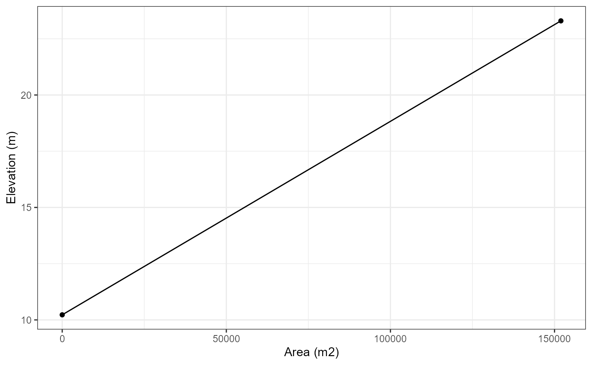
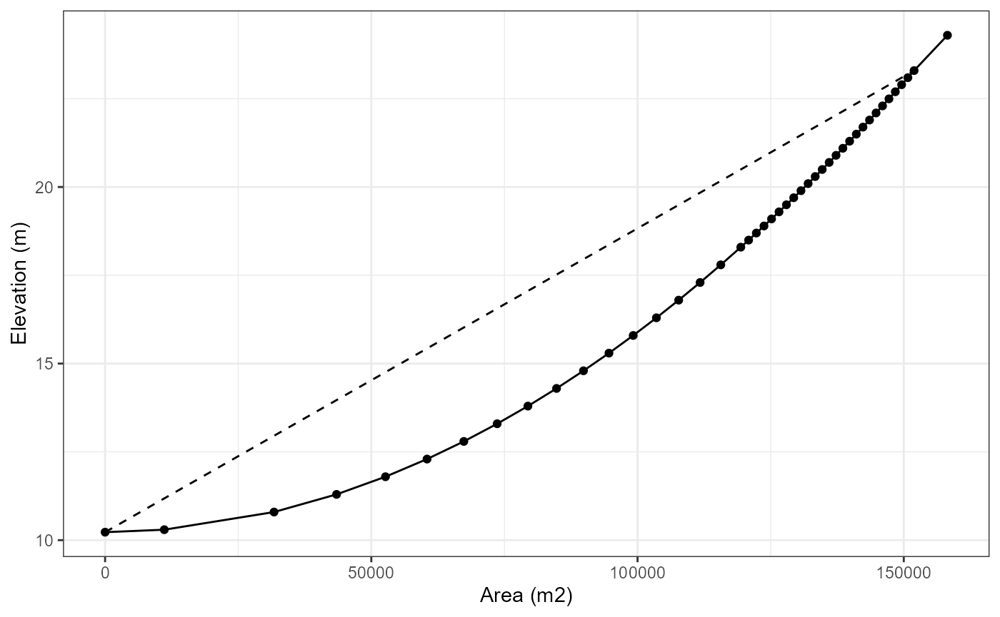
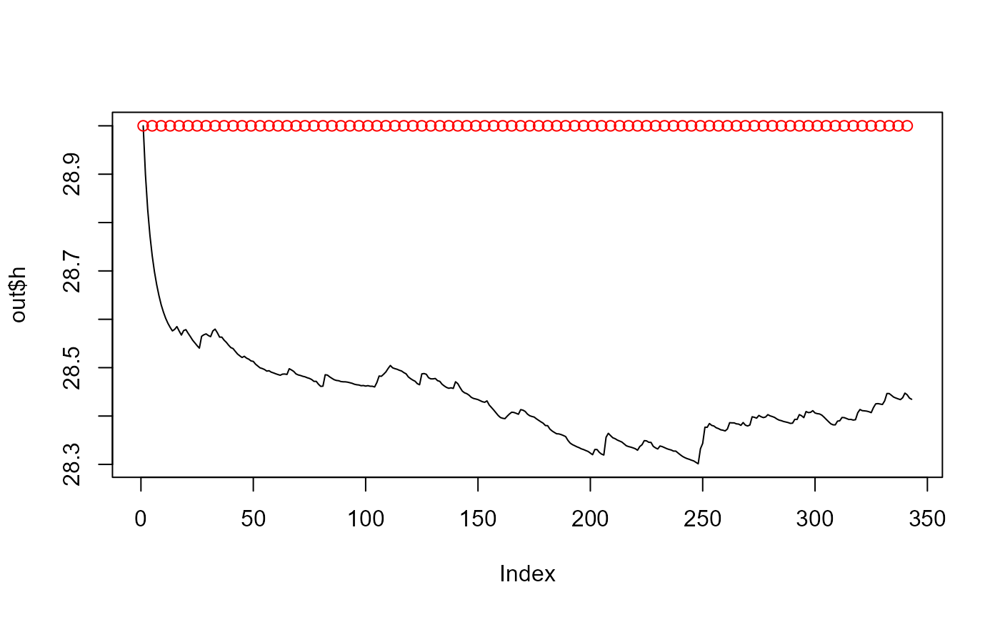
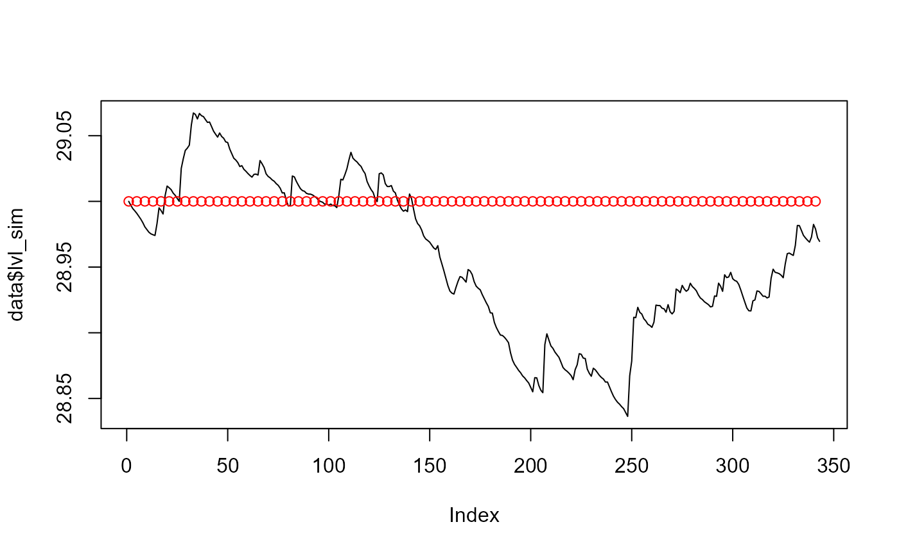
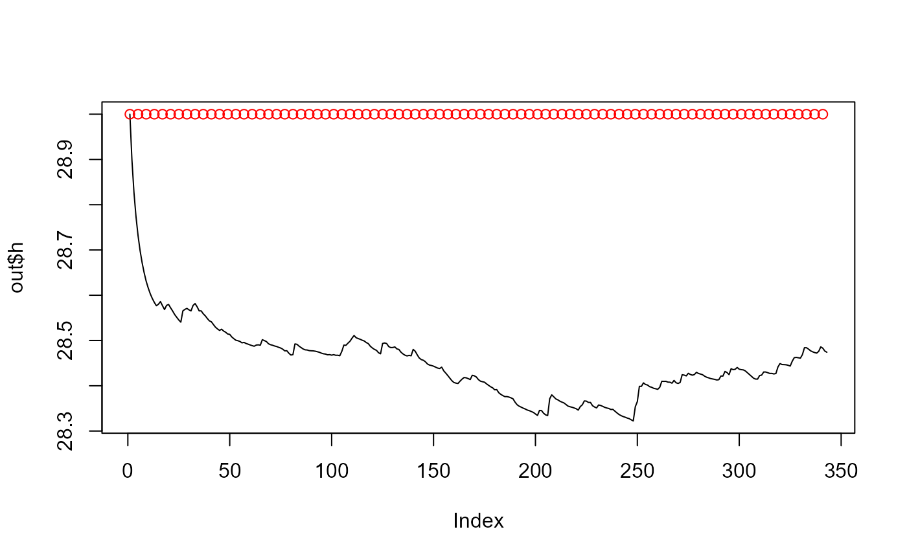
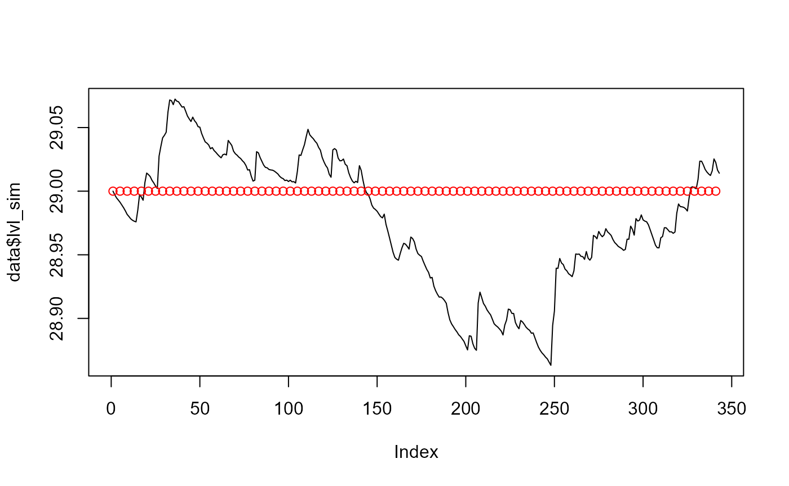
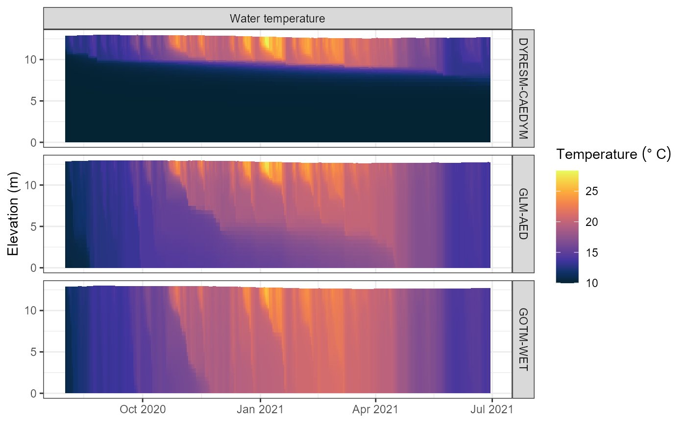

# Set up AEME for a new lake

Setting up the Aquatic Ecosystem Model Ensemble is straight forward and
can be done in a few steps. This vignette will guide you through the
process of setting up the model for a lake in New Zealand.

``` r
library(AEME)
#> 
#> Attaching package: 'AEME'
#> The following object is masked from 'package:stats':
#> 
#>     time
library(sf) # For spatial data
#> Linking to GEOS 3.13.1, GDAL 3.11.4, PROJ 9.7.0; sf_use_s2() is TRUE
library(tmap) # For mapping
tmap_mode("view") # Set tmap mode to interactive view model
#> ℹ tmap modes "plot" - "view"
#> ℹ toggle with `tmap::ttm()`
#> This message is displayed once per session.
tmap_options(basemap.server = "OpenStreetMap") # Set the basemap to OpenStreetMap
```

## Lake data

The first step is to define the lake data. This includes the location of
the lake, the depth and area of the lake, and the elevation of the lake.

``` r
# Define the location of the lake
lat <- -36.8898
lon <- 174.46898
```

``` r
# View the location of the lake in a map

coords <- data.frame(lat = lat, lon = lon) |> 
  st_as_sf(coords = c("lon", "lat"), crs = 4326)

tm_shape(coords) +
  tm_bubbles() +
  tm_view(set_view = c(lon, lat, 16))
```

### Get lake shapefile

If you have a shapefile for the lake, you can use the `sf` package to
read it in. However, if you do not have a shapefile you can download
most lake shapefiles from
[OpenStreetMap](https://www.openstreetmap.org/) using the
[`osmdata`](https://docs.ropensci.org/osmdata/) package.

``` r
library(osmdata)
#> Data (c) OpenStreetMap contributors, ODbL 1.0. https://www.openstreetmap.org/copyright

# Get lake shapefile
osm_data <- opq(bbox = "New Zealand") |> 
  add_osm_feature(key = "name", value = "Lake Wainamu") |> 
  osmdata_sf()

# Extract lake polygon
lake <- osm_data$osm_multipolygons |> 
  st_make_valid()
lake
#> Simple feature collection with 1 feature and 8 fields
#> Geometry type: POLYGON
#> Dimension:     XY
#> Bounding box:  xmin: 174.4645 ymin: -36.89192 xmax: 174.4756 ymax: -36.88651
#> Geodetic CRS:  WGS 84
#>            osm_id         name name:mi natural ref:linz:place_id         type
#> 16007084 16007084 Lake Wainamu Wainamu   water             26277 multipolygon
#>           wikidata       wikipedia                       geometry
#> 16007084 Q85173632 en:Lake Wainamu POLYGON ((174.4665 -36.8869...
```

Visualise the lake shapefile on a map.

``` r
# View the lake shapefile
tm_shape(lake) +
  tm_borders(lwd = 2) 
```

As you can see it matches the location of the lake we defined earlier
and that it perfectly matches the outline from the OpenStreetMap
polygon.

### Depth and area data

The depth and area of the lake are required for the model. These can be
obtained from a variety of sources. For this example, we will use the
known depth of the lake (13.07 m), however for the area we will
calculate this from the shapefile.

``` r
# Set depth & area
depth <- 13.07 # Depth of the lake in metres
```

``` r
# Calculate the area of the lake in m2
area <- st_area(lake) |> 
  units::set_units("m^2") |> 
  as.numeric()
area
#> [1] 156875.6
```

### Elevation data

Elevation data can be acquired for New Zealand from the digital
elevation model hosted on the LINZ Data Service. There is a wrapper
function for this in the `aemetools` package. This requires an API key
from LINZ.

You can easily create a key on the LINZ website:
<https://data.linz.govt.nz/> or use the function within the `aemetools`
package to create one.

``` r
aemetools::create_linz_key()
```

Then adding it to your `.Renviron` file.

``` r
# Add the LINZ API key to your .Renviron file
aemetools::add_linz_key(key = "your_key_here")
```

The `get_dem_value` function will return the elevation of the lake in
metres above sea level.

``` r
# Get the elevation of the lake
key <- Sys.getenv("LINZ_KEY")
elevation <- aemetools::get_dem_value(lat = lat, lon = lon, key = key)
elevation # in metres above sea level
#> [1] 29
```

``` r
elevation
#> [1] 29
```

We will now create a list of the lake data. This will be used to
construct the AEME object.

``` r
# Define lake list
lake <- list(
    name = "Wainamu",
    id = 45819,
    latitude = lat,
    longitude = lon,
    elevation = elevation,
    depth = depth,
    area = area
  )
```

## Time data

The time data is required for the model. This includes the start and
stop times for the model run.

``` r
# Define start and stop times
start <- "2020-08-01 00:00:00"
stop <- "2021-06-30 00:00:00"

time <- list(
    start = start,
    stop = stop
  )
```

## Input data

### Meteorological data

#### Download ERA5 data

We will use the `aemetools` package to download the ERA5 meteorological
data for the location of our lake. This works for all locations around
the world. However, it’s date range is only from 1900-2021.

``` r
# Get ERA5 meteorological data
met <- aemetools::get_era5_isimip_point(lat = lat, lon = lon, years = 2020:2021)
#> INFO [2026-01-19 23:48:45] job submitted
#> INFO [2026-01-19 23:48:49] job updated
#> INFO [2026-01-19 23:48:53] job updated
#> INFO [2026-01-19 23:48:57] job updated
#> INFO [2026-01-19 23:49:01] job updated
#> INFO [2026-01-19 23:49:06] job updated
#> INFO [2026-01-19 23:49:10] job updated
#> INFO [2026-01-19 23:49:14] job updated
#> INFO [2026-01-19 23:49:18] job updated
#> INFO [2026-01-19 23:49:22] job updated
#> INFO [2026-01-19 23:49:26] job updated
#> INFO [2026-01-19 23:49:30] job updated
#> INFO [2026-01-19 23:49:35] job updated
#> INFO [2026-01-19 23:49:39] job updated
#> INFO [2026-01-19 23:49:43] job updated
#> INFO [2026-01-19 23:49:47] job updated
#> INFO [2026-01-19 23:49:51] job updated
#> INFO [2026-01-19 23:49:55] job updated
#> INFO [2026-01-19 23:49:59] job updated
#> INFO [2026-01-19 23:50:04] job updated
#> INFO [2026-01-19 23:50:09] job updated
#> INFO [2026-01-19 23:50:13] job updated
#> INFO [2026-01-19 23:50:17] job updated
#> INFO [2026-01-19 23:50:21] job updated
#> INFO [2026-01-19 23:50:25] job updated
#> INFO [2026-01-19 23:50:29] job updated
#> INFO [2026-01-19 23:50:33] job updated
#> INFO [2026-01-19 23:50:38] job updated
#> INFO [2026-01-19 23:50:42] job updated
#> INFO [2026-01-19 23:50:46] job updated
#> INFO [2026-01-19 23:50:46] downloading
#> INFO [2026-01-19 23:50:47] extracting
```

View the summary of the meteorological data. The units have been
converted to more common units used in aquatic ecosystem modelling.

``` r
# Summary of meteorological data
summary(met)
#>       Date              MET_tmpair       MET_pprain         MET_wndspd    
#>  Min.   :2011-01-01   Min.   : 6.669   Min.   :  0.0000   Min.   : 1.379  
#>  1st Qu.:2013-10-01   1st Qu.:13.890   1st Qu.:  0.1170   1st Qu.: 4.133  
#>  Median :2016-07-01   Median :16.001   Median :  0.6145   Median : 5.872  
#>  Mean   :2016-07-01   Mean   :16.246   Mean   :  3.1857   Mean   : 6.200  
#>  3rd Qu.:2019-04-01   3rd Qu.:18.627   3rd Qu.:  3.3404   3rd Qu.: 7.938  
#>  Max.   :2021-12-31   Max.   :22.957   Max.   :127.5880   Max.   :15.542  
#>    MET_radswd      MET_prsttn       MET_radlwd      MET_humrel   
#>  Min.   : 13.2   Min.   : 98490   Min.   :260.6   Min.   :51.04  
#>  1st Qu.:111.8   1st Qu.:100934   1st Qu.:318.0   1st Qu.:71.57  
#>  Median :177.4   Median :101459   Median :335.3   Median :77.22  
#>  Mean   :187.3   Mean   :101421   Mean   :335.9   Mean   :77.05  
#>  3rd Qu.:258.5   3rd Qu.:101927   3rd Qu.:352.8   3rd Qu.:82.67  
#>  Max.   :383.9   Max.   :103515   Max.   :419.3   Max.   :95.49
```

The depth of this lake is 13.07 m, the area is 152343 m2, and the light
extinction coefficient (Kw) is 1.31 m-1.

``` r
# Set Kw
Kw <- 1.31 # Light extinction coefficient in m-1
```

### Hypsograph data

If you have hypsograph data for the lake, you can use it as input for
the model. This is a critical input for the model, as it defines the
relationship between the lake area and the lake elevation.

However, if you do not have hypsograph data, the model will use a simple
cone-shaped hypsograph based on the lake depth and area. This is not
ideal, but it will work for this example.

Required column names for the hypsograph data are `area`, `elev`, and
`depth`.

``` r
# Generate a simple hypsograph
hypsograph_simple <- data.frame(area = c(area, 0), 
                         elev = c(elevation, elevation - depth),
                         depth = c(0, -depth))
hypsograph_simple
#>       area  elev  depth
#> 1 156875.6 29.00   0.00
#> 2      0.0 15.93 -13.07
```

``` r
# Plot the hypsograph
library(ggplot2)

ggplot(hypsograph_simple, aes(x = area, y = elev)) +
  geom_line() +
  geom_point() +
  xlab("Area (m2)") +
  ylab("Elevation (m)") +
  theme_bw()
```



As you can see, the hypsograph is a simple cone shape. Ideally, you
would have more detailed hypsograph data for your lake.

If you have information regarding the maximum depth of the lake, the
surface area and an estimate of volume development, you can generate a
hypsograph using the `generate_hypsograph` function. The
`volume_development` parameter is a scaling factor for the volume
development of the lake. Values below 1.5 are lakes with a concave
hypsograph, values above 1.5 are lakes with a convex hypsograph, and
values of 1.5 are lakes with a linear hypsograph.

For Wainamu Lake, we will use a volume development of 1.62 which was
calculated from a bathymetry survey of the lake. You can view this on
the [LERNZmp platform](https://limnotrack.shinyapps.io/LERNZmp/).

``` r

# Generate a hypsograph
hypsograph <- generate_hypsograph(max_depth = depth, surface_area = area,
                                  volume_development = 0.5, elev = elevation,
                                  ext_elev = 1)

ggplot(hypsograph, aes(x = area, y = elev)) +
  geom_line() +
  geom_point() +
  geom_line(data = hypsograph_simple, aes(x = area, y = elev), 
            linetype = "dashed") +
  xlab("Area (m2)") +
  ylab("Elevation (m)") +
  theme_bw()
```



``` r
# Define input list
input <- list(
    init_depth = depth,
    hypsograph = hypsograph,
    meteo = met,
    use_lw = TRUE,
    Kw = Kw
  )
```

## Construct the AEME object

The `aeme_constructor` function will take the input data and construct
the AEME object. The minimum inputs are the `lake`, `time`, and `input`
data.

``` r
# Construct AEME object
aeme <- aeme_constructor(lake = lake, 
                         time = time,
                         input = input)
#> Time step missing. Setting time step to 3600 seconds.
#> Spin up for models missing. Setting spin up to 2 for all models.
```

### View AEME object

The AEME object can be inspected by printing it to the console. This
will show the inputs that have been use to construct the object along
with default values for inputs not provided.

``` r
aeme
#>             AEME 
#> -------------------------------------------------------------------
#>   Lake
#> Wainamu (ID: 45819); Lat: -36.89; Lon: 174.47; Elev: 29m; Depth: 13.07m;
#> Area: 156875.6 m2
#> -------------------------------------------------------------------
#>   Time
#> Start: 2020-08-01; Stop: 2021-06-30; Time step: 3600
#>  Spin up (days): GLM: 2; GOTM: 2; DYRESM: 2
#> -------------------------------------------------------------------
#>   Configuration
#>     Model controls: Absent 
#>     Use biogeochemical model: No
#>           Physical   |   Biogeochemical
#> DY-CD    : Absent     |   Absent 
#> GLM-AED  : Absent     |   Absent 
#> GOTM-WET : Absent     |   Absent 
#> -------------------------------------------------------------------
#>   Observations
#> Lake: Absent; Level: Absent
#> -------------------------------------------------------------------
#>   Input
#> Inital profile: Absent; Inital depth: 13.07m; Hypsograph: Present (n=44);
#> Meteo: Present; Use longwave: TRUE; Kw: 1.31
#> -------------------------------------------------------------------
#>   Inflows
#> Data: Absent; Scaling factors: DY-CD: 1; GLM-AED: 1; GOTM-WET: 1
#> -------------------------------------------------------------------
#>   Outflows
#> Data: Absent; Scaling factors: DY-CD: 1; GLM-AED: 1; GOTM-WET: 1
#> -------------------------------------------------------------------
#>   Water balance
#> Method: 2; Use: obs; Modelled: Absent; Water balance: Absent
#> -------------------------------------------------------------------
#>   Parameters: 
#> Number of parameters: 0
#> -------------------------------------------------------------------
#>   Output: 
#> 
#> DY-CD:    
#> GLM-AED:  
#> GOTM-WET:
```

In the configuration section of the output, under “Physical” and
“Biogeochemical” for each model are labelle “Absent”. This is because
the model configurations have not been built. This is done in the next
step.

## Building the AEME ensemble

### Model controls

The model controls are the settings for the AEME ensemble. These are
read in from a CSV file. The default CSV file is stored within the
package and can be accessed using the `get_model_controls` function. It
has the argument `use_bgc` which is a logical value to indicate whether
to simulate the default biogeochemical variables with the hydrodynamic
variables or just the hydrodynamic variables.

The model controls has the following columns:

- `var_aeme`: The variable name in the AEME object
- `simulate`: Whether to simulate the variable
- `inf_default`: The default inflow value
- `initial_wc`: The initial water column value
- `initial_sed`: The initial sediment value

``` r
# Get model controls
model_controls <- get_model_controls()
model_controls
#>       var_aeme simulate inf_default initial_wc initial_sed conversion_aed
#> 1      CAR_doc     TRUE        0.00      0.500       1e+06     0.01201100
#> 2      CAR_poc     TRUE        0.00      0.200       1e-01     0.01201100
#> 3      CHM_oxy     TRUE       10.00     10.000       1e+01     0.03200000
#> 4   CHM_oxycln     TRUE          NA         NA          NA             NA
#> 5   CHM_oxyepi     TRUE          NA         NA          NA             NA
#> 6   CHM_oxyhyp     TRUE          NA         NA          NA             NA
#> 7   CHM_oxymet     TRUE          NA         NA          NA             NA
#> 8   CHM_oxymom     TRUE          NA         NA          NA             NA
#> 9   CHM_oxynal     TRUE          NA         NA          NA             NA
#> 10    CHM_salt     TRUE        0.00      0.000       0e+00     1.00000000
#> 11  HYD_ctrbuy     TRUE          NA         NA          NA     1.00000000
#> 12    HYD_dens     TRUE          NA         NA          NA     1.00000000
#> 13  HYD_epidep     TRUE          NA         NA          NA     1.00000000
#> 14  HYD_hypdep     TRUE          NA         NA          NA     1.00000000
#> 15  HYD_schstb     TRUE          NA         NA          NA     1.00000000
#> 16   HYD_strat     TRUE          NA         NA          NA     1.00000000
#> 17    HYD_temp     TRUE       15.00     11.000          NA     1.00000000
#> 18  HYD_thmcln     TRUE          NA         NA          NA     1.00000000
#> 19    LKE_tli3     TRUE          NA         NA          NA     1.00000000
#> 20    LKE_tli4     TRUE          NA         NA          NA     1.00000000
#> 21    LKE_tlic     TRUE          NA         NA          NA     1.00000000
#> 22    LKE_tlin     TRUE          NA         NA          NA     1.00000000
#> 23    LKE_tlip     TRUE          NA         NA          NA     1.00000000
#> 24   LKE_tlise     TRUE          NA         NA          NA     1.00000000
#> 25     NCS_ss1     TRUE        5.00      3.000       3e-01     1.00000000
#> 26     NIT_amm     TRUE        0.05      0.020       1e+06     0.01400670
#> 27     NIT_don     TRUE        0.00      0.300       1e+06     0.01400670
#> 28     NIT_nit     TRUE        0.20      0.015       1e+06     0.01400670
#> 29     NIT_pon     TRUE        0.00      0.100       1e-03     0.01400670
#> 30      NIT_tn     TRUE          NA         NA          NA     0.01400670
#> 31     PHS_dop     TRUE        0.00      0.010       1e+06     0.03097376
#> 32     PHS_frp     TRUE        0.00      0.010       1e+06     0.03097376
#> 33     PHS_pip     TRUE        0.00      0.002       5e-03     0.03097376
#> 34     PHS_pop     TRUE        0.00      0.010       1e-04     0.03097376
#> 35      PHS_tp     TRUE          NA         NA          NA     0.03097376
#> 36   PHY_cyano     TRUE        0.10      1.000       0e+00     1.00000000
#> 37  PHY_diatom     TRUE        0.10      1.000       0e+00     1.00000000
#> 38   PHY_green     TRUE        0.10      1.000       0e+00     1.00000000
#> 39   PHY_tchla     TRUE          NA         NA          NA     1.00000000
#> 40    RAD_extc     TRUE          NA         NA          NA     1.00000000
#> 41     RAD_par     TRUE          NA         NA          NA     1.00000000
#> 42     SIL_rsi     TRUE        0.00      1.000       1e+07     1.00000000
#> 43    ZOO_zoo1     TRUE        0.10      1.000       0e+00     1.00000000
#> 44     BAC_bac    FALSE        0.00         NA          NA     1.00000000
#> 45     CAR_ch4    FALSE          NA         NA          NA     1.00000000
#> 46     CAR_dic    FALSE       10.00      2.000       1e+06     0.01201100
#> 47    CAR_docr    FALSE        0.00         NA       1e+06     0.01201100
#> 48      CAR_pH    FALSE        7.00      7.000       7e+00     1.00000000
#> 49    CAR_pocr    FALSE        0.00         NA          NA     0.01201100
#> 50  CHM_oxysat    FALSE          NA         NA          NA             NA
#> 51   CLM_clam1    FALSE        0.00         NA          NA     1.00000000
#> 52   CLM_clam2    FALSE        0.00         NA          NA     1.00000000
#> 53   CLM_clam3    FALSE        0.00         NA          NA     1.00000000
#> 54   FSH_fish1    FALSE        0.00      1.000          NA     1.00000000
#> 55   FSH_fish2    FALSE        0.00         NA          NA     1.00000000
#> 56   FSH_fish3    FALSE        0.00         NA          NA     1.00000000
#> 57   FSH_jelly    FALSE        0.00         NA          NA     1.00000000
#> 58    HYD_flow    FALSE          NA         NA          NA     1.00000000
#> 59 MAC_macalg1    FALSE        0.00         NA          NA     1.00000000
#> 60 MAC_macalg2    FALSE        0.00         NA          NA     1.00000000
#> 61 MAC_macalg3    FALSE        0.00         NA          NA     1.00000000
#> 62 MAC_macalg4    FALSE        0.00         NA          NA     1.00000000
#> 63     NCS_iss    FALSE          NA         NA          NA     1.00000000
#> 64     NCS_ss2    FALSE        5.00      3.000       3e-01     1.00000000
#> 65     NCS_ss3    FALSE        5.00         NA          NA     1.00000000
#> 66     NCS_ss4    FALSE        5.00         NA          NA     1.00000000
#> 67     NCS_ss5    FALSE        5.00         NA          NA     1.00000000
#> 68     NCS_ss6    FALSE        5.00         NA          NA     1.00000000
#> 69     NCS_tss    FALSE          NA         NA          NA     1.00000000
#> 70    NIT_donr    FALSE        0.00         NA          NA     0.01400670
#> 71     NIT_pin    FALSE          NA      0.010       1e-03     0.01400670
#> 72    NIT_ponr    FALSE        0.00         NA          NA     0.01400670
#> 73    PHS_dopr    FALSE        0.00         NA          NA     0.03097376
#> 74    PHS_popr    FALSE        0.00         NA          NA     0.03097376
#> 75   PHY_crypt    FALSE        0.10      1.000       0e+00     1.00000000
#> 76   PHY_dinof    FALSE        0.10      1.000       0e+00     1.00000000
#> 77   PHY_mdiat    FALSE        0.10      1.000       0e+00     1.00000000
#> 78   PHY_nodul    FALSE        0.10      1.000       0e+00     1.00000000
#> 79  RAD_secchi    FALSE          NA         NA          NA     1.00000000
#> 80     TRC_col    FALSE        0.00      0.000       0e+00     1.00000000
#> 81    ZOO_zoo2    FALSE        0.10         NA          NA     1.00000000
#> 82    ZOO_zoo3    FALSE        0.10         NA          NA     1.00000000
#> 83    ZOO_zoo4    FALSE        0.10         NA          NA     1.00000000
#> 84    ZOO_zoo5    FALSE        0.10         NA          NA     1.00000000
```

### Build the ensemble

The `build_aeme` function will take the AEME object and the model
controls and build the ensemble. The `model` argument is a character
vector of the models to include in the ensemble. The models available
are `dy_cd`, `glm_aed`, and `gotm_wet`.

``` r
# Select models
model <- c("dy_cd", "glm_aed", "gotm_wet")
```

``` r

# Path for model directory
path <- "aeme"

# Build ensemble
aeme <- build_aeme(aeme = aeme, model = model, model_controls = model_controls, 
                   use_bgc = F, path = path)
#> ℹ No water level present. Using constant water level.
#> ℹ Insufficient lake temperature observations to estimate surface temperature.
#>   Using Stefan & Preud'homme (2007) method.
#> Parameters: C = 0.5 , h_inv = 28.5
```



    #> Parameters: C = 0.5 , h_inv = 28.5 
    #> Parameters: C = 0.501 , h_inv = 28.5 
    #> Parameters: C = 0.499 , h_inv = 28.5 
    #> Parameters: C = 0.5 , h_inv = 28.501 
    #> Parameters: C = 0.5 , h_inv = 28.499 
    #> Parameters: C = 0.4358 , h_inv = 29 
    #> Parameters: C = 0.4368 , h_inv = 29 
    #> Parameters: C = 0.4348 , h_inv = 29 
    #> Parameters: C = 0.4358 , h_inv = 29 
    #> Parameters: C = 0.4358 , h_inv = 28.999 
    #> Parameters: C = 0.3889 , h_inv = 29 
    #> Parameters: C = 0.3899 , h_inv = 29 
    #> Parameters: C = 0.3879 , h_inv = 29 
    #> Parameters: C = 0.3889 , h_inv = 29 
    #> Parameters: C = 0.3889 , h_inv = 28.999 
    #> Parameters: C = 0.2012 , h_inv = 29 
    #> Parameters: C = 0.2022 , h_inv = 29 
    #> Parameters: C = 0.2002 , h_inv = 29 
    #> Parameters: C = 0.2012 , h_inv = 29 
    #> Parameters: C = 0.2012 , h_inv = 28.999 
    #> Parameters: C = 0.001 , h_inv = 29 
    #> Parameters: C = 0.002 , h_inv = 29 
    #> Parameters: C = 0.001 , h_inv = 29 
    #> Parameters: C = 0.001 , h_inv = 29 
    #> Parameters: C = 0.001 , h_inv = 28.999
    #> Optimization Complete:
    #>   Best C: 0.001
    #>   Best h_inv: 29
    #>   Final RMSE: 0.0725


    #> Parameters: C = 0.5 , h_inv = 28.5


    #> Parameters: C = 0.5 , h_inv = 28.5 
    #> Parameters: C = 0.501 , h_inv = 28.5 
    #> Parameters: C = 0.499 , h_inv = 28.5 
    #> Parameters: C = 0.5 , h_inv = 28.501 
    #> Parameters: C = 0.5 , h_inv = 28.499 
    #> Parameters: C = 0.4358 , h_inv = 29 
    #> Parameters: C = 0.4368 , h_inv = 29 
    #> Parameters: C = 0.4348 , h_inv = 29 
    #> Parameters: C = 0.4358 , h_inv = 29 
    #> Parameters: C = 0.4358 , h_inv = 28.999 
    #> Parameters: C = 0.3889 , h_inv = 29 
    #> Parameters: C = 0.3899 , h_inv = 29 
    #> Parameters: C = 0.3879 , h_inv = 29 
    #> Parameters: C = 0.3889 , h_inv = 29 
    #> Parameters: C = 0.3889 , h_inv = 28.999 
    #> Parameters: C = 0.2012 , h_inv = 29 
    #> Parameters: C = 0.2022 , h_inv = 29 
    #> Parameters: C = 0.2002 , h_inv = 29 
    #> Parameters: C = 0.2012 , h_inv = 29 
    #> Parameters: C = 0.2012 , h_inv = 28.999 
    #> Parameters: C = 0.001 , h_inv = 29 
    #> Parameters: C = 0.002 , h_inv = 29 
    #> Parameters: C = 0.001 , h_inv = 29 
    #> Parameters: C = 0.001 , h_inv = 29 
    #> Parameters: C = 0.001 , h_inv = 28.999
    #> Optimization Complete:
    #>   Best C: 0.001
    #>   Best h_inv: 29
    #>   Final RMSE: 0.0725



    #> Parameters: C = 0.5 , h_inv = 28.5



    #> Parameters: C = 0.5 , h_inv = 28.5 
    #> Parameters: C = 0.501 , h_inv = 28.5 
    #> Parameters: C = 0.499 , h_inv = 28.5 
    #> Parameters: C = 0.5 , h_inv = 28.501 
    #> Parameters: C = 0.5 , h_inv = 28.499 
    #> Parameters: C = 0.4403 , h_inv = 29 
    #> Parameters: C = 0.4413 , h_inv = 29 
    #> Parameters: C = 0.4393 , h_inv = 29 
    #> Parameters: C = 0.4403 , h_inv = 29 
    #> Parameters: C = 0.4403 , h_inv = 28.999 
    #> Parameters: C = 0.3978 , h_inv = 29 
    #> Parameters: C = 0.3988 , h_inv = 29 
    #> Parameters: C = 0.3968 , h_inv = 29 
    #> Parameters: C = 0.3978 , h_inv = 29 
    #> Parameters: C = 0.3978 , h_inv = 28.999 
    #> Parameters: C = 0.2279 , h_inv = 29 
    #> Parameters: C = 0.2289 , h_inv = 29 
    #> Parameters: C = 0.2269 , h_inv = 29 
    #> Parameters: C = 0.2279 , h_inv = 29 
    #> Parameters: C = 0.2279 , h_inv = 28.999 
    #> Parameters: C = 0.001 , h_inv = 29 
    #> Parameters: C = 0.002 , h_inv = 29 
    #> Parameters: C = 0.001 , h_inv = 29 
    #> Parameters: C = 0.001 , h_inv = 29 
    #> Parameters: C = 0.001 , h_inv = 28.999 
    #> Parameters: C = 0.001 , h_inv = 29 
    #> Parameters: C = 0.002 , h_inv = 29 
    #> Parameters: C = 0.001 , h_inv = 29 
    #> Parameters: C = 0.001 , h_inv = 29 
    #> Parameters: C = 0.001 , h_inv = 28.999
    #> Optimization Complete:
    #>   Best C: 0.001
    #>   Best h_inv: 29
    #>   Final RMSE: 0.0575



    #> ℹ Correcting water balance using estimated outflows (method = 2).
    #> ℹ Calculating lake level using lake depth and a sinisoidal function.
    #> ℹ Building DYRESM-CAEDYM for lake wainamu
    #> ℹ Copied in DYRESM .par file
    #> ℹ Writing DYRESM configuration file
    #> ℹ Writing DYRESM-CAEDYM control file
    #> ℹ Building GLM-AED2 for lake wainamu
    #> ℹ Copied in GLM nml file
    #> ℹ Building GOTM-WET model for lake wainamu
    #> ℹ Copied in GOTM configuration files
    #> ✔ GOTM YAML validation completed - no issues detected.
    #> ✔ GLM nml validation completed - no issues detected.

    print(aeme)
    #>             AEME 
    #> -------------------------------------------------------------------
    #>   Lake
    #> Wainamu (ID: 45819); Lat: -36.89; Lon: 174.47; Elev: 29m; Depth: 13.07m;
    #> Area: 156875.6 m2
    #> -------------------------------------------------------------------
    #>   Time
    #> Start: 2020-08-01; Stop: 2021-06-30; Time step: 3600
    #>  Spin up (days): GLM: 2; GOTM: 2; DYRESM: 2
    #> -------------------------------------------------------------------
    #>   Configuration
    #>     Model controls: Present
    #>     Use biogeochemical model: No
    #>           Physical   |   Biogeochemical
    #> DY-CD    : Present    |   Present
    #> GLM-AED  : Present    |   Absent 
    #> GOTM-WET : Present    |   Present
    #> -------------------------------------------------------------------
    #>   Observations
    #> Lake: Absent; Level: Absent
    #> -------------------------------------------------------------------
    #>   Input
    #> Inital profile: Present; Inital depth: 13.07m; Hypsograph: Present (n=44);
    #> Meteo: Present; Use longwave: TRUE; Kw: 1.31
    #> -------------------------------------------------------------------
    #>   Inflows
    #> Data: Absent; Scaling factors: DY-CD: 1; GLM-AED: 1; GOTM-WET: 1
    #> -------------------------------------------------------------------
    #>   Outflows
    #> Data: Present; Scaling factors: DY-CD: 1; GLM-AED: 1; GOTM-WET: 1
    #> -------------------------------------------------------------------
    #>   Water balance
    #> Method: 2; Use: obs; Modelled: Absent; Water balance: Present
    #> -------------------------------------------------------------------
    #>   Parameters: 
    #> Number of parameters: 0
    #> -------------------------------------------------------------------
    #>   Output: 
    #> 
    #> DY-CD:    
    #> GLM-AED:  
    #> GOTM-WET:

By default, the `build_aeme` function will build the file configuration
for each model. This will create the necessary files for each model to
run. The files are also stored in the `aeme` object in the
`configuration` slot with a list for hydrodynamic and ecosystem model
configurations.

``` r
# View the files
cfg <- configuration(aeme)
names(cfg[["glm_aed"]])
#> [1] "hydrodynamic" "bgc"
```

All of the information and data needed to run an ensemble of models is
now contained within the `aeme` object. This allows for easy storage of
all the data and also for easy sharing of the data with others. Sharing
the `aeme` object with others allows them to run the ensemble of models
without needing to reconstruct the object.

``` r
# Run the ensemble
aeme <- run_aeme(aeme = aeme, model = model, path = path)
#> ℹ Running models... (Have you tried parallelizing?) [2026-01-19 23:51:09]
#> → DYRESM-CAEDYM running... [2026-01-19 23:51:09]
#> ✔ DYRESM-CAEDYM run successful! [2026-01-19 23:51:36]
#> → GLM-AED running... [2026-01-19 23:51:36]
#> ✔ GLM-AED run successful! [2026-01-19 23:51:37]
#> → GOTM-WET running... [2026-01-19 23:51:37]
#> ✔ GOTM-WET run successful! [2026-01-19 23:51:37]
#> ✔ Model run complete! [2026-01-19 23:51:37]
#> ! The following variables are not available in model gotm_wet: RAD_extc
#> ! The following variables are not available in model gotm_wet: RAD_extc
```

### View the output

The output from the model run is stored in the `output` slot of the
`aeme` object. This is a list with a list for each model. The list
contains the output data from the model run.

``` r
# View the output
plot_output(aeme = aeme)
#> Warning: Removed 246 rows containing missing values or values outside the scale range
#> (`geom_col()`).
```



### Saving the AEME object

Saving the `aeme` object to a file can be done using the `saveRDS`
function. This will save the object to a file with the `.rds`.

``` r
# Save the AEME object
saveRDS(aeme, "aeme.rds")
```
