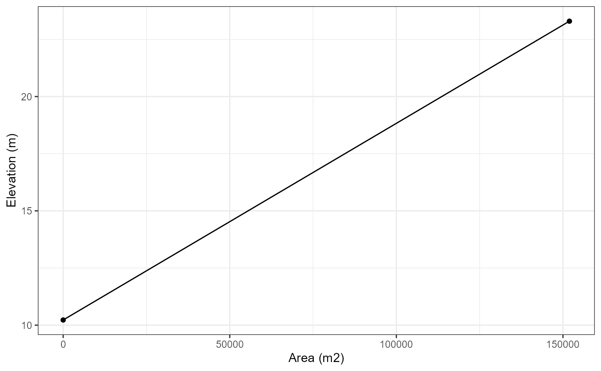
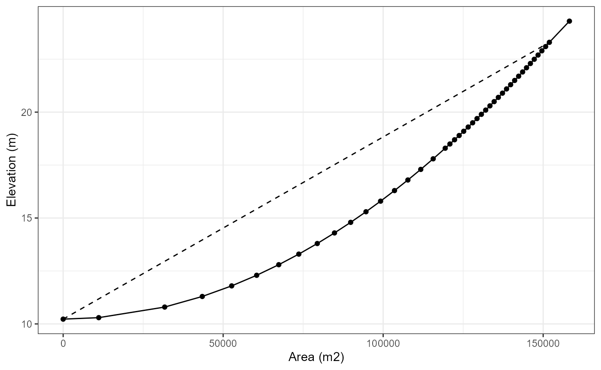
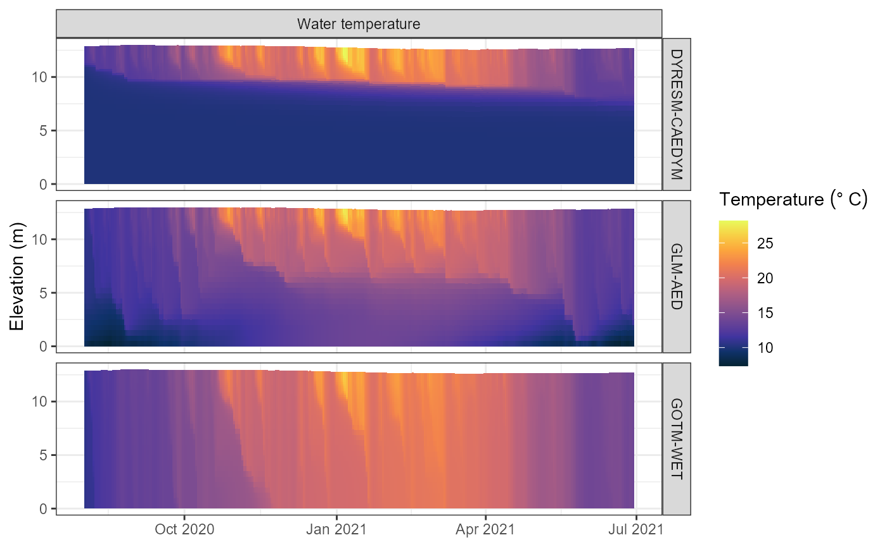

# Set up AEME for a new lake

Setting up the Aquatic Ecosystem Model Ensemble is straight forward and
can be done in a few steps. This vignette will guide you through the
process of setting up the model for a lake in New Zealand.

``` r

library(AEME)
#> 
#> Attaching package: 'AEME'
#> The following object is masked from 'package:stats':
#> 
#>     time
library(sf) # For spatial data
#> Linking to GEOS 3.14.1, GDAL 3.12.1, PROJ 9.7.1; sf_use_s2() is TRUE
library(tmap) # For mapping
#> Registered S3 method overwritten by 'stars':
#>   method                  from
#>   st_interpolate_aw.stars sf
tmap_mode("view") # Set tmap mode to interactive view model
#> ℹ tmap modes "plot" - "view"
#> ℹ toggle with `tmap::ttm()`
#> This message is displayed once per session.
tmap_options(basemap.server = "OpenStreetMap") # Set the basemap to OpenStreetMap
```

## Lake data

The first step is to define the lake data. This includes the location of
the lake, the depth and area of the lake, and the elevation of the lake.

``` r

# Define the location of the lake
lat <- -36.8898
lon <- 174.46898
```

``` r

# View the location of the lake in a map

coords <- data.frame(lat = lat, lon = lon) |> 
  st_as_sf(coords = c("lon", "lat"), crs = 4326)

tm_shape(coords) +
  tm_bubbles() +
  tm_view(set_view = c(lon, lat, 16))
```

### Get lake shapefile

If you have a shapefile for the lake, you can use the `sf` package to
read it in. However, if you do not have a shapefile you can download
most lake shapefiles from
[OpenStreetMap](https://www.openstreetmap.org/) using the
[`osmdata`](https://docs.ropensci.org/osmdata/) package.

``` r

library(osmdata)

# Get lake shapefile
osm_data <- opq(bbox = "New Zealand") |> 
  add_osm_feature(key = "name", value = "Lake Wainamu") |> 
  osmdata_sf()

# Extract lake polygon
lake <- osm_data$osm_multipolygons |> 
  st_make_valid()
lake
```

Visualise the lake shapefile on a map.

``` r

# View the lake shapefile
tm_shape(lake) +
  tm_borders(lwd = 2) 
```

As you can see it matches the location of the lake we defined earlier
and that it perfectly matches the outline from the OpenStreetMap
polygon.

### Depth and area data

The depth and area of the lake are required for the model. These can be
obtained from a variety of sources. For this example, we will use the
known depth of the lake (13.07 m), however for the area we will
calculate this from the shapefile.

``` r

# Set depth & area
depth <- 13.07 # Depth of the lake in metres
```

``` r

# Calculate the area of the lake in m2
area <- st_area(lake) |> 
  units::set_units("m^2") |> 
  as.numeric()
area
#> [1] 151938.6
```

### Elevation data

Elevation data can be acquired for New Zealand from the digital
elevation model hosted on the LINZ Data Service. There is a wrapper
function for this in the `aemetools` package. This requires an API key
from LINZ.

You can easily create a key on the LINZ website:
<https://data.linz.govt.nz/> or use the function within the `aemetools`
package to create one.

``` r

aemetools::create_linz_key()
```

Then adding it to your `.Renviron` file.

``` r

# Add the LINZ API key to your .Renviron file
aemetools::add_linz_key(key = "your_key_here")
```

The `get_dem_value` function will return the elevation of the lake in
metres above sea level.

``` r

# Get the elevation of the lake
key <- Sys.getenv("LINZ_KEY")
elevation <- aemetools::get_dem_value(lat = lat, lon = lon, key = key)
elevation # in metres above sea level
#> [1] 29
```

``` r

elevation
#> [1] 29
```

We will now create a list of the lake data. This will be used to
construct the AEME object.

``` r

# Define lake list
lake <- list(
    name = "Wainamu",
    id = 45819,
    latitude = lat,
    longitude = lon,
    elevation = elevation,
    depth = depth,
    area = area
  )
```

## Time data

The time data is required for the model. This includes the start and
stop times for the model run.

``` r

# Define start and stop times
start <- "2020-08-01 00:00:00"
stop <- "2021-06-30 00:00:00"

time <- list(
    start = start,
    stop = stop
  )
```

## Input data

### Meteorological data

#### Download ERA5 data

We will use the `aemetools` package to download the ERA5 meteorological
data for the location of our lake. This works for all locations around
the world. However, its date range is only from 1900-2021.

``` r

# Get ERA5 meteorological data
met <- aemetools::get_era5_isimip_point(lat = lat, lon = lon, years = 2020:2021)
#> INFO [2026-10-09 04:09:43] job submitted
#> INFO [2026-10-09 04:09:43] downloading
#> INFO [2026-10-09 04:09:45] extracting
```

View the summary of the meteorological data. The units have been
converted to more common units used in aquatic ecosystem modelling.

``` r

# Summary of meteorological data
summary(met)
#>       Date              MET_tmpair       MET_pprain         MET_wndspd    
#>  Min.   :2011-01-01   Min.   : 6.669   Min.   :  0.0000   Min.   : 1.379  
#>  1st Qu.:2013-10-01   1st Qu.:13.890   1st Qu.:  0.1170   1st Qu.: 4.133  
#>  Median :2016-07-01   Median :16.001   Median :  0.6145   Median : 5.872  
#>  Mean   :2016-07-01   Mean   :16.246   Mean   :  3.1857   Mean   : 6.200  
#>  3rd Qu.:2019-04-01   3rd Qu.:18.627   3rd Qu.:  3.3404   3rd Qu.: 7.938  
#>  Max.   :2021-12-31   Max.   :22.957   Max.   :127.5880   Max.   :15.542  
#>    MET_radswd      MET_prsttn       MET_radlwd      MET_humrel   
#>  Min.   : 13.2   Min.   : 98490   Min.   :260.6   Min.   :51.04  
#>  1st Qu.:111.8   1st Qu.:100934   1st Qu.:318.0   1st Qu.:71.57  
#>  Median :177.4   Median :101459   Median :335.3   Median :77.22  
#>  Mean   :187.3   Mean   :101421   Mean   :335.9   Mean   :77.05  
#>  3rd Qu.:258.5   3rd Qu.:101927   3rd Qu.:352.8   3rd Qu.:82.67  
#>  Max.   :383.9   Max.   :103515   Max.   :419.3   Max.   :95.49
```

The depth of this lake is 13.07 m, the area is 152343 m2, and the light
extinction coefficient (Kw) is 1.31 m-1.

``` r

# Set Kw
Kw <- 1.31 # Light extinction coefficient in m-1
```

### Hypsograph data

If you have hypsograph data for the lake, you can use it as input for
the model. This is a critical input for the model, as it defines the
relationship between the lake area and the lake elevation.

However, if you do not have hypsograph data, the model will use a simple
cone-shaped hypsograph based on the lake depth and area. This is not
ideal, but it will work for this example.

Required column names for the hypsograph data are `area`, `elev`, and
`depth`.

``` r

# Generate a simple hypsograph
hypsograph_simple <- data.frame(area = c(area, 0), 
                         elev = c(elevation, elevation - depth),
                         depth = c(0, -depth))
hypsograph_simple
#>       area  elev  depth
#> 1 151938.6 29.00   0.00
#> 2      0.0 15.93 -13.07
```

``` r

# Plot the hypsograph
library(ggplot2)

ggplot(hypsograph_simple, aes(x = area, y = elev)) +
  geom_line() +
  geom_point() +
  xlab("Area (m2)") +
  ylab("Elevation (m)") +
  theme_bw()
```



As you can see, the hypsograph is a simple cone shape. Ideally, you
would have more detailed hypsograph data for your lake.

If you have information regarding the maximum depth of the lake, the
surface area and an estimate of volume development, you can generate a
hypsograph using the `generate_hypsograph` function. The
`volume_development` parameter is a scaling factor for the volume
development of the lake. Values below 1.5 are lakes with a concave
hypsograph, values above 1.5 are lakes with a convex hypsograph, and
values of 1.5 are lakes with a linear hypsograph.

For Wainamu Lake, we will use a volume development of 1.62 which was
calculated from a bathymetry survey of the lake. You can view this on
the [LERNZmp platform](https://limnotrack.shinyapps.io/LERNZmp/).

``` r


# Generate a hypsograph
hypsograph <- generate_hypsograph(max_depth = depth, surface_area = area,
                                  volume_development = 0.5, elev = elevation,
                                  ext_elev = 1)

ggplot(hypsograph, aes(x = area, y = elev)) +
  geom_line() +
  geom_point() +
  geom_line(data = hypsograph_simple, aes(x = area, y = elev), 
            linetype = "dashed") +
  xlab("Area (m2)") +
  ylab("Elevation (m)") +
  theme_bw()
```



``` r

# Define input list
input <- list(
    init_depth = depth,
    hypsograph = hypsograph,
    meteo = met,
    use_lw = TRUE,
    Kw = Kw
  )
```

## Construct the AEME object

The `aeme_constructor` function will take the input data and construct
the AEME object. The minimum inputs are the `lake`, `time`, and `input`
data.

``` r

# Construct AEME object
aeme <- aeme_constructor(lake = lake, 
                         time = time,
                         input = input)
#> Warning: ! `lake$id` was not a <character> and was coerced.
#> ℹ Supply `lake$id` as a character string to avoid this.
#> ! `time$time_step` is missing.
#> ℹ Defaulting to 3600 seconds (1 hour).
#> ! `time$spin_up` is missing.
#> ℹ Defaulting to 2 days spin-up for all models.
```

### View AEME object

The AEME object can be inspected by printing it to the console. This
will show the inputs that have been used to construct the object along
with default values for inputs not provided.

``` r

aeme
#> Warning: ! This <Aeme> object has no recorded AEME package version.
#> ℹ It was likely built with an older version of AEME (<0.4.0), or has never been
#>   built with `build_aeme()`. Consider rebuilding with `build_aeme()` to keep it
#>   in sync with the installed package (0.4.0).
#> This warning is displayed once per session.
#> 
#> ── AEME not yet built ──────────────────────────────────────────────────────────
#> 
#> ── Lake ──
#> 
#> Wainamu (ID: 45819)
#> • Lat: -36.89; Lon: 174.47
#> • Elev: 29m; Depth: 13.07m; Area: 151938.62 m2
#> 
#> ── Time ──
#> 
#> • Start: 2020-08-01 00:00:00; Stop: 2021-06-30 00:00:00; Time step: 3600 s;
#>   Output step: 86400 s
#> • Timezone: UTC (timestamps stored UTC)
#> • Spin up (days): GLM: 2; GOTM: 2; DYRESM: 2; Simstrat: 2
#> 
#> ── Configuration ──
#> 
#> • Model: glm_aed
#> • Path: D:/a/AEME/AEME/vignettes
#> • Model controls: Present
#> • Use biogeochemical model: No
#> ┌ Model Configuration ─────────────────────────────────────────┐
#> │       Model              Physical         Biogeochemical     │
#> │ ---                                                          │
#> │       DY-CD               Absent              Absent         │
#> │      GLM-AED              Absent              Absent         │
#> │      GOTM-WET             Absent              Absent         │
#> │   SIMSTRAT-AED2           Absent              Absent         │
#> │    SIMSTRAT-AED           Absent              Absent         │
#> └──────────────────────────────────────────────────────────────┘
#> 
#> ── Observations ──
#> 
#> • Lake: Absent; Level: Absent
#> 
#> ── Input ──
#> 
#> • Initial profile: Absent; Initial depth: 13.07m
#> • Hypsograph: Present (n=44)
#> • Meteo: Present; Use longwave: TRUE; Kw: 1.31
#> 
#> ── Inflows ──
#> 
#> • Number of inflows: 0; Names: None
#> • Scaling factors: DY-CD: 1; GLM-AED: 1; GOTM-WET: 1; Simstrat-AED2: 1
#> 
#> ── Outflows ──
#> 
#> • Number of outflows: 0; Names: None; Elevations: N/A
#> • Scaling factors: DY-CD: 1; GLM-AED: 1; GOTM-WET: 1; Simstrat-AED2: 1
#> 
#> ── Water Balance ──
#> 
#> • Method: 2; Use: obs
#> • Modelled: Absent; Water balance: Absent
#> 
#> ── Parameters ──
#> 
#> • Number of parameters: 0
#> 
#> ── Output ──
#> 
#> • DY-CD: 0
#> • GLM-AED: 0
#> • GOTM-WET: 0
#> • SIMSTRAT-AED2: 0
#> • SIMSTRAT-AED: 0
#> • Variables: 0
#> None
```

In the configuration section of the output, under “Physical” and
“Biogeochemical” for each model are labelled “Absent”. This is because
the model configurations have not been built. This is done in the next
step.

## Building the AEME ensemble

### Model controls

The model controls are the settings for the AEME ensemble. These are
read in from a CSV file. The default CSV file is stored within the
package and can be accessed using the `get_model_controls` function. It
has the argument `use_bgc` which is a logical value to indicate whether
to simulate the default biogeochemical variables with the hydrodynamic
variables or just the hydrodynamic variables.

The model controls has the following columns:

- `var_aeme`: The variable name in the AEME object
- `simulate`: Whether to simulate the variable
- `inf_default`: The default inflow value
- `initial_wc`: The initial water column value
- `initial_sed`: The initial sediment value

``` r

# Get model controls
model_controls <- get_model_controls()
model_controls
#> <model_controls> 7/85 variables simulated
#>   (78 not-simulated variable(s) hidden -- print(x, all = TRUE) to show all)
#>    var_aeme simulate inf_default initial_wc initial_sed conversion_aed
#>    CHM_salt      yes           0          0           0              1
#>    HYD_dens      yes           -          -           -              1
#>   HYD_strat      yes           -          -           -              1
#>    HYD_temp      yes          15         11           -              1
#>  HYD_thmcln      yes           -          -           -              1
#>    RAD_extc      yes           -          -           -              1
#>     RAD_par      yes           -          -           -              1
```

### Build the ensemble

The `build_aeme` function will take the AEME object and the model
controls and build the ensemble. The `model` argument is a character
vector of the models to include in the ensemble. The models available
are `dy_cd`, `glm_aed`, and `gotm_wet`.

``` r

# Select models
model <- c("dy_cd", "glm_aed", "gotm_wet")
```

``` r


# Path for model directory
path <- "aeme"

# Build ensemble
aeme <- build_aeme(aeme = aeme, model = model, model_controls = model_controls, 
                   path = path)
#> ✔ `MET_wnduvv`: converted from km/h to m/s.
#> 
#> 
#> ── Calculating water balance ──
#> 
#> 
#> 
#> Resolving water level
#> 
#>   ℹ No water level present. Using constant water level.
#> ℹ Estimating surface water temperature
#> 
#> ℹ Insufficient lake temperature observations (<10).
#> ℹ Using Stefan & Preud'homme (2007) method to estimate surface temperature.
#> ✔ Estimating surface water temperature [54ms]
#> 
#> 
#> 
#> Estimating lake water levels for dy_cd
#> 
#>   ℹ Optimizing parameters for water balance
#> 
#>   ✔ Optimization Complete: C = 0.001, h_inv = 29, Final RMSE = 0.0675
#> 
#> Reusing water level fit for glm_aed (shares evaporation physics with an
#> already-fitted model)
#> 
#> Estimating lake water levels for gotm_wet
#> 
#>   ℹ Optimizing parameters for water balance
#> 
#>   ✔ Optimization Complete: C = 0.001, h_inv = 29, Final RMSE = 0.0551
#> 
#> ℹ Correcting water balance using estimated outflows (method = 2).
#> ℹ Building DYRESM-CAEDYM for lake wainamu
#> ℹ Copied in DYRESM .par file
#> ℹ Writing DYRESM configuration file
#> ℹ Writing DYRESM-CAEDYM control file
#> Warning in get_obs(aeme, var_sim = "HYD_temp"): No observations found for the
#> selected variable.
#> 
#> ── Building GLM-AED for lake wainamu ──
#> 
#> ℹ Copied in GLM nml file (glm4.nml)ℹ Copied in AED nml file and supporting filesℹ Copied in GLM plots nml file! Forcing sed_heat_model from 2 to 1: sed_heat_model = 2 needs an active WQ
#>   module and `use_bgc` is FALSE.
#> Warning: GLM ignores the AirPres met column in daily mode and uses the default 1013.25 hPa instead.
#> This warning is displayed once per session.
#> ℹ Building GOTM-WET model for lake wainamu
#> ℹ Copied in GOTM configuration files
#> ✔ GOTM YAML validation completed - no issues detected.
#> ✔ GLM nml validation completed - no issues detected.

print(aeme)
#> 
#> ── AEME v0.4.0 ─────────────────────────────────────────────────────────────────
#> 
#> ── Lake ──
#> 
#> Wainamu (ID: 45819)
#> • Lat: -36.89; Lon: 174.47
#> • Elev: 29m; Depth: 13.07m; Area: 151938.62 m2
#> 
#> ── Time ──
#> 
#> • Start: 2020-08-01 00:00:00; Stop: 2021-06-30 00:00:00; Time step: 3600 s;
#>   Output step: 86400 s
#> • Timezone: UTC (timestamps stored UTC)
#> • Spin up (days): GLM: 2; GOTM: 2; DYRESM: 2; Simstrat: 2
#> 
#> ── Configuration ──
#> 
#> • Model: dy_cd, glm_aed, and gotm_wet
#> • Path: D:\a\AEME\AEME\vignettes\aeme
#> • Model controls: Present
#> • Use biogeochemical model: No
#> ┌ Model Configuration ─────────────────────────────────────────┐
#> │       Model              Physical         Biogeochemical     │
#> │ ---                                                          │
#> │       DY-CD              Present             Present         │
#> │      GLM-AED             Present             Present         │
#> │      GOTM-WET            Present             Present         │
#> │   SIMSTRAT-AED2           Absent              Absent         │
#> │    SIMSTRAT-AED           Absent              Absent         │
#> └──────────────────────────────────────────────────────────────┘
#> 
#> ── Observations ──
#> 
#> • Lake: Absent; Level: Absent
#> 
#> ── Input ──
#> 
#> • Initial profile: Present; Initial depth: 13.07m
#> • Hypsograph: Present (n=44)
#> • Meteo: Present; Use longwave: TRUE; Kw: 1.31
#> 
#> ── Inflows ──
#> 
#> • Number of inflows: 0; Names: None
#> • Scaling factors: DY-CD: 1; GLM-AED: 1; GOTM-WET: 1; Simstrat-AED2: 1
#> 
#> ── Outflows ──
#> 
#> • Number of outflows: 1; Names: wbal; Elevations: -1, -1
#> • Scaling factors: DY-CD: 1; GLM-AED: 1; GOTM-WET: 1; Simstrat-AED2: 1
#> 
#> ── Water Balance ──
#> 
#> • Method: 2; Use: obs
#> • Modelled: Absent; Water balance: Present
#> 
#> ── Parameters ──
#> 
#> • Number of parameters: 0
#> 
#> ── Output ──
#> 
#> • DY-CD: 0
#> • GLM-AED: 0
#> • GOTM-WET: 0
#> • SIMSTRAT-AED2: 0
#> • SIMSTRAT-AED: 0
#> • Variables: 0
#> None
```

By default, the `build_aeme` function will build the file configuration
for each model. This will create the necessary files for each model to
run. The files are also stored in the `aeme` object in the
`configuration` slot with a list for hydrodynamic and ecosystem model
configurations.

``` r

# View the files
cfg <- configuration(aeme)
names(cfg[["glm_aed"]])
#> [1] "hydrodynamic"      "bgc"               "hydrodynamic_file"
```

All of the information and data needed to run an ensemble of models is
now contained within the `aeme` object. This allows for easy storage of
all the data and also for easy sharing of the data with others. Sharing
the `aeme` object with others allows them to run the ensemble of models
without needing to reconstruct the object.

``` r

# Run the ensemble
aeme <- run_aeme(aeme = aeme)
#> ℹ Running models... (Have you tried parallelizing?) [2026-10-09 04:10:09]
#> ℹ DYRESM-CAEDYM running... [2026-10-09 04:10:09]
#>       ======= createDYref V2.5.0-5 =======
#>       netCDF library version:  VERSION of Sep  1 2004 16:00:21 $
#> 
#>    ----- Successfully created the reference file DYref.nc -----
#> 
#>       ======= createDYsim V3.0.0-02 =======
#>       netCDF library version:  VERSION of Sep  1 2004 16:00:21 $
#> 
#> Creating netCDF file for DYRESM-CAEDYM run.
#> readCaedymConfig:  geochemFile = 'caedym3p1.chm'
#> readCaedymConfig:  sedimentFile = 'caedym3p1.sed'
#>    LIGHT
#>    PHYTOPLANKTON
#>    JELLYFISH
#>    ZOOPLANKTON
#>    FISH
#>    BENTHIC
#>    PATHOGEN
#>    
#>    TRACER
#>    OXYGEN
#>    BACTERIA
#>    CNP
#>    IRON
#>    MANGANESE
#>    SULFUR
#>    ALUMINIUM
#>    ZINC
#>    ORGANIC
#>    Zn
#>    0
#>    2
#>    Group
#>    2
#>    4
#>    5
#>    7
#>    2
#>    0.0200
#>    1.0005
#>    050.00
#>    0.0000
#>    0.0000
#>    4
#>    0.0200
#>    5.0005
#>    050.00
#>    0.0000
#>    0.0000
#>    5
#>    0.0200
#>    1.0005
#>    050.00
#>    0.0000
#>    0.0000
#>    7
#>    0.0200
#>    5.0005
#>    100.00
#>    0.0000
#>    0.0000
#>    GEOCHEMISTRY
#>    
#>    INORGANIC
#>    STATIC
#>    DYNAMIC
#>    
#> 
#>    ----- Successfully created the simulation file DYsim.nc -----
#> 
#>       ======= extractDYinfo V1.4.0-3 =======
#>       netCDF library version:  VERSION of Sep  1 2004 16:00:21 $
#> 
#>    ----- Successfully configured the simulation file DYsim.nc -----
#> 
#> InitDySimIO_OK:  ncid =     3
#> WordSymbols_OK:  the output attributes:-
#>    TEMPTURE
#>    DENSITY
#>    SALINITY
#>    totNumOfProfiles = 336
#>    Attributes selected for profile output:
#>    i =   1   paramName = TEMPTURE
#>    i =   2   paramName = DENSITY
#>    i =   3   paramName = SALINITY
#> numOutputSelections = 3   numOutflowAttribs = 3
#>    maxNumOfWetLayers = 77
#>    netCDFVarName = dyresmLAYER_HTS_Var
#>    netCDFVarName = dyresmTime
#>    netCDFVarName = dyresmLayerCount
#>    i =   1   netCDFVarName = dyresmTEMPTURE_Var
#>    i =   2   netCDFVarName = dyresmDENSITY_Var
#>    i =   3   netCDFVarName = dyresmSALINITY_Var
#> ========== SetSizesForOutflows_OK  ENTRY POINT
#> 
#>    numOutflowDevices = 2   numOutletDevices = 1
#>    numOutflowAttribs = 3
#>    numOutflowsPerDevice = 336
#> ========== SetSizesForMetAndAtmos_OK  ENTRY POINT
#> 
#>    totNumOfTimeSteps = 8064
#> numberStr :   1                                                              
#> variableName: stream_1_VOL                                                    
#> numberStr :   1                                                              
#> variableName: stream_1_TEMPTURE                                               
#> numberStr :   1                                                              
#> variableName: stream_1_SALINITY                                               
#> numberStr :   1                                                              
#> variableName: stream_1_DO                                                     
#> numberStr :   1                                                              
#> variableName: stream_1_PO4                                                    
#> numberStr :   1                                                              
#> variableName: stream_1_DOPL                                                   
#> numberStr :   1                                                              
#> variableName: stream_1_POPL                                                   
#> numberStr :   1                                                              
#> variableName: stream_1_PIP                                                    
#> numberStr :   1                                                              
#> variableName: stream_1_NH4                                                    
#> numberStr :   1                                                              
#> variableName: stream_1_NO3                                                    
#> numberStr :   1                                                              
#> variableName: stream_1_DONL                                                   
#> numberStr :   1                                                              
#> variableName: stream_1_PONL                                                   
#> numberStr :   1                                                              
#> variableName: stream_1_DOCL                                                   
#> numberStr :   1                                                              
#> variableName: stream_1_POCL                                                   
#> numberStr :   1                                                              
#> variableName: stream_1_SiO2                                                   
#> numberStr :   1                                                              
#> variableName: stream_1_CYANO                                                  
#> numberStr :   1                                                              
#> variableName: stream_1_CHLOR                                                  
#> numberStr :   1                                                              
#> variableName: stream_1_FDIAT                                                  
#> numberStr :   1                                                              
#> variableName: stream_1_SSOL1                                                  
#>    withdrawal_outflow                                              
#>    ======= DYRESM-CAEDYM simulation completed =======
#> Stop - Program terminated.
#> ✔ DYRESM-CAEDYM running... [2026-10-09 04:10:36] [27.2s]
#> 
#> ℹ GLM-AED running... [2026-10-09 04:10:36]
#> 
#>      Reading configuration from D:\a\AEME\AEME\vignettes\aeme/45819_wainamu/glm_aed/glm4.nml
#> No 'particles' config, assuming no particles
#>      NOTE: value for base_elev is no longer used; H[1] is assumed.
#>      VolAtCrest= 1477586.28035; MaxVol= 1477586.28035 (m3)
#>      No 'snowice' section, setting defaults & assuming no snowfall
#>      'sediment' section present, simulating sediment heating
#>      DBG calling initialise_lake
#>      DBG entered initialise_lake
#>      DBG init_profiles: num_heights=0 num_depths=2 the_heights=0000000000000000 the_depths=00000163E2B7E060 lake_depth=13.070000
#>      WARNING: Initial profiles problem - expected 0 wd_init_vals entries but got 1
#>      DBG initialise_lake returned
#> 
#>     -------------------------------------------------------
#>     |  General Lake Model (GLM)   Version 4.0.0           |
#>     -------------------------------------------------------
#> 
#>      glm built using gcc version 16.1.0
#> 
#>      nDays= 200; timestep= 3600.000000 (s)
#>      Maximum lake depth is 14.070000
#>      Depth where flow will occur over the crest is 14.070000
#>        *sed_temp_mean[0] =   10.00000
#> Heat pump disabled (heat_pump_switch = 0)
#> Oxygenation disabled
#> 
#>      Wall clock start time :  Fri Oct  9 04:10:37 2026
#> 
#>      Simulation begins...
#>      Running day  2459061, 0.30% of days complete     Running day  2459062, 0.60% of days complete     Running day  2459063, 0.89% of days complete     Running day  2459064, 1.19% of days complete     Running day  2459065, 1.49% of days complete     Running day  2459066, 1.79% of days complete     Running day  2459067, 2.08% of days complete     Running day  2459068, 2.38% of days complete     Running day  2459069, 2.68% of days complete     Running day  2459070, 2.98% of days complete     Running day  2459071, 3.27% of days complete     Running day  2459072, 3.57% of days complete     Running day  2459073, 3.87% of days complete     Running day  2459074, 4.17% of days complete     Running day  2459075, 4.46% of days complete     Running day  2459076, 4.76% of days complete     Running day  2459077, 5.06% of days complete     Running day  2459078, 5.36% of days complete     Running day  2459079, 5.65% of days complete     Running day  2459080, 5.95% of days complete     Running day  2459081, 6.25% of days complete     Running day  2459082, 6.55% of days complete     Running day  2459083, 6.85% of days complete     Running day  2459084, 7.14% of days complete     Running day  2459085, 7.44% of days complete     Running day  2459086, 7.74% of days complete     Running day  2459087, 8.04% of days complete     Running day  2459088, 8.33% of days complete     Running day  2459089, 8.63% of days complete     Running day  2459090, 8.93% of days complete     Running day  2459091, 9.23% of days complete     Running day  2459092, 9.52% of days complete     Running day  2459093, 9.82% of days complete     Running day  2459094, 10.12% of days complete     Running day  2459095, 10.42% of days complete     Running day  2459096, 10.71% of days complete     Running day  2459097, 11.01% of days complete     Running day  2459098, 11.31% of days complete     Running day  2459099, 11.61% of days complete     Running day  2459100, 11.90% of days complete     Running day  2459101, 12.20% of days complete     Running day  2459102, 12.50% of days complete     Running day  2459103, 12.80% of days complete     Running day  2459104, 13.10% of days complete     Running day  2459105, 13.39% of days complete     Running day  2459106, 13.69% of days complete     Running day  2459107, 13.99% of days complete     Running day  2459108, 14.29% of days complete     Running day  2459109, 14.58% of days complete     Running day  2459110, 14.88% of days complete     Running day  2459111, 15.18% of days complete     Running day  2459112, 15.48% of days complete     Running day  2459113, 15.77% of days complete     Running day  2459114, 16.07% of days complete     Running day  2459115, 16.37% of days complete     Running day  2459116, 16.67% of days complete     Running day  2459117, 16.96% of days complete     Running day  2459118, 17.26% of days complete     Running day  2459119, 17.56% of days complete     Running day  2459120, 17.86% of days complete     Running day  2459121, 18.15% of days complete     Running day  2459122, 18.45% of days complete     Running day  2459123, 18.75% of days complete     Running day  2459124, 19.05% of days complete     Running day  2459125, 19.35% of days complete     Running day  2459126, 19.64% of days complete     Running day  2459127, 19.94% of days complete     Running day  2459128, 20.24% of days complete     Running day  2459129, 20.54% of days complete     Running day  2459130, 20.83% of days complete     Running day  2459131, 21.13% of days complete     Running day  2459132, 21.43% of days complete     Running day  2459133, 21.73% of days complete     Running day  2459134, 22.02% of days complete     Running day  2459135, 22.32% of days complete     Running day  2459136, 22.62% of days complete     Running day  2459137, 22.92% of days complete     Running day  2459138, 23.21% of days complete     Running day  2459139, 23.51% of days complete     Running day  2459140, 23.81% of days complete     Running day  2459141, 24.11% of days complete     Running day  2459142, 24.40% of days complete     Running day  2459143, 24.70% of days complete     Running day  2459144, 25.00% of days complete     Running day  2459145, 25.30% of days complete     Running day  2459146, 25.60% of days complete     Running day  2459147, 25.89% of days complete     Running day  2459148, 26.19% of days complete     Running day  2459149, 26.49% of days complete     Running day  2459150, 26.79% of days complete     Running day  2459151, 27.08% of days complete     Running day  2459152, 27.38% of days complete     Running day  2459153, 27.68% of days complete     Running day  2459154, 27.98% of days complete     Running day  2459155, 28.27% of days complete     Running day  2459156, 28.57% of days complete     Running day  2459157, 28.87% of days complete     Running day  2459158, 29.17% of days complete     Running day  2459159, 29.46% of days complete     Running day  2459160, 29.76% of days complete     Running day  2459161, 30.06% of days complete     Running day  2459162, 30.36% of days complete     Running day  2459163, 30.65% of days complete     Running day  2459164, 30.95% of days complete     Running day  2459165, 31.25% of days complete     Running day  2459166, 31.55% of days complete     Running day  2459167, 31.85% of days complete     Running day  2459168, 32.14% of days complete     Running day  2459169, 32.44% of days complete     Running day  2459170, 32.74% of days complete     Running day  2459171, 33.04% of days complete     Running day  2459172, 33.33% of days complete     Running day  2459173, 33.63% of days complete     Running day  2459174, 33.93% of days complete     Running day  2459175, 34.23% of days complete     Running day  2459176, 34.52% of days complete     Running day  2459177, 34.82% of days complete     Running day  2459178, 35.12% of days complete     Running day  2459179, 35.42% of days complete     Running day  2459180, 35.71% of days complete     Running day  2459181, 36.01% of days complete     Running day  2459182, 36.31% of days complete     Running day  2459183, 36.61% of days complete     Running day  2459184, 36.90% of days complete     Running day  2459185, 37.20% of days complete     Running day  2459186, 37.50% of days complete     Running day  2459187, 37.80% of days complete     Running day  2459188, 38.10% of days complete     Running day  2459189, 38.39% of days complete     Running day  2459190, 38.69% of days complete     Running day  2459191, 38.99% of days complete     Running day  2459192, 39.29% of days complete     Running day  2459193, 39.58% of days complete     Running day  2459194, 39.88% of days complete     Running day  2459195, 40.18% of days complete     Running day  2459196, 40.48% of days complete     Running day  2459197, 40.77% of days complete     Running day  2459198, 41.07% of days complete     Running day  2459199, 41.37% of days complete     Running day  2459200, 41.67% of days complete     Running day  2459201, 41.96% of days complete     Running day  2459202, 42.26% of days complete     Running day  2459203, 42.56% of days complete     Running day  2459204, 42.86% of days complete     Running day  2459205, 43.15% of days complete     Running day  2459206, 43.45% of days complete     Running day  2459207, 43.75% of days complete     Running day  2459208, 44.05% of days complete     Running day  2459209, 44.35% of days complete     Running day  2459210, 44.64% of days complete     Running day  2459211, 44.94% of days complete     Running day  2459212, 45.24% of days complete     Running day  2459213, 45.54% of days complete     Running day  2459214, 45.83% of days complete     Running day  2459215, 46.13% of days complete     Running day  2459216, 46.43% of days complete     Running day  2459217, 46.73% of days complete     Running day  2459218, 47.02% of days complete     Running day  2459219, 47.32% of days complete     Running day  2459220, 47.62% of days complete     Running day  2459221, 47.92% of days complete     Running day  2459222, 48.21% of days complete     Running day  2459223, 48.51% of days complete     Running day  2459224, 48.81% of days complete     Running day  2459225, 49.11% of days complete     Running day  2459226, 49.40% of days complete     Running day  2459227, 49.70% of days complete     Running day  2459228, 50.00% of days complete     Running day  2459229, 50.30% of days complete     Running day  2459230, 50.60% of days complete     Running day  2459231, 50.89% of days complete     Running day  2459232, 51.19% of days complete     Running day  2459233, 51.49% of days complete     Running day  2459234, 51.79% of days complete     Running day  2459235, 52.08% of days complete     Running day  2459236, 52.38% of days complete     Running day  2459237, 52.68% of days complete     Running day  2459238, 52.98% of days complete     Running day  2459239, 53.27% of days complete     Running day  2459240, 53.57% of days complete     Running day  2459241, 53.87% of days complete     Running day  2459242, 54.17% of days complete     Running day  2459243, 54.46% of days complete     Running day  2459244, 54.76% of days complete     Running day  2459245, 55.06% of days complete     Running day  2459246, 55.36% of days complete     Running day  2459247, 55.65% of days complete     Running day  2459248, 55.95% of days complete     Running day  2459249, 56.25% of days complete     Running day  2459250, 56.55% of days complete     Running day  2459251, 56.85% of days complete     Running day  2459252, 57.14% of days complete     Running day  2459253, 57.44% of days complete     Running day  2459254, 57.74% of days complete     Running day  2459255, 58.04% of days complete     Running day  2459256, 58.33% of days complete     Running day  2459257, 58.63% of days complete     Running day  2459258, 58.93% of days complete     Running day  2459259, 59.23% of days complete     Running day  2459260, 59.52% of days complete     Running day  2459261, 59.82% of days complete     Running day  2459262, 60.12% of days complete     Running day  2459263, 60.42% of days complete     Running day  2459264, 60.71% of days complete     Running day  2459265, 61.01% of days complete     Running day  2459266, 61.31% of days complete     Running day  2459267, 61.61% of days complete     Running day  2459268, 61.90% of days complete     Running day  2459269, 62.20% of days complete     Running day  2459270, 62.50% of days complete     Running day  2459271, 62.80% of days complete     Running day  2459272, 63.10% of days complete     Running day  2459273, 63.39% of days complete     Running day  2459274, 63.69% of days complete     Running day  2459275, 63.99% of days complete     Running day  2459276, 64.29% of days complete     Running day  2459277, 64.58% of days complete     Running day  2459278, 64.88% of days complete     Running day  2459279, 65.18% of days complete     Running day  2459280, 65.48% of days complete     Running day  2459281, 65.77% of days complete     Running day  2459282, 66.07% of days complete     Running day  2459283, 66.37% of days complete     Running day  2459284, 66.67% of days complete     Running day  2459285, 66.96% of days complete     Running day  2459286, 67.26% of days complete     Running day  2459287, 67.56% of days complete     Running day  2459288, 67.86% of days complete     Running day  2459289, 68.15% of days complete     Running day  2459290, 68.45% of days complete     Running day  2459291, 68.75% of days complete     Running day  2459292, 69.05% of days complete     Running day  2459293, 69.35% of days complete     Running day  2459294, 69.64% of days complete     Running day  2459295, 69.94% of days complete     Running day  2459296, 70.24% of days complete     Running day  2459297, 70.54% of days complete     Running day  2459298, 70.83% of days complete     Running day  2459299, 71.13% of days complete     Running day  2459300, 71.43% of days complete     Running day  2459301, 71.73% of days complete     Running day  2459302, 72.02% of days complete     Running day  2459303, 72.32% of days complete     Running day  2459304, 72.62% of days complete     Running day  2459305, 72.92% of days complete     Running day  2459306, 73.21% of days complete     Running day  2459307, 73.51% of days complete     Running day  2459308, 73.81% of days complete     Running day  2459309, 74.11% of days complete     Running day  2459310, 74.40% of days complete     Running day  2459311, 74.70% of days complete     Running day  2459312, 75.00% of days complete     Running day  2459313, 75.30% of days complete     Running day  2459314, 75.60% of days complete     Running day  2459315, 75.89% of days complete     Running day  2459316, 76.19% of days complete     Running day  2459317, 76.49% of days complete     Running day  2459318, 76.79% of days complete     Running day  2459319, 77.08% of days complete     Running day  2459320, 77.38% of days complete     Running day  2459321, 77.68% of days complete     Running day  2459322, 77.98% of days complete     Running day  2459323, 78.27% of days complete     Running day  2459324, 78.57% of days complete     Running day  2459325, 78.87% of days complete     Running day  2459326, 79.17% of days complete     Running day  2459327, 79.46% of days complete     Running day  2459328, 79.76% of days complete     Running day  2459329, 80.06% of days complete     Running day  2459330, 80.36% of days complete     Running day  2459331, 80.65% of days complete     Running day  2459332, 80.95% of days complete     Running day  2459333, 81.25% of days complete     Running day  2459334, 81.55% of days complete     Running day  2459335, 81.85% of days complete     Running day  2459336, 82.14% of days complete     Running day  2459337, 82.44% of days complete     Running day  2459338, 82.74% of days complete     Running day  2459339, 83.04% of days complete     Running day  2459340, 83.33% of days complete     Running day  2459341, 83.63% of days complete     Running day  2459342, 83.93% of days complete     Running day  2459343, 84.23% of days complete     Running day  2459344, 84.52% of days complete     Running day  2459345, 84.82% of days complete     Running day  2459346, 85.12% of days complete     Running day  2459347, 85.42% of days complete     Running day  2459348, 85.71% of days complete     Running day  2459349, 86.01% of days complete     Running day  2459350, 86.31% of days complete     Running day  2459351, 86.61% of days complete     Running day  2459352, 86.90% of days complete     Running day  2459353, 87.20% of days complete     Running day  2459354, 87.50% of days complete     Running day  2459355, 87.80% of days complete     Running day  2459356, 88.10% of days complete     Running day  2459357, 88.39% of days complete     Running day  2459358, 88.69% of days complete     Running day  2459359, 88.99% of days complete     Running day  2459360, 89.29% of days complete     Running day  2459361, 89.58% of days complete     Running day  2459362, 89.88% of days complete     Running day  2459363, 90.18% of days complete     Running day  2459364, 90.48% of days complete     Running day  2459365, 90.77% of days complete     Running day  2459366, 91.07% of days complete     Running day  2459367, 91.37% of days complete     Running day  2459368, 91.67% of days complete     Running day  2459369, 91.96% of days complete     Running day  2459370, 92.26% of days complete     Running day  2459371, 92.56% of days complete     Running day  2459372, 92.86% of days complete     Running day  2459373, 93.15% of days complete     Running day  2459374, 93.45% of days complete     Running day  2459375, 93.75% of days complete     Running day  2459376, 94.05% of days complete     Running day  2459377, 94.35% of days complete     Running day  2459378, 94.64% of days complete     Running day  2459379, 94.94% of days complete     Running day  2459380, 95.24% of days complete     Running day  2459381, 95.54% of days complete     Running day  2459382, 95.83% of days complete     Running day  2459383, 96.13% of days complete     Running day  2459384, 96.43% of days complete     Running day  2459385, 96.73% of days complete     Running day  2459386, 97.02% of days complete     Running day  2459387, 97.32% of days complete     Running day  2459388, 97.62% of days complete     Running day  2459389, 97.92% of days complete     Running day  2459390, 98.21% of days complete     Running day  2459391, 98.51% of days complete     Running day  2459392, 98.81% of days complete     Running day  2459393, 99.11% of days complete     Running day  2459394, 99.40% of days complete     Running day  2459395, 99.70% of days complete
#> 
#>      Wall clock finish time : Fri Oct  9 04:10:37 2026
#>      Wall clock runtime was 0 seconds : 00:00:00 [hh:mm:ss]
#> 
#>     Model Run Complete
#>     -------------------------------------------------------
#> ✔ GLM-AED running... [2026-10-09 04:10:37] [471ms]
#> 
#> ℹ GOTM-WET running... [2026-10-09 04:10:37]
#>  ------------------------------------------------------------------------
#>  GOTM started on 2026/10/09 at 04:10:37
#>  ------------------------------------------------------------------------
#>     init_gotm
#>  ------------------------------------------------------------------------
#>         Reading yaml configuration from: gotm.yaml
#>         configuring modules ....
#>     init_airsea_yaml
#>         done
#>     init_stim_yaml
#>         done.
#>     init_observations_yaml
#>     configure_streams_yaml
#>         done
#>     init_turbulence_yaml
#>         done.
#>     configure_gotm_fabm
#>         done.
#>     init_meanflow_yaml
#>         done
#>     init_eqstate_yaml
#>         done.
#>         GOTM simulation
#>         Using           41  layers to resolve a depth of   13.0700000000000     
#>         The station wainamu is situated at (lat,long)   -36.8898000000000     
#>    174.468980000000     
#>         wainamu
#>         initializing modules....
#>     init_input
#>         done
#>     init_time
#>         Time step:         3600.00000000000       seconds
#>         Time format:               2
#>         Start:          2020-07-30 00:00:00
#>         Stop:           2021-06-30 00:00:00
#>          ==>          335  day(s) and                      0  seconds ==> 
#>                   8040  micro time steps
#>     post_init_meanflow
#>         allocation meanflow memory..
#>         done.
#>     init_hypsograph
#>         reading hypsograph from:
#>             inputs/hypsograph.dat
#>             # of lines          44 read order           2
#>     init_tridiagonal
#>         external specified sigma coordinates
#>     post_init_observations
#>         allocation observation memory..
#>         Reading /salinity from:
#>             inputs/s_prof_file.dat
#>         Reading /temperature from:
#>             inputs/t_prof_file.dat
#>         Using constant /mimic_3d/ext_pressure/h=   0.000000000000000E+000
#>         Using constant /mimic_3d/ext_pressure/dpdx=   0.000000000000000E+000
#>         Using constant /mimic_3d/ext_pressure/dpdy=   0.000000000000000E+000
#>         extinction method
#>         Using constant /light_extinction/A=   0.580000000000000     
#>         Using constant /light_extinction/g1=   0.350000000000000     
#>         Using constant /light_extinction/g2=   0.760000000000000     
#>         Using constant /mimic_3d/w/height=   0.000000000000000E+000
#>         Using constant /surface/wave/Hs=   0.000000000000000E+000
#>         Using constant /surface/wave/Tz=   0.000000000000000E+000
#>         Using constant /surface/wave/phiw=   0.000000000000000E+000
#>         done.
#>     post_init_streams
#>         Reading /streams/wbal/flow from:
#>             inputs/outf_wbal.dat
#>         Using constant /streams/wbal/temp=   -1.00000000000000     
#>         Using constant /streams/wbal/salt=   -1.00000000000000     
#>             
#>  Only one set of profiles is present in inputs/s_prof_file.dat. These will be us
#>  ed throughout the simulation
#>             
#>  Only one set of profiles is present in inputs/t_prof_file.dat. These will be us
#>  ed throughout the simulation
#>     post_init_turbulence
#>         allocation turbulence memory..
#>         done.
#>          
#>         --------------------------------------------------------
#>         You are using the k-epsilon model
#>         with the following properties:
#>          
#>             ce1                                  =   1.44000000000000     
#>             ce2                                  =   1.92000000000000     
#>             ce3minus                             = -0.620912126249001     
#>             ce3plus                              =   1.00000000000000     
#>             sig_k                                =   1.00000000000000     
#>             sig_e                                =   1.20265265449834     
#>          
#>             Value of the stability function
#>             in the log-law,                   cm0 =  0.526464710835324     
#>             in shear-free turbulence,        cmsf =  0.731006013490010     
#>          
#>             von Karman constant,           kappa =  0.400000000000000     
#>             homogeneous decay rate,            d =  -1.08695652173913     
#>             spatial decay rate (no shear), alpha =  -7.82461519721493     
#>             length-scale slope (no shear),     L =  4.662134571526204E-002
#>             steady-state Richardson-number, Ri_st=  0.250000000000000     
#>         --------------------------------------------------------
#>          
#>     post_init_airsea
#>         Reading /surface/meteo/swr from:
#>             inputs/meteo_swr.dat
#>         Reading /surface/meteo/u10 from:
#>             inputs/meteo.dat
#>         Reading /surface/meteo/v10 from:
#>             inputs/meteo.dat
#>         Reading /surface/meteo/airp from:
#>             inputs/meteo.dat
#>         Reading /surface/meteo/airt from:
#>             inputs/meteo.dat
#>         Reading /surface/meteo/hum from:
#>             inputs/meteo.dat
#>         Reading /surface/meteo/cloud from:
#>             inputs/meteo.dat
#>         Air-sea exchanges will be calculated
#>             heat- and momentum-fluxes:
#>                 using Fairall et. all formulation
#>             net longwave radiation:
#>                 using Clark formulation
#>         Reading /surface/meteo/precip from:
#>             inputs/meteo.dat
#>         rain_impact=       T
#>         calc_evaporation=  T
#>         Using constant /surface/sst=    11.0000000000000     
#>         Using constant /surface/sss=   0.000000000000000E+000
#>         done
#>     register_all_variables()
#>         register_coordinate_variables()
#>         register_meanflow_variables()
#>         register_airsea_variables()
#>         register_stim_variables()
#>         register_observation_variables()
#>         register_stream_variables()
#>         register_turbulence_variables()
#>         register_diagnostic_variables()
#>     post_init_stim
#>         done.
#>         done.
#>  ------------------------------------------------------------------------
#>     saving initial conditions
#>  Processing output category /state:
#>    - temp
#>    - salt
#>    - u
#>    - uo
#>    - v
#>    - vo
#>    - xP
#>    - h
#>    - ho
#>    - tke
#>    - tkeo
#>    - eps
#>    - num
#>    - nuh
#>    - nus
#>  Processing output category /:
#>    - lon
#>    - lat
#>    - temp
#>    - salt
#>    - rho
#>    - temp_obs
#>    - salt_obs
#>    - u
#>    - v
#>    - xP
#>    - h
#>    - tke
#>    - eps
#>    - num
#>    - nuh
#>    - nus
#>    - u_obs
#>    - v_obs
#>    - fric
#>    - drag
#>    - SS
#>    - P
#>    - uu
#>    - vv
#>    - ww
#>    - NN
#>    - NNT
#>    - NNS
#>    - buoy
#>    - kb
#>    - epsb
#>    - G
#>    - Pb
#>    - avh
#>    - L
#>    - gamu
#>    - gamv
#>    - gamb
#>    - gamh
#>    - gams
#>    - cmue1
#>    - cmue2
#>    - gam
#>    - an
#>    - as
#>    - at
#>    - r
#>    - Rig
#>    - xRf
#>    - taux
#>    - tauy
#>    - u_taus
#>    - u10
#>    - v10
#>    - airt
#>    - airp
#>    - hum
#>    - es
#>    - ea
#>    - qs
#>    - qa
#>    - rhoa
#>    - cloud
#>    - albedo
#>    - precip
#>    - evap
#>    - int_precip
#>    - int_evap
#>    - int_swr
#>    - int_heat
#>    - int_total
#>    - I_0
#>    - qh
#>    - qe
#>    - ql
#>    - heat
#>    - tx
#>    - ty
#>    - sst
#>    - sst_obs
#>    - sss
#>    - zeta
#>    - mld_surf
#>    - rad
#>    - bioshade
#>    - ga
#>    - Af
#>    - z
#>    - zi
#>    - int_flow
#>    - int_water_balance
#>    - Tice_surface
#>    - Tf
#>    - Hice
#>    - surface_ice_energy
#>    - bottom_ice_energy
#>    - ocean_ice_flux
#>    - Hfrazil
#>    - dHis
#>    - dHib
#>    - Qlayer
#>    - Qs
#>    - Qt
#>    - wq
#>    - FQ
#>    - Qres
#>    - Q_wbal
#>    - int_inflow
#>    - int_outflow
#>    - mld_bott
#>    - Ekin
#>    - Epot
#>    - Eturb
#>    - secchi
#>  Processing output category /:
#>    - lon
#>    - lat
#>    - temp
#>    - salt
#>    - rho
#>    - temp_obs
#>    - salt_obs
#>    - u
#>    - v
#>    - xP
#>    - h
#>    - tke
#>    - eps
#>    - num
#>    - nuh
#>    - nus
#>    - u_obs
#>    - v_obs
#>    - fric
#>    - drag
#>    - SS
#>    - P
#>    - uu
#>    - vv
#>    - ww
#>    - NN
#>    - NNT
#>    - NNS
#>    - buoy
#>    - kb
#>    - epsb
#>    - G
#>    - Pb
#>    - avh
#>    - L
#>    - gamu
#>    - gamv
#>    - gamb
#>    - gamh
#>    - gams
#>    - cmue1
#>    - cmue2
#>    - gam
#>    - an
#>    - as
#>    - at
#>    - r
#>    - Rig
#>    - xRf
#>    - taux
#>    - tauy
#>    - u_taus
#>    - u10
#>    - v10
#>    - airt
#>    - airp
#>    - hum
#>    - es
#>    - ea
#>    - qs
#>    - qa
#>    - rhoa
#>    - cloud
#>    - albedo
#>    - precip
#>    - evap
#>    - int_precip
#>    - int_evap
#>    - int_swr
#>    - int_heat
#>    - int_total
#>    - I_0
#>    - qh
#>    - qe
#>    - ql
#>    - heat
#>    - tx
#>    - ty
#>    - sst
#>    - sst_obs
#>    - sss
#>    - zeta
#>    - mld_surf
#>    - rad
#>    - bioshade
#>    - ga
#>    - Af
#>    - z
#>    - zi
#>    - int_flow
#>    - int_water_balance
#>    - Tice_surface
#>    - Tf
#>    - Hice
#>    - surface_ice_energy
#>    - bottom_ice_energy
#>    - ocean_ice_flux
#>    - Hfrazil
#>    - dHis
#>    - dHib
#>    - Qlayer
#>    - Qs
#>    - Qt
#>    - wq
#>    - FQ
#>    - Qres
#>    - Q_wbal
#>    - int_inflow
#>    - int_outflow
#>    - mld_bott
#>    - Ekin
#>    - Epot
#>    - Eturb
#>    - secchi
#>  ------------------------------------------------------------------------
#>     time_loop
#>            0 %
#>           10 %
#>           20 %
#>           30 %
#>           40 %
#>           50 %
#>           60 %
#>           70 %
#>           80 %
#>           90 %
#>          100 %
#>  ------------------------------------------------------------------------
#>     clean_up
#>     clean_ice
#>         de-allocation ice memory ...
#>         done.
#>     clean_hypsograph
#>         de-allocation hypsograph memory ...
#>         done
#>     clean_meanflow
#>         de-allocation meanflow memory ...
#>         done.
#>     clean_turbulence
#>         de-allocating turbulence memory ...
#>         done.
#>     clean_observations
#>         de-allocate observation memory ...
#>         done.
#>     clean_tridiagonal
#>  ------------------------------------------------------------------------
#>  GOTM finished on 2026/10/09 at 04:10:37
#>  ------------------------------------------------------------------------
#>  CPU time:                      0.5156250      seconds
#>  Simulated time/CPU time:        56133818.1818182     
#>  ------------------------------------------------------------------------
#>  GOTM:    v5.3-685-g2895ac94-dirty (au branch)
#>  YAML:    0.1.0 (unknown branch)
#>  flexout: 0.1.0 (unknown branch)
#>  STIM:     (unknown branch)
#>  FABM:    v0.95.3-300-g3910177 (au branch)
#>  WET:  6cd445e-dirty (master branch)
#>  NetCDF: 3.6.1-beta1 of Mar  7 2018 17:17:53 $
#>  ------------------------------------------------------------------------
#>  Compiler: Intel 2021.8.0.20221119
#> 
#> ✔ GOTM-WET running... [2026-10-09 04:10:37] [653ms]
#> 
#> ✔ Model run complete! [2026-10-09 04:10:37]! The following variables are not available in model gotm_wet: RAD_extc
```

### View the output

The output from the model run is stored in the `output` slot of the
`aeme` object. This is a list with a list for each model. The list
contains the output data from the model run.

``` r

# View the output
plot_output(aeme = aeme)
#> Warning: Removed 246 rows containing missing values or values outside the scale range
#> (`geom_col()`).
```



### Saving the AEME object

Saving the `aeme` object to a file can be done using the `saveRDS`
function. This will save the object to a file with the `.rds`.

``` r

# Save the AEME object
saveRDS(aeme, "aeme.rds")
```

### Using AEME in pipes

The AEME functions can be used in pipes to make the workflow more
efficient. For example, the `build_aeme` function can be used in a pipe
to build the ensemble and then the `run_aeme` function can be used in
the same pipe to run the ensemble.

This allows for a more streamlined workflow and reduces the amount of
code needed to build and run the ensemble. This is especially useful
when building and running multiple ensembles for different lakes or
different scenarios.

This approach has been used with the
[{targets}](https://books.ropensci.org/targets/) package to build and
run multiple ensembles for different lakes and scenarios in a
reproducible workflow.

``` r

# Build and run the ensemble in a pipe
aeme <- aeme |> 
  add_obs(lake = lake_obs, level = level_obs) |> 
  add_hypsograph(hypsograph = hypsograph) |>
  add_met(met = met) |> 
  add_inflows(data = inf_data) |> 
  add_outflows(data = outf_data) |>
  add_param(param = param) |> 
  build_aeme(model = model, use_bgc = TRUE, path = path) |> 
  run_aeme()
```
