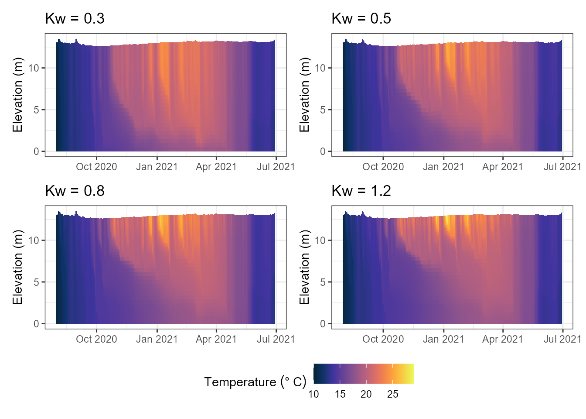

# Testing Parameters Without a Full Rebuild

## Introduction

[`build_aeme()`](https://limnotrack.com/reference/build_aeme.md) -\>
[`run_aeme()`](https://limnotrack.com/reference/run_aeme.md) is the
right pipeline for a real ensemble run, but re-running the whole `Aeme`
object just to check what one parameter does is slow, and doesn’t matter
for a five-minute “does this move the answer in the direction I expect”
check. Two lower-level tools skip the `Aeme` object entirely and work
straight on a model’s configuration directory:

- [`get_glm_param()`](https://limnotrack.com/reference/get_glm_param.md)/[`set_glm_param()`](https://limnotrack.com/reference/set_glm_param.md)
  (and the GOTM-WET/DYRESM-CAEDYM/ Simstrat-AED2 equivalents) – read or
  write one parameter in the raw config file.
- [`run_model_test()`](https://limnotrack.com/reference/run_model_test.md)
  – apply a batch of changes (parameters, initial conditions, inflows,
  outflows) and run, all from a path alone.

Both need an existing build to work on – they edit files
[`build_aeme()`](https://limnotrack.com/reference/build_aeme.md) already
wrote, they don’t create one.

``` r

library(AEME)

# Plotting libraries for the scenario comparison at the end
library(ggplot2)
library(patchwork)
```

``` r

tmpdir <- tempdir()
aeme_dir <- system.file("extdata/lake/", package = "AEME")
file.copy(aeme_dir, tmpdir, recursive = TRUE)
path <- file.path(tmpdir, "lake")

aeme <- yaml_to_aeme(path = path, "aeme.yaml")
#> Warning: `yaml_to_aeme()` was deprecated in AEME 0.4.0.
#> ℹ Use `aeme_constructor()` to build an Aeme object from your own lake data, or
#>   `new_aeme()` for a quick placeholder object to populate incrementally,
#>   instead of a yaml file.
#> This warning is displayed once per session.
#> Call `lifecycle::last_lifecycle_warnings()` to see where this warning was
#> generated.
model_controls <- get_model_controls(use_bgc = FALSE)
model <- "glm_aed"

aeme <- build_aeme(path = path, aeme = aeme, model = model,
                   model_controls = model_controls, ext_elev = 5,
                   use_bgc = FALSE)
#> Warning: ! `SIL_rsi`: SIL_rsi is constant across all rows -- this may be a placeholder
#>   value.
#> ℹ Check raw data or unit conversion for this variable.
#> Warning: GLM ignores the AirPres met column in daily mode and uses the default 1013.25 hPa instead.
#> This warning is displayed once per session.
path_glm <- file.path(get_lake_dir(aeme, path), "glm_aed")
```

## Reading and setting one parameter

`path_glm` now points at a real, built GLM-AED configuration directory.
[`get_glm_param()`](https://limnotrack.com/reference/get_glm_param.md)
reads a value straight out of the nml, wherever it’s nested:

``` r

get_glm_param(path_glm, "Kw")
#> [1] 1.31
```

[`set_glm_param()`](https://limnotrack.com/reference/set_glm_param.md)
writes one back – multiple `name = value` pairs in one call, no need to
know which `&block` each belongs to:

``` r

set_glm_param(path_glm, Kw = 0.8, coef_mix_hyp = 0.3)
get_glm_param(path_glm, "Kw")
#> [1] 0.8
```

This is a permanent edit to the file on disk (there’s no `Aeme` object
tracking it), so it’s ideal for a quick before/after comparison but not
for anything you want to reproduce later – keep the parameter table
AEME’s calibration tools use (see
[`vignette("aeme-inputs")`](https://limnotrack.com/articles/aeme-inputs.md))
as the record for anything that matters.

The AED biogeochemistry file takes the same call, passed explicitly via
`glm_file`:

``` r

set_glm_param(path_glm, glm_file = file.path(path_glm, "aed", "aed.nml"),
             theta_sed_oxy = 1.08)
```

GOTM-WET, DYRESM-CAEDYM and Simstrat-AED2 configuration directories work
the same way, with
[`get_gotm_param()`](https://limnotrack.com/reference/get_gotm_param.md)/[`set_gotm_param()`](https://limnotrack.com/reference/set_gotm_param.md),
[`get_dy_cd_param()`](https://limnotrack.com/reference/get_dy_cd_param.md)/[`set_dy_cd_param()`](https://limnotrack.com/reference/set_dy_cd_param.md),
and
[`get_simstrat_param()`](https://limnotrack.com/reference/get_simstrat_param.md)/[`set_simstrat_param()`](https://limnotrack.com/reference/set_simstrat_param.md).

## Running a what-if scenario

[`run_model_test()`](https://limnotrack.com/reference/run_model_test.md)
goes one step further: apply a batch of overrides and run the model, in
one call, without touching the `Aeme` object at all.

``` r

out <- run_model_test("glm_aed", path_glm,
                      param_overrides = list(Kw = 0.5),
                      tgt_vars = "HYD_temp")
#> ℹ GLM-AED running... [2026-10-09 01:25:46]
#> ✔ GLM-AED running... [2026-10-09 01:25:47] [500ms]
#> 
```

The parameter change is written to disk exactly as
[`set_glm_param()`](https://limnotrack.com/reference/set_glm_param.md)
would:

``` r

get_glm_param(path_glm, "Kw")
#> [1] 0.5
```

`param_overrides` is forwarded to
[`set_glm_param()`](https://limnotrack.com/reference/set_glm_param.md),
so any parameter name that works there works here. `init`, `inflow_args`
and `outflow_args` reach the model’s
`set_*_init()`/`set_*_inflows()`/`set_*_outflows()` wrappers the same
way – e.g. to test a different initial temperature profile without
re-running
[`build_aeme()`](https://limnotrack.com/reference/build_aeme.md):

``` r

run_model_test("glm_aed", path_glm,
              init = list(temp = seq(20, 10, length.out = 10)),
              tgt_vars = "HYD_temp")
```

### Reading back the result

`out` is the model’s own reader output
([`read_glm_output()`](https://limnotrack.com/reference/read_glm_output.md),
for `model = "glm_aed"`) – `tgt_vars` names what you’re interested in,
but the reader’s own diagnostic fields (lake level, heat fluxes, ice,
meteorology echoed back, …) still come along with it:

``` r

dim(out$HYD_temp)
#> [1]  42 335
out$HYD_temp[1:3, 1:3]
#>         [,1]    [,2]    [,3]
#> [1,] 10.2704 10.4809 10.6871
#> [2,] 10.2597 10.4792 10.6871
#> [3,] 10.1990 10.4290 10.6871
```

`out$HYD_temp` is a `[depth x time]` matrix, matching what
[`get_var()`](https://limnotrack.com/reference/get_var.md) returns from
a full `Aeme` object – so the same downstream code (plotting, summary
statistics) works whichever path produced it.

### Comparing scenarios

The pattern for comparing a handful of candidate values: loop,
collecting one `tgt_vars` matrix per scenario.

``` r

kw_values <- c(0.3, 0.5, 0.8, 1.2)
results <- lapply(kw_values, function(kw) {
  run_model_test("glm_aed", path_glm, param_overrides = list(Kw = kw),
                 tgt_vars = "HYD_temp")
})
#> ℹ GLM-AED running... [2026-10-09 01:25:48]
#> ✔ GLM-AED running... [2026-10-09 01:25:48] [498ms]
#> 
#> ℹ GLM-AED running... [2026-10-09 01:25:49]
#> ✔ GLM-AED running... [2026-10-09 01:25:50] [477ms]
#> 
#> ℹ GLM-AED running... [2026-10-09 01:25:51]
#> ✔ GLM-AED running... [2026-10-09 01:25:51] [489ms]
#> 
#> ℹ GLM-AED running... [2026-10-09 01:25:52]
#> ✔ GLM-AED running... [2026-10-09 01:25:52] [506ms]
#> 
names(results) <- paste0("Kw_", kw_values)
```

``` r

plist <- lapply(seq_along(results), \(i) {
  plot_model_output(results[[i]], var_sim = "HYD_temp", var_lims = c(10, 29)) +
    ggtitle(paste0("Kw = ", kw_values[i]))
})

wrap_plots(plist, ncol = 2, guides = "collect") & 
  theme(legend.position = "bottom")
#> Warning: Removed 84 rows containing missing values or values outside the scale range
#> (`geom_col()`).
#> Removed 84 rows containing missing values or values outside the scale range
#> (`geom_col()`).
#> Removed 84 rows containing missing values or values outside the scale range
#> (`geom_col()`).
#> Removed 84 rows containing missing values or values outside the scale range
#> (`geom_col()`).
```



For anything past a handful of candidates – a real sensitivity sweep or
a calibration – reach for aemetools instead
([`aemetools::run_aeme_param()`](https://limnotrack.github.io/aemetools/reference/run_aeme_param.html)/[`sa_aeme()`](https://limnotrack.github.io/aemetools/reference/sa_aeme.html)/[`calib_aeme()`](https://limnotrack.github.io/aemetools/reference/calib_aeme.html)),
which builds on the same idea but works from the full parameter table
and the `Aeme` object, with proper sampling designs and PEST++
integration.

### When something goes wrong

By default (`safe = TRUE`) a failed edit or model run is caught and
reported with a message rather than stopping – useful when looping over
many candidate scenarios and one bad combination shouldn’t abort the
rest:

``` r

run_model_test("glm_aed", path_glm, param_overrides = list(lake_depth = -1))
# message: run_model_test error: ... ; returns NULL rather than erroring
```

Set `safe = FALSE` while developing a scenario, so a mistake surfaces
immediately instead of silently returning `NULL`.

## Next steps

`vignette("visualising-output")` covers turning `out$HYD_temp` (or the
`Aeme` object itself) into the plots this kind of comparison is usually
for.
