# Visualising AEME Output

## Introduction

`plot(aeme, "output")` and friends – the S4 dispatcher used throughout
the other vignettes – cover the common case. Underneath it, AEME ships a
wider set of purpose-built plotting functions: multi-variable
timeseries, group plots for individual biogeochemical modules, residuals
against observations, and diagnostics on the inputs (hypsograph,
meteorology, flows) rather than the output. This vignette works through
them using one small built model.

``` r

library(AEME)
library(ggplot2)
options(AEME.inform = FALSE)
```

``` r

aeme_file <- system.file("extdata/aeme.rds", package = "AEME")
aeme <- readRDS(aeme_file)

model_controls <- get_model_controls(use_bgc = TRUE)
model <- "glm_aed"
path <- tempdir()

aeme <- build_aeme(path = path, aeme = aeme, model = model,
                   model_controls = model_controls, ext_elev = 5,
                   use_bgc = TRUE)
#> Warning: ! `SIL_rsi`: SIL_rsi is constant across all rows -- this may be a placeholder
#>   value.
#> ℹ Check raw data or unit conversion for this variable.
#> Warning: GLM ignores the AirPres met column in daily mode and uses the default 1013.25 hPa instead.
#> This warning is displayed once per session.
aeme <- run_aeme(aeme = aeme, verbose = FALSE)
```

## Timeseries

[`plot_ts()`](https://limnotrack.com/reference/plot_ts.md) is the
general-purpose multi-variable plot – pass one or more `var_sim`, and it
facets automatically. Observations overlay by default (`add_obs = TRUE`)
where the `Aeme` object has them.

``` r

plot_ts(aeme, model = model, var_sim = c("HYD_temp", "CHM_oxy"))
```

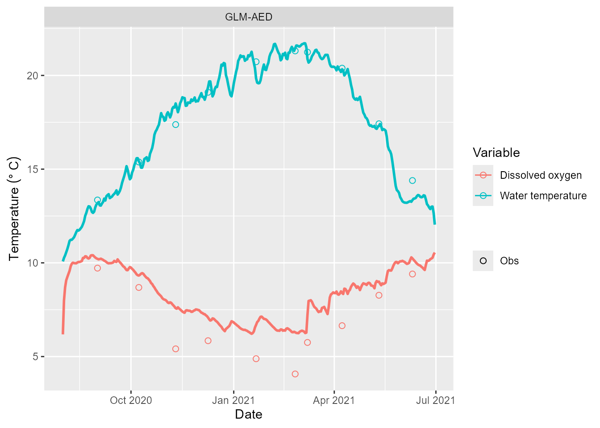

Restrict to a depth range (e.g. surface only) with `depth_range`:

``` r

plot_ts(aeme, model = model, var_sim = "HYD_temp", depth_range = c(0, 2))
```

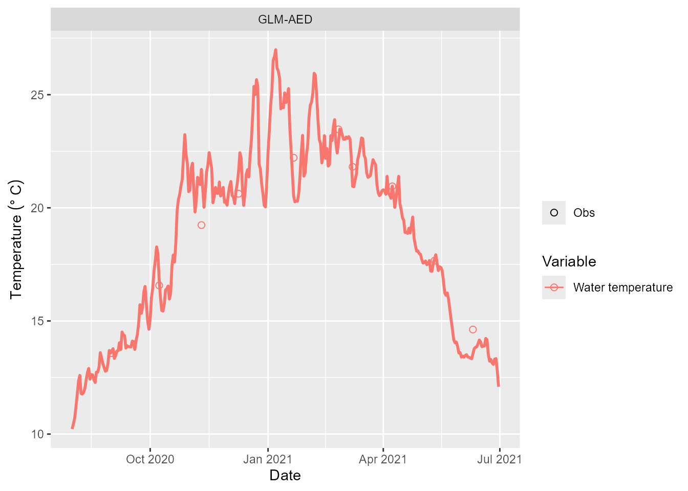

[`plot_var()`](https://limnotrack.com/reference/plot_var.md) is the
lower-level building block
[`plot_ts()`](https://limnotrack.com/reference/plot_ts.md) is written on
top of – reach for it directly when you already have a `data.frame` from
[`get_var()`](https://limnotrack.com/reference/get_var.md) and want the
same plot style without re-deriving it from the `Aeme` object:

``` r

df <- get_var(aeme, model = model, var_sim = "HYD_temp", return_df = TRUE)
plot_var(df = df, aeme = aeme, model = model, var_sim = "HYD_temp")
#> $`GLM-AED`
#> Warning: Removed 84 rows containing missing values or values outside the scale range
#> (`geom_col()`).
```

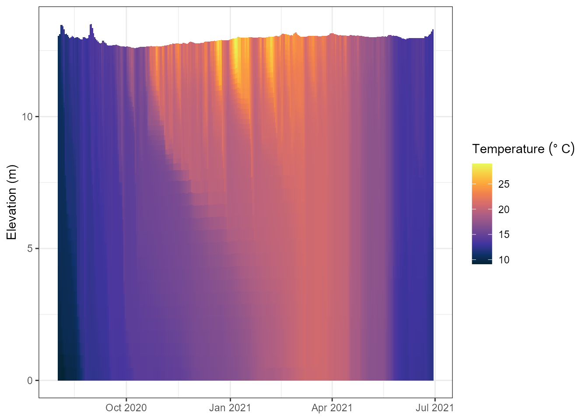

## Observations and residuals

[`plot_obs()`](https://limnotrack.com/reference/plot_obs.md) shows the
observation record alone – useful for checking coverage before deciding
what to calibrate against (see also
[`summarise_obs()`](https://limnotrack.com/reference/summarise_obs.md)
in
[`vignette("setup-new-lake")`](https://limnotrack.com/articles/setup-new-lake.md)):

``` r

plot_obs(aeme, var_sim = "HYD_temp")
```

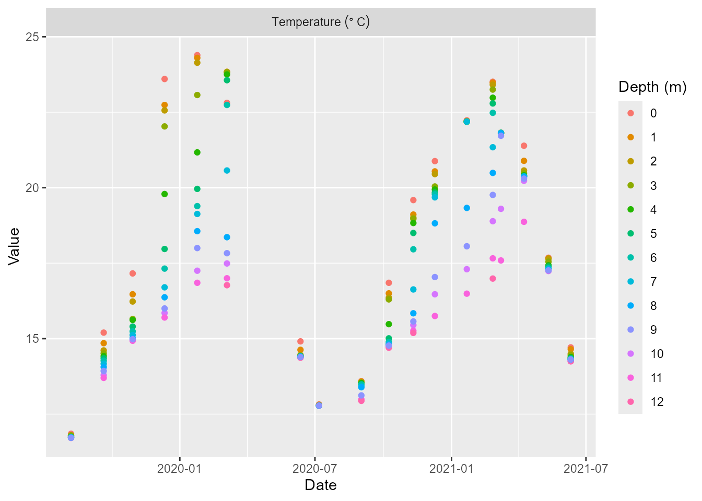

[`plot_resid()`](https://limnotrack.com/reference/plot_resid.md) plots
modelled-minus-observed directly, rather than the two series overlaid –
the faster way to see whether a model is biased high/low versus just
imprecise:

``` r

plot_resid(aeme, model = model, var_sim = "HYD_temp")
```

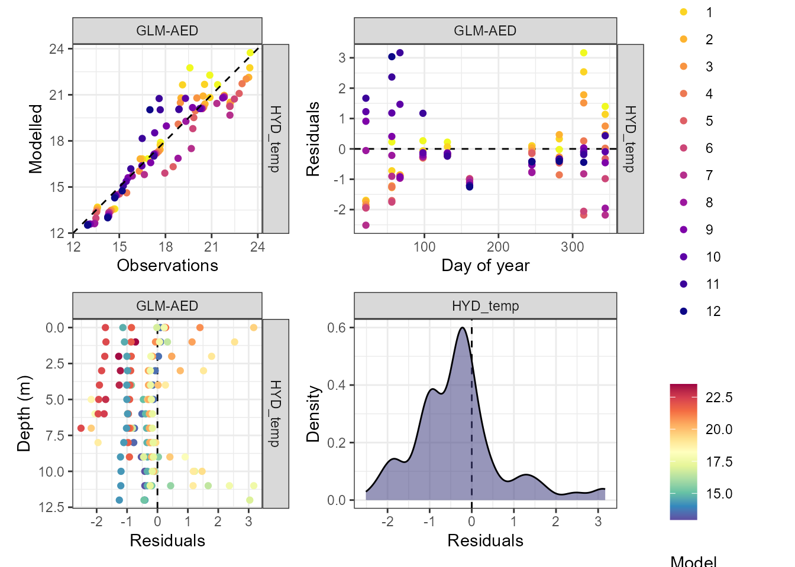

## Biogeochemical group plots

Each major AED module has its own plot, all sharing the
[`plot_ts()`](https://limnotrack.com/reference/plot_ts.md) argument
shape (`add_obs`, `depth_range`, `remove_spin_up`, `ens_n`):

``` r

plot_nit(aeme)
```

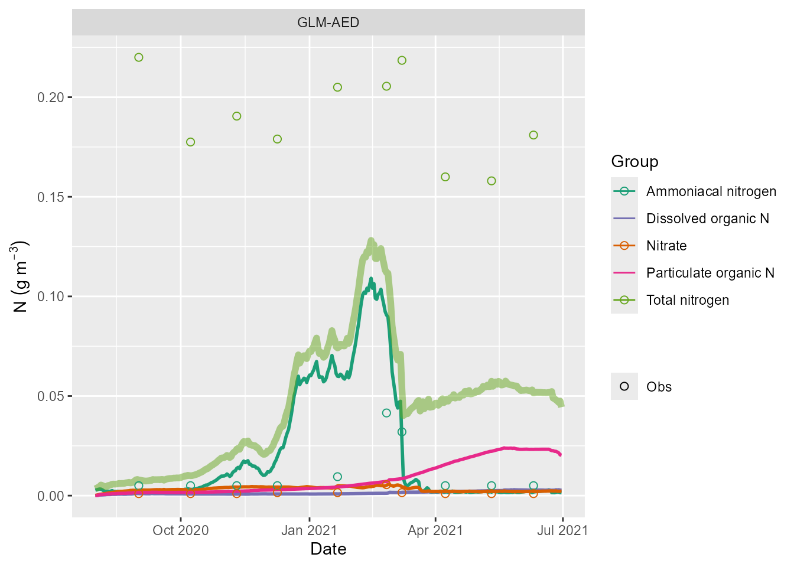

``` r

plot_phs(aeme)      # phosphorus
#> Warning: ! Some variables are missing or invalid in model output:
#> glm_aed: PHS_pip
```

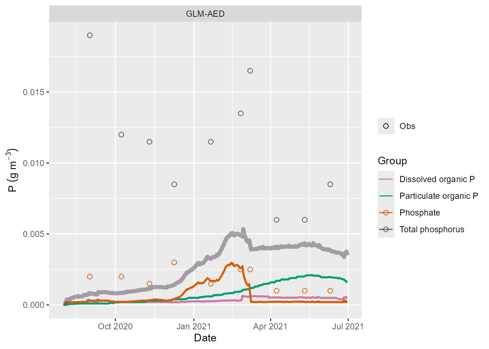

``` r

plot_car(aeme)      # carbon
```

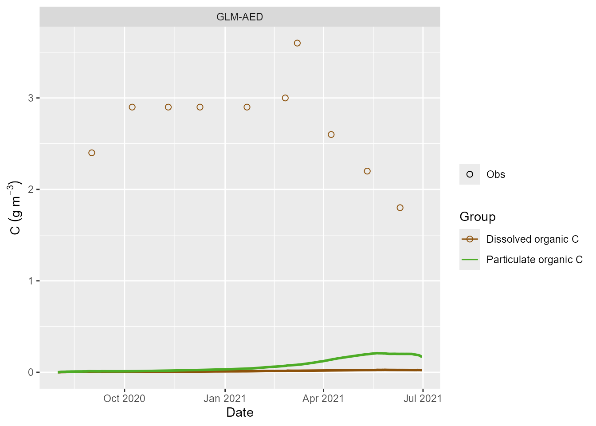

``` r

plot_phytos(aeme)   # phytoplankton groups
```

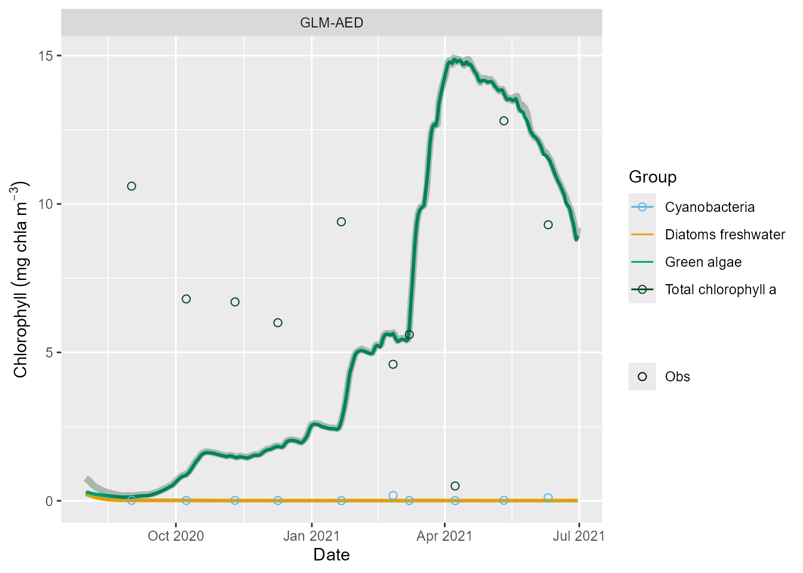 Similarly,
[`plot_zoops()`](https://limnotrack.com/reference/plot_zoops.md) shows
the zooplankton groups but requires the zooplankton module to be active
in the model configuration. This example’s minimal config does not carry
zooplankton/full phyto groups.

``` r

plot_zoops(aeme)    # zooplankton groups
```

## Inputs, not output

Three functions plot what went *into* the model rather than what came
out – useful when a run looks wrong and the question is whether the
forcing data is the problem.

Meteorology, as a tile plot (one row per variable, coloured by value,
faceted by hydrological year):

``` r

plot_met_tile(aeme, var_inp = "MET_tmpair")
```

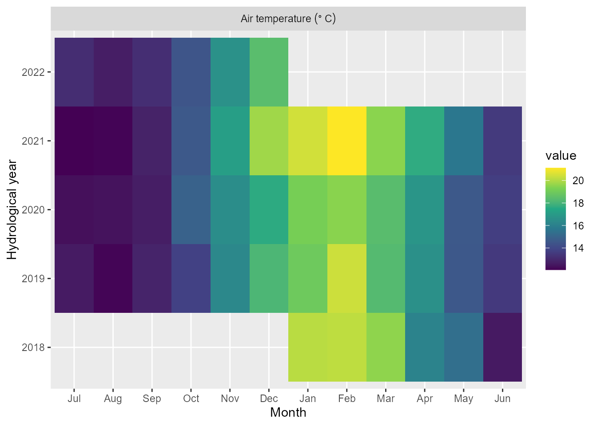

The hypsograph the model was built with:

``` r

plot_hyps(aeme)
```

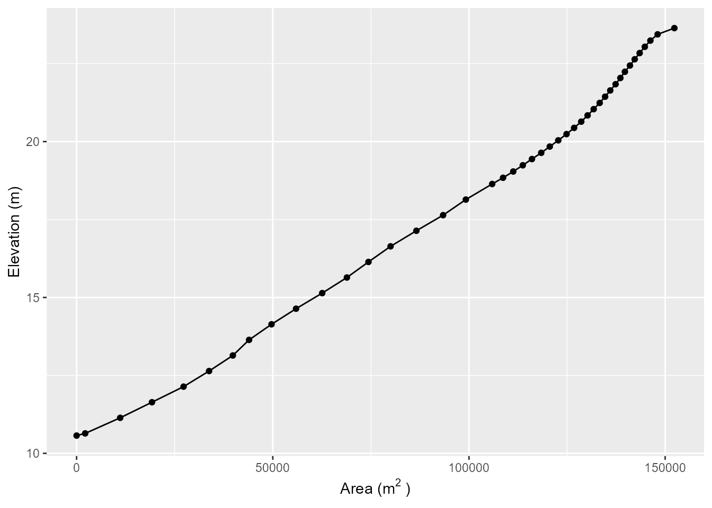

Inflows and/or outflows:

``` r

plot_flows(aeme, flow = "inflow")
```

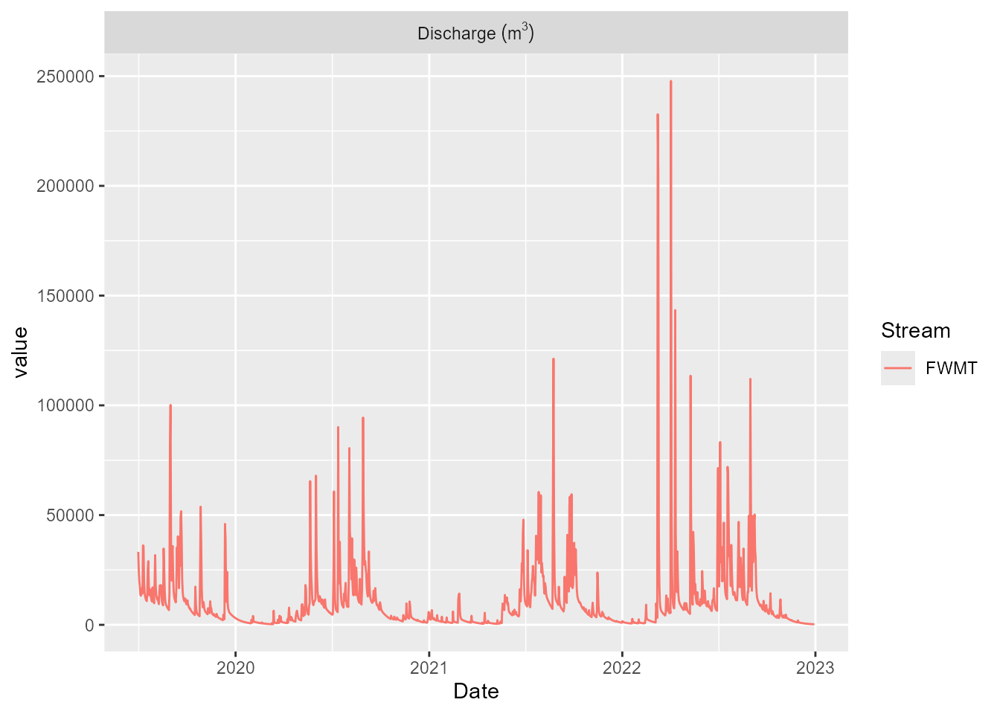

Cumulative heat fluxes (e.g. checking an energy budget):

``` r

plot_fluxes(aeme, cumulative = TRUE)
```

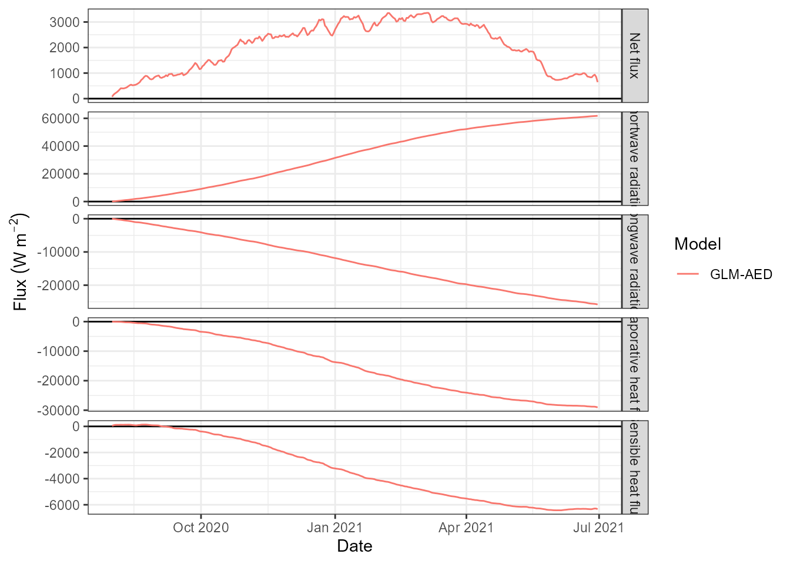

## Working with a raw output list

[`plot_model_output()`](https://limnotrack.com/reference/plot_model_output.md)
is the lowest-level of the plotting functions: pass it an `Aeme` object
directly, as below, or – its other accepted input – the specifically
classed list
[`read_glm_output()`](https://limnotrack.com/reference/read_glm_output.md)/[`read_gotm_output()`](https://limnotrack.com/reference/read_gotm_output.md)/
[`read_simstrat_output()`](https://limnotrack.com/reference/read_simstrat_output.md)/[`read_dy_output()`](https://limnotrack.com/reference/read_dy_output.md)/[`read_model_outputs()`](https://limnotrack.com/reference/read_model_outputs.md)
return (`output(aeme)` itself is a plain list and isn’t accepted; use
one of those readers if you need output outside the `Aeme` object). It’s
what every other `plot_*` function on this page is ultimately built on:

``` r

outfile <- get_model_outfile(aeme, model = "glm_aed")$glm_aed
outfile
#>                                                                                         output 
#> "C:/Users/runneradmin/AppData/Local/Temp/RtmpWWYQW5/LID45819_wainamu/glm_aed/output/output.nc"
```

[`read_glm_output()`](https://limnotrack.com/reference/read_glm_output.md)
reads the model output, projects onto a standard grid and also does some
unit conversions, especially for the AED variables that are stored in
mmol/m3 in the raw output but are more commonly expressed in mg/L.

``` r

out <- read_glm_output(file = outfile)
plot_model_output(out, var_sim = "CHM_oxy")
#> Warning: Removed 84 rows containing missing values or values outside the scale range
#> (`geom_col()`).
```

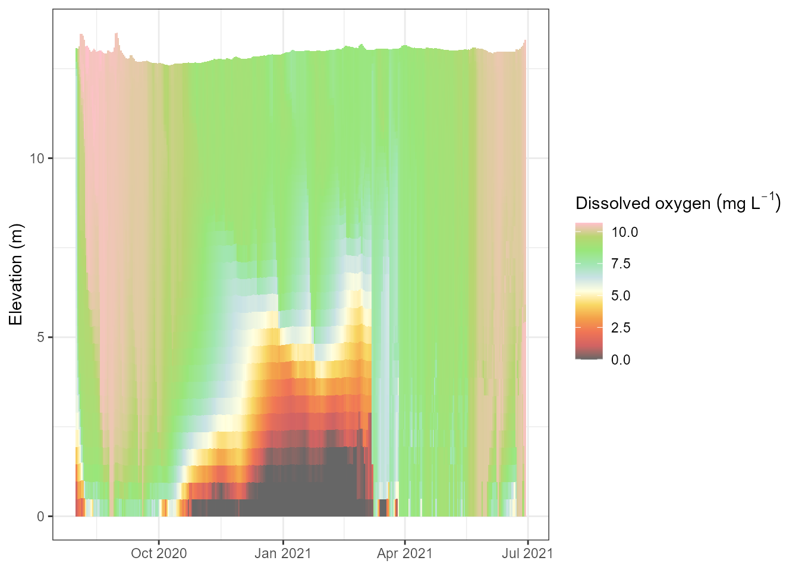

However, you can also load all raw output from the GLM netcdf output
file and plot any variable in its raw form e.g. model units and
Lagrangian grid, rather than the standardised grid and converted units.
This is useful for plotting variables that are not included in the
`Aeme` object by default. You need to use the raw variable name for
plotting instead of the standardised AEME variable name.

``` r

raw <- read_glm_output(file = outfile, raw = TRUE, load_all = TRUE)
raw
#> <aeme_output_raw> model: glm_aed
#>   raw model units/names/depths (no AEME standardisation)
#>   335 dates (2020-07-31 to 2021-06-30)
#>   232 variables: lake_level, daily_qe, daily_qh, daily_qlw, daily_qsw, lake_volume, evaporation, evap_mass_flux, surface_area, LKE_evprte, tot_inflow_vol, overflow_vol, tot_outflow_vol, LKE_outftot, precipitation, LKE_pcpvol, surface_temp, z, NS, blue_ice_thickness, snow_thickness, white_ice_thickness, surface_layer, solar, wind, vol_snow, vol_blue_ice, vol_white_ice, rain, local_runoff, snowfall, seepage_vol, snow_density, albedo, max_temp, min_temp, Qsw, Qe, Qh, Qlw, light, benthic_light, surface_wave_height, surface_wave_length, surface_wave_period, lake_number, max_dT_dz, CD, CHE, z_L, H, V, A, salt, temp, dens, radn, extc, umean, uorb, taub, epsilon, NCS_ss1, NCS_ss1_vvel, NCS_ss1_set, NCS_ss2, NCS_ss2_vvel, NCS_ss2_set, NCS_set, OXY_oxy, OXY_sat, OXY_oxy_dsfv, OXY_oxy_atmv, SIL_rsi, NIT_amm, NIT_nit, NIT_nitrif, NIT_denit, NIT_anammox, NIT_dnra, PHS_frp, OGM_doc, OGM_poc, OGM_don, OGM_pon, OGM_dop, OGM_pop, OGM_docr, OGM_donr, OGM_dopr, OGM_cpom, OGM_poc_set, OGM_cpom_set, OGM_pon_set, OGM_pop_set, OGM_cdom, OGM_poc_hyd, OGM_pon_hyd, OGM_pop_hyd, OGM_doc_min, OGM_don_min, OGM_dop_min, OGM_doc_anaerobic, OGM_doc_denit, OGM_docr_min, OGM_donr_min, OGM_dopr_min, OGM_cpom_bdown, OGM_bod5, OGM_pom_vvel, OGM_cpom_vvel, PHY_cyano, PHY_cyano_IN, PHY_cyano_IP, PHY_cyano_NtoP, PHY_cyano_set_c, PHY_cyano_set_n, PHY_cyano_set_p, PHY_cyano_fI, PHY_cyano_fNit, PHY_cyano_fPho, PHY_cyano_fSil, PHY_cyano_fT, PHY_cyano_fSal, PHY_cyano_gpp_c, PHY_cyano_rsp_c, PHY_cyano_exc_c, PHY_cyano_mor_c, PHY_cyano_gpp_n, PHY_cyano_rsp_n, PHY_cyano_exc_n, PHY_cyano_mor_n, PHY_cyano_gpp_p, PHY_cyano_rsp_p, PHY_cyano_exc_p, PHY_cyano_mor_p, PHY_green, PHY_green_IN, PHY_green_IP, PHY_green_NtoP, PHY_green_set_c, PHY_green_set_n, PHY_green_set_p, PHY_green_fI, PHY_green_fNit, PHY_green_fPho, PHY_green_fSil, PHY_green_fT, PHY_green_fSal, PHY_green_gpp_c, PHY_green_rsp_c, PHY_green_exc_c, PHY_green_mor_c, PHY_green_gpp_n, PHY_green_rsp_n, PHY_green_exc_n, PHY_green_mor_n, PHY_green_gpp_p, PHY_green_rsp_p, PHY_green_exc_p, PHY_green_mor_p, PHY_diatom, PHY_diatom_IN, PHY_diatom_IP, PHY_diatom_NtoP, PHY_diatom_set_c, PHY_diatom_set_n, PHY_diatom_set_p, PHY_diatom_fI, PHY_diatom_fNit, PHY_diatom_fPho, PHY_diatom_fSil, PHY_diatom_fT, PHY_diatom_fSal, PHY_diatom_gpp_c, PHY_diatom_rsp_c, PHY_diatom_exc_c, PHY_diatom_mor_c, PHY_diatom_gpp_n, PHY_diatom_rsp_n, PHY_diatom_exc_n, PHY_diatom_mor_n, PHY_diatom_gpp_p, PHY_diatom_rsp_p, PHY_diatom_exc_p, PHY_diatom_mor_p, PHY_tchla, PHY_tphy, PHY_in, PHY_ip, PHY_gpp, PHY_ncp, PHY_upt_no3, PHY_upt_nh4, PHY_upt_n2, PHY_upt_po4, PHY_upt_dic, PHY_set, PHY_par, TOT_tn, TOT_tp, TOT_toc, TOT_tss, SDF_Fsed_oxy, SDF_Fsed_amm, SDF_Fsed_nit, SDF_Fsed_frp, NCS_swi, NCS_swi_dz, NCS_resus, NCS_d_taub, OXY_oxy_dsf, OXY_oxy_atm, SIL_dsf_rsi, NIT_amm_dsf, NIT_nit_dsf, PHS_frp_dsf, OGM_toc_sed, OGM_ton_sed, OGM_top_sed, OGM_poc_swi, OGM_doc_swi, OGM_pon_swi, OGM_don_swi, OGM_pop_swi, OGM_dop_swi, OGM_poc_res, OGM_pon_res, OGM_pop_res, PHY_phy_swi_c, PHY_phy_swi_n, PHY_phy_swi_p
#>   34 sediment variables: zarea, sed_temp, sed_heatflux, zone_ztemp, sed_layer_depth, SDF_Fsed_oxy_Z, SDF_Fsed_amm_Z, SDF_Fsed_nit_Z, SDF_Fsed_frp_Z, NCS_swi_Z, NCS_swi_dz_Z, NCS_resus_Z, NCS_d_taub_Z, OXY_oxy_dsf_Z, OXY_oxy_atm_Z, SIL_dsf_rsi_Z, NIT_amm_dsf_Z, NIT_nit_dsf_Z, PHS_frp_dsf_Z, OGM_toc_sed_Z, OGM_ton_sed_Z, OGM_top_sed_Z, OGM_poc_swi_Z, OGM_doc_swi_Z, OGM_pon_swi_Z, OGM_don_swi_Z, OGM_pop_swi_Z, OGM_dop_swi_Z, OGM_poc_res_Z, OGM_pon_res_Z, OGM_pop_res_Z, PHY_phy_swi_c_Z, PHY_phy_swi_n_Z, PHY_phy_swi_p_Z
```

``` r

plot_model_output(raw, var_sim = "OXY_oxy")
#> Warning: Removed 89687 rows containing missing values or values outside the scale range
#> (`geom_col()`).
```

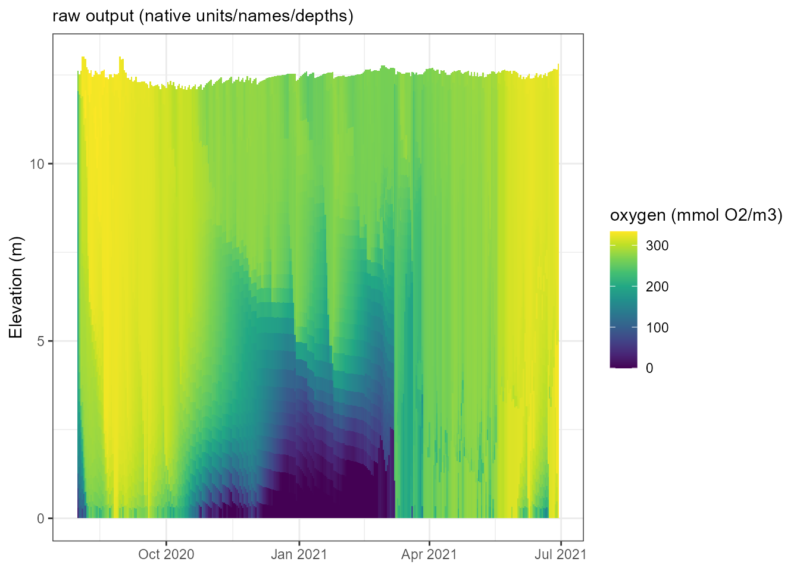

The AED sediment fluxes, which are not included in the `Aeme` object by
default. For example, to plot the sediment oxygen flux:

``` r

plot_model_output(raw, var_sim = "SDF_Fsed_oxy_Z")
#> Warning: Removed 335 rows containing missing values or values outside the scale range
#> (`geom_line()`).
```

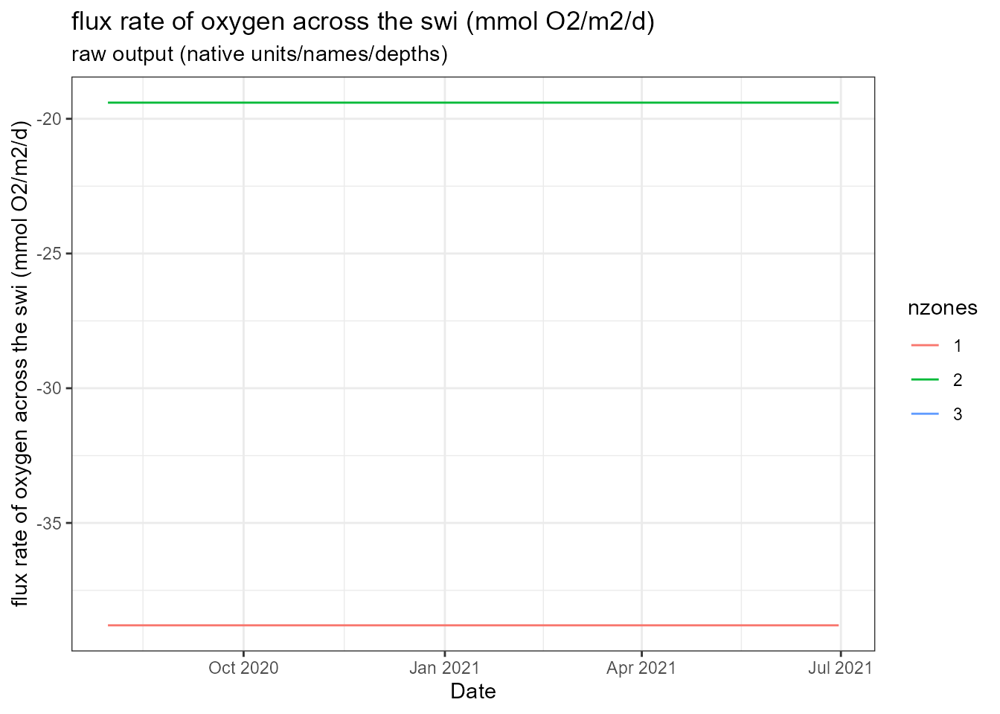

## Next steps

`vignette("testing-parameters")` covers changing a parameter and
re-running without a full rebuild – these plotting functions are the
natural way to compare the result against what you started with.
